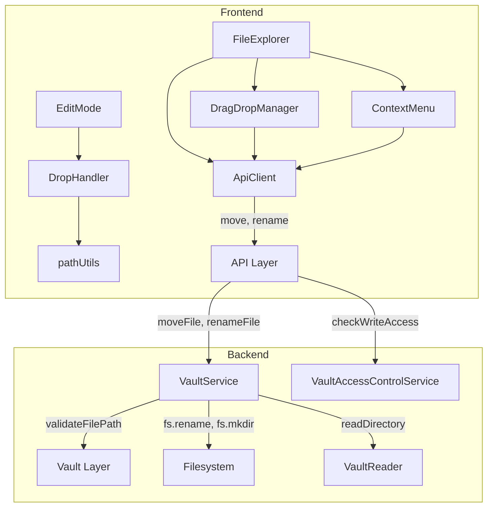
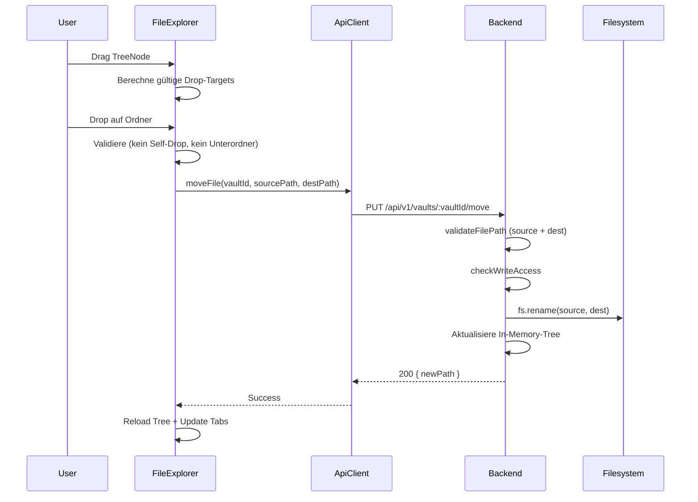

# Design Document: Advanced File Operations

## Overview

Dieses Design beschreibt die technische Umsetzung erweiterter Dateioperationen für Slatebase: Drag & Drop zum Verschieben von Dateien/Ordnern, Kontextmenüs (Erstellen, Umbenennen, Löschen) und das Einfügen von Markdown-Links durch Ziehen einer Datei in den Editor.

Das Feature erweitert sowohl das Backend (zwei neue API-Endpoints: Move und Rename) als auch das Frontend (Drag & Drop-Logik, Kontextmenü-Komponente, Editor-Drop-Handler). Die Architektur folgt dem bestehenden Layered-Pattern mit Interface-First-Design.

### Design-Entscheidungen

1. **Zwei separate Endpoints (Move vs. Rename):** Move verschiebt an einen neuen Pfad (ggf. mit Verzeichniswechsel), Rename ändert nur den Namen im selben Verzeichnis. Die Trennung vereinfacht Validierung und Fehlerbehandlung.
2. **Frontend-seitige Drop-Target-Berechnung:** Gültige Drop-Ziele werden im Browser berechnet (kein Server-Roundtrip nötig), da die Baumstruktur bereits im State vorliegt.
3. **Tab-Pfad-Aktualisierung im Reducer:** Nach Move/Rename werden betroffene Tabs über eine neue `UPDATE_TAB_PATHS`-Action aktualisiert, statt alle Tabs zu schließen und neu zu öffnen.
4. **Kontextmenü als Portal mit `position: fixed`:** Vermeidet Abschneiden durch `overflow: hidden`-Container (bekanntes Pattern aus den Lessons Learned).
5. **Relative Pfadberechnung im Frontend:** Der Markdown-Link-Pfad wird clientseitig berechnet, da beide Pfade (Quelle und Ziel) bereits bekannt sind.

## Architecture



### Datenfluss: Drag & Drop Move



## Components and Interfaces

### Backend — Neue Methoden in IVaultService

```typescript
export interface IVaultService {
  // ... bestehende Methoden ...
  
  /**
   * Verschiebt eine Datei oder einen Ordner innerhalb eines Vaults.
   * Erstellt fehlende Zwischenverzeichnisse automatisch.
   * Aktualisiert den In-Memory-Verzeichnisbaum.
   * 
   * @throws VaultNotFoundError - Vault existiert nicht
   * @throws PathTraversalError - Pfad-Traversal erkannt
   * @throws StorageError - Dateisystem-Fehler
   */
  moveContent(vaultId: string, sourcePath: string, destinationPath: string): Promise<{ newPath: string }>

  /**
   * Benennt eine Datei oder einen Ordner innerhalb eines Vaults um.
   * Aktualisiert den In-Memory-Verzeichnisbaum.
   * 
   * @throws VaultNotFoundError - Vault existiert nicht
   * @throws PathTraversalError - Pfad-Traversal erkannt
   * @throws StorageError - Dateisystem-Fehler
   */
  renameContent(vaultId: string, filePath: string, newName: string): Promise<{ newPath: string }>
}
```

### Backend — Neue Error-Klassen

```typescript
/** Thrown when a move destination is a subdirectory of the source. */
export class InvalidMoveError extends Error {
  constructor(
    public readonly sourcePath: string,
    public readonly destinationPath: string,
  ) {
    super(`Cannot move '${sourcePath}' into its own subdirectory '${destinationPath}'`)
    this.name = 'InvalidMoveError'
  }
}

/** Thrown when a file/folder already exists at the target path. */
export class FileConflictError extends Error {
  constructor(public readonly targetPath: string) {
    super(`A file or folder already exists at: ${targetPath}`)
    this.name = 'FileConflictError'
  }
}

/** Thrown when a rename target name contains invalid characters. */
export class InvalidNameError extends Error {
  constructor(
    public readonly name: string,
    public readonly reason: string,
  ) {
    super(`Invalid name '${name}': ${reason}`)
    this.name = 'InvalidNameError'
  }
}
```

### Backend — Controller-Erweiterung

```typescript
export interface IVaultController {
  // ... bestehende Methoden ...
  moveContent(c: Context): Promise<Response>
  renameContent(c: Context): Promise<Response>
}
```

### Backend — Neue Routen

| Method | Path | Purpose |
|--------|------|---------|
| PUT | /api/v1/vaults/:vaultId/move | Datei/Ordner verschieben |
| PUT | /api/v1/vaults/:vaultId/rename | Datei/Ordner umbenennen |

### Frontend — IApiClient-Erweiterung

```typescript
export interface IApiClient {
  // ... bestehende Methoden ...
  
  /** Verschiebt eine Datei/Ordner innerhalb eines Vaults. */
  moveContent(vaultId: string, sourcePath: string, destinationPath: string): Promise<{ newPath: string }>
  
  /** Benennt eine Datei/Ordner um. */
  renameContent(vaultId: string, path: string, newName: string): Promise<{ newPath: string }>
}
```

### Frontend — Neue Komponenten

```typescript
/** Props für das Kontextmenü. */
interface ContextMenuProps {
  x: number
  y: number
  node: DirectoryTree
  permission: 'owner' | 'read' | 'write'
  onClose: () => void
  onNewFile: (parentPath: string) => void
  onRename: (node: DirectoryTree) => void
  onDelete: (node: DirectoryTree) => void
}

/** Props für das Inline-Eingabefeld (Neue Datei / Umbenennen). */
interface InlineInputProps {
  initialValue: string
  selectRange?: [number, number]  // Start, End der Selektion
  onConfirm: (value: string) => void
  onCancel: () => void
  validate: (value: string) => string | null  // null = valid, string = error message
}
```

### Frontend — Neue Utility-Funktionen

```typescript
// frontend/src/utils/pathUtils.ts

/**
 * Berechnet den relativen Pfad von einer Quelldatei zu einer Zieldatei.
 * Verwendet POSIX-Pfade (Forward-Slashes).
 */
export function computeRelativePath(fromFilePath: string, toFilePath: string): string

/**
 * Bestimmt ob eine Datei eine Bilddatei ist (anhand der Extension).
 */
export function isImageFile(fileName: string): boolean

/**
 * Validiert einen Dateinamen gegen ungültige Zeichen und Längenbeschränkungen.
 */
export function validateFileName(name: string, maxLength?: number): string | null

/**
 * Berechnet gültige Drop-Targets für einen gezogenen Knoten.
 * Schließt den Knoten selbst und alle seine Nachkommen aus.
 */
export function getValidDropTargets(tree: DirectoryTree, draggedPath: string): Set<string>

/**
 * Berechnet die Position eines Kontextmenüs unter Berücksichtigung der Viewport-Grenzen.
 * Stellt sicher, dass das Menü mindestens 8px Abstand zum Viewport-Rand hat.
 */
export function clampMenuPosition(
  x: number, y: number,
  menuWidth: number, menuHeight: number,
  viewportWidth: number, viewportHeight: number,
): { x: number; y: number }
```

### Frontend — Tab-Reducer-Erweiterung

```typescript
export type TabAction =
  | // ... bestehende Actions ...
  | { type: 'UPDATE_TAB_PATHS'; payload: { oldPathPrefix: string; newPathPrefix: string } }
  | { type: 'CLOSE_TABS_BY_PATH'; payload: { pathPrefix: string } }
```

## Data Models

### Move Request/Response

```typescript
// Request Body: PUT /api/v1/vaults/:vaultId/move
interface MoveRequest {
  sourcePath: string       // Relativer Pfad der Quelle (nicht leer)
  destinationPath: string  // Relativer Pfad des Zielordners (nicht leer)
}

// Response Body: 200 OK
interface MoveResponse {
  newPath: string  // Neuer relativer Pfad nach dem Verschieben
}
```

### Rename Request/Response

```typescript
// Request Body: PUT /api/v1/vaults/:vaultId/rename
interface RenameRequest {
  path: string     // Relativer Pfad der Datei/des Ordners (nicht leer)
  newName: string  // Neuer Name (nicht leer, max 255 Zeichen, keine /, \, \0)
}

// Response Body: 200 OK
interface RenameResponse {
  newPath: string  // Neuer vollständiger relativer Pfad
}
```

### Frontend Drag & Drop State

```typescript
interface DragState {
  /** Pfad des aktuell gezogenen Knotens, oder null wenn nichts gezogen wird. */
  draggedPath: string | null
  /** Set der gültigen Drop-Target-Pfade. */
  validTargets: Set<string>
  /** Ob gerade eine Move-Operation läuft (API-Call pending). */
  isMoving: boolean
}
```

### Context Menu State

```typescript
interface ContextMenuState {
  /** Ob das Kontextmenü sichtbar ist. */
  visible: boolean
  /** Position (Viewport-Koordinaten). */
  x: number
  y: number
  /** Der TreeNode auf dem das Menü geöffnet wurde. */
  targetNode: DirectoryTree | null
}
```

## Correctness Properties

*A property is a characteristic or behavior that should hold true across all valid executions of a system — essentially, a formal statement about what the system should do. Properties serve as the bridge between human-readable specifications and machine-verifiable correctness guarantees.*

### Property 1: Valid drop targets exclude dragged node and descendants

*For any* directory tree and any dragged node path, the set of valid drop targets SHALL never contain the dragged node's path itself nor any path that is a descendant (child, grandchild, etc.) of the dragged node.

**Validates: Requirements 1.2, 1.5, 2.3**

### Property 2: Tab paths are correctly updated after path changes

*For any* set of open tabs and a path change operation (oldPrefix → newPrefix), all tabs whose `filePath` starts with `oldPrefix` SHALL have their `filePath` updated by replacing `oldPrefix` with `newPrefix`, and all other tabs SHALL remain unchanged.

**Validates: Requirements 2.4, 4.5**

### Property 3: Tabs within deleted path are closed

*For any* set of open tabs and a deleted path, all tabs whose `filePath` equals the deleted path or starts with `deletedPath + '/'` SHALL be removed from the tab list, and all other tabs SHALL remain unchanged.

**Validates: Requirements 5.4**

### Property 4: Filename validation rejects invalid inputs

*For any* string that contains a path separator (`/` or `\`) or a null byte (`\0`), OR is composed entirely of whitespace, OR exceeds 128 characters (including .md extension), the filename validation function SHALL return an error message. *For any* non-empty string that contains at least one non-whitespace character, has no invalid characters, and is within the length limit, validation SHALL return null (valid).

**Validates: Requirements 3.5, 3.8, 9.4**

### Property 5: Auto-append .md extension

*For any* filename string that does not end with `.md` (case-insensitive), the normalization function SHALL append `.md`. *For any* filename that already ends with `.md`, the function SHALL NOT append a second `.md`.

**Validates: Requirements 3.6**

### Property 6: Rename extension handling

*For any* file with an extension (e.g., `.md`, `.txt`), when the user provides a new name without any extension, the system SHALL preserve the original extension. The selection range for the inline input SHALL cover only the name portion (index 0 to `name.length - extension.length`). *For any* folder, the selection range SHALL cover the entire name.

**Validates: Requirements 4.2, 4.8**

### Property 7: Context menu viewport clamping

*For any* click position (x, y), menu dimensions (width, height), and viewport dimensions, the computed menu position SHALL satisfy: `resultX >= 8`, `resultY >= 8`, `resultX + menuWidth <= viewportWidth - 8`, and `resultY + menuHeight <= viewportHeight - 8`.

**Validates: Requirements 6.6**

### Property 8: Relative path computation round-trip

*For any* two valid file paths within the same vault (source and target), computing the relative path from source to target and then resolving that relative path from the source's directory SHALL yield the original target path.

**Validates: Requirements 7.2**

### Property 9: Image file detection determines link format

*For any* filename with an extension in the set {png, jpg, jpeg, gif, svg, webp, avif}, the `isImageFile` function SHALL return true. *For any* filename with an extension NOT in that set (including .md, .txt, .pdf, etc.), the function SHALL return false.

**Validates: Requirements 7.6**

### Property 10: Path traversal rejection

*For any* path string containing `..` sequences that would escape the vault root, absolute paths, or null bytes, the `validateFilePath` function SHALL throw a `PathTraversalError`. This applies to both `sourcePath` and `destinationPath` in move operations, and to `path` in rename operations.

**Validates: Requirements 8.3, 8.5, 9.3**

### Property 11: Circular move detection

*For any* source path S and destination path D where D starts with `S + '/'` (i.e., D is a subdirectory of S), the move operation SHALL be rejected with an `INVALID_MOVE` error.

**Validates: Requirements 8.8**

### Property 12: Write permission enforcement

*For any* user with only `read` permission on a vault, all write operations (move, rename, save, delete) SHALL be rejected with HTTP 403 and error code `FORBIDDEN`.

**Validates: Requirements 10.4**

## Error Handling

### Backend Error Mapping

| Error Class | HTTP Status | Error Code | Auslöser |
|-------------|-------------|------------|----------|
| `VaultNotFoundError` | 404 | `NOT_FOUND` | Vault-ID existiert nicht |
| `PathTraversalError` | 400 | `PATH_TRAVERSAL` | Pfad-Traversal erkannt |
| `InvalidMoveError` | 400 | `INVALID_MOVE` | Ziel ist Unterordner der Quelle |
| `FileConflictError` | 409 | `CONFLICT` | Datei/Ordner existiert bereits am Ziel |
| `InvalidNameError` | 400 | `VALIDATION_ERROR` | Ungültige Zeichen im Namen |
| `VaultAccessDeniedError` | 403 | `FORBIDDEN` | Keine Schreibberechtigung |
| `StorageError` | 500 | `STORAGE_ERROR` | Dateisystem-Fehler |
| Zod Validation | 400 | `VALIDATION_ERROR` | Fehlende/ungültige Request-Felder |
| ENOENT | 404 | `NOT_FOUND` | Quellpfad existiert nicht |

### Frontend Error Handling

- **API-Fehler:** Werden über `toAppError()` normalisiert und als Toast/Banner angezeigt
- **Validierungsfehler (Inline-Input):** Werden direkt unter dem Eingabefeld als roter Text angezeigt
- **Netzwerkfehler:** Generische Fehlermeldung, Baum bleibt unverändert
- **Optimistic UI:** Kein optimistisches Update — der Baum wird erst nach Server-Bestätigung aktualisiert

### Fehlerbehandlung bei Move/Rename

1. Frontend validiert lokal (Drop-Target-Gültigkeit, Dateiname)
2. Bei Fehler: Fehlermeldung anzeigen, kein API-Call
3. Bei API-Fehler: Fehlermeldung anzeigen, Baum bleibt im vorherigen Zustand
4. Während API-Call: Loading-State, weitere Operationen blockiert

## Testing Strategy

### Property-Based Tests (fast-check)

Property-based Tests werden für die reinen Utility-Funktionen eingesetzt, die universelle Eigenschaften über beliebige Eingaben erfüllen müssen. Jeder Property-Test läuft mit mindestens 100 Iterationen.

**Library:** `fast-check` (bereits als devDependency vorhanden)

**Zu testende Module:**
- `frontend/src/utils/pathUtils.ts` — Pfadberechnung, Drop-Target-Berechnung, Viewport-Clamping
- `frontend/src/utils/fileValidation.ts` — Dateinamen-Validierung, Extension-Handling
- `backend/src/business/fileOperations.ts` — Circular-Move-Detection, Name-Validierung

**Tag-Format:** `// Feature: advanced-file-operations, Property {N}: {title}`

### Unit Tests (Vitest)

- **Backend Controller:** Request-Validierung, Error-Mapping, Success-Responses
- **Backend VaultService:** moveContent, renameContent mit Mock-Filesystem
- **Frontend Reducer:** `UPDATE_TAB_PATHS`, `CLOSE_TABS_BY_PATH` Actions
- **Frontend Komponenten:** ContextMenu-Rendering, InlineInput-Verhalten, DnD-Event-Handler

### Integration Tests

- **Backend:** Echtes Filesystem mit Temp-Directories für Move/Rename-Operationen
- **Frontend E2E (Playwright):** Drag & Drop im FileExplorer, Kontextmenü-Interaktionen

### Test-Verteilung

| Bereich | Property Tests | Unit Tests | Integration Tests |
|---------|---------------|------------|-------------------|
| Path Utils | 4 Properties (1, 7, 8, 11) | Edge Cases | — |
| File Validation | 3 Properties (4, 5, 6) | Edge Cases | — |
| Image Detection | 1 Property (9) | — | — |
| Tab Reducer | 2 Properties (2, 3) | Action-Sequenzen | — |
| Drop Target Logic | 1 Property (1) | — | — |
| Backend Move/Rename | 1 Property (10) | Controller Tests | Filesystem Tests |
| Permission Check | 1 Property (12) | Middleware Tests | — |
| DnD UI | — | Event-Handler | E2E |
| Context Menu UI | — | Rendering | E2E |
