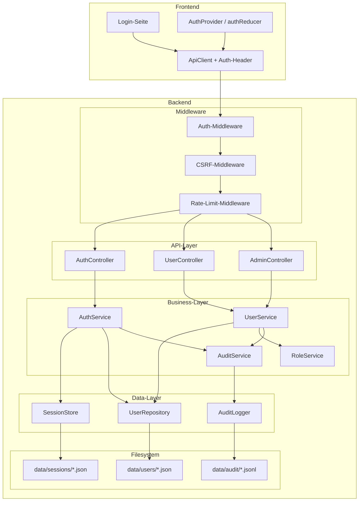
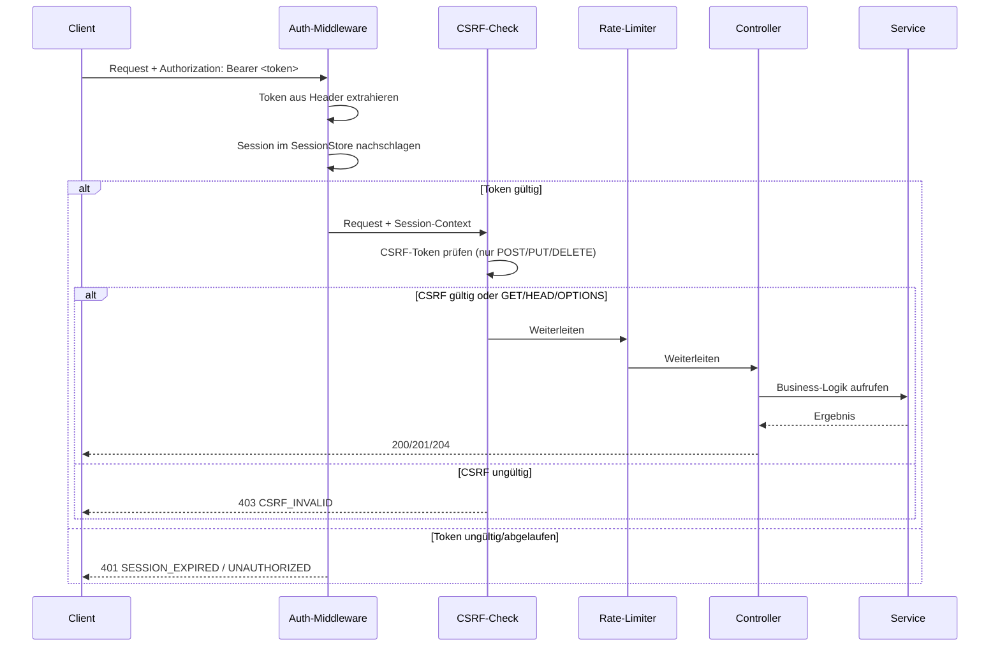

# Design Document — Auth & User Management

## Overview

Dieses Design beschreibt die technische Umsetzung der Authentifizierung und Benutzerverwaltung für Slatebase. Das System wird um drei neue Backend-Module erweitert (Auth, User, Role), die sich nahtlos in die bestehende Schichtarchitektur einfügen. Die Authentifizierung basiert auf opaken Session-Tokens (kein JWT), gespeichert im Dateisystem. Passwörter werden mit argon2id gehasht. Ein CSRF-Token-Mechanismus schützt zustandsändernde Anfragen.

### Zentrale Design-Entscheidungen

| Entscheidung | Begründung |
|---|---|
| Opake Tokens statt JWT | Serverseitige Invalidierung sofort wirksam; kein Token-Refresh nötig |
| argon2id statt bcrypt | Modernerer Algorithmus, memory-hard, OWASP-empfohlen |
| Dateisystem-Persistenz | Konsistent mit bestehender Architektur (kein DB-Dependency) |
| Hono-Middleware für Auth | Saubere Trennung, wiederverwendbar, kein HTTP-Leak in Business-Layer |
| Eigener CSRF-Token + Hono Origin-Check | Defense-in-Depth: Token-basiert + Header-basiert |
| `node:crypto.randomBytes` für Tokens | Kryptographisch sicher, keine externe Dependency |


## Architecture

### Systemübersicht




### Schichtintegration

Die neuen Module fügen sich in die bestehende Architektur ein:

```
Config → Logger → [UserRepository, SessionStore, AuditLogger] → [AuthService, UserService, RoleService, AuditService] → [AuthController, UserController, AdminController] → Middleware → Hono App
```

Alle neuen Module folgen dem Interface-First-Prinzip (`I*`-Interfaces) und werden im Composition Root (`src/index.ts`) manuell verdrahtet.

### Request-Lifecycle




## Components and Interfaces

### Neue Backend-Module

```
src/
├── auth/
│   ├── index.ts          — AuthService, SessionStore, Interfaces, Error-Klassen
│   ├── middleware.ts     — authMiddleware, csrfMiddleware, rateLimitMiddleware
│   └── index.test.ts     — Unit-Tests
├── user/
│   ├── index.ts          — UserService, UserRepository, RoleService, Interfaces
│   ├── validation.ts     — Profil-/Passwort-Validierung (Zod-Schemas)
│   └── index.test.ts     — Unit-Tests
├── audit/
│   ├── index.ts          — AuditService, AuditLogger, Interfaces
│   └── index.test.ts     — Unit-Tests
├── api/
│   ├── index.ts          — (erweitert) + AuthRouteModule, UserRouteModule, AdminRouteModule
│   ├── authRoutes.ts     — AuthController + Route-Registrierung
│   ├── userRoutes.ts     — UserController + Route-Registrierung
│   └── adminRoutes.ts    — AdminController + Route-Registrierung
```

### Interfaces (Low-Level)

```typescript
// --- src/auth/index.ts ---

export interface ISessionStore {
  create(session: Session): Promise<void>
  findByToken(token: string): Promise<Session | null>
  findByUserId(userId: string): Promise<Session[]>
  invalidate(token: string): Promise<void>
  invalidateAllForUser(userId: string, exceptToken?: string): Promise<void>
  cleanup(): Promise<number>  // entfernt abgelaufene Sessions, gibt Anzahl zurück
}

export interface IAuthService {
  login(username: string, password: string, meta: LoginMeta): Promise<LoginResult>
  logout(token: string): Promise<void>
  validateSession(token: string): Promise<SessionContext | null>
  getSessions(userId: string): Promise<SessionInfo[]>
  invalidateSession(userId: string, sessionId: string): Promise<void>
  invalidateOtherSessions(userId: string, currentToken: string): Promise<void>
  generateCsrfToken(sessionId: string): string
  validateCsrfToken(sessionId: string, token: string): boolean
}

export interface LoginMeta {
  ipAddress: string
  userAgent: string
}

export interface LoginResult {
  token: string
  csrfToken: string
  user: PublicUserInfo
  expiresAt: string
}

export interface SessionContext {
  userId: string
  username: string
  role: UserRole
  sessionId: string
}

export interface SessionInfo {
  sessionId: string
  userAgent: string
  ipAddress: string
  createdAt: string
  lastActivity: string
}
```


```typescript
// --- src/user/index.ts ---

export type UserRole = 'admin' | 'user'

export interface IUserRepository {
  findById(userId: string): Promise<UserRecord | null>
  findByUsername(username: string): Promise<UserRecord | null>
  findAll(options?: PaginationOptions): Promise<PaginatedResult<UserRecord>>
  save(user: UserRecord): Promise<void>
  delete(userId: string): Promise<void>
  count(): Promise<number>
  countByRole(role: UserRole): Promise<number>
}

export interface IUserService {
  createUser(data: CreateUserData): Promise<PublicUserInfo>
  deleteUser(userId: string): Promise<void>
  updateProfile(userId: string, data: UpdateProfileData): Promise<PublicUserInfo>
  changePassword(userId: string, currentPassword: string, newPassword: string): Promise<void>
  resetPassword(userId: string): Promise<string>  // gibt temporäres Passwort zurück
  getUser(userId: string): Promise<PublicUserInfo>
  listUsers(options?: PaginationOptions): Promise<PaginatedResult<PublicUserInfo>>
  suspendUser(userId: string): Promise<void>
  unsuspendUser(userId: string): Promise<void>
  deleteSelf(userId: string, password: string): Promise<void>
}

export interface IRoleService {
  assignRole(userId: string, role: UserRole): Promise<void>
  getRole(userId: string): Promise<UserRole>
  canRemoveAdmin(userId: string): Promise<boolean>
}

export interface CreateUserData {
  username: string
  password: string
  role: UserRole
  displayName?: string
}

export interface UpdateProfileData {
  displayName?: string
  email?: string
  avatarUrl?: string
  preferredLanguage?: 'de' | 'en'
  colorScheme?: 'light' | 'dark' | 'system'
}

export interface PublicUserInfo {
  userId: string
  username: string
  displayName: string
  email: string
  role: UserRole
  preferredLanguage: 'de' | 'en'
  colorScheme: 'light' | 'dark' | 'system'
  suspended: boolean
  mustChangePassword: boolean
  createdAt: string
}

export interface PaginationOptions {
  page: number      // 1-basiert
  pageSize: number  // max 100
}

export interface PaginatedResult<T> {
  items: T[]
  total: number
  page: number
  pageSize: number
  totalPages: number
}
```


```typescript
// --- src/audit/index.ts ---

export type AuditAction =
  | 'LOGIN_SUCCESS'
  | 'LOGIN_FAILED'
  | 'LOGOUT'
  | 'PASSWORD_CHANGED'
  | 'PASSWORD_RESET'
  | 'ROLE_CHANGED'
  | 'USER_CREATED'
  | 'USER_DELETED'
  | 'USER_SUSPENDED'
  | 'USER_UNSUSPENDED'
  | 'VAULT_SHARE_CREATED'
  | 'VAULT_SHARE_REVOKED'
  | 'VAULT_SHARE_UPDATED'
  | 'VAULT_OWNERSHIP_TRANSFERRED'
  | 'CONFIG_CHANGED'

export interface AuditEntry {
  timestamp: string       // ISO 8601
  userId: string | null   // null bei fehlgeschlagenen Logins ohne bekannten User
  action: AuditAction
  target: string          // betroffene Ressource (userId, vaultId, etc.)
  ipAddress: string
  success: boolean
  details?: string        // optionale Zusatzinfo (keine sensiblen Daten)
}

export interface IAuditService {
  log(entry: Omit<AuditEntry, 'timestamp'>): Promise<void>
  query(filter: AuditFilter): Promise<PaginatedResult<AuditEntry>>
}

export interface IAuditLogger {
  append(entry: AuditEntry): Promise<void>
  read(filter: AuditFilter): Promise<PaginatedResult<AuditEntry>>
}

export interface AuditFilter {
  action?: AuditAction
  startDate?: string   // ISO 8601
  endDate?: string     // ISO 8601
  page: number
  pageSize: number     // max 100
}
```


```typescript
// --- src/auth/middleware.ts ---

import type { Context, Next } from 'hono'
import type { IAuthService } from './index.js'
import type { SessionContext } from './index.js'

/**
 * Hono middleware that validates the session token from the Authorization header.
 * Sets `c.set('session', sessionContext)` on success.
 * Returns 401 on missing/invalid/expired token.
 * Skips validation for the login endpoint.
 */
export function createAuthMiddleware(authService: IAuthService): (c: Context, next: Next) => Promise<Response | void>

/**
 * Hono middleware that validates the CSRF token for state-changing requests.
 * Checks the `X-CSRF-Token` header against the session's CSRF token.
 * Only applies to POST, PUT, DELETE methods.
 * Returns 403 on missing/invalid CSRF token.
 */
export function createCsrfMiddleware(authService: IAuthService): (c: Context, next: Next) => Promise<Response | void>

/**
 * In-memory rate limiter per username.
 * Tracks failed login attempts: max 5 failures in 15 minutes → block for 15 minutes.
 * Returns 429 when rate limit exceeded.
 */
export function createRateLimitMiddleware(): (c: Context, next: Next) => Promise<Response | void>
```

### Vault-Freigabe-Erweiterung

```typescript
// --- Erweiterung von src/vault/registry.ts ---

export interface VaultShareEntry {
  vaultId: string
  userId: string          // Empfänger der Freigabe
  permission: 'read' | 'write'
  grantedBy: string       // userId des Besitzers
  grantedAt: string       // ISO 8601
}

export interface IVaultShareRegistry {
  getSharesForVault(vaultId: string): Promise<VaultShareEntry[]>
  getSharesForUser(userId: string): Promise<VaultShareEntry[]>
  addShare(share: VaultShareEntry): Promise<void>
  removeShare(vaultId: string, userId: string): Promise<void>
  removeAllSharesForVault(vaultId: string): Promise<void>
  updatePermission(vaultId: string, userId: string, permission: 'read' | 'write'): Promise<void>
}

// --- Erweiterung von VaultRegistryEntry ---

export interface VaultRegistryEntry {
  id: string
  name: string
  storagePath: string
  createdAt: string
  ownerId: string         // NEU: Benutzer-ID des Besitzers
}
```


### Frontend-Erweiterungen

```typescript
// --- src/state/authState.ts (neuer Reducer) ---

export interface AuthState {
  isAuthenticated: boolean
  user: PublicUserInfo | null
  token: string | null
  csrfToken: string | null
  mustChangePassword: boolean
  isLoading: boolean
  error: string | null
}

export type AuthAction =
  | { type: 'LOGIN_STARTED' }
  | { type: 'LOGIN_SUCCESS'; payload: { token: string; csrfToken: string; user: PublicUserInfo } }
  | { type: 'LOGIN_FAILED'; payload: { message: string } }
  | { type: 'LOGOUT' }
  | { type: 'SESSION_EXPIRED' }
  | { type: 'PASSWORD_CHANGED' }

// AuthProvider wraps the app, ApiClient reads token from context
```

### API-Endpunkte (Neu)

| Method | Path | Zweck | Auth | Rolle |
|--------|------|-------|------|-------|
| POST | /auth/login | Anmeldung | Nein | — |
| POST | /auth/logout | Abmeldung | Ja | — |
| GET | /auth/sessions | Eigene Sessions auflisten | Ja | — |
| DELETE | /auth/sessions/:sessionId | Einzelne Session beenden | Ja | — |
| DELETE | /auth/sessions | Alle anderen Sessions beenden | Ja | — |
| GET | /users/me | Eigenes Profil abrufen | Ja | — |
| PUT | /users/me | Eigenes Profil aktualisieren | Ja | — |
| PUT | /users/me/password | Eigenes Passwort ändern | Ja | — |
| DELETE | /users/me | Eigenes Konto löschen | Ja | — |
| GET | /admin/users | Benutzerliste (paginiert) | Ja | admin |
| POST | /admin/users | Benutzer anlegen | Ja | admin |
| DELETE | /admin/users/:userId | Benutzer löschen | Ja | admin |
| PUT | /admin/users/:userId/role | Rolle ändern | Ja | admin |
| PUT | /admin/users/:userId/password | Passwort zurücksetzen | Ja | admin |
| PUT | /admin/users/:userId/suspend | Konto sperren | Ja | admin |
| PUT | /admin/users/:userId/unsuspend | Konto entsperren | Ja | admin |
| GET | /admin/users/:userId/sessions | Sessions eines Users | Ja | admin |
| DELETE | /admin/users/:userId/sessions/:sessionId | Session eines Users beenden | Ja | admin |
| GET | /admin/config | Serverkonfiguration abrufen | Ja | admin |
| PUT | /admin/config | Serverkonfiguration ändern | Ja | admin |
| POST | /admin/restart | Server-Neustart | Ja | admin |
| GET | /admin/audit | Audit-Log abrufen | Ja | admin |
| POST | /vaults/:vaultId/shares | Freigabe erstellen | Ja | owner |
| DELETE | /vaults/:vaultId/shares/:userId | Freigabe widerrufen | Ja | owner |
| PUT | /vaults/:vaultId/shares/:userId | Berechtigung ändern | Ja | owner |
| POST | /vaults/:vaultId/transfer | Besitz übertragen | Ja | owner |


## Data Models

### UserRecord (Dateisystem: `data/users/<userId>.json`)

```typescript
export interface UserRecord {
  userId: string              // UUIDv4
  username: string            // 3–64 Zeichen, alphanumerisch + - _
  passwordHash: string        // argon2id-Hash
  role: UserRole              // 'admin' | 'user'
  displayName: string         // 1–50 Zeichen
  email: string               // RFC 5322, max 254 Zeichen
  avatarUrl: string           // max 2048 Zeichen, http(s)://
  preferredLanguage: 'de' | 'en'
  colorScheme: 'light' | 'dark' | 'system'
  suspended: boolean
  mustChangePassword: boolean
  createdAt: string           // ISO 8601
  updatedAt: string           // ISO 8601
}
```

**Speicherformat:** Eine JSON-Datei pro Benutzer unter `data/users/<userId>.json`. Atomare Schreiboperationen (Temp-Datei → Rename). Ein Index-File `data/users/_index.json` mappt `username → userId` für schnelle Lookups.

### Session (Dateisystem: `data/sessions/<sessionId>.json`)

```typescript
export interface Session {
  sessionId: string           // UUIDv4
  token: string               // 64 Bytes hex-encoded (128 Zeichen)
  csrfToken: string           // 32 Bytes hex-encoded (64 Zeichen)
  userId: string
  role: UserRole              // Snapshot bei Session-Erstellung, aktualisiert bei Rollenänderung
  userAgent: string
  ipAddress: string
  createdAt: string           // ISO 8601
  expiresAt: string           // ISO 8601 (createdAt + 24h)
  lastActivity: string        // ISO 8601, aktualisiert bei jeder Anfrage
}
```

**Speicherformat:** Eine JSON-Datei pro Session unter `data/sessions/<sessionId>.json`. Token-Lookup über einen In-Memory-Index (`Map<token, sessionId>`), der beim Start aus dem Dateisystem geladen wird.

### VaultShareEntry (Dateisystem: `data/shares.json`)

```typescript
export interface VaultShareEntry {
  vaultId: string
  userId: string
  permission: 'read' | 'write'
  grantedBy: string
  grantedAt: string           // ISO 8601
}
```

**Speicherformat:** Zentrale JSON-Datei `data/shares.json` mit Array aller Freigaben. Atomare Schreiboperationen. Max 20 Freigaben pro Vault (validiert im Service-Layer).

### AuditEntry (Dateisystem: `data/audit/YYYY-MM-DD.jsonl`)

```typescript
export interface AuditEntry {
  timestamp: string           // ISO 8601
  userId: string | null
  action: AuditAction
  target: string
  ipAddress: string
  success: boolean
  details?: string
}
```

**Speicherformat:** Append-Only JSONL-Dateien (eine Zeile pro Eintrag), rotiert nach Datum. Dateiname: `data/audit/2025-01-15.jsonl`. Kein Löschen oder Überschreiben möglich (nur Append via `fs.appendFile`).

### Rate-Limit-State (In-Memory)

```typescript
interface RateLimitEntry {
  attempts: number
  firstAttemptAt: number      // Unix-Timestamp ms
  blockedUntil: number | null // Unix-Timestamp ms, null = nicht blockiert
}

// Map<username, RateLimitEntry> — In-Memory, kein Persist nötig
// Cleanup: Einträge älter als 15 Minuten werden bei nächstem Zugriff entfernt
```

### ETag für Concurrent-Edit-Detection

```typescript
// Erweiterung der File-Save-Response
export interface FileSaveResult {
  path: string
  name: string
  size: number
  etag: string    // NEU: SHA-256 des Dateiinhalts (erste 16 Hex-Zeichen)
}

// Bei PUT /vaults/:vaultId/files:
// Client sendet If-Match: <etag> Header
// Server vergleicht mit aktuellem Datei-Hash
// Bei Mismatch: 409 Conflict
```


### Algorithmen (Low-Level)

#### Token-Generierung

```typescript
import crypto from 'node:crypto'

function generateSessionToken(): string {
  return crypto.randomBytes(64).toString('hex') // 128 Zeichen
}

function generateCsrfToken(): string {
  return crypto.randomBytes(32).toString('hex') // 64 Zeichen
}

function generateUserId(): string {
  return crypto.randomUUID() // UUIDv4
}

function generateTempPassword(): string {
  // 12 Zeichen: Buchstaben + Ziffern, kryptographisch zufällig
  const chars = 'ABCDEFGHJKLMNPQRSTUVWXYZabcdefghjkmnpqrstuvwxyz23456789'
  const bytes = crypto.randomBytes(12)
  return Array.from(bytes).map(b => chars[b % chars.length]).join('')
}
```

#### Passwort-Hashing (argon2id)

```typescript
import { hash, verify } from 'argon2'

// Library: "argon2" (npm) — Node.js-Bindings für die Referenz-Implementierung

async function hashPassword(password: string): Promise<string> {
  return hash(password, {
    type: 2,           // argon2id
    memoryCost: 65536, // 64 MB
    timeCost: 3,       // 3 Iterationen
    parallelism: 4,
  })
}

async function verifyPassword(hash: string, password: string): Promise<boolean> {
  return verify(hash, password)
}
```

#### Rate-Limiting-Algorithmus

```typescript
const MAX_ATTEMPTS = 5
const WINDOW_MS = 15 * 60 * 1000    // 15 Minuten
const BLOCK_DURATION_MS = 15 * 60 * 1000

function checkRateLimit(username: string, store: Map<string, RateLimitEntry>): { allowed: boolean; retryAfter?: number } {
  const now = Date.now()
  const entry = store.get(username)

  if (!entry) return { allowed: true }

  // Fenster abgelaufen → Reset
  if (now - entry.firstAttemptAt > WINDOW_MS && !entry.blockedUntil) {
    store.delete(username)
    return { allowed: true }
  }

  // Aktuell blockiert?
  if (entry.blockedUntil && now < entry.blockedUntil) {
    return { allowed: false, retryAfter: Math.ceil((entry.blockedUntil - now) / 1000) }
  }

  // Block abgelaufen → Reset
  if (entry.blockedUntil && now >= entry.blockedUntil) {
    store.delete(username)
    return { allowed: true }
  }

  return { allowed: true }
}

function recordFailedAttempt(username: string, store: Map<string, RateLimitEntry>): void {
  const now = Date.now()
  const entry = store.get(username)

  if (!entry) {
    store.set(username, { attempts: 1, firstAttemptAt: now, blockedUntil: null })
    return
  }

  entry.attempts++

  if (entry.attempts >= MAX_ATTEMPTS) {
    entry.blockedUntil = now + BLOCK_DURATION_MS
  }
}
```

#### Session-Validierung mit Rollenaktualisierung

```typescript
// Bei Rollenänderung: alle Sessions des Users aktualisieren
async function updateSessionRole(userId: string, newRole: UserRole, sessionStore: ISessionStore): Promise<void> {
  const sessions = await sessionStore.findByUserId(userId)
  for (const session of sessions) {
    session.role = newRole
    // Persist aktualisierte Session
  }
}
```

#### Ersteinrichtung (Default-Admin)

```typescript
async function ensureDefaultAdmin(userRepo: IUserRepository, logger: ILogger): Promise<void> {
  const count = await userRepo.count()
  if (count > 0) return // Bereits Benutzer vorhanden

  const passwordHash = await hashPassword('admin')
  const admin: UserRecord = {
    userId: generateUserId(),
    username: 'admin',
    passwordHash,
    role: 'admin',
    displayName: 'Administrator',
    email: '',
    avatarUrl: '',
    preferredLanguage: 'de',
    colorScheme: 'system',
    suspended: false,
    mustChangePassword: true,
    createdAt: new Date().toISOString(),
    updatedAt: new Date().toISOString(),
  }

  await userRepo.save(admin)
  logger.info('Default admin account created', { userId: admin.userId })
}
```


## Correctness Properties

*Eine Property ist eine Eigenschaft oder ein Verhalten, das über alle gültigen Ausführungen eines Systems hinweg gelten muss — im Wesentlichen eine formale Aussage darüber, was das System tun soll. Properties bilden die Brücke zwischen menschenlesbaren Spezifikationen und maschinenverifizierbaren Korrektheitsgarantien.*

### Property 1: Login erzeugt gültige Session mit korrekten Attributen

*Für alle* gültigen Benutzername/Passwort-Kombinationen eines registrierten, nicht gesperrten Benutzers soll der Login eine Session erzeugen, die folgende Invarianten erfüllt: (a) Token ist ein 128-Zeichen-Hex-String, (b) CSRF-Token ist ein 64-Zeichen-Hex-String, (c) Ablaufzeitpunkt liegt exakt 24 Stunden nach Erstellung, (d) die zurückgegebene Rolle entspricht der gespeicherten Rolle des Benutzers.

**Validates: Requirements 1.1, 10.1, 10.4**

### Property 2: Ungültige Anmeldedaten erzeugen identische Fehlerantwort

*Für alle* ungültigen Anmeldeversuche (falscher Benutzername, falsches Passwort, oder beides) soll die Fehlerantwort strukturell identisch sein (Status 401, gleicher Error-Code), ohne preiszugeben, welcher Teil der Anmeldedaten falsch war.

**Validates: Requirements 1.2**

### Property 3: Unauthentifizierte Anfragen werden abgelehnt

*Für alle* API-Endpunkte außer dem Login-Endpunkt soll eine Anfrage ohne gültiges Session-Token mit Status 401 abgelehnt werden.

**Validates: Requirements 1.3**


### Property 4: Logout invalidiert Session (Round-Trip)

*Für alle* Benutzer mit aktiver Session soll nach dem Logout das zugehörige Token bei nachfolgenden Anfragen mit Status 401 abgelehnt werden.

**Validates: Requirements 1.4**

### Property 5: Rate-Limiting blockiert nach 5 Fehlversuchen

*Für alle* Benutzernamen gilt: Nach exakt 5 fehlgeschlagenen Anmeldeversuchen innerhalb von 15 Minuten soll der 6. Versuch mit Status 429 abgelehnt werden. Bei weniger als 5 Versuchen soll der Zugang nicht blockiert sein.

**Validates: Requirements 1.6**

### Property 6: Eingabevalidierung lehnt ungültige Formate ab

*Für alle* Benutzernamen mit Länge < 1 oder > 64 Zeichen und *für alle* Passwörter mit Länge < 8 oder > 128 Zeichen soll die Anfrage mit Status 400 abgelehnt werden.

**Validates: Requirements 1.7, 8.3, 8.4**

### Property 7: mustChangePassword blockiert alle Aktionen außer Passwortänderung

*Für alle* Benutzer mit `mustChangePassword: true` und *für alle* API-Endpunkte außer der Passwortänderung soll die Anfrage abgelehnt werden, bis das Passwort geändert wurde.

**Validates: Requirements 2.3**

### Property 8: Passwortänderung validiert Regeln

*Für alle* neuen Passwörter mit Länge ≥ 8 und ≤ 128 Zeichen, die sich vom aktuellen Passwort unterscheiden, soll die Änderung erfolgreich sein und `mustChangePassword` auf `false` setzen. *Für alle* Passwörter die kürzer als 8 Zeichen sind, länger als 128 Zeichen, oder identisch mit dem aktuellen Passwort, soll die Änderung abgelehnt werden.

**Validates: Requirements 2.4, 2.5, 3.4, 3.5**


### Property 9: Profildaten Round-Trip

*Für alle* gültigen Profildaten (Anzeigename 1–50 Zeichen, E-Mail RFC 5322-konform ≤ 254 Zeichen, Avatar-URL ≤ 2048 Zeichen mit http(s)://, Sprache ∈ {de, en}, Farbschema ∈ {light, dark, system}) soll das Speichern und erneute Laden die identischen Werte zurückgeben.

**Validates: Requirements 3.1, 3.2, 3.7**

### Property 10: Ungültige Profilfelder lehnen gesamte Änderung ab (Atomarität)

*Für alle* Profilaktualisierungen, die mindestens ein ungültiges Feld enthalten (E-Mail nicht RFC 5322-konform, Feldlänge überschritten, ungültiger Enum-Wert), soll die gesamte Änderung abgelehnt werden und kein Feld persistiert werden.

**Validates: Requirements 3.3, 3.6**

### Property 11: Nicht-Admin-Benutzer werden von Admin-Endpunkten abgelehnt

*Für alle* Benutzer mit Rolle „user" und *für alle* administrativen Endpunkte (Benutzerverwaltung, Rollenzuweisung, Serverkonfiguration) soll die Anfrage mit Status 403 abgelehnt werden.

**Validates: Requirements 4.4, 7.4**

### Property 12: Mindestens ein Administrator muss existieren (Invariante)

*Für alle* Systemzustände mit genau einem aktiven Administrator soll jeder Versuch, dessen Admin-Rolle zu entfernen, das Konto zu löschen, oder das Konto zu sperren, mit Status 409 abgelehnt werden.

**Validates: Requirements 4.5, 5.4, 13.6, 14.5**

### Property 13: Rollenänderung wirkt sofort auf bestehende Sessions

*Für alle* Benutzer mit aktiven Sessions soll nach einer Rollenänderung die nächste Anfrage mit der neuen Rolle autorisiert werden, ohne erneutes Einloggen.

**Validates: Requirements 4.3**


### Property 14: Benutzererstellung validiert und erzwingt Eindeutigkeit

*Für alle* gültigen Benutzerdaten (Username 3–64 Zeichen alphanumerisch+Bindestrich+Unterstrich, Passwort ≥ 8 Zeichen, Rolle ∈ {admin, user}) soll die Erstellung erfolgreich sein. *Für alle* Benutzernamen, die bereits existieren, soll die Erstellung mit Konflikt-Fehler abgelehnt werden.

**Validates: Requirements 5.1, 5.6, 5.8**

### Property 15: Benutzerlöschung entfernt Konto und invalidiert Sessions

*Für alle* Benutzer mit aktiven Sessions soll nach der Löschung (durch Admin oder Selbstlöschung) das Benutzerkonto nicht mehr auffindbar sein und alle zugehörigen Sessions ungültig sein.

**Validates: Requirements 5.2, 13.5**

### Property 16: Passwort-Reset erzeugt gültiges temporäres Passwort

*Für alle* Benutzer soll nach einem Admin-Passwort-Reset gelten: (a) das temporäre Passwort hat ≥ 8 Zeichen, (b) `mustChangePassword` ist `true`, (c) das alte Passwort funktioniert nicht mehr, (d) das temporäre Passwort ermöglicht Login.

**Validates: Requirements 5.3**

### Property 17: Benutzerliste ist sortiert und paginiert

*Für alle* Benutzermengen soll die Benutzerliste alphabetisch nach Benutzername aufsteigend sortiert sein, maximal 100 Einträge pro Seite enthalten, und den Sperrstatus jedes Benutzers beinhalten.

**Validates: Requirements 5.5, 14.6**

### Property 18: Vault-Zugriffskontrolle nach Berechtigungsstufe

*Für alle* Vaults und Benutzer gilt: (a) Der Besitzer hat vollen Lese-/Schreibzugriff, (b) Benutzer mit „read"-Freigabe können nur lesen, Schreibversuche werden abgelehnt, (c) Benutzer mit „write"-Freigabe können lesen und schreiben, (d) Benutzer ohne Freigabe oder Besitz werden bei jedem Zugriff abgelehnt.

**Validates: Requirements 6.2, 6.3, 6.5**


### Property 19: Freigabe-Erstellung und -Widerruf (Round-Trip)

*Für alle* Vault-Besitzer und gültige Zielbenutzer soll gelten: (a) Freigabe-Erstellung speichert die korrekte Berechtigungsstufe, (b) nach Widerruf einer Freigabe wird der Zugriff des Benutzers sofort abgelehnt.

**Validates: Requirements 6.1, 6.4**

### Property 20: Vault-Freigabe-Invarianten

*Für alle* Vaults soll gelten: (a) genau ein Besitzer existiert, (b) maximal 20 Freigaben sind erlaubt, (c) Freigabe an nicht existierende Benutzer oder an sich selbst wird abgelehnt, (d) mehrere Benutzer können gleichzeitig mit unterschiedlichen Berechtigungsstufen geteilt werden.

**Validates: Requirements 6.6, 6.7, 6.8**

### Property 21: Berechtigungsstufe kann geändert werden

*Für alle* bestehenden Freigaben soll die Änderung der Berechtigungsstufe (read → write oder write → read) erfolgreich persistiert werden und sofort wirksam sein.

**Validates: Requirements 6.9**

### Property 22: Vault-Löschung mit aktiven Freigaben wird abgelehnt

*Für alle* Vaults mit mindestens einer aktiven Freigabe soll ein direkter Löschversuch abgelehnt werden.

**Validates: Requirements 6.10**

### Property 23: Besitz-Übertragung mit Vorbedingungen

*Für alle* Vaults gilt: (a) Übertragung wird abgelehnt, solange Freigaben an andere Benutzer als den Empfänger bestehen, (b) nach erfolgreicher Übertragung hat der neue Besitzer volle Kontrolle und der alte Besitzer keinen Zugriff mehr.

**Validates: Requirements 6.12, 6.13, 15.4, 15.5, 15.6**

### Property 24: Kontolöschung erfordert Vault-Freiheit

*Für alle* Benutzer, die noch Vaults besitzen, soll die Kontolöschung (Selbstlöschung oder Admin-Löschung) abgelehnt werden.

**Validates: Requirements 6.14, 13.2**


### Property 25: Serverkonfiguration validiert und persistiert

*Für alle* gültigen Konfigurationswerte (Port 1–65535, Host nicht-leer, Log-Level ∈ {debug, info, warn, error}, maximale Dateigröße > 0) soll die Änderung persistiert werden. *Für alle* ungültigen Werte soll die Änderung abgelehnt werden und die bisherige Konfiguration unverändert bleiben.

**Validates: Requirements 7.2, 7.5**

### Property 26: Passwörter werden als argon2id-Hash gespeichert

*Für alle* Passwörter soll der gespeicherte Wert ein gültiger argon2id-Hash sein (beginnt mit `$argon2id$`), und der Hash soll bei Verifikation mit dem Original-Passwort `true` zurückgeben.

**Validates: Requirements 8.1**

### Property 27: CSRF-Token wird bei zustandsändernden Anfragen geprüft

*Für alle* zustandsändernden API-Anfragen (POST, PUT, DELETE) mit gültiger Session soll die Anfrage ohne gültigen CSRF-Token mit Status 403 abgelehnt werden.

**Validates: Requirements 10.2, 10.3**

### Property 28: Multi-Session-Isolation

*Für alle* Benutzer mit mehreren aktiven Sessions soll gelten: (a) alle Sessions sind unabhängig gültig, (b) Invalidierung einer einzelnen Session lässt andere intakt, (c) „alle außer aktueller" invalidiert genau N-1 Sessions.

**Validates: Requirements 11.1, 11.4, 11.5**

### Property 29: Session-Isolation zwischen Benutzern

*Für alle* Paare verschiedener Benutzer mit aktiven Sessions soll die Invalidierung der Sessions eines Benutzers die Sessions des anderen nicht beeinflussen.

**Validates: Requirements 11.2**

### Property 30: ETag-basierte Konflikterkennung

*Für alle* Dateien in einem Vault soll gelten: Wenn zwei Schreibvorgänge mit demselben ETag-Wert erfolgen, wird der zweite mit Status 409 abgelehnt.

**Validates: Requirements 11.8**


### Property 31: Audit-Log-Einträge haben vollständige Struktur

*Für alle* auditierbaren Aktionen soll ein Audit-Eintrag erzeugt werden, der folgende Felder enthält: Zeitstempel (ISO 8601), Benutzer-ID, Aktionstyp, Ziel, IP-Adresse und Erfolg/Fehlschlag-Status. Kein Eintrag darf Passwörter oder Token-Werte enthalten.

**Validates: Requirements 12.1, 12.2, 12.5**

### Property 32: Audit-Log-Abfrage ist paginiert und filterbar

*Für alle* Audit-Log-Abfragen mit Filtern (Aktionstyp, Datumsbereich) soll das Ergebnis nur Einträge enthalten, die den Filterkriterien entsprechen, und die Paginierung korrekte Metadaten liefern (maximal 100 pro Seite).

**Validates: Requirements 12.4**

### Property 33: Selbstlöschung erfordert Passwortbestätigung

*Für alle* Selbstlöschungsversuche soll gelten: (a) ohne Passwort wird die Löschung abgelehnt, (b) mit falschem Passwort wird die Löschung abgelehnt, (c) mit korrektem Passwort und ohne eigene Vaults wird die Löschung durchgeführt.

**Validates: Requirements 13.1, 13.3, 13.4**

### Property 34: Kontosperrung blockiert Login und invalidiert Sessions

*Für alle* Benutzer soll nach Sperrung gelten: (a) alle aktiven Sessions sind ungültig, (b) Anmeldeversuche werden mit 403 abgelehnt. Nach Entsperrung soll der Benutzer sich wieder anmelden können.

**Validates: Requirements 14.1, 14.2, 14.3**

### Property 35: Sperrung lässt Vault-Daten unverändert

*Für alle* gesperrten Benutzer mit Vaults und Freigaben sollen die Vault-Daten und Freigaben unverändert bestehen bleiben.

**Validates: Requirements 14.4**


## Error Handling

### Neue Error-Klassen

```typescript
// --- src/auth/index.ts ---

export class AuthenticationError extends Error {
  constructor(public readonly code: string, message: string) {
    super(message)
    this.name = 'AuthenticationError'
  }
}

export class SessionExpiredError extends Error {
  constructor() {
    super('Session expired')
    this.name = 'SessionExpiredError'
  }
}

export class RateLimitError extends Error {
  constructor(public readonly retryAfter: number) {
    super(`Rate limit exceeded. Retry after ${retryAfter} seconds`)
    this.name = 'RateLimitError'
  }
}

export class CsrfError extends Error {
  constructor() {
    super('Invalid or missing CSRF token')
    this.name = 'CsrfError'
  }
}

// --- src/user/index.ts ---

export class UserNotFoundError extends Error {
  constructor(public readonly userId: string) {
    super(`User not found: ${userId}`)
    this.name = 'UserNotFoundError'
  }
}

export class UserConflictError extends Error {
  constructor(public readonly username: string) {
    super(`Username already exists: ${username}`)
    this.name = 'UserConflictError'
  }
}

export class UserValidationError extends Error {
  constructor(public readonly code: string, message: string) {
    super(message)
    this.name = 'UserValidationError'
  }
}

export class LastAdminError extends Error {
  constructor() {
    super('Cannot remove the last administrator')
    this.name = 'LastAdminError'
  }
}

export class AccountSuspendedError extends Error {
  constructor() {
    super('Account is suspended')
    this.name = 'AccountSuspendedError'
  }
}

export class InsufficientPermissionError extends Error {
  constructor(message: string = 'Insufficient permissions') {
    super(message)
    this.name = 'InsufficientPermissionError'
  }
}

export class VaultOwnershipError extends Error {
  constructor(message: string) {
    super(message)
    this.name = 'VaultOwnershipError'
  }
}
```


### HTTP-Status-Mapping (Controller-Layer)

| Error-Klasse | HTTP-Status | Error-Code |
|---|---|---|
| AuthenticationError | 401 | `AUTHENTICATION_FAILED` |
| SessionExpiredError | 401 | `SESSION_EXPIRED` |
| RateLimitError | 429 | `RATE_LIMIT_EXCEEDED` |
| CsrfError | 403 | `CSRF_INVALID` |
| UserNotFoundError | 404 | `USER_NOT_FOUND` |
| UserConflictError | 409 | `USERNAME_CONFLICT` |
| UserValidationError | 400 | `VALIDATION_ERROR` |
| LastAdminError | 409 | `LAST_ADMIN` |
| AccountSuspendedError | 403 | `ACCOUNT_SUSPENDED` |
| InsufficientPermissionError | 403 | `FORBIDDEN` |
| VaultOwnershipError | 409 | `VAULT_OWNERSHIP_ERROR` |

### Error-Response-Format

Konsistent mit bestehendem API-Error-Format:

```typescript
interface ApiError {
  code: string
  message: string
  timestamp: string
}
```

### Fehlerbehandlungs-Strategie

1. **Auth-Middleware-Fehler**: Direkt als Response zurückgeben (kein Controller involviert)
2. **Validierungsfehler**: Im Controller via Zod-Parsing, vor Business-Logik-Aufruf
3. **Business-Logik-Fehler**: Domain-Errors werfen, im Controller via `instanceof` mappen
4. **Filesystem-Fehler**: In StorageError wrappen, als 500 zurückgeben
5. **Unerwartete Fehler**: Loggen (Pino), generische 500-Response ohne interne Details

### Sicherheitsrelevante Fehlerbehandlung

- **Login-Fehler**: Immer gleiche Antwortzeit (Timing-Attack-Schutz via konstanter Vergleichszeit bei argon2id)
- **Passwörter in Logs**: Niemals — Pino-Serializer filtert `password`-Felder
- **Stack-Traces**: Nur im Server-Log, nie in API-Responses
- **Rate-Limit-Info**: `Retry-After`-Header in 429-Responses


## Testing Strategy

### Übersicht

Die Teststrategie kombiniert Unit-Tests (spezifische Beispiele, Edge Cases) mit Property-Based Tests (universelle Eigenschaften über alle Eingaben). Beide ergänzen sich: Unit-Tests fangen konkrete Bugs, Property-Tests verifizieren allgemeine Korrektheit.

### Property-Based Testing

**Library:** [fast-check](https://github.com/dubzzz/fast-check) (npm: `fast-check`)
- Aktiv maintained, >4M Downloads/Woche, MIT-Lizenz
- Native TypeScript-Unterstützung
- Integriert mit Vitest

**Konfiguration:**
- Minimum 100 Iterationen pro Property-Test
- Jeder Test referenziert die Design-Property via Kommentar
- Tag-Format: `// Feature: auth-and-user-management, Property {N}: {Titel}`

### Test-Module und Zuordnung

| Modul | Unit-Tests | Property-Tests |
|---|---|---|
| `src/auth/index.test.ts` | Login-Flow, Logout, Session-Expiry | Properties 1–5, 7, 26–28 |
| `src/auth/middleware.test.ts` | Middleware-Integration | Properties 3, 11, 27 |
| `src/user/index.test.ts` | CRUD, Profil, Passwort | Properties 8–10, 14–17, 33 |
| `src/user/validation.test.ts` | Zod-Schema-Edge-Cases | Property 6, 9, 10 |
| `src/audit/index.test.ts` | Append, Query | Properties 31, 32 |
| `src/vault/sharing.test.ts` | Freigabe-CRUD | Properties 18–24 |
| `src/business/concurrency.test.ts` | ETag-Konflikte | Property 30 |
| `src/auth/ratelimit.test.ts` | Timing, Reset | Property 5 |
| `src/auth/session.test.ts` | Multi-Session | Properties 28, 29, 34, 35 |

### Unit-Test-Fokus

- **Spezifische Beispiele**: Default-Admin-Erstellung (Req 2.1, 2.2), Server-Neustart (Req 7.3), Filesystem-Fehler (Req 7.6, 8.5)
- **Edge Cases**: Leere Benutzerliste, maximale Seitengröße, Grenzwerte bei Feldlängen
- **Integration Points**: Middleware-Chain, Controller-Error-Mapping, Composition-Root-Wiring
- **Frontend**: Login-Formular-Validierung (Req 9.1–9.7), AuthProvider-State-Transitions

### Property-Test-Fokus

- **Universelle Invarianten**: Zugriffskontrolle, Rollenprüfung, Validierung
- **Round-Trips**: Login/Logout, Profil-Speichern/Laden, Freigabe/Widerruf
- **Idempotenz**: Doppelte Logout-Aufrufe, mehrfache Rollenänderung
- **Metamorphisch**: Sortierung der Benutzerliste unabhängig von Einfügereihenfolge

### Mocking-Strategie

Konsistent mit bestehender Konvention (hand-geschriebene Mocks):

```typescript
// Beispiel: createMockUserRepository()
function createMockUserRepository(): IUserRepository & {
  savedUsers: UserRecord[]
  deletedIds: string[]
  shouldFail: boolean
} {
  const savedUsers: UserRecord[] = []
  const deletedIds: string[] = []
  let shouldFail = false

  return {
    savedUsers,
    deletedIds,
    shouldFail,
    async findById(userId) { /* ... */ },
    async findByUsername(username) { /* ... */ },
    async save(user) { savedUsers.push(user) },
    async delete(userId) { deletedIds.push(userId) },
    // ...
  }
}
```

### Neue Dependencies

| Package | Version | Zweck |
|---|---|---|
| `argon2` | `0.41.1` | Passwort-Hashing (argon2id) |
| `fast-check` | `3.22.0` | Property-Based Testing (devDependency) |

Beide Packages erfüllen die Dependency-Richtlinien: aktiv maintained, hohe Download-Zahlen, MIT-Lizenz, keine bekannten Vulnerabilities.

