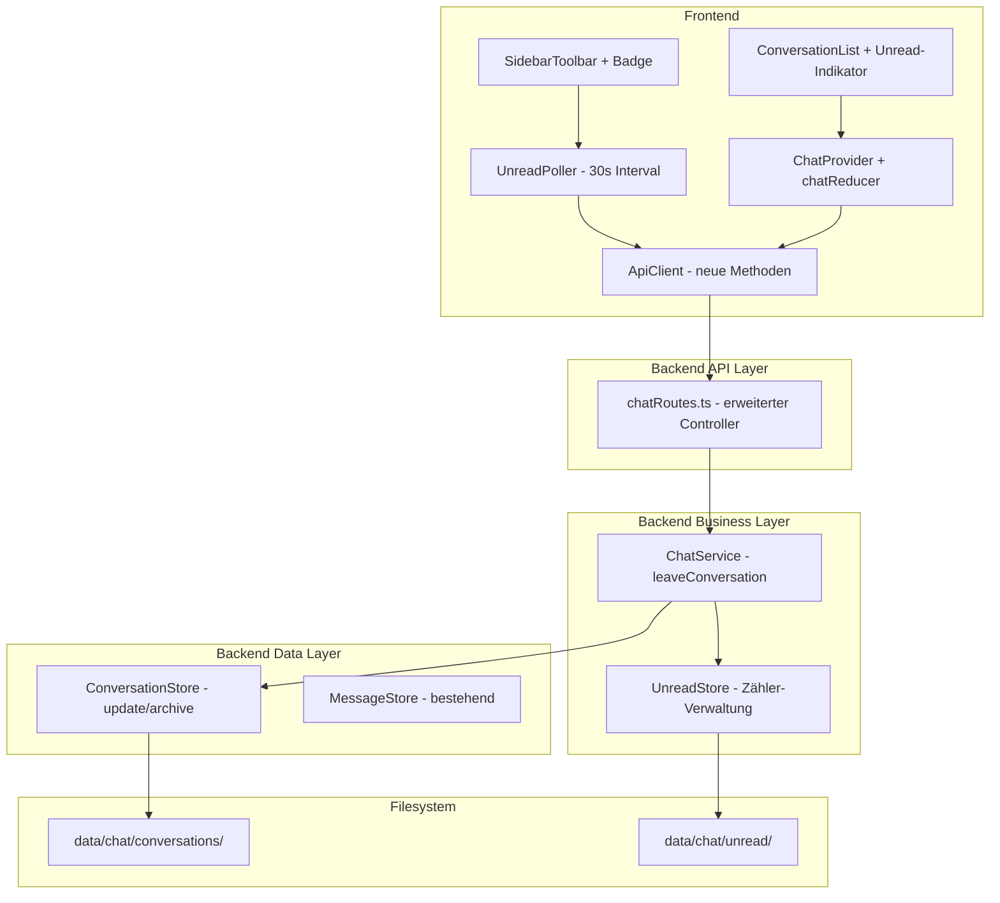

# Design Document: Chat-Enhancements — Konversation verlassen und Ungelesen-Indikator

## Overview

Dieses Design erweitert das bestehende Chat-System um zwei zusammenhängende Features: (1) die Möglichkeit, eine Konversation zu verlassen (mit Archivierung bei nur einem verbleibenden Teilnehmer), und (2) einen Ungelesen-Indikator, der sowohl global am Chat-Button als auch pro Konversation in der Konversationsliste angezeigt wird.

Beide Features bauen auf der bestehenden Chat-Infrastruktur auf (ChatService, ConversationStore, MessageStore, ChatProvider) und folgen den etablierten Architekturprinzipien: Interface-First Design, Filesystem-Persistenz mit atomaren Schreiboperationen, manuelle DI, und separate Reducer für separate Concerns.

### Design-Entscheidungen

1. **Neuer UnreadStore als eigene Persistenz-Schicht**: Ungelesen-Zähler werden in einer separaten JSON-Datei pro Benutzer gespeichert (`data/chat/unread/<userId>.json`). Dies vermeidet Änderungen an der bestehenden Konversations- oder Nachrichten-Persistenz und ermöglicht unabhängige Skalierung.
2. **Polling statt WebSocket für Ungelesen-Badge**: Der globale Ungelesen-Zähler wird alle 30 Sekunden per GET-Request abgefragt. Dies ist konsistent mit dem bestehenden REST-only-Ansatz und vermeidet die Komplexität einer WebSocket-Verbindung.
3. **Archivierung statt Löschung**: Wenn nur ein Teilnehmer verbleibt, wird die Konversation archiviert (read-only) statt gelöscht. Der Nachrichtenverlauf bleibt erhalten.
4. **Optimistisches Update im Frontend**: Beim Öffnen einer Konversation wird der Ungelesen-Zähler sofort lokal auf 0 gesetzt, bevor die Server-Antwort eintrifft. Dies verbessert die wahrgenommene Reaktionszeit.
5. **`archived`-Feld in Conversation-Metadaten**: Das bestehende `Conversation`-Interface wird um ein optionales `archived: boolean`-Feld erweitert. Dies ist minimal-invasiv und erfordert keine Migration bestehender Daten.

## Architecture



### Erweiterungen am bestehenden System

- **ConversationStore**: Neue `update(conversation)`-Methode für Teilnehmer-Entfernung und Archivierung
- **ChatService**: Neue `leaveConversation(userId, conversationId)`-Methode
- **ChatController**: Neuer DELETE-Endpoint + GET-Endpoint für Ungelesen-Total
- **Conversation-Interface**: Neues optionales Feld `archived?: boolean`
- **ConversationListItem-Interface**: Neues Feld `unreadCount: number`
- **ChatState**: Neues Feld `globalUnreadCount: number`
- **IApiClient**: Neue Methoden `leaveConversation()`, `getUnreadTotal()`

## Components and Interfaces

### Backend: Erweitertes Conversation-Interface

```typescript
// Erweiterung in src/chat/types.ts
interface Conversation {
  id: string
  participants: string[]
  createdAt: string
  createdBy: string
  archived?: boolean  // NEU: true wenn nur noch ein Teilnehmer verbleibt
}

interface ConversationListItem {
  id: string
  participants: string[]
  participantNames: string[]
  lastMessageTimestamp: string | null
  lastMessagePreview: string | null
  unreadCount: number    // NEU: Ungelesen-Zähler für den anfragenden Benutzer
  archived?: boolean     // NEU: Archiv-Status
}
```

### Backend: IUnreadStore (neue Komponente)

```typescript
// src/chat/unread-store.ts

/**
 * Manages per-user, per-conversation unread message counts.
 * Persists as JSON files under data/chat/unread/<userId>.json.
 */
interface IUnreadStore {
  /** Increment unread count for a user in a conversation by 1. */
  increment(userId: string, conversationId: string): Promise<void>

  /** Reset unread count for a user in a conversation to 0. */
  reset(userId: string, conversationId: string): Promise<void>

  /** Get unread count for a user in a specific conversation. */
  getCount(userId: string, conversationId: string): Promise<number>

  /** Get all unread counts for a user (conversationId → count). */
  getAllCounts(userId: string): Promise<Map<string, number>>

  /** Get total unread count across all conversations for a user. */
  getTotal(userId: string): Promise<number>

  /** Remove unread entry for a user in a conversation (when leaving). */
  remove(userId: string, conversationId: string): Promise<void>

  /** Load all unread data from disk into memory. */
  loadIndex(): Promise<void>
}
```

### Backend: IConversationStore-Erweiterung

```typescript
// Erweiterung des bestehenden IConversationStore-Interfaces
interface IConversationStore {
  // ... bestehende Methoden ...

  /** Update an existing conversation (atomic write). */
  update(conversation: Conversation): Promise<void>
}
```

### Backend: IChatService-Erweiterung

```typescript
// Erweiterung des bestehenden IChatService-Interfaces
interface IChatService {
  // ... bestehende Methoden ...

  /** Remove the user from a conversation. Archives if only one participant remains. */
  leaveConversation(userId: string, conversationId: string): Promise<void>

  /** Get total unread message count across all active conversations for a user. */
  getUnreadTotal(userId: string): Promise<number>
}
```

### Backend: Neue Error-Klasse

```typescript
// Erweiterung in src/chat/errors.ts

/**
 * Thrown when attempting to send a message to an archived conversation.
 */
export class ConversationArchivedError extends Error {
  constructor(public readonly conversationId: string) {
    super(`Conversation is archived: ${conversationId}`)
    this.name = 'ConversationArchivedError'
  }
}
```

### Backend: Neue API-Endpoints

| Method | Path | Purpose |
|--------|------|---------|
| DELETE | /api/v1/chat/conversations/:conversationId/participants/me | Konversation verlassen |
| GET | /api/v1/chat/unread/total | Globaler Ungelesen-Zähler |

### Backend: ChatController-Erweiterung

```typescript
// Neue Handler im ChatController

/**
 * DELETE /chat/conversations/:conversationId/participants/me
 * Removes the authenticated user from the conversation.
 * Returns 204 on success.
 */
leaveConversation = async (c: Context): Promise<Response> => {
  const session = c.get('session') as SessionContext
  const userId = session.userId

  // 1. Check suspended
  // 2. Validate conversationId (hexId24Schema)
  // 3. Call chatService.leaveConversation(userId, conversationId)
  // 4. Return 204
}

/**
 * GET /chat/unread/total
 * Returns the total unread message count for the authenticated user.
 * Response: { total: number }
 */
getUnreadTotal = async (c: Context): Promise<Response> => {
  const session = c.get('session') as SessionContext
  const userId = session.userId

  // 1. Check suspended
  // 2. Call chatService.getUnreadTotal(userId)
  // 3. Return { total }
}
```

### Backend: ChatService.leaveConversation Logik

```typescript
async leaveConversation(userId: string, conversationId: string): Promise<void> {
  // 1. Find conversation (→ ConversationNotFoundError if not found)
  // 2. Check user is participant (→ NotParticipantError if not)
  // 3. Remove user from participants array
  // 4. If remaining participants < 2: set archived = true
  // 5. Update conversation via conversationStore.update()
  // 6. Remove unread entry via unreadStore.remove(userId, conversationId)
  // 7. Update participantIndex in ConversationStore
}
```

### Backend: sendMessage-Erweiterung

```typescript
// In ChatService.sendMessage — nach erfolgreicher Persistierung:
// Für jeden Teilnehmer außer dem Absender:
//   await this.unreadStore.increment(participantId, conversationId)

// Zusätzlich: Prüfung auf archived-Status VOR dem Senden
// if (conversation.archived) throw new ConversationArchivedError(conversationId)
```

### Backend: getMessages-Erweiterung

```typescript
// In ChatService.getMessages — nach erfolgreichem Abruf:
// await this.unreadStore.reset(userId, conversationId)
```

### Backend: listConversations-Erweiterung

```typescript
// In ChatService.listConversations — beim Enrichment:
// const unreadCount = await this.unreadStore.getCount(userId, conversation.id)
// item.unreadCount = unreadCount
// item.archived = conversation.archived ?? false
```

### Frontend: IApiClient-Erweiterung

```typescript
// Neue Methoden im IApiClient-Interface

/** Leave a conversation (DELETE /chat/conversations/:id/participants/me). */
leaveConversation(conversationId: string): Promise<void>

/** Get total unread count across all conversations. */
getUnreadTotal(): Promise<{ total: number }>
```

### Frontend: ChatState-Erweiterung

```typescript
// Erweiterung in chatState.ts

interface ConversationListItem {
  // ... bestehende Felder ...
  unreadCount: number    // NEU
  archived?: boolean     // NEU
}

interface ChatState {
  // ... bestehende Felder ...
  globalUnreadCount: number  // NEU: Gesamtzahl ungelesener Nachrichten
}

// Neue Actions
type ChatAction =
  | // ... bestehende Actions ...
  | { type: 'CONVERSATION_LEFT'; payload: { conversationId: string; unreadCount: number } }
  | { type: 'GLOBAL_UNREAD_UPDATED'; payload: number }
  | { type: 'CONVERSATION_UNREAD_RESET'; payload: string }  // conversationId
```

### Frontend: Neue Komponenten und Erweiterungen

```
src/
├── components/
│   ├── SidebarToolbar.tsx    — Erweiterung: Badge am Chat-Button
│   ├── ConversationList.tsx  — Erweiterung: Unread-Badge + Leave-Button
│   └── ChatPage.tsx          — Erweiterung: ConfirmModal für Leave
├── state/
│   ├── chatState.ts          — Erweiterung: neue Actions + State-Felder
│   └── chatActions.ts        — Erweiterung: leaveConversation, pollUnread
```

### Frontend: UnreadPoller-Pattern

```typescript
// In ChatProvider oder als separater Hook:
// useEffect mit setInterval(30_000) der getUnreadTotal() aufruft
// und GLOBAL_UNREAD_UPDATED dispatcht.
// Cleanup: clearInterval bei Unmount.
```

### Frontend: SidebarToolbar Badge

```typescript
// Im Chat-Button der SidebarToolbar:
// Wenn globalUnreadCount > 0: Badge-Element mit Zahl anzeigen
// Badge-Styling: kleiner roter Kreis mit weißer Zahl, position: absolute
```

### Frontend: ConversationList Unread-Indikator

```typescript
// Pro Konversation in der Liste:
// Wenn unreadCount > 0: Badge mit Zahl neben dem Konversationseintrag
// Beim Öffnen einer Konversation: sofort CONVERSATION_UNREAD_RESET dispatchen
```

### Frontend: Leave-Aktion mit ConfirmModal

```typescript
// In ConversationList oder ChatPage:
// "Verlassen"-Button (z.B. LogOut-Icon von Lucide) pro Konversation
// Klick → ConfirmModal mit Warntext öffnen
// Bestätigung → leaveConversation API-Call → CONVERSATION_LEFT dispatchen
// Abbruch → Modal schließen, keine Aktion
```

## Data Models

### Filesystem-Erweiterung

```
data/
└── chat/
    ├── conversations/
    │   └── <conversationId>.json    — Konversations-Metadaten (+ archived-Feld)
    ├── messages/
    │   └── <conversationId>.jsonl   — Nachrichten (bestehend)
    └── unread/                      — NEU: Ungelesen-Zähler
        └── <userId>.json            — Ungelesen-Daten pro Benutzer
```

### Ungelesen-Datei (`data/chat/unread/<userId>.json`)

```json
{
  "counts": {
    "a1b2c3d4e5f6a1b2c3d4e5f6": 3,
    "b2c3d4e5f6a1b2c3d4e5f6a1": 0,
    "c3d4e5f6a1b2c3d4e5f6a1b2": 7
  }
}
```

- Schlüssel: `conversationId` (24-char hex)
- Wert: Anzahl ungelesener Nachrichten (≥ 0)
- Einträge mit Wert 0 können beibehalten werden (werden beim Lesen ignoriert für Total-Berechnung)
- Beim Verlassen einer Konversation wird der Eintrag komplett entfernt

### Erweiterte Konversations-Datei

```json
{
  "id": "a1b2c3d4e5f6a1b2c3d4e5f6",
  "participants": ["userId1"],
  "createdAt": "2025-01-15T10:30:00.000Z",
  "createdBy": "userId1",
  "archived": true
}
```

- `archived` ist optional (fehlt bei nicht-archivierten Konversationen)
- Wird auf `true` gesetzt wenn nur noch ein Teilnehmer verbleibt

### UnreadStore In-Memory-Index

```typescript
// userId → Map<conversationId, count>
private index: Map<string, Map<string, number>> = new Map()
```

### Composition Root Erweiterung

```typescript
// In src/index.ts — nach ConversationStore/MessageStore:

// 3d. Unread Store
const unreadStore = new UnreadStore(serverConfig.dataDir, logger)

// ChatService erhält UnreadStore als neue Dependency:
const chatService = new ChatService(conversationStore, messageStore, unreadStore, userRepository, logger)

// Startup — nach conversationStore.loadIndex():
await unreadStore.loadIndex()
```

## Error Handling

### Neue Error-Klasse

| Error Class | HTTP Status | Error Code |
|-------------|-------------|------------|
| `ConversationArchivedError` | 403 | `CONVERSATION_ARCHIVED` |

### Erweitertes Error-Mapping im Controller

```typescript
// In ChatController.handleError:
if (error instanceof ConversationArchivedError) {
  return c.json(createApiError('CONVERSATION_ARCHIVED', error.message), 403)
}
```

### Graceful Degradation

- **Korrupte Ungelesen-Datei beim Start**: Überspringen, Fehler loggen, andere Dateien normal laden (Zähler für betroffenen User starten bei 0)
- **Fehlender `data/chat/unread/`-Ordner**: Automatisch erstellen beim ersten Zugriff
- **Ungelesen-Zähler für nicht-existierende Konversation**: Ignorieren bei Total-Berechnung (Cleanup bei nächster Gelegenheit)

## i18n-Erweiterung

```typescript
// Neue Keys in frontend/src/i18n/de.ts und en.ts:
chat: {
  // ... bestehende Keys ...
  leaveConversation: 'Konversation verlassen',
  leaveConfirmTitle: 'Konversation verlassen?',
  leaveConfirmMessage: 'Nach dem Verlassen wird diese Konversation nicht mehr in deiner Liste angezeigt. Diese Aktion kann nicht rückgängig gemacht werden.',
  leaveConfirmButton: 'Verlassen',
  archived: 'Archiviert',
  archivedMessage: 'Diese Konversation ist archiviert. Es können keine neuen Nachrichten gesendet werden.',
}
```

## Correctness Properties

*A property is a characteristic or behavior that should hold true across all valid executions of a system — essentially, a formal statement about what the system should do. Properties serve as the bridge between human-readable specifications and machine-verifiable correctness guarantees.*

### Property 1: Leave removes participant and hides conversation

*For any* conversation with N ≥ 3 participants and any participant who leaves, the resulting conversation SHALL NOT contain that participant in its participant list, AND listing conversations for that user SHALL NOT include the left conversation.

**Validates: Requirements 1.1, 1.3**

### Property 2: Leave archives when two participants remain

*For any* conversation with exactly 2 participants, when one participant leaves, the conversation SHALL be marked as `archived: true` AND the remaining participant list SHALL contain exactly 1 participant.

**Validates: Requirements 1.2, 2.3, 2.4**

### Property 3: Non-participant cannot leave

*For any* conversation and any user who is NOT in the conversation's participant list, attempting to leave SHALL be rejected with a NotParticipantError (HTTP 403).

**Validates: Requirements 1.4**

### Property 4: Non-existent conversation leave returns not-found

*For any* conversation ID that does not correspond to an existing conversation, attempting to leave SHALL be rejected with a ConversationNotFoundError (HTTP 404).

**Validates: Requirements 1.5**

### Property 5: Archived conversation allows read access

*For any* archived conversation and the remaining participant, retrieving messages SHALL succeed and return all previously persisted messages.

**Validates: Requirements 2.1**

### Property 6: Archived conversation blocks message sending

*For any* archived conversation and any message content, attempting to send a message SHALL be rejected with a ConversationArchivedError containing the error code `CONVERSATION_ARCHIVED`.

**Validates: Requirements 2.2**

### Property 7: Invalid conversation ID is rejected

*For any* string that does NOT match the pattern `/^[0-9a-f]{24}$/`, the leave-conversation endpoint SHALL reject the request with a validation error (HTTP 400).

**Validates: Requirements 4.3**

### Property 8: Suspended user cannot leave conversation

*For any* suspended user attempting to leave any conversation, the request SHALL be rejected with HTTP 403 and error code `ACCOUNT_SUSPENDED`.

**Validates: Requirements 4.5**

### Property 9: Message increments unread for non-senders

*For any* conversation with N participants and any message sent by participant S, the unread count SHALL be incremented by exactly 1 for each of the (N-1) participants who are not S, and SHALL remain unchanged for S.

**Validates: Requirements 5.1**

### Property 10: Reading messages resets unread to zero

*For any* user with a non-zero unread count for a conversation, after retrieving messages for that conversation, the unread count for that user and conversation SHALL be 0.

**Validates: Requirements 5.2**

### Property 11: Unread persistence round-trip

*For any* set of unread counts written to the UnreadStore, after calling `loadIndex()` (simulating a server restart), all previously stored counts SHALL be retrievable with identical values.

**Validates: Requirements 5.3, 5.4, 8.1, 8.3**

### Property 12: Conversation list includes correct unreadCount

*For any* user with conversations, listing conversations SHALL include an `unreadCount` field for each conversation that matches the value stored in the UnreadStore for that user and conversation.

**Validates: Requirements 5.5**

### Property 13: Total unread is sum of per-conversation counts

*For any* user with unread counts across multiple conversations, the total unread endpoint SHALL return a value equal to the sum of all individual per-conversation unread counts for active (non-left) conversations.

**Validates: Requirements 6.2**

### Property 14: Leave removes unread entry

*For any* user who leaves a conversation, the UnreadStore SHALL no longer contain an entry for that user and conversation, AND the total unread count SHALL decrease by the removed conversation's unread count.

**Validates: Requirements 9.1**

### Property 15: Archive preserves remaining participant's unread

*For any* conversation that becomes archived (one participant leaves a 2-person conversation), the remaining participant's unread count for that conversation SHALL remain unchanged.

**Validates: Requirements 9.3**

## Testing Strategy

### Unit Tests (Vitest)

- **UnreadStore**: increment, reset, remove, getCount, getTotal, loadIndex, corrupt file handling
- **ChatService.leaveConversation**: Success paths (3+ participants, 2 participants/archive), error paths (not found, not participant)
- **ChatService.sendMessage**: Unread increment integration
- **ChatService.getMessages**: Unread reset integration
- **ChatController**: New endpoints (leave, unread/total), error mapping for ConversationArchivedError
- **ConversationStore.update**: Atomic write, participantIndex update
- **Frontend chatReducer**: New actions (CONVERSATION_LEFT, GLOBAL_UNREAD_UPDATED, CONVERSATION_UNREAD_RESET)

### Property-Based Tests (fast-check)

Konfiguration:
- **Library**: `fast-check` (bereits als devDependency vorhanden)
- **Minimum 100 Iterationen** pro Property-Test
- **Tag-Format**: `Feature: chat-enhancements, Property {number}: {property_text}`

Jede Correctness Property wird als Property-Based Test implementiert:

1. **Properties 1–4**: ChatService.leaveConversation (Participant-Entfernung, Archivierung, Access Control)
2. **Properties 5–6**: Archived conversation behavior (Read/Write)
3. **Property 7**: Validation (hexId24 rejection)
4. **Property 8**: Suspended user rejection
5. **Properties 9–10**: UnreadStore increment/reset
6. **Property 11**: UnreadStore persistence round-trip (echtes Filesystem mit Temp-Dir)
7. **Properties 12–13**: Conversation list enrichment und Total-Berechnung
8. **Properties 14–15**: Leave/Archive und Unread-Integration

### Test-Dateien

```
backend/src/chat/
├── unread-store.ts             — UnreadStore Implementation
├── unread-store.test.ts        — UnreadStore Unit Tests
├── chat-service.test.ts        — ChatService Unit Tests (erweitert)
├── conversation-store.test.ts  — ConversationStore Unit Tests (erweitert)
├── chat-enhancements.properties.test.ts  — Property-Based Tests (alle 15 Properties)
frontend/src/
├── state/chatState.test.ts     — Reducer Tests (erweitert)
├── components/ConversationList.test.tsx — UI Tests (Unread-Badge, Leave-Button)
```

### Mocking-Strategie

- `createMockUnreadStore()` — implementiert `IUnreadStore` mit In-Memory-Map
- Bestehende Mocks (`createMockConversationStore`, `createMockMessageStore`) werden um neue Methoden erweitert
- Kein externes Mocking-Framework (konsistent mit Projekt-Konventionen)
