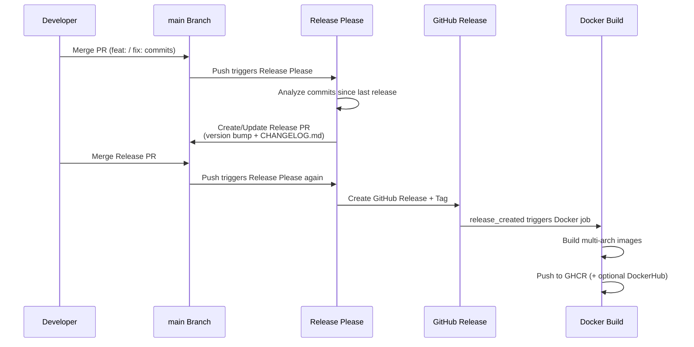

# Design Document: CI/CD Release Pipeline

## Overview

Dieses Design beschreibt die automatisierte Release-Pipeline für Slatebase. Die Pipeline besteht aus zwei GitHub Actions Workflows (CI und Release), einem Backend-Version-Endpoint und einer Admin-UI-Komponente für den Version-Check.

**Kernentscheidungen:**
- **GitHub Actions** als CI/CD-Plattform (bereits als Repository-Hosting gewählt)
- **Conventional Commits + `semantic-release`-ähnlicher Ansatz** via `google-github-actions/release-please-action` für automatische Versionierung und Changelog-Generierung
- **Docker Buildx + QEMU** für Multi-Arch-Builds ohne dedizierte ARM-Hardware
- **GHCR als primäre Registry** (kein zusätzlicher Account nötig für GitHub-User)
- **Release Please** statt `semantic-release`: Erstellt einen PR mit Versionsbump + CHANGELOG, Release wird bei Merge erstellt. Transparenter, reviewbar, kein Token mit Write-Access auf Main nötig.

### Warum Release Please statt semantic-release?

| Aspekt | semantic-release | Release Please |
|--------|-----------------|----------------|
| Workflow | Direkt auf Main, automatisch | PR-basiert, reviewbar |
| CHANGELOG | Auto-generated in Release Body | Auto-generated + CHANGELOG.md-Datei |
| Permissions | Token braucht Write auf Main | Standard GITHUB_TOKEN reicht |
| Konfiguration | `.releaserc` (komplex) | Manifest-basiert (einfach) |
| Monorepo | Plugin-basiert, komplex | Native Monorepo-Unterstützung |
| Pre-Release | Konfigurierbar | Einfach über Branch-Konfiguration |
| Initial Version | Konfigurierbar | `initial-version` in Manifest |

Release Please passt besser zu Slatebase:
1. PR-basierter Workflow ermöglicht Review vor Release
2. Native Monorepo-Unterstützung für Backend + Frontend
3. Geringere Komplexität, weniger Konfiguration
4. CHANGELOG.md wird automatisch gepflegt

## Architecture

### Workflow-Übersicht

```mermaid
flowchart TD
    subgraph "CI Workflow (ci.yml)"
        PUSH[Push / PR] --> BACKEND_JOB[Backend Job]
        PUSH --> FRONTEND_JOB[Frontend Job]
        BACKEND_JOB --> B_INSTALL[npm ci]
        B_INSTALL --> B_TEST[npm run test]
        B_TEST --> B_BUILD[npm run build]
        FRONTEND_JOB --> F_INSTALL[npm ci]
        F_INSTALL --> F_LINT[npm run lint]
        F_LINT --> F_TEST[npm run test]
        F_TEST --> F_BUILD[npm run build]
    end

    subgraph "Release Workflow (release.yml)"
        MAIN_PUSH[Push to main] --> RP[Release Please Action]
        RP -->|release_created| VERSION[Version Tag Created]
        VERSION --> DOCKER_BUILD[Docker Build Job]
        DOCKER_BUILD --> QEMU[Setup QEMU]
        QEMU --> BUILDX[Setup Buildx]
        BUILDX --> GHCR_LOGIN[Login GHCR]
        GHCR_LOGIN --> DH_LOGIN{DockerHub Secrets?}
        DH_LOGIN -->|yes| DH_AUTH[Login DockerHub]
        DH_LOGIN -->|no| SKIP_DH[Skip DockerHub]
        DH_AUTH --> BUILD_BE[Build Backend Image]
        SKIP_DH --> BUILD_BE
        BUILD_BE --> BUILD_FE[Build Frontend Image]
        BUILD_FE --> PUSH_GHCR[Push to GHCR]
        PUSH_GHCR --> PUSH_DH{DockerHub?}
        PUSH_DH -->|yes| DH_PUSH[Push to DockerHub]
        PUSH_DH -->|no| DONE[Done]
        DH_PUSH --> DONE
    end
```



### Release Please Flow



## Components and Interfaces

### 1. CI Workflow (`.github/workflows/ci.yml`)

**Trigger:** `push` (alle Branches) + `pull_request` (alle Branches)

**Jobs:**
- `backend` — Node.js 24.x, `npm ci` → `npm run test` → `npm run build`
- `frontend` — Node.js 24.x, `npm ci` → `npm run lint` → `npm run test` → `npm run build`

Beide Jobs laufen parallel ohne `needs`-Abhängigkeit.

### 2. Release Workflow (`.github/workflows/release.yml`)

**Trigger:** `push` auf `main`

**Jobs:**
1. `release-please` — Führt Release Please Action aus, gibt `release_created` und `tag_name` als Output
2. `docker-build` — Baut Multi-Arch Docker Images (nur wenn `release_created == true`)

### 3. Release Please Konfiguration

**Dateien:**
- `.release-please-manifest.json` — Aktuelle Versionen der Packages
- `release-please-config.json` — Konfiguration (Changelog-Sektionen, Bump-Regeln, Monorepo-Packages)

**Konfiguration:**
```json
{
  "packages": {
    ".": {
      "release-type": "node",
      "changelog-sections": [
        { "type": "feat", "section": "Features" },
        { "type": "fix", "section": "Bugfixes" },
        { "type": "refactor", "section": "Sonstige Änderungen" },
        { "type": "docs", "section": "Sonstige Änderungen" },
        { "type": "chore", "section": "Sonstige Änderungen" },
        { "type": "test", "section": "Sonstige Änderungen" }
      ],
      "bump-minor-pre-major": true,
      "initial-version": "0.1.0"
    }
  }
}
```

**Breaking Changes:** Release Please erkennt `BREAKING CHANGE:` im Commit-Footer und `!` nach dem Typ-Prefix automatisch.

**`bump-minor-pre-major: true`:** Solange Version 0.x.x → `feat:` bumpt MINOR statt MAJOR.

### 4. Docker Build Matrix

```yaml
strategy:
  matrix:
    include:
      - image: slatebase-backend
        context: ./backend
        dockerfile: ./backend/Dockerfile
      - image: slatebase-frontend
        context: ./frontend
        dockerfile: ./frontend/Dockerfile
```

**Tags pro Image:**
- `ghcr.io/andreas13xxx/<image>:<version>` (z.B. `v0.1.0`)
- `ghcr.io/andreas13xxx/<image>:latest`
- Optional: `andreas13xxx/<image>:<version>` (DockerHub)
- Optional: `andreas13xxx/<image>:latest` (DockerHub)

**OCI-Labels:**
- `org.opencontainers.image.version`
- `org.opencontainers.image.description`
- `org.opencontainers.image.source`
- `org.opencontainers.image.licenses`

### 5. Version Endpoint (`GET /api/v1/version`)

**Modul:** Neuer Route-Handler in `backend/src/api/versionRoutes.ts`

**Interface:**
```typescript
/** Reads the application version from environment or file. */
export function getVersion(): string
```

**Fallback-Kette:**
1. `process.env.SLATEBASE_VERSION` → wenn gesetzt, verwende diesen Wert
2. `version.json` im Projektverzeichnis → `{ "version": "X.Y.Z" }` lesen
3. Fallback: `"development"`

**Registrierung:** Außerhalb der Auth-Middleware-Chain (öffentlich zugänglich), analog zu `.well-known/mcp.json`.

### 6. Version Check UI (`VersionCheckCard`)

**Komponente:** `frontend/src/components/VersionCheckCard.tsx`

**Props:** Keine (eigenständige Komponente für Admin-Bereich)

**State:**
```typescript
interface VersionCheckState {
  installedVersion: string | null;
  latestVersion: string | null;
  latestReleaseUrl: string | null;
  loading: boolean;
  error: 'backend-unreachable' | null;
}
```

**Semver-Vergleichsfunktion:**
```typescript
/** 
 * Compares two semver strings. Returns:
 * -1 if a < b, 0 if a === b, 1 if a > b 
 */
export function compareSemver(a: string, b: string): -1 | 0 | 1
```

**GitHub API Call:**
```
GET https://api.github.com/repos/andreas13xxx/Slatebase/releases/latest
```
- Timeout: 10 Sekunden
- Bei Fehler: `latestVersion` bleibt `null`, keine Fehlermeldung

## Data Models

### Version Endpoint Response

```typescript
interface VersionResponse {
  version: string; // "X.Y.Z" or "development"
}
```

### version.json (im Projekt-Root / Backend-Root)

```json
{
  "version": "0.1.0"
}
```

Diese Datei wird vom Release-Workflow bei jedem Release automatisch aktualisiert. Im Docker-Image wird sie über eine Build-Arg oder durch das Release-Please-Update im Repository verfügbar.

### GitHub Release API Response (relevant fields)

```typescript
interface GitHubRelease {
  tag_name: string;      // "v0.1.0"
  html_url: string;      // Link zur Release-Seite
  prerelease: boolean;
}
```

### Release Please Manifest (`.release-please-manifest.json`)

```json
{
  ".": "0.1.0"
}
```

## Correctness Properties

*A property is a characteristic or behavior that should hold true across all valid executions of a system — essentially, a formal statement about what the system should do. Properties serve as the bridge between human-readable specifications and machine-verifiable correctness guarantees.*

### Property 1: Semver comparison is a strict total order

*For any* three valid semver strings a, b, c: the `compareSemver` function SHALL satisfy reflexivity (compare(a, a) === 0), antisymmetry (if compare(a, b) > 0 then compare(b, a) < 0), and transitivity (if compare(a, b) >= 0 and compare(b, c) >= 0 then compare(a, c) >= 0).

**Validates: Requirements 9.3, 9.4, 9.6**

### Property 2: Version display correctness

*For any* pair of valid semver strings (installed, latest): if `compareSemver(installed, latest) === 0` then the UI state SHALL be "current", if `compareSemver(installed, latest) < 0` then the UI state SHALL be "update-available", and if `compareSemver(installed, latest) > 0` then the UI state SHALL be "current" (downgrade is not flagged).

**Validates: Requirements 9.3, 9.4**

### Property 3: Version endpoint fallback determinism

*For any* version string set in `SLATEBASE_VERSION`, the version endpoint SHALL return exactly that string. *For any* version string stored in `version.json` (when env var is unset), the endpoint SHALL return that file's version value. When neither source is available, the endpoint SHALL always return `"development"`.

**Validates: Requirements 8.3, 8.4, 8.5**

## Error Handling

### CI Pipeline Errors

| Fehler | Verhalten |
|--------|-----------|
| Lint-Fehler | Job schlägt fehl, PR wird blockiert |
| Test-Fehler | Job schlägt fehl, PR wird blockiert |
| Build-Fehler | Job schlägt fehl, PR wird blockiert |
| npm ci-Fehler | Job schlägt fehl (z.B. Registry down) |

### Release Pipeline Errors

| Fehler | Verhalten |
|--------|-----------|
| Release Please kann Version nicht berechnen | Kein Release-PR erstellt, Workflow erfolgreich |
| Docker Build fehlgeschlagen (eine Arch) | Gesamter Build fehlgeschlagen, keine Images gepusht |
| GHCR Login fehlgeschlagen | Job fehlgeschlagen |
| DockerHub Login fehlgeschlagen | Warnung im Log, DockerHub-Push übersprungen, Job erfolgreich |
| DockerHub Push fehlgeschlagen | Warnung im Log, GHCR-Images sind bereits veröffentlicht |
| GitHub Release-Erstellung fehlgeschlagen | Job fehlgeschlagen (sollte nicht vorkommen bei Release Please) |

### Version Endpoint Errors

| Fehler | Verhalten |
|--------|-----------|
| `version.json` nicht lesbar/parsbar | Fallback auf `"development"` |
| Unerwarteter Server-Fehler | Standard 500-Response mit API-Error-Format |

### Version Check UI Errors

| Fehler | Verhalten |
|--------|-----------|
| Backend-Endpoint nicht erreichbar | Fehlermeldung: "Verbindung zum Backend nicht möglich" |
| GitHub API Timeout (>10s) | Nur installierte Version anzeigen, keine Fehlermeldung |
| GitHub API Rate-Limited | Nur installierte Version anzeigen, keine Fehlermeldung |
| GitHub API gibt kein Release zurück (404) | Nur installierte Version anzeigen |
| Version ist `"development"` | "Entwicklungsversion" anzeigen, kein Vergleich |

## Testing Strategy

### Unit Tests (Backend)

- **`versionRoutes.test.ts`** — Version-Endpoint Tests:
  - Gibt 200 mit korrektem JSON-Format zurück
  - Liest Version aus `SLATEBASE_VERSION` Env-Var
  - Fallback auf `version.json` wenn Env-Var fehlt
  - Fallback auf `"development"` wenn beides fehlt
  - Kein Auth-Header nötig (öffentlicher Endpoint)

### Unit Tests (Frontend)

- **`VersionCheckCard.test.tsx`** — Komponenten-Tests:
  - Zeigt Lade-Indikator während API-Calls
  - Zeigt "Aktuell" wenn Versionen übereinstimmen
  - Zeigt Update-Benachrichtigung mit Link bei neuerer Version
  - Zeigt "Entwicklungsversion" bei Version `"development"`
  - Zeigt Fehlermeldung wenn Backend nicht erreichbar
  - Zeigt nur installierte Version wenn GitHub-API fehlschlägt

- **`semver.test.ts`** — Semver-Vergleichsfunktion:
  - Beispiel-basierte Tests für bekannte Vergleiche
  - Property-basierte Tests für Ordnungs-Eigenschaften

### Property-Based Tests (Frontend)

**Library:** `fast-check` (bereits als devDependency vorhanden)

**Konfiguration:** Minimum 100 Iterationen pro Property-Test.

- **Property 1 Test:** Generiert zufällige Semver-Triples, verifiziert Reflexivität, Antisymmetrie, Transitivität
  - Tag: `Feature: ci-cd-release, Property 1: Semver comparison is a strict total order`
- **Property 2 Test:** Generiert zufällige Semver-Paare, verifiziert korrekte UI-State-Zuordnung
  - Tag: `Feature: ci-cd-release, Property 2: Version display correctness`
- **Property 3 Test:** Generiert zufällige Versions-Strings, verifiziert Fallback-Determinismus
  - Tag: `Feature: ci-cd-release, Property 3: Version endpoint fallback determinism`

### Integration Tests

- CI-Workflow: Manuelle Verifizierung nach erstem Push (Workflow runs in GitHub UI prüfen)
- Release-Workflow: Erster Release durch Merge eines Release-PR auf Main triggern
- Docker-Images: `docker pull` + `docker run` der publizierten Images testen

### Workflow-Validierung

- `actionlint` (optional) für statische YAML-Validierung der Workflows
- GitHub Actions Workflow-Syntax-Check beim Push automatisch durch GitHub

## File Structure

```
.github/
├── workflows/
│   ├── ci.yml                          # CI Pipeline (Lint, Test, Build)
│   └── release.yml                     # Release Pipeline (Version, Changelog, Docker)
├── release-please-config.json          # Release Please Konfiguration
└── .release-please-manifest.json       # Aktuelle Versionen

backend/
├── src/
│   ├── api/
│   │   └── versionRoutes.ts            # GET /api/v1/version Handler
│   │   └── versionRoutes.test.ts       # Unit Tests
│   └── version.ts                      # getVersion() Utility
│   └── version.test.ts                 # Unit Tests für getVersion()
├── version.json                        # Aktuelle Version (Release Please aktualisiert)
└── Dockerfile                          # (bestehend, wird erweitert um ARG)

frontend/
├── src/
│   ├── components/
│   │   └── VersionCheckCard.tsx        # Admin-UI Version-Check Komponente
│   │   └── VersionCheckCard.test.tsx   # Unit Tests
│   ├── utils/
│   │   └── semver.ts                   # compareSemver() Funktion
│   │   └── semver.test.ts             # Unit + Property Tests
│   └── api/
│       └── index.ts                    # (erweitert um getVersion())
└── Dockerfile                          # (bestehend, unverändert)

CHANGELOG.md                            # (wird von Release Please erstellt/gepflegt)
```

## Implementation Details

### CI Workflow — Parallelisierung

```yaml
jobs:
  backend:
    runs-on: ubuntu-latest
    steps:
      - uses: actions/checkout@v4
      - uses: actions/setup-node@v4
        with:
          node-version: '24'
          cache: 'npm'
          cache-dependency-path: backend/package-lock.json
      - run: npm ci
        working-directory: backend
      - run: npm run test
        working-directory: backend
      - run: npm run build
        working-directory: backend

  frontend:
    runs-on: ubuntu-latest
    steps:
      - uses: actions/checkout@v4
      - uses: actions/setup-node@v4
        with:
          node-version: '24'
          cache: 'npm'
          cache-dependency-path: frontend/package-lock.json
      - run: npm ci
        working-directory: frontend
      - run: npm run lint
        working-directory: frontend
      - run: npm run test
        working-directory: frontend
      - run: npm run build
        working-directory: frontend
```

### Release Workflow — Docker Build mit Conditional DockerHub

```yaml
- name: Login to DockerHub
  if: env.DOCKERHUB_USERNAME != ''
  uses: docker/login-action@v3
  with:
    username: ${{ secrets.DOCKERHUB_USERNAME }}
    password: ${{ secrets.DOCKERHUB_TOKEN }}
  continue-on-error: true
  id: dockerhub-login

- name: Build and push Backend
  uses: docker/build-push-action@v6
  with:
    context: ./backend
    file: ./backend/Dockerfile
    platforms: linux/amd64,linux/arm64
    push: true
    tags: |
      ghcr.io/andreas13xxx/slatebase-backend:${{ steps.release.outputs.tag_name }}
      ghcr.io/andreas13xxx/slatebase-backend:latest
      ${{ steps.dockerhub-login.outcome == 'success' && format('andreas13xxx/slatebase-backend:{0}', steps.release.outputs.tag_name) || '' }}
      ${{ steps.dockerhub-login.outcome == 'success' && 'andreas13xxx/slatebase-backend:latest' || '' }}
    labels: |
      org.opencontainers.image.version=${{ steps.release.outputs.tag_name }}
      org.opencontainers.image.description=Slatebase Backend API Server
      org.opencontainers.image.source=https://github.com/andreas13xxx/Slatebase
      org.opencontainers.image.licenses=MIT
```

### Version Endpoint — Fallback-Kette

```typescript
import { readFileSync } from 'node:fs';
import { resolve } from 'node:path';

export function getVersion(): string {
  // 1. Environment variable (set by Docker / CI)
  const envVersion = process.env.SLATEBASE_VERSION;
  if (envVersion) {
    return envVersion;
  }

  // 2. version.json file
  try {
    const versionFile = resolve(import.meta.dirname, '../../version.json');
    const content = readFileSync(versionFile, 'utf-8');
    const parsed = JSON.parse(content) as { version?: string };
    if (parsed.version) {
      return parsed.version;
    }
  } catch {
    // File not found or not parseable — fall through
  }

  // 3. Fallback
  return 'development';
}
```

### Semver-Vergleich — Reine Funktion

```typescript
/**
 * Compares two semantic version strings (X.Y.Z format).
 * Returns -1 if a < b, 0 if a === b, 1 if a > b.
 * Strips leading 'v' prefix if present.
 */
export function compareSemver(a: string, b: string): -1 | 0 | 1 {
  const parse = (v: string): [number, number, number] => {
    const cleaned = v.startsWith('v') ? v.slice(1) : v;
    const [major, minor, patch] = cleaned.split('.').map(Number);
    return [major ?? 0, minor ?? 0, patch ?? 0];
  };

  const [aMajor, aMinor, aPatch] = parse(a);
  const [bMajor, bMinor, bPatch] = parse(b);

  if (aMajor !== bMajor) return aMajor > bMajor ? 1 : -1;
  if (aMinor !== bMinor) return aMinor > bMinor ? 1 : -1;
  if (aPatch !== bPatch) return aPatch > bPatch ? 1 : -1;
  return 0;
}
```

### Version im Docker-Image verfügbar machen

**Ansatz:** Release Please aktualisiert `backend/version.json` bei jedem Release. Diese Datei wird im Dockerfile in das Image kopiert. Zusätzlich wird `SLATEBASE_VERSION` als ENV im `docker-compose.yml` oder `docker.env` gesetzt.

**Dockerfile-Erweiterung (Backend):**
```dockerfile
# Copy version file
COPY version.json ./version.json
```

**docker-compose.yml Erweiterung (optional, für explizite Versionierung):**
```yaml
backend:
  environment:
    - SLATEBASE_VERSION=${SLATEBASE_VERSION:-}
```

### Admin-UI Integration

Die `VersionCheckCard` wird in die bestehende `AdminConfigPage.tsx` integriert als eigenständige Card-Sektion im oberen Bereich.

**UI-States:**

| State | Anzeige |
|-------|---------|
| Loading | Lade-Spinner + "Version wird geprüft..." |
| Current | ✓ Grüner Text: "Aktuell — v0.1.0" |
| Update available | ⬆ Info-Banner: "Neue Version v0.2.0 verfügbar" + Link zum Release |
| Development | ℹ Grauer Text: "Entwicklungsversion" |
| Backend error | ⚠ Warnung: "Verbindung zum Backend nicht möglich" |
| GitHub error | Nur installierte Version ohne Vergleich |

### Pre-Release Kennzeichnung

Solange die MAJOR-Version `0` ist (also `0.x.y`), wird das GitHub Release als Pre-Release markiert. Release Please unterstützt dies über die `prerelease` Option oder eine Custom-Logic im Workflow:

```yaml
- name: Mark as pre-release
  if: startsWith(steps.release.outputs.major, '0')
  run: gh release edit ${{ steps.release.outputs.tag_name }} --prerelease
  env:
    GITHUB_TOKEN: ${{ secrets.GITHUB_TOKEN }}
```

### GHCR Package Visibility

Die GHCR-Packages werden nach dem ersten Push manuell oder via GitHub API auf `public` gesetzt:

```yaml
- name: Set package visibility to public
  run: |
    for pkg in slatebase-backend slatebase-frontend; do
      gh api \
        --method PUT \
        /user/packages/container/$pkg/visibility \
        -f visibility=public || true
    done
  env:
    GITHUB_TOKEN: ${{ secrets.GITHUB_TOKEN }}
```

**Hinweis:** Diese Operation benötigt ggf. einen PAT mit `packages:write` Scope, da `GITHUB_TOKEN` die Visibility nicht immer ändern kann. Alternativ wird die Visibility einmalig manuell in den GitHub Package Settings gesetzt.
