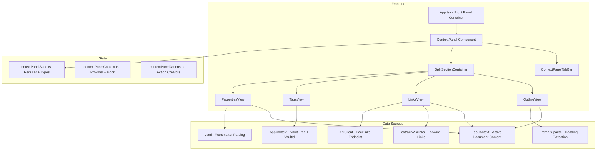

# Design Document: Context Panel

## Overview

Das Context Panel ersetzt den bisherigen Platzhalter im rechten Seitenpanel durch vier spezialisierte Ansichten, die kontextbezogene Informationen zum aktiven Dokument anzeigen. Die Implementierung nutzt die bestehende Right-Panel-Infrastruktur (`useResize`, Toggle-Button) und erweitert sie um ein Tab-System mit Drag & Drop, Split-Sections und reaktive Datenquellen.

**Kernentscheidungen:**
- Eigener `contextPanelReducer` + `ContextPanelProvider` (separate Concerns, kein Mega-Reducer)
- Frontend-only Heading-Parsing und Tag-Extraktion (kein neuer Backend-Endpoint für Outline/Tags)
- Backend-Backlinks über bestehenden `GET /vaults/:vaultId/backlinks?path=` Endpoint
- HTML5 Drag API für Tab-Reordering und Panel-Splitting (konsistent mit SidebarToolbar)
- localStorage-Persistenz für Tab-Order und Split-Layout (user-scoped Key)

## Architecture



### Integration in bestehende Architektur

Das Context Panel wird als eigenständiger Feature-Bereich mit eigenem Provider in die bestehende Provider-Hierarchie eingefügt:

```
AuthProvider → I18nBridge → I18nProvider → AuthGuard → AppProvider → TabProvider → ChatProvider → SyncProvider → ContextPanelProvider → AppContent
```

Der `ContextPanelProvider` sitzt innerhalb von `TabProvider` (braucht Zugriff auf aktives Dokument) und `AppProvider` (braucht Vault-Tree für Link-Resolution und Tag-Extraktion).

## Components and Interfaces

### State Layer

```typescript
// frontend/src/state/contextPanelState.ts

/** Identifiers for the four context panel views */
export type ContextPanelViewId = 'outline' | 'links' | 'tags' | 'properties';

/** A single split section within the context panel */
export interface SplitSection {
  id: string;
  viewIds: ContextPanelViewId[];
  activeViewId: ContextPanelViewId;
  /** Height as a fraction (0–1) of total panel body height */
  heightFraction: number;
}

/** Heading entry for the outline view */
export interface OutlineHeading {
  text: string;
  level: 1 | 2 | 3 | 4 | 5 | 6;
  anchor: string;
}

/** Link entry for the links view */
export interface LinkEntry {
  target: string;
  displayName: string;
  resolved: boolean;
}

/** Tag entry for the tags view */
export interface TagEntry {
  name: string;
  count: number;
}

/** Context panel state */
export interface ContextPanelState {
  sections: SplitSection[];
  tabOrder: ContextPanelViewId[];
  outline: {
    headings: OutlineHeading[];
    activeAnchor: string | null;
  };
  links: {
    forward: LinkEntry[];
    backlinks: LinkEntry[];
    backlinksLoading: boolean;
    backlinksError: string | null;
  };
  tags: {
    entries: TagEntry[];
    loading: boolean;
    expandedTag: string | null;
    tagFiles: string[];
  };
  properties: {
    data: Record<string, unknown> | null;
    parseError: string | null;
    rawFrontmatter: string | null;
  };
}

/** Action types for the context panel reducer */
export type ContextPanelAction =
  | { type: 'SET_TAB_ORDER'; tabOrder: ContextPanelViewId[] }
  | { type: 'SET_ACTIVE_VIEW'; sectionId: string; viewId: ContextPanelViewId }
  | { type: 'SPLIT_VIEW'; viewId: ContextPanelViewId; targetSectionIndex: number }
  | { type: 'MERGE_SECTION'; sectionId: string; targetSectionId: string; viewId: ContextPanelViewId }
  | { type: 'REMOVE_SECTION'; sectionId: string }
  | { type: 'RESIZE_SECTIONS'; heightFractions: number[] }
  | { type: 'SET_OUTLINE'; headings: OutlineHeading[] }
  | { type: 'SET_ACTIVE_ANCHOR'; anchor: string | null }
  | { type: 'SET_FORWARD_LINKS'; links: LinkEntry[] }
  | { type: 'SET_BACKLINKS'; backlinks: LinkEntry[] }
  | { type: 'SET_BACKLINKS_LOADING'; loading: boolean }
  | { type: 'SET_BACKLINKS_ERROR'; error: string | null }
  | { type: 'SET_TAGS'; entries: TagEntry[] }
  | { type: 'SET_TAGS_LOADING'; loading: boolean }
  | { type: 'SET_TAG_EXPANDED'; tag: string | null; files: string[] }
  | { type: 'SET_PROPERTIES'; data: Record<string, unknown> | null; parseError: string | null; rawFrontmatter: string | null }
  | { type: 'RESET_DOCUMENT_STATE' };
```

### Component Layer

```typescript
// frontend/src/components/ContextPanel.tsx
interface ContextPanelProps {
  /** Current document content (from active tab's editBuffer or content) */
  documentContent: string | null;
  /** Current document file path (relative to vault root) */
  documentPath: string | null;
  /** Current vault ID */
  vaultId: string | null;
  /** Panel width in pixels (from useResize) */
  width: number;
}
```

```typescript
// frontend/src/components/context-panel/ContextPanelTabBar.tsx
interface ContextPanelTabBarProps {
  tabs: ContextPanelViewId[];
  activeTab: ContextPanelViewId;
  onTabClick: (viewId: ContextPanelViewId) => void;
  onTabReorder: (newOrder: ContextPanelViewId[]) => void;
  onTabSplit: (viewId: ContextPanelViewId) => void;
  panelWidth: number;
}
```

```typescript
// frontend/src/components/context-panel/OutlineView.tsx
interface OutlineViewProps {
  headings: OutlineHeading[];
  activeAnchor: string | null;
  onHeadingClick: (anchor: string) => void;
}
```

```typescript
// frontend/src/components/context-panel/LinksView.tsx
interface LinksViewProps {
  forwardLinks: LinkEntry[];
  backlinks: LinkEntry[];
  backlinksLoading: boolean;
  backlinksError: string | null;
  onLinkClick: (target: string, resolved: boolean) => void;
}
```

```typescript
// frontend/src/components/context-panel/TagsView.tsx
interface TagsViewProps {
  tags: TagEntry[];
  loading: boolean;
  expandedTag: string | null;
  tagFiles: string[];
  onTagClick: (tagName: string) => void;
  onFileClick: (filePath: string) => void;
}
```

```typescript
// frontend/src/components/context-panel/PropertiesView.tsx
interface PropertiesViewProps {
  data: Record<string, unknown> | null;
  parseError: string | null;
  rawFrontmatter: string | null;
}
```

### API Layer (existing endpoint)

```typescript
// Existing: GET /api/v1/vaults/:vaultId/backlinks?path=<filePath>
// Response: { path: string, backlinks: string[] }
```

Kein neuer Backend-Endpoint nötig. Tags und Outline werden client-seitig aus dem Vault-Tree und Dateiinhalten extrahiert.

### Tags-Extraktion (neuer Backend-Endpoint)

Für die vault-weite Tag-Übersicht wird ein neuer Endpoint benötigt, da das Frontend nicht alle Dateien eines Vaults im Speicher hat:

```typescript
// NEW: GET /api/v1/vaults/:vaultId/tags
// Response: { tags: Array<{ name: string, count: number, files: string[] }> }
```

Dieser Endpoint iteriert über alle Text-Dateien im Vault, extrahiert Tags mit der gleichen Regex wie das Frontend-Tag-Plugin und gibt eine aggregierte Übersicht zurück. Die Implementierung nutzt den bestehenden `IVaultReader` zum Lesen der Dateien.

## Data Models

### localStorage Schema

```typescript
// Key: `slatebase_context_panel_${userId}`
interface PersistedContextPanelLayout {
  tabOrder: ContextPanelViewId[];
  sections: Array<{
    viewIds: ContextPanelViewId[];
    activeViewId: ContextPanelViewId;
    heightFraction: number;
  }>;
}
```

### Tag Extraction (Backend)

```typescript
// backend/src/api/graphRoutes.ts (extension)
// or new: backend/src/api/tagRoutes.ts

interface VaultTagInfo {
  name: string;
  count: number;  // number of distinct files containing this tag
  files: string[];  // relative file paths
}

interface VaultTagsResponse {
  tags: VaultTagInfo[];
}
```

### Heading Extraction (Frontend-only)

Headings werden client-seitig aus dem aktiven Dokument-Content extrahiert. Die Extraktion nutzt eine einfache Regex auf dem Markdown-Quelltext (nicht den MDAST-Baum), da der Content als String vorliegt und kein vollständiges Parsing nötig ist:

```typescript
// Regex: /^(#{1,6})\s+(.+)$/gm
// Ergebnis: Array<{ level: 1-6, text: string (ohne # und Formatierung), anchor: string }>
```

Die Anchor-Generierung nutzt die bestehende `generateHeadingAnchor()` aus `heading-anchor.ts` mit einem `createAnchorTracker()` für Duplikat-Handling.

## Correctness Properties

*A property is a characteristic or behavior that should hold true across all valid executions of a system — essentially, a formal statement about what the system should do. Properties serve as the bridge between human-readable specifications and machine-verifiable correctness guarantees.*

### Property 1: Tab switching displays only the active view

*For any* sequence of tab clicks on the Context Panel, after clicking a View_Tab, only the corresponding view shall be visible and all other views shall be hidden.

**Validates: Requirements 1.2**

### Property 2: Tab reorder produces correct insertion order

*For any* tab order permutation and any valid drag operation (source index, target index), the resulting tab order shall have the dragged tab inserted at the target index with all other tabs shifted accordingly, preserving their relative order.

**Validates: Requirements 1.5, 6.1**

### Property 3: Heading extraction captures all headings with correct levels

*For any* Markdown document containing headings (h1–h6), the outline extraction shall return all headings in document order, each with the correct level (1–6) and plain text content (without `#` markers or inline formatting syntax).

**Validates: Requirements 2.1**

### Property 4: Heading anchor normalization is consistent

*For any* heading text, the anchor generated for outline navigation shall be identical to the output of `generateHeadingAnchor()` from `heading-anchor.ts`, ensuring that clicking an outline entry scrolls to the correct heading.

**Validates: Requirements 2.3**

### Property 5: Forward link extraction is complete

*For any* Markdown document containing wikilinks (outside code blocks), the Links_View forward link list shall contain exactly the same targets as returned by `extractWikilinks()`.

**Validates: Requirements 3.2**

### Property 6: Resolved vs unresolved link visual distinction

*For any* link entry in the Links_View, if the link target exists in the vault tree then it shall be rendered with normal opacity and no strikethrough; if the target does not exist, it shall be rendered with opacity 0.5 and strikethrough text decoration.

**Validates: Requirements 3.6**

### Property 7: Tags are sorted alphabetically case-insensitive

*For any* set of tags returned from the vault, the Tags_View shall display them in case-insensitive alphabetical order, treating nested tags (e.g., `#project/alpha`) as flat strings for sorting.

**Validates: Requirements 4.3**

### Property 8: Frontmatter key-value display completeness

*For any* valid YAML frontmatter object, the Properties_View shall display all top-level keys in the first column and their corresponding values in the second column, with no keys omitted or duplicated.

**Validates: Requirements 5.1**

### Property 9: Nested YAML indentation depth

*For any* YAML object with nesting depth N, the Properties_View shall indent nested keys by 1rem per level for levels 1 through 5, and render levels deeper than 5 as inline JSON text.

**Validates: Requirements 5.2**

### Property 10: Array values render as comma-separated text

*For any* YAML array value, the Properties_View shall render it as a comma-separated inline string within the value column.

**Validates: Requirements 5.5**

### Property 11: Tab order persistence round-trip

*For any* valid tab order (permutation of the four view identifiers), serializing to localStorage and deserializing shall produce the identical tab order.

**Validates: Requirements 6.4**

### Property 12: Split section creation distributes height equally

*For any* initial section configuration (1 or 2 sections), creating a new split section shall result in all sections having equal height fractions that sum to 1.0.

**Validates: Requirements 7.1**

### Property 13: Section resize maintains minimum height invariant

*For any* resize operation between two adjacent sections, both sections shall maintain a minimum height of 80px. If the drag delta would violate this constraint, the resize shall be clamped.

**Validates: Requirements 7.3, 7.4**

### Property 14: Empty section removal on merge

*For any* section containing exactly one view, moving that view to another section shall remove the now-empty section and redistribute its height equally among remaining sections.

**Validates: Requirements 7.5**

### Property 15: Maximum three sections invariant

*For any* sequence of split operations on the Context Panel, the number of simultaneous Split_Sections shall never exceed three.

**Validates: Requirements 7.6**

### Property 16: Layout persistence round-trip

*For any* valid split layout configuration (number of sections, height fractions, view assignments), serializing to localStorage and deserializing shall produce an identical layout.

**Validates: Requirements 7.8**

### Property 17: Responsive icon-only mode below 200px

*For any* Context Panel width, tab labels shall be hidden (icon-only) when width < 200px and visible (icon + label) when width ≥ 200px.

**Validates: Requirements 8.1, 8.4**

### Property 18: Text entries have tooltip with full text

*For any* text entry (file path, tag name, or property value) displayed in the Context Panel, the element shall have a `title` attribute containing the full untruncated text.

**Validates: Requirements 8.2**


## Error Handling

### Frontend Errors

| Error Scenario | Handling Strategy |
|---|---|
| Backlinks API returns error (network, 500, 404) | Display localized error message in "Eingehende Links" section; forward links remain functional |
| Tags API returns error | Display error message in Tags_View; other views unaffected |
| YAML frontmatter parse failure | Display error message + raw frontmatter as `<pre>` code block |
| localStorage unavailable (private browsing, quota) | Fall back to default tab order and layout; no error shown to user |
| localStorage contains invalid/corrupted data | Discard stored data, use defaults; no error shown |
| Document content is null (no active document) | All views show localized placeholder message |
| extractWikilinks throws on malformed content | Catch error, display empty forward links list |
| Heading regex fails on edge-case content | Return empty headings array, show "no headings" message |

### Backend Errors (Tags Endpoint)

| Error Scenario | Handling Strategy |
|---|---|
| File cannot be read during tag extraction | Skip file, continue processing; log warning via ILogger |
| Vault not found | Return 404 with standard API error format |
| Access denied | Return 403 with standard API error format |
| Path traversal attempt in file paths | Rejected by validateFilePath(); return 400 |

### Graceful Degradation Principles

- Each view operates independently — an error in one view does not affect others
- Network errors in backlinks/tags do not block the outline or properties views
- Debounced updates prevent excessive re-computation during rapid typing
- The panel remains functional even if localStorage is unavailable

## Testing Strategy

### Unit Tests (Vitest + Testing Library)

**Reducer Tests** (`contextPanelState.test.ts`):
- All action types produce correct state transitions
- Tab reorder logic for all valid source/target combinations
- Split section creation, merge, and removal
- Height fraction redistribution after split/merge
- Maximum section count enforcement
- Default state initialization

**Component Tests** (`ContextPanel.test.tsx`, view-specific test files):
- Each view renders correct content for given props
- Placeholder messages when no document is open
- Error states (API errors, parse errors)
- Loading states
- Tab click switches active view
- Responsive behavior (icon-only below 200px)

**Utility Tests**:
- Heading extraction from various markdown inputs
- Tag sorting (case-insensitive alphabetical)
- Frontmatter parsing (valid, invalid, empty, nested)
- Array value formatting
- localStorage serialization/deserialization
- Link resolution against vault tree

### Property-Based Tests (fast-check)

**Library:** `fast-check` (already a devDependency in both packages)

**Configuration:** Minimum 100 iterations per property test.

**File:** `frontend/src/components/context-panel/context-panel.pbt.test.ts`

Each property test references its design document property with a tag comment:
```typescript
// Feature: context-panel, Property 2: Tab reorder produces correct insertion order
```

**Properties to implement as PBT:**
- Property 2: Tab reorder correctness (generate random source/target indices)
- Property 3: Heading extraction (generate random markdown with headings)
- Property 4: Anchor normalization consistency (generate random heading texts)
- Property 7: Tag sorting (generate random tag name arrays)
- Property 8: Frontmatter key display (generate random key-value objects)
- Property 10: Array rendering (generate random arrays)
- Property 11: Tab order persistence round-trip (generate random permutations)
- Property 12: Split height distribution (generate random initial configurations)
- Property 13: Resize minimum height (generate random deltas and initial heights)
- Property 15: Max sections invariant (generate random split sequences)
- Property 16: Layout persistence round-trip (generate random layouts)
- Property 17: Responsive threshold (generate random widths)

### Integration Tests

- Backlinks API integration (mock fetch, verify correct endpoint called)
- Tags API integration (mock fetch, verify loading/success/error states)
- Debounce behavior (mock timers, verify 500ms delay)
- Document switch triggers view updates
- Scroll-based heading highlight (IntersectionObserver mock)

### E2E Tests (Playwright)

- Open context panel, verify all four tabs visible
- Switch between tabs, verify correct view displayed
- Drag tab to reorder, verify new order persists after reload
- Split panel by dragging tab below, verify two sections
- Resize split sections, verify minimum height constraint
- Click outline heading, verify document scrolls
- Click resolved link, verify new tab opens
- Responsive: resize panel below 200px, verify icon-only mode

### Backend Tests

**Tags Endpoint** (`graphRoutes.test.ts` or `tagRoutes.test.ts`):
- Returns correct tag counts for vault with known content
- Skips unreadable files without error
- Returns empty array for vault with no tags
- Respects access control (403 for unauthorized users)
- Returns 404 for non-existent vault
