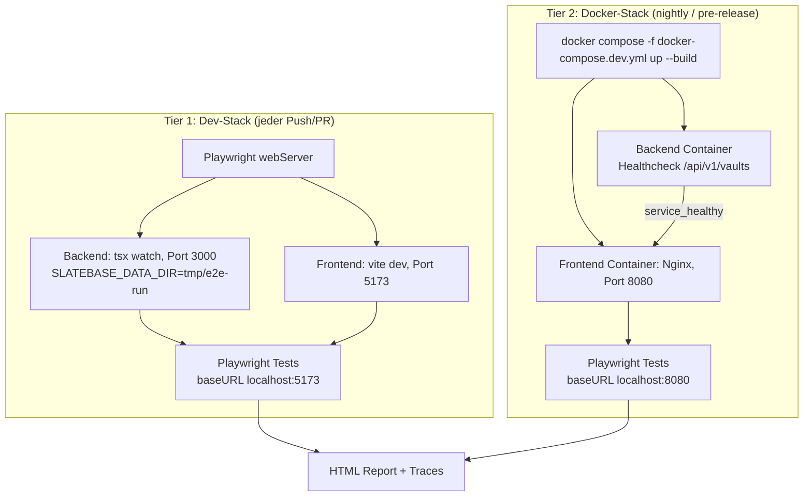
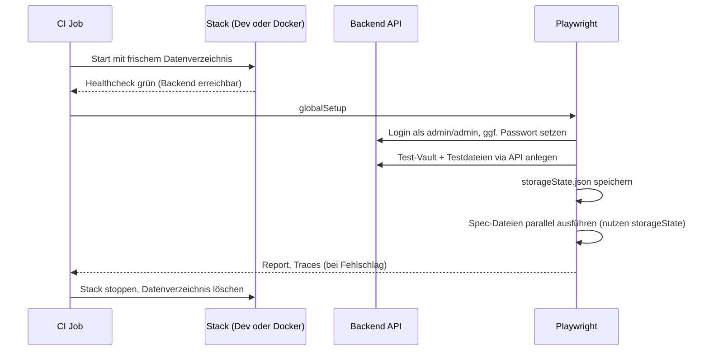

# Design Document: Echte E2E-Test-Suite

## Overview

Dieses Design beschreibt den Aufbau einer echten End-to-End-Test-Suite für Slatebase mit Playwright. "Echt" bedeutet hier konkret: Browser spricht mit dem tatsächlichen Frontend-Build, das tatsächliche HTTP-Requests gegen ein laufendes Backend absetzt, das echte Dateien auf einem echten Dateisystem liest/schreibt — kein Mocking von API-Responses, kein Stubbing von SSE.

**Ausgangslage:** Playwright ist bereits als Dependency und Config vorhanden (`frontend/playwright.config.ts`), wird aber nirgends in der CI ausgeführt. Der einzige vorhandene Spec (`demo-recording.spec.ts`) hat keine Assertions und dient der Aufnahme eines Marketing-GIFs — er ist bewusst kein Test und bleibt es auch nach diesem Design.

**Kernentscheidungen:**
- **Zwei-Stufen-Strategie**: schnelle Dev-Stack-Läufe bei jedem Push (Feedback in Minuten) + realitätsnahe Docker-Stack-Läufe nightly/pre-release (echte Nginx-/Container-Topologie wie beim Self-Hoster).
- **Test_Data_Isolation über ein dediziertes Datenverzeichnis pro Lauf**, da Slatebase keine Datenbank hat, sondern direkt auf dem Dateisystem persistiert (`backend/data` bzw. Docker-Volume `slatebase-data`).
- **Page-Object-Modell** statt der aktuellen Ad-hoc-Selektoren (`title="Profil"`, CSS-Klassen), um die Suite gegen UI-Refactorings robust zu halten.
- **Zwei-Browser-Kontext-Tests** für Realtime/SSE-Szenarien (Sharing, Presence), weil das die Eigenschaft ist, die Unit-/Integrationstests strukturell nicht abdecken können.

## Architecture

### Zwei-Stufen-Testumgebung



Beide Stufen laufen **dieselben Testdateien** — nur `baseURL` und Startmechanismus unterscheiden sich. Das verhindert, dass zwei separate Testsuiten gepflegt werden müssen.

### Setup/Teardown-Sequenz (pro Lauf)



## Components and Interfaces

### 1. Testumgebungs-Steuerung

**Env-Variable `E2E_TARGET`** steuert, gegen welchen Stack getestet wird:

| Wert | baseURL | Start |
|------|---------|-------|
| `dev` (Default) | `http://localhost:5173` | Playwright `webServer` startet Backend + Frontend |
| `docker` | `http://localhost:8080` | extern über `docker compose -f docker-compose.dev.yml up` gestartet, Playwright startet nichts selbst |

**`frontend/playwright.config.ts` Erweiterung:**

```typescript
const target = process.env.E2E_TARGET ?? 'dev'
const isDocker = target === 'docker'

export default defineConfig({
  testDir: './e2e/specs',        // demo-recording.spec.ts bleibt bewusst außerhalb
  globalSetup: './e2e/global-setup.ts',
  fullyParallel: true,
  forbidOnly: !!process.env.CI,
  retries: process.env.CI ? 2 : 0,
  workers: process.env.CI ? 2 : undefined,
  reporter: process.env.CI ? [['html'], ['github']] : 'html',
  use: {
    baseURL: isDocker ? 'http://localhost:8080' : 'http://localhost:5173',
    storageState: './e2e/.auth/admin.json',
    trace: 'on-first-retry',
    screenshot: 'only-on-failure',
    video: 'retain-on-failure',
  },
  projects: [{ name: 'chromium', use: { ...devices['Desktop Chrome'] } }],
  webServer: isDocker
    ? undefined
    : [
        {
          command: 'npm run dev',
          cwd: '../backend',
          url: 'http://localhost:3000/api/v1/vaults', // 401 = healthy, s.u.
          reuseExistingServer: !process.env.CI,
          env: { SLATEBASE_DATA_DIR: 'tmp/e2e-run' },
        },
        {
          command: 'npm run dev',
          url: 'http://localhost:5173',
          reuseExistingServer: !process.env.CI,
        },
      ],
})
```

Da `/api/v1/vaults` unauthentifiziert `401` liefert (siehe bestehender Docker-Healthcheck), gilt für den `url`-Readycheck: Playwright akzeptiert per Default nur 2xx/3xx als "ready" — hier wird stattdessen ein kleines Wrapper-Skript (`e2e/wait-for-backend.mjs`) verwendet, das explizit auf HTTP-Antwort (beliebiger Status) statt auf 2xx wartet.

### 2. Test_Data_Isolation

**Backend-seitig:** `SLATEBASE_DATA_DIR` (bereits vorhandener Konfigurationsmechanismus für den Datenpfad) wird für Tier 1 auf ein `tmp/e2e-run-<CI_RUN_ID>`-Verzeichnis gesetzt, das vor dem Lauf leer ist und danach von der CI aufgeräumt wird (`actions/upload-artifact` nur bei Fehlschlag, sonst `rm -rf`).

**Docker-seitig (Tier 2):** eigenes Compose-Overlay `docker-compose.e2e.yml`, das das Volume `slatebase-data` durch ein anonymes, pro Lauf frisches Volume ersetzt, statt das produktiv genutzte Volume zu mounten:

```yaml
services:
  backend:
    volumes:
      - e2e-data:/app/data
volumes:
  e2e-data:
```

**Seed-Daten via `globalSetup`, nicht über Fixtures im Repo:** `e2e/global-setup.ts` loggt sich per API als `admin`/`admin` ein (Default-Credentials aus `docker.env.example`), durchläuft ggf. den erzwungenen Passwortwechsel, legt einen Test-Vault samt einiger Markdown-Dateien über die REST-API an und schreibt den authentifizierten Zustand nach `e2e/.auth/admin.json`. Ein zweiter Nutzer (für Sharing-/Realtime-Szenarien) wird ebenfalls dort angelegt und als `e2e/.auth/second-user.json` gespeichert.

Vorteil gegenüber eingecheckten Fixture-Dateien: Die Testdaten sind immer konsistent mit dem aktuellen API-Contract und verrotten nicht.

### 3. Page Objects

```
frontend/e2e/
├── specs/                      # echte Tests (siehe Requirement 3)
│   ├── auth.spec.ts
│   ├── vault-management.spec.ts
│   ├── file-explorer.spec.ts
│   ├── editor.spec.ts
│   ├── tabs-navigation.spec.ts
│   ├── sharing-realtime.spec.ts
│   └── admin.spec.ts
├── pages/
│   ├── login.page.ts
│   ├── vault-explorer.page.ts
│   ├── editor.page.ts
│   ├── admin.page.ts
│   └── my-vaults.page.ts
├── fixtures.ts                 # erweitert `test` um Page Objects + zweiten Auth-Kontext
├── global-setup.ts
├── wait-for-backend.mjs
└── demo-recording.spec.ts      # unverändert, NICHT in testDir, nur manuell ausführbar
```

**Beispiel Page Object** (`login.page.ts`):

```typescript
export class LoginPage {
  constructor(private page: Page) {}

  async login(username: string, password: string) {
    await this.page.getByTestId('login-username').fill(username)
    await this.page.getByTestId('login-password').fill(password)
    await this.page.getByTestId('login-submit').click()
    await this.page.getByTestId('app-shell').waitFor()
  }
}
```

**`fixtures.ts`** erweitert die Basis-`test`-Funktion um Page Objects und einen zweiten Browser-Kontext für Realtime-Szenarien:

```typescript
export const test = base.extend<{
  loginPage: LoginPage
  editorPage: EditorPage
  secondUserPage: Page   // eigener Context mit second-user.json storageState
}>({
  loginPage: async ({ page }, use) => use(new LoginPage(page)),
  editorPage: async ({ page }, use) => use(new EditorPage(page)),
  secondUserPage: async ({ browser }, use) => {
    const context = await browser.newContext({ storageState: './e2e/.auth/second-user.json' })
    const page = await context.newPage()
    await use(page)
    await context.close()
  },
})
```

### 4. Stable Selectors (`data-testid`)

Aktuell nutzt selbst das Demo-Skript fragile Selektoren (`title="Profil"`, `.tree-node-file`, `.my-vaults-share-btn`). Für die in Requirement 3 genannten Flows werden gezielt `data-testid`-Attribute ergänzt — **nicht** flächendeckend im ersten Schritt, sondern entlang der tatsächlich benötigten Test-Pfade:

| Bereich | Neue `data-testid`s (Beispiele) |
|---|---|
| Login | `login-username`, `login-password`, `login-submit`, `login-error` |
| App-Shell | `app-shell`, `vault-switcher`, `vault-switcher-item` |
| Explorer | `tree-node-file`, `tree-node-folder`, `explorer-new-file`, `explorer-context-menu` |
| Editor | `editor-textarea`, `editor-mode-toggle`, `editor-save-indicator` |
| Tabs | `tab-item`, `tab-close` |
| Sharing | `share-button`, `share-user-input`, `share-user-suggestion` |
| Admin | `admin-nav-users`, `admin-user-row` |

Bestehende CSS-Klassen bleiben unangetastet (kein Styling-Risiko) — `data-testid` wird zusätzlich gesetzt.

### 5. Realtime_Scenario (Beispiel: Sharing)

```typescript
test('geteilter Vault erscheint beim zweiten Nutzer ohne Reload', async ({ page, secondUserPage, vaultExplorerPage }) => {
  await vaultExplorerPage.shareVaultWith(page, 'Test-Vault', 'second-user')

  await expect(secondUserPage.getByTestId('vault-switcher-item').filter({ hasText: 'Test-Vault' }))
    .toBeVisible({ timeout: 5000 }) // wartet auf SSE-Push, kein manueller Reload
})
```

Wichtig: `expect(...).toBeVisible()` mit Timeout statt `waitForTimeout` — die Suite wartet auf den tatsächlichen SSE-getriebenen DOM-Update, nicht auf eine geschätzte Zeitspanne (Requirement 4.3).

## CI Integration

### Tier 1 — eigener Workflow `.github/workflows/e2e.yml` (statt Job in `ci.yml`)

**Trigger-Entscheidung (Änderung gegenüber einer früheren Fassung dieses Designs):** Ursprünglich war ein `e2e`-Job *innerhalb* von `ci.yml` mit `needs: [backend, frontend]` geplant. Problem dabei: `ci.yml` triggert auf `push` auf **alle** Branches *und* auf `pull_request` — jeder Push in einem offenen PR hätte damit zwei volle E2E-Läufe ausgelöst (einmal für den Push, einmal für das PR-Update), und jeder reine Doku-/Steering-Commit hätte den teuersten CI-Job unnötig mitgezogen. Path-Filter lassen sich in GitHub Actions nur auf **Workflow-Ebene** (`on.pull_request.paths`) sauber definieren, nicht pro Job innerhalb eines gemeinsam getriggerten Workflows — daher ein eigenständiger Workflow statt eines zusätzlichen Jobs in `ci.yml`.

```yaml
name: E2E (Dev Stack)

on:
  pull_request:
    branches:
      - master
    paths:
      - 'frontend/**'
      - 'backend/**'

jobs:
  e2e:
    runs-on: ubuntu-latest
    steps:
      - uses: actions/checkout@v7
      - uses: actions/setup-node@v7
        with:
          node-version: '24'
      - run: npm ci
        working-directory: backend
      - run: npm ci
        working-directory: frontend
      - run: npx playwright install --with-deps chromium
        working-directory: frontend
      - run: npm run test:e2e
        working-directory: frontend
        env:
          CI: true
          E2E_TARGET: dev
      - uses: actions/upload-artifact@v4
        if: failure()
        with:
          name: playwright-report
          path: frontend/playwright-report/
          retention-days: 7
```

**Auswirkung dieser Entscheidung:**
- Läuft **nicht** bei Push auf Feature-Branches (nur wenn ein PR gegen `master` offen ist bzw. aktualisiert wird) — kein Doppel-Lauf mit dem bestehenden `push`-Trigger von `ci.yml`.
- Läuft **nicht**, wenn ein PR ausschließlich `.kiro/**`, Root-`*.md` o.ä. ändert (Path-Filter) — Doku-/Spec-only-PRs bleiben schnell.
- `backend`/`frontend`-Jobs aus `ci.yml` laufen weiterhin unverändert bei jedem Push (Lint/Unit-Tests bleiben das schnelle erste Feedback); der E2E-Workflow läuft parallel dazu, statt in Serie dahinter — kein `needs`-Constraint mehr, da er ein eigener Workflow ist. Das kostet minimal etwas CI-Rechenzeit bei PRs, deren `backend`/`frontend`-Job ohnehin scheitert, spart dafür aber Wartezeit bis zum Gesamtergebnis.
- **Branch Protection:** Der Check `E2E (Dev Stack) / e2e` wird in den GitHub-Branch-Protection-Regeln für `master` als *Required Status Check* eingetragen (Repo-Einstellung, kein YAML) — damit ist er verpflichtendes Merge-Gate (Requirement 1.6), ohne bei jedem Push auf einem Feature-Branch zu laufen.

### Tier 2 — neuer Workflow `.github/workflows/e2e-docker.yml`

Trigger: `schedule` (nightly, z.B. `0 3 * * *`) + `workflow_dispatch` + beim Erstellen eines Release-Tags (Hook in `release.yml`, nach dem Docker-Build-Job, vor Push zu `latest`, analog zum bestehenden Ansatz in `.kiro/specs/ci-cd-release`).

```yaml
name: E2E (Docker Stack)
on:
  schedule:
    - cron: '0 3 * * *'
  workflow_dispatch:

jobs:
  e2e-docker:
    runs-on: ubuntu-latest
    steps:
      - uses: actions/checkout@v7
      - run: docker compose -f docker-compose.dev.yml -f docker-compose.e2e.yml up --build -d
      - run: npx wait-on http://localhost:8080 --timeout 60000
      - uses: actions/setup-node@v7
        with:
          node-version: '24'
      - run: npm ci && npx playwright install --with-deps chromium
        working-directory: frontend
      - run: npm run test:e2e
        working-directory: frontend
        env:
          E2E_TARGET: docker
      - if: always()
        run: docker compose -f docker-compose.dev.yml -f docker-compose.e2e.yml down -v
      - uses: actions/upload-artifact@v4
        if: failure()
        with:
          name: playwright-report-docker
          path: frontend/playwright-report/
```

Ein roter Nightly-Run erzeugt automatisch einen sichtbaren fehlgeschlagenen Workflow-Run in GitHub Actions (Requirement 5.4) — kein zusätzlicher Benachrichtigungsmechanismus nötig, GitHub zeigt fehlgeschlagene Scheduled Runs im Actions-Tab und per E-Mail an die Repo-Owner an.

## Error Handling

| Fehler | Verhalten |
|---|---|
| Backend/Frontend startet nicht innerhalb Timeout | `webServer`/`wait-on` schlägt fehl, Job bricht mit klarer Fehlermeldung ab, kein Testlauf |
| Login im globalSetup schlägt fehl (z.B. API-Contract geändert) | `globalSetup` wirft, gesamte Suite bricht sofort ab statt einzelne Tests mit unklaren Fehlern zu produzieren |
| Einzelner Test schlägt fehl | Playwright-Retry (CI: 2x), danach als fehlgeschlagen markiert, Trace/Screenshot/Video als Artefakt |
| Docker-Stack-Healthcheck bleibt rot | `docker compose up` Schritt schlägt fehl, Job bricht ab, Container-Logs werden vor `down` ausgegeben (`docker compose logs`) |
| Flaky Test wiederholt rot über mehrere Läufe | Kein automatisches Stilllegen — bewusst sichtbar lassen (Requirement 5.3), manuell als Tech-Debt behandeln statt versteckt zu retryen |

## Testing Strategy (Rollout-Phasen)

Nicht alle Flows aus Requirement 3 werden auf einmal umgesetzt — Reihenfolge nach Risiko/Häufigkeit reale Bugs:

1. **Phase 1 — Fundament:** `global-setup.ts`, `wait-for-backend.mjs`, Page Objects für Login/App-Shell, `auth.spec.ts` (Login inkl. erzwungener Passwortwechsel), CI-Job Tier 1. *Ziel: Die Infrastruktur steht, ein echter Test läuft grün in der PR-CI.*
2. **Phase 2 — Kern-Workflow:** `vault-management.spec.ts`, `file-explorer.spec.ts`, `editor.spec.ts` (inkl. Autosave-Persistenz nach Reload, Source/Live-Preview-Wechsel).
3. **Phase 3 — Realtime & Zusammenarbeit:** `sharing-realtime.spec.ts` mit zwei Browser-Kontexten, `tabs-navigation.spec.ts`.
4. **Phase 4 — Admin & Docker-Stufe:** `admin.spec.ts`, `docker-compose.e2e.yml`, Nightly-Workflow, Anbindung an `release.yml`.

Bewusst zurückgestellt (nicht Teil dieses Konzepts): Knowledge-Graph, Canvas, Chat, MCP-Token-Verwaltung — diese sind UI-intensiv und werden nach Etablierung des Musters (Phase 1–4) nach demselben Page-Object-Ansatz ergänzt.

## File Structure

```
frontend/
├── e2e/
│   ├── specs/
│   │   ├── auth.spec.ts
│   │   ├── vault-management.spec.ts
│   │   ├── file-explorer.spec.ts
│   │   ├── editor.spec.ts
│   │   ├── tabs-navigation.spec.ts
│   │   ├── sharing-realtime.spec.ts
│   │   └── admin.spec.ts
│   ├── pages/
│   │   ├── login.page.ts
│   │   ├── vault-explorer.page.ts
│   │   ├── editor.page.ts
│   │   ├── admin.page.ts
│   │   └── my-vaults.page.ts
│   ├── fixtures.ts
│   ├── global-setup.ts
│   ├── wait-for-backend.mjs
│   ├── .auth/                        # gitignored: storageState.json pro Nutzer
│   └── demo-recording.spec.ts        # bestehend, unverändert, außerhalb testDir
├── playwright.config.ts              # erweitert (siehe oben)
└── package.json                      # test:e2e unverändert, testDir sorgt für Trennung

docker-compose.e2e.yml                # neues Overlay: isoliertes Datenvolume für Tier 2

.github/workflows/
├── ci.yml                            # neuer Job `e2e` (Tier 1)
└── e2e-docker.yml                    # neu (Tier 2, nightly + workflow_dispatch)
```

## Offene Punkte für die Umsetzungsplanung

- Genaue Liste der neu einzuführenden `data-testid`s pro Komponente (wird beim Schreiben der jeweiligen Page Objects final festgelegt, Tabelle oben ist eine Startauswahl).
- Ob der zweite Testnutzer für Realtime-Szenarien pro Lauf neu angelegt oder als fester Seed-Nutzer wiederverwendet wird (Empfehlung: pro Lauf neu, analog zum Admin-Nutzer, um Testdaten-Kollisionen bei parallelen Workern zu vermeiden).
- Ob Tier 2 zusätzlich `docker-compose.yml` (Produktions-Images von GHCR) statt nur `docker-compose.dev.yml` (lokaler Build) gegen den zuletzt veröffentlichten Release testen soll — sinnvoll als zusätzliche Stufe 3 ("Post-Release-Smoke-Test"), hier bewusst nicht spezifiziert, um den Erstumfang klein zu halten.
