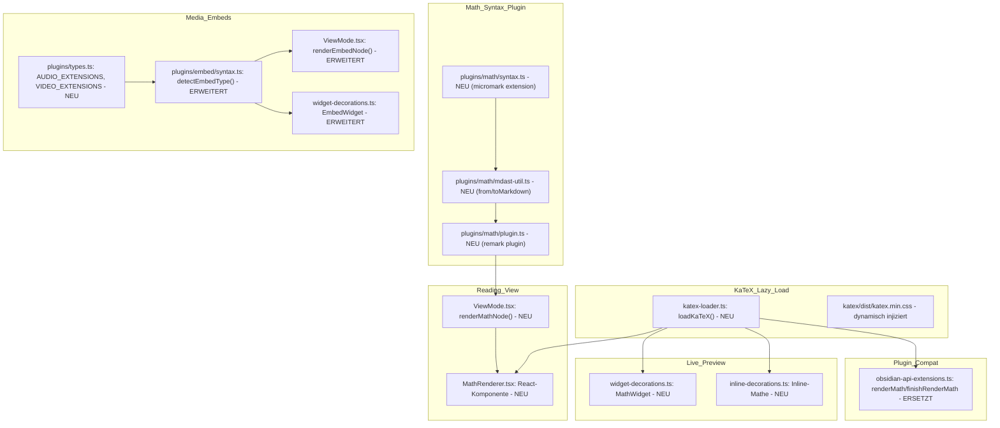

# Design Document: Editor-Erweiterungen — Mathe & Medien

## Overview

Diese Spec liefert zwei unabhängige Ergänzungen an die bestehende Rendering-Pipeline — KaTeX-Mathe und Audio/Video-Embeds. Beide Teile docken an vorhandene, bewährte Mechanismen an: KaTeX nutzt das Mermaid-Lazy-Load-Pattern, Media-Embeds erweitern die bestehende `detectEmbedType()`-Kaskade. Es entsteht **keine neue Kernarchitektur**.

**Kernentscheidungen:**

- **KaTeX statt MathJax**: KaTeX ist deutlich leichtgewichtiger (~300 KB vs. ~1.5 MB), hat keine globalen DOM-Patches, ist synchron renderbar (kein Reflow/Layout-Shift), und Obsidians eigene Implementierung hat ebenfalls zu KaTeX gewechselt (ab Obsidian 1.4+). `renderMath`/`finishRenderMath` heißen historisch nach MathJax, nutzen intern aber KaTeX.
- **Lazy-Load mit Modul-Level-Cache** (gleicher Mechanismus wie `loadMermaid()`): Ein einziger `import('katex')` beim ersten Mathe-Vorkommen; Ergebnis gecacht. CSS wird als Side-Effect beim Laden mit injiziert.
- **Micromark-Tokenizer für Mathe-Syntax**: Eigenes Plugin (`plugins/math/syntax.ts`), analog zu `plugins/wikilink/syntax.ts` — erkennt `$...$` (inline) und `$$...$$` (block) als Token, die zu `MathNode`-MDAST-Knoten werden. Grund: Die bestehende remark/unified-Pipeline muss Mathe-Nodes als eigene Knotentypen durchreichen (für korrektes Serialisieren und für Live Preview), ein Post-Processing per Regex wie bei Mermaid-Code-Blöcken reicht nicht.
- **Media-Embeds als neue Ausprägung des bestehenden EmbedType**: `detectEmbedType()` erhält `'audio'` und `'video'` als Rückgabewerte; `EmbedNode.embedType` und `EmbedWidget.kind` werden um dieselben Werte erweitert. Kein neues Token/Plugin nötig — die bestehende Embed-Syntax-Erkennung (`![[...]]`) bleibt unverändert, nur die Typ-Zuordnung anhand der Dateiendung ändert sich.
- **Rendering-Oberfläche in drei Schichten**: (1) ViewMode/Reading View (MDAST-Visitor), (2) Live Preview (Widget-Decoration im CM6), (3) Plugin-Compat-Shim (`renderMath`/`finishRenderMath`). Alle drei nutzen denselben `loadKaTeX()`-Baustein.

## Architecture



---

## Teil 1: KaTeX-Integration

### KaTeX-Loader (`frontend/src/components/katex-loader.ts` — NEU)

```typescript
// frontend/src/components/katex-loader.ts

/** Module-level cached promise, identical pattern to loadMermaid(). */
let katexPromise: Promise<typeof import('katex')['default'] | null> | null = null

/**
 * Lazily loads and caches the KaTeX library + its CSS stylesheet.
 * Returns the katex default export or null on load failure.
 * CSS is injected as a <link> element on first successful load.
 */
export function loadKaTeX(): Promise<typeof import('katex')['default'] | null> {
  if (katexPromise === null) {
    katexPromise = import('katex')
      .then((mod) => {
        injectKaTeXCSS()
        return mod.default
      })
      .catch(() => null)
  }
  return katexPromise
}

/** Render timeout per formula (much shorter than Mermaid — formulas are fast). */
export const MATH_RENDER_TIMEOUT_MS = 2000

/**
 * Renders a LaTeX string to an HTML string via KaTeX.
 * Throws on parse error; caller handles the fallback.
 */
export function renderToString(
  katex: NonNullable<Awaited<ReturnType<typeof loadKaTeX>>>,
  source: string,
  displayMode: boolean,
): string {
  return katex.renderToString(source, {
    displayMode,
    throwOnError: true,
    strict: false,
    trust: false,
  })
}
```

**CSS-Injection** (`injectKaTeXCSS()`): Ein `<link rel="stylesheet">` wird einmalig in `<head>` eingefügt, mit `href` auf den von Vite aufgelösten Asset-Pfad (`katex/dist/katex.min.css`). Alternativ (falls Vite den CSS-Import als Side-Effect unterstützt): `import 'katex/dist/katex.min.css'` direkt im Loader — Vite extrahiert das in einen eigenen Chunk, der on-demand geladen wird. Entscheidung bei Implementierung auf Basis des tatsächlichen Bundle-Verhaltens; funktional identisch.

### Mathe-Syntax-Plugin (`frontend/src/plugins/math/`)

#### `syntax.ts` — Micromark Extension

Erkennt zwei Konstrukte:

**Inline-Mathe (`$...$`):**
- Hooks in Character Code 36 (`$`).
- Boundary Rules (Obsidian-kompatibel):
  - Nach öffnendem `$`: nächstes Zeichen darf NICHT Whitespace sein.
  - Vor schließendem `$`: vorheriges Zeichen darf NICHT Whitespace sein.
  - Nach schließendem `$`: nächstes Zeichen darf KEINE Ziffer (0–9) sein.
  - Kein `\n` innerhalb (Inline-Mathe ist einzeilig).
  - Escaped `\$` wird nicht als Begrenzung erkannt.
- Token-Typen: `inlineMath`, `inlineMathMarker`, `inlineMathValue`.
- Code-Block-Immunität durch Micromarks eigene Construct-Priorität (Code > Text).

**Block-Mathe (`$$...$$`):**
- Hooks ebenfalls in Character Code 36 (zweites `$` disambiguiert).
- Block-Kontext: `$$` am Zeilenanfang (ggf. mit führendem Whitespace) öffnet; nächstes `$$` am Zeilenanfang schließt.
- Token-Typen: `mathBlock`, `mathBlockFence`, `mathBlockFenceInfo` (optionaler Identifier nach `$$`, Obsidian ignoriert ihn), `mathBlockValue`.
- Mehrzeilig erlaubt.
- Alternative (Obsidian-kompatibel): `$$..$$` auf EINER Zeile gilt ebenfalls als Block-Mathe (displayMode: true).

#### `mdast-util.ts` — fromMarkdown + toMarkdown

```typescript
export interface MathInlineNode extends Literal {
  type: 'mathInline'
  value: string
}

export interface MathBlockNode extends Literal {
  type: 'mathBlock'
  value: string
}
```

`fromMarkdown`: Baut `MathInlineNode` / `MathBlockNode` aus den Tokens.
`toMarkdown`: Serialisiert zurück zu `$value$` bzw. `$$\nvalue\n$$`.

#### `plugin.ts` — Remark Plugin

```typescript
export function remarkMath(): ReturnType<typeof unified.Plugin> {
  // Attaches mathSyntax() + mathFromMarkdown() + mathToMarkdown()
}
```

Wird in `ViewMode.tsx` und der bestehenden remark-Pipeline registriert (neben `remarkWikilink`, `remarkEmbed`, `remarkCallout`, `remarkTag`, `remarkBlockRef`, `remarkBreaks`).

### Reading View — `MathRenderer.tsx` (NEU)

```typescript
// frontend/src/components/MathRenderer.tsx

export interface MathRendererProps {
  source: string
  displayMode: boolean
}

export type MathRenderState =
  | { status: 'loading' }
  | { status: 'rendered'; html: string }
  | { status: 'error'; message: string }
  | { status: 'timeout' }
  | { status: 'load-failed' }
```

React-Komponente, strukturell identisch zu `MermaidRenderer`:
1. `useEffect` mit `cancelled`-Flag.
2. Ruft `loadKaTeX()` auf.
3. Bei `null` → `load-failed`.
4. `Promise.race([render, timeout])` — KaTeX ist zwar synchron, aber der Loader ist async; der Timeout deckt einen hypothetisch blockierenden Parse ab.
5. Ergebnis: `dangerouslySetInnerHTML={{ __html: html }}` (KaTeX-Output ist sicher — keine User-kontrollierten Attribute, rein mathematisches Markup).

**ViewMode-Integration (`renderMathNode`):**
- Im MDAST-Visitor (neben `renderEmbedNode`, `renderCalloutNode` etc.): Match auf `node.type === 'mathInline'` → `<MathRenderer source={node.value} displayMode={false} />` inline.
- Match auf `node.type === 'mathBlock'` → `<MathRenderer source={node.value} displayMode={true} />` als Block-Element.

### Live Preview — Widget-Decorations

#### Inline-Mathe (in `inline-decorations.ts`)

- Erkennung über den Syntax-Tree: Lezer's Markdown-Parser hat keinen nativen Math-Node; die Erkennung läuft über Regex im `Paragraph`-Scan (wie Embeds aktuell), mit den Boundary-Regeln aus der Syntax-Spec.
- Cursor-Awareness: Wenn der Cursor innerhalb der `$...$`-Begrenzung liegt, wird die Decoration NICHT angewendet (gleicher Mechanismus wie Bold/Italic in `inline-decorations.ts`: `HideableRange`-Prüfung gegen Cursor-Position).
- Decoration-Typ: `Decoration.replace` mit einem `InlineMathWidget extends WidgetType`:
  - `toDOM()`: synchron ein `<span class="cm-lp-math-inline">` zurückgeben; asynchron `loadKaTeX()`, dann `el.innerHTML = katex.renderToString(source, { displayMode: false })`.
  - Fehlerfall: `el.textContent = source; el.classList.add('cm-lp-math-error')`.

#### Block-Mathe (in `widget-decorations.ts`)

- Erkennung im `buildWidgetDecorations()`-Scan: Analog zu den bestehenden Code-Block-Processorn, aber BEVOR der Code-Block-Processor-Check greift (Block-Mathe hat keine Code-Block-Fence — es ist `$$...$$`, kein `` ```math ``).
- Regex: `/^\$\$\s*\n([\s\S]*?)\n\s*\$\$/gm` (Multiline) plus die einzeilige Variante `/^\$\$(.+?)\$\$$/gm` — angewandt auf den Dokumenttext.
- Widget: `BlockMathWidget extends WidgetType`, `toDOM()` liefert ein `<div class="cm-lp-math-block">` mit dem gleichen async-Render-Pattern wie `InlineMathWidget`, aber `displayMode: true`.
- Cursor-Awareness: Identisch zum bestehenden Callout-/Embed-Verhalten — Widget wird ausgeblendet, wenn der Cursor innerhalb des `$$...$$`-Bereichs steht.
- Klick auf das Widget bewegt den Cursor an den Anfang des `$$`-Blocks (gleiche Interaktion wie Code-Block-Processor-Widgets).

### Plugin-Compat — `renderMath`/`finishRenderMath`/`loadMathJax` (ERSETZT)

Ersetzt `registerUnsupportedLoaders()` in `obsidian-api-extensions.ts` (Zeilen 930–952):

```typescript
obs['loadMathJax'] = async (): Promise<unknown> => {
  const katex = await loadKaTeX()
  return katex // null if load failed, non-null otherwise
}

obs['renderMath'] = (source: string, display: boolean): HTMLElement => {
  const el = document.createElement(display ? 'div' : 'span')
  el.className = display ? 'math math-block' : 'math math-inline'
  el.textContent = source // immediate fallback text

  // Async hydration: replace text with rendered math once KaTeX loads
  loadKaTeX().then((katex) => {
    if (!katex) return // load failed — leave text as-is
    try {
      el.innerHTML = katex.renderToString(source, { displayMode: display, throwOnError: true, strict: false, trust: false })
    } catch {
      el.classList.add('math-error')
      // Leave textContent as-is (raw source)
    }
  })

  return el
}

obs['finishRenderMath'] = async (): Promise<void> => {
  await loadKaTeX() // just ensure the library is loaded
}
```

Requirement 3.2 (synchrones Element mit async Hydration): `renderMath` gibt SOFORT ein Element zurück (mit Rohtext). Plugins, die das Element direkt in den DOM hängen, sehen den Text; sobald KaTeX fertig lädt, wird der Inhalt in-place durch gerenderte Mathe ersetzt. Das ist sicher, weil das Element nach dem Einhängen noch referenziert ist (DOM-Node bleibt stabil).

---

## Teil 2: Audio-/Video-Embeds

### Extension-Listen (`frontend/src/plugins/types.ts` — ERWEITERT)

```typescript
/**
 * Supported audio extensions for embed type detection.
 */
export const AUDIO_EXTENSIONS: readonly string[] = [
  '.mp3', '.wav', '.ogg', '.flac', '.m4a', '.aac', '.wma'
]

/**
 * Supported video extensions for embed type detection.
 */
export const VIDEO_EXTENSIONS: readonly string[] = [
  '.mp4', '.webm', '.ogv', '.mov', '.mkv'
]
```

### `detectEmbedType()` — ERWEITERT

```typescript
export function detectEmbedType(target: string): 'image' | 'pdf' | 'audio' | 'video' | 'note' {
  const lower = target.toLowerCase()
  for (const ext of IMAGE_EXTENSIONS) { if (lower.endsWith(ext)) return 'image' }
  for (const ext of PDF_EXTENSIONS) { if (lower.endsWith(ext)) return 'pdf' }
  for (const ext of AUDIO_EXTENSIONS) { if (lower.endsWith(ext)) return 'audio' }
  for (const ext of VIDEO_EXTENSIONS) { if (lower.endsWith(ext)) return 'video' }
  return 'note'
}
```

**Typ-Erweiterung:** `EmbedNode.embedType` in `types.ts` wird von `'image' | 'pdf' | 'note'` zu `'image' | 'pdf' | 'audio' | 'video' | 'note'` erweitert.

### Reading View — `ViewMode.tsx renderEmbedNode()` — ERWEITERT

Neue Zweige nach `pdf` und vor `note`:

```typescript
case 'audio': {
  const resolvedPath = resolveWikilinkTarget(node.target, directoryTree)
  if (!resolvedPath) return <span className="embed-missing">Audio nicht gefunden: {node.target}</span>
  const src = buildRawSrc(vaultId, resolvedPath, token)
  return (
    <audio controls preload="metadata" className="view-mode-audio-embed" aria-label={node.target}>
      <source src={src} />
    </audio>
  )
}

case 'video': {
  const resolvedPath = resolveWikilinkTarget(node.target, directoryTree)
  if (!resolvedPath) return <span className="embed-missing">Video nicht gefunden: {node.target}</span>
  const src = buildRawSrc(vaultId, resolvedPath, token)
  const style = parseEmbedImageStyle(node.display) // reuse width/height parsing
  return (
    <video controls preload="metadata" className="view-mode-video-embed" style={style} aria-label={node.target}>
      <source src={src} />
    </video>
  )
}
```

### Live Preview — `widget-decorations.ts EmbedWidget` — ERWEITERT

`EmbedKind`-Typ wird erweitert: `type EmbedKind = 'image' | 'pdf' | 'audio' | 'video' | 'note'`.

Die Extension-Sets am Modulanfang:

```typescript
const AUDIO_EXTENSIONS = new Set(['.mp3', '.wav', '.ogg', '.flac', '.m4a', '.aac', '.wma'])
const VIDEO_EXTENSIONS = new Set(['.mp4', '.webm', '.ogv', '.mov', '.mkv'])
```

Erkennung in `buildWidgetDecorations()`:

```typescript
const kind: EmbedKind =
  IMAGE_EXTENSIONS.has(ext) ? 'image' :
  PDF_EXTENSIONS.has(ext) ? 'pdf' :
  AUDIO_EXTENSIONS.has(ext) ? 'audio' :
  VIDEO_EXTENSIONS.has(ext) ? 'video' :
  'note'
```

`EmbedWidget.toDOM()` erhält zwei neue Zweige:

```typescript
if (this.kind === 'audio') {
  return this.buildAudioDOM()
}
if (this.kind === 'video') {
  return this.buildVideoDOM()
}
```

**`buildAudioDOM()`:**
```typescript
private buildAudioDOM(): HTMLElement {
  const audio = document.createElement('audio')
  audio.controls = true
  audio.preload = 'metadata'
  audio.className = 'cm-lp-embed-audio'
  audio.setAttribute('aria-label', this.filename)
  const source = document.createElement('source')
  source.src = this.buildRawSrc()
  audio.appendChild(source)
  return audio
}
```

**`buildVideoDOM()`:**
```typescript
private buildVideoDOM(): HTMLElement {
  const video = document.createElement('video')
  video.controls = true
  video.preload = 'metadata'
  video.className = 'cm-lp-embed-video'
  video.setAttribute('aria-label', this.filename)
  applyEmbedImageSize(video, this.display) // reuse existing size logic
  const source = document.createElement('source')
  source.src = this.buildRawSrc()
  video.appendChild(source)
  return video
}
```

### Nicht-Ziele / Bewusste Abgrenzung

- **Kein externer URL-Support für Media**: `![[https://youtube.com/...]]` ist kein gültiger Vault-Embed — externe Medien sind ein anderes Feature (Link-Nodes im Canvas decken einen Teil davon ab).
- **Kein Transkoding/Thumbnail**: Der Server liefert die Rohdatei — Browser-Codecs bestimmen, was abspielbar ist.
- **Kein Loop-/Autoplay-Parameter**: Obsidian unterstützt das ebenfalls nicht per Embed-Syntax; bei späterem Bedarf über `display`-Parsing nachrüstbar.
- **KaTeX hat keinen Theme-Mechanismus** wie Mermaid (keine `initialize({ theme })` API): Es nutzt `currentColor` und erbt automatisch. Eine MutationObserver-basierte Re-Render-Logik wie bei Mermaid entfällt.
- **Kein ```` ```math ```` Code-Block-Rendering**: Manche Renderer (nicht Obsidian) behandeln ```` ```math ```` als Mathe-Block. Obsidians Konvention ist `$$...$$`; ein Code-Block mit Language `math` wird vom bestehenden Code-Block-Processor-System gehandhabt (Plugin oder Syntax-Highlight), nicht von dieser Spec.
- **KaTeX-Version pinnen**: `katex` als Dependency mit exakter Version (kein `^`), gemäß den Projekt-Regeln.

