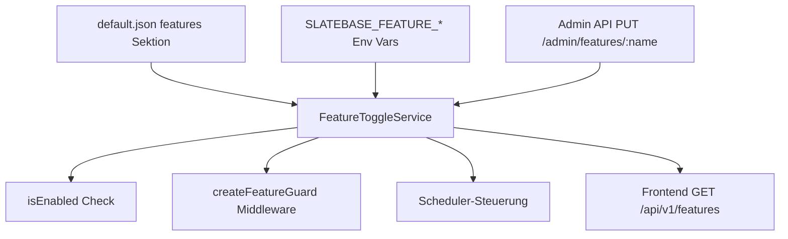
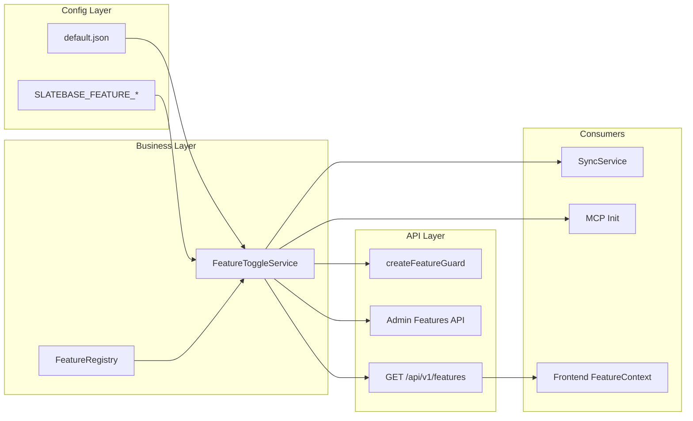

# Design Document: Feature-Toggles

## Overview

Das Feature-Toggle-System führt eine zentrale, einheitliche Stelle ein, an der serverseitige Features an- und abgeschaltet werden. Es ersetzt die bisherige verstreute Konfiguration (z.B. `mcp.enabled`) durch ein konsistentes, erweiterbares Registry-Pattern mit Laufzeit-Steuerung über eine Admin-API.

**Kernprinzipien:**
- In-Memory-State für synchrone O(1)-Abfragen
- Deklarative Registrierung neuer Features (Hot/Cold)
- Env-Var-Overrides für Deployment-Konfiguration
- Hot-Toggle: Sofortige Wirksamkeit ohne Neustart
- Cold-Toggle: Neustart erforderlich (UI zeigt Hinweis)



## Architecture

### Schichten-Integration

Das Feature-Toggle-System integriert sich in die bestehende Layered Architecture:



### Neue Dateien

| Pfad | Verantwortung |
|------|---------------|
| `backend/src/feature-toggle/index.ts` | Barrel-Export: Interfaces, Service, Registry, Middleware, Types |
| `backend/src/feature-toggle/types.ts` | `IFeatureToggleService`, `IFeatureRegistry`, Datenmodelle |
| `backend/src/feature-toggle/feature-registry.ts` | Deklarative Feature-Registrierung mit Validierung |
| `backend/src/feature-toggle/feature-toggle-service.ts` | In-Memory-State, isEnabled(), setEnabled(), Env-Overlay |
| `backend/src/feature-toggle/middleware.ts` | `createFeatureGuard()` Factory-Funktion |
| `backend/src/feature-toggle/feature-toggle-service.test.ts` | Unit Tests Service |
| `backend/src/feature-toggle/feature-registry.test.ts` | Unit Tests Registry |
| `backend/src/feature-toggle/middleware.test.ts` | Unit Tests Middleware |
| `backend/src/api/featureRoutes.ts` | Admin + Public Feature API Routes |
| `frontend/src/state/featureState.ts` | Feature Reducer + Types |
| `frontend/src/state/featureContext.ts` | FeatureProvider + useFeatureContext Hook |
| `frontend/src/state/featureActions.ts` | Action Creators (loadFeatures, toggleFeature) |

## Components and Interfaces

### Backend Interfaces

```typescript
// backend/src/feature-toggle/types.ts

/** Toggle-Typ: Hot = sofort wirksam, Cold = erfordert Neustart */
export type ToggleType = 'hot' | 'cold'

/** Definition eines registrierten Feature-Toggles */
export interface FeatureToggleDefinition {
  /** Feature-Name im Format [a-z][a-z0-9-]{0,63} */
  name: string
  /** Beschreibung (1–256 Zeichen) */
  description: string
  /** Default-Wert wenn weder Env-Var noch Runtime-Änderung vorliegt */
  defaultEnabled: boolean
  /** Ob die Änderung sofort oder erst nach Neustart wirkt */
  type: ToggleType
}

/** Aktueller Status eines Toggles (API-Response-Format) */
export interface FeatureToggleState {
  name: string
  enabled: boolean
  type: ToggleType
  description: string
}

/** Ergebnis eines Toggle-Updates über die API */
export interface FeatureToggleUpdateResult {
  name: string
  enabled: boolean
  restartRequired: boolean
}

/** Service-Interface für Feature-Toggle-Abfragen und -Änderungen */
export interface IFeatureToggleService {
  /** Synchrone Abfrage ob ein Feature aktiviert ist. Gibt false für unbekannte/ungültige Namen zurück. */
  isEnabled(featureName: string): boolean

  /** Ändert den Toggle-Status zur Laufzeit. Wirft bei unbekanntem Feature. */
  setEnabled(featureName: string, enabled: boolean): FeatureToggleUpdateResult

  /** Gibt den Status aller registrierten Toggles zurück. */
  getAll(): FeatureToggleState[]

  /** Gibt den Status eines einzelnen Toggles zurück, oder undefined wenn nicht gefunden. */
  get(featureName: string): FeatureToggleState | undefined

  /** Registriert einen Listener der bei Toggle-Änderungen aufgerufen wird. */
  onChange(listener: FeatureChangeListener): void
}

/** Callback bei Toggle-Änderung */
export type FeatureChangeListener = (featureName: string, enabled: boolean) => void

/** Registry-Interface für die deklarative Feature-Registrierung */
export interface IFeatureRegistry {
  /** Registriert ein neues Feature. Wirft bei ungültigem Namen oder Duplikat. */
  register(definition: FeatureToggleDefinition): void

  /** Gibt alle registrierten Definitionen zurück. */
  getAll(): FeatureToggleDefinition[]

  /** Prüft ob ein Feature-Name registriert ist. */
  has(name: string): boolean

  /** Gibt die Definition eines Features zurück, oder undefined. */
  get(name: string): FeatureToggleDefinition | undefined
}
```

### Middleware-Interface

```typescript
// backend/src/feature-toggle/middleware.ts

import type { MiddlewareHandler } from 'hono'
import type { IFeatureToggleService } from './types.js'

/**
 * Factory-Funktion die eine Hono-Middleware erzeugt.
 * Blockiert Requests mit 403 wenn das Feature deaktiviert oder nicht registriert ist.
 */
export function createFeatureGuard(
  featureName: string,
  toggleService: IFeatureToggleService,
): MiddlewareHandler
```

### Frontend Interfaces

```typescript
// frontend/src/state/featureState.ts

export interface FeatureToggleInfo {
  name: string
  enabled: boolean
  type: 'hot' | 'cold'
  description: string
}

export interface FeatureState {
  features: FeatureToggleInfo[]
  isLoading: boolean
  error: string | null
}

export type FeatureAction =
  | { type: 'FEATURES_LOADING' }
  | { type: 'FEATURES_LOADED'; features: FeatureToggleInfo[] }
  | { type: 'FEATURES_ERROR'; error: string }
  | { type: 'FEATURE_UPDATED'; name: string; enabled: boolean }
  | { type: 'FEATURE_UPDATE_FAILED'; name: string; previousEnabled: boolean; error: string }
```

### Frontend Context

```typescript
// frontend/src/state/featureContext.ts

export interface FeatureContextValue {
  state: FeatureState
  dispatch: React.Dispatch<FeatureAction>
  /** Synchrone Abfrage ob ein Feature aktiviert ist */
  isEnabled: (featureName: string) => boolean
}
```

## Data Models

### Konfigurationsformat (default.json)

```json
{
  "features": {
    "vault-sync": { "enabled": false },
    "obsidian-plugin-compat": { "enabled": false },
    "chat": { "enabled": true },
    "mcp": { "enabled": true },
    "knowledge-graph": { "enabled": true }
  },
  "mcp": {
    "maxFileSize": 5242880,
    "rateLimit": 60,
    "maxTokensPerUser": 10
  }
}
```

**Änderung gegenüber aktuellem Stand:** Das `enabled`-Feld wird aus dem `mcp`-Objekt entfernt. Der MCP-Toggle wird ausschließlich über `features.mcp.enabled` gesteuert.

### Zod-Schema für Features-Sektion

```typescript
const FeatureEntrySchema = z.object({
  enabled: z.boolean(),
})

const FeaturesConfigSchema = z.record(z.string(), FeatureEntrySchema).default({})
```

### Env-Var-Mapping

| Toggle-Name | Env-Var | Gültige Werte |
|-------------|---------|---------------|
| `vault-sync` | `SLATEBASE_FEATURE_VAULT_SYNC` | `true`, `false`, `1`, `0` (case-insensitiv) |
| `obsidian-plugin-compat` | `SLATEBASE_FEATURE_OBSIDIAN_PLUGIN_COMPAT` | ditto |
| `chat` | `SLATEBASE_FEATURE_CHAT` | ditto |
| `mcp` | `SLATEBASE_FEATURE_MCP` | ditto |
| `knowledge-graph` | `SLATEBASE_FEATURE_KNOWLEDGE_GRAPH` | ditto |

**Mapping-Algorithmus:**
```
featureName → SLATEBASE_FEATURE_ + featureName.replaceAll('-', '_').toUpperCase()
```

### In-Memory-State

```typescript
/** Interner State pro Toggle */
interface ToggleEntry {
  definition: FeatureToggleDefinition
  /** Aktueller Wert — kann durch Env-Var, Config oder Runtime-Änderung bestimmt sein */
  currentEnabled: boolean
  /** Quelle des aktuellen Werts (für Debugging/Logging) */
  source: 'default' | 'config' | 'env' | 'runtime'
}

// FeatureToggleService hält eine Map<string, ToggleEntry>
```

### API-Response-Formate

**GET /admin/features** (Admin-Only):
```json
[
  {
    "name": "vault-sync",
    "enabled": false,
    "type": "hot",
    "description": "CouchDB-basierte Vault-Synchronisation"
  }
]
```

**PUT /admin/features/:featureName** (Admin-Only):
```json
// Request:
{ "enabled": true }

// Response 200:
{
  "name": "vault-sync",
  "enabled": true,
  "restartRequired": false
}
```

**GET /api/v1/features** (Alle authentifizierten Benutzer):
```json
[
  { "name": "vault-sync", "enabled": false },
  { "name": "chat", "enabled": true },
  { "name": "mcp", "enabled": true },
  { "name": "knowledge-graph", "enabled": true },
  { "name": "obsidian-plugin-compat", "enabled": false }
]
```

### Audit-Log-Format

Neuer `AuditAction`-Typ: `'FEATURE_TOGGLED'`

```json
{
  "timestamp": "2025-07-01T10:30:00.000Z",
  "userId": "abc123",
  "action": "FEATURE_TOGGLED",
  "target": "vault-sync",
  "ipAddress": "192.168.1.100",
  "success": true,
  "details": "{\"oldEnabled\":false,\"newEnabled\":true}"
}
```

## Correctness Properties

*A property is a characteristic or behavior that should hold true across all valid executions of a system — essentially, a formal statement about what the system should do. Properties serve as the bridge between human-readable specifications and machine-verifiable correctness guarantees.*

### Property 1: Env-Var-Namens-Mapping

*For any* gültigen Feature-Namen (matching `[a-z][a-z0-9-]{0,63}`), die Transformation zum Env-Var-Suffix SHALL alle Bindestriche durch Unterstriche ersetzen und das Ergebnis in Großbuchstaben konvertieren, mit dem Prefix `SLATEBASE_FEATURE_`.

**Validates: Requirements 1.6**

### Property 2: Case-insensitive Boolean-Parsing

*For any* String aus der Menge `{true, false, 1, 0}` in beliebiger Groß-/Kleinschreibung (z.B. "True", "FALSE", "1"), SHALL das Parsing den korrekten Boolean-Wert liefern (`true`/`1` → true, `false`/`0` → false).

**Validates: Requirements 1.7**

### Property 3: Ungültige Env-Var-Werte werden ignoriert

*For any* String der NICHT in der Menge `{true, false, 1, 0}` (case-insensitiv) liegt, SHALL der Feature_Toggle_Service den Env-Var-Wert ignorieren und den Konfigurationswert aus `default.json` beibehalten.

**Validates: Requirements 1.8**

### Property 4: isEnabled gibt false für ungültige/unregistrierte Namen

*For any* String der entweder leer ist, nur Whitespace enthält, länger als 128 Zeichen ist, ungültige Zeichen enthält, oder nicht als Toggle registriert ist, SHALL `isEnabled()` den Wert `false` zurückgeben ohne eine Exception zu werfen.

**Validates: Requirements 1.9, 2.1, 2.2**

### Property 5: Feature-Guard blockiert genau dann wenn Feature nicht aktiv

*For any* Feature-Name und Request, der Feature-Guard SHALL den Request genau dann mit 403 (FEATURE_DISABLED) blockieren, wenn das Feature entweder nicht registriert ist ODER sein `enabled`-Status `false` ist. In allen anderen Fällen SHALL der Request unverändert weitergeleitet werden.

**Validates: Requirements 3.1, 3.2, 3.4**

### Property 6: Toggle-Änderung ist sofort wirksam

*For any* registrierten Hot-Toggle und jeden Boolean-Wert, nach einem erfolgreichen `setEnabled(name, value)` Aufruf SHALL ein nachfolgender `isEnabled(name)` Aufruf den neuen Wert zurückgeben.

**Validates: Requirements 5.3**

### Property 7: Toggle-Änderung erzeugt Audit-Eintrag

*For any* registrierten Toggle und jede Statusänderung über die Admin-API, SHALL ein Audit-Log-Eintrag mit der userId des Administrators, dem Feature-Namen, dem alten und neuen Wert sowie einem gültigen Zeitstempel erstellt werden.

**Validates: Requirements 5.4**

### Property 8: Unbekanntes Feature via API → 404

*For any* Feature-Name der nicht in der Registry registriert ist, SHALL die Admin-API (PUT /admin/features/:name) mit HTTP 404 und dem Fehlercode `FEATURE_NOT_FOUND` antworten.

**Validates: Requirements 5.5**

### Property 9: Gültige Registrierung gelingt

*For any* gültige FeatureToggleDefinition (Name matching `[a-z][a-z0-9-]{0,63}`, Beschreibung 1–256 Zeichen, Boolean Default, Hot/Cold Typ) die noch nicht registriert ist, SHALL die Registrierung erfolgreich sein und das Feature danach über `isEnabled()` abfragbar sein.

**Validates: Requirements 9.1**

### Property 10: Ungültige/doppelte Registrierung wird abgelehnt

*For any* Feature-Name der nicht dem Format `[a-z][a-z0-9-]{0,63}` entspricht ODER bereits registriert ist, SHALL die Registrierung mit einer beschreibenden Fehlermeldung abgelehnt werden.

**Validates: Requirements 9.2**

### Property 11: restartRequired reflektiert Toggle-Typ

*For any* Toggle-Änderung über die Admin-API, SHALL das Feld `restartRequired` in der Antwort genau dann `true` sein wenn der Toggle-Typ `cold` ist, und `false` wenn der Typ `hot` ist.

**Validates: Requirements 9.4, 9.5**

## Error Handling

### Backend-Fehler

| Fehlerfall | HTTP-Status | Error-Code | Behandlung |
|------------|-------------|------------|------------|
| Feature nicht registriert (API) | 404 | `FEATURE_NOT_FOUND` | Standard API-Error-Format |
| Ungültiger PUT-Body | 400 | `VALIDATION_ERROR` | Zod-Validierung im Controller |
| Feature deaktiviert (Guard) | 403 | `FEATURE_DISABLED` | Middleware blockiert Request |
| Nicht authentifiziert | 401 | (bestehend) | Bestehende Auth-Middleware |
| Kein Admin | 403 | `FORBIDDEN` | Bestehende Admin-Middleware |
| Registrierung: Duplikat | — | `FeatureAlreadyRegisteredError` | Thrown im Service, nicht via API exponiert |
| Registrierung: Ungültiger Name | — | `InvalidFeatureNameError` | Thrown im Service |

### Frontend-Fehler

| Fehlerfall | Verhalten |
|------------|-----------|
| Initiales Laden fehlgeschlagen | Error-State mit Retry-Button |
| Toggle-Update fehlgeschlagen | Optimistisches Rollback + Toast mit Fehlertext |
| Feature-Endpoint nicht erreichbar | Alle Features als disabled behandeln (defensive) |

### Error-Klassen (Backend)

```typescript
export class FeatureNotFoundError extends Error {
  constructor(public readonly featureName: string) {
    super(`Feature '${featureName}' is not registered`)
  }
}

export class FeatureAlreadyRegisteredError extends Error {
  constructor(public readonly featureName: string) {
    super(`Feature '${featureName}' is already registered`)
  }
}

export class InvalidFeatureNameError extends Error {
  constructor(public readonly featureName: string, public readonly reason: string) {
    super(`Invalid feature name '${featureName}': ${reason}`)
  }
}
```

## Testing Strategy

### Unit Tests (Co-located)

**FeatureRegistry (`feature-registry.test.ts`):**
- Registrierung mit gültigen Pflichtfeldern
- Ablehnung bei Duplikat-Name
- Ablehnung bei ungültigem Namensformat (zu kurz, zu lang, falsche Zeichen, beginnt nicht mit Kleinbuchstabe)
- `has()` und `get()` für registrierte/nicht-registrierte Features
- `getAll()` gibt alle Definitionen zurück

**FeatureToggleService (`feature-toggle-service.test.ts`):**
- `isEnabled()` gibt Default-Wert zurück wenn weder Env noch Runtime gesetzt
- `isEnabled()` gibt false für unbekannte Namen zurück
- `isEnabled()` gibt false für leere/ungültige Strings zurück
- Env-Var-Override hat Vorrang vor Config-Default
- Ungültige Env-Var-Werte werden ignoriert
- `setEnabled()` ändert Runtime-State sofort
- `setEnabled()` wirft bei unbekanntem Feature
- `onChange`-Listener wird bei Statusänderung aufgerufen
- Performance: 1000 isEnabled-Aufrufe in < 10ms

**Middleware (`middleware.test.ts`):**
- Deaktiviertes Feature → 403 mit FEATURE_DISABLED
- Aktiviertes Feature → next() aufgerufen, Response unverändert
- Nicht-registriertes Feature → 403 (wie deaktiviert)
- Response-Body enthält Feature-Name in message

**Feature API Routes:**
- GET /admin/features → Array aller Toggles mit korrektem Format
- PUT /admin/features/:name → 200 mit aktualisiertem State
- PUT mit ungültigem Body → 400
- PUT mit unbekanntem Feature → 404
- Audit-Log-Eintrag wird erstellt
- GET /api/v1/features → nur name + enabled (kein description/type)

### Integration Tests

- Scheduler-Steuerung: Toggle vault-sync → SyncScheduler stoppt/startet
- Komposition: Service korrekt im Composition Root verdrahtet
- Env-Var-Overlay: Feature über Env-Var steuern

### Hinweis zu Property-Based Testing

Gemäß Projektkonvention (Lessons Learned, Juni 2026) werden **keine PBT-Tests** geschrieben. Die Correctness Properties dienen als Spezifikation für gründliche Unit Tests mit Edge Cases. Jeder Property-Test wird als Gruppe von Unit Tests implementiert die die universelle Eigenschaft über repräsentative Eingaben verifizieren.

### Frontend Tests

- `featureState.test.ts`: Reducer-Transitions (loading, loaded, error, update, rollback)
- `featureContext.test.tsx`: Provider liefert korrekten Context, `isEnabled()` delegiert an State
- Feature-abhängige Komponenten: Conditional Rendering bei disabled Features
