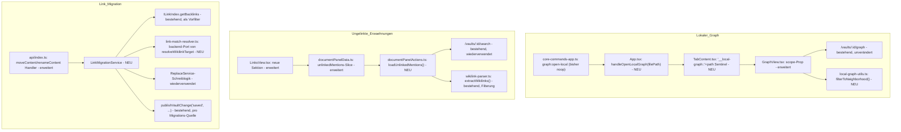

# Design Document: Graph-Politur & Link-Integrität

## Overview

Diese Spec liefert drei unabhängige, jeweils für sich testbare Ergänzungen um bestehende Infrastruktur — den Link_Index_Service (`backend/src/link-index/link-index-service.ts`), den vault-weiten Graph_View (`frontend/src/components/GraphView.tsx`) und die Links_View im Context Panel (`frontend/src/components/context-panel/LinksView.tsx`). Es entsteht **keine neue Kernarchitektur**; alle drei Features docken an bestehende Provider, Services und Datenflüsse an, exakt wie bei `navigation-link-polish`.

**Kernentscheidungen:**

- **Lokaler Graph als reiner Frontend-Filter**: Kein neuer Backend-Endpunkt. `GraphView` fetcht wie bisher die volle `/vaults/:id/graph`-Antwort und filtert sie clientseitig per BFS auf die N-Hop-Nachbarschaft einer Zentrums-Notiz. Das entspricht der im Implementation Plan vorgegebenen Formulierung „Filterung der bestehenden Antwort" und vermeidet eine zweite, potenziell abweichende Server-Implementierung der Graph-Traversal-Logik.
- **Tab-Scoping über Sentinel-Präfix**: Der vault-weite Graph-Tab nutzt bereits den Sentinel `activeTab.filePath === '__graph__'` (`TabContent.tsx:229`), Plugin-Views nutzen `'__view::'+viewType` (`TabContent.tsx:247`). Der Lokale Graph reiht sich mit `'__local-graph::'+notePath` in dasselbe Muster ein — keine Erweiterung des Tab-Datenmodells nötig.
- **Ungelinkte Erwähnungen nutzen die bestehende Volltextsuche**, nicht einen neuen Index. `search-service.ts` durchsucht bereits alle Vault-Dateien case-insensitive nach einem Substring inkl. Kontext-Snippets (`SearchHit.matchLine`) — die Ungelinkte-Erwähnungen-Suche ist eine Suche nach dem Dateinamen mit einem Nachbearbeitungsschritt, der Treffer innerhalb bestehender Wikilinks herausfiltert (via `extractWikilinks()`, die bereits sowohl frontend- als auch backend-seitig existiert und dieselben Ziele produziert, siehe `wikilink-parser.ts`).
- **Link-Migration deckt eine reale Lücke im bestehenden Link_Index auf**: `LinkIndexService.getBacklinks(oldPath)` liefert nur Quell-Dateien, deren Wikilink-Ziel-Text sich **exakt** zum normalisierten Zielpfad auflöst (`normalizeLinkPath()`, `link-index-service.ts:46-70`). Ein in Obsidian übliches, bloßes `[[Notiz]]` (ohne Ordnerpfad) auf eine Datei in einem Unterordner wird vom Backend-Index **nicht** erfasst — der Index tut keine Mehrdeutigkeits-Auflösung wie das Frontend (`resolveWikilinkTargetWithAlternatives`, `frontend/src/plugins/link-resolver.ts:44-79`). Für korrekte Link-Migration reicht ein simpler `getBacklinks()`-Aufruf daher **nicht aus** — die Migration braucht eine eigene, backend-seitige Portierung der bestehenden Auflösungsregeln (siehe „Link Match Resolution" unten).
- **Link-Migration ist synchron und Teil der Rename/Move-Antwort**, nicht fire-and-forget wie der bestehende `onFileRenamed`-Hook (`backend/src/index.ts:739-754`) — Datenintegrität hat hier explizit Vorrang, siehe Requirement 3.8.
- **Wiederverwendung der Replace-Mechanik**: `ReplaceService`/`replace-service.ts` liefert bereits atomare Schreiblogik (Temp→Rename) und eine `paths`-Restriktion (`IReplaceOptions.paths`, max. 100 Dateien) — die Link-Migration nutzt dieselbe Schreib-Grundlage, aber mit einem Wikilink-bewussten Ersetzungsschritt statt reinem Text-Replace (siehe unten).

## Architecture



---

## Teil 1: Lokaler Graph

### Neighborhood-Filter (reiner Funktionsbaustein)

```typescript
// frontend/src/components/local-graph-utils.ts

/**
 * Filters full graph data down to the N-hop neighborhood of a center node,
 * treating edges as undirected (a Backlink counts the same as a Forward_Link
 * for reachability). Used purely client-side; no server round-trip.
 */
export function filterToNeighborhood(
  data: GraphData,
  centerNodeId: string,
  maxHops: number,
): GraphData
```

Implementierung: einfache BFS über eine aus `data.edges` gebildete Adjazenzliste (`Map<string, Set<string>>`, beide Richtungen), gestartet bei `centerNodeId`, gestoppt bei `maxHops`. Rückgabe: alle besuchten `GraphNode` plus alle `GraphEdge`, deren `source` und `target` beide in der besuchten Menge liegen. Bei `centerNodeId`, das im Datensatz nicht existiert (z. B. Zentrums-Notiz ohne jegliche Links), wird nur `{ nodes: [centerNode], edges: [] }` zurückgegeben (Requirement 1.10) — der Zentrums-Node wird dafür synthetisch aus dem aktiven Tab-Dateipfad erzeugt, falls er in `data.nodes` fehlt (Datei ohne Links taucht im vault-weiten Graph gar nicht als Node auf, da `getGraph()` Nodes nur aus `forwardLinks`-Einträgen sammelt, siehe `link-index-service.ts:380-400`).

### `GraphView.tsx` — Scope-Erweiterung

```typescript
interface GraphViewProps {
  vaultId: string
  /** When set, renders a Lokaler_Graph instead of the full vault graph. */
  scope?: {
    centerPath: string
    /** Persisted alongside the rest of GraphConfig; owned by the parent, not GraphView itself. */
    hops: number
    onHopsChange: (hops: number) => void
    onRecenter: (newCenterPath: string) => void
  }
}
```

Änderung im bestehenden Datenfluss (`GraphView.tsx:163-229`): die Simulation-Aufbau-`useEffect` erhält als Eingabe nicht mehr `graphData` direkt, sondern ein per `useMemo` abgeleitetes `displayData = scope ? filterToNeighborhood(graphData, resolveCenterNodeId(scope.centerPath), scope.hops) : graphData`. `fetchGraph()` selbst bleibt unverändert (holt weiterhin die volle Antwort). Ein neuer, kleiner Toolbar-Bereich (im `scope`-Fall gerendert) zeigt den Hops-Stepper (Requirement 1.5) und den „Auf aktive Notiz zentrieren"-Button (Requirement 1.8, ruft `scope.onRecenter(activeTab.filePath)` auf — die Zentrums-Notiz ist bewusst vom Konzept „aktiver Tab" entkoppelt, damit der Benutzer im Lokalen Graph browsen kann, ohne dass jeder Node-Klick sofort neu zentriert). Der bestehende Node-Klick-Handler (öffnet Datei) bleibt unverändert (Requirement 1.7).

Hervorhebung der Zentrums-Notiz (Requirement 1.6): `SimNode` erhält kein neues Feld — stattdessen prüft das Rendering, ob `node.path === scope?.centerPath` und wendet dafür einen zusätzlichen CSS-Klassenmodifikator sowie einen größeren `radius`-Faktor an, analog zur bestehenden `hoveredNodeId`-Hervorhebung.

### Tab-Wiring

- `TabContent.tsx`: neuer Zweig vor der bestehenden `'__graph__'`-Prüfung (Zeile 229): `if (activeTab.filePath.startsWith('__local-graph::'))` → `centerPath = activeTab.filePath.slice('__local-graph::'.length)`, rendert `<GraphView vaultId={...} scope={{ centerPath, hops, onHopsChange, onRecenter }} />`. `hops`/`onHopsChange` binden an eine neue, in `graph-config.ts` ergänzte `localGraph.hops`-Einstellung (Requirement 1.13).
- `core-commands-app.ts:484`: `{ id: 'graph:open-local', name: 'Graph view: Open local graph', run: (h) => { const t = getActiveTab(h); if (t && h.vaultId && !t.filePath.startsWith('__') ) h.onOpenLocalGraph(t.filePath) } }` — der Guard `!t.filePath.startsWith('__')` deckt Requirement 1.2 ab (kein aktiver Datei-Tab: Graph-Tab, Plugin-View, leer).
- `CoreAppCommandHandlers` (Zeile 71, neben `onOpenGraph`): neues Feld `onOpenLocalGraph: (filePath: string) => void`.
- `App.tsx`: `handleOpenLocalGraph(filePath)` neben dem bestehenden `handleOpenGraph` — dispatched `OPEN_TAB` mit `filePath: '__local-graph::'+filePath`, `fileName` als lokalisiertes Label (z. B. „Lokaler Graph: <Dateiname>"), dedupliziert wie normale Datei-Tabs anhand des `filePath` (bestehendes `OPEN_TAB`-Verhalten reicht dafür aus — kein neuer Reducer-Fall nötig).

### Live-Update & Fehlerfall

Requirement 1.11/1.12: `GraphView` abonniert bei gesetztem `scope` zusätzlich `onRealtimeVaultChange` (wie `documentPanelData.ts:239-250`) und ruft bei `saved`/`renamed`/`deleted` debounced `fetchGraph()` erneut auf. Wird dabei erkannt, dass `scope.centerPath` in der neuen `graphData.nodes`-Liste nicht mehr vorkommt UND die Datei laut `deleted`-Event entfernt wurde, wechselt die Komponente in einen dedizierten Fehlerzustand (separat vom generischen `error`-State, da hier — anders als bei einem Netzwerkfehler — kein Retry sinnvoll ist).

---

## Teil 2: Ungelinkte Erwähnungen

### Datenmodell-Erweiterung

```typescript
// frontend/src/state/documentPanelData.ts

export interface UnlinkedMentionEntry {
  filePath: string
  /** Snippet around the first match, from SearchHit.matchLine. */
  snippet: string
  lineNumber: number
}

// DocumentPanelState.links erhält ein Geschwister-Feld:
unlinkedMentions: {
  entries: UnlinkedMentionEntry[]
  loading: boolean
  error: string | null
}
```

Neue Reducer-Actions `SET_UNLINKED_MENTIONS` / `SET_UNLINKED_MENTIONS_LOADING` / `SET_UNLINKED_MENTIONS_ERROR`, analog zu den bestehenden Backlinks-Actions (`documentPanelData.ts:84-90,110-115`).

### `loadUnlinkedMentions()` — neue Action

```typescript
// frontend/src/state/documentPanelActions.ts

export async function loadUnlinkedMentions(
  dispatch: Dispatch<DocumentPanelAction>,
  apiClient: IApiClient,
  vaultId: string,
  filePath: string,
  backlinkSourcePaths: string[], // already-known backlink sources, to short-circuit filtering
): Promise<void>
```

Ablauf (Requirement 2.2–2.4):
1. Dateiname ohne Endung aus `filePath` extrahieren (letztes Pfadsegment ohne `.md`).
2. `apiClient.searchVault(vaultId, { query: baseName, caseSensitive: 'false', regex: 'false', contextLines: '0', maxResults: '50' })` — nutzt den bestehenden `/vaults/:id/search`-Endpunkt unverändert.
3. Für jeden `SearchFileResult` mit `filePath !== <aktive Datei>`: `matchLine` mit `extractWikilinks()` (frontend-seitige Variante, bereits vorhanden für Forward-Links, siehe `loadForwardLinks`) parsen. Ergibt einer der gefundenen `ParsedWikilink` einen Target, der (per `resolveWikilinkTarget`) auf die aktive Datei auflöst, UND überschneidet sich dessen Position mit der Fundstelle des Suchtreffers, wird dieser Treffer verworfen (Requirement 2.3) — die Datei bleibt aber ggf. wegen eines *anderen*, tatsächlich ungelinkten Vorkommens in der Ergebnisliste.
4. Verbleibende Treffer werden zu `UnlinkedMentionEntry[]` gemappt (ein Eintrag pro Treffer-Datei, erstes ungelinktes Vorkommen; `SearchFileResult.hits[0].matchLine` als Snippet).

Dieser Nachbearbeitungsschritt läuft im Frontend (nicht im Backend), weil `extractWikilinks()`/`resolveWikilinkTarget()` dort bereits für Forward-Links etabliert sind und Zugriff auf den geladenen `DirectoryTree` für die Mehrdeutigkeits-Auflösung haben (`documentPanelActions.ts` reicht `directoryTree` bereits an `loadForwardLinks` durch).

### Wiring in `useDocumentPanelData`

- Im Dokumentwechsel-Effekt (`documentPanelData.ts:174-193`, nach dem bestehenden `loadBacklinks`-Aufruf): `void loadUnlinkedMentions(dispatch, apiClient, vaultId, documentPath, ...)`, aber **nicht** in derselben Microtask-Kette wie Outline/Forward-Links/Properties — läuft unabhängig und blockiert das Rendering der übrigen Sektionen nicht (Requirement 2.10).
- Ein `AbortController`- bzw. Request-Token-Ref (analog zum bestehenden `prevDocumentPathRef`-Muster) verwirft veraltete Ergebnisse, falls der Benutzer währenddessen die Datei wechselt (Requirement 2.9) — derselbe Grundsatz wie in Requirement 5.5 der `navigation-link-polish`-Spec.
- Der bestehende Live-Refresh-Effekt (`documentPanelData.ts:236-259`) wird um einen zweiten, ebenfalls 1000ms debounced Aufruf von `loadUnlinkedMentions()` ergänzt (Requirement 2.11) — läuft im selben `onRealtimeVaultChange`-Callback wie der Backlinks-Refresh, aber mit eigenem Debounce-Timer-Ref, damit ein Fehlschlag der einen Anfrage die andere nicht blockiert.

### `LinksView.tsx` — neue Sektion

Dritte `<section>` nach der bestehenden Backlinks-Sektion (nach Zeile 108), identisches Markup-Muster (Titel, Placeholder bei leer, Fehlerzustand, Liste). Jeder Listeneintrag zeigt Dateipfad + Snippet und einen zusätzlichen „Verlinken"-Button (Requirement 2.7), der `onLinkTextClick(entry)` aufruft — eine neue Callback-Prop, die im Erfolgsfall serverseitig `PUT`/`PATCH` den Dateiinhalt der Migrations-... äh Treffer-Datei am exakten `lineNumber`/Offset um `[[<Dateiname>]]` ergänzt (kleinstmögliche, gezielte Ersetzung — nutzt denselben Speicherpfad wie normales Editieren, kein neuer Endpunkt).

---

## Teil 3: Link-Migration

### Link Match Resolution — backend-seitiger Port

```typescript
// backend/src/link-index/link-match-resolver.ts (NEU)

/**
 * Backend port of the frontend's resolveWikilinkTargetWithAlternatives
 * (frontend/src/plugins/link-resolver.ts:44-79): same-folder-first, then
 * shortest-path, then alphabetical tie-break. Operates on the in-memory
 * DirectoryTree the vault already holds (VaultManager), not on the
 * literal-match link index — this is what closes the gap described in
 * "Kernentscheidungen" above.
 */
export function resolveWikilinkTargetOnTree(
  target: string,
  tree: DirectoryTree,
  sourcePath: string,
): string | null

/**
 * Scans a single file's content for wikilinks whose resolved target
 * (via resolveWikilinkTargetOnTree) equals `targetPath`. Returns each
 * match's position (from extractWikilinks) plus enough info to rewrite it.
 */
export function findWikilinksTargeting(
  content: string,
  sourcePath: string,
  targetPath: string,
  tree: DirectoryTree,
): ParsedWikilink[]
```

Die Logik von `resolveWikilinkTargetWithAlternatives` ist reine, framework-freie String-/Baum-Verarbeitung (siehe `link-resolver.ts:44-124`) — sie wird 1:1 nach `link-match-resolver.ts` portiert statt zwischen Frontend und Backend geteilt zu werden (kein gemeinsames Package im Projekt vorhanden; Duplikation ist hier der pragmatischere Schnitt als ein neues Shared-Modul für zwei Aufrufstellen). Ein Duplikations-Test (Property: gleiches Ergebnis wie die Frontend-Funktion für dieselben Eingaben) sichert die Konsistenz ab, analog zu „Property 9: Backend Parser Equivalence" bei `extractWikilinks`.

### `LinkMigrationService` — neuer Baustein

```typescript
// backend/src/link-index/link-migration-service.ts (NEU)

export interface LinkMigrationResult {
  migratedFiles: { path: string; replacements: number }[]
  failedFiles: { path: string; reason: string }[]
}

export interface ILinkMigrationService {
  /**
   * Rewrites all wikilinks across the vault that resolve to `oldPath`
   * so they point to `newPath` instead. Called once per moved/renamed file
   * (the API handler calls this once per affected file for folder operations,
   * see Requirement 3.7).
   */
  migrateLinks(vaultId: string, oldPath: string, newPath: string): Promise<LinkMigrationResult>
}
```

Ablauf pro Aufruf (ein `oldPath`→`newPath`-Paar):
1. **Kandidaten-Vorfilter**: `linkIndex.getBacklinks(oldPath)` liefert die per exaktem Pfad bereits bekannten Quellen (schnell, deckt voll-pfadige Links ab). Zusätzlich: eine Volltextsuche (dieselbe Such-Infrastruktur wie Requirement 2, `SearchService.search()`) nach dem bloßen Dateinamen von `oldPath` über den ganzen Vault liefert Kandidaten für bloße Kurzform-Links, die der Index nicht kennt. Die Vereinigung beider Mengen sind die zu prüfenden Dateien — kein voller Vault-Scan, aber auch keine blinde Verlassung auf den (lückenhaften) Index.
2. **Exakte Treffer bestimmen**: Für jede Kandidaten-Datei `findWikilinksTargeting(content, candidatePath, oldPath, tree)` — nur Dateien mit mindestens einem echten Treffer werden zu Migrations-Quellen (Requirement 3.1/3.2).
3. **Umschreiben**: Für jede Migrations-Quelle werden alle Treffer-Positionen absteigend nach Offset ersetzt (Ziel-Teil des Wikilinks ausgetauscht, Alias/Anker bleiben erhalten — Requirement 3.3/3.4/3.5), Datei atomar geschrieben (gleiche Temp→Rename-Mechanik wie `ReplaceService`, siehe `search/replace-service.ts`).
4. **Index & Events**: Nach erfolgreichem Schreiben pro Migrations-Quelle `linkIndex.updateFile(sourcePath, newContent)` (bestehende Methode) sowie `publishVaultChange(vaultId, 'saved', sourcePath, ...)` (Requirement 3.11/3.12).
5. **Fehlerpfad**: Schlägt das Schreiben einer Migrations-Quelle fehl, wird das für die übrigen Dateien fortgesetzt; alle Fehler landen in `LinkMigrationResult.failedFiles` (Requirement 3.9).

### Controller-Integration

`backend/src/api/index.ts` — `moveContent()` (Zeilen 547-583) und `renameContent()` (Zeilen 592-628) werden erweitert:

- Der bestehende Guard `sourcePath.endsWith('.md')` vor dem `linkIndexHook.onFileRenamed`-Aufruf entfällt für die Migration — Ordner-Operationen müssen ebenfalls migriert werden (Requirement 3.7). Der Handler ermittelt dafür die Liste der tatsächlich verschobenen/umbenannten Dateien: bei einer Einzeldatei ist das nur `{sourcePath, newPath}`; bei einem Ordner wird der **alte** `DirectoryTree`-Teilbaum unter `sourcePath` (vor der Operation) mit dem neuen Zielpfad-Präfix gemappt, um pro betroffener Datei ihr `{oldPath, newPath}`-Paar zu bestimmen.
- Für jedes `{oldPath, newPath}`-Paar wird **vor** der HTTP-Antwort `await linkMigrationService.migrateLinks(vaultId, oldPath, newPath)` aufgerufen (Requirement 3.8 — synchron, im Gegensatz zum bestehenden fire-and-forget `onFileRenamed`). Der bestehende `onFileRenamed`-Hook-Aufruf für die verschobene/umbenannte Datei selbst (Aktualisierung ihres *eigenen* Forward-Link-Eintrags) bleibt zusätzlich bestehen — Migration und Selbst-Update sind orthogonal (Migration betrifft *andere* Dateien, `onFileRenamed` betrifft die verschobene Datei selbst).
- Warnungen aus `LinkMigrationResult.failedFiles` werden der Erfolgsantwort als optionales Feld beigefügt (`{ newPath, linkMigrationWarnings? }`), ohne den 200-Status zu ändern (Requirement 3.9 — der Rename/Move selbst war erfolgreich).

### Nicht-Ziele / bewusste Abgrenzung

- Die Migration betrifft ausschließlich Wikilinks (`[[...]]`), keine Markdown-Standardlinks (`[text](pfad)`) — konsistent mit dem übrigen Link_Index, der ebenfalls nur Wikilinks/Embeds erfasst.
- Bei einer Ordner-Operation mit sehr vielen betroffenen Dateien (Analogie zu `IReplaceOptions.paths`-Obergrenze von 100) wird kein hartes Limit in den Requirements festgeschrieben; die Implementierung sollte aber dieselbe Zeit-/Dateianzahl-Absicherung wie `SearchService`/`ReplaceService` übernehmen, um den synchronen Rename/Move-Request nicht unbegrenzt zu verzögern (Umsetzungsdetail, kein Requirement).
