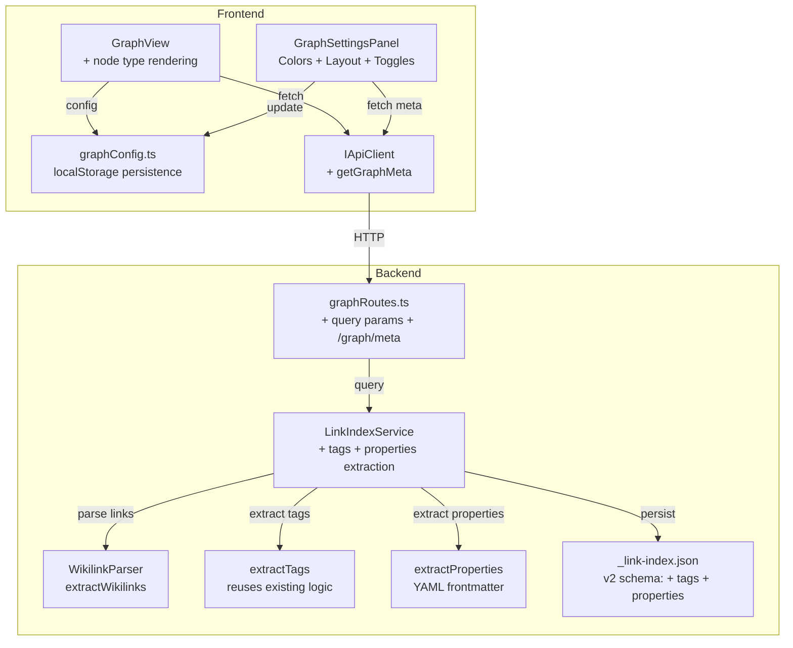

# Design Document: Knowledge Graph V2

## Overview

Der Knowledge Graph wird um drei Hauptbereiche erweitert:

1. **Graph-Konfiguration** — Benutzer können Farben (pro Knotentyp, Edges, Highlight) und Force-Layout-Parameter (Abstoßung, Anziehung, Distanz, Schwerkraft) über ein Settings-Panel direkt im Graph-Tab konfigurieren. Persistierung in `localStorage`.

2. **Tag-Nodes** — Tags (`#tag`) werden als eigene Knoten im Graphen dargestellt und mit allen Dateien verbunden, die den jeweiligen Tag enthalten. Aktivierbar per Toggle.

3. **Property-Nodes** — YAML-Frontmatter-Property-Werte werden als Knoten dargestellt (z.B. `status:aktiv`), verbunden mit allen Dateien die dieses Key-Value-Paar haben. Aktivierbar per Toggle mit Key-Auswahl.

### Design-Entscheidungen

| Entscheidung | Begründung |
|---|---|
| localStorage statt Server-Persistierung | Graph-Config ist rein visuell, kein Mehrwert durch Server-Sync. Einfacher, kein neuer Endpoint nötig. |
| Erweiterung des bestehenden `ILinkIndex` | Tags und Properties werden beim Rebuild/Update mit-extrahiert — ein Index-Durchlauf für alles. |
| Query-Parameter statt separater Endpoints | Graph-API bleibt ein Endpoint (`GET /graph`), Query-Parameter steuern was zurückkommt. Weniger API-Surface. |
| Separater `/graph/meta` Endpoint | Meta-Daten (alle Tags + alle Property-Keys mit Häufigkeiten) werden nur für die Settings-UI gebraucht, nicht bei jedem Graph-Load. |
| Erweiterte `GraphNode` mit `type`-Feld | Abwärtskompatibel: Default-Typ `file` für bestehende Nodes. Frontend unterscheidet Rendering per Typ. |
| Sofortige Anwendung von Farb-/Layout-Änderungen | Kein "Apply"-Button — Slider und Color-Picker wirken live. Bessere UX. |
| Settings-Panel als Collapsible-Sidebar im Graph | Kein separater Route/Modal — Panel lebt innerhalb des Graph-Tabs, überlagert nichts. |

## Architecture



### Datenfluss — Tag/Property-Extraction

1. **Rebuild/UpdateFile**: LinkIndexService parst Wikilinks (wie bisher) UND extrahiert zusätzlich Tags und Frontmatter-Properties aus jeder `.md`-Datei.
2. **Speicherung**: Erweitertes JSON-Schema (`_link-index.json` v2) mit `tags: Record<filePath, string[]>` und `properties: Record<filePath, Record<string, string[]>>`.
3. **Graph-Request mit `includeTags=true`**: LinkIndexService baut zusätzliche Tag-Nodes und Tag-Edges in die GraphData-Response ein.
4. **Graph-Request mit `includeProperties=key1,key2`**: LinkIndexService baut Property-Nodes und Property-Edges für die angefragten Keys ein.
5. **Meta-Request**: LinkIndexService aggregiert alle Tags mit Häufigkeit und alle Property-Keys mit Häufigkeit aus dem Index.

### Datenfluss — Graph-Konfiguration

1. GraphSettingsPanel liest/schreibt `graphConfig` (localStorage).
2. GraphView reagiert auf Config-Änderungen: Farben werden sofort auf SVG-Elemente angemappt, Layout-Parameteränderungen restarten die d3-force-Simulation.
3. Toggle-Änderungen (Tags/Properties) lösen einen neuen API-Call mit angepassten Query-Parametern aus.

## Components and Interfaces

### Backend

#### Erweitertes Link-Index JSON Schema (v2)

```typescript
/** JSON schema for the persisted link index file (v2). */
interface LinkIndexJsonV2 {
  version: 2
  updatedAt: string
  forwardLinks: Record<string, string[]>
  /** Tags per file: filePath → array of tag names (without #) */
  tags: Record<string, string[]>
  /** Properties per file: filePath → Record<propertyKey, propertyValues[]> */
  properties: Record<string, Record<string, string[]>>
}
```

- Abwärtskompatibel: `loadFromDisk()` erkennt `version: 1` → migriert (Tags/Properties leer) → triggert Rebuild.
- Tags und Properties werden nur für `.md`-Dateien extrahiert.

#### Erweiterte ILinkIndex Interface

```typescript
export interface ILinkIndex {
  // ... bestehende Methoden unverändert ...

  /**
   * Returns the full graph structure for visualization.
   * Optionally includes tag and/or property nodes.
   * @param options - Optional: includeTags, includePropertyKeys
   */
  getGraph(options?: GraphQueryOptions): GraphData

  /**
   * Returns meta information about all tags and property keys in the vault.
   * Used by the frontend to populate the settings UI.
   */
  getGraphMeta(): GraphMeta
}

export interface GraphQueryOptions {
  /** Whether to include tag nodes and tag edges. Default: false. */
  includeTags?: boolean
  /** Property keys to include as nodes. Empty = no properties. */
  includePropertyKeys?: string[]
}

export interface GraphMeta {
  /** All unique tags with count of files containing them. */
  tags: Array<{ name: string; count: number }>
  /** All unique property keys with count of files using them. */
  propertyKeys: Array<{ key: string; count: number }>
}
```

#### Erweiterte GraphData Types

```typescript
/** Node type discriminator for rendering. */
export type GraphNodeType = 'file' | 'unresolved' | 'tag' | 'property'

export interface GraphNode {
  /** Unique identifier (file path, `tag:<name>`, or `prop:<key>:<value>`). */
  id: string
  /** Display label. */
  label: string
  /** Node type for rendering differentiation. */
  type: GraphNodeType
  /** Whether the node represents a physically existing file (only relevant for file/unresolved). */
  exists: boolean
}

export interface GraphEdge {
  /** Source node ID. */
  source: string
  /** Target node ID. */
  target: string
  /** Edge type for styling. */
  type: 'link' | 'tag' | 'property'
}

export interface GraphData {
  nodes: GraphNode[]
  edges: GraphEdge[]
}
```

**Abwärtskompatibilität**: Das bestehende `path`-Feld wird zu `id` umbenannt. Für File-Nodes bleibt `id === path`. Frontend-Code muss angepasst werden. Alternativ: `id` als neues Feld, `path` bleibt für File-Nodes als optionales Feld erhalten — bevorzugter Ansatz:

```typescript
export interface GraphNode {
  /** Unique identifier. For files: relative path. For tags: `tag:<name>`. For properties: `prop:<key>:<value>`. */
  id: string
  /** Relative file path (only for type 'file' and 'unresolved'). */
  path?: string
  /** Display label. */
  label: string
  /** Node type. */
  type: GraphNodeType
  /** Whether the file exists (for file/unresolved nodes). */
  exists: boolean
}
```

#### Tag-Extraction (Backend)

Wiederverwendung der bestehenden `extractTagsFromContent()`-Logik aus `graphRoutes.ts` — refactored in eine shared Utility:

```typescript
// backend/src/link-index/tag-extractor.ts

/**
 * Extracts tags from markdown content.
 * Handles #tag, #nested/tag, excludes tags in code blocks.
 * Returns tag names without the # prefix.
 */
export function extractTags(content: string): string[]
```

#### Property-Extraction (Backend)

```typescript
// backend/src/link-index/property-extractor.ts

/**
 * Extracts YAML frontmatter properties from markdown content.
 * Returns a map of property key → array of values.
 * Only extracts simple string/number values and arrays of strings.
 * Skips complex nested objects.
 */
export function extractProperties(content: string): Record<string, string[]>
```

#### Graph API Erweiterung

```
GET /api/v1/vaults/:vaultId/graph
  Query: ?includeTags=true&includeProperties=status,kategorie

GET /api/v1/vaults/:vaultId/graph/meta
  Response: { tags: [{name, count}], propertyKeys: [{key, count}] }
```

### Frontend

#### GraphConfig (localStorage-Persistierung)

```typescript
// frontend/src/components/graph-config.ts

export interface GraphColorConfig {
  /** Fill color for file nodes. */
  fileNode: string
  /** Fill color for unresolved link nodes. */
  unresolvedNode: string
  /** Fill color for tag nodes. */
  tagNode: string
  /** Fill color for property nodes. */
  propertyNode: string
  /** Edge color. */
  edge: string
  /** Highlight color (hover/search). */
  highlight: string
}

export interface GraphLayoutConfig {
  /** Repulsion force strength (50–500). */
  repulsion: number
  /** Link strength / attraction (0.1–2.0). */
  linkStrength: number
  /** Link distance in pixels (30–200). */
  linkDistance: number
  /** Center gravity (0–0.5). */
  centerGravity: number
}

export interface GraphNodeConfig {
  /** Whether tag nodes are shown. */
  showTags: boolean
  /** Whether property nodes are shown. */
  showProperties: boolean
  /** Selected property keys to display as nodes. */
  selectedPropertyKeys: string[]
}

export interface GraphConfig {
  colors: GraphColorConfig
  layout: GraphLayoutConfig
  nodes: GraphNodeConfig
}

/** Default config derived from CSS Design Tokens. */
export const DEFAULT_GRAPH_CONFIG: GraphConfig = { ... }

/** Loads config from localStorage (key: 'slatebase-graph-config'). */
export function loadGraphConfig(): GraphConfig

/** Saves config to localStorage. */
export function saveGraphConfig(config: GraphConfig): void

/** Resets to defaults (removes localStorage key). */
export function resetGraphConfig(): void
```

#### GraphSettingsPanel Component

```typescript
// frontend/src/components/GraphSettingsPanel.tsx

interface GraphSettingsPanelProps {
  config: GraphConfig
  meta: GraphMeta | null
  onConfigChange: (config: GraphConfig) => void
  onReset: () => void
}
```

- Collapsible Panel (links oder rechts im Graph-Container)
- Sektionen: Farben, Layout, Knotentypen
- Color-Picker: `<input type="color">` pro Farbeinstellung
- Slider: `<input type="range">` pro Layout-Parameter mit numerischer Anzeige
- Toggles: Checkboxen für Tags/Properties
- Property-Key-Auswahl: Multi-Select-Liste (Checkboxen) aus Meta-Daten
- "Zurücksetzen"-Button

#### Erweiterte GraphView

- Liest `GraphConfig` beim Mount, reagiert auf Änderungen
- Farben werden als inline-styles auf SVG-Elemente angewandt (Override der CSS-Tokens)
- Layout-Parameter werden bei Änderung an die d3-force-Simulation übergeben → `simulation.force('charge').strength(-config.layout.repulsion)` etc. → `simulation.alpha(0.5).restart()`
- Toggle-Änderungen lösen neuen `getGraph()` Call mit Query-Params aus
- Tag-Nodes: Rauten-Prefix `#` im Label, kleinerer Radius (3px Basis), eigene Farbe
- Property-Nodes: `key:value` als Label, eigene Farbe, leicht andere Größe
- Node-Click auf Tag/Property: Hebt alle verbundenen Datei-Nodes hervor (statt Tab öffnen)

#### API Client Erweiterung

```typescript
// Additions to IApiClient:

/** Get graph with optional tag/property inclusion. */
getGraph(vaultId: string, options?: { includeTags?: boolean; includeProperties?: string[] }): Promise<GraphData>

/** Get graph meta (all tags + property keys with frequencies). */
getGraphMeta(vaultId: string): Promise<GraphMeta>
```

## Data Models

### Link-Index JSON v2 (`_link-index.json`)

```json
{
  "version": 2,
  "updatedAt": "2024-01-20T14:30:00.000Z",
  "forwardLinks": {
    "notes/daily.md": ["projects/alpha.md", "people/alice.md"],
    "projects/alpha.md": ["notes/daily.md"]
  },
  "tags": {
    "notes/daily.md": ["projekt", "meeting"],
    "projects/alpha.md": ["projekt", "aktiv"]
  },
  "properties": {
    "notes/daily.md": { "status": ["aktiv"], "kategorie": ["notizen"] },
    "projects/alpha.md": { "status": ["aktiv"], "typ": ["projekt"] }
  }
}
```

### Graph-API Response mit Tags + Properties

```json
{
  "nodes": [
    { "id": "notes/daily.md", "path": "notes/daily.md", "label": "daily", "type": "file", "exists": true },
    { "id": "projects/alpha.md", "path": "projects/alpha.md", "label": "alpha", "type": "file", "exists": true },
    { "id": "ideas/future.md", "path": "ideas/future.md", "label": "future", "type": "unresolved", "exists": false },
    { "id": "tag:projekt", "label": "projekt", "type": "tag", "exists": true },
    { "id": "prop:status:aktiv", "label": "status:aktiv", "type": "property", "exists": true }
  ],
  "edges": [
    { "source": "notes/daily.md", "target": "projects/alpha.md", "type": "link" },
    { "source": "notes/daily.md", "target": "ideas/future.md", "type": "link" },
    { "source": "notes/daily.md", "target": "tag:projekt", "type": "tag" },
    { "source": "projects/alpha.md", "target": "tag:projekt", "type": "tag" },
    { "source": "notes/daily.md", "target": "prop:status:aktiv", "type": "property" },
    { "source": "projects/alpha.md", "target": "prop:status:aktiv", "type": "property" }
  ]
}
```

### Graph-Meta Response

```json
{
  "tags": [
    { "name": "projekt", "count": 5 },
    { "name": "meeting", "count": 3 },
    { "name": "aktiv", "count": 2 }
  ],
  "propertyKeys": [
    { "key": "status", "count": 8 },
    { "key": "kategorie", "count": 4 },
    { "key": "typ", "count": 3 }
  ]
}
```

### GraphConfig localStorage Schema

```json
{
  "colors": {
    "fileNode": "#6366f1",
    "unresolvedNode": "#94a3b8",
    "tagNode": "#10b981",
    "propertyNode": "#f59e0b",
    "edge": "#cbd5e1",
    "highlight": "#f59e0b"
  },
  "layout": {
    "repulsion": 150,
    "linkStrength": 0.5,
    "linkDistance": 80,
    "centerGravity": 0.1
  },
  "nodes": {
    "showTags": false,
    "showProperties": false,
    "selectedPropertyKeys": []
  }
}
```

## CSS Design Tokens (Erweiterung)

Neue Tokens für Tag- und Property-Nodes in `index.css`:

```css
:root {
  /* Graph Tokens — Erweitert */
  --graph-tag-node: #10b981;
  --graph-property-node: #f59e0b;
}

:root[data-theme="dark"] {
  --graph-tag-node: #34d399;
  --graph-property-node: #fbbf24;
}
```

Diese Tokens dienen als **Standardwerte** für die GraphConfig. Wenn der Benutzer Farben anpasst, werden inline-styles verwendet die die Tokens überschreiben.

## Migration

### Link-Index v1 → v2

- `loadFromDisk()` prüft `version`-Feld
- `version: 1` → Index ist gültig für Links, aber Tags/Properties fehlen → Rebuild wird getriggert
- Rebuild erzeugt v2-Schema mit allen Feldern
- Kein manueller Migrationsschritt nötig — passiert automatisch beim nächsten Server-Start

### GraphData API-Response

- Neue Felder `id` und `type` werden hinzugefügt
- Für reine File-Nodes: `id === path`, `type === 'file'` oder `type === 'unresolved'`
- Frontend muss von `node.path` auf `node.id` als Identifier umstellen
- `node.path` bleibt optional für File-Nodes (Tab-Öffnung braucht den Pfad)

## Error Handling

### Backend

| Fehlerfall | Verhalten |
|---|---|
| YAML-Parsing-Fehler in Frontmatter | Datei überspringen für Properties, Tags weiterhin extrahieren, Warning loggen |
| Ungültiger Property-Key in Query | Ignorieren (leere Ergebnisse für diesen Key), kein Fehler |
| Index-Migration von v1 | Rebuild triggern, kein 500er |
| Sehr großer Vault (>5000 Tags) | Kein Limit — Response kann groß sein, Frontend paginiert nicht |

### Frontend

| Fehlerfall | Verhalten |
|---|---|
| localStorage nicht verfügbar | Default-Config verwenden, keine Persistierung |
| Ungültige Config in localStorage | Auf Defaults zurücksetzen, Warning in Console |
| Meta-Endpoint nicht erreichbar | Settings-Panel zeigt "Daten nicht verfügbar", Tags/Properties disabled |
| Graph-API-Fehler bei Tag/Property-Request | Fehler anzeigen, Graph ohne Tags/Properties als Fallback |

## Correctness Properties

### Property 1: Config Persistence Round-Trip

*For any* valid GraphConfig, saving it to localStorage and loading it back SHALL produce an identical config object.

**Validates: Requirements 1.4, 2.3**

### Property 2: Default Config Matches Design Tokens

*For any* fresh installation (no localStorage entry), the GraphConfig SHALL use values that correspond to the CSS Design Token defaults for all color settings.

**Validates: Requirements 1.2, 1.5**

### Property 3: Layout Parameter Bounds

*For any* layout parameter change via the Settings Panel, the resulting value SHALL be within the defined bounds: repulsion [50, 500], linkStrength [0.1, 2.0], linkDistance [30, 200], centerGravity [0, 0.5].

**Validates: Requirements 2.1**

### Property 4: Tag-Node Completeness

*For any* vault with tags and `includeTags=true`, the Graph response SHALL contain exactly one Tag_Node per unique tag, and for each Tag_Node there SHALL be exactly one edge from each file containing that tag to the Tag_Node. No file-to-tag edge shall exist without the file containing the tag.

**Validates: Requirements 3.2, 3.3, 3.6**

### Property 5: Property-Node Completeness

*For any* vault with properties and `includeProperties=key`, the Graph response SHALL contain exactly one Property_Node per unique value of that key, and for each Property_Node there SHALL be exactly one edge from each file with that key-value pair. No file-to-property edge shall exist without the file containing the key-value pair.

**Validates: Requirements 4.3, 4.4, 4.7**

### Property 6: Toggle Off Removes All

*For any* graph state where tags/properties are shown, when the toggle is deactivated (includeTags=false / includeProperties empty), the resulting graph SHALL contain zero nodes of type 'tag'/'property' and zero edges of type 'tag'/'property'.

**Validates: Requirements 3.7, 4.8**

### Property 7: Index Schema Backward Compatibility

*For any* valid v1 link index JSON, loading it SHALL NOT throw an error. It SHALL trigger a rebuild that produces a valid v2 index.

**Validates: Requirement 5.5**

### Property 8: Node ID Uniqueness

*For any* graph response, all node IDs SHALL be unique. No two nodes SHALL share the same `id` value regardless of type.

**Validates: Requirements 3.2, 4.3, 5.1**

### Property 9: Meta Completeness

*For any* vault state, `getGraphMeta()` SHALL return every unique tag and every unique property key that exists across all indexed markdown files, with correct occurrence counts.

**Validates: Requirement 5.4**

### Property 10: Immediate Visual Update

*For any* color change in the settings panel, the corresponding SVG elements SHALL reflect the new color within the same render frame (no API call required). Layout parameter changes SHALL restart the simulation within the same event handler.

**Validates: Requirements 1.3, 2.2**

## Testing Strategy

### Unit Tests

**Backend:**
- `tag-extractor.test.ts` — Tag extraction from markdown (code blocks, nested tags, edge cases)
- `property-extractor.test.ts` — YAML frontmatter parsing (simple values, arrays, nested objects, invalid YAML)
- `link-index-service.test.ts` — Extended tests for tag/property storage and retrieval
- `graphRoutes.test.ts` — New query parameters, `/graph/meta` endpoint, error cases

**Frontend:**
- `graph-config.test.ts` — Load/save/reset, validation, defaults, corrupt localStorage
- `GraphSettingsPanel.test.tsx` — Rendering, interactions, callback invocations
- `GraphView.test.tsx` — Extended: tag/property node rendering, click behavior, toggle re-fetch

### Integration Tests

- Full rebuild with tags and properties, verify v2 schema output
- Query with `includeTags=true`, verify complete tag nodes + edges
- Query with `includeProperties=status`, verify complete property nodes + edges
- v1 → v2 migration on load (auto-rebuild)
