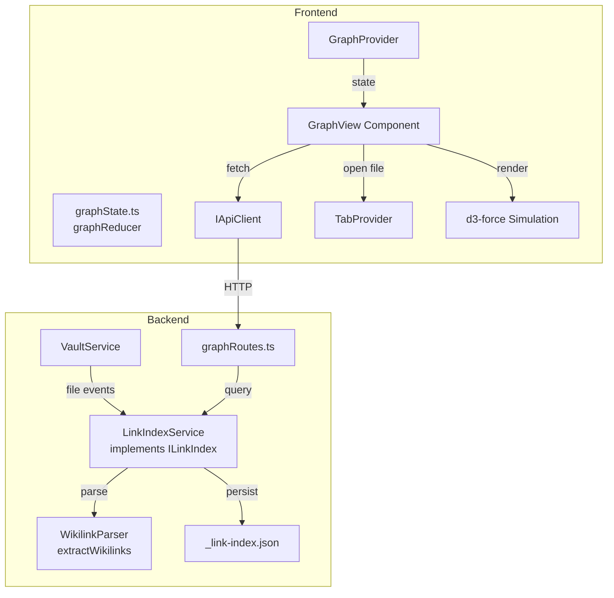

# Design Document: Knowledge Graph

## Overview

Der Knowledge Graph visualisiert die Verlinkungsstruktur eines Vaults als interaktiven Graphen. Das Feature besteht aus zwei Hauptteilen:

1. **Backend: Link-Index-Service** — Extrahiert Wikilinks aus Markdown-Dateien, verwaltet einen In-Memory-Index (`Map<filePath, Set<linkedPath>>` + Reverse-Map), persistiert als JSON-Datei. Bietet eine REST-API für Graph-Daten und Backlinks.

2. **Frontend: Graph-View-Komponente** — Rendert den Graphen als interaktive SVG-Visualisierung mit Force-Layout, Zoom/Pan, Node-Drag, Suche und Design-Token-basiertem Theming. Öffnet sich als Tab im bestehenden Tab-System.

### Design-Entscheidungen

| Entscheidung | Begründung |
|---|---|
| In-Memory-Index statt SQLite | Ausreichend für typische Vaults (hunderte bis wenige tausend Dateien). SQLite erst bei Performance-Problemen (Phase 2). |
| JSON-Persistierung mit atomarem Schreiben | Konsistent mit dem bestehenden Filesystem-Pattern (temp → rename). Crash-safe. |
| Inkrementelles Update statt Full-Rebuild | Bei Datei-Save wird nur eine Datei neu geparst → Index-Update in <500ms. |
| ILinkIndex-Interface | Abstrahiert die Implementierung → späterer Wechsel zu SQLite ohne API-Änderung. |
| Backend-eigener Wikilink-Parser | Kein Frontend-Code im Backend. Gleiche Ergebnisse wie `extractWikilinks()` im Frontend. |
| SVG + Force-Layout (d3-force) | Bewährte Lösung für Graph-Visualisierung. Keine Canvas nötig bei typischen Vault-Größen. |
| Graph als Tab | Nahtlose Integration in bestehendes Tab-System. Maximal ein Graph-Tab gleichzeitig. |

## Architecture



### Schichtenarchitektur (Backend)

```
WikilinkParser (Utility)
    ↓ used by
LinkIndexService (Business Logic, implements ILinkIndex)
    ↓ consumed by
GraphController (API Layer, graphRoutes.ts)
    ↓ wired in
Composition Root (src/index.ts)
```

### Datenfluss

1. **Vault-Init**: VaultService ruft `linkIndexService.rebuild()` auf → alle `.md`-Dateien werden geparst → Index wird in-memory aufgebaut und als JSON persistiert.
2. **File-Save**: VaultController ruft nach erfolgreichem Save `linkIndexService.updateFile(path, content)` auf → nur diese Datei wird neu geparst → Index aktualisiert → JSON persistiert.
3. **File-Delete**: VaultController ruft `linkIndexService.removeFile(path)` auf → Einträge entfernt → JSON persistiert.
4. **Graph-Request**: Frontend ruft `GET /api/v1/vaults/:vaultId/graph` auf → LinkIndexService gibt Nodes + Edges zurück.
5. **Backlinks-Request**: Frontend ruft `GET /api/v1/vaults/:vaultId/backlinks?path=...` auf → LinkIndexService gibt Quell-Dateien zurück.

## Components and Interfaces

### Backend

#### ILinkIndex Interface

```typescript
/**
 * Abstraction for the link index implementation.
 * Allows switching from JSON-based in-memory index to SQLite
 * without changing consuming code.
 */
export interface ILinkIndex {
  /**
   * Rebuilds the entire index by parsing all markdown files in the vault.
   * Called on first init or when persisted index is invalid.
   */
  rebuild(): Promise<void>

  /**
   * Updates the index for a single file (added or modified).
   * Parses the content and updates forward links + reverse map.
   * @param filePath - Relative path from vault root (normalized, forward slashes)
   * @param content - Markdown content of the file
   */
  updateFile(filePath: string, content: string): Promise<void>

  /**
   * Removes all index entries for a deleted file.
   * Cleans up forward links and backlink references.
   * @param filePath - Relative path from vault root
   */
  removeFile(filePath: string): Promise<void>

  /**
   * Handles file rename by removing old path and adding new path.
   * @param oldPath - Previous relative path
   * @param newPath - New relative path
   * @param content - Current markdown content
   */
  renameFile(oldPath: string, newPath: string, content: string): Promise<void>

  /**
   * Returns forward links for a specific file.
   * @param filePath - Relative path from vault root
   * @returns Array of target file paths this file links to
   */
  getForwardLinks(filePath: string): string[]

  /**
   * Returns backlinks for a specific file.
   * @param filePath - Relative path from vault root
   * @returns Array of source file paths that link to this file
   */
  getBacklinks(filePath: string): string[]

  /**
   * Returns the full graph structure for visualization.
   * @returns Nodes (with existence flag) and edges
   */
  getGraph(): GraphData

  /**
   * Whether the index has been initialized (loaded or rebuilt).
   */
  isReady(): boolean
}
```

#### GraphData Types

```typescript
export interface GraphNode {
  /** Relative file path from vault root */
  path: string
  /** Filename without extension (display label) */
  label: string
  /** Whether the file physically exists in the vault */
  exists: boolean
}

export interface GraphEdge {
  /** Source file path (the file containing the wikilink) */
  source: string
  /** Target file path (the linked file) */
  target: string
}

export interface GraphData {
  nodes: GraphNode[]
  edges: GraphEdge[]
}

export interface BacklinksResponse {
  /** File path that was queried */
  path: string
  /** Files that link to this path */
  backlinks: string[]
}
```

#### LinkIndexService

```typescript
export class LinkIndexService implements ILinkIndex {
  constructor(
    private readonly vaultPath: string,
    private readonly vaultId: string,
    private readonly logger: ILogger
  ) {}
  // ... implements all ILinkIndex methods
}
```

- Speichert intern: `forwardLinks: Map<string, Set<string>>` und `backlinks: Map<string, Set<string>>`
- Persistiert nach jedem Update atomar als `_link-index.json`
- Beim Start: Versucht JSON zu laden, bei Fehler → `rebuild()`

#### WikilinkParser (Backend)

```typescript
export interface ParsedWikilink {
  target: string
  display: string
  heading: string | null
  position: { line: number; column: number }
}

/**
 * Extracts wikilinks from a markdown string.
 * Ignores wikilinks inside code blocks and inline code.
 * Results must be identical to the frontend extractWikilinks() function.
 */
export function extractWikilinks(markdown: string): ParsedWikilink[]
```

#### GraphController (graphRoutes.ts)

```typescript
// GET /api/v1/vaults/:vaultId/graph
// Returns: GraphData (nodes + edges)

// GET /api/v1/vaults/:vaultId/backlinks?path=<filePath>
// Returns: BacklinksResponse
```

### Frontend

#### GraphView Component

```typescript
interface GraphViewProps {
  vaultId: string
}
```

- Fetches graph data from API on mount and vault change
- Renders SVG with force-directed layout
- Handles zoom, pan, drag, hover, click interactions
- Integrates with TabProvider to open files on node click

#### Graph State (graphState.ts)

Kein eigener Context/Provider nötig — der Graph-State ist lokal zur GraphView-Komponente (loading, error, graphData). Kein globaler State erforderlich, da der Graph nur in einem Tab existiert und keine anderen Komponenten den Graph-State brauchen.

#### API Client Extension

```typescript
// Added to IApiClient interface:
getGraph(vaultId: string): Promise<GraphData>
getBacklinks(vaultId: string, filePath: string): Promise<BacklinksResponse>
```

## Data Models

### Link-Index JSON Schema (`_link-index.json`)

```json
{
  "version": 1,
  "updatedAt": "2024-01-15T10:30:00.000Z",
  "forwardLinks": {
    "notes/daily.md": ["projects/alpha.md", "people/alice.md"],
    "projects/alpha.md": ["notes/daily.md"]
  }
}
```

- `version`: Schema-Version für zukünftige Migrationen
- `updatedAt`: ISO-Timestamp des letzten Updates
- `forwardLinks`: `Record<filePath, targetPaths[]>` — nur Forward-Links werden persistiert
- Reverse-Map (Backlinks) wird beim Laden aus Forward-Links berechnet (abgeleiteter Index)

### Pfad-Normalisierung

- Forward Slashes (`/`) als Separator
- Kein führendes `./`
- Relativ zum Vault-Root
- Extension `.md` wird bei Wikilink-Targets ergänzt wenn nicht vorhanden
- Beispiel: `[[daily]]` → Target-Pfad `daily.md`, `[[projects/alpha]]` → `projects/alpha.md`

### Graph-API Response

```json
{
  "nodes": [
    { "path": "notes/daily.md", "label": "daily", "exists": true },
    { "path": "projects/alpha.md", "label": "alpha", "exists": true },
    { "path": "ideas/future.md", "label": "future", "exists": false }
  ],
  "edges": [
    { "source": "notes/daily.md", "target": "projects/alpha.md" },
    { "source": "notes/daily.md", "target": "ideas/future.md" }
  ]
}
```

### Tab-Integration

Der Graph-Tab verwendet einen speziellen Tab-Typ. Da das bestehende Tab-System auf Dateipfaden basiert, wird ein virtueller Pfad verwendet:

- Tab-ID: `<vaultId>::__graph__`
- `filePath`: `__graph__`
- `fileName`: `Graph`
- `isBinary`: `false` (wird als Sonder-Tab erkannt)

`TabContent` prüft ob `filePath === '__graph__'` und rendert dann `GraphView` statt Editor/Viewer.

## Correctness Properties

*A property is a characteristic or behavior that should hold true across all valid executions of a system — essentially, a formal statement about what the system should do. Properties serve as the bridge between human-readable specifications and machine-verifiable correctness guarantees.*

### Property 1: Reverse-Map Invariant

*For any* link index state (after rebuild, updateFile, removeFile, or renameFile), for every forward link entry where file A links to file B, `getBacklinks(B)` SHALL contain A. Conversely, for every backlink entry where B has backlink from A, `getForwardLinks(A)` SHALL contain B.

**Validates: Requirements 1.3, 2.3, 3.3**

### Property 2: Index Persistence Round-Trip

*For any* valid link index state, serializing the index to JSON and then loading it back SHALL produce an index with identical forward links and backlinks for all files.

**Validates: Requirements 1.4, 1.5**

### Property 3: Path Normalization

*For any* file path stored in the index, the path SHALL use forward slashes as separators, SHALL NOT start with `./`, and SHALL be relative to the vault root. For any wikilink target, the resolved path SHALL follow the same normalization rules.

**Validates: Requirements 1.2**

### Property 4: Incremental Update Isolation

*For any* index state and any single file update (via `updateFile`), only the updated file's forward link entries SHALL change. All other files' forward link entries SHALL remain identical to their state before the update. The updated file's forward links SHALL exactly match the wikilinks extracted from the new content.

**Validates: Requirements 2.1, 2.2**

### Property 5: Delete Removes All Traces

*For any* index state and any file path that is deleted (via `removeFile`), after deletion the file SHALL NOT appear as a key in the forward links map, and SHALL NOT appear as a source in any file's backlinks set.

**Validates: Requirements 2.4**

### Property 6: Rename Correctness

*For any* index state and any file rename from oldPath to newPath, after the rename operation, oldPath SHALL NOT appear anywhere in the index (neither as forward link source nor as backlink source), and newPath SHALL have forward links matching the wikilinks extracted from the file's content.

**Validates: Requirements 2.6**

### Property 7: getGraph Completeness and Correctness

*For any* index state, `getGraph()` SHALL return a node for every file that either exists on disk OR is referenced as a link target (and no other nodes). The edges SHALL be a 1:1 mapping of the forward links in the index. Every edge's source and target SHALL correspond to a node in the nodes array.

**Validates: Requirements 3.1, 3.2**

### Property 8: Invalid Index File Triggers Rebuild

*For any* string that is not valid JSON, or valid JSON that does not conform to the expected schema (missing `version`, `forwardLinks`, or wrong types), loading the index SHALL trigger a full rebuild instead of using the invalid data.

**Validates: Requirements 1.6**

### Property 9: Backend Parser Equivalence

*For any* markdown string, the backend `extractWikilinks()` function SHALL return the same set of wikilink targets (same count, same target values) as the frontend `extractWikilinks()` function.

**Validates: Requirements 8.1**

### Property 10: Code Block Exclusion

*For any* markdown string where wikilinks appear exclusively inside fenced code blocks (``` or ~~~), indented code blocks (4 spaces/1 tab), or inline code (backticks), the parser SHALL return an empty result array.

**Validates: Requirements 8.2**

### Property 11: Wikilink Format Recognition

*For any* valid wikilink in the supported formats (`[[target]]`, `[[folder/file]]`, `[[file#heading]]`, `[[file#heading|display]]`, `[[#heading]]`), the parser SHALL correctly extract the target, heading, and display fields according to the format rules.

**Validates: Requirements 8.3**

### Property 12: Invalid Wikilinks Ignored

*For any* markdown string containing syntactically invalid wikilinks (`[[]]`, unclosed `[[...`, wikilinks with newlines), the parser SHALL not include them in the result and SHALL NOT throw an error.

**Validates: Requirements 8.4**

### Property 13: Parser Determinism

*For any* markdown string, calling `extractWikilinks()` multiple times with the same input SHALL always produce the same output (same count, same field values, same order).

**Validates: Requirements 8.5**

### Property 14: Label Truncation

*For any* filename, the display label SHALL be the filename without path and without `.md` extension. If the resulting label exceeds 30 characters, it SHALL be truncated to 30 characters followed by an ellipsis (`…`). Labels of 30 characters or fewer SHALL remain unchanged.

**Validates: Requirements 4.3**

### Property 15: Zoom Clamping

*For any* current zoom level and any zoom delta (from mouse wheel or pinch gesture), the resulting zoom level SHALL always be within the range [0.1, 5.0].

**Validates: Requirements 5.1**

### Property 16: Node Size Scaling

*For any* node with N total connections (forward links + backlinks) in a graph where the maximum connection count is M, the node radius SHALL be between 4px (minimum, for N=0) and 20px (maximum, for N=M), scaling proportionally. The radius SHALL be monotonically non-decreasing with respect to N.

**Validates: Requirements 9.1**

### Property 17: Search Filtering

*For any* search query string and any list of graph nodes, the search results SHALL contain only nodes whose filename (without path and extension) contains the query as a case-insensitive substring. The results SHALL contain at most 10 entries.

**Validates: Requirements 9.2**

## Error Handling

### Backend

| Fehlerfall | Verhalten | HTTP Status |
|---|---|---|
| Vault nicht gefunden | `VaultNotFoundError` → 404 mit `VAULT_NOT_FOUND` | 404 |
| Keine Berechtigung | `AccessDeniedError` → 403 | 403 |
| Index nicht bereit (noch im Aufbau) | Lazy-Init: Index wird aufgebaut, dann Response | 200 (verzögert) |
| Einzelne Datei nicht lesbar beim Rebuild | Datei überspringen, Warnung loggen, weiter | — |
| JSON-Persistierung fehlgeschlagen | In-Memory-Index beibehalten, Fehler loggen | — |
| Ungültige `path`-Query-Parameter | Zod-Validierung → 400 mit `INVALID_PATH` | 400 |
| Backlinks für unbekannte Datei | Leere Liste zurückgeben | 200 |

### Frontend

| Fehlerfall | Verhalten |
|---|---|
| API-Fehler beim Laden | Fehlermeldung im Tab-Inhalt + Retry-Button |
| Kein Vault ausgewählt | Hinweismeldung "Bitte Vault auswählen" |
| Leerer Graph (keine Nodes) | Hinweismeldung "Keine Verlinkungen gefunden" |
| Node-Klick auf nicht-existierende Datei | Keine Aktion (kein Tab öffnen) |

### Error Classes (Backend)

```typescript
export class LinkIndexNotReadyError extends Error {
  constructor(vaultId: string) {
    super(`Link index for vault ${vaultId} is not ready`)
    this.name = 'LinkIndexNotReadyError'
  }
}

export class LinkIndexPersistError extends Error {
  constructor(cause: unknown) {
    super('Failed to persist link index')
    this.name = 'LinkIndexPersistError'
    this.cause = cause
  }
}
```

## Testing Strategy

### Dual Testing Approach

**Unit Tests** (example-based):
- API endpoint tests (auth, 404, 403 scenarios)
- Tab integration (open/close/activate graph tab)
- UI component rendering (loading state, error state, empty state)
- Node click behavior (existing vs. non-existing)
- Hover highlighting behavior
- Vault switch behavior

**Property-Based Tests** (universal properties, fast-check):
- All 17 correctness properties above
- Minimum 100 iterations per property test
- Tag format: `Feature: knowledge-graph, Property {N}: {title}`

### PBT Library

- **fast-check** (already a devDependency in both packages)
- Backend PBT file: `backend/src/link-index/link-index.pbt.test.ts`
- Frontend PBT file: `frontend/src/components/GraphView.pbt.test.ts` (for pure utility functions: label truncation, zoom clamping, node sizing, search filtering)

### Test File Structure

```
backend/src/link-index/
├── index.ts                    — Barrel export
├── types.ts                    — ILinkIndex, GraphData, GraphNode, GraphEdge
├── link-index-service.ts       — LinkIndexService implementation
├── link-index-service.test.ts  — Unit tests
├── link-index.pbt.test.ts      — Property-based tests (Properties 1–13)
├── wikilink-parser.ts          — Backend extractWikilinks()
└── wikilink-parser.test.ts     — Unit tests for parser

backend/src/api/
└── graphRoutes.ts              — Graph API routes
└── graphRoutes.test.ts         — API endpoint tests

frontend/src/components/
├── GraphView.tsx               — Graph visualization component
├── GraphView.test.tsx          — Unit tests
├── GraphView.pbt.test.ts       — Property-based tests (Properties 14–17)
└── graph-utils.ts              — Pure utility functions (truncateLabel, clampZoom, computeNodeSize, filterNodes)
```

### Integration Tests

- Full rebuild from real vault files (temp directory)
- Incremental update cycle (save → update → verify)
- API endpoint with real LinkIndexService (no mocks)

### What is NOT Property-Tested

- UI rendering (SVG elements, CSS classes) → example-based component tests
- Force layout positioning → visual inspection / snapshot tests
- API authentication/authorization → example-based endpoint tests
- Tab system integration → example-based component tests
- Hover/click interactions → example-based event tests

