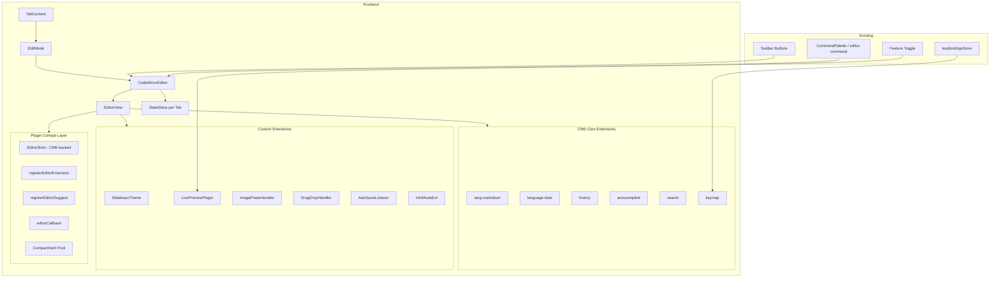

# Design — Live Preview Editor (CodeMirror 6 Migration)

## Overview

Dieses Design beschreibt die Migration des Slatebase-Editors von einem einfachen `<textarea>` zu **CodeMirror 6** (CM6). Die Migration erfolgt in drei Phasen:

1. **Phase 1 — CM6 als Source-Editor**: Ersetzt das textarea durch eine CM6 `EditorView` mit Syntax-Highlighting, Vim-Mode, bestehender Toolbar-Integration und per-Tab State Management.
2. **Phase 2 — Live Preview**: Inline-Rendering von Markdown-Elementen (Headings, Bold, Links, Embeds, Callouts) direkt im Editor via CM6 Decorations und Widgets.
3. **Phase 3 — Plugin-Integration**: `registerEditorExtension`, `registerEditorSuggest` und `editorCallback` für das Plugin-Compat-System, basierend auf CM6 Compartments.

**Zentrale Design-Entscheidung**: CM6 wird immer verwendet (kein Fallback auf textarea). Der Feature-Toggle `live-preview` steuert nur, ob der Live-Preview-Modus verfügbar ist — nicht, ob CM6 genutzt wird.

### Technologie-Entscheidungen

| Entscheidung | Wahl | Begründung |
|---|---|---|
| Editor-Framework | CodeMirror 6 | Modulares, performantes Framework; aktiv maintained; exzellente Extension-API; virtuelles Scrolling built-in |
| Vim-Mode | `@replit/codemirror-vim` | Etablierte CM6-Vim-Extension, aktiv maintained (3.6k GitHub stars), Production-erprobt bei Replit |
| Live Preview Approach | CM6 Decorations + ViewPlugin | Native CM6-Muster: StateField trackt dekorierbaren Content, ViewPlugin rendert Widgets/Markierungen |
| Per-Tab State | `EditorState` Map in React ref | Vermeidet Provider-Overhead; CM6-States sind serialisierbar; passt zum bestehenden Tab-Pattern |
| Plugin Extensions | CM6 Compartments | Isolierte Reconfiguration pro Plugin ohne Full-Editor-Recreate |

## Architecture



### Komponentenhierarchie

```
TabContent
└── EditMode (überarbeitet)
    ├── EditorToolbar (extrahiert, optional Undo/Redo/Format/LivePreview-Toggle)
    └── CodeMirrorEditor (neu)
        ├── useEditorStateStore (Hook: per-Tab EditorState Verwaltung)
        ├── useEditorExtensions (Hook: Extension-Zusammenstellung)
        └── EditorView (CM6 DOM-Instanz)
```

## Components and Interfaces

### CodeMirrorEditor (Neue Hauptkomponente)

```typescript
/**
 * Props for the CodeMirror 6 editor component.
 * Replaces the <textarea> in EditMode with a full CM6 EditorView.
 */
export interface CodeMirrorEditorProps {
  /** Current file content (server truth or editBuffer). */
  content: string
  /** Callback on content change (same interface as textarea onChange). */
  onContentChange: (content: string) => void
  /** Whether the editor is read-only. */
  readOnly?: boolean
  /** Unique tab ID for per-tab state management. */
  tabId: string
  /** File path for language detection and context. */
  filePath?: string
  /** Whether Live Preview mode is active. */
  livePreview?: boolean
  /** Whether line numbers should be shown. */
  showLineNumbers?: boolean
  /** Whether Vim mode is enabled. */
  vimMode?: boolean
  /** Whether bracket auto-close is enabled. */
  bracketAutoClose?: boolean
  /** Plugin extensions to apply (from registerEditorExtension). */
  pluginExtensions?: Extension[]
  /** Plugin autocomplete providers (from registerEditorSuggest). */
  pluginCompletions?: CompletionSource[]
  /** Ref to expose imperative editor API to parent. */
  editorRef?: React.RefObject<IEditorHandle | null>
}

/**
 * Imperative handle exposing editor operations to parent components
 * (toolbar, command palette, plugin compat layer).
 */
export interface IEditorHandle {
  /** Execute a transaction on the editor (for toolbar actions). */
  dispatch(tr: TransactionSpec): void
  /** Get current editor state. */
  getState(): EditorState
  /** Get the EditorView instance (for plugin compat). */
  getView(): EditorView | null
  /** Focus the editor. */
  focus(): void
  /** Apply a formatting command (bold, italic, heading, etc.). */
  applyFormatting(action: EditorFormattingAction): void
  /** Perform undo. */
  undo(): void
  /** Perform redo. */
  redo(): void
  /** Insert text at current cursor position. */
  insertAtCursor(text: string): void
}

/** All available formatting actions (maps to toolbar + command palette). */
export type EditorFormattingAction =
  | 'heading1' | 'heading2' | 'heading3'
  | 'bold' | 'italic' | 'strikethrough' | 'code'
  | 'link' | 'bulletList' | 'numberedList' | 'task'
  | 'quote' | 'horizontalRule' | 'table'
  | 'toggleLineNumbers'
```

### useEditorStateStore (Per-Tab State Hook)

```typescript
/**
 * Manages per-tab EditorState instances.
 * Stores cursor position, scroll position, undo history, and selections.
 */
export interface EditorStateEntry {
  /** Serialized EditorState (JSON-serializable for future persistence). */
  state: EditorState
  /** Scroll position (pixels from top). */
  scrollTop: number
  /** Scroll position (pixels from left). */
  scrollLeft: number
}

export interface UseEditorStateStoreReturn {
  /** Get stored state for a tab (or null if first open). */
  getState(tabId: string): EditorStateEntry | null
  /** Save current editor state for a tab. */
  saveState(tabId: string, entry: EditorStateEntry): void
  /** Remove state when tab is closed (memory cleanup). */
  removeState(tabId: string): void
  /** Update document content without clearing history (for external changes). */
  updateContent(tabId: string, newContent: string): void
}
```

### EditorShim (Überarbeitet — CM6-backed)

```typescript
/**
 * EditorShim wraps CM6 EditorView instead of textarea.
 * All IEditor methods delegate to CM6 State/Dispatch.
 * Implements the Obsidian Editor interface for plugin compatibility.
 */
export interface IEditor {
  getCursor(where?: 'from' | 'to' | 'head' | 'anchor'): Pos
  setCursor(pos: Pos): void
  getSelection(): string
  replaceSelection(replacement: string): void
  replaceRange(replacement: string, from: Pos, to?: Pos): void
  getRange(from: Pos, to: Pos): string
  getValue(): string
  setValue(content: string): void
  getLine(n: number): string
  lineCount(): number
  lastLine(): number
  getDoc(): { getValue(): string; lineCount(): number }
  somethingSelected(): boolean
  listSelections(): Array<{ anchor: Pos; head: Pos }>
  setSelection(anchor: Pos, head?: Pos): void
  focus(): void
  scrollIntoView(range: { from: Pos; to: Pos }): void
  getScrollInfo(): { top: number; left: number }
  exec(command: string): void
  undo(): void
  redo(): void
  wordAt(pos: Pos): { from: Pos; to: Pos } | null
  transaction(): IEditorTransaction
}

/**
 * Transaction wrapper for batch operations.
 */
export interface IEditorTransaction {
  replaceRange(replacement: string, from: Pos, to?: Pos): IEditorTransaction
  setCursor(pos: Pos): IEditorTransaction
  commit(): void
}
```

### SlatebaseTheme (CM6 Theme Extension)

```typescript
/**
 * Creates a CM6 theme that references Slatebase CSS Custom Properties.
 * No hardcoded colors — all values come from Design Tokens.
 * Automatically adapts to Dark/Light mode via CSS variable resolution.
 */
export function createSlatebaseTheme(): Extension

/**
 * CM6 highlight style using Design Token colors.
 * Maps Lezer syntax tags to CSS custom properties.
 */
export function createSlatebaseHighlightStyle(): Extension
```

### LivePreviewExtension (Phase 2)

```typescript
/**
 * Creates the Live Preview extension set.
 * Returns a Compartment-wrapped extension that can be toggled on/off.
 */
export function createLivePreviewExtension(options: {
  /** Vault ID for resolving embeds and wikilinks. */
  vaultId: string
  /** Directory tree for link resolution. */
  directoryTree: DirectoryTree | null
  /** Auth token for image URLs. */
  token?: string
  /** Callback when an internal link is clicked. */
  onInternalLinkClick?: (target: string) => void
  /** Callback when a checkbox is toggled. */
  onCheckboxToggle?: (line: number, checked: boolean) => void
}): Extension

/**
 * StateField tracking cursor position for show/hide Markdown syntax.
 * When cursor is inside a decorated range, raw syntax becomes visible.
 */
export interface LivePreviewState {
  /** Set of decoration ranges currently "revealed" (cursor is inside). */
  revealedRanges: RangeSet<Decoration>
  /** All active decorations (headings, bold, links, etc.). */
  decorations: DecorationSet
}
```

### Plugin Extension Registration (Phase 3)

```typescript
/**
 * Manages plugin-provided CM6 extensions via Compartments.
 * Each plugin gets its own Compartment for isolated enable/disable.
 */
export interface IPluginExtensionManager {
  /** Register an extension from a plugin. Applied on next reconfigure. */
  registerExtension(pluginId: string, extension: Extension): void
  /** Remove all extensions for a plugin (on deactivation). */
  removeExtensions(pluginId: string): void
  /** Get all currently active plugin extensions (flattened). */
  getActiveExtensions(): Extension[]
  /** Register an autocomplete provider from a plugin. */
  registerCompletionSource(pluginId: string, source: CompletionSource): void
  /** Remove all completion sources for a plugin. */
  removeCompletionSources(pluginId: string): void
}
```

## Data Models

### Per-Tab Editor State

```typescript
/**
 * Stored alongside the existing TabEntry in a module-level Map.
 * Not in React state — CM6 manages its own state internally.
 */
interface EditorTabState {
  /** CM6 EditorState instance (contains doc, selections, history, extensions). */
  editorState: EditorState | null
  /** Scroll position to restore on tab switch. */
  scrollPosition: { top: number; left: number }
  /** Whether this tab is in Live Preview mode (persisted per tab). */
  livePreviewActive: boolean
}

// Module-level store (same pattern as recentFilesStore, favoritesStore)
const editorStates = new Map<string, EditorTabState>()
```

### Editor Configuration (persisted via keybindingsStore/preferences)

```typescript
/** Editor preferences stored in user preferences. */
interface EditorPreferences {
  /** Vim mode enabled. Default: false. */
  vimMode: boolean
  /** Bracket auto-close. Default: true. */
  bracketAutoClose: boolean
  /** Default editor mode. 'source' | 'live-preview'. Default: 'live-preview'. */
  defaultMode: 'source' | 'live-preview'
  /** Show line numbers. Default: false (existing behavior). */
  showLineNumbers: boolean
}
```

### Live Preview Decoration Types

```typescript
/** Types of decorations applied in Live Preview mode. */
type DecorationKind =
  | 'heading'       // # → large text, hide marker
  | 'bold'          // ** → bold text, hide markers
  | 'italic'        // _ → italic text, hide markers  
  | 'strikethrough' // ~~ → strikethrough, hide markers
  | 'inline-code'   // ` → monospace bg, hide markers
  | 'link'          // [text](url) → clickable, hide url
  | 'wikilink'      // [[target]] → internal link
  | 'embed'         // ![[file]] → inline preview widget
  | 'code-block'    // ``` → highlighted with lang label
  | 'blockquote'    // > → indented with sidebar
  | 'task'          // - [ ] → checkbox widget
  | 'callout'       // > [!type] → colored container
  | 'heading-line'  // Line decoration for heading sizing

/**
 * Live Preview decoration is managed by a StateField that:
 * 1. Parses the document using the Lezer Markdown tree
 * 2. Creates Decoration.mark() for inline formatting
 * 3. Creates Decoration.widget() for embeds, checkboxes, callouts
 * 4. Creates Decoration.line() for heading sizes, blockquotes
 * 5. Checks cursor position to reveal/hide syntax markers
 */
```

### Plugin Compartment Registry

```typescript
/**
 * Maps plugin IDs to their CM6 Compartment instances.
 * Compartments allow isolated reconfiguration without full editor recreate.
 */
interface PluginCompartmentEntry {
  pluginId: string
  compartment: Compartment
  /** Current extension content (empty = disabled). */
  currentExtension: Extension
}

// Module-level registry
const pluginCompartments = new Map<string, PluginCompartmentEntry>()
```

## Correctness Properties

*A property is a characteristic or behavior that should hold true across all valid executions of a system — essentially, a formal statement about what the system should do. Properties serve as the bridge between human-readable specifications and machine-verifiable correctness guarantees.*

### Property 1: Editor content round-trip preservation

*For any* valid Markdown document content, setting the content in the CM6 editor and then reading it back via `EditorState.doc.toString()` SHALL produce an identical string (byte-for-byte).

**Validates: Requirements 1.1, 2.6**

### Property 2: Tab state isolation

*For any* sequence of tab switches between N open tabs, restoring a tab SHALL reproduce the exact cursor position (line, character) and scroll position that was active when the tab was last focused.

**Validates: Requirements 1.10, 2.1, 2.2**

### Property 3: Undo/Redo determinism

*For any* sequence of document edits followed by K undo operations, the resulting document content SHALL equal the content that existed K edits prior (within the 200-step history limit).

**Validates: Requirements 5.1, 5.3**

### Property 4: Image paste preserves non-image clipboard

*For any* clipboard paste event where `clipboardData.items` contains NO `image/*` MIME type, the editor SHALL process the paste as normal text insertion (no interception, no upload).

**Validates: Requirements 4.4**

### Property 5: Theme token resolution consistency

*For any* CM6 theme style rule in the Slatebase theme, the CSS value SHALL reference a `var(--*)` custom property (never a hardcoded color literal).

**Validates: Requirements 9.1, 9.2**

### Property 6: Live Preview syntax reveal on cursor entry

*For any* formatted element in Live Preview mode (heading, bold, italic, link, etc.), moving the cursor INTO that element's range SHALL cause the raw Markdown markers to become visible, and moving the cursor OUT SHALL hide them again.

**Validates: Requirements 6.3, 6.4**

### Property 7: Plugin extension isolation

*For any* plugin that registers a CM6 Extension, disabling that plugin SHALL remove exactly its extensions from the editor (no other plugin's extensions affected), and the editor SHALL continue functioning without errors.

**Validates: Requirements 7.5, 7.6**

### Property 8: EditorShim API equivalence

*For any* valid `Pos` (line, ch) within the document bounds, `EditorShim.getRange(from, to)` SHALL return the same substring as `content.split('\n')` line-based extraction for the equivalent range.

**Validates: Requirements 7.4**

### Property 9: Formatting action idempotence on structure

*For any* toolbar formatting action (bold, italic, heading, etc.) applied to a selection, the resulting document SHALL contain exactly one additional formatting marker pair around the selected text (not duplicated markers).

**Validates: Requirements 1.7, 3.2**

### Property 10: External content update preserves history

*For any* external content update (SSE `vault:change`) applied when `editBuffer === null`, the editor's undo history SHALL retain all previously recorded steps (history length does not decrease).

**Validates: Requirements 2.4, 5.4**

## Error Handling

### Editor Initialization Failures

| Scenario | Handling |
|---|---|
| CM6 EditorView creation throws | Catch in `CodeMirrorEditor`, render error fallback UI with retry button |
| Plugin extension throws during evaluation | Wrap in try/catch per plugin Compartment; log error, exclude faulty extension, editor continues |
| Language support fails to load | Fallback to plain text (no highlighting), show toast notification |

### Runtime Errors

| Scenario | Handling |
|---|---|
| Undo/Redo beyond history limit | CM6 built-in: no-op (commands return false) |
| Image paste upload fails | Show toast with error message, no document modification |
| External content update conflicts with edit buffer | Skip update (existing behavior: only apply when `editBuffer === null`) |
| Vim mode extension load failure | Disable vim mode, show toast, continue with standard keybindings |
| Live Preview decoration throws | Catch per-decoration-type, degrade gracefully to source mode for that element |

### Memory Management

| Scenario | Handling |
|---|---|
| Tab closed | Remove EditorState from `editorStates` Map, allow GC |
| Many tabs open (>20) | CM6 EditorState is lightweight (doc is rope-based); no explicit eviction needed |
| Very large file (>50k chars) | Auto-disable Live Preview (Req 8.2), show info notice |
| History exceeds 200 steps | CM6 `history({ newGroupDelay: 300 })` + `historyConfig` max entries |

## Testing Strategy

### Unit Tests (Vitest + Testing Library)

- **CodeMirrorEditor component**: Mount, content changes trigger `onContentChange`, read-only state prevents edits
- **EditorShim**: All IEditor methods produce correct results against a CM6 EditorView
- **createSlatebaseTheme**: Snapshot test that all style rules use CSS custom properties
- **Formatting actions**: Each action (bold, heading, link, etc.) produces correct Markdown output
- **useEditorStateStore**: Store/restore/remove operations, memory cleanup on tab close
- **LivePreviewExtension**: Decoration creation for each Markdown element type
- **PluginExtensionManager**: Register, remove, isolation (faulty plugin doesn't crash others)

### Property-Based Tests (Vitest + fast-check)

Property-based testing is applicable here because the editor has clear input/output behavior with universal properties that should hold across a wide range of inputs (arbitrary Markdown strings, cursor positions, formatting actions).

**Library**: `fast-check` (established PBT library for TypeScript/JavaScript, actively maintained)

**Configuration**: Minimum 100 iterations per property test.

Each property test references its design document property:
- **Feature: live-preview-editor, Property 1**: Content round-trip (arbitrary strings)
- **Feature: live-preview-editor, Property 2**: Tab state isolation (random tab sequences)
- **Feature: live-preview-editor, Property 3**: Undo/Redo determinism (random edit sequences)
- **Feature: live-preview-editor, Property 4**: Image paste non-interception (non-image MIME types)
- **Feature: live-preview-editor, Property 5**: Theme token resolution (all style rules)
- **Feature: live-preview-editor, Property 6**: Cursor reveal/hide (random positions in decorated ranges)
- **Feature: live-preview-editor, Property 7**: Plugin extension isolation (register/unregister sequences)
- **Feature: live-preview-editor, Property 8**: EditorShim API equivalence (random Pos pairs)
- **Feature: live-preview-editor, Property 9**: Formatting idempotence (random selections + actions)
- **Feature: live-preview-editor, Property 10**: External update preserves history (random edit + update sequences)

### Integration Tests (Vitest)

- Tab switch preserves and restores editor state correctly
- Auto-save debounce triggers after 2s of inactivity
- `slatebase:editor-command` CustomEvent dispatches correctly to CM6
- Feature toggle `live-preview` controls Live Preview availability
- Toolbar buttons execute CM6 transactions

### E2E Tests (Playwright)

- Full editing workflow: open file, type, auto-save, verify persisted
- Tab switching with cursor restoration
- Live Preview toggle and inline rendering verification
- Vim mode activation and basic command execution
- Image paste from clipboard
- Drag-and-drop file into editor

### Testing Boundaries

Unit tests focus on:
- EditorShim method correctness (specific examples for each method)
- Formatting action output for known inputs
- Theme CSS property validation

Property tests focus on:
- Round-trip invariants across arbitrary content
- State isolation across random operation sequences
- Formatting structure preservation for random selections
