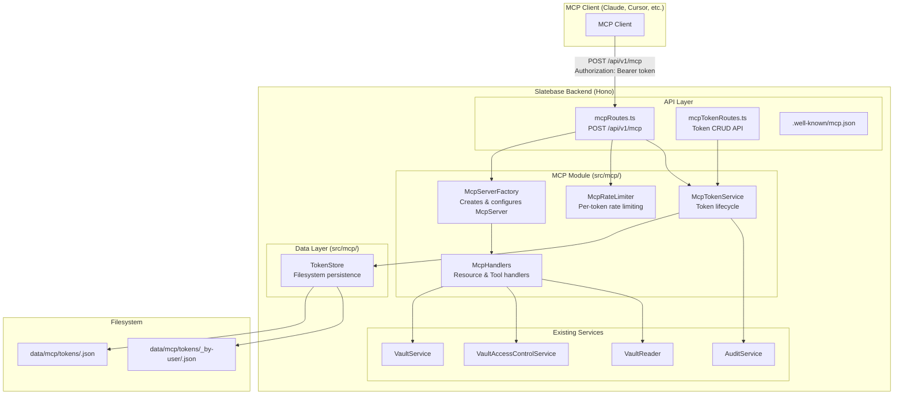
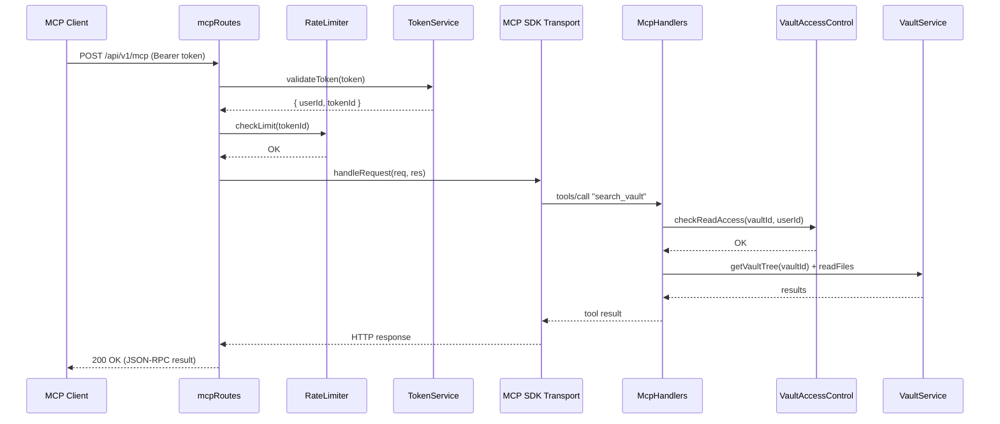

# Design Document: MCP Context Server

## Overview

Der MCP Context Server integriert einen Model Context Protocol (MCP) Server in das bestehende Slatebase-Backend. Er ermöglicht KI-Assistenten den standardisierten Zugriff auf Vault-Inhalte über das MCP-Protokoll mit Streamable HTTP Transport.

**Architektur-Entscheidung:** Der MCP-Server wird als eigenständiges Backend-Modul (`src/mcp/`) implementiert, das die bestehenden Services (VaultService, VaultAccessControlService) nutzt. Die Authentifizierung erfolgt über dedizierte API-Tokens (Bearer-Token), unabhängig von Browser-Sessions. Der Transport wird über die offizielle `@modelcontextprotocol/sdk` Library realisiert, die `StreamableHTTPServerTransport` für Hono bereitstellt.

**Kern-Designprinzipien:**
- Interface-first: Alle Komponenten definieren `I*`-Interfaces
- Layered: TokenStore (Data) → McpTokenService (Business) → McpServer (Protocol) → mcpRoutes (API)
- Bestehende Services wiederverwenden (VaultService, VaultAccessControlService, AuditService)
- Filesystem-basierte Persistenz mit atomaren Schreiboperationen (wie alle anderen Module)
- In-Memory-Index für schnelle Token-Validierung (analog zu SessionStore)

## Architecture

### High-Level Component Diagram



### Request Flow (MCP Tool Call)



### Module Structure

```
backend/src/mcp/
├── index.ts              — Barrel export (interfaces, types, errors, factory)
├── types.ts              — Data models (ApiToken, TokenRecord, McpConfig)
├── errors.ts             — MCP-specific error classes
├── validation.ts         — Zod schemas for token API input validation
├── token-store.ts        — TokenStore (filesystem persistence, in-memory index)
├── token-store.test.ts   — TokenStore unit tests
├── token-service.ts      — McpTokenService (business logic)
├── token-service.test.ts — McpTokenService unit tests
├── rate-limiter.ts       — McpRateLimiter (sliding window per token)
├── rate-limiter.test.ts  — RateLimiter unit tests
├── handlers.ts           — MCP resource & tool handler implementations
├── handlers.test.ts      — Handler unit tests
├── server-factory.ts     — McpServerFactory (creates configured McpServer instance)
└── server-factory.test.ts — Factory unit tests

backend/src/api/
├── mcpRoutes.ts          — Hono route for /api/v1/mcp (transport endpoint)
├── mcpRoutes.test.ts     — MCP route tests
├── mcpTokenRoutes.ts     — Hono routes for token CRUD
└── mcpTokenRoutes.test.ts — Token route tests
```

## Components and Interfaces

### 1. Data Models (`types.ts`)

```typescript
/** Persisted token record (stored as JSON file). */
export interface TokenRecord {
  tokenId: string
  tokenHash: string          // SHA-256 hash of the raw token
  userId: string
  name: string               // User-chosen name, 1–64 chars, unique per user
  createdAt: string          // ISO 8601
  expiresAt: string          // ISO 8601
  revokedAt: string | null   // ISO 8601 or null if active
  lastUsedAt: string | null  // ISO 8601, updated on each use
}

/** Per-user index file content. */
export interface UserTokenIndex {
  tokenIds: string[]
}

/** Public token info returned to the user (no hash). */
export interface ApiTokenInfo {
  tokenId: string
  name: string
  createdAt: string
  expiresAt: string
  lastUsedAt: string | null
  status: 'active' | 'expired' | 'revoked'
  maskedToken: string        // e.g. "****...ab3f"
}

/** Result of token creation (includes raw token, shown only once). */
export interface TokenCreateResult {
  token: string              // Raw token value (128 hex chars)
  tokenId: string
  name: string
  expiresAt: string
}

/** Validated token context (result of successful authentication). */
export interface McpTokenContext {
  userId: string
  tokenId: string
  tokenName: string
}

/** MCP module configuration. */
export interface McpConfig {
  enabled: boolean           // SLATEBASE_MCP_ENABLED, default: true
  maxFileSize: number        // SLATEBASE_MCP_MAX_FILE_SIZE, default: from server config
  rateLimit: number          // SLATEBASE_MCP_RATE_LIMIT, default: 60 req/min/token
  maxTokensPerUser: number   // Fixed: 10
}
```

### 2. Error Classes (`errors.ts`)

```typescript
/**
 * Thrown when a token is invalid, expired, or revoked.
 */
export class McpAuthenticationError extends Error {
  constructor(public readonly code: 'INVALID_TOKEN' | 'TOKEN_EXPIRED' | 'TOKEN_REVOKED') {
    super(`MCP authentication failed: ${code}`)
    this.name = 'McpAuthenticationError'
  }
}

/**
 * Thrown when the token limit per user is reached.
 */
export class TokenLimitError extends Error {
  constructor(public readonly maxTokens: number) {
    super(`Token limit reached: maximum ${maxTokens} active tokens per user`)
    this.name = 'TokenLimitError'
  }
}

/**
 * Thrown when token name validation fails.
 */
export class TokenValidationError extends Error {
  constructor(public readonly code: 'NAME_EMPTY' | 'NAME_TOO_LONG' | 'NAME_DUPLICATE' | 'EXPIRY_INVALID', message: string) {
    super(message)
    this.name = 'TokenValidationError'
  }
}

/**
 * Thrown when rate limit is exceeded.
 */
export class McpRateLimitError extends Error {
  constructor(public readonly retryAfter: number) {
    super(`MCP rate limit exceeded. Retry after ${retryAfter} seconds`)
    this.name = 'McpRateLimitError'
  }
}

/**
 * Thrown when MCP functionality is disabled.
 */
export class McpDisabledError extends Error {
  constructor() {
    super('MCP functionality is disabled')
    this.name = 'McpDisabledError'
  }
}

/**
 * Thrown when a token is not found (for revocation).
 */
export class TokenNotFoundError extends Error {
  constructor(public readonly tokenId: string) {
    super(`Token not found: ${tokenId}`)
    this.name = 'TokenNotFoundError'
  }
}
```

### 3. Token Store Interface (`token-store.ts`)

```typescript
/**
 * Persistence layer for MCP API tokens.
 * Stores tokens as individual JSON files with an in-memory hash index.
 * Pattern: analogous to SessionStore.
 */
export interface ITokenStore {
  /** Load all non-revoked token hashes into the in-memory index. Called at startup. */
  loadIndex(): Promise<void>

  /** Persist a new token record. Updates both token file and user index. */
  create(record: TokenRecord): Promise<void>

  /** Find a token record by its hash. Returns null if not found. */
  findByHash(tokenHash: string): Promise<TokenRecord | null>

  /** Find a token record by its ID. Returns null if not found. */
  findById(tokenId: string): Promise<TokenRecord | null>

  /** Get all token IDs for a user. */
  getTokenIdsForUser(userId: string): Promise<string[]>

  /** Update a token record (e.g., revocation, lastUsedAt). Atomic write. */
  update(record: TokenRecord): Promise<void>

  /** Remove a token hash from the in-memory index (on revocation). */
  removeFromIndex(tokenHash: string): void

  /** Remove all tokens for a user from the index (on account deletion/suspension). */
  invalidateAllForUser(userId: string): Promise<void>
}
```

### 4. Token Service Interface (`token-service.ts`)

```typescript
/**
 * Business logic for MCP API token lifecycle.
 * Handles creation, validation, revocation, and listing.
 */
export interface IMcpTokenService {
  /** Create a new API token for a user. Returns the raw token (shown once). */
  createToken(userId: string, name: string, expiryDays: number): Promise<TokenCreateResult>

  /** Validate a raw token string. Returns context if valid, throws if not. */
  validateToken(rawToken: string): Promise<McpTokenContext>

  /** List all tokens for a user (public info only). */
  listTokens(userId: string): Promise<ApiTokenInfo[]>

  /** Revoke a token by ID. Only the owning user can revoke. */
  revokeToken(userId: string, tokenId: string): Promise<void>

  /** Invalidate all tokens for a user (on account deletion/suspension). */
  invalidateAllForUser(userId: string): Promise<void>

  /** Update lastUsedAt timestamp for a token (fire-and-forget). */
  recordUsage(tokenId: string): void
}
```

### 5. Rate Limiter Interface (`rate-limiter.ts`)

```typescript
/**
 * Sliding-window rate limiter for MCP requests, keyed by tokenId.
 * In-memory only (resets on restart, acceptable for rate limiting).
 */
export interface IMcpRateLimiter {
  /** Check if a request is allowed. Returns remaining seconds if blocked. */
  checkLimit(tokenId: string): { allowed: boolean; retryAfter: number }

  /** Record a request for the given tokenId. */
  recordRequest(tokenId: string): void

  /** Remove all entries for a token (on revocation). */
  clear(tokenId: string): void
}
```

### 6. MCP Handlers (`handlers.ts`)

```typescript
/**
 * Registers MCP resources and tools on an McpServer instance.
 * Each handler delegates to existing Slatebase services.
 */
export interface IMcpHandlers {
  /** Register all resources and tools on the given McpServer. */
  register(server: McpServer): void
}
```

**Registered Resources:**
- `vault://<vaultId>/` — Directory tree as JSON
- `vault://<vaultId>/<path>` — File content as text

**Registered Tools:**
- `list_vaults` — List accessible vaults with metadata
- `get_vault_structure` — Get directory tree for a vault
- `search_vault` — Full-text search across vault files
- `read_file` — Read a single file's content

### 7. Server Factory (`server-factory.ts`)

```typescript
/**
 * Creates and configures an McpServer instance with all handlers registered.
 * Separates server creation from HTTP transport wiring.
 */
export interface IMcpServerFactory {
  /** Create a configured McpServer instance. */
  createServer(): McpServer
}
```

### 8. MCP Routes (`mcpRoutes.ts`)

The MCP transport endpoint integrates with Hono:

```typescript
/**
 * Creates Hono routes for the MCP Streamable HTTP transport.
 * Handles:
 * - Bearer token authentication (before passing to SDK)
 * - Rate limiting per token
 * - Forwarding to StreamableHTTPServerTransport
 */
export function createMcpRoutes(deps: {
  tokenService: IMcpTokenService
  rateLimiter: IMcpRateLimiter
  serverFactory: IMcpServerFactory
  mcpConfig: McpConfig
  logger: ILogger
}): Hono
```

### 9. Token Management Routes (`mcpTokenRoutes.ts`)

```typescript
/**
 * Creates Hono routes for API token CRUD operations.
 * Protected by existing session auth middleware.
 *
 * Routes:
 * - GET    /api/v1/mcp/tokens       — List user's tokens
 * - POST   /api/v1/mcp/tokens       — Create new token
 * - DELETE  /api/v1/mcp/tokens/:id   — Revoke a token
 */
export function createMcpTokenRoutes(deps: {
  tokenService: IMcpTokenService
  logger: ILogger
}): Hono
```

## Data Models

### Token Storage Layout

```
data/mcp/
├── tokens/
│   ├── <tokenId>.json          — Individual token records
│   └── _by-user/
│       └── <userId>.json       — Per-user token ID index
```

### Token Record (JSON file)

```json
{
  "tokenId": "a1b2c3d4-e5f6-7890-abcd-ef1234567890",
  "tokenHash": "e3b0c44298fc1c149afbf4c8996fb92427ae41e4649b934ca495991b7852b855",
  "userId": "usr_abc123",
  "name": "Claude Desktop",
  "createdAt": "2024-01-15T10:30:00.000Z",
  "expiresAt": "2024-04-15T10:30:00.000Z",
  "revokedAt": null,
  "lastUsedAt": "2024-01-16T14:22:00.000Z"
}
```

### User Token Index (JSON file)

```json
{
  "tokenIds": ["a1b2c3d4-e5f6-7890-abcd-ef1234567890", "b2c3d4e5-f6a7-8901-bcde-f23456789012"]
}
```

### In-Memory Index Structure

```typescript
// TokenStore maintains:
private readonly hashIndex: Map<string, string>  // tokenHash → tokenId (for fast validation)
```

### MCP Configuration (extends existing config)

New environment variables:
- `SLATEBASE_MCP_ENABLED` — `true`/`false` (default: `true`)
- `SLATEBASE_MCP_MAX_FILE_SIZE` — bytes (default: value from `maxFileSize`)
- `SLATEBASE_MCP_RATE_LIMIT` — requests per minute per token (default: `60`)

### API Routes Summary

| Method | Path | Auth | Purpose |
|--------|------|------|---------|
| POST/GET/DELETE | /api/v1/mcp | Bearer Token | MCP Streamable HTTP transport |
| GET | /api/v1/mcp/tokens | Session | List user's API tokens |
| POST | /api/v1/mcp/tokens | Session + CSRF | Create new API token |
| DELETE | /api/v1/mcp/tokens/:tokenId | Session + CSRF | Revoke a token |
| GET | /.well-known/mcp.json | None | MCP discovery metadata |

### MCP Resources URI Schema

| URI Pattern | Returns | MIME Type |
|-------------|---------|-----------|
| `vault://<vaultId>/` | Directory tree JSON | `application/json` |
| `vault://<vaultId>/<path>` | File content | `text/markdown` or `text/plain` |

### MCP Tools Schema

| Tool | Parameters | Returns |
|------|-----------|---------|
| `list_vaults` | (none) | Array of `{ id, name, permission, fileCount }` |
| `get_vault_structure` | `vaultId: string` | Directory tree JSON |
| `search_vault` | `vaultId: string, query: string, maxResults?: number` | Array of `{ path, name, snippet }` |
| `read_file` | `vaultId: string, path: string` | File content as text |

## Data Flow

### Token Creation Flow

1. User calls `POST /api/v1/mcp/tokens` (session-authenticated)
2. Controller validates input via Zod schema (name: 1–64 chars, expiryDays: 7–365)
3. `McpTokenService.createToken()`:
   a. Check active token count ≤ 10
   b. Check name uniqueness for user
   c. Generate raw token: `crypto.randomBytes(64).toString('hex')` (128 chars)
   d. Compute SHA-256 hash of raw token
   e. Create `TokenRecord` with hash, userId, name, timestamps
   f. Persist via `TokenStore.create()` (atomic write + user index update)
   g. Add hash to in-memory index
   h. Log to AuditService
4. Return raw token to user (shown only once)

### Token Validation Flow (per MCP request)

1. Extract `Authorization: Bearer <token>` header
2. Compute SHA-256 hash of provided token
3. Look up hash in `TokenStore.hashIndex` (O(1) Map lookup)
4. If not found → HTTP 401
5. Load `TokenRecord` from filesystem by tokenId
6. Check `revokedAt === null` and `expiresAt > now`
7. If invalid → HTTP 401
8. Return `McpTokenContext { userId, tokenId, tokenName }`
9. Fire-and-forget: update `lastUsedAt`

### MCP Request Processing Flow

1. HTTP request arrives at `POST /api/v1/mcp`
2. Token validation (see above)
3. Rate limit check (sliding window, 60 req/min/token)
4. Pass request to `StreamableHTTPServerTransport.handleRequest()`
5. SDK dispatches to registered handler (resource read or tool call)
6. Handler checks vault access via `VaultAccessControlService`
7. Handler executes operation via `VaultService` / `VaultReader`
8. Result returned through SDK → HTTP response

### Search Implementation (`search_vault` tool)

1. Validate parameters (vaultId, query 1–500 chars, maxResults 1–100)
2. Check read access via `VaultAccessControlService`
3. Get vault tree from `VaultService.getVaultTree()`
4. Collect all file paths from tree (max 1000, alphabetical)
5. For each file:
   a. Skip if binary (check first 8KB for null bytes)
   b. Skip if > 10 MB
   c. Read content as UTF-8
   d. Case-insensitive search for query string
   e. If match: count occurrences, extract context snippet (200 chars around first match)
6. Sort results by hit count (descending)
7. Return top `maxResults` entries
8. Timeout: abort after 30 seconds

## Integration with Existing System

### Composition Root Changes (`src/index.ts`)

```typescript
// After existing service initialization:

// MCP Module (conditional on config)
const mcpConfig = loadMcpConfig(configService)

if (mcpConfig.enabled) {
  const tokenStore = new TokenStore(dataDir, logger)
  await tokenStore.loadIndex()

  const mcpTokenService = new McpTokenService(tokenStore, logger, auditService)
  const mcpRateLimiter = new McpRateLimiter(mcpConfig.rateLimit)

  const mcpHandlers = new McpHandlers(vaultService, vaultAccessControl, vaultReader, logger, mcpConfig)
  const mcpServerFactory = new McpServerFactory(mcpHandlers, logger)

  const mcpRoutes = createMcpRoutes({ tokenService: mcpTokenService, rateLimiter: mcpRateLimiter, serverFactory: mcpServerFactory, mcpConfig, logger })
  const mcpTokenRoutes = createMcpTokenRoutes({ tokenService: mcpTokenService, logger })

  // Register routes (token routes behind session auth, MCP route uses own auth)
  app.route('/api/v1/mcp/tokens', mcpTokenRoutes)  // Session auth middleware
  app.route('/api/v1/mcp', mcpRoutes)              // Bearer token auth (own middleware)
  app.get('/.well-known/mcp.json', (c) => c.json({ ... }))

  logger.info('MCP server initialized', { rateLimit: mcpConfig.rateLimit })
}
```

### Hooks into Existing Services

| Event | Action |
|-------|--------|
| User account deleted | `mcpTokenService.invalidateAllForUser(userId)` |
| User suspended | `mcpTokenService.invalidateAllForUser(userId)` |
| Vault share revoked | No action needed (access checked per-request) |

### New Dependency

```json
{
  "@modelcontextprotocol/sdk": "1.x"
}
```

The SDK provides `McpServer`, `StreamableHTTPServerTransport` (or `WebStandardStreamableHTTPServerTransport` for web-standard Request/Response), and all MCP type definitions. Since Hono uses web-standard Request/Response objects, we use `WebStandardStreamableHTTPServerTransport`.


## Correctness Properties

*A property is a characteristic or behavior that should hold true across all valid executions of a system — essentially, a formal statement about what the system should do. Properties serve as the bridge between human-readable specifications and machine-verifiable correctness guarantees.*

### Property 1: Invalid MCP requests produce correct JSON-RPC error codes

*For any* HTTP request body that is either not valid JSON, valid JSON but not a valid JSON-RPC structure, or a valid JSON-RPC request with invalid parameters for the called method, the MCP server SHALL return the appropriate JSON-RPC error code (-32700 for parse errors, -32600 for invalid requests, -32602 for invalid params).

**Validates: Requirements 1.5, 1.6, 1.7**

### Property 2: Invalid tokens are always rejected with HTTP 401

*For any* string that is not a valid, non-expired, non-revoked API token (including empty strings, random strings, malformed hex, and unknown tokens), the MCP server SHALL respond with HTTP 401.

**Validates: Requirements 1.8, 2.3**

### Property 3: Token creation produces correctly formatted tokens with persisted metadata

*For any* valid token creation request (name 1–64 chars, expiryDays 7–365), the generated token SHALL be exactly 128 hex characters, and subsequently listing the user's tokens SHALL include an entry with the correct name, creation date, expiry date, and "active" status.

**Validates: Requirements 2.1, 2.6, 9.1**

### Property 4: Revoked or expired tokens are rejected

*For any* API token that has been revoked or whose expiry date has passed, all subsequent MCP requests using that token SHALL be rejected with HTTP 401.

**Validates: Requirements 2.4, 2.10, 9.4**

### Property 5: User invalidation events invalidate all user tokens

*For any* user who has N active API tokens, when the user's account is deleted or suspended, all N tokens SHALL become invalid (rejected with HTTP 401 on subsequent use).

**Validates: Requirements 2.8, 2.9**

### Property 6: Vault access is correctly filtered by user permissions

*For any* authenticated MCP user, the set of vaults returned by `list_vaults`, `resources/list`, and accessible via resource reads or tool calls SHALL be exactly the set of vaults the user owns or has been shared with, as determined by VaultAccessControlService. Unauthorized vault access SHALL return MCP error code -32001.

**Validates: Requirements 3.1, 3.3, 3.5, 4.1, 4.2, 7.2, 7.5**

### Property 7: Read-only permission blocks write operations

*For any* vault where the authenticated user has only read permission, all write operations (if any are exposed as MCP tools in the future) SHALL be rejected with MCP error code -32001.

**Validates: Requirements 3.2**

### Property 8: File read round-trip preserves content

*For any* text file in an accessible vault (non-binary, within size limit), reading it via `resources/read` or the `read_file` tool SHALL return the exact UTF-8 content of the file on disk.

**Validates: Requirements 4.3, 8.2**

### Property 9: MIME type is determined by file extension

*For any* file served via MCP resources, files with `.md` extension SHALL have MIME type `text/markdown`, and all other text files SHALL have MIME type `text/plain`.

**Validates: Requirements 4.4**

### Property 10: Non-existent files produce error -32002

*For any* file path that does not exist on the filesystem within an accessible vault, reading it via resources or the `read_file` tool SHALL return MCP error code -32002.

**Validates: Requirements 4.5, 8.6**

### Property 11: Binary files produce error -32003

*For any* file that contains null bytes within its first 8192 bytes, reading it via resources or the `read_file` tool SHALL return MCP error code -32003.

**Validates: Requirements 4.6, 8.7**

### Property 12: Path traversal attempts produce appropriate errors

*For any* file path containing path traversal sequences (`../`), null bytes, or absolute path prefixes, the MCP server SHALL reject the request with an error (MCP -32602 for resources, -32003 for read_file tool) without accessing any file outside the vault root.

**Validates: Requirements 4.9, 8.3, 8.4**

### Property 13: Directory tree structure is complete and correctly sorted

*For any* vault, reading the root URI or calling `get_vault_structure` SHALL return a JSON tree where every entry has name, type, and path fields; files have size; entries are sorted directories-first then case-insensitive alphabetically; and the tree respects the configured maxDirectoryDepth.

**Validates: Requirements 5.1, 5.2, 7.4**

### Property 14: Search returns correct, complete, and sorted results

*For any* valid search query against a vault, the results SHALL include all text files (non-binary, ≤10 MB, within 1000-file limit) containing the query string (case-insensitive), each result SHALL have path, name, and snippet (≤200 chars), and results SHALL be sorted by hit count descending.

**Validates: Requirements 6.2, 6.3, 6.4**

### Property 15: Invalid search queries produce error -32602

*For any* search query that is empty, contains only whitespace, or exceeds 500 characters, the `search_vault` tool SHALL return MCP error code -32602.

**Validates: Requirements 6.6**

### Property 16: Binary and oversized files are excluded from search

*For any* vault containing binary files (null bytes in first 8KB) or files larger than 10 MB, those files SHALL never appear in search results regardless of the query.

**Validates: Requirements 6.7**

### Property 17: Token name validation rejects invalid names

*For any* token name that is empty, longer than 64 characters, or already exists for the same user, token creation SHALL be rejected with a specific error message indicating the reason.

**Validates: Requirements 9.3**

### Property 18: Token listing shows correct status

*For any* user's token list, each token SHALL show status "active" if not revoked and not expired, "expired" if past expiresAt, or "revoked" if revokedAt is set. The lastUsedAt field SHALL be updated after each successful token use.

**Validates: Requirements 9.6, 9.7**

### Property 19: Rate limiting enforces the configured maximum

*For any* token with a configured rate limit of N requests per minute, sending N+1 requests within a 60-second sliding window SHALL result in HTTP 429 with a `Retry-After` header indicating the remaining seconds until the window resets.

**Validates: Requirements 10.6**

### Property 20: Token persistence round-trip

*For any* set of token lifecycle operations (create, revoke), after reloading the in-memory index from disk, the state SHALL be consistent: non-revoked tokens are findable by hash, revoked tokens are not, and the per-user index contains exactly the correct token IDs.

**Validates: Requirements 12.1, 12.3, 12.5, 12.6**

### Property 21: Raw token values are never persisted

*For any* created token, the persisted JSON file SHALL contain only the SHA-256 hash of the token, never the raw token value. The raw token is returned exactly once at creation time.

**Validates: Requirements 12.2, 2.7**

## Error Handling

### Error Mapping Strategy

| Layer | Error | HTTP/MCP Response |
|-------|-------|-------------------|
| Transport (pre-auth) | Missing/invalid Bearer token | HTTP 401 |
| Transport (pre-auth) | Rate limit exceeded | HTTP 429 + Retry-After |
| Transport (pre-auth) | MCP disabled | HTTP 404 (no route) |
| MCP Protocol | Parse error (invalid JSON) | JSON-RPC -32700 |
| MCP Protocol | Invalid request structure | JSON-RPC -32600 |
| MCP Protocol | Invalid params | JSON-RPC -32602 |
| MCP Protocol | Method not found | JSON-RPC -32601 |
| Business | Access denied | MCP error -32001 |
| Business | Resource not found | MCP error -32002 |
| Business | Binary file / invalid path | MCP error -32003 |
| Business | File too large | MCP error -32004 |
| Internal | Unexpected error | JSON-RPC -32603 (no details) |

### Error Response Format

**HTTP-level errors** (before MCP processing):
```json
{ "code": "UNAUTHORIZED", "message": "Invalid or missing API token", "timestamp": "2024-01-15T10:30:00.000Z" }
```

**MCP-level errors** (within JSON-RPC):
```json
{
  "jsonrpc": "2.0",
  "id": 1,
  "error": { "code": -32001, "message": "Access denied" }
}
```

### Graceful Degradation

- **Startup:** If token files are corrupted, skip them with a warning (don't crash)
- **VaultAccessControlService failure:** Return -32603 (don't expose internal state)
- **Filesystem errors during search:** Skip unreadable files, return partial results
- **Rate limiter overflow:** In-memory Map with automatic cleanup of old entries

## Testing Strategy

### Property-Based Testing (fast-check)

The MCP Context Server is well-suited for property-based testing because:
- Token validation is a pure function with clear input/output behavior
- Search has universal properties (completeness, sorting, filtering)
- Access control has universal invariants
- Path validation has clear accept/reject boundaries

**Library:** fast-check (already a devDependency)
**Configuration:** Minimum 100 iterations per property test
**Tag format:** `Feature: mcp-context-server, Property {number}: {property_text}`

### Test Categories

| Category | Approach | Files |
|----------|----------|-------|
| Token Store | PBT (round-trip, persistence) + unit tests | `token-store.test.ts` |
| Token Service | PBT (validation, lifecycle) + unit tests | `token-service.test.ts` |
| Rate Limiter | PBT (sliding window invariants) + unit tests | `rate-limiter.test.ts` |
| MCP Handlers | PBT (access control, search, path validation) + unit tests | `handlers.test.ts` |
| MCP Routes | Integration tests (HTTP layer) | `mcpRoutes.test.ts` |
| Token Routes | Unit tests (CRUD operations) | `mcpTokenRoutes.test.ts` |
| Server Factory | Unit tests (configuration) | `server-factory.test.ts` |

### Key PBT Properties to Implement

1. **Token format invariant** (Property 3): Generate random valid names/expiry → verify 128 hex chars
2. **Token validation round-trip** (Property 20): Create → hash → lookup → find
3. **Invalid token rejection** (Property 2): Generate random strings → always 401
4. **Path traversal rejection** (Property 12): Generate traversal paths → always rejected
5. **Search completeness** (Property 14): Generate vault content + query → verify all matches found
6. **Search sorting** (Property 14): Generate multi-file results → verify descending order
7. **MIME type determination** (Property 9): Generate filenames → verify correct MIME
8. **Rate limiter enforcement** (Property 19): Generate request sequences → verify limit
9. **Token name validation** (Property 17): Generate invalid names → verify rejection
10. **Access control filtering** (Property 6): Generate user/vault/permission combos → verify filtering

### Unit Test Focus Areas

- Error mapping (each error class → correct HTTP/MCP code)
- Edge cases: empty vaults, 0-byte files, exactly-at-limit files
- Token masking (only last 4 chars visible)
- Audit log integration (correct action types logged)
- Configuration loading (env var parsing, defaults)

### Integration Test Focus Areas

- Full request flow: token creation → MCP request → response
- Concurrent connections (10 simultaneous)
- Server startup with existing tokens on disk
- `.well-known/mcp.json` endpoint accessibility
