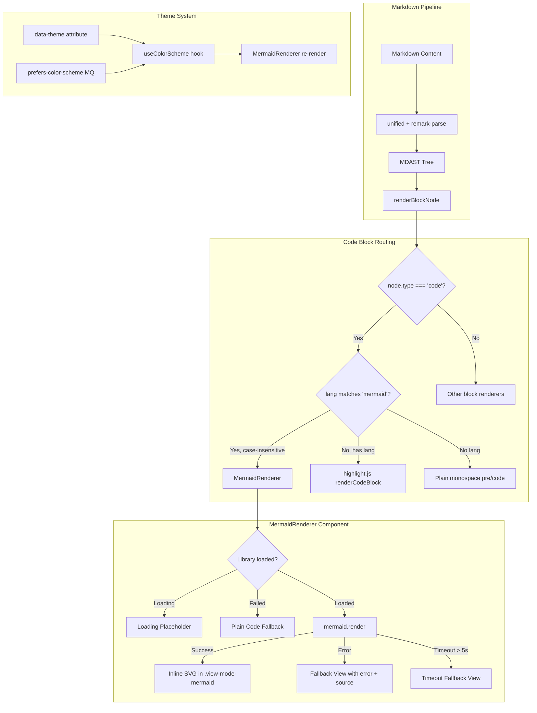

# Technical Design: Mermaid Rendering

## Overview

This design describes the implementation of native Mermaid diagram rendering within the Slatebase ViewMode component. The feature intercepts fenced code blocks with the `mermaid` language tag and renders them as interactive SVG diagrams instead of applying syntax highlighting via highlight.js.

The implementation follows a lazy-loading pattern with a dedicated `MermaidRenderer` React component that wraps the `mermaid.js` library. It integrates seamlessly with the existing markdown rendering pipeline (unified + remark-parse), the design token system, and the dark/light mode switching mechanism.

**Key Design Decisions:**
1. **Component-level integration** — The `renderCodeBlock` function in ViewMode.tsx is extended with a mermaid detection branch, delegating to a new `MermaidRenderer` component.
2. **Dynamic import** — The mermaid library (~300KB) is loaded on-demand via `import()` to avoid bloating the initial bundle.
3. **Per-instance rendering** — Each `MermaidRenderer` instance manages its own render lifecycle (loading → rendering → success/error), ensuring isolation between diagrams.
4. **Theme reactivity** — A `useColorScheme` hook observes `data-theme` attribute mutations and `prefers-color-scheme` media query changes to trigger re-renders.

## Architecture



## Components and Interfaces

### 1. `MermaidRenderer` Component

**File:** `frontend/src/components/MermaidRenderer.tsx`

The primary React component responsible for rendering a single Mermaid diagram.

```typescript
export interface MermaidRendererProps {
  /** The raw mermaid diagram definition text */
  definition: string
  /** Unique key for this diagram instance (used for mermaid ID generation) */
  diagramKey: string
}

export function MermaidRenderer({ definition, diagramKey }: MermaidRendererProps): ReactNode
```

**Internal State Machine:**
- `idle` → Component mounted, library not yet requested
- `loading` → Dynamic import in progress
- `ready` → Library loaded, rendering SVG
- `success` → SVG rendered successfully
- `error` → Mermaid threw a rendering error
- `timeout` → Rendering exceeded 5-second timeout
- `init-failed` → Dynamic import or mermaid.initialize() failed

**Responsibilities:**
- Triggers lazy loading of the mermaid library via the shared loader
- Generates a unique DOM ID for each render call (`mermaid-${diagramKey}-${counter}`)
- Calls `mermaid.render(id, definition)` with a 5-second timeout
- Renders the resulting SVG inline using `dangerouslySetInnerHTML`
- Catches rendering errors and displays the fallback view
- Re-renders when the color scheme changes (via `useColorScheme`)

### 2. `useMermaidLoader` Hook

**File:** `frontend/src/components/MermaidRenderer.tsx` (co-located)

A shared singleton hook that manages the one-time dynamic import and initialization of the mermaid library.

```typescript
interface MermaidLoaderState {
  status: 'idle' | 'loading' | 'ready' | 'error'
  mermaid: typeof import('mermaid') | null
  error: Error | null
}

function useMermaidLoader(): MermaidLoaderState
```

**Design Rationale:** Using a module-level singleton promise ensures the mermaid library is loaded exactly once, regardless of how many `MermaidRenderer` instances exist on the page. The hook subscribes components to the loading state.

### 3. `useColorScheme` Hook

**File:** `frontend/src/hooks/useColorScheme.ts`

Observes the current color scheme and triggers re-renders on changes.

```typescript
type ColorScheme = 'light' | 'dark'

function useColorScheme(): ColorScheme
```

**Implementation:**
- Reads the initial value from `document.documentElement.getAttribute('data-theme')`
- Sets up a `MutationObserver` on `<html>` to watch for `data-theme` attribute changes
- Additionally listens to `window.matchMedia('(prefers-color-scheme: dark)')` change events
- Returns `'dark'` if `data-theme="dark"` OR (no explicit data-theme AND system prefers dark)
- Returns `'light'` otherwise

### 4. Modified `renderCodeBlock` Function

**File:** `frontend/src/components/ViewMode.tsx` (modified)

The existing `renderCodeBlock` function gains a mermaid detection branch:

```typescript
function renderCodeBlock(code: string, lang: string | null | undefined, key: string): ReactNode {
  // NEW: Mermaid detection (case-insensitive)
  if (lang && lang.toLowerCase() === 'mermaid') {
    return createElement(MermaidRenderer, { definition: code, diagramKey: key })
  }

  // EXISTING: highlight.js path (unchanged)
  let highlighted: string | null = null
  if (lang) {
    try {
      const result = hljs.highlight(code, { language: lang, ignoreIllegals: true })
      highlighted = result.value
    } catch {
      highlighted = null
    }
  }
  // ... rest unchanged
}
```

### 5. CSS Styles

**File:** `frontend/src/App.css` (appended)

```css
/* ===== Mermaid Diagram Rendering ===== */
.view-mode-mermaid {
  display: block;
  margin: 1.5em 0;
  padding: 16px;
  border: 1px solid var(--border-subtle);
  border-radius: var(--radius-md);
  background: var(--bg-surface);
  text-align: center;
  overflow: auto;
}

.view-mode-mermaid svg {
  max-width: 100%;
  height: auto;
}

.view-mode-mermaid--loading {
  display: flex;
  align-items: center;
  justify-content: center;
  min-height: 80px;
  color: var(--text-muted);
  font-style: italic;
}

.view-mode-mermaid--error {
  border-color: var(--danger-border);
  background: var(--danger-bg);
  text-align: left;
}

.view-mode-mermaid--error .mermaid-error {
  color: var(--danger-text);
  font-size: 13px;
  margin-bottom: 8px;
  font-weight: 500;
}

.view-mode-mermaid--error pre {
  margin: 0;
  padding: 12px;
  background: var(--bg-surface);
  border: 1px solid var(--border-subtle);
  border-radius: var(--radius-sm);
  font-size: 13px;
  overflow: auto;
}

.view-mode-mermaid--error pre code {
  font-family: var(--font-mono);
}
```

## Data Models

### Mermaid Configuration Object

```typescript
interface MermaidConfig {
  securityLevel: 'strict'
  theme: 'default' | 'dark'
  startOnLoad: false
  // Suppress mermaid's own error rendering — we handle errors ourselves
  suppressErrorRendering: true
}
```

The configuration is rebuilt each time the color scheme changes:

```typescript
function buildMermaidConfig(colorScheme: ColorScheme): MermaidConfig {
  return {
    securityLevel: 'strict',
    theme: colorScheme === 'dark' ? 'dark' : 'default',
    startOnLoad: false,
    suppressErrorRendering: true,
  }
}
```

### Diagram Render Result

```typescript
type DiagramRenderResult =
  | { status: 'success'; svg: string }
  | { status: 'error'; message: string }
  | { status: 'timeout'; message: string }
```

### Unique ID Generation

Each diagram instance gets a unique ID composed of:
- A module-level monotonically increasing counter
- The component's `diagramKey` prop (derived from the MDAST node's position in the tree)

```typescript
let idCounter = 0

function generateDiagramId(diagramKey: string): string {
  return `mermaid-diagram-${diagramKey}-${idCounter++}`
}
```

This ensures no collisions even when multiple documents are rendered or when the same document re-renders.

## Correctness Properties

*A property is a characteristic or behavior that should hold true across all valid executions of a system — essentially, a formal statement about what the system should do. Properties serve as the bridge between human-readable specifications and machine-verifiable correctness guarantees.*

### Property 1: Code Block Routing

*For any* code block with a language tag, if the tag equals "mermaid" (case-insensitive comparison), the rendered output SHALL be a MermaidRenderer component (container with class `view-mode-mermaid`); otherwise, for non-mermaid language tags, the rendered output SHALL be a highlight.js code block (container with class `view-mode-code`).

**Validates: Requirements 1.1, 1.2, 1.4**

### Property 2: Inline SVG Rendering with Correct Container

*For any* valid diagram definition that mermaid successfully renders, the output SHALL be an inline SVG element (not an `` tag) wrapped in a container element with CSS class `view-mode-mermaid`.

**Validates: Requirements 2.3, 7.1**

### Property 3: Unique Diagram IDs

*For any* set of N mermaid diagram definitions rendered on the same page (where N >= 2), all N diagram IDs passed to `mermaid.render()` SHALL be distinct strings.

**Validates: Requirements 2.4**

### Property 4: Error Fallback Completeness

*For any* invalid diagram definition that causes the mermaid library to throw a rendering error, the fallback view SHALL contain both the error message string from the library AND the complete raw source text of the diagram definition in a `<pre><code>` block.

**Validates: Requirements 4.1, 4.2, 4.3**

### Property 5: Error Isolation

*For any* markdown document containing N mermaid code blocks (N >= 2), if exactly one block contains an invalid definition that causes a rendering error, the remaining N-1 valid blocks SHALL still render as successful SVG diagrams, and all non-mermaid content in the document SHALL be unaffected.

**Validates: Requirements 4.5**

### Property 6: Conditional Library Loading

*For any* markdown document, the mermaid library dynamic import SHALL be triggered if and only if the document contains at least one code block with a mermaid language tag (case-insensitive). Documents without mermaid blocks SHALL NOT trigger the import.

**Validates: Requirements 5.3**

### Property 7: Directive Tolerance

*For any* diagram definition containing directives (both valid mermaid directives and unknown/unsupported directives), the renderer SHALL not crash. Valid directives SHALL be respected in the rendered output, and unknown directives SHALL be silently ignored while the diagram renders without them.

**Validates: Requirements 6.2, 6.3**

## Error Handling

### Error Categories and Responses

| Error Category | Trigger | User-Visible Response | Technical Handling |
|---|---|---|---|
| **Render Error** | Invalid mermaid syntax | Error message + raw source in red-bordered container | `try/catch` around `mermaid.render()`, display `Fallback_View` |
| **Timeout Error** | Rendering exceeds 5 seconds | "Diagramm-Rendering-Timeout" + raw source | `Promise.race` with a 5-second `setTimeout`, abort via mermaid API or ignore stale result |
| **Init Failure** | Dynamic import fails or `mermaid.initialize()` throws | All mermaid blocks render as plain code blocks | Singleton loader catches error, all subscribers receive `init-failed` state |
| **Library Load Error** | Network error during chunk fetch | Plain code block fallback | `import()` rejection caught, state set to `init-failed` |

### Error Isolation Strategy

Each `MermaidRenderer` instance is an independent React component with its own error boundary behavior:
- Errors in `mermaid.render()` are caught per-instance via try/catch
- A failing render sets only that instance's state to `error`
- Other instances continue their own render lifecycle independently
- The parent ViewMode component is never affected by mermaid errors

### Timeout Implementation

```typescript
async function renderWithTimeout(
  mermaid: MermaidAPI,
  id: string,
  definition: string,
  timeoutMs: number = 5000
): Promise<DiagramRenderResult> {
  const renderPromise = mermaid.render(id, definition)
  const timeoutPromise = new Promise<never>((_, reject) =>
    setTimeout(() => reject(new Error('Timeout')), timeoutMs)
  )

  try {
    const { svg } = await Promise.race([renderPromise, timeoutPromise])
    return { status: 'success', svg }
  } catch (err) {
    if (err instanceof Error && err.message === 'Timeout') {
      return { status: 'timeout', message: 'Diagramm-Rendering-Timeout (> 5s)' }
    }
    return { status: 'error', message: err instanceof Error ? err.message : String(err) }
  }
}
```

## Testing Strategy

### Unit Tests (Example-Based)

| Test Case | What It Verifies |
|---|---|
| Renders loading placeholder while library loads | Req 5.2 — "Diagramm wird geladen..." text visible |
| Falls back to plain code when init fails | Req 4.4 — graceful degradation |
| Applies `theme: 'default'` in light mode | Req 3.1 |
| Applies `theme: 'dark'` in dark mode | Req 3.2 |
| Re-renders on theme change | Req 3.3 |
| Timeout triggers fallback after 5s | Req 5.5 |
| Renders responsive SVG (max-width 100%) | Req 2.5 |
| Uses `securityLevel: 'strict'` | Req 8.1 |
| Supports all listed diagram types | Req 2.2 (one example per type) |
| Renders inline SVG with overflow: auto | Req 7.6 |

### Property-Based Tests (fast-check)

The project already uses `fast-check` (version ^3.23.2) in devDependencies. Property tests will use vitest + fast-check with a minimum of 100 iterations each.

**Test File:** `frontend/src/components/MermaidRenderer.pbt.test.tsx`

| Property | Test Description | Tag |
|---|---|---|
| Property 1 | Generate random code blocks with random lang tags (including mermaid variants). Verify routing correctness. | `Feature: mermaid-rendering, Property 1: Code Block Routing` |
| Property 2 | Generate random valid SVG strings as mock mermaid output. Verify inline rendering in correct container. | `Feature: mermaid-rendering, Property 2: Inline SVG Rendering` |
| Property 3 | Generate 2-20 diagram definitions. Render all, collect IDs, verify uniqueness. | `Feature: mermaid-rendering, Property 3: Unique Diagram IDs` |
| Property 4 | Generate random error messages and diagram sources. Mock mermaid to throw. Verify both appear in fallback. | `Feature: mermaid-rendering, Property 4: Error Fallback Completeness` |
| Property 5 | Generate N diagrams (2-10), make one invalid. Verify others render and document is intact. | `Feature: mermaid-rendering, Property 5: Error Isolation` |
| Property 6 | Generate random markdown with/without mermaid blocks. Verify import is called iff mermaid blocks exist. | `Feature: mermaid-rendering, Property 6: Conditional Library Loading` |
| Property 7 | Generate diagrams with random directive strings. Verify no crash and graceful handling. | `Feature: mermaid-rendering, Property 7: Directive Tolerance` |

**Configuration:**
- Each property test runs a minimum of 100 iterations
- Each test is tagged with a comment referencing its design property
- Format: `// Feature: mermaid-rendering, Property {N}: {title}`

### Integration Tests

- Render a full markdown document with mixed content (headings, text, multiple mermaid diagrams, code blocks) and verify the complete output
- Test the actual mermaid library (not mocked) with representative diagrams of each supported type
- Verify dark/light mode switching with actual DOM attribute changes
