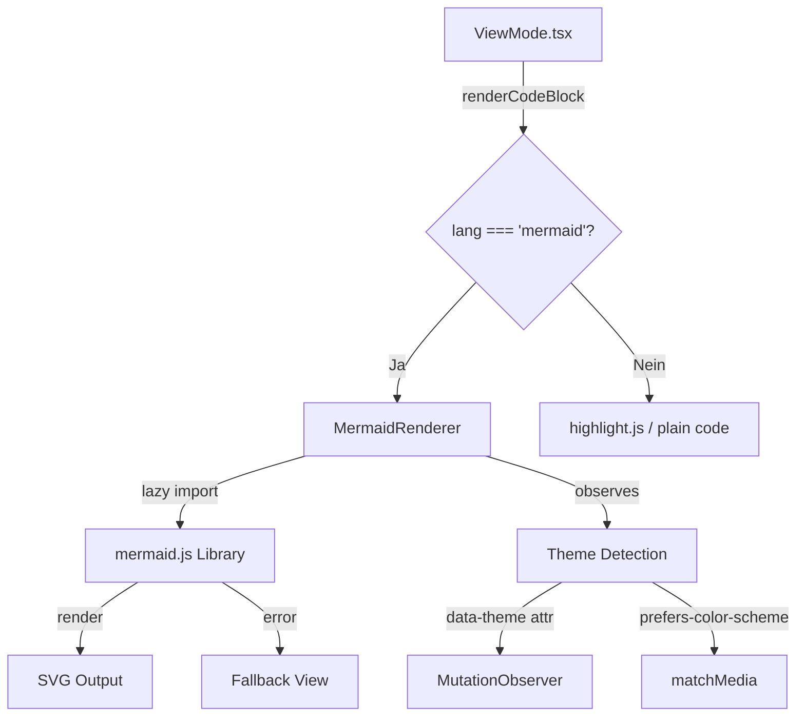
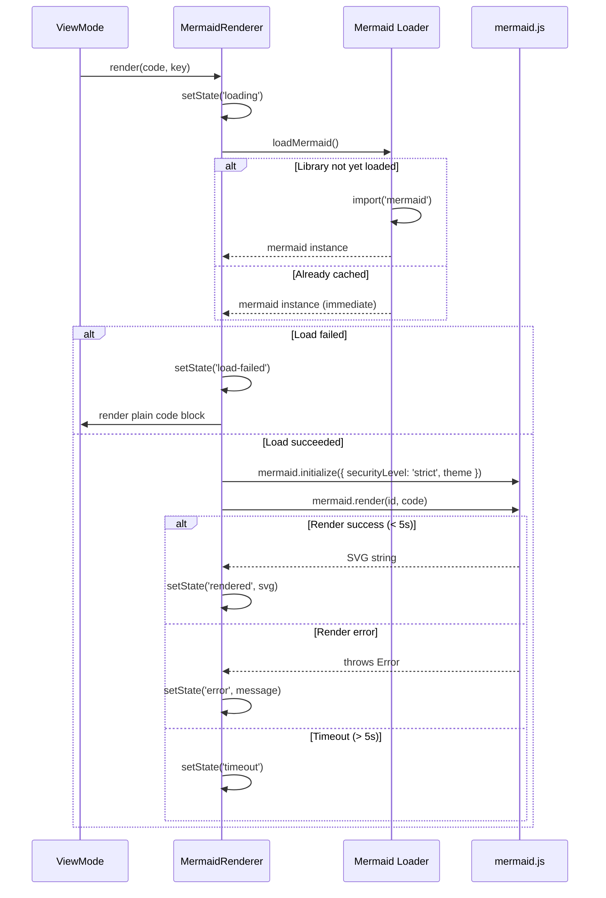

# Design Document: Mermaid Rendering

## Overview

Dieses Design beschreibt die Integration von nativem Mermaid-Diagramm-Rendering in die ViewMode-Komponente des Slatebase-Frontends. Anstatt `highlight.js`-Syntax-Highlighting auf ` ```mermaid `-Fenced-Code-Blöcke anzuwenden, werden diese als SVG-Diagramme mittels der `mermaid.js`-Bibliothek gerendert.

Das Feature ist rein Frontend-seitig und erfordert keine Backend-Änderungen. Die Integration erfolgt im bestehenden `renderCodeBlock()`-Pfad der ViewMode-Komponente. Die Mermaid-Bibliothek (~1MB) wird per Code-Splitting (dynamischer `import()`) nur bei Bedarf geladen.

**Kernanforderungen:**
- Automatische Erkennung von Mermaid-Code-Blöcken (case-insensitiv)
- SVG-Inline-Rendering aller gängigen Diagrammtypen
- Dark/Light Mode Unterstützung mit automatischem Re-Rendering bei Theme-Wechsel
- Fehlertoleranz: fehlerhafte Blöcke zeigen Fehlermeldung + Quelltext, ohne andere Blöcke zu beeinträchtigen
- Lazy Loading mit Lade-Indikator und 5-Sekunden-Timeout
- Security: `securityLevel: 'strict'`

## Architecture



### Entscheidungen

1. **Kein eigenes React-Wrapper-Paket** — Direkte Nutzung der `mermaid`-API (`mermaid.render()`) in einer eigenen React-Komponente, da existierende React-Wrapper entweder veraltet sind oder unnötige Abstraktion hinzufügen.

2. **Module-Level Singleton für Mermaid-Instanz** — Die Mermaid-Library wird einmal per `import()` geladen und als Module-Level-Promise gecached. Alle `MermaidRenderer`-Instanzen teilen sich dieselbe geladene Instanz.

3. **MutationObserver für Theme-Wechsel** — Statt Props/Context für den Theme-Wechsel zu verwenden, beobachtet die Komponente das `data-theme`-Attribut auf `document.documentElement` direkt. Das ist konsistent mit dem bestehenden Theme-System und erfordert keine Änderungen am State-Management.

4. **AbortController-basierter Timeout** — Ein 5-Sekunden-Timeout wird über `Promise.race` mit einem `setTimeout` implementiert, um lang laufende Renders abzubrechen.

5. **Inline SVG via `dangerouslySetInnerHTML`** — Mermaid produziert sanitized SVG (bei `securityLevel: 'strict'`). Inline-Rendering ermöglicht CSS-Styling und Theme-Integration.

## Components and Interfaces

### Neue Dateien

```
frontend/src/components/
├── MermaidRenderer.tsx        — React-Komponente für Mermaid-Diagramm-Rendering
└── MermaidRenderer.test.tsx   — Co-located Tests
```

### MermaidRenderer-Komponente

```typescript
/**
 * Props for the MermaidRenderer component.
 */
export interface MermaidRendererProps {
  /** The raw Mermaid diagram definition (content of the fenced code block) */
  code: string
  /** Unique key for React reconciliation */
  diagramKey: string
}
```

**Internes State-Management:**

```typescript
type MermaidState =
  | { status: 'loading' }
  | { status: 'rendered'; svg: string }
  | { status: 'error'; message: string }
  | { status: 'timeout' }
  | { status: 'load-failed' }
```

### Module-Level Mermaid Loader

```typescript
/**
 * Lazily loads and caches the mermaid library.
 * Returns the mermaid instance or null on load failure.
 * The promise is cached — subsequent calls return the same promise.
 */
export function loadMermaid(): Promise<typeof import('mermaid')['default'] | null>
```

### Theme Detection Utility

```typescript
/**
 * Determines the current effective color scheme.
 * Checks data-theme attribute first, falls back to prefers-color-scheme media query.
 * Returns 'dark' or 'light'.
 */
export function getEffectiveTheme(): 'dark' | 'light'

/**
 * Maps the effective theme to a Mermaid theme name.
 */
export function getMermaidTheme(effectiveTheme: 'dark' | 'light'): 'default' | 'dark'
```

### Unique ID Generator

```typescript
/**
 * Generates a unique ID for each Mermaid diagram render call.
 * Uses a monotonically increasing counter to guarantee uniqueness within a page session.
 */
export function generateDiagramId(): string
```

### Integration in ViewMode

Die bestehende `renderCodeBlock`-Funktion wird erweitert:

```typescript
function renderCodeBlock(code: string, lang: string | null | undefined, key: string): ReactNode {
  // NEW: Route mermaid blocks to MermaidRenderer
  if (lang && lang.toLowerCase() === 'mermaid') {
    return createElement(MermaidRenderer, { code, diagramKey: key, key })
  }

  // Existing highlight.js logic unchanged...
}
```

### Komponentenlebenszyklus



## Data Models

### State Types

```typescript
/** Internal rendering state of a single MermaidRenderer instance */
type RenderState =
  | { status: 'loading' }
  | { status: 'rendered'; svg: string }
  | { status: 'error'; message: string }
  | { status: 'timeout' }
  | { status: 'load-failed' }
```

### Mermaid Configuration

```typescript
/** Configuration passed to mermaid.initialize() */
interface MermaidConfig {
  securityLevel: 'strict'
  theme: 'default' | 'dark'
  startOnLoad: false
  suppressErrors: true
}
```

### Constants

```typescript
/** Timeout in milliseconds for a single diagram render */
const RENDER_TIMEOUT_MS = 5000

/** Prefix for generated diagram IDs */
const DIAGRAM_ID_PREFIX = 'mermaid-diagram-'
```

## Correctness Properties

*A property is a characteristic or behavior that should hold true across all valid executions of a system — essentially, a formal statement about what the system should do. Properties serve as the bridge between human-readable specifications and machine-verifiable correctness guarantees.*

### Property 1: Code block routing correctness

*For any* code block with a language tag, if that tag equals "mermaid" (case-insensitive comparison), the rendered output SHALL contain a MermaidRenderer container (class `view-mode-mermaid`) and SHALL NOT contain an hljs-highlighted code element. Conversely, for any code block with a language tag that is NOT "mermaid" (case-insensitive), the output SHALL contain hljs-highlighted code and SHALL NOT contain a MermaidRenderer container.

**Validates: Requirements 1.1, 1.2, 1.4**

### Property 2: Valid diagram inline SVG rendering

*For any* valid Mermaid diagram definition that mermaid.render() successfully processes, the rendered output SHALL contain the SVG string inserted inline within a container element having the CSS class `view-mode-mermaid`. The SVG SHALL NOT be wrapped in an `` tag or fetched externally.

**Validates: Requirements 2.3, 7.1**

### Property 3: Unique diagram IDs

*For any* set of N Mermaid code blocks rendered on the same page (N >= 1), all generated diagram IDs passed to mermaid.render() SHALL be distinct from each other.

**Validates: Requirements 2.4**

### Property 4: Error fallback rendering

*For any* Mermaid diagram definition that causes mermaid.render() to throw an error, the rendered output SHALL contain: (a) a container with CSS class `mermaid-error`, (b) the error message text from the thrown error, and (c) a `<pre><code>` block containing the original raw source code of the diagram definition.

**Validates: Requirements 4.1, 4.2, 4.3**

### Property 5: Error isolation

*For any* set of N Mermaid diagram definitions where exactly one definition is invalid (causes a render error), the remaining N-1 valid diagrams SHALL render successfully as SVGs, unaffected by the single error.

**Validates: Requirements 4.5**

### Property 6: Directive pass-through

*For any* Mermaid diagram definition containing Mermaid directives (e.g., `%%{init: {...}}%%`), the full text including directives SHALL be passed unmodified to mermaid.render() without stripping or preprocessing.

**Validates: Requirements 6.2**

## Error Handling

### Fehlerkategorien

| Kategorie | Ursache | Verhalten |
|-----------|---------|-----------|
| **Library Load Failure** | Netzwerkfehler, korruptes Bundle, import() rejected | Alle Mermaid-Blöcke als plain Code-Blöcke rendern (identisch zu unbekannter Sprache) |
| **Render Error** | Ungültige Syntax, nicht unterstützter Diagrammtyp | Fehlermeldung + roher Quelltext in Fallback-View (mermaid-error Container) |
| **Render Timeout** | Diagramm zu komplex, Endlosschleife | Timeout-Meldung ("Diagramm-Rendering abgebrochen (Timeout)") + roher Quelltext |
| **Re-Render Error** | Fehler bei Theme-Wechsel-Re-Rendering | Letzten erfolgreichen SVG beibehalten, Fehler in Console loggen |

### Fehler-Isolation

Jede `MermaidRenderer`-Instanz verwaltet ihren eigenen State. Ein Fehler in einem Diagramm propagiert nicht zu anderen Instanzen. Die Error-Boundary ist die Komponente selbst (try/catch um `mermaid.render()`).

### Timeout-Implementierung

```typescript
async function renderWithTimeout(id: string, code: string): Promise<{ svg: string }> {
  const renderPromise = mermaid.render(id, code)
  const timeoutPromise = new Promise<never>((_, reject) =>
    setTimeout(() => reject(new Error('TIMEOUT')), RENDER_TIMEOUT_MS)
  )
  return Promise.race([renderPromise, timeoutPromise])
}
```

## Testing Strategy

### Unit Tests (Vitest + Testing Library)

**MermaidRenderer.test.tsx:**
- Loading state: zeigt Lade-Indikator während import() pending
- Successful render: zeigt SVG inline nach erfolgreicher Verarbeitung
- Error state: zeigt Fehlermeldung + Quelltext bei ungültiger Syntax
- Timeout state: zeigt Timeout-Meldung nach 5s
- Load failure: zeigt plain Code-Block wenn import() fehlschlägt
- Theme detection: korrekte Theme-Zuordnung (light → default, dark → dark)
- Re-render on theme change: MutationObserver triggert neues Rendering
- Multiple diagrams: einzigartige IDs
- Error isolation: ein fehlerhafter Block beeinflusst andere nicht
- Directives: werden unverändert an mermaid.render() durchgereicht

**ViewMode Integration (existierende Datei erweitern):**
- Mermaid-Tag routing: `lang="mermaid"` → MermaidRenderer
- Case-insensitive: `MERMAID`, `Mermaid` → MermaidRenderer
- Non-mermaid tags: unverändert durch hljs
- No-tag blocks: unverändert als plain monospace

### Property-Based Tests (fast-check)

Die Bibliothek `fast-check` (bereits in devDependencies) wird für Property-Based Tests verwendet. Minimum 100 Iterationen pro Property-Test.

**Property-Test-Konfiguration:**
- Framework: fast-check 3.x (bereits installiert)
- Minimum Iterationen: 100
- Tag-Format: `Feature: mermaid-rendering, Property {N}: {title}`

**Zu testende Properties:**
1. Routing correctness — generiere zufällige Strings, prüfe ob case-insensitive "mermaid" korrekt erkannt wird
2. Unique IDs — generiere N Aufrufe von `generateDiagramId()`, prüfe Uniqueness
3. Error fallback structure — generiere zufällige Error-Messages, prüfe DOM-Struktur
4. Directive pass-through — generiere Definitionen mit Direktiven, prüfe dass sie unverändert weitergegeben werden

### Mocking-Strategie

Die `mermaid`-Library wird in Tests gemockt:

```typescript
vi.mock('mermaid', () => ({
  default: {
    initialize: vi.fn(),
    render: vi.fn(),
  },
}))
```

Für Integration-Tests kann die echte Library mit kleinen Diagrammen verwendet werden.

### CSS-Tests

CSS-Korrektheit wird über Snapshot-Tests und manuelle Inspektion validiert:
- `.view-mode-mermaid` Container-Styles
- `.mermaid-error` Fehler-Styles
- `.mermaid-loading` Lade-Styles
- Dark-Mode-Varianten (automatisch über Token-System)
