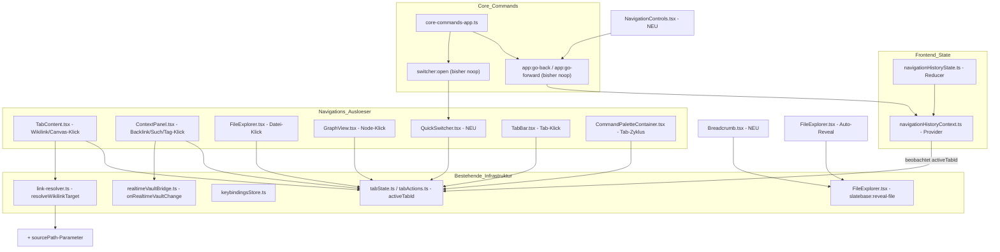

# Design Document: Navigation & Verknüpfungs-Politur

## Overview

Diese Spec verdrahtet drei bestehende No-Op-Befehle (`app:go-back`, `app:go-forward`, `switcher:open` — siehe `frontend/src/plugins/compat/core-commands-app.ts:330-331,396`) mit echtem Verhalten, hinterlegt Standard-Tastenkombinationen für einen bereits funktionierenden, aber ungebundenen Befehl (`workspace:next-tab`/`previous-tab`), schließt eine Aktualisierungslücke im bestehenden Backlinks-Feature und macht die Wikilink-Auflösung bei mehrdeutigen Dateinamen deterministisch nachvollziehbar. Es entsteht **keine** neue Kernarchitektur — alle Änderungen docken an bestehende Provider, Reducer und Event-Busse an.

**Kernentscheidungen:**
- Neuer, eigenständiger `navigationHistoryReducer` + `NavigationHistoryProvider` (Session-only, kein localStorage — Browser-Verlauf-Semantik, kein Bedarf für Cross-Session-Persistenz)
- **Zentrale Aufzeichnung statt verteilter Aufrufe**: `NavigationHistoryProvider` beobachtet `tabState.activeTabId` direkt und zeichnet jede Änderung als Besuch auf — unabhängig davon, was sie ausgelöst hat (Link-Klick, Backlink, Suchergebnis, Datei-Explorer, Graph-Node, Schnellwechsler, Tab-Klick/-Zyklus). Das ist robuster als das ursprünglich erwogene Modell mit einem `navigateToFile()`-Helper, der an sieben Aufrufstellen einzeln eingebaut werden müsste (leicht zu vergessen, schwer vollständig zu testen) — jede Tab-Aktivierung läuft ohnehin durch `tabState.activeTabId`, also reicht ein einzelner Beobachtungspunkt. `GO_BACK`/`GO_FORWARD` unterdrücken die automatische Aufzeichnung ihrer eigenen Tab-Aktivierung über ein Ref-Flag (`suppressNextRef`), das nur gesetzt wird, wenn sich die Ziel-Tab-ID tatsächlich von der aktuellen unterscheidet — sonst würde eine Navigation zum bereits aktiven Tab (kein `activeTabId`-Wechsel, kein Effekt-Trigger) das Flag fälschlich für den nächsten echten Besuch stehen lassen
- Schnellwechsler (`QuickSwitcher.tsx`) als Geschwister-Komponente von `CommandPalette.tsx` mit identischem Interaktionsmuster (Overlay, Tastaturnavigation, `useFocusTrap`), neue leichte Fuzzy-Match-Utility statt Substring-Filter
- Live-Backlinks nutzen den bereits vorhandenen `realtimeVaultBridge.ts`-Event-Bus (`onRealtimeVaultChange`) — kein neuer SSE-Kanal
- Mehrdeutige Link-Auflösung erweitert `resolveWikilinkTarget()` um einen optionalen `sourcePath`-Parameter, rückwärtskompatibel für alle Aufrufer, die ihn nicht übergeben
- Neue Tastenkombinationen werden ausschließlich über den bestehenden, benutzer-überschreibbaren `keybindingsStore.ts` registriert — keine hartkodierten `addEventListener('keydown', …)`-Sonderfälle

## Architecture



### Integration in bestehende Architektur

`NavigationHistoryProvider` sitzt innerhalb von `TabProvider` (braucht `tabDispatch`/`tabState` zum Öffnen/Aktivieren von Tabs) und außerhalb von `CommandPaletteContainer` (das `registerCoreAppCommands` aufruft und `CoreAppCommandHandlers` mit dem neuen `navHistory`-Feld füttert):

```
AuthProvider → I18nBridge → I18nProvider → AuthGuard → AppProvider → TabProvider → NavigationHistoryProvider → ChatProvider → SyncProvider → ContextPanelProvider → AppContent
```

`QuickSwitcher` wird analog zu `CommandPalette` in `AppContent`/`CommandPaletteContainer` gemountet und über denselben `coreHandlersRef`-Mechanismus mit einem `onOpenQuickSwitcher`-Callback verdrahtet, den `switcher:open` künftig aufruft statt `noop`.

## Components and Interfaces

### State Layer: Navigationsverlauf

```typescript
// frontend/src/state/navigationHistoryState.ts

/** A single navigable location: a file within a vault, optionally scrolled to an anchor. */
export interface NavHistoryEntry {
  vaultId: string
  filePath: string
  /** Heading/block anchor, if navigation was triggered from a specific location. */
  anchor?: string
}

export interface NavigationHistoryState {
  back: NavHistoryEntry[]
  forward: NavHistoryEntry[]
  /** The entry the user is currently viewing — needed to push onto `forward` when going back. */
  current: NavHistoryEntry | null
}

export type NavigationHistoryAction =
  /** Record a new location. Truncates `forward`. No-op if origin is 'history-nav'. */
  | { type: 'RECORD_VISIT'; entry: NavHistoryEntry; origin: 'link' | 'explorer' | 'search' | 'switcher' | 'backlink' | 'tab-cycle' | 'history-nav' }
  | { type: 'GO_BACK' }
  | { type: 'GO_FORWARD' }
  | { type: 'DROP_ENTRY'; vaultId: string; filePath: string } // file deleted while referenced
  | { type: 'CLEAR' } // vault switch

const MAX_STACK_SIZE = 50
```

`navigationHistoryReducer` implementiert `RECORD_VISIT` (push `current` onto `back`, clear `forward`, set new `current`, clamp to `MAX_STACK_SIZE`), `GO_BACK`/`GO_FORWARD` (pop/move between stacks, update `current`), `DROP_ENTRY` (filter matching entries out of both stacks — Requirement 1.8), `CLEAR` (Requirement 1.12, Vault-Wechsel).

```typescript
// frontend/src/state/navigationHistoryContext.ts

export interface NavigationHistoryContextValue {
  state: NavigationHistoryState
  /** The single entry point every navigation trigger calls through. */
  navigateToFile: (entry: NavHistoryEntry, origin: NavigationHistoryAction['origin']) => void
  goBack: () => void
  goForward: () => void
  canGoBack: boolean
  canGoForward: boolean
}

export function useNavigationHistory(): NavigationHistoryContextValue
```

Kein bestehender Aufrufer (Wikilink-Klick in `TabContent.tsx`, Backlink-/Such-/Tag-Klick in `context-panel/ContextPanel.tsx`, Datei-Klick in `FileExplorer.tsx`, Node-Klick in `GraphView.tsx`, Tab-Klick in `TabBar.tsx`) muss geändert werden — sie alle laufen bereits durch `openTab()`/`tabDispatch({type:'ACTIVATE_TAB'})`, was `tabState.activeTabId` ändert und damit den zentralen Beobachtungs-Effekt auslöst. `goBack()`/`goForward()` rufen intern denselben `openTab()`-Pfad auf, setzen aber vorher `suppressNextRef`, damit der Effekt diese Aktivierung nicht erneut als `RECORD_VISIT` aufzeichnet (Requirement 1.1, Ausnahmeklausel).

### Neue Komponente: NavigationControls

```typescript
// frontend/src/components/NavigationControls.tsx
interface NavigationControlsProps {
  canGoBack: boolean
  canGoForward: boolean
  onGoBack: () => void
  onGoForward: () => void
}
```

Zwei Icon-Buttons (`ChevronLeft`/`ChevronRight` aus lucide-react, konsistent mit dem restlichen Icon-Set), gerendert links neben der `TabBar` in `App.tsx`. `disabled`-Attribut direkt aus `canGoBack`/`canGoForward`. `aria-label="Zurück"`/`"Vor"`.

### Neue Komponente: QuickSwitcher

```typescript
// frontend/src/components/QuickSwitcher.tsx
export interface QuickSwitcherProps {
  isOpen: boolean
  onClose: () => void
  directoryTree: DirectoryTree | null
  recentFiles: NavHistoryEntry[] // aus navigationHistoryState, back-Stack + current
  onSelectFile: (filePath: string) => void
  onCreateFile: (fileName: string) => void
}
```

Struktur, Fokus-Trap und Tastaturbehandlung sind wörtlich vom bestehenden `CommandPalette.tsx` übernommen (gleicher `useFocusTrap`-Hook, gleiches `ArrowUp`/`ArrowDown`/`Enter`/`Escape`-Muster, gleiches `role="dialog"`/`role="listbox"`-Markup). Der Unterschied liegt in der Datenquelle (`collectFilesSorted(directoryTree)` aus `link-resolver.ts` statt der Command-Registry) und im Filter (`fuzzyMatch()` statt reinem Substring-Test).

```typescript
// frontend/src/utils/fuzzyMatch.ts

/**
 * Subsequence-based fuzzy match, case-insensitive. Returns null if `query`'s
 * characters don't all appear in `text` in order; otherwise a score where
 * lower is better (rewards consecutive matches and early match position).
 */
export function fuzzyMatch(query: string, text: string): number | null
```

### Erweiterung: CoreAppCommandHandlers

```typescript
// frontend/src/plugins/compat/core-commands-app.ts (Erweiterung des bestehenden Interfaces)
export interface CoreAppCommandHandlers {
  // ...bestehende Felder unverändert...
  navHistory: { canGoBack: boolean; canGoForward: boolean }
  onNavigateBack: () => void
  onNavigateForward: () => void
  onOpenQuickSwitcher: () => void
}
```

`app:go-back`/`app:go-forward` rufen künftig `h.onNavigateBack()`/`h.onNavigateForward()` statt `noop` auf; `switcher:open` ruft `h.onOpenQuickSwitcher()` auf. Kein Verhaltensunterschied für Plugins, die diese Befehle bereits über `executeCommandById()` aufrufen (siehe `PLUGIN-COMPAT.md` — „Commands ohne Slatebase-Entsprechung existieren als expliziter No-Op" gilt für diese drei künftig nicht mehr).

### Live-Backlinks: Erweiterung von ContextPanel

`ContextPanel.tsx` erhält einen dritten `useEffect` neben dem bestehenden Dokument-Wechsel-Effekt (Zeile 132) und dem Content-Debounce-Effekt (Zeile 158):

```typescript
// Neuer Effect in ContextPanel.tsx
useEffect(() => {
  if (documentPath === null || vaultId === null || !apiClient) return
  const unsubscribe = onRealtimeVaultChange((event) => {
    if (event.vaultId !== vaultId) return
    if (event.action !== 'saved' && event.action !== 'renamed' && event.action !== 'deleted') return
    scheduleBacklinksRefresh() // 1000ms debounce, cancelled on documentPath change / unmount
  })
  return unsubscribe
}, [documentPath, vaultId, apiClient])
```

Der Debounce-Timer wird beim Aufräumen des Effekts (Dokumentwechsel oder Unmount) verworfen — dieselbe Guard-Logik wie der bestehende Content-Debounce-Effekt (Requirement 5.5).

### Wikilink-Auflösung: sourcePath-Parameter

```typescript
// frontend/src/plugins/link-resolver.ts (Erweiterung)
export function resolveWikilinkTarget(
  target: string,
  tree: DirectoryTree | null,
  sourcePath?: string,
): string | null

/** Among files matching by name, pick per Requirement 6.1–6.3. Exported for the disambiguation tooltip (6.6). */
export function resolveAmbiguousMatch(
  candidates: Array<{ name: string; path: string }>,
  sourcePath?: string,
): { resolved: { name: string; path: string }; alternativeCount: number }
```

Bisheriges Verhalten (`files.find(...)` — erster Treffer in alphabetischer, tiefen-first Reihenfolge) wird durch Sammeln **aller** exakten Namenstreffer und anschließende Anwendung von `resolveAmbiguousMatch()` ersetzt. Bei genau einem Treffer verhält sich die Funktion identisch zu heute (Requirement 6.7). Aufrufer, die `sourcePath` nicht kennen (z. B. Batch-Verarbeitung ohne Dokumentkontext), lassen den Parameter weg und erhalten weiterhin den kürzesten-Pfad/alphabetisch-Tie-Break ohne Ordner-Präferenz.

### Breadcrumb

```typescript
// frontend/src/components/Breadcrumb.tsx
interface BreadcrumbProps {
  vaultName: string
  filePath: string | null // null wenn kein Datei-Tab aktiv
  onSegmentClick: (folderPath: string) => void // '' = Vault-Root
}
```

`onSegmentClick` generalisiert den bestehenden `slatebase:reveal-file`-Mechanismus: `FileExplorer.tsx`s Listener (Zeile 216) wird um ein optionales `detail.kind: 'file' | 'folder'` erweitert (Default `'file'`, rückwärtskompatibel für alle bestehenden Aufrufer). Bei `kind: 'folder'` klappt der Listener die Ordner-Ancestor-Kette auf, scrollt aber zum `.tree-node--folder`-Element des Ziel-Ordners selbst statt zu einem Datei-Blatt.

## Data Models

### Keybindings-Erweiterung

```typescript
// frontend/src/state/keybindingsStore.ts — neue Einträge in DEFAULT_KEYBINDINGS
{ commandId: 'slatebase:navigate-back', label: 'Zurück navigieren', defaultShortcut: 'Alt+Left', category: 'navigation' },
{ commandId: 'slatebase:navigate-forward', label: 'Vor navigieren', defaultShortcut: 'Alt+Right', category: 'navigation' },
{ commandId: 'slatebase:open-quick-switcher', label: 'Schnellwechsler öffnen', defaultShortcut: 'Mod+O', category: 'navigation' },
{ commandId: 'slatebase:next-tab', label: 'Nächster Tab', defaultShortcut: 'Ctrl+Tab', category: 'navigation' },
{ commandId: 'slatebase:previous-tab', label: 'Vorheriger Tab', defaultShortcut: 'Ctrl+Shift+Tab', category: 'navigation' },
```

Alle fünf sind kollisionsfrei mit den bestehenden Einträgen (`Mod+P`, `Ctrl+,`, `Mod+Shift+F`, `Mod+E`, `Mod+S`, `Mod+Z`, `Mod+Shift+Z`). `slatebase:next-tab`/`previous-tab` sind bewusst eigene `slatebase:*`-IDs im Keybindings-Store (Requirement 3), getrennt von den `workspace:*`-IDs der `ICommandRegistry` (Plugin-API-Namespace) — der Tastendruck wird aufgelöst und ruft anschließend `commandRegistry.executeCommand('workspace:next-tab')` auf, um die bestehende Wrap-Around-Logik aus `activateTabByOffset()` (`core-commands-app.ts:99-105`) nicht zu duplizieren.

**Korrektur während der Umsetzung**: Ursprünglich war dafür `useGlobalShortcuts.ts` vorgesehen (dort leben die übrigen globalen Shortcuts). Das scheitert jedoch, weil `commandRegistry` nur über `usePluginContext()` erreichbar ist und `<PluginProvider>` innerhalb von `AppContent`s eigenem JSX-Baum gemountet wird (nicht als Vorfahre von `AppContent`) — ein Hook-Aufruf am Anfang von `AppContent` kann ihn also nicht erreichen (bestätigt durch einen Absturz in `App.test.tsx`: „usePluginContext must be used within a PluginProvider"). Aus demselben Grund wie der Schnellwechsler-Shortcut (der ebenfalls `commandRegistry`-Zugriff braucht) lebt dieser Shortcut stattdessen in `CommandPaletteContainer.tsx`, das bereits innerhalb von `<PluginProvider>` sitzt.

### Einstellung: Auto-Reveal

```typescript
// frontend/src/state/settingsState.ts (Erweiterung, Kategorie 'vault')
interface VaultSettings {
  // ...bestehende Felder...
  explorerFollowActiveFile: boolean // default: false
}
```

Persistenz über den bestehenden `settingsPersistence.ts`-Mechanismus, identisch zu anderen Vault-Einstellungen.

## Correctness Properties

*A property is a characteristic or behavior that should hold true across all valid executions of a system.*

### Property 1: Zurück/Vor sind inverse Operationen

*Für jede* Sequenz aus `RECORD_VISIT`-Aktionen gefolgt von einem `GO_BACK`, stellt ein direkt anschließendes `GO_FORWARD` denselben `current`-Eintrag wieder her, der vor dem `GO_BACK` aktiv war.

**Validates: Requirements 1.2, 1.3**

### Property 2: Neue Navigation verwirft den Vor-Stack

*Für jeden* nicht-leeren `forward`-Stack, führt ein `RECORD_VISIT` mit `origin !== 'history-nav'` dazu, dass der resultierende `forward`-Stack leer ist.

**Validates: Requirement 1.6**

### Property 3: History-Navigation schreibt sich nicht selbst fort

*Für jeden* Zustand, führt `RECORD_VISIT` mit `origin: 'history-nav'` zu keiner Veränderung von `back` oder `forward` relativ zu dem Zustand, den `GO_BACK`/`GO_FORWARD` bereits hergestellt haben (kein doppelter Eintrag).

**Validates: Requirement 1.1 (Ausnahme-Klausel)**

### Property 4: Stack-Obergrenze

*Für jede* Sequenz von `RECORD_VISIT`-Aktionen, enthält `back` nach jeder Aktion höchstens `MAX_STACK_SIZE` (50) Einträge; der jeweils älteste Eintrag wird beim Überschreiten verworfen.

**Validates: Requirement 1.9**

### Property 5: Ambiguitätsauflösung ist deterministisch und wiederholbar

*Für jede* feste Menge an Kandidaten-Dateipfaden und festen `sourcePath`, liefert `resolveAmbiguousMatch()` bei wiederholtem Aufruf stets denselben Kandidaten (keine Abhängigkeit von Objekt-Identität, Set-Iterationsreihenfolge oder Zufall).

**Validates: Requirements 6.1, 6.2, 6.3**

### Property 6: Eindeutige Treffer bleiben unverändert

*Für jedes* Wikilink-Ziel mit genau einer passenden Kandidaten-Datei, liefert `resolveWikilinkTarget()` mit und ohne `sourcePath`-Parameter denselben Pfad.

**Validates: Requirement 6.7**

### Property 7: Gleicher-Ordner-Präferenz dominiert

*Für jede* Kandidatenmenge, die mindestens eine Datei im selben Ordner wie `sourcePath` enthält, liefert `resolveAmbiguousMatch()` ausschließlich eine Datei aus diesem Ordner, unabhängig von der Pfadlänge anderer Kandidaten.

**Validates: Requirement 6.1**

### Property 8: Backlinks-Debounce sendet höchstens eine Anfrage pro Fenster

*Für jede* Folge von Vault_Change_Event innerhalb eines 1000ms-Fensters für denselben Vault, löst die Links_View höchstens einen `loadBacklinks()`-Aufruf aus.

**Validates: Requirements 5.2, 5.3**

### Property 9: Dokumentwechsel verwirft ausstehende Backlink-Refreshs

*Für jeden* Zustand mit ausstehendem debounced Backlink-Refresh, führt ein Wechsel von `documentPath` dazu, dass der ausstehende Refresh für den alten Pfad nicht mehr ausgeführt wird.

**Validates: Requirement 5.5**

### Property 10: Tab-Zyklus wickelt korrekt um

*Für jede* Tab-Liste der Länge N ≥ 2 und jeden Startindex, führt N-maliges Ausführen von „nächster Tab" wieder zum Startindex zurück.

**Validates: Requirements 3.2, 3.3**

## Error Handling

| Fehlerszenario | Umgang |
|---|---|
| Zurück/Vor-Navigation zeigt auf geschlossenen Tab | Datei wird über `navigateToFile()` erneut geöffnet (Requirement 1.7) |
| Zurück/Vor-Navigation zeigt auf gelöschte Datei | Fehlermeldung mit Dateipfad, Eintrag aus Stack entfernt, Fortsetzung zum nächsten gültigen Eintrag (Requirement 1.8) |
| Schnellwechsler: Datei-Erstellung schlägt fehl (z. B. Name existiert bereits als Ordner) | Fehlermeldung mit Dateiname + Grund, Dialog bleibt geöffnet (Requirement 2.8) |
| Schnellwechsler: kein Vault ausgewählt | `switcher:open` bleibt No-Op, kein Dialog öffnet sich (Requirement 2.10) |
| Live-Backlinks: erneute Anfrage schlägt fehl (Netzwerk, 500) | Zuvor angezeigte Backlinks bleiben sichtbar, bestehender `backlinksError`-Zustand wird gesetzt (Requirement 5.7) |
| Live-Backlinks: SSE-Verbindung getrennt | Kein Fehler sichtbar — Live-Updates pausieren stillschweigend, manuelles Dokument-Wechseln lädt weiterhin über den bestehenden Pfad frisch (kein Regressionsrisiko für Requirement 3 der context-panel-Spec) |
| Mehrdeutige Auflösung: `sourcePath` verweist auf nicht mehr existierende Quell-Datei | Fällt auf die `sourcePath`-lose Auflösung zurück (kürzester Pfad, dann alphabetisch) |
| Breadcrumb: Datei liegt in inzwischen gelöschtem Ordner (Race mit Löschvorgang) | Zeigt den zuletzt bekannten Pfad, aktualisiert sich beim nächsten Vault-Tree-Refresh |

## Testing Strategy

### Unit Tests (Vitest)

**Reducer Tests** (`navigationHistoryState.test.ts`):
- `RECORD_VISIT` pusht korrekt, verwirft `forward`, respektiert `origin: 'history-nav'`
- `GO_BACK`/`GO_FORWARD` bei leeren Stacks sind No-Ops
- `DROP_ENTRY` entfernt passende Einträge aus beiden Stacks
- `CLEAR` setzt auf Initialzustand zurück
- Stack-Obergrenze (50) wird bei Überschreitung eingehalten

**Utility Tests**:
- `fuzzyMatch()`: Groß-/Kleinschreibung, Subsequenz-Erkennung, Scoring-Reihenfolge, kein Match liefert `null`
- `resolveAmbiguousMatch()`: gleicher Ordner, kürzester Pfad, alphabetischer Tie-Break, Einzeltreffer-Fall
- `resolveWikilinkTarget()` mit/ohne `sourcePath` — Rückwärtskompatibilität bestehender Tests in `link-resolver.test.ts`

**Component Tests**:
- `QuickSwitcher.tsx`: Fuzzy-Filterung, Tastaturnavigation, „Neue Datei erstellen"-Fallback, Fokus-Trap
- `NavigationControls.tsx`: disabled-Zustände bei leeren Stacks
- `Breadcrumb.tsx`: Segment-Rendering, Root-Fall, Kollaps bei zu vielen Segmenten
- `ContextPanel.tsx`: Backlinks-Refresh bei Vault_Change_Event, Debounce-Verhalten, Verwerfen bei Dokumentwechsel

### Property-Based Tests (fast-check, ≥100 Iterationen)

**File:** `frontend/src/state/navigation-link-polish.pbt.test.ts`

- Property 1: Zurück/Vor-Inversion (zufällige `RECORD_VISIT`-Sequenzen)
- Property 2: Vor-Stack-Verwerfung bei neuer Navigation
- Property 4: Stack-Obergrenze
- Property 5 & 7: Ambiguitätsauflösung (zufällige Kandidatenmengen und `sourcePath`)
- Property 6: Einzeltreffer-Invarianz
- Property 10: Tab-Zyklus-Umlauf

### Integration Tests

- `useGlobalShortcuts.ts` (Zurück/Vor) und `CommandPaletteContainer.tsx` (Tab-Zyklus, Schnellwechsler): neue Tastenkombinationen lösen die korrekten Befehle bzw. Callbacks aus
- `realtimeVaultBridge`-Integration: simuliertes `VaultChangeEvent` löst `loadBacklinks()` in `ContextPanel` aus
- `core-commands-app.ts`: `app:go-back`/`app:go-forward`/`switcher:open` rufen die neuen Handler statt `noop`

### E2E Tests (Playwright)

- Link klicken → Zurück-Button klicken → landet auf Ursprungsdokument
- Zurück, dann neue Navigation → Vor-Button ist deaktiviert
- `Mod+O` öffnet Schnellwechsler, Tippen filtert, Enter öffnet Datei
- Schnellwechsler: nicht existierender Name → „Neue Datei erstellen" → Datei existiert im Explorer
- `Ctrl+Tab` wechselt zum nächsten Tab, wickelt am Ende um
- Zwei Browser-Sessions: Session B speichert Datei mit neuem Link zu Session As offenem Dokument → Backlink erscheint in Session A ohne manuellen Refresh
- Zwei gleichnamige Dateien in unterschiedlichen Ordnern → Link aus dem gleichen Ordner löst zur lokalen Datei auf
- Breadcrumb-Segment anklicken → Explorer öffnet und markiert den Ordner
