# Design Document — Obsidian Markdown Kompatibilität

## Overview

Dieses Design beschreibt die Implementierung von Obsidian-spezifischen Markdown-Erweiterungen als modulare remark-Plugins. Die Architektur basiert auf dem bestehenden unified/remark-parse-Stack und erweitert ihn um vier eigenständige Plugins (Wikilinks, Embeds, Callouts, Tags), die auf der micromark-Tokenizer-Ebene arbeiten und eigene MDAST-Node-Typen erzeugen.

**Kernentscheidungen:**
- Keine neuen npm-Dependencies — `micromark` und `mdast-util-from-markdown` sind bereits transitive Dependencies von `remark-parse`
- Jedes Plugin besteht aus drei Schichten: micromark-Syntax-Extension → mdast-util (fromMarkdown + toMarkdown) → remark-Plugin-Wrapper
- Rendering erfolgt direkt im bestehenden `ViewMode`-Renderer (kein rehype)
- Round-Trip-Fähigkeit (Parse → Serialize) für alle Syntax-Elemente

## Architecture

### Plugin-Pipeline

```mermaid
graph LR
    A[Markdown String] --> B[remark-parse + micromark]
    B --> C[remarkWikilink Plugin]
    C --> D[remarkEmbed Plugin]
    D --> E[remarkCallout Plugin]
    E --> F[remarkTag Plugin]
    F --> G[MDAST mit Custom Nodes]
    G --> H[ViewMode Renderer]
    H --> I[React Elements]
```



### Dateistruktur

```
frontend/src/plugins/
├── index.ts                    — Barrel-Export aller Plugins + Typen
├── types.ts                    — MDAST Node-Type-Definitionen
├── wikilink/
│   ├── syntax.ts              — micromark Tokenizer-Extension
│   ├── mdast-util.ts          — fromMarkdown + toMarkdown Handlers
│   ├── plugin.ts              — remark Plugin-Wrapper
│   ├── extract.ts             — extractWikilinks() Utility
│   └── wikilink.test.ts       — Unit + Property Tests
├── embed/
│   ├── syntax.ts              — micromark Tokenizer-Extension
│   ├── mdast-util.ts          — fromMarkdown + toMarkdown Handlers
│   ├── plugin.ts              — remark Plugin-Wrapper
│   └── embed.test.ts          — Unit + Property Tests
├── callout/
│   ├── transform.ts           — MDAST-Transformer (Blockquote → Callout)
│   ├── plugin.ts              — remark Plugin-Wrapper
│   ├── serializer.ts          — toMarkdown Serializer
│   └── callout.test.ts        — Unit + Property Tests
├── tag/
│   ├── syntax.ts              — micromark Tokenizer-Extension
│   ├── mdast-util.ts          — fromMarkdown + toMarkdown Handlers
│   ├── plugin.ts              — remark Plugin-Wrapper
│   └── tag.test.ts            — Unit + Property Tests
├── link-resolver.ts           — Erweiterte Wikilink-Auflösung
├── link-resolver.test.ts      — Link-Resolver Tests
├── heading-anchor.ts          — Heading-Anchor-Generierung
├── heading-anchor.test.ts     — Heading-Anchor Tests
└── obsidian-compat.pbt.test.ts — Property-Based Tests (alle Plugins)
```

### Entscheidung: micromark-Extension vs. MDAST-Transformer

| Plugin | Ansatz | Begründung |
|--------|--------|------------|
| Wikilink | micromark-Extension | Eigene Inline-Syntax `[[...]]` die auf Token-Ebene erkannt werden muss |
| Embed | micromark-Extension | Eigene Inline-Syntax `![[...]]` die auf Token-Ebene erkannt werden muss |
| Tag | micromark-Extension | Inline-Syntax `#tag` die kontextabhängig ist (nicht am Zeilenanfang) |
| Callout | MDAST-Transformer | Baut auf existierenden Blockquote-Nodes auf — kein neuer Token nötig |

## Components and Interfaces

### MDAST Node-Type-Definitionen

```typescript
// frontend/src/plugins/types.ts

import type { Literal, Parent, PhrasingContent } from 'mdast'

/**
 * Wikilink node: [[target]], [[target|display]], [[target#heading]]
 */
export interface WikilinkNode extends Literal {
  type: 'wikilink'
  target: string
  display: string
  heading: string | null
}

/**
 * Embed node: ![[target]], ![[target#heading]]
 */
export interface EmbedNode extends Literal {
  type: 'embed'
  target: string
  heading: string | null
  embedType: 'image' | 'note'
}

/**
 * Callout node: > [!type] Title
 */
export interface CalloutNode extends Parent {
  type: 'callout'
  calloutType: string
  title: string
  foldable: boolean
  defaultOpen: boolean
  children: PhrasingContent[]
  body: Array<import('mdast').RootContent>
}

/**
 * Tag node: #tagname, #nested/tag
 */
export interface TagNode extends Literal {
  type: 'tag'
  tag: string
}

/**
 * Result of extractWikilinks() utility function.
 */
export interface WikilinkInfo {
  target: string
  display: string
  heading: string | null
  position: { line: number; column: number }
}

/**
 * Callout type configuration for rendering.
 */
export interface CalloutTypeConfig {
  icon: string       // Lucide icon name
  colorToken: string // CSS custom property prefix
}

/**
 * Supported image extensions for embed type detection.
 */
export const IMAGE_EXTENSIONS: readonly string[] = [
  '.png', '.jpg', '.jpeg', '.gif', '.svg', '.webp', '.avif', '.bmp'
]
```

### Plugin Interfaces

```typescript
// Each plugin exports a remark-compatible Plugin function

import type { Plugin } from 'unified'
import type { Root } from 'mdast'

/** Wikilink remark plugin */
export type RemarkWikilink = Plugin<[], Root>

/** Embed remark plugin */
export type RemarkEmbed = Plugin<[], Root>

/** Callout remark plugin */
export type RemarkCallout = Plugin<[], Root>

/** Tag remark plugin */
export type RemarkTag = Plugin<[], Root>
```

### micromark Extension Pattern

Jedes Plugin mit eigener Syntax (Wikilink, Embed, Tag) folgt dem gleichen Drei-Schichten-Muster:

```typescript
// 1. syntax.ts — micromark Tokenizer Extension
import type { Extension, TokenizeContext, Effects, State } from 'micromark-util-types'

export function wikilinkSyntax(): Extension {
  return {
    text: {
      91: { // '[' character code
        tokenize: tokenizeWikilink,
        resolveAll: resolveAllWikilinks
      }
    }
  }
}

// 2. mdast-util.ts — MDAST Utility (fromMarkdown + toMarkdown)
import type { Extension as FromMarkdownExtension } from 'mdast-util-from-markdown'
import type { Options as ToMarkdownExtension } from 'mdast-util-to-markdown'

export function wikilinkFromMarkdown(): FromMarkdownExtension { /* ... */ }
export function wikilinkToMarkdown(): ToMarkdownExtension { /* ... */ }

// 3. plugin.ts — remark Plugin Wrapper
import type { Plugin } from 'unified'
import type { Root } from 'mdast'

export const remarkWikilink: Plugin<[], Root> = function () {
  const data = this.data()
  // Register micromark extension
  const micromarkExtensions = data.micromarkExtensions ?? (data.micromarkExtensions = [])
  micromarkExtensions.push(wikilinkSyntax())
  // Register mdast-util extensions
  const fromMarkdownExtensions = data.fromMarkdownExtensions ?? (data.fromMarkdownExtensions = [])
  fromMarkdownExtensions.push(wikilinkFromMarkdown())
  const toMarkdownExtensions = data.toMarkdownExtensions ?? (data.toMarkdownExtensions = [])
  toMarkdownExtensions.push(wikilinkToMarkdown())
}
```

### Callout Plugin (MDAST-Transformer)

Der Callout-Parser arbeitet anders als die anderen Plugins — er transformiert existierende `blockquote`-Nodes im MDAST:

```typescript
// callout/transform.ts
import type { Root, Blockquote, Paragraph, Text } from 'mdast'
import { visit } from 'unist-util-visit'

const CALLOUT_REGEX = /^\[!(\w+)\]([+-])?\s*(.*)?$/

export function transformCallouts(tree: Root): void {
  visit(tree, 'blockquote', (node: Blockquote, index, parent) => {
    // Check if first child is a paragraph starting with [!type]
    const firstChild = node.children[0]
    if (firstChild?.type !== 'paragraph') return
    
    const firstText = firstChild.children[0]
    if (firstText?.type !== 'text') return
    
    const match = CALLOUT_REGEX.exec(firstText.value.split('\n')[0])
    if (!match) return
    
    // Transform blockquote into CalloutNode
    // Replace node in parent.children[index]
  })
}
```

**Hinweis:** Da `unist-util-visit` eine transitive Dependency von `unified` ist, muss kein neues Package installiert werden.

### Link Resolver Enhancement

```typescript
// frontend/src/plugins/link-resolver.ts

import type { DirectoryTree } from '../types'

export interface ResolvedLink {
  path: string
  exists: boolean
}

/**
 * Enhanced link resolver with:
 * - Case-insensitive search
 * - .md extension fallback
 * - Path-based resolution (ordner/datei)
 * - Depth-first alphabetical ordering for ambiguous matches
 */
export function resolveWikilinkTarget(
  target: string,
  tree: DirectoryTree | null
): string | null {
  if (!tree || !target.trim()) return null

  const normalizedTarget = target.trim()
  
  // 1. Collect all files (depth-first, alphabetical)
  const files = collectFilesSorted(tree)
  
  // 2. If target contains path separator, resolve as relative path
  if (normalizedTarget.includes('/')) {
    return resolvePathTarget(normalizedTarget, files)
  }
  
  // 3. Try exact match (case-insensitive)
  const targetLower = normalizedTarget.toLowerCase()
  for (const file of files) {
    const nameLower = file.name.toLowerCase()
    if (nameLower === targetLower) return file.path
  }
  
  // 4. Try with .md extension appended
  const targetWithMd = targetLower + '.md'
  for (const file of files) {
    const nameLower = file.name.toLowerCase()
    if (nameLower === targetWithMd) return file.path
  }
  
  return null
}

/**
 * Collects all files from tree in depth-first, alphabetical order.
 */
function collectFilesSorted(tree: DirectoryTree): Array<{ name: string; path: string }> {
  // Implementation: recursive DFS with sorted children
}

/**
 * Resolves a path-based target (e.g., "ordner/datei") against the tree.
 */
function resolvePathTarget(
  target: string,
  files: Array<{ name: string; path: string }>
): string | null {
  // Case-insensitive path matching with .md fallback
}
```

### Heading-Anchor-Generierung

```typescript
// frontend/src/plugins/heading-anchor.ts

/**
 * Generates a normalized heading anchor from heading text.
 * Rules:
 * - Lowercase
 * - Spaces → hyphens
 * - Remove non-alphanumeric chars (except hyphens and underscores)
 * - Deduplicate with numeric suffix
 */
export function generateHeadingAnchor(text: string): string {
  return text
    .toLowerCase()
    .replace(/\s+/g, '-')
    .replace(/[^a-z0-9äöüß\-_]/g, '')
}

/**
 * Tracks used anchors and returns unique anchors with numeric suffixes.
 */
export function createAnchorTracker(): {
  getAnchor: (text: string) => string
  reset: () => void
} {
  const used = new Map<string, number>()
  
  return {
    getAnchor(text: string): string {
      const base = generateHeadingAnchor(text)
      const count = used.get(base) ?? 0
      used.set(base, count + 1)
      return count === 0 ? base : `${base}-${count}`
    },
    reset() {
      used.clear()
    }
  }
}
```

### extractWikilinks Utility

```typescript
// frontend/src/plugins/wikilink/extract.ts

import type { WikilinkInfo } from '../types'
import { unified } from 'unified'
import remarkParse from 'remark-parse'
import { remarkWikilink } from './plugin'
import type { Root } from 'mdast'
import type { WikilinkNode } from '../types'

/**
 * Extracts all wikilinks from a Markdown string.
 * Ignores wikilinks inside code blocks and inline code.
 * Returns position information for each link.
 *
 * Used by the knowledge-graph feature for link extraction.
 */
export function extractWikilinks(markdown: string): WikilinkInfo[] {
  const tree = unified()
    .use(remarkParse)
    .use(remarkWikilink)
    .parse(markdown)

  const links: WikilinkInfo[] = []
  visitWikilinks(tree, links)
  return links
}

function visitWikilinks(node: Root | import('mdast').RootContent, result: WikilinkInfo[]): void {
  // Recursive visitor that skips code/inlineCode nodes
  // Collects WikilinkNode instances with position data
}
```

### ViewMode Integration

Die bestehende `ViewMode`-Komponente wird erweitert:

```typescript
// In ViewMode.tsx — Pipeline-Erweiterung

import { remarkWikilink, remarkEmbed, remarkCallout, remarkTag } from '../plugins'

// In der useMemo-Berechnung:
const tree = unified()
  .use(remarkParse)
  .use(remarkFrontmatter, ['yaml'])
  .use(remarkGfm)
  .use(remarkWikilink)   // NEU
  .use(remarkEmbed)      // NEU
  .use(remarkCallout)    // NEU
  .use(remarkTag)        // NEU
  .parse(content)
```

Der `renderPhrasingNode`- und `renderBlockNode`-Switch wird um die neuen Node-Typen erweitert:

```typescript
// Neue Cases in renderPhrasingNode:
case 'wikilink':
  return renderWikilinkNode(node as WikilinkNode, ...)
case 'tag':
  return renderTagNode(node as TagNode, ...)

// Neue Cases in renderBlockNode:
case 'embed':
  return renderEmbedNode(node as EmbedNode, ...)
case 'callout':
  return renderCalloutNode(node as CalloutNode, ...)
```

### Callout Rendering

```typescript
function renderCalloutNode(node: CalloutNode, ...): ReactNode {
  const config = CALLOUT_TYPE_MAP[node.calloutType] ?? CALLOUT_TYPE_MAP['note']
  const Icon = getCalloutIcon(config.icon)
  
  const header = createElement('div', { className: 'view-mode-callout-header' },
    createElement(Icon, { size: 16 }),
    createElement('span', { className: 'view-mode-callout-title' }, node.title)
  )
  
  const body = createElement('div', { className: 'view-mode-callout-body' },
    renderBlockNodes(node.body, ...)
  )
  
  if (node.foldable) {
    return createElement('details', {
      className: `view-mode-callout view-mode-callout--${node.calloutType}`,
      open: node.defaultOpen
    },
      createElement('summary', null, header),
      body
    )
  }
  
  return createElement('div', {
    className: `view-mode-callout view-mode-callout--${node.calloutType}`
  }, header, body)
}
```

### Callout-Typ-Mapping

```typescript
export const CALLOUT_TYPE_MAP: Record<string, CalloutTypeConfig> = {
  note:     { icon: 'Pencil',       colorToken: '--callout-note' },
  info:     { icon: 'Info',         colorToken: '--callout-info' },
  tip:      { icon: 'Lightbulb',    colorToken: '--callout-tip' },
  warning:  { icon: 'AlertTriangle', colorToken: '--callout-warning' },
  danger:   { icon: 'Zap',          colorToken: '--callout-danger' },
  bug:      { icon: 'Bug',          colorToken: '--callout-bug' },
  example:  { icon: 'List',         colorToken: '--callout-example' },
  quote:    { icon: 'Quote',        colorToken: '--callout-quote' },
  success:  { icon: 'Check',        colorToken: '--callout-success' },
  question: { icon: 'HelpCircle',   colorToken: '--callout-question' },
  failure:  { icon: 'X',            colorToken: '--callout-failure' },
  abstract: { icon: 'ClipboardList', colorToken: '--callout-abstract' },
}
```

## Data Models

### MDAST-Erweiterung (TypeScript Module Augmentation)

```typescript
// frontend/src/plugins/types.ts — Module Augmentation für mdast

declare module 'mdast' {
  interface PhrasingContentMap {
    wikilink: WikilinkNode
    tag: TagNode
  }
  
  interface BlockContentMap {
    embed: EmbedNode
    callout: CalloutNode
  }
}
```

### Serialisierungs-Format (toMarkdown)

| Node-Typ | Serialisierung |
|----------|---------------|
| `WikilinkNode { target: "A", heading: null, display: "A" }` | `[[A]]` |
| `WikilinkNode { target: "A", heading: null, display: "B" }` | `[[A\|B]]` |
| `WikilinkNode { target: "A", heading: "H", display: "A > H" }` | `[[A#H]]` |
| `WikilinkNode { target: "", heading: "H", display: "H" }` | `[[#H]]` |
| `EmbedNode { target: "img.png", heading: null }` | `![[img.png]]` |
| `EmbedNode { target: "note.md", heading: "Section" }` | `![[note.md#Section]]` |
| `TagNode { tag: "todo" }` | `#todo` |
| `TagNode { tag: "nested/sub" }` | `#nested/sub` |
| `CalloutNode { calloutType: "tip", title: "Hinweis", foldable: false }` | `> [!tip] Hinweis` |
| `CalloutNode { calloutType: "warning", title: "Achtung", foldable: true, defaultOpen: false }` | `> [!warning]- Achtung` |
| `CalloutNode { calloutType: "info", title: "Info", foldable: true, defaultOpen: true }` | `> [!info]+ Info` |


## Error Handling

### Plugin-Fehler (Graceful Degradation)

Wenn ein einzelnes remark-Plugin einen Fehler wirft, wird es aus der Pipeline entfernt und der Markdown-Inhalt ohne dieses Plugin gerendert:

```typescript
function createSafePipeline(content: string, plugins: Plugin[]): Root {
  let pipeline = unified().use(remarkParse).use(remarkFrontmatter, ['yaml']).use(remarkGfm)
  
  for (const plugin of plugins) {
    try {
      pipeline = pipeline.use(plugin)
    } catch (err) {
      console.warn(`Obsidian plugin failed to register, skipping:`, err)
    }
  }
  
  try {
    return pipeline.parse(content)
  } catch (err) {
    // Fallback: parse without any Obsidian plugins
    return unified().use(remarkParse).use(remarkFrontmatter, ['yaml']).use(remarkGfm).parse(content)
  }
}
```

### Embed-Fehler

- **Datei nicht gefunden:** Platzhalter-Element mit Fehlermeldung (kein Crash)
- **Zirkuläre Referenz:** Rekursionstiefe-Counter, Abbruch nach 3 Ebenen mit Hinweis
- **Netzwerkfehler beim Laden:** Retry-fähiger Fehlerzustand mit "Erneut laden"-Button
- **Ungültiger Dateityp:** Fallback auf Link-Darstellung statt Embed

### Link-Resolver-Fehler

- **Leerer Target-String:** Gibt `null` zurück (kein Crash)
- **Kein DirectoryTree verfügbar:** Alle Links als "unresolved" markieren (CSS-Klasse `view-mode-link--broken`)

## Correctness Properties

### Property 1: Round-Trip-Invarianten (Property-Based Testing)

**Validates: Requirements 1.7, 4.6, 6.7, 7 (AC 7), 8.7, 13, 14, 15, 16**

Für alle vier Syntax-Typen gilt die Round-Trip-Eigenschaft:

```
∀ input ∈ ValidSyntax: parse(serialize(parse(input))) ≡ parse(input)
```

Konkret:
1. **Wikilinks:** `parse("[[A|B]]") → serialize → "[[A|B]]" → parse → gleicher Node`
2. **Embeds:** `parse("![[img.png]]") → serialize → "![[img.png]]" → parse → gleicher Node`
3. **Tags:** `parse("#tag-name") → serialize → "#tag-name" → parse → gleicher Node`
4. **Callouts:** `parse("> [!tip] Title\n> Body") → serialize → gleicher String → parse → gleicher Node`

### Property 2: Parser-Invarianten

**Validates: Requirements 1.6, 4.5, 8.3, 8.4, 3.4, 10.4**

- **Code-Block-Immunität:** Keine Obsidian-Syntax innerhalb von Code-Blöcken oder Inline-Code wird erkannt
- **Heading-Anchor-Determinismus:** Gleicher Heading-Text erzeugt immer den gleichen Anchor
- **Link-Resolver-Konsistenz:** Gleicher Target + gleicher Tree ergibt immer das gleiche Ergebnis
- **Embed-Typ-Determinismus:** Dateiendung bestimmt eindeutig den Embed-Typ (image vs. note)

### Property 3: Rendering-Invarianten

**Validates: Requirements 2.2, 5.7, 7.6, 11.6**

- **Broken-Link-Konsistenz:** Ein Link ist genau dann "broken" wenn `resolveWikilinkTarget()` `null` zurückgibt
- **Callout-Fallback:** Unbekannte Callout-Typen verwenden immer die `note`-Konfiguration
- **Embed-Tiefenlimit:** Verschachtelte Embeds werden nach exakt 3 Ebenen abgebrochen

## Testing Strategy

### Unit Tests (pro Plugin)

Jedes Plugin hat eine co-located Test-Datei:

| Datei | Testet |
|-------|--------|
| `wikilink/wikilink.test.ts` | Parsing aller Wikilink-Varianten, Serialisierung, Code-Block-Immunität |
| `embed/embed.test.ts` | Parsing aller Embed-Varianten, Typ-Erkennung, Serialisierung |
| `callout/callout.test.ts` | Blockquote-Transformation, Foldable-Varianten, Body-Parsing, Serialisierung |
| `tag/tag.test.ts` | Tag-Erkennung, Heading-Abgrenzung, verschachtelte Tags, Serialisierung |
| `link-resolver.test.ts` | Case-insensitive Suche, .md-Fallback, Pfad-Auflösung, Mehrdeutigkeiten |
| `heading-anchor.test.ts` | Normalisierung, Duplikat-Suffixe, Sonderzeichen, Umlaute |

### Property-Based Tests

```typescript
// obsidian-compat.pbt.test.ts
import fc from 'fast-check'

// Round-Trip für Wikilinks
fc.assert(fc.property(
  fc.record({
    target: fc.string({ minLength: 1 }).filter(s => !s.includes(']]') && !s.includes('|') && !s.includes('#')),
    display: fc.option(fc.string({ minLength: 1 }).filter(s => !s.includes(']]')))
  }),
  ({ target, display }) => {
    const input = display ? `[[${target}|${display}]]` : `[[${target}]]`
    const parsed = parseWikilink(input)
    const serialized = serializeWikilink(parsed)
    const reparsed = parseWikilink(serialized)
    expect(reparsed).toEqual(parsed)
  }
))
```

### Integration Tests

- **ViewMode-Rendering:** Snapshot-Tests mit Obsidian-Syntax-Beispielen
- **Embed-Loading:** Mock-API-Client für Datei-Inhalte, Prüfung der Lade-/Fehler-Zustände
- **Navigation:** Klick auf Wikilink löst `onInternalLinkClick` mit korrektem Pfad aus

### Testdaten

Reale Obsidian-Vault-Beispiele als Fixtures:
- Wikilinks mit Umlauten und Sonderzeichen
- Verschachtelte Callouts
- Zirkuläre Embeds
- Tags in verschiedenen Kontexten (Fließtext, Listen, Headings)
