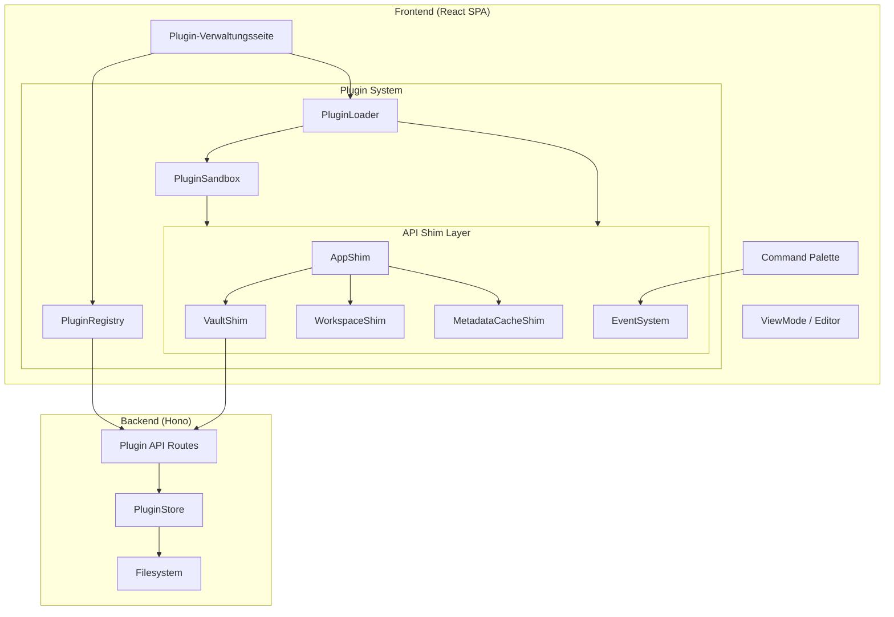

# Design Document: Obsidian Plugin Compatibility Layer

## Overview

Dieses Design beschreibt die Architektur eines Compatibility Layers, der es ermöglicht, Obsidian Community Plugins im Slatebase Web-Frontend auszuführen. Das System emuliert eine Teilmenge der Obsidian Plugin API (App, Vault, Workspace, MetadataCache) und stellt einen Plugin-Loader, ein Sicherheitsmodell (Sandboxing) sowie eine Verwaltungsoberfläche bereit.

### Design-Entscheidungen

1. **Proxy-basiertes API-Shimming**: Statt jede Obsidian-API-Methode manuell zu implementieren, verwenden wir ES6 `Proxy`-Objekte für die Shim-Layer. Das ermöglicht automatische Erkennung nicht-emulierter Zugriffe und konsistentes Logging.

2. **Kein Web Worker für Sandboxing**: Obsidian-Plugins erwarten synchronen DOM-Zugriff. Web Workers haben keinen DOM-Zugang. Stattdessen verwenden wir einen Proxy-basierten Sandbox-Ansatz mit API-Interception und Monitoring.

3. **Backend-Persistenz für Plugin-Dateien**: Plugin-Bundles und Settings werden im Backend gespeichert (analog zu Vault-Dateien), damit sie über Geräte hinweg verfügbar sind.

4. **Lazy Loading nach First Contentful Paint**: Plugins werden asynchron nach dem initialen Rendering geladen, um die Seitenlade-Performance nicht zu beeinträchtigen.

5. **Vault-scoped Plugin-Instanzen**: Jedes Plugin erhält pro Vault eine eigene App-Shim-Instanz. Bei Vault-Wechsel werden Plugins entladen und mit neuem Kontext neu geladen.

6. **Emulierte Obsidian-API-Version**: Das System emuliert eine feste Obsidian-API-Version (initial: `1.4.0`). Plugins mit höherer `minAppVersion` werden als inkompatibel markiert.

## Architecture



### Schichtenmodell

```
┌─────────────────────────────────────────────────────┐
│  Plugin-Verwaltungsseite / Command Palette (UI)     │
├─────────────────────────────────────────────────────┤
│  PluginLoader (Lifecycle, Bundle-Evaluation)        │
├─────────────────────────────────────────────────────┤
│  PluginSandbox (Zugriffskontrolle, Monitoring)      │
├─────────────────────────────────────────────────────┤
│  API Shim Layer (App, Vault, Workspace, Cache)      │
├─────────────────────────────────────────────────────┤
│  Event System (on/off/trigger, EventRef)            │
├─────────────────────────────────────────────────────┤
│  Slatebase API Client / State Management            │
├─────────────────────────────────────────────────────┤
│  Backend Plugin Store (REST API)                    │
└─────────────────────────────────────────────────────┘
```

## Components and Interfaces

### Frontend-Komponenten

#### 1. PluginLoader (`frontend/src/plugins/compat/plugin-loader.ts`)

Verantwortlich für das Laden, Evaluieren und Lifecycle-Management von Plugins.

```typescript
interface IPluginLoader {
  /** Load and evaluate a plugin bundle */
  loadPlugin(pluginId: string, bundle: string, manifest: PluginManifest): Promise<PluginInstance>;
  /** Activate a loaded plugin (calls onload) */
  activatePlugin(pluginId: string): Promise<void>;
  /** Deactivate a plugin (calls onunload, cleanup) */
  deactivatePlugin(pluginId: string): Promise<void>;
  /** Uninstall a plugin completely */
  uninstallPlugin(pluginId: string): Promise<void>;
  /** Get all loaded plugin instances */
  getPlugins(): Map<string, PluginInstance>;
  /** Get a specific plugin instance */
  getPlugin(pluginId: string): PluginInstance | undefined;
}
```

#### 2. PluginRegistry (`frontend/src/plugins/compat/plugin-registry.ts`)

Verwaltet den persistenten Zustand aller installierten Plugins.

```typescript
interface IPluginRegistry {
  /** Get all registered plugins */
  listPlugins(): PluginRegistryEntry[];
  /** Register a new plugin */
  register(manifest: PluginManifest, status: PluginStatus): void;
  /** Update plugin status */
  updateStatus(pluginId: string, status: PluginStatus): void;
  /** Remove a plugin from registry */
  remove(pluginId: string): void;
  /** Get plugin permissions */
  getPermissions(pluginId: string): PluginPermissions;
  /** Set plugin permissions */
  setPermissions(pluginId: string, permissions: PluginPermissions): void;
}
```

#### 3. PluginSandbox (`frontend/src/plugins/compat/sandbox.ts`)

Isoliert Plugin-Ausführung und überwacht Ressourcenverbrauch.

```typescript
interface IPluginSandbox {
  /** Create a sandboxed execution context for a plugin */
  createContext(pluginId: string, permissions: PluginPermissions): SandboxContext;
  /** Monitor main-thread blocking */
  startMonitoring(pluginId: string): void;
  /** Stop monitoring */
  stopMonitoring(pluginId: string): void;
  /** Cleanup all resources for a plugin */
  cleanup(pluginId: string): void;
}
```

#### 4. AppShim (`frontend/src/plugins/compat/shims/app-shim.ts`)

```typescript
interface IAppShim {
  vault: IVaultShim;
  workspace: IWorkspaceShim;
  metadataCache: IMetadataCacheShim;
  plugins: {
    plugins: Record<string, PluginInstance>;
    enabledPlugins: Set<string>;
    getPlugin(id: string): PluginInstance | undefined;
  };
}
```

#### 5. VaultShim (`frontend/src/plugins/compat/shims/vault-shim.ts`)

```typescript
interface IVaultShim {
  read(file: TFile): Promise<string>;
  modify(file: TFile, content: string): Promise<void>;
  create(path: string, content?: string): Promise<TFile>;
  delete(file: TAbstractFile): Promise<void>;
  getAbstractFileByPath(path: string): TAbstractFile | null;
  getMarkdownFiles(): TFile[];
  getFiles(): TFile[];
  getName(): string;
  on(event: string, callback: (...args: unknown[]) => void): EventRef;
  off(event: string, callback: (...args: unknown[]) => void): void;
  trigger(event: string, ...args: unknown[]): void;
}
```

#### 6. WorkspaceShim (`frontend/src/plugins/compat/shims/workspace-shim.ts`)

```typescript
interface IWorkspaceShim {
  getActiveFile(): TFile | null;
  on(event: string, callback: (...args: unknown[]) => void): EventRef;
  off(event: string, callback: (...args: unknown[]) => void): void;
  trigger(event: string, ...args: unknown[]): void;
}
```

#### 7. MetadataCacheShim (`frontend/src/plugins/compat/shims/metadata-cache-shim.ts`)

```typescript
interface IMetadataCacheShim {
  getFileCache(file: TFile): CachedMetadata | null;
  getFirstLinkpathDest(linkpath: string, sourcePath: string): TFile | null;
  resolvedLinks: Record<string, Record<string, number>>;
  on(event: string, callback: (...args: unknown[]) => void): EventRef;
  off(event: string, callback: (...args: unknown[]) => void): void;
  trigger(event: string, ...args: unknown[]): void;
}
```

#### 8. EventSystem (`frontend/src/plugins/compat/event-system.ts`)

```typescript
interface IEventEmitter {
  on(event: string, callback: (...args: unknown[]) => void): EventRef;
  off(event: string, callback: (...args: unknown[]) => void): void;
  trigger(event: string, ...args: unknown[]): void;
  offref(ref: EventRef): void;
  removeAllListeners(): void;
}

interface EventRef {
  id: string;
  event: string;
  callback: (...args: unknown[]) => void;
}
```

#### 9. CommandRegistry (`frontend/src/plugins/compat/command-registry.ts`)

```typescript
interface ICommandRegistry {
  addCommand(pluginId: string, command: Command): void;
  removeCommand(commandId: string): void;
  removeAllForPlugin(pluginId: string): void;
  getCommands(): Command[];
  executeCommand(commandId: string): void;
  searchCommands(query: string): Command[];
}

interface Command {
  id: string;          // Format: <pluginId>:<commandId>
  name: string;
  callback: () => void;
  hotkeys?: Hotkey[];
  pluginId: string;
}
```

#### 10. CompatibilityAnalyzer (`frontend/src/plugins/compat/compatibility-analyzer.ts`)

```typescript
interface ICompatibilityAnalyzer {
  analyze(bundleSource: string): CompatibilityReport;
}

interface CompatibilityReport {
  level: 'full' | 'partial' | 'unsupported' | 'unknown';
  apiCalls: ApiCallClassification[];
  lifecycleCritical: ApiCallClassification[];
}

interface ApiCallClassification {
  method: string;
  classification: 'supported' | 'partial' | 'unsupported';
}
```

### Backend-Komponenten

#### 11. PluginStore (`backend/src/plugin/plugin-store.ts`)

```typescript
interface IPluginStore {
  /** Save plugin files (manifest, bundle, styles) */
  savePlugin(vaultId: string, pluginId: string, files: PluginFiles): Promise<void>;
  /** Load plugin manifest */
  loadManifest(vaultId: string, pluginId: string): Promise<PluginManifest | null>;
  /** Load plugin bundle */
  loadBundle(vaultId: string, pluginId: string): Promise<string | null>;
  /** Load plugin styles */
  loadStyles(vaultId: string, pluginId: string): Promise<string | null>;
  /** Save plugin settings */
  saveSettings(vaultId: string, pluginId: string, data: string): Promise<void>;
  /** Load plugin settings */
  loadSettings(vaultId: string, pluginId: string): Promise<string | null>;
  /** List all plugins for a vault */
  listPlugins(vaultId: string): Promise<PluginManifest[]>;
  /** Delete a plugin and all its data */
  deletePlugin(vaultId: string, pluginId: string): Promise<void>;
  /** Delete all plugins for a vault */
  deleteAllForVault(vaultId: string): Promise<void>;
  /** Save plugin registry (activation status, permissions) */
  saveRegistry(vaultId: string, registry: PluginRegistryData): Promise<void>;
  /** Load plugin registry */
  loadRegistry(vaultId: string): Promise<PluginRegistryData | null>;
}
```

#### 12. PluginRoutes (`backend/src/api/pluginRoutes.ts`)

```typescript
// API Endpoints:
// GET    /api/v1/vaults/:vaultId/plugins           — List installed plugins
// POST   /api/v1/vaults/:vaultId/plugins           — Upload/install plugin (ZIP)
// GET    /api/v1/vaults/:vaultId/plugins/:pluginId — Get plugin details
// DELETE /api/v1/vaults/:vaultId/plugins/:pluginId — Uninstall plugin
// GET    /api/v1/vaults/:vaultId/plugins/:pluginId/bundle   — Download bundle
// GET    /api/v1/vaults/:vaultId/plugins/:pluginId/styles   — Download styles
// GET    /api/v1/vaults/:vaultId/plugins/:pluginId/settings — Load settings
// PUT    /api/v1/vaults/:vaultId/plugins/:pluginId/settings — Save settings
// PUT    /api/v1/vaults/:vaultId/plugins/registry           — Save registry state
// GET    /api/v1/vaults/:vaultId/plugins/registry           — Load registry state
```

### Obsidian-kompatible Datenmodelle

```typescript
/** Obsidian TFile equivalent */
interface TFile {
  path: string;
  name: string;
  basename: string;
  extension: string;
  stat: { mtime: number; ctime: number; size: number };
  vault: IVaultShim;
  parent: TFolder | null;
}

/** Obsidian TFolder equivalent */
interface TFolder {
  path: string;
  name: string;
  children: TAbstractFile[];
  parent: TFolder | null;
  isRoot(): boolean;
}

type TAbstractFile = TFile | TFolder;

/** Obsidian CachedMetadata equivalent */
interface CachedMetadata {
  frontmatter?: Record<string, unknown>;
  links?: LinkCache[];
  tags?: TagCache[];
  headings?: HeadingCache[];
  embeds?: EmbedCache[];
}

interface LinkCache {
  link: string;
  displayText?: string;
  position: Pos;
  original: string;
}

interface TagCache {
  tag: string;
  position: Pos;
}

interface HeadingCache {
  heading: string;
  level: number;
  position: Pos;
}

interface Pos {
  start: { line: number; col: number; offset: number };
  end: { line: number; col: number; offset: number };
}

/** Plugin manifest (from manifest.json) */
interface PluginManifest {
  id: string;
  name: string;
  version: string;
  minAppVersion?: string;
  author?: string;
  description?: string;
  authorUrl?: string;
  isDesktopOnly?: boolean;
  [key: string]: unknown; // Preserve unknown fields
}

/** Plugin activation/permission state */
interface PluginRegistryEntry {
  pluginId: string;
  manifest: PluginManifest;
  status: PluginStatus;
  permissions: PluginPermissions;
  compatibilityLevel: 'full' | 'partial' | 'unsupported' | 'unknown';
  error?: string;
}

type PluginStatus = 'active' | 'inactive' | 'error' | 'loading';

interface PluginPermissions {
  network: boolean;
  networkAllowlist: string[];
  filesystemWrite: boolean;
  domManipulation: boolean;
}

/** Plugin instance (runtime) */
interface PluginInstance {
  manifest: PluginManifest;
  app: IAppShim;
  onload(): Promise<void> | void;
  onunload(): void;
  loadData(): Promise<unknown>;
  saveData(data: unknown): Promise<void>;
  addCommand(command: Omit<Command, 'pluginId'>): void;
  registerEvent(eventRef: EventRef): void;
  addSettingTab(tab: PluginSettingTab): void;
}
```

## Data Models

### Backend-Speicherstruktur

```
data/plugins/
└── <vaultId>/
    ├── _registry.json          — Plugin-Registry (Status, Permissions pro Plugin)
    └── <pluginId>/
        ├── manifest.json       — Plugin-Manifest (Original)
        ├── main.js             — Plugin-Bundle (JavaScript)
        ├── styles.css          — Plugin-Styles (optional)
        └── data.json           — Plugin-Settings (max 1 MB)
```

### Registry-Datenmodell (`_registry.json`)

```typescript
interface PluginRegistryData {
  version: 1;
  plugins: Record<string, {
    status: PluginStatus;
    permissions: PluginPermissions;
    compatibilityLevel: 'full' | 'partial' | 'unsupported' | 'unknown';
    installedAt: string;   // ISO 8601
    updatedAt: string;     // ISO 8601
    error?: string;
  }>;
}
```

### Manifest-Validierung (Zod-Schema)

```typescript
const pluginManifestSchema = z.object({
  id: z.string().min(1),
  name: z.string().min(1),
  version: z.string().regex(/^\d+\.\d+\.\d+$/),
  minAppVersion: z.string().regex(/^\d+\.\d+\.\d+$/).optional(),
  author: z.string().optional(),
  description: z.string().optional(),
  authorUrl: z.string().url().optional(),
  isDesktopOnly: z.boolean().optional(),
}).passthrough(); // Preserve unknown fields for round-trip
```

### API-Endpunkt-Datenmodelle

```typescript
// POST /vaults/:vaultId/plugins — Upload (multipart/form-data with ZIP)
// Response:
interface PluginInstallResponse {
  pluginId: string;
  manifest: PluginManifest;
  compatibilityLevel: string;
}

// GET /vaults/:vaultId/plugins — List
// Response:
interface PluginListResponse {
  plugins: Array<{
    pluginId: string;
    manifest: PluginManifest;
    status: PluginStatus;
    permissions: PluginPermissions;
    compatibilityLevel: string;
    error?: string;
  }>;
}

// PUT /vaults/:vaultId/plugins/:pluginId/settings
// Request body: JSON (max 1 MB)
// Response: 204 No Content

// GET /vaults/:vaultId/plugins/:pluginId/settings
// Response: JSON or 404
```


## Correctness Properties

*A property is a characteristic or behavior that should hold true across all valid executions of a system — essentially, a formal statement about what the system should do. Properties serve as the bridge between human-readable specifications and machine-verifiable correctness guarantees.*

### Property 1: Manifest Round-Trip

*For any* valid Obsidian plugin manifest JSON (including unknown extra fields), parsing then serializing then parsing again SHALL produce an object equivalent to the first parse result.

**Validates: Requirements 1.4**

### Property 2: Manifest Required Field Validation

*For any* manifest JSON object where at least one required field (`id`, `name`, `version`) is missing or an empty string, the parser SHALL return a validation error that names the specific missing/empty field.

**Validates: Requirements 1.2**

### Property 3: Semver Version Comparison

*For any* two valid semver strings A (emulated) and B (required minAppVersion), the compatibility check SHALL mark the plugin as incompatible if and only if B is strictly greater than A according to semver precedence rules.

**Validates: Requirements 1.3**

### Property 4: Version Format Validation

*For any* string that does not match the pattern `MAJOR.MINOR.PATCH` (where each segment is a non-negative integer), the manifest validator SHALL reject it as an invalid version.

**Validates: Requirements 1.7**


### Property 5: Plugin Resource Cleanup on Deactivation

*For any* plugin that has registered N event listeners, M commands, K DOM elements, and J timers, after deactivation the system SHALL have removed all N listeners, all M commands, all K DOM elements, and all J timers — regardless of whether `onunload()` throws an exception.

**Validates: Requirements 3.2, 3.6, 3.7, 8.6**

### Property 6: Non-Emulated API Access Returns Undefined with Warning

*For any* property name or method name not in the set of emulated APIs, accessing it on any Shim object (App, Vault, Workspace, MetadataCache) SHALL return `undefined` (for properties) or a no-op function (for methods), and SHALL log at most one warning per property-name per plugin instance.

**Validates: Requirements 4.3, 4.4, 6.7**

### Property 7: Vault Path Lookup Correctness

*For any* DirectoryTree and any path string, `vault.getAbstractFileByPath(path)` SHALL return a TFile if the path matches a file in the tree, a TFolder if it matches a folder, or `null` if the path does not exist in the tree.

**Validates: Requirements 5.5**

### Property 8: Vault Operation Event Emission

*For any* successful vault file operation (create, modify, delete), the VaultShim SHALL emit exactly one event of the corresponding type (`create`, `modify`, `delete`) with the affected TFile as argument.

**Validates: Requirements 5.6**


### Property 9: Markdown File Filtering

*For any* DirectoryTree containing files with mixed extensions, `vault.getMarkdownFiles()` SHALL return exactly those files whose extension is `.md`, and no others.

**Validates: Requirements 5.7**

### Property 10: Path Traversal Rejection

*For any* path containing `../` sequences, absolute path prefixes, or null bytes, the VaultShim SHALL reject the operation with an error whose message contains the invalid path.

**Validates: Requirements 5.8**

### Property 11: Event System Correctness

*For any* sequence of `on(event, callback)` and `off(event, callback)` operations, `trigger(event, ...args)` SHALL call exactly those callbacks that are currently registered for that event, in registration order, passing the correct arguments. Calling `off()` with an unregistered or already-removed callback SHALL not throw. Multiple `off()` calls for the same callback SHALL be idempotent.

**Validates: Requirements 6.5, 13.1, 13.4, 13.5, 13.6**

### Property 12: Event Callback Exception Isolation

*For any* set of N registered callbacks for an event where callback K throws an exception (1 ≤ K ≤ N), all other N-1 callbacks SHALL still be executed, and the exception SHALL be logged with plugin-ID and event name.

**Validates: Requirements 13.3**


### Property 13: MetadataCache Content Correctness

*For any* markdown file content, `metadataCache.getFileCache(file)` SHALL return a CachedMetadata object whose `frontmatter` matches the parsed YAML frontmatter, whose `links` contains all wikilinks in the document, whose `tags` contains all tags, and whose `headings` contains all headings with correct levels.

**Validates: Requirements 7.1**

### Property 14: Link Resolution

*For any* link path and source path, `metadataCache.getFirstLinkpathDest(linkpath, sourcePath)` SHALL return the same TFile that Slatebase's existing link-resolver would resolve the link to, or `null` if unresolvable.

**Validates: Requirements 7.3, 7.4**

### Property 15: Resolved Links Map Consistency

*For any* vault with N markdown files containing links, `metadataCache.resolvedLinks` SHALL be a map where each source path maps to an object of destination paths with correct link counts, and the total entries match the actual resolved links in the vault.

**Validates: Requirements 7.7**

### Property 16: Vault Isolation

*For any* plugin bound to vault A, all API-Shim operations that reference a vault ID different from A SHALL be rejected.

**Validates: Requirements 8.1**


### Property 17: Storage Namespace Isolation

*For any* plugin storage operation (localStorage, sessionStorage, IndexedDB), the key SHALL be prefixed with `slatebase_plugin_<pluginId>_`, and the total storage per plugin per storage type SHALL not exceed 5 MB.

**Validates: Requirements 8.2**

### Property 18: Network Allowlist Enforcement

*For any* outgoing network request from a plugin and any configured domain allowlist, the request SHALL be allowed if and only if the request's target domain is in the allowlist. If the allowlist is empty or network permission is not granted, all requests SHALL be blocked.

**Validates: Requirements 8.3**

### Property 19: Deny-by-Default Permissions

*For any* newly registered plugin, all permissions (network, filesystemWrite, domManipulation) SHALL be `false` and the networkAllowlist SHALL be empty.

**Validates: Requirements 8.7**

### Property 20: Settings Round-Trip

*For any* JSON-serializable object whose serialized size is ≤ 1 MB, calling `saveData(data)` followed by `loadData()` SHALL return an object deeply equal to the original data.

**Validates: Requirements 9.1, 9.2**


### Property 21: Settings Isolation per Plugin and Vault

*For any* two distinct (pluginId, vaultId) pairs, saving settings for one pair SHALL NOT affect the settings retrievable for the other pair.

**Validates: Requirements 9.3**

### Property 22: Plugin Version Upgrade Preserves Settings

*For any* installed plugin with existing settings (data.json), uploading a new version with a strictly higher semver version SHALL update the bundle and manifest while leaving the settings file unchanged.

**Validates: Requirements 11.3**

### Property 23: Version Downgrade Rejection

*For any* installed plugin with version V, attempting to upload a version V' where V' ≤ V (semver comparison) SHALL be rejected with an error message containing both version strings.

**Validates: Requirements 11.4**

### Property 24: Bundle Integrity Check

*For any* JavaScript source string containing the patterns `eval(`, `new Function(`, or `document.write(`, the integrity check SHALL reject the bundle.

**Validates: Requirements 11.5**


### Property 25: Command ID Namespacing

*For any* plugin with ID P registering a command with ID C, the command SHALL be stored with the composite ID `P:C`, ensuring uniqueness across plugins.

**Validates: Requirements 12.1**

### Property 26: Command Search

*For any* set of registered commands and any search query string, the search SHALL return all commands whose name contains the query as a case-insensitive substring, limited to 50 results.

**Validates: Requirements 12.2**

### Property 27: Command Cleanup on Plugin Deactivation

*For any* plugin with N registered commands, after deactivation all N commands SHALL be removed from the global command list and all associated hotkey registrations SHALL be cleared.

**Validates: Requirements 12.4**

### Property 28: CSS Injection and Removal Lifecycle

*For any* plugin with a `styles.css` file (≤ 512 KB), activation SHALL inject a `<style>` element with `data-plugin-id="<pluginId>"` into the document head, and deactivation SHALL remove that element completely.

**Validates: Requirements 15.1, 15.2**

### Property 29: CSS Selector Scoping

*For any* CSS content injected for a plugin, all selectors SHALL be prefixed with `[data-plugin-id="<pluginId>"]` so that plugin styles only affect DOM elements within the plugin's container.

**Validates: Requirements 15.3**


### Property 30: Static Analysis API Detection

*For any* JavaScript source containing Obsidian API access patterns (e.g., `this.app.vault.read`, `this.app.workspace.getActiveFile`), the compatibility analyzer SHALL detect and list all such patterns in the analysis output.

**Validates: Requirements 16.1**

### Property 31: Compatibility Level Calculation

*For any* set of classified API calls, the compatibility level SHALL be: `full` if all calls are `supported`; `partial` if at least one is `partial` or `unsupported` but no lifecycle-critical method is `unsupported`; `unsupported` if at least one lifecycle-critical method (`onload`, `onunload`, `Plugin.registerEvent`, `vault.read`, `vault.modify`) is `unsupported`.

**Validates: Requirements 16.3**

### Property 32: Plugin onload Timeout

*For any* plugin whose `onload()` method takes longer than 10 seconds to resolve, the PluginLoader SHALL mark the plugin as errored and continue activating remaining plugins.

**Validates: Requirements 3.1, 3.4**


## Error Handling

### Frontend Error Classes

```typescript
/** Base error for all plugin-system errors */
class PluginError extends Error {
  constructor(
    message: string,
    public readonly pluginId: string,
    public readonly code: string
  ) {
    super(message);
    this.name = 'PluginError';
  }
}

/** Manifest validation failed */
class ManifestValidationError extends PluginError {
  constructor(pluginId: string, public readonly field: string, detail: string) {
    super(`Manifest validation failed for "${pluginId}": ${detail}`, pluginId, 'MANIFEST_INVALID');
  }
}

/** Bundle evaluation failed (syntax error, missing export, runtime error) */
class BundleEvaluationError extends PluginError {
  constructor(pluginId: string, public readonly cause: Error) {
    super(`Bundle evaluation failed for "${pluginId}": ${cause.message}`, pluginId, 'BUNDLE_EVAL_FAILED');
  }
}

/** Plugin lifecycle error (onload timeout, onload/onunload exception) */
class LifecycleError extends PluginError {
  constructor(pluginId: string, phase: 'onload' | 'onunload', detail: string) {
    super(`Lifecycle error in "${pluginId}" during ${phase}: ${detail}`, pluginId, 'LIFECYCLE_ERROR');
  }
}

/** Security violation (cross-vault access, blocked API, blocked network) */
class SecurityViolationError extends PluginError {
  constructor(pluginId: string, violation: string) {
    super(`Security violation by "${pluginId}": ${violation}`, pluginId, 'SECURITY_VIOLATION');
  }
}

/** Settings persistence error */
class SettingsError extends PluginError {
  constructor(pluginId: string, operation: 'load' | 'save', detail: string) {
    super(`Settings ${operation} failed for "${pluginId}": ${detail}`, pluginId, 'SETTINGS_ERROR');
  }
}

/** Plugin installation/upload error */
class InstallationError extends PluginError {
  constructor(pluginId: string, detail: string) {
    super(`Installation failed for "${pluginId}": ${detail}`, pluginId, 'INSTALL_FAILED');
  }
}
```

### Backend Error Classes

```typescript
/** Plugin not found */
class PluginNotFoundError extends Error {
  constructor(public readonly vaultId: string, public readonly pluginId: string) {
    super(`Plugin "${pluginId}" not found in vault "${vaultId}"`);
  }
}

/** Plugin file too large */
class PluginFileTooLargeError extends Error {
  constructor(public readonly maxSize: number, public readonly actualSize: number) {
    super(`Plugin file exceeds maximum size of ${maxSize} bytes (actual: ${actualSize})`);
  }
}

/** Plugin settings too large */
class PluginSettingsTooLargeError extends Error {
  constructor(public readonly pluginId: string) {
    super(`Settings for plugin "${pluginId}" exceed maximum size of 1 MB`);
  }
}
```

### Error Handling Strategy

| Error Scenario | Handling | User Impact |
|---|---|---|
| Manifest parse error (invalid JSON) | Log error, reject plugin, show error in UI | Plugin not loaded, others unaffected |
| Bundle syntax error | Catch SyntaxError, mark plugin as `error` | Plugin disabled, app fully functional |
| Bundle runtime exception | Catch in try/catch, mark as `error`, log | Plugin disabled, app fully functional |
| `onload()` timeout (>10s) | AbortController + setTimeout, mark as `error` | Plugin disabled, others continue loading |
| `onload()` exception | Catch, mark as `error`, continue with next plugin | Plugin disabled, others load normally |
| `onunload()` exception | Catch, log, still perform full cleanup | Resources cleaned up despite error |
| Event callback exception | Catch per callback, log, continue dispatching | Other callbacks still execute |
| Command callback exception | Catch, log, close palette | Palette closes, no unhandled error |
| Network request blocked | Intercept fetch/XHR, reject with SecurityViolationError | Plugin receives error, can handle gracefully |
| Main-thread blocking >5s | Monitoring detects, auto-deactivate plugin | Plugin disabled, notification shown |
| Settings load failure | Return `null`, log to console | Plugin uses defaults |
| Settings save >1 MB | Reject with error, throw to plugin | Plugin receives exception |
| Cross-vault access attempt | Reject operation, log security violation | Operation fails, warning in plugin management |
| API shim method not found | Return undefined/no-op, log warning (once per method) | Plugin may degrade gracefully |

### Graceful Degradation Principles

1. **Plugin-Fehler isolieren**: Ein fehlerhaftes Plugin darf niemals die Hauptanwendung oder andere Plugins beeinträchtigen.
2. **Fail-Open für nicht-kritische Fehler**: Warnungen loggen, aber Ausführung fortsetzen (z.B. nicht-emulierte API-Zugriffe).
3. **Fail-Closed für Sicherheitsverletzungen**: Sofortige Blockierung bei Cross-Vault-Zugriff, unerlaubten Netzwerk-Requests oder API-Missbrauch.
4. **Automatische Deaktivierung bei schweren Fehlern**: Main-Thread-Blockierung und wiederholte Exceptions führen zur automatischen Deaktivierung.
5. **Benutzer informieren**: Alle Fehler werden in der Plugin-Verwaltungsseite sichtbar gemacht (nicht nur in der Konsole).


## Testing Strategy

### Dual Testing Approach

Dieses Feature verwendet sowohl Unit-Tests (spezifische Beispiele, Edge Cases) als auch Property-Based Tests (universelle Invarianten über alle Eingaben).

### Property-Based Testing

- **Library**: `fast-check` (bereits als devDependency in beiden Packages vorhanden)
- **Minimum Iterationen**: 100 pro Property-Test
- **Dateinamenskonvention**: `*.pbt.test.ts` (co-located neben Source-Dateien)
- **Tag-Format**: `Feature: obsidian-plugin-compat, Property {number}: {property_text}`

#### PBT-Schwerpunkte

| Bereich | Properties | Generatoren |
|---------|-----------|-------------|
| Manifest-Parsing | 1, 2, 3, 4 | Random JSON objects, semver strings, field combinations |
| Event System | 11, 12 | Random event names, callback sequences, on/off/trigger orderings |
| Vault Shim | 7, 8, 9, 10 | Random DirectoryTrees, file paths, path traversal attempts |
| MetadataCache | 13, 14, 15 | Random markdown content, link paths, vault structures |
| Security | 16, 17, 18, 19 | Random vault IDs, storage keys, URLs, domain lists |
| Settings | 20, 21 | Random JSON objects, plugin/vault ID pairs |
| Plugin Installation | 22, 23, 24, 25 | Random semver versions, JS source strings, ZIP structures |
| Commands | 25, 26, 27 | Random command names, search queries, plugin IDs |
| CSS | 28, 29 | Random CSS content, plugin IDs |
| Compatibility | 30, 31 | Random JS source with API patterns, classification sets |

### Unit-Test-Schwerpunkte

| Bereich | Fokus |
|---------|-------|
| Bundle-Laden | Syntax errors, missing exports, runtime exceptions |
| Lifecycle | onload timeout, onunload exception, startup order |
| App Shim | Vault-context binding, vault switch lifecycle |
| Workspace Shim | Active file retrieval, null cases |
| UI-Komponenten | Plugin management page states, command palette interaction |
| Backend API | Auth/access control, file size limits, CRUD operations |

### Integration-Test-Schwerpunkte

| Bereich | Fokus |
|---------|-------|
| Plugin Upload | ZIP extraction, manifest validation, backend storage |
| Settings Persistence | Save/load cycle through API, cross-device availability |
| Vault Shim → API | Read/write/create/delete through actual API client |
| Plugin Lifecycle | Full activate/deactivate cycle with real bundle evaluation |
| Access Control | Vault permission checks for plugin data access |

### Test-Dateistruktur

```
frontend/src/plugins/compat/
├── manifest-parser.ts
├── manifest-parser.test.ts          — Unit tests
├── manifest-parser.pbt.test.ts      — Property tests (Properties 1-4)
├── event-system.ts
├── event-system.test.ts             — Unit tests
├── event-system.pbt.test.ts         — Property tests (Properties 11, 12)
├── shims/
│   ├── vault-shim.ts
│   ├── vault-shim.test.ts           — Unit tests
│   ├── vault-shim.pbt.test.ts       — Property tests (Properties 7-10)
│   ├── workspace-shim.ts
│   ├── workspace-shim.test.ts       — Unit tests
│   ├── metadata-cache-shim.ts
│   ├── metadata-cache-shim.test.ts  — Unit tests
│   ├── metadata-cache-shim.pbt.test.ts — Property tests (Properties 13-15)
│   └── app-shim.ts
├── sandbox.ts
├── sandbox.test.ts                  — Unit tests
├── sandbox.pbt.test.ts              — Property tests (Properties 16-19)
├── plugin-loader.ts
├── plugin-loader.test.ts            — Unit tests
├── plugin-loader.pbt.test.ts        — Property tests (Property 5, 32)
├── command-registry.ts
├── command-registry.test.ts         — Unit tests
├── command-registry.pbt.test.ts     — Property tests (Properties 25-27)
├── css-injector.ts
├── css-injector.test.ts             — Unit tests
├── css-injector.pbt.test.ts         — Property tests (Properties 28, 29)
├── compatibility-analyzer.ts
├── compatibility-analyzer.test.ts   — Unit tests
├── compatibility-analyzer.pbt.test.ts — Property tests (Properties 30, 31)
├── settings-manager.ts
├── settings-manager.test.ts         — Unit tests
└── settings-manager.pbt.test.ts     — Property tests (Properties 20-24)

backend/src/plugin/
├── plugin-store.ts
├── plugin-store.test.ts             — Unit tests
├── plugin-store.pbt.test.ts         — Property tests (Property 21)
├── validation.ts
├── validation.test.ts               — Unit tests
└── index.ts                         — Barrel export
```

### Mocking-Strategie

- **Frontend**: `vi.fn()` für API-Client-Methoden, hand-geschriebene Mock-Factories für Shim-Interfaces
- **Backend**: Hand-geschriebene Mock-Factories (`createMockPluginStore()`, `createMockVaultService()`)
- **DOM-Mocking**: jsdom (via Vitest) für CSS-Injection-Tests und DOM-Element-Tracking
- **Timer-Mocking**: `vi.useFakeTimers()` für Timeout-Tests (onload 10s, main-thread 5s)

### Ausführungsregeln

- PBT-Tests werden **nur auf explizite Anforderung** ausgeführt (gemäß Lessons Learned)
- Reguläre Tests: `npm run test` (Unit + Integration)
- PBT gezielt: `npx vitest --run <datei>.pbt.test.ts`
- CI: Reguläre Tests bei jedem Push, PBT optional in separatem CI-Job

