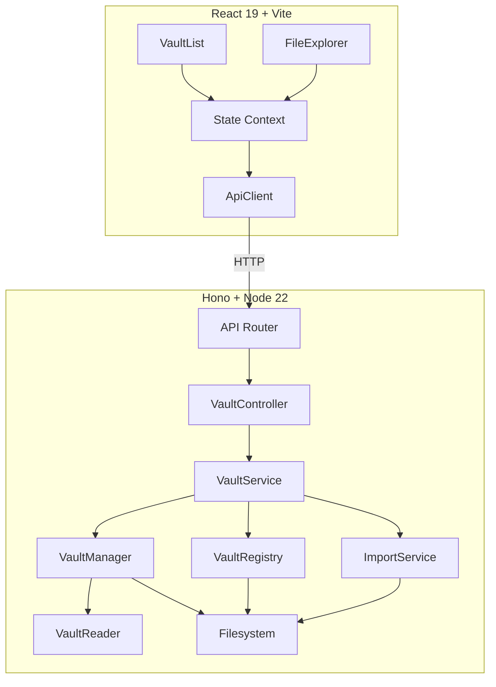

# Design Document: Persistent Vault Management

## Overview

This feature transforms Slatebase from a read-only viewer of statically configured vaults into a full vault lifecycle management system. Users will be able to create named vaults, import files and folders into them, delete vault contents, and delete entire vaults — all persisted on the server filesystem across restarts.

The UI uses a single-page layout with a sidebar containing a vault dropdown selector and file explorer, and a main content area for file viewing. There is no separate overview page — vault selection, creation, and deletion happen via the dropdown.

The current architecture uses a static `VaultConfig[]` loaded from `config/default.json` or environment variables. This design introduces a **vault registry** (a JSON file on disk) that tracks dynamically created vaults, replaces the static config as the source of truth for vault metadata, and enables CRUD operations through new REST API endpoints.

### Key Design Decisions

1. **JSON file registry over database**: A simple `vaults.json` file provides persistence without adding database dependencies. The registry is small (max 20 vaults) and written atomically.
2. **Multipart upload for file import**: Files are uploaded via `multipart/form-data` to leverage browser-native file selection and streaming.
3. **Folder import as ZIP upload**: Since browsers cannot upload directory structures natively via a single request, folder import uses a ZIP archive that the server extracts. Alternatively, the frontend uses the `webkitdirectory` attribute to upload multiple files with relative paths.
4. **Atomic registry updates**: The registry file is written atomically (write to temp file, then rename) to prevent corruption on crash.
5. **Cleanup on failure**: Partial imports and failed creations are rolled back to maintain vault consistency.

## Architecture



### Request Flow

1. **Vault Creation**: `POST /api/v1/vaults` → VaultController → VaultService → VaultRegistry (persist metadata) + Filesystem (create directory)
2. **Vault Deletion**: `DELETE /api/v1/vaults/:vaultId` → VaultController → VaultService → Filesystem (remove directory) → VaultRegistry (remove entry)
3. **File Import**: `POST /api/v1/vaults/:vaultId/import/file` → VaultController → ImportService → Filesystem (write file)
4. **Folder Import**: `POST /api/v1/vaults/:vaultId/import/folder` → VaultController → ImportService → Filesystem (extract structure)
5. **Content Deletion**: `DELETE /api/v1/vaults/:vaultId/content?path=...` → VaultController → VaultService → Filesystem (remove file/folder)

## Components and Interfaces

### Backend Components

#### VaultRegistry (New)

Manages persistent vault metadata stored in a JSON file.

```typescript
interface VaultRegistryEntry {
  id: string           // SHA-256 hash (12 hex chars) of storage path
  name: string         // User-chosen name, 1-128 chars, unique
  storagePath: string  // Absolute path to vault directory on server
  createdAt: string    // ISO 8601 timestamp
}

interface IVaultRegistry {
  load(): Promise<VaultRegistryEntry[]>
  save(entries: VaultRegistryEntry[]): Promise<void>
  addEntry(entry: VaultRegistryEntry): Promise<void>
  removeEntry(vaultId: string): Promise<void>
  findById(vaultId: string): VaultRegistryEntry | null
  findByName(name: string): VaultRegistryEntry | null
}
```

#### VaultService (Extended)

Extended with vault lifecycle and content management methods.

```typescript
interface IVaultService {
  // Existing
  initializeVaults(): Promise<void>
  getVaultList(): VaultInfo[]
  getVaultTree(vaultId: string): DirectoryTree
  getFileContent(vaultId: string, filePath: string): Promise<FileContent>

  // New — Vault Lifecycle
  createVault(name: string): Promise<VaultInfo>
  deleteVault(vaultId: string): Promise<void>

  // New — Content Management
  deleteContent(vaultId: string, relativePath: string): Promise<void>
}
```

#### ImportService (New)

Handles file and folder import into vaults.

```typescript
interface IImportService {
  importFile(vaultId: string, file: UploadedFile): Promise<void>
  importFolder(vaultId: string, files: UploadedFile[]): Promise<void>
}

interface UploadedFile {
  name: string           // Original filename
  relativePath: string   // Relative path (for folder imports)
  size: number           // File size in bytes
  stream: ReadableStream // File content stream
}
```

#### VaultController (Extended)

New route handlers for CRUD operations.

```typescript
interface IVaultController {
  // Existing
  listVaults(c: Context): Response | Promise<Response>
  getVaultTree(c: Context): Response | Promise<Response>
  getFileContent(c: Context): Response | Promise<Response>

  // New
  createVault(c: Context): Promise<Response>
  deleteVault(c: Context): Promise<Response>
  importFile(c: Context): Promise<Response>
  importFolder(c: Context): Promise<Response>
  deleteContent(c: Context): Promise<Response>
}
```

### Frontend Components

#### ApiClient (Extended)

```typescript
interface IApiClient {
  // Existing
  fetchVaults(): Promise<VaultInfo[]>
  fetchVaultTree(vaultId: string): Promise<DirectoryTree>
  fetchFileContent(vaultId: string, filePath: string): Promise<FileContent>

  // New
  createVault(name: string): Promise<VaultInfo>
  deleteVault(vaultId: string): Promise<void>
  importFile(vaultId: string, file: File): Promise<void>
  importFolder(vaultId: string, files: FileList): Promise<void>
  deleteContent(vaultId: string, path: string): Promise<void>
}
```

#### AppState (Extended)

New actions for the state reducer:

```typescript
type AppAction =
  | { type: 'VAULTS_LOADED'; payload: VaultInfo[] }
  | { type: 'VAULT_SELECTED'; payload: string }
  | { type: 'VAULT_DESELECTED' }
  | { type: 'TREE_LOADED'; payload: DirectoryTree }
  | { type: 'FILE_LOADED'; payload: FileContent }
  | { type: 'LOADING_STARTED' }
  | { type: 'ERROR_OCCURRED'; payload: AppError }
  // New actions
  | { type: 'VAULT_CREATED'; payload: VaultInfo }
  | { type: 'VAULT_DELETED'; payload: string }  // vaultId
  | { type: 'CONTENT_DELETED'; payload: string } // relative path
```

#### VaultList (Dropdown)

- Renders as a dropdown menu in the sidebar header (next to the app title)
- Dropdown trigger shows the currently selected vault name (or placeholder "Vault auswählen…")
- Opening the dropdown reveals all vaults with per-vault delete buttons (×)
- Includes a "+ Neuer Vault" button at the bottom that reveals an inline creation form
- Provides `aria-label="Vault: {name}"` for each vault entry for accessibility
- Closes on outside click or after vault selection

#### FileExplorer (Extended)

- Renders below the VaultList in the sidebar (only when a vault is selected)
- Adds "Import File" and "Import Folder" buttons in a toolbar
- Adds a delete button (×) on each file and folder node (visible on hover)
- Refreshes tree after mutations
- Shows error banner on failed operations

## Data Models

### Vault Registry File (`vaults.json`)

Stored at a configurable path (default: `<dataDir>/vaults.json`).

```json
{
  "version": 1,
  "vaults": [
    {
      "id": "a1b2c3d4e5f6",
      "name": "My Research",
      "storagePath": "/data/vaults/a1b2c3d4e5f6",
      "createdAt": "2025-01-15T10:30:00.000Z"
    }
  ]
}
```

### Vault Storage Layout

```
<dataDir>/
├── vaults.json              # Registry file
└── vaults/                  # Vault storage root
    ├── a1b2c3d4e5f6/        # Vault directory (named by ID)
    │   ├── notes.md
    │   └── research/
    │       └── paper.pdf
    └── b2c3d4e5f6a7/
        └── ...
```

### API Request/Response Models

#### POST /api/v1/vaults

Request:
```json
{ "name": "My Research" }
```

Response (201):
```json
{ "id": "a1b2c3d4e5f6", "name": "My Research" }
```

Error (400):
```json
{ "code": "VALIDATION_ERROR", "message": "Vault name must be 1-128 characters with at least one non-whitespace character", "timestamp": "..." }
```

Error (409):
```json
{ "code": "VAULT_NAME_CONFLICT", "message": "A vault with name 'My Research' already exists", "timestamp": "..." }
```

#### DELETE /api/v1/vaults/:vaultId

Response (204): No content

Error (404):
```json
{ "code": "VAULT_NOT_FOUND", "message": "Vault not found: abc123", "timestamp": "..." }
```

#### POST /api/v1/vaults/:vaultId/import/file

Request: `multipart/form-data` with a single `file` field

Response (201):
```json
{ "path": "document.md", "name": "document.md", "size": 1024 }
```

Error (409):
```json
{ "code": "FILE_CONFLICT", "message": "A file named 'document.md' already exists at the target location", "timestamp": "..." }
```

Error (413):
```json
{ "code": "FILE_TOO_LARGE", "message": "File exceeds maximum size of 500 MB", "timestamp": "..." }
```

#### POST /api/v1/vaults/:vaultId/import/folder

Request: `multipart/form-data` with multiple `files` fields, each including `webkitRelativePath`

Response (201):
```json
{ "importedFiles": 15, "importedFolders": 3 }
```

Error (400):
```json
{ "code": "DEPTH_EXCEEDED", "message": "Folder exceeds maximum nesting depth of 10 levels", "timestamp": "..." }
```

#### DELETE /api/v1/vaults/:vaultId/content

Query parameter: `path` (URL-encoded relative path)

Response (204): No content

Error (404):
```json
{ "code": "FILE_NOT_FOUND", "message": "File or folder not found at path: research/old", "timestamp": "..." }
```

Error (400):
```json
{ "code": "PATH_TRAVERSAL", "message": "Path traversal detected", "timestamp": "..." }
```

### Configuration Extension

New config fields in `ServerConfigSchema`:

```typescript
const ServerConfigSchema = z.object({
  // ... existing fields ...
  dataDir: z.string().default('./data'),        // Root directory for vault storage and registry
  maxImportFileSize: z.number().int().positive().default(524288000), // 500 MB
  maxImportFiles: z.number().int().positive().default(500),
  maxImportDepth: z.number().int().positive().default(10),
})
```

### Validation Rules

| Field | Rule |
|-------|------|
| Vault name | 1-128 chars, at least one non-whitespace, unique (case-sensitive) |
| File name | 1-255 chars, no path separators (`/`, `\`) |
| File size | Max 500 MB per file |
| Folder depth | Max 10 nested levels |
| Folder file count | Max 500 total files |
| Content path | Must resolve within vault root (path traversal protection) |


## Correctness Properties

*A property is a characteristic or behavior that should hold true across all valid executions of a system — essentially, a formal statement about what the system should do. Properties serve as the bridge between human-readable specifications and machine-verifiable correctness guarantees.*

### Property 1: Vault Name Validation

*For any* string input, the vault name validation function SHALL accept it if and only if it has length between 1 and 128 characters (inclusive) and contains at least one non-whitespace character. Invalid inputs SHALL produce a specific error code identifying the validation failure (empty, whitespace-only, or too long).

**Validates: Requirements 1.2, 1.4**

### Property 2: Vault Name Uniqueness

*For any* set of existing vault names and a new vault name, creation SHALL succeed only when no existing vault has the same name (case-sensitive comparison). If the name already exists, creation SHALL be rejected with a VAULT_NAME_CONFLICT error.

**Validates: Requirements 1.3**

### Property 3: Vault Creation Round-Trip

*For any* valid vault name, creating a vault SHALL return metadata containing a 12-character hex ID and the exact name provided. The vault SHALL then appear in the vault list with those same values.

**Validates: Requirements 1.1**

### Property 4: Vault Creation Atomicity

*For any* vault creation attempt that fails due to a filesystem error during directory creation, the vault registry SHALL remain unchanged — the failed vault SHALL NOT appear in the vault list.

**Validates: Requirements 1.5**

### Property 5: Vault Deletion Completeness

*For any* existing vault, after successful deletion, both the vault's storage directory on the filesystem AND its entry in the vault registry SHALL be removed. The vault SHALL no longer appear in the vault list.

**Validates: Requirements 2.1, 2.2**

### Property 6: Vault Deletion Atomicity

*For any* vault deletion attempt that fails due to a filesystem error during directory removal, the vault SHALL remain in the registry and continue to appear in the vault list.

**Validates: Requirements 2.4**

### Property 7: Non-Existent Vault Rejection

*For any* vault ID that does not match an existing vault, any operation targeting that vault (deletion, file import, folder import, content deletion, tree retrieval) SHALL return a VAULT_NOT_FOUND error without modifying any data.

**Validates: Requirements 2.3, 4.6, 6.5**

### Property 8: File Import Round-Trip

*For any* valid file (name 1-255 chars without path separators, size ≤ 500 MB), importing it into a vault SHALL produce a stored file with the same name and identical content. Reading the file back SHALL return the original content.

**Validates: Requirements 4.1, 4.4**

### Property 9: File Import Conflict Detection

*For any* vault that already contains a file with name N at the root level, attempting to import another file with name N SHALL be rejected with a FILE_CONFLICT error, and the existing file SHALL remain unchanged.

**Validates: Requirements 4.3**

### Property 10: File Import Validation

*For any* file where the name exceeds 255 characters, or the name contains path separator characters (`/` or `\`), or the file size exceeds 500 MB, the import SHALL be rejected with a descriptive validation error before any data is written.

**Validates: Requirements 4.7**

### Property 11: File Import Atomicity

*For any* file import that fails after transfer has begun (due to storage or connection failure), the vault's storage SHALL contain no partial file — the vault state SHALL be identical to its state before the import attempt.

**Validates: Requirements 4.5**

### Property 12: Folder Import Structural Preservation

*For any* valid folder structure (≤ 10 levels deep, ≤ 500 files), importing it into a vault SHALL replicate the exact directory hierarchy, preserving all file names, folder names, relative paths, and empty subfolders.

**Validates: Requirements 5.1, 5.2, 5.5**

### Property 13: Folder Import Conflict Detection

*For any* vault with existing content, if an imported folder would place a file or folder at a path where an item already exists, the entire import SHALL be rejected with an error identifying the conflicting path. No files from the import SHALL be written.

**Validates: Requirements 5.4**

### Property 14: Folder Import Limit Validation

*For any* folder structure that exceeds 10 levels of nesting depth or contains more than 500 total files, the import SHALL be rejected with an error indicating which specific limit was exceeded.

**Validates: Requirements 5.6**

### Property 15: Folder Import Atomicity

*For any* folder import that fails after partially writing files, all files and folders written during that import operation SHALL be removed, leaving the vault in its exact pre-import state.

**Validates: Requirements 5.7**

### Property 16: Content Deletion Completeness

*For any* file or folder that exists within a vault, deletion SHALL completely remove it from the vault's storage. For folders, all contained files and subfolders SHALL also be removed.

**Validates: Requirements 6.1, 6.2**

### Property 17: Content Path Traversal Protection

*For any* deletion request path that, when resolved, would fall outside the vault's storage directory (including paths with `../`, absolute paths, null bytes, or encoded traversal sequences), the request SHALL be rejected with a PATH_TRAVERSAL error and no filesystem modification SHALL occur.

**Validates: Requirements 6.6**

### Property 18: Non-Existent Content Path Rejection

*For any* path that does not correspond to an existing file or folder within the vault, a deletion request SHALL return a FILE_NOT_FOUND error without modifying any other vault content.

**Validates: Requirements 6.4**

### Property 19: Registry Persistence Round-Trip

*For any* sequence of vault creation and deletion operations, the vault registry file on disk SHALL always reflect the current set of vaults. Reloading the registry from disk (simulating a server restart) SHALL produce the same vault list with correct IDs, names, and storage paths.

**Validates: Requirements 7.1, 7.2, 7.3, 7.4**

### Property 20: Startup Graceful Degradation

*For any* vault registry containing entries where some referenced storage directories exist and some do not, loading the registry SHALL successfully load all vaults with valid directories, skip vaults with missing directories (logging a warning), and make only the valid vaults available in the vault list.

**Validates: Requirements 7.5**

## Error Handling

### Error Code Taxonomy

| Code | HTTP Status | Trigger |
|------|-------------|---------|
| `VALIDATION_ERROR` | 400 | Invalid vault name (empty, whitespace-only, >128 chars) |
| `VAULT_NAME_CONFLICT` | 409 | Vault name already in use |
| `VAULT_NOT_FOUND` | 404 | Vault ID does not exist |
| `FILE_NOT_FOUND` | 404 | File/folder path does not exist in vault |
| `FILE_CONFLICT` | 409 | File/folder name already exists at target |
| `FILE_TOO_LARGE` | 413 | File exceeds 500 MB limit |
| `INVALID_FILENAME` | 400 | Filename >255 chars or contains path separators |
| `DEPTH_EXCEEDED` | 400 | Folder exceeds 10 levels of nesting |
| `FILE_COUNT_EXCEEDED` | 400 | Folder contains >500 files |
| `PATH_TRAVERSAL` | 400 | Path resolves outside vault root |
| `STORAGE_ERROR` | 500 | Filesystem operation failed |
| `INTERNAL_ERROR` | 500 | Unexpected server error |

### Error Response Format

All errors follow the existing `ApiError` format:

```json
{
  "code": "ERROR_CODE",
  "message": "Human-readable description",
  "timestamp": "2025-01-15T10:30:00.000Z"
}
```

### Rollback Strategy

1. **Vault Creation Failure**: If `mkdir` fails after registry update, remove the registry entry.
2. **Vault Deletion Failure**: If `rm -rf` fails, do NOT remove the registry entry. Return error to client.
3. **File Import Failure**: If write fails mid-stream, delete the partially written file using `fs.unlink`.
4. **Folder Import Failure**: Track all created paths during import. On failure, remove them in reverse order (files first, then directories).

### Frontend Error Display

- Errors are stored in `AppState.error` and displayed via a toast/banner component.
- Errors are cleared on the next successful operation (`LOADING_STARTED` clears error).
- Validation errors (400) show the specific message to help the user correct input.
- Server errors (500) show a generic "Something went wrong" message.

## Testing Strategy

### Property-Based Testing

**Library**: [fast-check](https://github.com/dubzzz/fast-check) (TypeScript PBT library, well-maintained, integrates with Vitest)

**Configuration**:
- Minimum 100 iterations per property test
- Each property test references its design document property via tag comment
- Tag format: `// Feature: persistent-vault-management, Property {N}: {title}`

**Scope**: Properties 1-20 are implemented as property-based tests targeting the backend business logic and validation layers. Properties that require filesystem interaction use a temporary directory created per test run.

### Unit Tests (Example-Based)

- **VaultList component**: Renders dropdown trigger, vault selection, create/delete functionality, accessible labels (Requirements 3.1, 3.2, 3.3)
- **FileExplorer component**: Renders delete buttons, import buttons, tree refresh after mutations (Requirements 4.2, 5.3, 6.3, 6.7)
- **State reducer**: New action types (VAULT_CREATED, VAULT_DELETED, CONTENT_DELETED) produce correct state transitions (Requirements 1.6, 2.5, 2.6)
- **ApiClient**: New methods construct correct requests and parse responses

### Integration Tests

- **Full API flow**: Create vault → import file → read file → delete file → delete vault (end-to-end via HTTP)
- **Concurrent operations**: Multiple simultaneous vault creations with same name (only one succeeds)
- **Large file import**: Verify 500 MB boundary behavior
- **Server restart simulation**: Create vaults, restart service, verify vaults persist

### E2E Tests (Playwright)

- Vault creation via UI form
- File import via file picker
- Vault deletion with confirmation dialog
- Navigation after vault deletion (back to overview)

### Test Organization

```
backend/src/
├── vault/
│   ├── registry.ts
│   ├── registry.test.ts          # Unit tests for VaultRegistry
│   └── registry.property.test.ts # PBT for registry operations
├── business/
│   ├── index.ts
│   ├── index.test.ts             # Unit tests for VaultService
│   ├── validation.ts
│   └── validation.property.test.ts # PBT for name validation
├── import/
│   ├── index.ts
│   ├── index.test.ts             # Unit tests for ImportService
│   └── index.property.test.ts    # PBT for import logic
└── integration.test.ts           # Integration tests

frontend/src/
├── components/
│   ├── VaultList.test.tsx        # Component tests
│   └── FileExplorer.test.tsx
├── state/
│   └── index.test.ts             # Reducer tests
└── api/
    └── index.test.ts             # ApiClient tests
```
