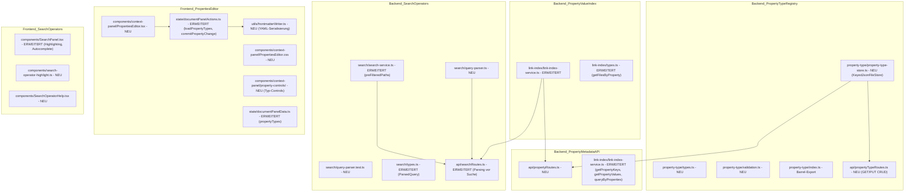

# Design Document: Properties-Editor & Suchoperatoren

## Overview

Diese Spec liefert vier eng verflochtene Bausteine, die gemeinsam eine typisierte Property-Schicht + strukturierte Suche etablieren — die zwingende Grundlage für Bases (Prio 10). Alle vier docken an bestehende Infrastruktur an (Link_Index_Service, SearchService, PropertiesView, SearchPanel); es entsteht keine neue Kernarchitektur, aber die bestehenden Module erhalten substantielle Erweiterungen.

**Kernentscheidungen:**

- **Property-Type-Registry als per-Vault-JSON (`.slatebase/property-types.json`)**: Folgt dem bewährten `VaultConfig`-Muster (`KeyedJsonFileStore` + REST-CRUD). Keine neue Datenbank, kein Schema-Migration-System — die Registry ist eine flache Liste von `{ key, type, options? }`-Einträgen, die beim Vault-Laden einmal gelesen und im Speicher gehalten wird.
- **Inverser Property-Index im Speicher, nicht persistiert**: Der `propertyValueIndex` wird beim Start aus dem bereits persistierten `properties`-Abschnitt der JSON-v2 Link-Index-Datei rekonstruiert und bei jedem inkrementellen `updateFile()`/`removeFile()` mitgepflegt. Kein zusätzliches Disk-I/O für die Indexstruktur selbst — der Link-Index-Rebuild ist schnell genug (verifiziert: ~10ms für 1000 Dateien im bestehenden `rebuild()`).
- **Such-Operator-Parsing als reine Pre-Processing-Schicht**: Ein neues Modul `query-parser.ts` zerlegt den Query-String in strukturierte Operatoren + Freitext-Rest. Der bestehende `SearchService.search()` erhält einen neuen optionalen Parameter `preFilteredPaths?: string[]` — wenn gesetzt, wird nur in diesen Dateien gesucht statt den vollen Vault-Tree zu scannen. Die API-Oberfläche (`GET /vaults/:vaultId/search`) bleibt identisch — Parsing passiert server-seitig am `query`-Parameter.
- **Properties-Editor als CM6-Transaction-basierter YAML-Rewriter**: Änderungen am Frontmatter werden als atomarer CM6-`dispatch({ changes })` auf dem offenen Editor-Dokument ausgeführt (exakter from/to-Bereich des `---…---`-Blocks). Dadurch greift der bestehende Auto-Save-Pfad, Undo/Redo bleibt korrekt, und die debounced Properties-Anzeige aktualisiert sich automatisch via `loadProperties()`.
- **Frontend-Autocomplete aus bereits geladenen Daten**: Tags kommen vom bestehenden `GET /vaults/:vaultId/graph/tags`, Property-Keys von `GraphMeta.propertyKeys` (ebenfalls bestehend, `GET /vaults/:vaultId/graph/meta`). Kein neuer Endpunkt nötig für die Autocomplete-Quelle — die Property-Metadaten-API (Requirement 7) dient Bases, nicht dem Editor-Autocomplete.

## Architecture



---

## Teil 1: Property-Type-Registry (Backend)

### Datenmodell

```typescript
// backend/src/property-type/types.ts (NEU)

/** Supported property value types. */
export type PropertyType = 'text' | 'number' | 'date' | 'datetime' | 'checkbox' | 'list' | 'tags' | 'aliases'

/** A single registered property-key definition. */
export interface PropertyTypeEntry {
  /** The frontmatter key name. */
  key: string
  /** The declared value type. */
  type: PropertyType
  /** Optional type-specific configuration. */
  options?: PropertyTypeOptions
}

/** Type-specific options (extensible). */
export interface PropertyTypeOptions {
  /** For 'list'/'text': predefined allowed values (shown as dropdown). */
  allowedValues?: string[]
  /** For 'date'/'datetime': display format hint (informational, not enforced). */
  dateFormat?: string
}

/** The full per-vault registry document. */
export interface PropertyTypeRegistry {
  entries: PropertyTypeEntry[]
}

/** Service interface for property type management. */
export interface IPropertyTypeService {
  getRegistry(vaultId: string): Promise<PropertyTypeRegistry>
  saveRegistry(vaultId: string, registry: PropertyTypeRegistry): Promise<PropertyTypeRegistry>
  upsertEntry(vaultId: string, entry: PropertyTypeEntry): Promise<PropertyTypeRegistry>
}
```

### Persistierung

`.slatebase/property-types.json` — `KeyedJsonFileStore<PropertyTypeRegistry>` (keyed by vaultId, genau wie `VaultConfigStore`). Default bei fehlender Datei: `{ entries: [] }`.

Der Store wird im Composition Root (`backend/src/index.ts`) instanziiert und in die Route-Module injiziert. Kein In-Memory-Cache über Requests hinweg nötig (die Datei ist winzig — <200 Einträge à ~100 Bytes ≈ <20KB; ein Read pro UI-Load ist akzeptabel).

### Validierung

```typescript
// backend/src/property-type/validation.ts (NEU)

export const propertyTypeSchema = z.enum(['text', 'number', 'date', 'datetime', 'checkbox', 'list', 'tags', 'aliases'])

export const propertyTypeEntrySchema = z.object({
  key: z.string().min(1).max(100).regex(/^[a-zA-Z0-9_-]+$/),
  type: propertyTypeSchema,
  options: z.object({
    allowedValues: z.array(z.string().max(200)).max(50).optional(),
    dateFormat: z.string().max(50).optional(),
  }).optional(),
})

export const propertyTypeRegistrySchema = z.object({
  entries: z.array(propertyTypeEntrySchema).max(200),
})
```

### REST-Endpunkte

| Methode | Pfad | Body | Beschreibung |
|---------|------|------|--------------|
| `GET` | `/api/v1/vaults/:vaultId/property-types` | — | Gesamte Registry |
| `PUT` | `/api/v1/vaults/:vaultId/property-types` | `PropertyTypeRegistry` | Atomar überschreiben |
| `PUT` | `/api/v1/vaults/:vaultId/property-types/:key` | `PropertyTypeEntry` | Einzelnen Key upserten |

Alle mit Standard-Auth + Access-Check (`access-check.ts`-Pattern). `PUT`-Operationen nur bei Write-Access (Vault-Owner oder Schreibberechtigung). Modul: `api/propertyTypeRoutes.ts`.

---

## Teil 2: Property-Value-Index (Backend)

### Erweiterung von `LinkIndexService`

Der bestehende `fileProperties: Map<string, Map<string, string[]>>` (Datei→Key→Werte) wird um einen inversen Index ergänzt:

```typescript
// Innerhalb LinkIndexService (ERWEITERT)

/** Inverse index: Key → Value → Set<FilePath> */
private propertyValueIndex: Map<string, Map<string, Set<string>>> = new Map()
```

**Lifecycle:**
- `rebuild()`: Nach dem Aufbau von `fileProperties` deterministisch aus dessen Daten erzeugt (keine eigene Persistierung).
- `updateFile(path, content)`: Beim Entfernen des alten Eintrags aus `fileProperties` auch die alten Werte aus dem inversen Index entfernen; beim Hinzufügen des neuen Eintrags den inversen Index ergänzen.
- `removeFile(path)`: Alten Eintrag aus beiden Maps entfernen.
- `loadFromDisk()`: Nach dem Deserialisieren von `fileProperties` den inversen Index rekonstruieren (identisch zur Logik in `rebuild()`).

### Neue Methode auf `ILinkIndex`

```typescript
// backend/src/link-index/types.ts (ERWEITERT)

export interface ILinkIndex {
  // ... bestehende Methoden ...

  /** Returns file paths having the given property key (and optionally value). Case-insensitive. */
  getFilesByProperty(key: string, value?: string): string[]

  /** Returns all observed property keys with their occurrence count. */
  getPropertyKeys(): Array<{ key: string; count: number }>

  /** Returns observed values for a key with their occurrence count (top N). */
  getPropertyValues(key: string, limit?: number): Array<{ value: string; count: number }>

  /** Returns file paths matching ALL given property filters. Max 500 results. */
  queryByProperties(filters: PropertyFilter[]): string[]
}

export interface PropertyFilter {
  key: string
  operator: 'eq' | 'neq' | 'contains' | 'exists' | 'not_exists'
  value?: string
}
```

`getFilesByProperty(key, value?)` nutzt den inversen Index: `propertyValueIndex.get(key.toLowerCase())`; falls `value` gegeben: `.get(value.toLowerCase())` daraus, sonst Vereinigung aller Value-Sets. Performance: O(1) für Key-Lookup, O(v) für Vereinigung aller Werte eines Keys (v = Anzahl distincter Werte, typischerweise <50).

---

## Teil 3: Such-Operatoren (Backend)

### Query-Parser

```typescript
// backend/src/search/query-parser.ts (NEU)

export interface ParsedOperator {
  type: 'path' | 'file' | 'tag' | 'property'
  negated: boolean
  value: string
  /** For property: parsed key and optional value. */
  propertyKey?: string
  propertyValue?: string
}

export interface ParsedQuery {
  /** Extracted structured operators. */
  operators: ParsedOperator[]
  /** Remaining free-text query (may be empty). */
  freeText: string
}

/**
 * Parses a search query string, extracting structured operators.
 * Unrecognized `foo:bar` patterns are kept as free-text (Requirement 5.8).
 * Supports quoted values: `path:"My Folder/**"` (Requirement 5.7).
 */
export function parseSearchQuery(raw: string): ParsedQuery
```

**Parsing-Logik:**
1. Tokenisierung per Regex: `/(-?)(path|file|tag|property):("(?:[^"\\]|\\.)*"|[^\s]+)/g`
2. Für jeden Match: `negated = capture[1] === '-'`, `type` aus capture[2], `value` aus capture[3] (Anführungszeichen strippt).
3. Bei `property:key=value`: Split am ersten `=` → `propertyKey`/`propertyValue`.
4. Alles, was nicht als Operator gematcht wird, ist `freeText` (Leerzeichen normalisiert).
5. Unbekannte Präfixe (kein Match auf `path|file|tag|property`) bleiben im Freitext.

### Pre-Filtering-Pipeline

```typescript
// backend/src/search/search-service.ts (ERWEITERT — neue private Methode)

/**
 * Applies parsed operators against the vault's link-index and directory tree
 * to produce a filtered set of candidate file paths.
 * Returns null if no operators were present (= search all files, legacy behavior).
 */
private async resolveOperatorFilters(
  vaultId: string,
  operators: ParsedOperator[],
  allFiles: string[],
): Promise<string[] | null>
```

Ablauf:
1. Keine Operatoren → `return null` (bestehender Pfad, kein Filter).
2. **Inklusions-Phase** (positiv, nicht-negierte Operatoren):
   - `path:` → `minimatch(filePath, glob)` pro Datei aus `allFiles`
   - `file:` → `getFileName(filePath).toLowerCase().includes(pattern)`
   - `tag:` → `linkIndex.getFilesByTag(tag)` (bestehende Methode)
   - `property:` → `linkIndex.getFilesByProperty(key, value?)` (neue Methode)
   - Alle Inklusions-Ergebnisse werden per Mengenschnitt (UND) verknüpft (Requirement 5.4/5.5).
   - Falls keine Inklusions-Operatoren: Ausgangsmenge = `allFiles`.
3. **Exklusions-Phase** (negierte Operatoren):
   - Gleiche Auflösung wie oben, aber Ergebnis wird aus der Kandidatenmenge ENTFERNT (Requirement 5.6).
4. Rückgabe: gefilterte `string[]`.

### Integration in `SearchService.search()`

```typescript
// Erweiterte Signatur (internes Implementierungsdetail, kein API-Break):
async search(vaultId: string, options: ISearchOptions): Promise<SearchResponse> {
  // NEU: Parse operators from query
  const parsed = parseSearchQuery(options.query)

  // Resolve operator filters against link-index
  const allFiles = this.extractFilePaths(tree)
  const filteredPaths = await this.resolveOperatorFilters(vaultId, parsed.operators, allFiles)

  // Use filteredPaths statt allFiles wenn vorhanden
  const filesToSearch = filteredPaths ?? allFiles

  // Falls kein Freitext übrig UND Operatoren vorhanden: Datei-Listing-Modus
  if (parsed.freeText.trim() === '' && parsed.operators.length > 0) {
    return this.buildFileListingResponse(filesToSearch)
  }

  // Ansonsten: bestehende Textsuche, aber NUR in filesToSearch
  // options.query wird durch parsed.freeText ersetzt für den Matcher
  const effectiveOptions = { ...options, query: parsed.freeText }
  // ... rest of existing logic with filesToSearch ...
}
```

### Glob-Matching

Dependency: Das Projekt verwendet kein bestehendes Glob-Paket. Für den `path:`-Operator ist eine minimale Glob-Implementierung nötig (nur `*`, `**`, `?`). Implementierung als interne Utility in `search/glob-match.ts` (~40 Zeilen, kein externes Paket) — bewusst keine neue Dependency für drei Zeichen-Klassen.

---

## Teil 4: Properties-Editor (Frontend)

### Architektur-Entscheidung: YAML-Write-Pfad

Der Properties-Editor modifiziert den Dokumentinhalt über denselben Pfad wie eine manuelle Tastatureingabe im CM6-Editor. Das stellt sicher, dass:
- Auto-Save greift (1500ms Debounce aus `EditMode.tsx`)
- Undo/Redo den Property-Edit als einen Schritt erfasst
- Die debounced Properties-Aktualisierung (`CONTENT_DEBOUNCE_MS = 500`) die Anzeige nach dem Edit refreshed
- Keine doppelte Speicherung (kein separater API-Call für Frontmatter)

**Ablauf eines Property-Commits:**
1. Benutzer ändert Wert in der Editor-UI (z. B. Toggle eines Checkbox-Property).
2. `commitPropertyChange(key, newValue, documentContent)` wird aufgerufen.
3. Diese Funktion:
   a. Parst den bestehenden Frontmatter-Block (Position: `from` = Start nach erstem `---\n`, `to` = Ende vor `\n---`).
   b. Baut den neuen YAML-Block aus den modifizierten Properties (Schlüsselreihenfolge beibehalten, nur den geänderten Wert ersetzen).
   c. Gibt `{ from, to, newYaml }` zurück.
4. Der übergeordnete `EditMode`/`TabContent`-Kontext führt das als CM6-Transaction aus:
   ```typescript
   editorView.dispatch({ changes: { from, to, insert: newYaml } })
   ```
5. `onContentChange` feuert → `onChange(newContent)` → `UPDATE_TAB_CONTENT` → editBuffer → Auto-Save.

### YAML-Serialisierung

```typescript
// frontend/src/utils/frontmatterWriter.ts (NEU)

/**
 * Serializes a frontmatter data object back to YAML text (without --- delimiters).
 * Preserves key order from the original parse when possible.
 * Uses a minimal formatter (no yaml library dependency for output — only for parse).
 *
 * Rules:
 * - Scalars: `key: value` (strings unquoted unless they contain : or special chars)
 * - Arrays (≤3 items): inline `[a, b, c]`
 * - Arrays (>3 items): multi-line dash syntax
 * - Booleans: `true`/`false` (lowercase)
 * - Dates: ISO string unquoted
 * - null/undefined: key omitted entirely
 */
export function serializeFrontmatter(
  data: Record<string, unknown>,
  originalKeyOrder?: string[],
): string

/**
 * Locates the frontmatter block boundaries in document content.
 * Returns null if no valid frontmatter exists.
 */
export function locateFrontmatterBlock(content: string): { from: number; to: number; raw: string } | null

/**
 * Generates the full document content with the updated frontmatter block.
 * If no frontmatter exists and `data` is non-empty, prepends a new block.
 */
export function applyFrontmatterChange(
  content: string,
  data: Record<string, unknown>,
  originalKeyOrder?: string[],
): string
```

**Bewusste Entscheidung: Kein `yaml`-Paket für die Serialisierung.** Die bestehende `yaml`-Dependency wird für das *Parsen* verwendet (komplexe Syntax). Für die *Ausgabe* ist ein einfacher Line-Builder ausreichend und kontrollierter (wir bestimmen exakt das Format — Obsidian-kompatibel, nicht YAML-1.2-kanonisch). Das vermeidet unerwartete Quoting-Unterschiede, die das Frontend-Parsing mit dem Backend-`extractProperties` auseinanderlaufen lassen.

### Komponenten-Baum

```
PropertiesEditor.tsx (Hauptkomponente)
├── PropertyRow.tsx (ein Key-Value-Paar)
│   ├── PropertyKeyCell (Anzeige + Inline-Rename + Löschen-Button)
│   └── PropertyValueControl (Switch nach PropertyType)
│       ├── TextPropertyControl
│       ├── NumberPropertyControl
│       ├── DatePropertyControl
│       ├── CheckboxPropertyControl
│       ├── ListPropertyControl (Chip-Editor)
│       └── TagsPropertyControl (Chip-Editor + Autocomplete)
├── AddPropertyRow (+ Neues Feld)
└── PropertyTypeMismatchBadge (Warnung bei Typ-Inkompatibilität)
```

### State-Erweiterung

```typescript
// frontend/src/state/documentPanelData.ts (ERWEITERT)

// Neues Feld im DocumentPanelState:
properties: {
  data: Record<string, unknown> | null
  parseError: string | null
  rawFrontmatter: string | null
  /** Per-vault property type registry, loaded once per vault switch. */
  typeRegistry: PropertyTypeEntry[] | null
}

// Neue Action:
| { type: 'SET_PROPERTY_TYPE_REGISTRY'; entries: PropertyTypeEntry[] | null }
```

`loadPropertyTypes(dispatch, apiClient, vaultId)` wird einmal pro Vault-Wechsel aufgerufen (neben `loadTags`/`loadProperties`), nicht bei jedem Dokumentwechsel.

### Interaktion mit dem bestehenden `PropertiesView`

`PropertiesEditor` ersetzt `PropertiesView` nur im editierbaren Kontext. Die Logik lebt in `SidePanel.tsx` (dem Renderer für den „Properties"-Tab):

```tsx
{canEdit
  ? <PropertiesEditor
      data={state.properties.data}
      parseError={state.properties.parseError}
      typeRegistry={state.properties.typeRegistry}
      onCommit={handlePropertyCommit}
      onAddProperty={handleAddProperty}
      onDeleteProperty={handleDeleteProperty}
      tagSuggestions={vaultTags}
      propertySuggestions={vaultPropertyKeys}
    />
  : <PropertiesView
      data={state.properties.data}
      parseError={state.properties.parseError}
      rawFrontmatter={state.properties.rawFrontmatter}
    />
}
```

### CM6-Integration für Property-Commits

`handlePropertyCommit` lebt im gleichen Kontext wie der Editor-Content-Callback:

```typescript
function handlePropertyCommit(key: string, newValue: unknown) {
  if (!documentContent) return
  const currentData = { ...(parsedProperties ?? {}) }
  currentData[key] = newValue
  const newContent = applyFrontmatterChange(documentContent, currentData, originalKeyOrder)
  // Trigger the same onChange path that a manual edit in CM6 would:
  onContentChange(newContent)
}
```

Ob der Commit per CM6-Transaction (`dispatch({ changes })`) oder per vollem Content-Replace (`onContentChange(newContent)`) umgesetzt wird, hängt davon ab, ob ein `EditorView`-Ref zur Verfügung steht. Da `PropertiesEditor` im Context Panel lebt (außerhalb des Editor-Baums), ist der pragmatischere Weg `onContentChange(newContent)` — das löst denselben `UPDATE_TAB_CONTENT`-Dispatch aus, den auch CM6-Edits triggern. Der CM6-Editor erkennt den externen Content-Change und aktualisiert seinen internen State (bestehende Logik in `CodeMirrorEditor.tsx:useEffect` für `content`-Prop-Changes).

---

## Teil 5: Such-Operator-Frontend

### Syntax-Highlighting im Suchfeld

Das Suchfeld ist ein einfacher `<input type="text">` — keine CM6-basierte Eingabe. Für visuelles Highlighting wird ein **Shadow-Layer** verwendet (bewährtes Pattern aus CodePen/Monaco-Search): ein positionsgleicher `<div>` hinter dem transparenten Input rendert farbig markierte `<span>`-Elemente für erkannte Operatoren. Nutzer tippen im echten Input; das Shadow-Div spiegelt den Inhalt mit Highlighting.

```typescript
// frontend/src/components/search-operator-highlight.ts (NEU)

export interface HighlightedSegment {
  text: string
  type: 'operator-keyword' | 'operator-value' | 'operator-negation' | 'freetext'
}

/**
 * Parses a query string into highlighted segments for visual rendering.
 * Mirrors the backend's parseSearchQuery logic (same regex, client-side).
 */
export function highlightSearchQuery(query: string): HighlightedSegment[]
```

### Autocomplete

Autocomplete wird als absolut positioniertes Dropdown unterhalb des Suchfelds gerendert, getriggert wenn:
1. Der Cursor direkt nach einem bekannten Operator-Präfix steht (z. B. `tag:▌`)
2. Der Benutzer tippt (jeder Keystroke filtert die Liste)

Datenquellen (beim SearchPanel-Mount vorgeladen, nicht pro Keystroke):
- Tags: `apiClient.getGraphTags(vaultId)` → gecacht im SearchPanel-lokalen State
- Property-Keys: `apiClient.getGraphMeta(vaultId).propertyKeys` → gecacht
- Pfade (für `path:`): Top-Level-Verzeichnisnamen aus dem geladenen `DirectoryTree`

### Operatoren-Hilfe

`SearchOperatorHelp.tsx` — ein kleines Popover (gerendert über `ConfirmModal`-ähnlichen Overlay oder ein natives Popover), getriggert vom `?`-Icon rechts neben dem Suchfeld. Inhalt: statische Tabelle der unterstützten Operatoren mit je einem Beispiel. Kein Backend-Call, rein statisch.

---

## Teil 6: Property-Metadaten-API (Backend)

### Endpunkte

| Methode | Pfad | Beschreibung |
|---------|------|--------------|
| `GET` | `/api/v1/vaults/:vaultId/properties` | Alle Property-Keys mit Häufigkeit + registriertem Typ |
| `GET` | `/api/v1/vaults/:vaultId/properties/:key/values` | Beobachtete Werte für einen Key (Top-100, Pagination `?offset=&limit=`) |
| `POST` | `/api/v1/vaults/:vaultId/properties/query` | Filter-basiertes Datei-Listing |

Alle nutzen den in-memory `propertyValueIndex` des `LinkIndexService` — kein Dateiscan, keine Schreib-Operationen. Modul: `api/propertyRoutes.ts`.

### Response-Format

```typescript
// GET /properties
interface PropertyKeysResponse {
  keys: Array<{
    key: string
    count: number       // Anzahl Dateien mit diesem Key
    type: PropertyType | null  // aus Registry, null wenn nicht registriert
  }>
}

// GET /properties/:key/values
interface PropertyValuesResponse {
  key: string
  values: Array<{ value: string; count: number }>
  total: number  // Gesamtzahl distincter Werte (für Pagination)
}

// POST /properties/query
interface PropertyQueryRequest {
  filters: PropertyFilter[]  // max 10 Filter
}
interface PropertyQueryResponse {
  files: string[]   // max 500 Pfade
  total: number     // Gesamtzahl (falls >500 abgeschnitten)
}
```

---

## Nicht-Ziele / bewusste Abgrenzung

- **Kein Property-Typ-Enforcement**: Der Editor warnt bei Typ-Mismatch, verhindert aber keinen Save. Obsidian erzwingt ebenfalls keine Typen.
- **Kein Batch-Property-Edit über mehrere Dateien**: Das ist ein Bases-Feature (Prio 10), nicht Teil dieser Spec.
- **Kein neues Suchfeld-Widget (CM6-basiert)**: Der bestehende `<input>` bleibt; das Shadow-Layer-Pattern ist ausreichend für Highlighting und vermeidet den Overhead eines zweiten CM6-Editors.
- **Keine serverseitige Validierung des Property-Werts gegen den Registry-Typ bei `saveFile()`**: Wäre Breaking (bestehende Dateien mit "falschen" Werten würden rejected). Die Registry ist rein informativ für die UI.
- **Kein `OR`-Operator in der Suche**: Nur UND-Verknüpfung (Requirement 5.4/5.5). OR-Logik kommt ggf. mit Bases.
- **Kein FTS-Index (Volltextindex)**: Die Such-Operatoren filtern die *Dateiliste* vor — die eigentliche Textsuche bleibt linearer Scan. Ein Volltextindex wäre ein separates Projekt (Prio 13, Semantische Suche).

