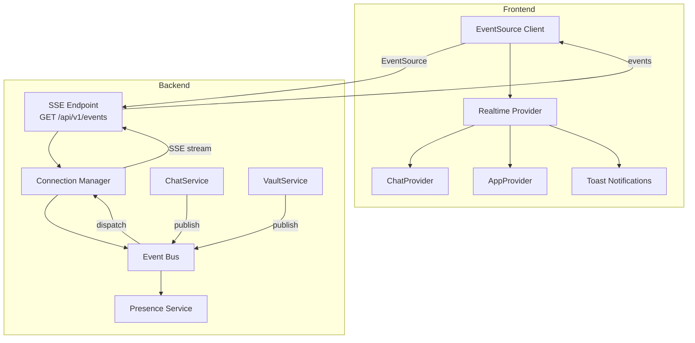

# Design Document: Realtime Infrastructure (SSE)

## Overview

This feature introduces Server-Sent Events (SSE) as a unidirectional push channel from server to client, replacing the existing polling mechanisms (30s chat polling, visibility-change refresh). The architecture adds four new backend components (SSE Endpoint, Connection Manager, Event Bus, Presence Service) and two new frontend components (EventSource Client/Realtime Provider, Toast Notification).

**Design Rationale — SSE over WebSocket:**
- HTTP-based: works through Nginx without additional configuration (`X-Accel-Buffering: no` header suffices)
- Simpler protocol: no upgrade handshake, no framing, no ping/pong at application level
- Sufficient for the use case: server-to-client push only (client continues sending via REST)
- Native browser `EventSource` API with built-in reconnection and `Last-Event-ID` support
- Fewer moving parts: no WebSocket library, no custom heartbeat protocol at transport level

**Key Constraints:**
- Maximum 3 connections per user (multi-tab support)
- Maximum 1000 total connections (configurable via `SLATEBASE_SSE_MAX_CONNECTIONS`)
- Feature toggle `realtime` (hot-type) gates the entire subsystem
- Graceful degradation: application remains fully functional via REST/polling when SSE is unavailable

## Architecture



**Data Flow:**
1. Backend service performs an action (e.g., ChatService creates a message)
2. Service calls `eventBus.publish(event)` with event type, payload, and target audience
3. Event Bus resolves which users should receive the event (authorization check)
4. Event Bus applies rate limiting/batching per user per event type
5. Connection Manager serializes the event as SSE and writes to all active connections of the target user
6. Frontend EventSource Client receives the event and dispatches it to the Realtime Provider
7. Realtime Provider updates the appropriate state (Chat, App) and/or triggers a Toast notification

**Graceful Shutdown Flow:**
1. Process receives SIGTERM/SIGINT
2. Connection Manager sends `server:shutdown` event to all clients
3. All connections are closed
4. Server shuts down

## Components and Interfaces

### Backend Components

#### IConnectionManager

Manages active SSE connections, enforces per-user and global limits, sends heartbeats, and handles cleanup.

```typescript
/** Metadata stored per active SSE connection. */
export interface ConnectionEntry {
  /** Unique connection identifier (UUID v4). */
  connectionId: string
  /** User ID of the connected client. */
  userId: string
  /** ISO 8601 timestamp when the connection was established. */
  connectedAt: string
  /** Last event ID sent on this connection (for replay). */
  lastEventId: string
  /** The writable stream (Node.js ServerResponse). */
  stream: ServerResponse
  /** Whether the connection is in draining state (being closed). */
  draining: boolean
}

export interface IConnectionManager {
  /** Register a new SSE connection. Evicts oldest if per-user limit exceeded. Returns connectionId. */
  register(userId: string, stream: ServerResponse, lastEventId?: string): string

  /** Remove a connection and clean up resources. */
  remove(connectionId: string): void

  /** Get all active connections for a user. */
  getConnectionsForUser(userId: string): ConnectionEntry[]

  /** Get all active connection entries (for broadcast). */
  getAllConnections(): ConnectionEntry[]

  /** Check if a user has at least one active connection. */
  isConnected(userId: string): boolean

  /** Get total number of active connections. */
  getConnectionCount(): number

  /** Send an SSE event to specific connections. */
  send(connectionIds: string[], event: SseEvent): void

  /** Send an SSE event to all connections of a user. */
  sendToUser(userId: string, event: SseEvent): void

  /** Broadcast an SSE event to all connected clients. */
  broadcast(event: SseEvent): void

  /** Start heartbeat timer (called once at server startup). */
  startHeartbeat(): void

  /** Graceful shutdown: send server:shutdown event and close all connections. */
  shutdown(): Promise<void>

  /** Register a callback when a user's last connection is removed. */
  onUserDisconnected(callback: (userId: string) => void): void

  /** Register a callback when a user's first connection is established. */
  onUserConnected(callback: (userId: string) => void): void
}
```

#### IEventBus

Central pub/sub system that routes events from backend services to appropriate SSE clients.

```typescript
/** Supported SSE event types. */
export type SseEventType =
  | 'chat:message'
  | 'chat:unread'
  | 'presence:update'
  | 'presence:init'
  | 'vault:change'
  | 'sync:conflict'
  | 'notification:toast'
  | 'server:shutdown'
  | 'server:feature-disabled'

/** An SSE event to be serialized and sent to clients. */
export interface SseEvent {
  type: SseEventType
  id: string
  data: Record<string, unknown>
  timestamp: string
}

/** Audience targeting for event delivery. */
export type EventTarget =
  | { kind: 'user'; userId: string }
  | { kind: 'users'; userIds: string[] }
  | { kind: 'broadcast' }

/** Options for publishing an event. */
export interface PublishOptions {
  /** Event type. */
  type: SseEventType
  /** Event payload. */
  payload: Record<string, unknown>
  /** Who should receive this event. */
  target: EventTarget
  /** Optional: exclude this userId from delivery (e.g., the sender). */
  excludeUserId?: string
}

export interface IEventBus {
  /** Publish an event to targeted users. Handles authorization, rate limiting, and batching. */
  publish(options: PublishOptions): void

  /** Get the next monotonically increasing event ID. */
  nextEventId(): string

  /** Get all events after a given event ID for a specific user (for replay on reconnect). */
  getEventsSince(userId: string, lastEventId: string): SseEvent[]
}
```

#### IPresenceService

Tracks online status based on active SSE connections with a grace period for brief disconnections.

```typescript
export interface IPresenceService {
  /** Mark a user as online (called when first SSE connection established). */
  markOnline(userId: string): void

  /** Start the offline grace period (called when last SSE connection lost). */
  startGracePeriod(userId: string): void

  /** Cancel a pending grace period (user reconnected within 60s). */
  cancelGracePeriod(userId: string): void

  /** Check if a user is currently online. */
  isOnline(userId: string): boolean

  /** Get all online user IDs. */
  getOnlineUsers(): string[]

  /** Get online users visible to a specific user (shared non-archived conversations). */
  getVisibleOnlineUsers(userId: string): Promise<Array<{ userId: string; username: string }>>

  /** Register a callback for online/offline transitions (after grace period). */
  onStatusChange(callback: (userId: string, status: 'online' | 'offline') => void): void
}
```

#### SSE Endpoint (Route Handler)

```typescript
// GET /api/v1/events
// Protected by: authMiddleware + createFeatureGuard('realtime')
// Headers: Content-Type: text/event-stream, Cache-Control: no-cache,
//          Connection: keep-alive, X-Accel-Buffering: no
// Query params: token (optional, alternative to Authorization header)
// Request headers: Last-Event-ID (optional, for replay)
```

### Frontend Components

#### EventSource Client (useEventSource hook)

```typescript
export type ConnectionStatus = 'connected' | 'connecting' | 'disconnected' | 'fallback'

export interface EventSourceConfig {
  /** Session token for authentication. */
  token: string
  /** Whether the realtime feature is enabled. */
  enabled: boolean
}

export interface UseEventSourceReturn {
  /** Current connection status. */
  status: ConnectionStatus
  /** Last received event ID (for reconnect). */
  lastEventId: string | null
}
```

#### Realtime Provider (RealtimeProvider)

React Context Provider that:
1. Manages the EventSource client lifecycle
2. Routes incoming events to the appropriate state dispatchers (ChatProvider, AppProvider)
3. Controls polling enable/disable based on connection status
4. Triggers Toast notifications for relevant events

```typescript
export interface RealtimeContextValue {
  /** Current SSE connection status. */
  connectionStatus: ConnectionStatus
}
```

#### Toast Notification Component

```typescript
export type ToastVariant = 'info' | 'success' | 'warning' | 'error'

export interface ToastItem {
  id: string
  variant: ToastVariant
  message: string
  createdAt: number
}
```

### File Structure

```
backend/src/realtime/
├── index.ts                    — Barrel export
├── types.ts                    — All interfaces and type definitions
├── errors.ts                   — SSE-specific error classes
├── connection-manager.ts       — ConnectionManager implementation
├── connection-manager.test.ts  — Unit tests
├── event-bus.ts                — EventBus implementation
├── event-bus.test.ts           — Unit tests
├── presence-service.ts         — PresenceService implementation
├── presence-service.test.ts    — Unit tests
├── event-replay-buffer.ts     — Circular buffer for event replay (Last-Event-ID)
├── event-replay-buffer.test.ts — Unit tests
└── rate-limiter.ts             — Per-user per-type rate limiter

backend/src/api/
├── sseRoutes.ts                — SSE endpoint route handler
└── sseRoutes.test.ts           — Unit tests

frontend/src/state/
├── realtimeState.ts            — Realtime reducer + types
├── realtimeContext.ts          — RealtimeProvider + useRealtimeContext hook
└── realtimeActions.ts          — Event handling logic

frontend/src/components/
├── ToastNotification.tsx       — Toast notification component
├── ToastNotification.css       — Toast styles with design tokens
└── ConnectionIndicator.tsx     — Connection status indicator
```

## Data Models

### SSE Wire Format

Each SSE message follows this format:
```
event: <type>\n
id: <monotonically-increasing-integer>\n
data: <JSON>\n
\n
```

Example:
```
event: chat:message
id: 42
data: {"type":"chat:message","payload":{"conversationId":"abc123","messageId":"msg456","senderId":"user789","senderName":"Alice","content":"Hello!","timestamp":"2024-01-15T10:30:00.000Z"},"timestamp":"2024-01-15T10:30:00.001Z"}

```

Heartbeat (SSE comment, not an event):
```
:heartbeat

```

### Event Payloads

| Event Type | Payload Fields |
|------------|---------------|
| `chat:message` | `conversationId`, `messageId`, `senderId`, `senderName`, `content`, `timestamp` |
| `chat:unread` | `totalUnread` |
| `presence:update` | `userId`, `username`, `status` ('online' or 'offline') |
| `presence:init` | `onlineUsers: [{userId, username}]` |
| `vault:change` | `vaultId`, `action` ('saved' or 'deleted' or 'renamed'), `path`, `userId`, `username` |
| `sync:conflict` | `vaultId`, `path` |
| `notification:toast` | `variant` ('info' or 'success' or 'warning' or 'error'), `message` |
| `server:shutdown` | `reason` ('shutdown') |
| `server:feature-disabled` | `reason` ('feature_disabled') |

### Event Replay Buffer

A per-user circular buffer stores the last N events (configurable, default 100) for replay on reconnect:

```typescript
interface ReplayBufferEntry {
  id: string          // Monotonic event ID
  event: SseEvent     // The full event
  timestamp: number   // Unix timestamp for TTL-based cleanup
}
```

Events older than 5 minutes are evicted regardless of buffer capacity.

### Connection Store (In-Memory)

```typescript
// Primary index: connectionId -> ConnectionEntry
Map<string, ConnectionEntry>

// Secondary index: userId -> Set<connectionId>
Map<string, Set<string>>
```

No filesystem persistence needed — connections are transient and reconstructed on reconnect.

### Rate Limiter State

```typescript
// Per user, per event type: sliding window counters
Map<string, Map<SseEventType, { count: number; windowStart: number }>>
```

### Configuration (Environment Variables)

| Variable | Default | Description |
|----------|---------|-------------|
| `SLATEBASE_SSE_MAX_CONNECTIONS` | `1000` | Maximum total simultaneous SSE connections |
| `SLATEBASE_SSE_MAX_PER_USER` | `3` | Maximum SSE connections per user |
| `SLATEBASE_SSE_HEARTBEAT_INTERVAL` | `30000` | Heartbeat interval in milliseconds |
| `SLATEBASE_SSE_REPLAY_BUFFER_SIZE` | `100` | Events to keep in replay buffer per user |
| `SLATEBASE_SSE_REPLAY_TTL` | `300000` | Replay buffer TTL in milliseconds (5 min) |
| `SLATEBASE_SSE_BATCH_WINDOW` | `100` | Batching window in milliseconds |
| `SLATEBASE_SSE_BATCH_MAX` | `20` | Maximum events per batch |

### Frontend State Extensions

#### Realtime State

```typescript
export interface RealtimeState {
  connectionStatus: ConnectionStatus
  lastEventId: string | null
  reconnectAttempts: number
}
```

#### Chat State Extensions (new actions)

```typescript
// New actions added to ChatAction union:
| { type: 'REALTIME_MESSAGE_RECEIVED'; payload: Message }
| { type: 'REALTIME_UNREAD_UPDATED'; payload: number }
| { type: 'REALTIME_CONVERSATION_PREVIEW_UPDATED'; payload: { conversationId: string; preview: string; timestamp: string } }
```

#### App State Extensions (new actions)

```typescript
// New action added to AppAction union:
| { type: 'VAULT_TREE_RELOAD_REQUESTED'; payload: { vaultId: string } }
```

### Design Tokens (CSS Custom Properties)

```css
/* Toast notification tokens */
--toast-info-bg
--toast-info-border
--toast-info-icon
--toast-success-bg
--toast-success-border
--toast-success-icon
--toast-warning-bg
--toast-warning-border
--toast-warning-icon
--toast-error-bg
--toast-error-border
--toast-error-icon

/* Connection indicator tokens */
--connection-connected
--connection-connecting
--connection-disconnected
--connection-fallback

/* Presence tokens */
--presence-online
```

All tokens defined in `:root`, `:root[data-theme="dark"]`, and `@media (prefers-color-scheme: dark)`.


## Correctness Properties

*A property is a characteristic or behavior that should hold true across all valid executions of a system — essentially, a formal statement about what the system should do. Properties serve as the bridge between human-readable specifications and machine-verifiable correctness guarantees.*

### Property 1: Event Replay Correctness

*For any* sequence of events stored in the replay buffer and *for any* valid Last-Event-ID value, `getEventsSince(userId, lastEventId)` SHALL return exactly the events with IDs strictly greater than `lastEventId`, in monotonically increasing order, and no other events.

**Validates: Requirements 1.9**

### Property 2: Per-User Connection Limit Invariant

*For any* sequence of register and remove operations on the Connection Manager, a user SHALL never have more than `maxPerUser` (default 3) simultaneous active connections. When the limit is reached and a new connection is registered, the oldest connection (by `connectedAt` timestamp) SHALL be removed from all indexes, and after any removal the removed connectionId SHALL be absent from both the primary and secondary indexes.

**Validates: Requirements 1.10, 2.1, 2.2, 2.5**

### Property 3: Global Connection Capacity Threshold

*For any* total connection count, when the count exceeds 80% of the configured maximum (`maxConnections`), new connection attempts SHALL be rejected. When the count is at or below 80%, new connections SHALL be accepted (assuming per-user limit is not exceeded).

**Validates: Requirements 2.7, 10.6**

### Property 4: SSE Serialization Round-Trip

*For any* valid `SseEvent` object (with valid type, non-empty id, arbitrary JSON-serializable payload, and ISO-8601 timestamp), serializing it to the SSE wire format and parsing it back SHALL produce an object with identical `type`, `id`, and `data` fields.

**Validates: Requirements 3.3**

### Property 5: Authorization-Based Event Routing

*For any* event published via the Event Bus with a target audience, the event SHALL be delivered only to users who are both (a) currently connected (have at least one active non-draining SSE connection) AND (b) authorized for that event type (conversation participant for chat events, vault access holder for vault events, vault owner for sync events). No unauthorized user SHALL ever receive an event.

**Validates: Requirements 3.2**

### Property 6: Presence Visibility Scoping

*For any* presence status change (online/offline) of a user, the resulting `presence:update` event SHALL be delivered only to users who share at least one non-archived conversation with the affected user. Users with no shared non-archived conversation SHALL never receive the presence update.

**Validates: Requirements 3.6, 7.5**

### Property 7: Vault Event Sender Exclusion

*For any* vault change event triggered by a user, that user SHALL NOT receive the resulting `vault:change` event, but all other users with access to the affected vault SHALL receive it.

**Validates: Requirements 3.7**

### Property 8: Per-User Per-Type Rate Limiting

*For any* user and *for any* event type, within any 1-second sliding window, at most 10 events of that type SHALL be delivered. When the limit is exceeded, only the most recent event of that type SHALL be retained and older events SHALL be discarded.

**Validates: Requirements 3.9, 10.3**

### Property 9: Exponential Backoff Bounds

*For any* reconnect attempt number N (where N >= 0), the computed reconnect delay SHALL be: `min(initialDelay * factor^N + jitter, maximumDelay)` where `initialDelay = 1000ms`, `factor = 2`, `jitter is in [-500, +500]`, and `maximumDelay = 60000ms`. The delay SHALL never be negative and SHALL never exceed 60000ms.

**Validates: Requirements 4.2**

### Property 10: Realtime Message Insertion (Active Conversation)

*For any* chat state where `currentConversation` equals a given `conversationId`, and *for any* valid message with that conversationId and a unique messageId, dispatching `REALTIME_MESSAGE_RECEIVED` SHALL result in the message appearing in `state.messages` and the messages array length increasing by exactly 1.

**Validates: Requirements 5.1**

### Property 11: Conversation Reordering (Inactive Conversation)

*For any* chat state with multiple conversations and *for any* valid message targeting a conversation that is NOT the `currentConversation`, dispatching the preview update action SHALL move the target conversation to index 0 of the conversations array with updated `lastMessagePreview` (truncated to 100 chars with ellipsis if longer) and `lastMessageTimestamp`.

**Validates: Requirements 5.2**

### Property 12: Message Deduplication (Idempotence)

*For any* chat state containing a message with ID X, dispatching a `REALTIME_MESSAGE_RECEIVED` action with the same message ID X SHALL produce a state identical to the input state (no duplicates added, no other fields changed).

**Validates: Requirements 5.9**

### Property 13: Toast Capacity Limit

*For any* sequence of toast additions, the visible toast count SHALL never exceed 5. When a 6th toast is added, the oldest toast (by `createdAt` timestamp) SHALL be removed before the new one is added.

**Validates: Requirements 6.5**

### Property 14: Presence Grace Period State Machine

*For any* user and *for any* sequence of connect/disconnect events:
- After the first connection: status SHALL be `online`
- After the last connection is closed: a 60s grace period starts
- If a new connection is established during the grace period: status SHALL remain `online` and timer SHALL be cancelled
- If the grace period expires without reconnection: status SHALL transition to `offline`

At no point SHALL a user be marked `offline` while they have at least one active connection or are within the grace period.

**Validates: Requirements 7.2**

### Property 15: Event Batching Capacity

*For any* sequence of events directed at the same user within a 100ms window, they SHALL be grouped into batches of at most 20 events each. No single batch SHALL contain more than 20 events.

**Validates: Requirements 10.2**

### Property 16: Draining Connection Exclusion

*For any* event published via the Event Bus, connections marked as `draining: true` SHALL never receive the event, regardless of the user they belong to or the event type.

**Validates: Requirements 10.5**

## Error Handling

### Backend Errors

| Scenario | Response | Behavior |
|----------|----------|----------|
| Unauthenticated request | HTTP 401 | No connection established |
| Feature disabled | HTTP 403 + `FEATURE_DISABLED` code | No connection established |
| Global connection limit reached (80%) | HTTP 503 + `Retry-After: 30` | Client retries after delay |
| Socket write error | Connection removed silently | Client detects via EventSource `error` event |
| Session invalidated during connection | SSE close event sent, then connection closed | Client gets `error`, attempts reconnect, gets 401 |
| Server shutdown | `server:shutdown` event, then close | Client reconnects with backoff |

### Frontend Error Handling

| Scenario | Behavior |
|----------|----------|
| SSE connection fails | Exponential backoff reconnect (1s, 2s, 4s, 8s, 16s) |
| 5 consecutive reconnect failures | Switch to polling fallback mode |
| 401/403 on reconnect | Stop reconnecting, set status to `disconnected` |
| Event parsing error | Log error, skip event, continue listening |
| Vault tree reload fails | Log error, keep existing state |
| Full refresh on reconnect fails | Log error, keep polling for 30s, retry |

### Error Classes

```typescript
// backend/src/realtime/errors.ts

/** Connection limit reached (global or per-user). */
export class ConnectionLimitError extends Error {
  readonly code = 'CONNECTION_LIMIT_REACHED'
  readonly retryAfter = 30
}

/** Feature is disabled. */
export class FeatureDisabledError extends Error {
  readonly code = 'FEATURE_DISABLED'
}

/** Event delivery failed (socket write error). */
export class EventDeliveryError extends Error {
  readonly connectionId: string
  constructor(connectionId: string, cause?: Error) {
    super(`Failed to deliver event to connection ${connectionId}`)
    this.connectionId = connectionId
    this.cause = cause
  }
}
```

## Testing Strategy

### Property-Based Tests (fast-check)

The following properties will be tested using `fast-check` with minimum 100 iterations each:

| Property | Location | Key Generators |
|----------|----------|---------------|
| 1: Replay correctness | `event-replay-buffer.test.ts` | Arbitrary event sequences, random Last-Event-ID |
| 2: Per-user limit | `connection-manager.test.ts` | Random register/remove operation sequences |
| 3: Global capacity | `connection-manager.test.ts` | Random multi-user register sequences |
| 4: Serialization round-trip | `event-bus.test.ts` | Arbitrary SseEvent objects |
| 8: Rate limiting | `rate-limiter.test.ts` | Random event streams with varying timestamps |
| 9: Backoff bounds | `realtimeActions.test.ts` | Random attempt numbers 0..100 |
| 10: Message insertion | `realtimeState.test.ts` | Random ChatState + valid messages |
| 11: Conversation reorder | `realtimeState.test.ts` | Random ChatState + messages for non-current conversation |
| 12: Deduplication | `realtimeState.test.ts` | Random ChatState with existing messages |
| 13: Toast capacity | `ToastNotification.test.ts` | Random toast addition sequences |
| 14: Grace period | `presence-service.test.ts` | Random connect/disconnect/timer sequences |
| 15: Batching capacity | `event-bus.test.ts` | Random event sequences within time windows |
| 16: Draining exclusion | `connection-manager.test.ts` | Random connection states + events |

Properties 5, 6, 7 require mocked data access layers (conversation stores, vault access) and will be tested with example-based integration tests with representative scenarios rather than PBT.

### Unit Tests (Example-Based)

| Component | Focus Areas |
|-----------|------------|
| `sseRoutes.ts` | Auth (401/403), headers, feature guard, heartbeat format |
| `connection-manager.ts` | Register/remove lifecycle, heartbeat timer, shutdown |
| `event-bus.ts` | Event type support, publish/subscribe, serialization |
| `presence-service.ts` | Online/offline transitions, grace period timer |
| `realtimeState.ts` | All reducer actions, edge cases |
| `realtimeContext.ts` | Provider lifecycle, polling toggle |
| `ToastNotification.tsx` | Render variants, auto-dismiss, close button, stacking |
| `ConnectionIndicator.tsx` | Status display for each connection state |

### Integration Tests

| Test | Description |
|------|-------------|
| SSE endpoint E2E | Full connection lifecycle: connect, receive events, heartbeat, disconnect |
| Chat + SSE integration | Send message via REST, verify SSE event delivered to participants |
| Feature toggle + SSE | Toggle disable leads to connections close, toggle enable leads to connections re-establish |
| Reconnect with replay | Disconnect, accumulate events, reconnect with Last-Event-ID, verify replay |

### Test Configuration

- Property-based tests: minimum 100 iterations per property
- Each property test tagged with: `Feature: realtime-infrastructure, Property {number}: {description}`
- Backend tests: `npm run test` in `backend/`
- Frontend tests: `npm run test` in `frontend/`
- PBT library: `fast-check` (already installed as devDependency in both packages)

