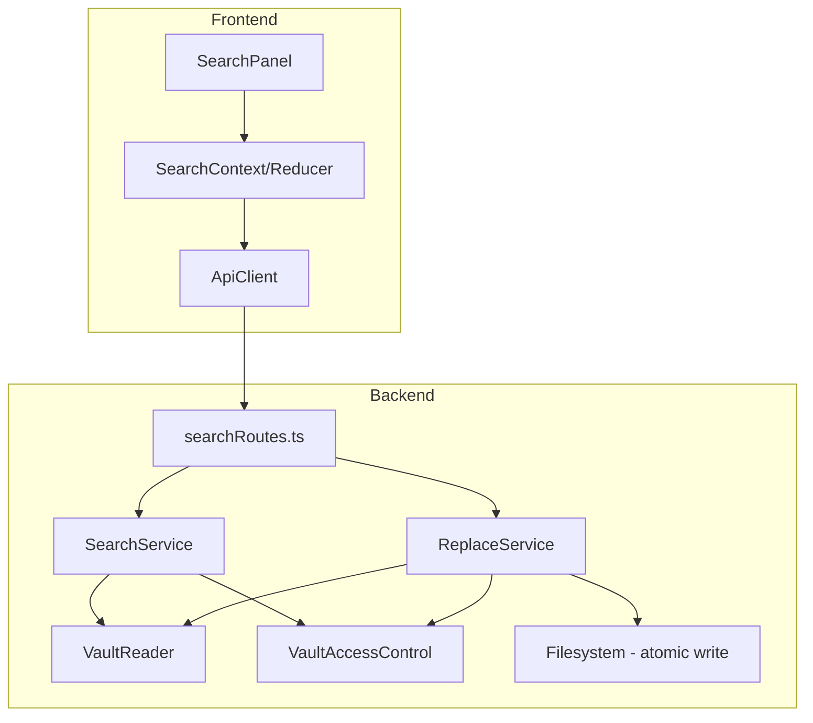
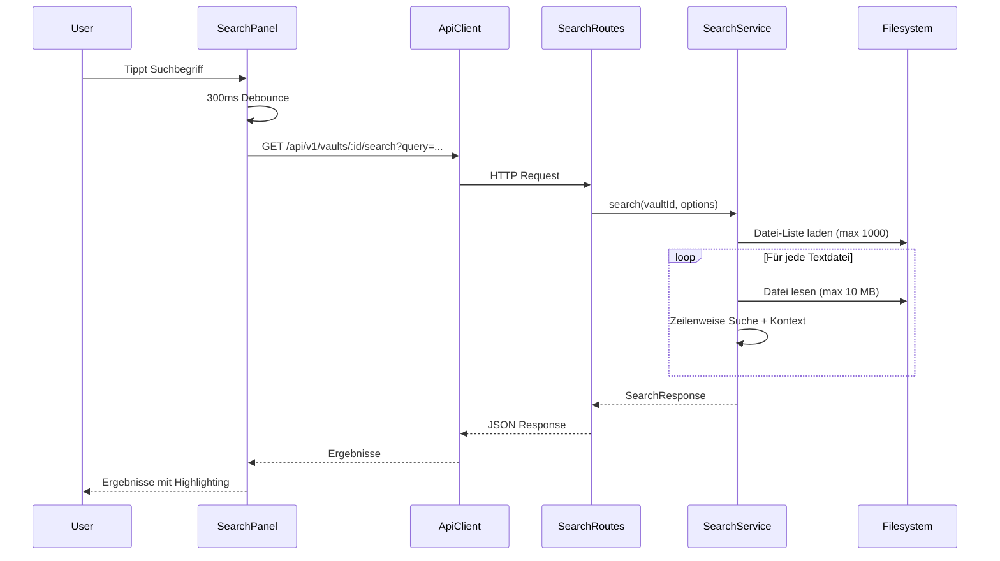
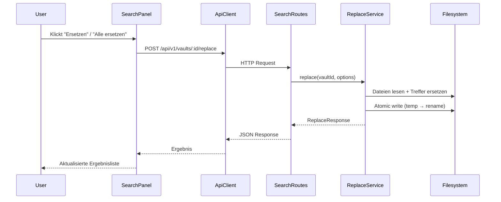

# Design Document: Search and Discovery

## Overview

Vault-weite Volltextsuche mit Find & Replace für Slatebase (Phase 1). Das System durchsucht Textdateien eines oder mehrerer Vaults nach Suchbegriffen (Plain-Text oder Regex), liefert Ergebnisse mit Kontext-Zeilen und ermöglicht gezielte oder massenhafte Textersetzung.

Das Design folgt dem bestehenden Layered-Architecture-Pattern: ein neues `search`-Modul im Backend (analog zu `chat`, `sync`, `mcp`) mit eigenem Service, eigenen Error-Klassen und Validation-Schemas. Im Frontend wird ein neuer `searchState`/`searchContext` eingeführt (analog zu `chatState`, `syncState`) sowie eine `SearchPanel`-Komponente, die den File Explorer temporär ersetzt.

### Design-Entscheidungen

1. **Kein Index / keine Datenbank für Phase 1** — Lineare Datei-Iteration mit String-Matching reicht für Vaults bis 1000 Dateien. Das MCP-Modul verwendet bereits dasselbe Pattern erfolgreich. Ein SQLite-FTS5-Index wird erst bei Performance-Bedarf (>10.000 Dateien) eingeführt.

2. **Streaming-basierte Dateiverarbeitung** — Dateien werden zeilenweise verarbeitet anstatt komplett in den Speicher geladen, um bei großen Dateien (bis 10 MB) den Memory-Footprint niedrig zu halten.

3. **Atomare Replace-Operationen** — Jede Datei-Ersetzung verwendet temp-Datei → rename (konsistent mit allen anderen Schreiboperationen im Projekt).

4. **Frontend-State als eigener Context** — `SearchProvider` mit eigenem Reducer, analog zu Chat/Sync. Kein Verschmelzen mit dem App-Reducer.

5. **Wiederverwendung der bestehenden Binary-Detection und Path-Traversal-Protection** — Kein neuer Code für diese Querschnitts-Concerns.

## Architecture

### Systemübersicht



### Datenfluss — Suche



### Datenfluss — Replace



## Components and Interfaces

### Backend — Neues Modul: `backend/src/search/`

```
backend/src/search/
├── index.ts              — Barrel export
├── types.ts              — Interfaces und Typen
├── errors.ts             — SearchTimeoutError, RegexValidationError, etc.
├── validation.ts         — Zod-Schemas für Request-Validierung
├── search-service.ts     — SearchService (Datei-Iteration + Matching)
├── replace-service.ts    — ReplaceService (Textersetzung + Atomic Write)
└── search-service.test.ts — Unit-Tests
```

#### ISearchService Interface

```typescript
export interface ISearchService {
  /**
   * Searches all text files in a vault for the given query.
   * Respects file limit (1000), time limit (30s), and result limit (500).
   */
  search(vaultId: string, options: SearchOptions): Promise<SearchResponse>;

  /**
   * Searches across multiple vaults.
   * Uses the same limits globally across all vaults.
   */
  searchMultiVault(vaultIds: string[], options: SearchOptions): Promise<MultiVaultSearchResponse>;
}

export interface SearchOptions {
  query: string;
  caseSensitive: boolean;
  regex: boolean;
  contextLines: number;
  maxResults: number;
}

export interface SearchResponse {
  results: SearchFileResult[];
  totalHits: number;
  filesSearched: number;
  truncated: boolean;
  truncationReason?: 'file_limit' | 'time_limit' | 'result_limit';
  truncationMessage?: string;
  skippedFiles: SkippedFile[];
  durationMs: number;
}

export interface SearchFileResult {
  filePath: string;
  fileName: string;
  hits: SearchHit[];
  hitCount: number;
}

export interface SearchHit {
  line: number;           // 1-based line number
  matchText: string;      // The matched text (max 200 chars)
  contextBefore: string[];  // Lines before the match
  contextAfter: string[];   // Lines after the match
  matchLine: string;      // Full line content containing the match
}

export interface SkippedFile {
  path: string;
  reason: 'binary' | 'too_large' | 'internal' | 'unreadable';
}
```

#### IReplaceService Interface

```typescript
export interface IReplaceService {
  /**
   * Replaces all occurrences of query with replacement in the specified vault.
   * Uses atomic writes (temp → rename) per file.
   * Skips files that changed since the search (based on ETag).
   */
  replace(vaultId: string, options: ReplaceOptions): Promise<ReplaceResponse>;
}

export interface ReplaceOptions {
  query: string;
  replacement: string;
  caseSensitive: boolean;
  regex: boolean;
  paths?: string[];        // Optional: restrict to specific files (max 100)
}

export interface ReplaceResponse {
  totalReplacements: number;
  fileCount: number;
  files: ReplaceFileResult[];
  failed: ReplaceFailure[];
}

export interface ReplaceFileResult {
  path: string;
  replacements: number;
}

export interface ReplaceFailure {
  path: string;
  reason: string;
}
```

#### SearchService — Constructor Dependencies

```typescript
export class SearchService implements ISearchService {
  constructor(
    private readonly vaultService: IVaultService,
    private readonly vaultAccessControl: IVaultAccessControl,
    private readonly logger: ILogger,
  ) {}
}
```

#### ReplaceService — Constructor Dependencies

```typescript
export class ReplaceService implements IReplaceService {
  constructor(
    private readonly vaultService: IVaultService,
    private readonly vaultAccessControl: IVaultAccessControl,
    private readonly logger: ILogger,
  ) {}
}
```

### Backend — API Routes: `backend/src/api/searchRoutes.ts`

```typescript
export interface SearchRouteModule {
  routes: Hono;
}

export function createSearchRoutes(
  searchService: ISearchService,
  replaceService: IReplaceService,
  vaultAccessControl: IVaultAccessControl,
  logger: ILogger,
): SearchRouteModule;
```

### Frontend — Search State: `frontend/src/state/searchState.ts`

```typescript
export interface SearchState {
  query: string;
  replacement: string;
  caseSensitive: boolean;
  regex: boolean;
  scope: 'single' | 'all';
  results: SearchFileResult[] | null;
  vaultResults: Map<string, SearchFileResult[]> | null;  // Multi-vault
  totalHits: number;
  truncated: boolean;
  truncationMessage: string | null;
  loading: boolean;
  error: string | null;
  replaceLoading: boolean;
  replaceError: string | null;
  lastReplaceResult: ReplaceResponse | null;
  activeResultId: string | null;  // Currently highlighted result
}
```

### Frontend — SearchPanel Component: `frontend/src/components/SearchPanel.tsx`

```typescript
interface SearchPanelProps {
  vaults: VaultInfo[];
  selectedVaultId: string | null;
  hasWriteAccess: boolean;
  onNavigateToResult: (vaultId: string, filePath: string, line: number) => void;
}
```

## Data Models

### API Request/Response Schemas

#### GET /api/v1/vaults/:vaultId/search

**Query Parameters:**

| Parameter | Type | Required | Default | Constraints |
|-----------|------|----------|---------|-------------|
| query | string | yes | — | 1–500 chars, not whitespace-only |
| caseSensitive | boolean | no | false | — |
| regex | boolean | no | false | — |
| contextLines | integer | no | 2 | 0–10 |
| maxResults | integer | no | 500 | 1–500 |

**Response (200):**

```json
{
  "results": [
    {
      "filePath": "notes/example.md",
      "fileName": "example.md",
      "hits": [
        {
          "line": 42,
          "matchText": "found text",
          "matchLine": "The found text is here in this line",
          "contextBefore": ["line 40 content", "line 41 content"],
          "contextAfter": ["line 43 content", "line 44 content"]
        }
      ],
      "hitCount": 3
    }
  ],
  "totalHits": 15,
  "filesSearched": 234,
  "truncated": false,
  "truncationReason": null,
  "truncationMessage": null,
  "skippedFiles": [
    { "path": "assets/image.png", "reason": "binary" }
  ],
  "durationMs": 1250
}
```

**Error Responses:**

| Status | Code | Condition |
|--------|------|-----------|
| 400 | INVALID_QUERY | Query missing, empty, too long, or invalid regex |
| 401 | UNAUTHORIZED | Not authenticated |
| 403 | ACCESS_DENIED | No read access to vault |
| 404 | VAULT_NOT_FOUND | Vault does not exist |

#### GET /api/v1/search (Multi-Vault)

**Query Parameters:**

| Parameter | Type | Required | Default | Constraints |
|-----------|------|----------|---------|-------------|
| query | string | yes | — | 1–500 chars |
| vaultIds | string | no | all accessible | Comma-separated, max 20 IDs |
| caseSensitive | boolean | no | false | — |
| regex | boolean | no | false | — |
| contextLines | integer | no | 2 | 0–10 |
| maxResults | integer | no | 500 | 1–500 |

**Response (200):**

```json
{
  "vaults": [
    {
      "vaultId": "abc123def456",
      "vaultName": "Notizen",
      "results": [ /* same as single-vault results */ ],
      "totalHits": 8
    }
  ],
  "totalHits": 23,
  "filesSearched": 512,
  "truncated": true,
  "truncationReason": "file_limit",
  "truncationMessage": "Dateilimit von 1000 erreicht. Nicht alle Dateien wurden durchsucht.",
  "failedVaults": [
    { "vaultId": "xyz789", "vaultName": "Archiv", "reason": "Vault nicht erreichbar" }
  ],
  "durationMs": 4320
}
```

#### POST /api/v1/vaults/:vaultId/replace

**Request Body:**

```json
{
  "query": "old-text",
  "replacement": "new-text",
  "caseSensitive": false,
  "regex": false,
  "paths": ["notes/file1.md", "notes/file2.md"]
}
```

| Field | Type | Required | Constraints |
|-------|------|----------|-------------|
| query | string | yes | 1–500 chars, not whitespace-only |
| replacement | string | yes | 0–5000 chars |
| caseSensitive | boolean | yes | — |
| regex | boolean | yes | — |
| paths | string[] | no | Max 100 entries |

**Response (200):**

```json
{
  "totalReplacements": 12,
  "fileCount": 3,
  "files": [
    { "path": "notes/file1.md", "replacements": 5 },
    { "path": "notes/file2.md", "replacements": 4 },
    { "path": "notes/file3.md", "replacements": 3 }
  ],
  "failed": [
    { "path": "notes/locked.md", "reason": "Datei seit letzter Suche geändert" }
  ]
}
```

**Error Responses:**

| Status | Code | Condition |
|--------|------|-----------|
| 400 | INVALID_QUERY | Query/replacement validation failed or invalid regex |
| 401 | UNAUTHORIZED | Not authenticated |
| 403 | ACCESS_DENIED | No write access to vault |
| 404 | VAULT_NOT_FOUND | Vault does not exist |

### Internal Data Structures

#### Context-Lines Merging Algorithm

When two hits are within 5 lines of each other, their context blocks are merged:

```typescript
interface MergedContextBlock {
  startLine: number;    // First line of the merged block
  endLine: number;      // Last line of the merged block
  lines: string[];      // All lines in the block
  hits: Array<{
    lineOffset: number; // Offset within the block
    matchText: string;
  }>;
}
```

#### File-Level Processing State (internal, not exposed)

```typescript
interface FileSearchState {
  filePath: string;
  absolutePath: string;
  lines: string[];
  hits: SearchHit[];
  hitCount: number;
  skipped: boolean;
  skipReason?: string;
}
```


## Correctness Properties

*A property is a characteristic or behavior that should hold true across all valid executions of a system — essentially, a formal statement about what the system should do. Properties serve as the bridge between human-readable specifications and machine-verifiable correctness guarantees.*

### Property 1: Search correctness respects case sensitivity

*For any* text file content and *for any* search query, when `caseSensitive` is `false`, a line is returned as a hit if and only if it contains the query as a case-insensitive substring. When `caseSensitive` is `true`, a line is returned as a hit if and only if it contains the query as an exact case-sensitive substring.

**Validates: Requirements 1.1, 3.1, 3.2**

### Property 2: Excluded files never appear in search results

*For any* file that is detected as binary (null bytes in first 8 KB), OR has a filename starting with `_` (internal file), OR has a size exceeding 10 MB, the file SHALL never appear in the `results` array of a search response. It SHALL instead appear in the `skippedFiles` array with the appropriate reason.

**Validates: Requirements 1.2, 10.1, 10.4**

### Property 3: Search result structure invariants

*For any* search hit returned by the service, the hit SHALL have: a non-empty relative file path, a line number ≥ 1, a `matchText` field with length ≤ 200 characters, and `contextBefore`/`contextAfter` arrays whose lengths are ≤ the configured `contextLines` value.

**Validates: Requirements 1.3**

### Property 4: Total files searched never exceeds 1000

*For any* vault or combination of vaults searched, the total number of files actually searched (as reported in `filesSearched`) SHALL never exceed 1000. When the file limit is reached, `truncated` SHALL be `true` and `truncationReason` SHALL be `'file_limit'`.

**Validates: Requirements 1.4, 2.1**

### Property 5: Total hits never exceeds maxResults

*For any* search response, the sum of all `hitCount` values across all `results` entries SHALL never exceed the configured `maxResults` parameter. When the limit is reached, `truncated` SHALL be `true` and `truncationReason` SHALL be `'result_limit'`.

**Validates: Requirements 10.3**

### Property 6: Context lines count is correct

*For any* search hit, the number of lines in `contextBefore` SHALL equal `min(contextLines, hitLineNumber - 1)` and the number of lines in `contextAfter` SHALL equal `min(contextLines, totalLinesInFile - hitLineNumber)`. At file boundaries, fewer context lines are acceptable.

**Validates: Requirements 4.1**

### Property 7: Nearby hits have merged context blocks

*For any* two consecutive hits within the same file that are fewer than `2 * contextLines + 1` lines apart (i.e., their context would overlap), the response SHALL NOT contain duplicate lines in the context. Instead, the context blocks SHALL be merged into a contiguous block.

**Validates: Requirements 4.4**

### Property 8: Multi-vault results are sorted alphabetically by vault name

*For any* multi-vault search response containing results from two or more vaults, the `vaults` array SHALL be sorted in ascending alphabetical order by `vaultName`.

**Validates: Requirements 2.2**

### Property 9: Multi-vault partial success on vault failure

*For any* multi-vault search where one or more vaults produce an error, the response SHALL contain results from all successfully searched vaults AND a `failedVaults` array listing every vault that failed, with the vault ID, name, and error reason.

**Validates: Requirements 2.4**

### Property 10: Invalid regex patterns produce an error

*For any* string that is not a valid JavaScript RegExp pattern, when submitted as a search query with `regex: true`, the service SHALL return an error response (HTTP 400) containing the regex syntax error message. No search results SHALL be returned.

**Validates: Requirements 3.4**

### Property 11: Replace produces correct substitution

*For any* text file content containing one or more occurrences of a query string, and *for any* replacement string, after applying replace: every occurrence of the query in the original content SHALL be replaced by the replacement text, and all non-matching text SHALL remain unchanged.

**Validates: Requirements 6.2**

### Property 12: Replace processes at most 100 files

*For any* replace operation where the matched files exceed 100, the service SHALL process at most 100 files. The response's `fileCount` SHALL never exceed 100.

**Validates: Requirements 7.3**

### Property 13: Replace reports partial failures correctly

*For any* replace operation where one or more files fail (e.g., unwritable, changed since search), the response SHALL contain the successful replacements in `files` AND list every failed file in `failed` with a reason. Successful replacements SHALL NOT be rolled back.

**Validates: Requirements 7.4**

## Error Handling

### Backend Error Classes (`backend/src/search/errors.ts`)

| Error Class | Condition | HTTP Status |
|-------------|-----------|-------------|
| `SearchQueryValidationError` | Query empty, too long, whitespace-only | 400 |
| `RegexValidationError` | Invalid regex pattern (includes engine error message) | 400 |
| `RegexTooLongError` | Regex pattern > 1000 chars | 400 |
| `SearchTimeoutError` | Per-file regex timeout (5s) — internal, not exposed | — |
| `ReplaceValidationError` | Replace body validation failed | 400 |
| `FileChangedError` | File ETag mismatch during replace | 409 (in failed[] list) |

### Error Mapping in Controller

```typescript
// searchRoutes.ts error mapping
if (error instanceof SearchQueryValidationError) → 400, code: 'INVALID_QUERY'
if (error instanceof RegexValidationError) → 400, code: 'INVALID_REGEX'
if (error instanceof RegexTooLongError) → 400, code: 'REGEX_TOO_LONG'
if (error instanceof ReplaceValidationError) → 400, code: 'INVALID_REPLACE'
if (error instanceof VaultNotFoundError) → 404, code: 'VAULT_NOT_FOUND'
if (error instanceof VaultAccessDeniedError) → 403, code: 'ACCESS_DENIED'
// Auth errors handled by authMiddleware: 401
```

### Graceful Degradation Strategy

1. **Unreadable files** — Logged at warn level, added to `skippedFiles` with reason `'unreadable'`, search continues
2. **Per-file regex timeout** — File is skipped after 5s, search continues to next file
3. **Global timeout** — Partial results returned with `truncated: true`
4. **Multi-vault partial failure** — Successful vaults returned, failed vaults listed in `failedVaults`
5. **Replace partial failure** — Successful files kept, failed files listed in `failed` array
6. **File changed during replace** — Individual file skipped, others continue

### Frontend Error Handling

- **Network errors** → Generic error message in SearchPanel
- **400 (validation)** → Display error message near input field (red text under input)
- **403 (access)** → Hide replace controls, show "Kein Zugriff" message
- **Timeout in flight** → AbortController cancels pending request on new search

## Testing Strategy

### Unit Tests (Example-Based)

| Component | Tests |
|-----------|-------|
| `SearchService.search()` | Happy path, empty vault, binary skip, file limit, result limit, timeout |
| `SearchService.searchMultiVault()` | Multiple vaults, partial failure, global limits |
| `ReplaceService.replace()` | Single replace, bulk replace, file changed, max files, partial failure |
| `validation.ts` | Zod schema validation for all request parameters |
| `errors.ts` | Error class construction and inheritance |
| `searchRoutes.ts` | HTTP integration: status codes, parameter parsing, error mapping |
| `SearchPanel.tsx` | Rendering states: empty, loading, results, error, replace visibility |
| `searchReducer` | State transitions for all action types |
| `searchActions.ts` | API call + dispatch sequences |

### Property-Based Tests (fast-check)

Property-based tests verify universal properties across randomized inputs. Each test runs a minimum of 100 iterations.

| Property | Test File | Strategy |
|----------|-----------|----------|
| Property 1: Search correctness | `search-service.pbt.test.ts` | Generate random file lines + queries, verify match correctness for both caseSensitive modes |
| Property 2: File exclusion | `search-service.pbt.test.ts` | Generate file metadata (size, binary, prefix), verify excluded files never in results |
| Property 3: Result structure | `search-service.pbt.test.ts` | Generate varied content, verify all structural constraints on output |
| Property 4: File limit | `search-service.pbt.test.ts` | Generate file lists of varying size, verify cap at 1000 |
| Property 5: Result limit | `search-service.pbt.test.ts` | Generate content with many matches, verify cap at maxResults |
| Property 6: Context lines | `search-service.pbt.test.ts` | Generate files with matches at boundary positions, verify context line counts |
| Property 7: Context merging | `search-service.pbt.test.ts` | Generate files with nearby matches, verify no duplicate lines |
| Property 10: Invalid regex | `search-service.pbt.test.ts` | Generate invalid regex strings, verify error response |
| Property 11: Replace correctness | `replace-service.pbt.test.ts` | Generate content + query + replacement, verify substitution correctness |
| Property 12: Replace file limit | `replace-service.pbt.test.ts` | Generate >100 file scenarios, verify cap |
| Property 13: Replace partial failure | `replace-service.pbt.test.ts` | Generate mixed success/failure scenarios, verify reporting |

**PBT Library:** fast-check (already a devDependency in both packages)

**Tag Format:** Each property test is tagged with a comment:
```typescript
// Feature: search-and-discovery, Property 1: Search correctness respects case sensitivity
```

**Configuration:** Minimum 100 iterations per property (`{ numRuns: 100 }`).

### Integration Tests

| Test | Description |
|------|-------------|
| Real filesystem search | Temp directory with actual files, verify end-to-end search |
| Atomic replace verification | Verify temp-file → rename pattern |
| Timeout behavior | Mock clock to trigger 30s timeout |
| Multi-vault with access control | Multiple vaults with different permissions |

### Test File Locations (Co-located)

```
backend/src/search/
├── search-service.test.ts      — Unit tests for SearchService
├── search-service.pbt.test.ts  — Property-based tests for SearchService
├── replace-service.test.ts     — Unit tests for ReplaceService
├── replace-service.pbt.test.ts — Property-based tests for ReplaceService
├── validation.test.ts          — Zod schema tests
└── errors.test.ts              — Error class tests

backend/src/api/
└── searchRoutes.test.ts        — Route integration tests

frontend/src/state/
└── searchState.test.ts         — Reducer + action creator tests

frontend/src/components/
└── SearchPanel.test.tsx        — Component rendering tests
```
