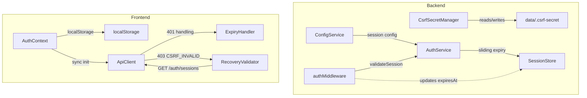

# Design Document: Session-Expiry-Fix

## Overview

This bugfix addresses four independent root causes that combine to produce frequent unexpected logouts in Slatebase. The fixes span backend (CSRF secret persistence, sliding expiry, session duration config) and frontend (localStorage migration, synchronous token restore, graceful expiry UX, CSRF mismatch recovery).

All changes stay within existing architectural patterns: filesystem-based persistence with atomic writes, interface-driven design, Zod-validated config, and the existing useReducer + Context state model.

## Architecture



## Components and Interfaces

### Component 1: CsrfSecretManager (new)

**Purpose**: Load or generate and persist a stable CSRF secret across backend restarts.

```typescript
// backend/src/auth/csrf-secret.ts

export interface ICsrfSecretManager {
  /** Load the CSRF secret (from env, file, or generate + persist). */
  loadOrCreate(): Promise<string>
}

export class CsrfSecretManager implements ICsrfSecretManager {
  constructor(
    private readonly dataDir: string,
    private readonly logger: ILogger
  ) {}

  async loadOrCreate(): Promise<string> {
    // 1. Check SLATEBASE_CSRF_SECRET env var
    // 2. If not set, try reading data/.csrf-secret
    // 3. If file not found, generate random 32-byte hex, write atomically, return
    // Secret is NEVER logged
  }
}
```

**Responsibilities**:
- Prioritize env var `SLATEBASE_CSRF_SECRET` if set
- Fall back to reading `data/.csrf-secret` file
- Generate new secret + atomic write if neither source exists
- Never log or expose the secret value

### Component 2: SessionConfig extension

**Purpose**: Make session duration and max lifetime configurable via Zod schema.

```typescript
// Addition to ServerConfigSchema in backend/src/config/index.ts

// New fields in ServerConfigSchema:
sessionDurationHours: z.number().positive().default(24)
sessionMaxLifetimeDays: z.number().positive().default(7)
```

**Env var overrides**:
- `SLATEBASE_SESSION_DURATION_HOURS` → sliding window duration (default: 24)
- `SLATEBASE_SESSION_MAX_LIFETIME_DAYS` → absolute max session lifetime (default: 7)

### Component 3: Sliding Expiry in AuthService

**Purpose**: Extend session expiry on each validated request; enforce max lifetime.

```typescript
// Modified AuthService.validateSession():

async validateSession(token: string): Promise<SessionContext | null> {
  const session = await this.sessionStore.findByToken(token)
  if (session === null) return null

  // Enforce absolute max lifetime
  const createdAt = new Date(session.createdAt).getTime()
  const maxLifetimeMs = this.maxLifetimeDays * 24 * 60 * 60 * 1000
  if (Date.now() - createdAt > maxLifetimeMs) {
    await this.sessionStore.invalidate(token)
    return null
  }

  const user = await this.userRepository.findById(session.userId)
  if (user === null) { /* ... existing logic ... */ }

  // Sliding expiry: extend expiresAt
  const now = new Date()
  const newExpiresAt = new Date(now.getTime() + this.sessionDurationMs)
  const updatedSession: Session = {
    ...session,
    lastActivity: now.toISOString(),
    expiresAt: newExpiresAt.toISOString(),
    role: user.role,
  }

  try { await this.sessionStore.update(updatedSession) } catch { /* non-critical */ }

  return { userId: user.userId, username: user.username, role: user.role, sessionId: session.sessionId }
}
```

**Key constraints**:
- `expiresAt` is recalculated on every validated request: `now + sessionDurationMs`
- `lastActivity` is updated simultaneously
- Max lifetime is measured from `createdAt` — session cannot exceed 7 days regardless of activity
- Session duration and max lifetime are injected via constructor (from config)

### Component 4: localStorage Migration (Frontend)

**Purpose**: Persist auth tokens in `localStorage` instead of `sessionStorage` to survive tab-close.

```typescript
// Modified frontend/src/state/authContext.ts

const STORAGE_KEY_TOKEN = 'slatebase_token'
const STORAGE_KEY_CSRF = 'slatebase_csrf'
const STORAGE_KEY_USER = 'slatebase_user'

function getRestoredState(): AuthState {
  // 1. Try localStorage first (new)
  // 2. If not found, try sessionStorage (migration from old format)
  //    → if found in sessionStorage, move to localStorage and clear sessionStorage
  // 3. If neither found, return initialAuthState
}

function syncStorage(state: AuthState): void {
  if (state.isAuthenticated && state.token && state.csrfToken && state.user) {
    localStorage.setItem(STORAGE_KEY_TOKEN, state.token)
    localStorage.setItem(STORAGE_KEY_CSRF, state.csrfToken)
    localStorage.setItem(STORAGE_KEY_USER, JSON.stringify(state.user))
  } else {
    localStorage.removeItem(STORAGE_KEY_TOKEN)
    localStorage.removeItem(STORAGE_KEY_CSRF)
    localStorage.removeItem(STORAGE_KEY_USER)
    // Also clean up any leftover sessionStorage keys
    sessionStorage.removeItem(STORAGE_KEY_TOKEN)
    sessionStorage.removeItem(STORAGE_KEY_CSRF)
    sessionStorage.removeItem(STORAGE_KEY_USER)
  }
}
```

**Migration strategy**:
- On first load after upgrade: if sessionStorage has keys but localStorage doesn't, copy to localStorage and clear sessionStorage
- After migration: only localStorage is used going forward
- On logout/session-expired: both storages are cleared (belt-and-suspenders)

### Component 5: Synchronous Token Restore (Frontend)

**Purpose**: Ensure ApiClient has the token BEFORE any API calls are made after page reload.

```typescript
// Modified frontend/src/App.tsx — ApiClient initialization

// Module-level singleton with synchronous token restore:
const apiClient = new ApiClient()

// Immediately restore token from localStorage (before any React render)
const storedToken = localStorage.getItem('slatebase_token')
const storedCsrf = localStorage.getItem('slatebase_csrf')
if (storedToken) apiClient.setToken(storedToken)
if (storedCsrf) apiClient.setCsrfToken(storedCsrf)
```

**Key change**: Token restore moves from a `useEffect` (async, after render) to module-level synchronous code (before first render). The `useEffect` in `AuthGuard` remains as a secondary sync mechanism for state changes during the session, but the initial restore no longer depends on it.

### Component 6: Graceful Session Expiry Handling (Frontend)

**Purpose**: Show a meaningful message instead of silently redirecting to login; preserve UI state where possible.

```typescript
// Modified authState.ts — new action type:

export type AuthAction =
  | /* ...existing... */
  | { type: 'SESSION_EXPIRED'; payload?: { message: string } }

// Modified authReducer:
case 'SESSION_EXPIRED':
  return {
    ...initialAuthState,
    error: action.payload?.message ?? 'auth.sessionExpired',
  }
```

**Frontend behavior on session expiry**:
1. `LoginPage` checks for `authState.error === 'auth.sessionExpired'` and shows a banner: "Sitzung abgelaufen — bitte erneut anmelden"
2. Before dispatching `SESSION_EXPIRED`, the current route/tab state is saved to `localStorage` key `slatebase_restore_state`
3. After re-login, the app reads `slatebase_restore_state` and restores: selected vault, open tabs, active tab
4. `slatebase_restore_state` is cleared after successful restoration or after 5 minutes (stale guard)

### Component 7: CSRF Mismatch Recovery (Frontend)

**Purpose**: On 403 `CSRF_INVALID`, verify session liveness before logging out.

```typescript
// Modified frontend/src/api/index.ts — handleResponse():

private async handleResponse<T>(response: Response): Promise<T> {
  if (response.status === 401) {
    // ... existing: trigger session expired
  }

  if (response.status === 403) {
    const body = await response.clone().json().catch(() => null)
    if (body?.code === 'CSRF_INVALID') {
      // Attempt session validation before giving up
      const isAlive = await this.checkSessionAlive()
      if (!isAlive) {
        this.token = null
        this.csrfToken = null
        if (this.onSessionExpired) this.onSessionExpired()
      }
      // Re-throw the original error either way (caller gets CSRF_INVALID)
      await handleErrorResponse(response)
    }
  }

  if (!response.ok) {
    await handleErrorResponse(response)
  }
  // ... rest unchanged
}

/**
 * Lightweight session check: GET /api/v1/auth/sessions.
 * Returns true if session is still valid (2xx), false on 401.
 */
private async checkSessionAlive(): Promise<boolean> {
  try {
    const resp = await fetch('/api/v1/auth/sessions', {
      headers: { 'Authorization': `Bearer ${this.token}` },
    })
    return resp.ok
  } catch {
    return false
  }
}
```

**Behavior**:
- On `CSRF_INVALID`: immediately fire a lightweight GET to verify session
- If GET succeeds (200): session is alive, CSRF mismatch was likely caused by backend restart → the error is re-thrown but the user is NOT logged out. UI can show a toast "Bitte Seite neu laden" or auto-refresh the CSRF token
- If GET fails (401): session is truly dead → trigger session expired flow
- `checkSessionAlive` does NOT call `this.request()` to avoid recursion — uses raw `fetch`

## Data Models

### Session (extended)

```typescript
// No schema change needed — existing Session interface already has:
// createdAt, expiresAt, lastActivity
// Sliding expiry just updates expiresAt on each validation
```

### Config Schema Extension

```typescript
// In ServerConfigSchema (backend/src/config/index.ts):
sessionDurationHours: z.number().positive().default(24),
sessionMaxLifetimeDays: z.number().positive().default(7),
```

### CSRF Secret File

- Path: `{dataDir}/.csrf-secret`
- Content: 64-character hex string (32 bytes)
- Permissions: file is written atomically (temp → rename)
- Not version-controlled (should be in `.gitignore` if dataDir is tracked)

## Error Handling

### CSRF Secret File Unreadable

**Condition**: File exists but cannot be read (permissions, corruption)
**Response**: Log error, generate new secret, overwrite file atomically
**Recovery**: All existing CSRF tokens become invalid; users must re-login (acceptable edge case)

### Session Max Lifetime Exceeded

**Condition**: `Date.now() - createdAt > maxLifetimeDays * 86400000`
**Response**: Session is invalidated server-side, 401 returned
**Recovery**: User is prompted to re-login; UI state restoration applies

### localStorage Unavailable

**Condition**: Browser in private mode or storage quota exceeded
**Response**: Fall back to sessionStorage (graceful degradation)
**Recovery**: Feature works as before the fix (tab-close loses session)

### CSRF Recovery Recursion Guard

**Condition**: `checkSessionAlive()` itself gets a 403
**Response**: Uses raw `fetch` without CSRF header (it's a GET request, no CSRF needed)
**Recovery**: No recursion possible since GET requests don't require CSRF

## Testing Strategy

### Unit Testing Approach

- `CsrfSecretManager`: test env-var precedence, file read, file generation, atomic write, error handling
- `AuthService.validateSession()`: test sliding expiry update, max lifetime enforcement, config injection
- `authContext.ts`: test localStorage/sessionStorage migration logic, cleanup on logout
- `ApiClient.handleResponse()`: test CSRF recovery flow (mock fetch responses)
- Config: test new Zod schema fields, env var overrides

### Integration Testing Approach

- Full backend: restart without SLATEBASE_CSRF_SECRET → verify existing tokens still work
- Full backend: verify session extends on activity, expires after inactivity
- Full backend: verify session hard-expires after 7 days even with activity

## Dependencies

No new dependencies required. All changes use:
- `node:fs/promises` (already used)
- `node:crypto` (already used)
- `zod` (already used)
- Native `localStorage` / `sessionStorage` (browser APIs)

## Correctness Properties

*A property is a characteristic or behavior that should hold true across all valid executions of a system — essentially, a formal statement about what the system should do. Properties serve as the bridge between human-readable specifications and machine-verifiable correctness guarantees.*

### Property 1: CSRF Secret Stability Across Restarts

*For any* backend instance that starts without `SLATEBASE_CSRF_SECRET` env var, the CSRF secret used SHALL be identical across consecutive restarts (loaded from `data/.csrf-secret`), and existing CSRF tokens SHALL remain valid.

**Validates: Requirements 1.1, 1.2**

### Property 2: Sliding Expiry Extension

*For any* session where the time since last validated request is less than `sessionDurationHours`, the session SHALL remain valid (expiresAt is extended on each validation).

**Validates: Requirements 2.1, 2.2**

### Property 3: Absolute Max Lifetime Enforcement

*For any* session where `now - createdAt > sessionMaxLifetimeDays`, the session SHALL be invalidated regardless of activity.

**Validates: Requirements 2.3**

### Property 4: Token Persistence Across Tab Close

*For any* authenticated state, closing and reopening the browser tab SHALL preserve the token in localStorage, allowing the session to continue without re-login.

**Validates: Requirements 3.1, 3.2**

### Property 5: Synchronous Token Availability

*For any* page reload where localStorage contains a valid token, the ApiClient SHALL have the token set before any API call is made (no race between render and token restore).

**Validates: Requirements 4.1, 4.2**

### Property 6: CSRF Mismatch Does Not Immediately Logout

*For any* 403 response with code `CSRF_INVALID`, the frontend SHALL NOT dispatch `SESSION_EXPIRED` if a subsequent session validation (GET) succeeds with 200.

**Validates: Requirements 6.1, 6.2**
