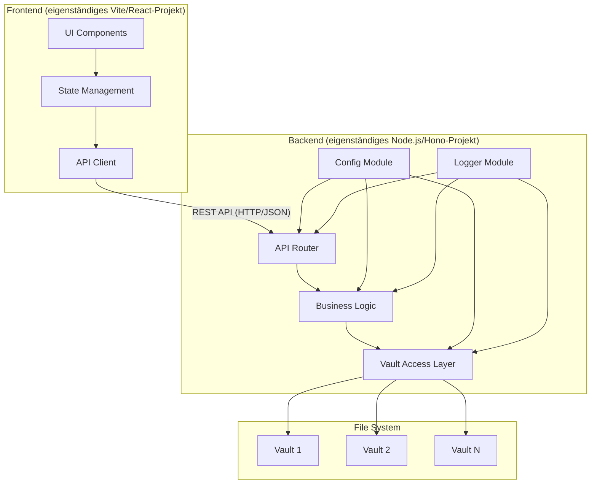

# Design Document

## Overview

Das Slatebase MVP implementiert einen selbst-gehosteten Knowledge-Context-Server für Markdown-Vaults mit einer minimalen, aber erweiterbaren Architektur. Das System besteht aus einem Backend-API-Server und einem Web-Frontend als **strikt voneinander unabhängige Komponenten**, die ausschließlich über eine REST-API kommunizieren — kein gemeinsamer Quellcode, keine gemeinsamen Abhängigkeiten.

### Kernfunktionalitäten

- **Vault-Loading**: Laden von Vault-Verzeichnissen vom lokalen Dateisystem mit konfigurierbaren Pfaden
- **Vault-Übersicht**: Anzeige aller geladenen Vaults in einer auswählbaren Liste
- **Datei-Explorer**: Hierarchische Baumansicht der Dateien und Ordner eines Vaults
- **Klartext-Anzeige**: Darstellung von Dateiinhalten als unformatierter Text

### Design-Prinzipien

1. **Strikte Komponententrennung**: Backend und Frontend sind eigenständige Projekte ohne Code-Abhängigkeiten
2. **Schnittstellen-basierte Auflösung**: Abhängigkeiten werden über definierte Interfaces aufgelöst, nie durch direkte Importe zwischen Modulen gleicher Ebene
3. **Konfigurierbarkeit**: Umgebungsvariablen haben Vorrang vor Konfigurationsdatei-Werten
4. **Robustheit**: Graceful Handling von Fehlern und Edge Cases
5. **Erweiterbarkeit**: Neue Routen und Module ohne Modifikation bestehender Komponenten

## Architecture

### Projektstruktur

Backend und Frontend sind **separate Projekte** mit eigenen `package.json`-Dateien und unabhängigen Abhängigkeiten:

```
slatebase/
├── backend/                  # Eigenständiges Node.js-Projekt
│   ├── package.json
│   ├── tsconfig.json
│   ├── .env.example
│   ├── config/
│   │   └── default.json      # Basis-Konfigurationsdatei
│   └── src/
│       ├── vault/            # Vault Access Layer
│       ├── business/         # Business Logic Layer
│       ├── api/              # API Router Layer
│       ├── config/           # Konfigurationsmodul (Zod-Validierung)
│       ├── logger/           # Logging-Modul (pino)
│       └── index.ts          # Einstiegspunkt (Kompositionswurzel)
│
└── frontend/                 # Eigenständiges React 19/Vite-Projekt
    ├── package.json
    ├── tsconfig.json
    ├── vite.config.ts
    └── src/
        ├── components/       # UI-Komponenten
        ├── state/            # Zustandsverwaltung
        ├── api/              # API-Client
        └── main.tsx          # Einstiegspunkt
```

### System-Architektur



### Dependency Injection und Schnittstellen-Auflösung

Abhängigkeiten zwischen Modulen werden **ausschließlich über Interfaces** aufgelöst. Kein Modul importiert direkt eine konkrete Implementierung eines anderen Moduls auf gleicher Ebene. Die Auflösung erfolgt über eine zentrale Kompositionswurzel (`index.ts`):

```
index.ts (Kompositionswurzel)
  └── erstellt: ConfigService (konkrete Impl., Zod-validiert)
  └── erstellt: Logger (pino-Instanz)
  └── erstellt: VaultReader (konkrete Impl., erhält Logger)
  └── erstellt: VaultManager (konkrete Impl., erhält VaultReader, Logger)
  └── erstellt: VaultService (konkrete Impl., erhält IVaultManager)
  └── erstellt: VaultController (konkrete Impl., erhält IVaultService)
  └── erstellt: Router (registriert VaultController)
  └── startet: Hono-Server (via @hono/node-server)
```

Jede Schicht kennt nur das Interface der darunterliegenden Schicht, nie die konkrete Klasse:

- `VaultController` → `IVaultService`
- `VaultService` → `IVaultManager`
- `VaultManager` → `IVaultReader`

### Modulares Routing (Anforderung 5.6)

Neue Routen-Module werden registriert, ohne bestehende Module zu modifizieren. Der Router verwendet ein **Route-Registry-Pattern**:

```typescript
// backend/src/api/router.ts
import { Hono } from 'hono'

export function createRouter(registry: RouteModule[]): Hono {
  const router = new Hono()
  for (const module of registry) {
    module.register(router)
  }
  return router
}

// backend/src/index.ts — einzige Stelle, an der Module registriert werden
const routeModules: RouteModule[] = [
  new VaultRouteModule(vaultController),
  // Neue Module hier hinzufügen, ohne router.ts zu ändern
]
app.route('/api/v1', createRouter(routeModules))
```

Jedes Routen-Modul implementiert das Interface:

```typescript
interface RouteModule {
  register(router: Hono): void
}
```

### Konfiguration und Umgebungsvariablen (Anforderung 1.4 / 5.5)

Die Konfiguration wird in zwei Schichten aufgelöst, wobei **Umgebungsvariablen immer Vorrang** haben:

```
Priorität (höchste zuerst):
  1. Umgebungsvariablen (process.env)
  2. Konfigurationsdatei (config/default.json)
  3. Eingebaute Standardwerte (Fallback)
```

**Umgebungsvariablen:**

| Variable | Typ | Beschreibung |
|---|---|---|
| `SLATEBASE_PORT` | number | Server-Port (Standard: 3000) |
| `SLATEBASE_HOST` | string | Host-Adresse (Standard: 127.0.0.1) |
| `SLATEBASE_LOG_LEVEL` | string | Log-Level: debug/info/warn/error |
| `SLATEBASE_VAULT_PATHS` | string | Komma-getrennte Vault-Pfade |
| `SLATEBASE_MAX_FILE_SIZE` | number | Max. Dateigröße in Bytes |

**Konfigurationsdatei (`config/default.json`):**

```json
{
  "port": 3000,
  "host": "127.0.0.1",
  "logLevel": "info",
  "vaults": [
    { "path": "/path/to/vault" }
  ],
  "maxFileSize": 5242880,
  "maxDirectoryDepth": 50,
  "maxVaults": 20
}
```

Das `ConfigService`-Modul führt die Auflösung durch und validiert alle Werte mit Zod:

```typescript
interface IConfigService {
  getServerConfig(): ServerConfig
  getVaultConfigs(): VaultConfig[]
}
```

Der Server wird mit `node --env-file=.env src/index.ts` gestartet. Die `.env`-Datei wird nativ von Node.js 22+ geladen — keine externe `dotenv`-Dependency nötig.

### CORS-Konfiguration

Da Frontend (z.B. Port 5173 in Entwicklung) und Backend (z.B. Port 3000) auf verschiedenen Ports laufen, konfiguriert das Backend CORS explizit:

```typescript
import { cors } from 'hono/cors'

// Erlaubte Origins aus Konfiguration
app.use('*', cors({
  origin: config.get<string[]>('allowedOrigins'),
  allowMethods: ['GET'],
  allowHeaders: ['Content-Type'],
}))
```

Konfigurierbar über `SLATEBASE_ALLOWED_ORIGINS` (komma-getrennte Liste) oder `allowedOrigins` in der Konfigurationsdatei.

### Technologie-Stack

**Backend:**
- Node.js 22+ mit TypeScript (native `--env-file` für Umgebungsvariablen)
- Hono als API-Framework (Web-Standard-APIs, TypeScript-first, eingebaute CORS-Middleware)
- Zod für Schema-Validierung (Request-Parameter, Konfiguration)
- Node.js `fs/promises` für Vault-Zugriff
- `pino` für strukturiertes Logging (JSON-basiert, performant)

**Frontend:**
- React 19 mit TypeScript
- Vite als Build-Tool und Dev-Server
- React Context + `useReducer` für State Management
- Fetch API für Backend-Kommunikation

### API-Design

Alle API-Endpunkte verwenden das Präfix `/api/v1/` für Versionierung.

**Kern-Endpunkte:**

| Methode | Pfad | Beschreibung |
|---|---|---|
| `GET` | `/api/v1/vaults` | Liste aller geladenen Vaults |
| `GET` | `/api/v1/vaults/{vaultId}/tree` | Verzeichnisstruktur eines Vaults |
| `GET` | `/api/v1/vaults/{vaultId}/files` | Dateiinhalt (Pfad als Query-Parameter) |

**Datei-Endpunkt — Pfadübertragung:**

Der Dateipfad wird als **Query-Parameter** übertragen, nicht als Path-Parameter. Das vermeidet Probleme mit URL-Encoding von Slashes, Leerzeichen und Sonderzeichen in Markdown-Dateinamen:

```
GET /api/v1/vaults/{vaultId}/files?path=Ordner%2FMeine%20Notiz.md
```

Der `path`-Parameter ist URL-encoded. Das Backend dekodiert ihn mit `decodeURIComponent()` vor der Validierung.

## Components and Interfaces

### Backend-Komponenten

#### 1. Config Module (`backend/src/config/`)

```typescript
import { z } from 'zod'

const ServerConfigSchema = z.object({
  port: z.number().int().min(1).max(65535).default(3000),
  host: z.string().default('127.0.0.1'),
  logLevel: z.enum(['debug', 'info', 'warn', 'error']).default('info'),
  vaults: z.array(z.object({
    path: z.string().min(1),
    name: z.string().max(128).optional(),
  })).default([]),
  maxFileSize: z.number().int().positive().default(5242880),
  maxDirectoryDepth: z.number().int().positive().default(50),
  maxVaults: z.number().int().positive().default(20),
  allowedOrigins: z.array(z.string()).default(['http://localhost:5173']),
})

interface IConfigService {
  getServerConfig(): ServerConfig
  getVaultConfigs(): VaultConfig[]
}

class ConfigService implements IConfigService {
  // Lädt config/default.json, überschreibt mit process.env-Werten
  // Validiert mit Zod-Schema — wirft ZodError bei ungültigen Werten
}
```

#### 2. Logger Module (`backend/src/logger/`)

```typescript
interface ILogger {
  debug(message: string, meta?: object): void
  info(message: string, meta?: object): void
  warn(message: string, meta?: object): void
  error(message: string, meta?: object): void
}

// Implementierung mit pino, Log-Level aus IConfigService
class AppLogger implements ILogger { ... }
```

#### 3. Vault Access Layer (`backend/src/vault/`)

**IVaultReader**
```typescript
interface IVaultReader {
  readDirectory(absolutePath: string, maxDepth: number): Promise<DirectoryTree>
  readFile(absolutePath: string, maxSize: number): Promise<FileContent>
}
```

**IVaultManager**
```typescript
interface IVaultManager {
  loadVaults(configs: VaultConfig[]): Promise<void>
  getVault(vaultId: string): Vault | null
  getAllVaults(): Vault[]
}
```

**Vault-ID-Generierung:**

Die `vaultId` wird als **SHA-256-Hash des absoluten, normalisierten Vault-Pfades** erzeugt (erste 12 Hex-Zeichen). Das garantiert Stabilität über Neustarts hinweg, solange der Pfad unverändert bleibt:

```typescript
function generateVaultId(absolutePath: string): string {
  return crypto.createHash('sha256')
    .update(path.normalize(absolutePath))
    .digest('hex')
    .substring(0, 12)
}
```

**Vault-Namen-Logik (Anforderungen 1.5 / 1.6):**

```typescript
function resolveVaultName(dirName: string, existingNames: Set<string>): string {
  // 1. Verzeichnisname auf 128 Zeichen begrenzen
  let baseName = dirName.substring(0, 128)
  // 2. Eindeutigkeit durch numerisches Suffix sicherstellen
  let candidate = baseName
  let counter = 2
  while (existingNames.has(candidate)) {
    candidate = `${baseName}-${counter++}`
  }
  return candidate
}
```

#### 4. Business Logic Layer (`backend/src/business/`)

```typescript
interface IVaultService {
  initializeVaults(): Promise<void>
  getVaultList(): VaultInfo[]
  getVaultTree(vaultId: string): DirectoryTree
  getFileContent(vaultId: string, filePath: string): Promise<FileContent>
}

class VaultService implements IVaultService {
  constructor(
    private readonly vaultManager: IVaultManager,
    private readonly vaultReader: IVaultReader,
    private readonly logger: ILogger,
  ) {}
  // ...
}
```

**Lade- und Caching-Strategie:**

Gemäß Anforderung 1.1 wird die Verzeichnisstruktur **beim Serverstart vollständig in den Speicher geladen** und dort gehalten. Der `DirectoryTree` wird nicht bei jedem API-Aufruf neu vom Dateisystem gelesen:

```
Serverstart:
  VaultManager.loadVaults()
    → für jeden Vault: VaultReader.readDirectory() → DirectoryTree
    → DirectoryTree wird in Vault-Objekt gespeichert (In-Memory)

GET /api/v1/vaults/{id}/tree:
  → VaultService gibt gespeicherten DirectoryTree zurück (kein FS-Zugriff)

GET /api/v1/vaults/{id}/files?path=...:
  → VaultService liest Dateiinhalt bei jedem Aufruf frisch vom FS
    (Dateiinhalte werden nicht gecacht — zu groß, zu volatil)
```

#### 5. API Router Layer (`backend/src/api/`)

```typescript
import { Hono } from 'hono'
import type { Context } from 'hono'

interface RouteModule {
  register(router: Hono): void
}

interface IVaultController {
  listVaults(c: Context): Response | Promise<Response>
  getVaultTree(c: Context): Response | Promise<Response>
  getFileContent(c: Context): Response | Promise<Response>
}

class VaultRouteModule implements RouteModule {
  constructor(private readonly controller: IVaultController) {}

  register(router: Hono): void {
    router.get('/vaults', (c) => this.controller.listVaults(c))
    router.get('/vaults/:vaultId/tree', (c) => this.controller.getVaultTree(c))
    router.get('/vaults/:vaultId/files', (c) => this.controller.getFileContent(c))
  }
}
```

### Sicherheit: Path Traversal

Der `filePath`-Query-Parameter wird vor jeder Verwendung validiert. Die Strategie:

1. **URL-Dekodierung**: `decodeURIComponent(rawPath)` — fängt doppelt-kodierte Angriffe ab
2. **Normalisierung**: `path.normalize(decodedPath)` — löst `../` und `./` auf
3. **Präfix-Prüfung**: Der normalisierte absolute Pfad muss mit dem absoluten Vault-Pfad beginnen

```typescript
function validateFilePath(vaultAbsolutePath: string, rawFilePath: string): string {
  const decoded = decodeURIComponent(rawFilePath)
  const normalized = path.normalize(decoded)
  // Absolute Pfade und Null-Bytes ablehnen
  if (path.isAbsolute(normalized) || normalized.includes('\0')) {
    throw new PathTraversalError(rawFilePath)
  }
  const resolved = path.resolve(vaultAbsolutePath, normalized)
  if (!resolved.startsWith(vaultAbsolutePath + path.sep)) {
    throw new PathTraversalError(rawFilePath)
  }
  return resolved
}
```

### Binärdaten-Erkennung

Eine Datei gilt als Binärdatei, wenn sie **Null-Bytes** enthält. Das ist eine zuverlässige, performante Heuristik für den MVP:

```typescript
function isBinaryContent(buffer: Buffer): boolean {
  // Prüfe die ersten 8 KB auf Null-Bytes
  const sampleSize = Math.min(buffer.length, 8192)
  for (let i = 0; i < sampleSize; i++) {
    if (buffer[i] === 0) return true
  }
  return false
}
```

### Frontend-Komponenten

#### 1. UI Components (`frontend/src/components/`)

**VaultList**
- Zeigt alle verfügbaren Vaults an
- Ermöglicht Vault-Auswahl
- Zeigt Hinweis bei leerer Liste

**FileExplorer**
- Hierarchische Baumansicht
- Ordner auf-/zuklappen (lokaler UI-State)
- Datei-Auswahl mit visueller Hervorhebung
- Zeigt Dateinamen und `itemCount` für Ordner

**FileViewer**
- Klartext-Anzeige in Monospace-Schriftart
- Dateiname als Überschrift
- Fehler- und Hinweismeldungen (Binärdatei, Truncation, Lesefehler)

**Hinweis:** UI-Komponenten greifen **nie direkt** auf den API-Client zu. Alle Datenzugriffe laufen ausschließlich über die Zustandsverwaltung.

#### 2. State Management (`frontend/src/state/`)

```typescript
interface AppState {
  vaults: VaultInfo[]
  selectedVaultId: string | null
  directoryTree: DirectoryTree | null
  selectedFile: FileContent | null
  loading: boolean
  error: AppError | null
}

type AppAction =
  | { type: 'VAULTS_LOADED'; payload: VaultInfo[] }
  | { type: 'VAULT_SELECTED'; payload: string }
  | { type: 'TREE_LOADED'; payload: DirectoryTree }
  | { type: 'FILE_LOADED'; payload: FileContent }
  | { type: 'LOADING_STARTED' }
  | { type: 'ERROR_OCCURRED'; payload: AppError }
```

#### 3. API Client (`frontend/src/api/`)

```typescript
interface IApiClient {
  fetchVaults(): Promise<VaultInfo[]>
  fetchVaultTree(vaultId: string): Promise<DirectoryTree>
  fetchFileContent(vaultId: string, filePath: string): Promise<FileContent>
}
```

Der `filePath` wird vor dem Senden mit `encodeURIComponent()` kodiert.

## Data Models

### Core Data Structures

```typescript
interface VaultInfo {
  id: string           // SHA-256-Hash (12 Hex-Zeichen) des normalisierten Pfades
  name: string         // Aus Verzeichnisname abgeleitet, max. 128 Zeichen, eindeutig
  path: string         // Absoluter Pfad (nur intern, nicht in API-Response)
  status: 'loaded' | 'error'
  errorMessage?: string
}

interface Vault {
  info: VaultInfo
  tree: DirectoryTree  // In-Memory-Cache der Verzeichnisstruktur
}

interface DirectoryTree {
  name: string
  type: 'directory' | 'file'
  path: string         // Relativer Pfad vom Vault-Root
  children?: DirectoryTree[]
  // Für type === 'file': Dateigröße in Bytes
  size?: number
  // Für type === 'directory': Anzahl direkt enthaltener Elemente (Dateien + Unterordner)
  itemCount?: number
}

interface FileContent {
  path: string         // Relativer Pfad vom Vault-Root
  name: string
  content: string      // UTF-8-dekodierter Text (leer wenn isBinary === true)
  size: number         // Originalgröße in Bytes
  encoding: 'utf-8'    // Immer 'utf-8' im MVP
  isBinary: boolean
  isTruncated: boolean // true wenn Datei > maxFileSize
}

interface VaultConfig {
  path: string
  name?: string        // Optionaler Override; wenn nicht gesetzt, wird Verzeichnisname verwendet
}

interface ServerConfig {
  port: number
  host: string
  logLevel: 'debug' | 'info' | 'warn' | 'error'
  vaults: VaultConfig[]
  maxFileSize: number          // Standard: 5242880 (5 MB)
  maxDirectoryDepth: number    // Standard: 50
  maxVaults: number            // Standard: 20
  allowedOrigins: string[]     // Für CORS
}
```

### Sortierung (Anforderung 3.4)

Die Sortierung (Ordner vor Dateien, alphabetisch case-insensitive) wird **im Backend** beim Aufbau des `DirectoryTree` durchgeführt. Das Frontend rendert den Tree in der gelieferten Reihenfolge ohne eigene Sortierlogik.

## Error Handling

### Strukturierte Fehlercodes

Alle API-Fehlerresponses enthalten einen maschinenlesbaren `code`:

```typescript
interface ApiError {
  code: ErrorCode
  message: string       // Menschenlesbare Beschreibung
  details?: unknown
  timestamp: string     // ISO 8601
}

type ErrorCode =
  | 'VAULT_NOT_FOUND'
  | 'FILE_NOT_FOUND'
  | 'FILE_TOO_LARGE'
  | 'FILE_IS_BINARY'
  | 'PATH_TRAVERSAL'
  | 'PERMISSION_DENIED'
  | 'CONFIGURATION_ERROR'
  | 'INTERNAL_ERROR'
```

### HTTP-Status-Codes

| Situation | HTTP-Status | ErrorCode |
|---|---|---|
| Vault nicht gefunden | 404 | `VAULT_NOT_FOUND` |
| Datei nicht gefunden | 404 | `FILE_NOT_FOUND` |
| Datei > 5 MB (Truncation) | 200 | — (isTruncated: true) |
| Path Traversal erkannt | 400 | `PATH_TRAVERSAL` |
| Fehlende Leseberechtigung | 403 | `PERMISSION_DENIED` |
| Ungültige Anfrage | 400 | `CONFIGURATION_ERROR` |
| Unerwarteter Fehler | 500 | `INTERNAL_ERROR` |

### Error Handling Strategy

**Backend:**
- Strukturierte `ApiError`-Responses bei allen Fehlern
- Logging aller Fehler mit Kontext (vaultId, filePath, Stack-Trace bei 500)
- Graceful Degradation beim Vault-Loading: Fehlerhafte Vaults werden übersprungen, Server startet mit den verbleibenden

**Frontend:**
- Fehlercodes werden auf benutzerfreundliche Meldungen gemappt
- Fallback-UI für alle Fehlerzustände
- Kein automatischer Retry im MVP

## Logging

Das Backend verwendet `pino` für strukturiertes JSON-Logging. Der Log-Level wird aus der Konfiguration geladen (Umgebungsvariable `SLATEBASE_LOG_LEVEL` hat Vorrang).

**Log-Ereignisse:**

| Ereignis | Level | Inhalt |
|---|---|---|
| Server gestartet | info | Port, Host |
| Vault geladen | info | vaultId, Name, Pfad, Dateianzahl |
| Vault-Ladefehler | error | Pfad, Fehlerursache |
| Kein Vault konfiguriert | warn | — |
| Datei gelesen | debug | vaultId, filePath, Größe |
| Path Traversal erkannt | warn | vaultId, rawPath |
| Unerwarteter Fehler | error | Stack-Trace |

## Testing Strategy

### Unit Testing

**Backend Tests:**
- `ConfigService`: Precedence-Logik (Env > Datei > Default), Vault-Namen-Deduplication
- `VaultManager`: Vault-Loading, ID-Generierung, Fehlerbehandlung bei nicht existierenden Pfaden
- `VaultReader`: `readDirectory` mit Tiefenbegrenzung, `readFile` mit Truncation
- `validateFilePath`: Path-Traversal-Angriffe, Null-Bytes, absolute Pfade
- `isBinaryContent`: Null-Byte-Erkennung
- `VaultService`: Business-Logik, Fehlerweiterleitung
- `VaultController`: Request/Response-Handling, HTTP-Status-Codes

**Frontend Tests:**
- UI-Komponenten: Rendering, User Interactions (Ordner auf-/zuklappen, Datei-Auswahl)
- State Management: State-Transitionen für alle `AppAction`-Typen
- API Client: HTTP-Requests, Fehlerbehandlung, `encodeURIComponent`-Kodierung

### Integration Testing

- End-to-End API Tests mit echten Vault-Verzeichnissen
- Path-Traversal-Tests gegen die laufende API
- CORS-Tests

### Test Data

- Mock Vault-Strukturen mit verschiedenen Szenarien
- Test-Dateien mit UTF-8-Sonderzeichen und Umlauten
- Edge Cases: leere Vaults, Dateien exakt an der 5-MB-Grenze, Tiefe 50, Binärdateien, Dateinamen mit Leerzeichen und Sonderzeichen

### Testing Tools

- **Backend**: Vitest für Unit Tests, Hono Testing Helper (`app.request()`) für API Tests
- **Frontend**: Vitest + React Testing Library
- **E2E**: Playwright

### Why Property-Based Testing Is Not Applied

Property-based testing ist für dieses Feature nicht angemessen, da es sich hauptsächlich um:

1. **File System Operations** handelt — Das Lesen von Verzeichnissen und Dateien ist deterministisches I/O ohne komplexe Transformationslogik
2. **UI Rendering und Layout** — Die Darstellung von Baumansichten und Klartext ist besser mit Snapshot-Tests und visuellen Regressionstests abgedeckt
3. **Simple CRUD Operations** — Vault-Verwaltung ohne komplexe Geschäftslogik oder Datenverarbeitung
4. **Configuration Validation** — Schema-Validierung und beispielbasierte Tests sind hier angemessener

Stattdessen fokussiert die Teststrategie auf:
- **Unit Tests** für spezifische Szenarien und Edge Cases
- **Integration Tests** für File System und API-Interaktionen
- **Snapshot Tests** für UI-Komponenten
- **Schema Validation Tests** für Konfiguration
