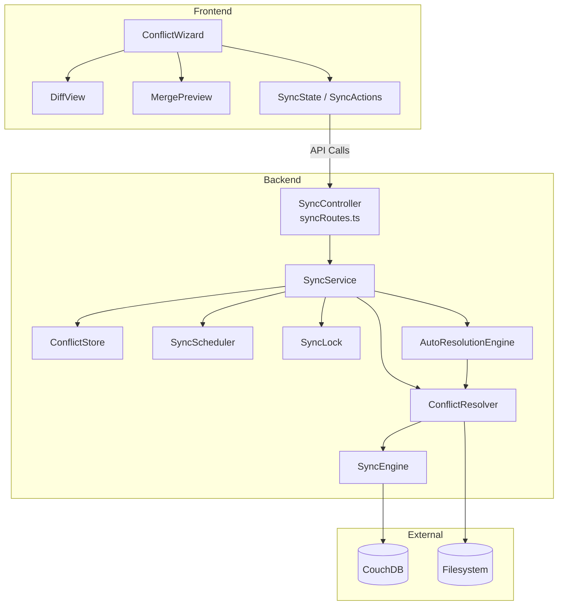

# Design Document: Sync Conflict Resolution

## Overview

Das Sync-Konfliktsystem wird um einen halbautomatischen Workflow erweitert, der Konflikte kategorisiert, eine Diff-Ansicht für Content-Konflikte bietet, Batch-Auflösung unterstützt, konfigurierbare Auto-Resolution-Strategien bereitstellt und den Benutzer durch einen mehrstufigen Wizard-Dialog führt. Die Lösung erweitert die bestehende `ConflictEntry`-Struktur und den `SyncService` ohne Breaking Changes.

### Design-Entscheidungen

| Entscheidung | Begründung |
|---|---|
| Myers-Diff läuft client-seitig | Kein Backend-Roundtrip für Diffs, keine externe Dependency (reiner Algorithmus im Frontend) |
| Auto-Resolution evaluiert server-seitig | Funktioniert auch bei Intervall-Syncs ohne offenes Frontend |
| `ConflictEntry` wird um `category` erweitert (backward-compat) | Bestehende Konflikte ohne Kategorie werden als `content_conflict` behandelt |
| Batch-Operationen sequentiell | Vermeidet Race Conditions mit dem `SyncLock` (In-Memory Mutex, single-threaded) |
| Merge via Frontend-Textarea | Kein serverseitiger Merge-Algorithmus nötig, Benutzer hat volle Kontrolle |
| Scheduler pausiert während Wizard offen | Neues `pause(vaultId)`/`resume(vaultId)` API-Signal vom Frontend |
| Rollback: lokale Datei wird bei CouchDB-Push-Fehler wiederhergestellt | Atomare Semantik — kein inkonsistenter Zustand |

---

## Architecture

### High-Level Component Diagram



### Integration Points

1. **Frontend → Backend**: Neue REST-Endpoints in `syncRoutes.ts` für kategorisierte Konflikte, Batch-Resolution, Auto-Resolution-Konfiguration, Scheduler-Pause/Resume, und Datei-Inhalt-Abruf (für Diff)
2. **SyncService → ConflictResolver**: Neues Modul kapselt die atomare Auflösungslogik (lokal schreiben → CouchDB push → ggf. Rollback)
3. **SyncService → AutoResolutionEngine**: Evaluiert konfigurierte Strategien bei jedem Sync-Lauf
4. **Frontend SSE**: Bestehender `sync:conflict` Event-Typ wird um `category`-Feld erweitert
5. **SyncScheduler**: Neue `pause(vaultId)`/`resume(vaultId)` Methoden

---

## Components and Interfaces

### Backend: Neue/Erweiterte Module

#### ConflictResolver (neu: `backend/src/sync/conflict-resolver.ts`)

```typescript
export interface IConflictResolver {
  /**
   * Resolves a single conflict atomically:
   * 1. Backup local file
   * 2. Write resolution content to local file
   * 3. Push to CouchDB
   * 4. On CouchDB failure: rollback local file from backup
   */
  resolve(params: ResolveParams): Promise<ResolveResult>

  /**
   * Resolves multiple conflicts sequentially.
   * Continues on individual failures.
   */
  resolveBatch(params: BatchResolveParams): Promise<BatchResolveResult>
}

export interface ResolveParams {
  vaultId: string
  vaultPath: string
  documentPath: string
  resolution: ConflictResolutionAction
  connection: SyncConnectionParams
  e2eEnabled: boolean
  e2ePassphrase?: string
}

export interface ResolveResult {
  success: boolean
  error?: string
}

export interface BatchResolveParams {
  vaultId: string
  vaultPath: string
  conflicts: Array<{ documentPath: string; resolution: ConflictResolutionAction }>
  connection: SyncConnectionParams
  e2eEnabled: boolean
  e2ePassphrase?: string
}

export interface BatchResolveResult {
  total: number
  succeeded: number
  failed: number
  errors: Array<{ documentPath: string; error: string }>
}
```

#### AutoResolutionEngine (neu: `backend/src/sync/auto-resolution-engine.ts`)

```typescript
export interface IAutoResolutionEngine {
  /**
   * Evaluates auto-resolution strategy for a conflict.
   * Returns the resolution action or null if no strategy configured/enabled.
   */
  evaluate(conflict: CategorizedConflictEntry, config: AutoResolutionConfig): ConflictResolutionAction | null
}

export interface AutoResolutionConfig {
  enabled: boolean
  strategies: Partial<Record<ConflictCategory, AutoResolutionStrategy>>
}

export type AutoResolutionStrategy = 'newer_wins' | 'remote_wins' | 'local_wins' | 'skip'
```

#### SyncScheduler Erweiterung

```typescript
// Neue Methoden auf ISyncScheduler
export interface ISyncScheduler {
  // ... bestehende Methoden ...

  /** Pauses the scheduler for a vault (wizard open). Timer stays registered but callbacks are skipped. */
  pause(vaultId: string): void

  /** Resumes the scheduler for a vault (wizard closed). */
  resume(vaultId: string): void

  /** Checks whether the scheduler is paused for a vault. */
  isPaused(vaultId: string): boolean
}
```

#### SyncService Erweiterung

```typescript
// Neue Methoden auf ISyncService
export interface ISyncService {
  // ... bestehende Methoden ...

  /** Returns categorized conflicts with enriched metadata. */
  getCategorizedConflicts(vaultId: string): Promise<CategorizedConflictEntry[]>

  /** Resolves a conflict with full content (manual merge). */
  resolveConflictWithContent(vaultId: string, documentPath: string, content: string): Promise<void>

  /** Resolves multiple conflicts in batch. */
  resolveConflictBatch(vaultId: string, resolutions: Array<{ documentPath: string; resolution: ConflictResolution }>): Promise<BatchResolveResult>

  /** Gets file content for diff view (local or remote). */
  getFileContent(vaultId: string, documentPath: string, source: 'local' | 'remote'): Promise<string | null>

  /** Gets/sets auto-resolution configuration. */
  getAutoResolutionConfig(vaultId: string): Promise<AutoResolutionConfig>
  setAutoResolutionConfig(vaultId: string, config: AutoResolutionConfig): Promise<void>

  /** Pauses scheduler (wizard open). */
  pauseScheduler(vaultId: string): void

  /** Resumes scheduler (wizard closed). */
  resumeScheduler(vaultId: string): void
}
```

### Frontend: Neue Komponenten

#### ConflictWizard (ersetzt `ConflictResolutionView`)

```
components/conflict-wizard/
├── index.ts                    — Barrel export
├── types.ts                    — Wizard-spezifische Typen
├── ConflictWizard.tsx          — Hauptkomponente (3-Schritt-Dialog)
├── ConflictWizard.css          — Styles
├── WizardOverview.tsx          — Schritt 1: Kategorien + Badges
├── WizardCategoryDetail.tsx    — Schritt 2: Konflikte einer Kategorie
├── WizardResolution.tsx        — Schritt 3: Diff/Preview/Aktion
├── DiffView.tsx                — Side-by-Side / Unified Diff
├── MergePreview.tsx            — Vorschau + editierbarer Merge
├── BatchActions.tsx            — Batch-Auflösung UI
└── diff-utils.ts               — Myers-Diff Algorithmus (pure functions)
```

---

## Data Models

### Backend: Erweiterte/Neue Typen

```typescript
/** Conflict category classification. */
export type ConflictCategory = 'content_conflict' | 'local_deleted' | 'remote_deleted' | 'rename_conflict'

/**
 * Extended ConflictEntry with category field.
 * Backward-compatible: existing entries without category are treated as 'content_conflict'.
 */
export interface CategorizedConflictEntry extends ConflictEntry {
  /** Conflict category. Defaults to 'content_conflict' for legacy entries. */
  category: ConflictCategory
  /** Content hash of local file (for rename detection). */
  localContentHash?: string
  /** Content hash of remote file (for rename detection). */
  remoteContentHash?: string
}

/** Resolution action including manual merge content. */
export type ConflictResolutionAction =
  | { type: 'use_remote' }
  | { type: 'use_local' }
  | { type: 'skip' }
  | { type: 'manual_merge'; content: string }

/** Auto-resolution configuration persisted per vault. */
export interface AutoResolutionConfig {
  /** Master toggle (default: false). */
  enabled: boolean
  /** Strategy per conflict category. Unconfigured categories use default recommendations. */
  strategies: Partial<Record<ConflictCategory, AutoResolutionStrategy>>
}

export type AutoResolutionStrategy = 'newer_wins' | 'remote_wins' | 'local_wins' | 'skip'

/** Auto-resolution log entry extension. */
export interface AutoResolvedLogDetail {
  documentPath: string
  category: ConflictCategory
  strategy: AutoResolutionStrategy
  resolution: 'use_remote' | 'use_local' | 'skip'
  success: boolean
  error?: string
}

/** Batch resolve result. */
export interface BatchResolveResult {
  total: number
  succeeded: number
  failed: number
  errors: Array<{ documentPath: string; error: string }>
}
```

### Frontend: Wizard State

```typescript
/** Wizard step type. */
export type WizardStep = 'overview' | 'category_detail' | 'resolution'

/** Wizard local state (managed via useReducer within ConflictWizard). */
export interface ConflictWizardState {
  step: WizardStep
  selectedCategory: ConflictCategory | null
  selectedConflict: CategorizedConflictEntry | null
  conflicts: CategorizedConflictEntry[]
  resolvedCount: number
  totalCount: number
  checkedPaths: Set<string>
  currentPage: number
  isBatchProcessing: boolean
  batchResult: BatchResolveResult | null
  diffViewMode: 'side-by-side' | 'unified'
  localContent: string | null
  remoteContent: string | null
}
```

### API Endpoints (Neue/Erweiterte Routes)

| Method | Path | Beschreibung |
|--------|------|---|
| GET | `/vaults/:vaultId/sync/conflicts/categorized` | Kategorisierte Konflikte abrufen |
| POST | `/vaults/:vaultId/sync/conflicts/resolve-batch` | Batch-Auflösung |
| POST | `/vaults/:vaultId/sync/conflicts/resolve-merge` | Manuelle Merge-Auflösung (mit Content) |
| GET | `/vaults/:vaultId/sync/conflicts/file-content` | Datei-Inhalt für Diff (query: `path`, `source=local|remote`) |
| GET | `/vaults/:vaultId/sync/auto-resolution` | Auto-Resolution-Config lesen |
| PUT | `/vaults/:vaultId/sync/auto-resolution` | Auto-Resolution-Config schreiben |
| POST | `/vaults/:vaultId/sync/scheduler/pause` | Scheduler pausieren |
| POST | `/vaults/:vaultId/sync/scheduler/resume` | Scheduler fortsetzen |

### Auto-Resolution Config Persistenz

```
data/sync/<vaultId>/auto-resolution.json
```

```json
{
  "enabled": false,
  "strategies": {
    "content_conflict": "newer_wins",
    "local_deleted": "remote_wins",
    "remote_deleted": "local_wins",
    "rename_conflict": "remote_wins"
  }
}
```

### Diff Algorithm (Frontend)

Myers-Diff Implementierung als reine Funktion in `diff-utils.ts`:

```typescript
export interface DiffHunk {
  type: 'equal' | 'insert' | 'delete'
  lines: string[]
  oldStart: number
  newStart: number
}

/** Computes line-level diff between two texts using Myers algorithm. */
export function computeDiff(oldText: string, newText: string): DiffHunk[]

/** Determines if a file is text-diffable based on extension. */
export function isTextFile(filePath: string): boolean

/** Groups equal lines for collapsing (context: 3 lines above/below changes). */
export function groupHunks(hunks: DiffHunk[], contextLines?: number): GroupedHunk[]
```

---

## Correctness Properties

*A property is a characteristic or behavior that should hold true across all valid executions of a system — essentially, a formal statement about what the system should do. Properties serve as the bridge between human-readable specifications and machine-verifiable correctness guarantees.*

### Property 1: Conflict categorization is deterministic and correct

*For any* pair of local and remote file states, the categorization function SHALL produce exactly one of `content_conflict`, `local_deleted`, `remote_deleted`, or `rename_conflict` based on the following rules: both modified → `content_conflict`; local absent & remote present → `local_deleted`; remote absent & local present → `remote_deleted`; same content hash at different paths → `rename_conflict`.

**Validates: Requirements 1.1**

### Property 2: Diff round-trip (Myers algorithm correctness)

*For any* two text strings A and B, applying the computed diff hunks to A SHALL reconstruct B exactly. Conversely, the union of deleted lines and equal lines SHALL exactly reproduce A.

**Validates: Requirements 2.2**

### Property 3: Binary file detection consistency

*For any* file path, `isTextFile(path)` SHALL return `true` if and only if the file extension is in the defined text-extension list (`.md`, `.txt`, `.json`, `.csv`, `.yaml`, `.yml`, `.xml`, `.html`, `.css`, `.js`, `.ts`). All other extensions SHALL return `false`.

**Validates: Requirements 2.6**

### Property 4: Batch resolution processes all items with partial failure isolation

*For any* list of N conflicts submitted for batch resolution, the service SHALL attempt resolution on all N items sequentially. The result SHALL satisfy: `succeeded + failed = total = N`, and each failed item SHALL retain its conflict entry in the store while each succeeded item SHALL be removed.

**Validates: Requirements 3.4**

### Property 5: Auto-resolution strategy evaluation is deterministic

*For any* conflict with timestamps `localModifiedAt` and `remoteModifiedAt`:
- `newer_wins` → picks the version with the later timestamp; on identical timestamps, picks `remote`
- `remote_wins` → always picks `remote`
- `local_wins` → always picks `local`
- `skip` → always returns `skip`

**Validates: Requirements 4.1**

### Property 6: Auto-resolution logging invariant

*For any* conflict that is auto-resolved (whether successfully or not), a log entry SHALL be written containing the `auto_resolved` marker, the applied strategy name, the conflict category, and the success/failure status.

**Validates: Requirements 4.4, 4.6**

### Property 7: Atomic resolution with rollback

*For any* conflict resolution where the local file write succeeds but the CouchDB push fails, the local file SHALL be restored to its exact content before the resolution attempt, and the conflict SHALL remain in the conflict store as unresolved.

**Validates: Requirements 5.5, 5.6**

### Property 8: Progress indicator correctness

*For any* wizard state with N total conflicts and M resolved (0 ≤ M ≤ N), the progress indicator SHALL display exactly `"M/N Konflikte gelöst"`.

**Validates: Requirements 6.2**

### Property 9: Pagination invariant

*For any* conflict list with N items in a single category where N > 50, the pagination SHALL produce `ceil(N/50)` pages, each containing at most 50 items, and the union of all pages SHALL equal the complete list.

**Validates: Requirements 6.7**

### Property 10: Batch size limit enforcement

*For any* selection of K conflicts for batch operation, the system SHALL reject the batch if K > 100 and proceed if K ≤ 100.

**Validates: Requirements 6.8**

### Property 11: Scheduler pause invariant

*For any* vault where the scheduler is in paused state (wizard open signal active), scheduled sync callbacks SHALL NOT execute until the resume signal is received.

**Validates: Requirements 6.9**

### Property 12: Conflict grouping count invariant

*For any* list of categorized conflicts, the sum of all category group sizes SHALL equal the total conflict count, and each conflict SHALL appear in exactly one group.

**Validates: Requirements 1.2**

---

## Error Handling

### Backend Error Classes (neu in `sync/errors.ts`)

| Error | HTTP Status | Beschreibung |
|---|---|---|
| `ConflictNotFoundError` | 404 | Konflikt für angegebenen Pfad nicht gefunden |
| `BatchLimitExceededError` | 400 | Mehr als 100 Konflikte für Batch selektiert |
| `FileContentUnavailableError` | 404 | Datei-Inhalt nicht abrufbar (gelöscht oder CouchDB-Fehler) |
| `SchedulerAlreadyPausedError` | 409 | Scheduler bereits pausiert |
| `AutoResolutionConfigError` | 400 | Ungültige Auto-Resolution-Konfiguration |

### Rollback-Strategie

```
resolve():
  1. backupContent = readFile(localPath)
  2. writeFile(localPath, resolvedContent)
  3. try:
       pushToCouchDB(documentPath, resolvedContent)
       removeConflict(documentPath)
     catch:
       writeFile(localPath, backupContent)  // Rollback
       logError("CouchDB push failed, rolled back local file")
       throw ConflictResolutionError
```

### Batch Error Isolation

Bei Batch-Operationen wird jeder Konflikt in einem eigenen try/catch verarbeitet. Ein Fehler bei Datei A stoppt nicht die Verarbeitung von Datei B. Das Ergebnis-Objekt enthält alle Erfolge und Fehler.

### Frontend Error Handling

- Netzwerkfehler: Toast-Notification mit Retry-Hinweis
- Batch-Teilerfolg: Ergebnis-Dialog zeigt Erfolge + Fehler mit Details
- SSE-Disconnect während Wizard: Reconnect + Konfliktliste refreshen
- `extractErrorMessage(err, fallback)` Pattern für alle catch-Blöcke

---

## Testing Strategy

### Unit Tests (Backend)

| Modul | Fokus |
|---|---|
| `conflict-resolver.test.ts` | Atomare Auflösung, Rollback bei CouchDB-Fehler, Batch-Verarbeitung |
| `auto-resolution-engine.test.ts` | Strategie-Evaluation (newer_wins inkl. Tie, remote_wins, local_wins, skip) |
| `conflict-categorizer.test.ts` | Kategorisierungslogik (alle 4 Kategorien + Edge Cases) |
| `sync-scheduler.test.ts` | Pause/Resume-Semantik |
| `sync-service.test.ts` (Erweiterung) | Neue Methoden: getCategorizedConflicts, resolveConflictBatch, Auto-Resolution-Flow |

### Unit Tests (Frontend)

| Modul | Fokus |
|---|---|
| `diff-utils.test.ts` | Myers-Diff Korrektheit, isTextFile(), groupHunks() |
| `ConflictWizard.test.tsx` | 3-Schritt-Navigation, Progress-Indikator, Pagination |
| `DiffView.test.tsx` | Side-by-Side / Unified Rendering, Binary-Fallback |
| `MergePreview.test.tsx` | Textarea editierbar, Bestätigen/Abbrechen |
| `BatchActions.test.tsx` | Checkbox-Selektion, Limit-Validierung, Confirmation |

### Property-Based Tests

PBT-Bibliothek: **fast-check** (bereits als Dev-Dependency verfügbar im Frontend, für Backend ebenfalls)

Konfiguration: Minimum 100 Iterationen pro Property-Test.

| Property | Modul | Tag |
|---|---|---|
| Property 1 (Categorization) | Backend `conflict-categorizer.test.ts` | Feature: sync-conflict-resolution, Property 1: Conflict categorization is deterministic and correct |
| Property 2 (Diff round-trip) | Frontend `diff-utils.test.ts` | Feature: sync-conflict-resolution, Property 2: Diff round-trip |
| Property 3 (Binary detection) | Frontend `diff-utils.test.ts` | Feature: sync-conflict-resolution, Property 3: Binary file detection consistency |
| Property 4 (Batch isolation) | Backend `conflict-resolver.test.ts` | Feature: sync-conflict-resolution, Property 4: Batch resolution processes all items |
| Property 5 (Strategy eval) | Backend `auto-resolution-engine.test.ts` | Feature: sync-conflict-resolution, Property 5: Auto-resolution strategy evaluation |
| Property 6 (Auto-log) | Backend `auto-resolution-engine.test.ts` | Feature: sync-conflict-resolution, Property 6: Auto-resolution logging invariant |
| Property 7 (Rollback) | Backend `conflict-resolver.test.ts` | Feature: sync-conflict-resolution, Property 7: Atomic resolution with rollback |
| Property 8 (Progress) | Frontend `ConflictWizard.test.tsx` | Feature: sync-conflict-resolution, Property 8: Progress indicator correctness |
| Property 9 (Pagination) | Frontend `ConflictWizard.test.tsx` | Feature: sync-conflict-resolution, Property 9: Pagination invariant |
| Property 10 (Batch limit) | Backend `conflict-resolver.test.ts` | Feature: sync-conflict-resolution, Property 10: Batch size limit enforcement |
| Property 11 (Scheduler pause) | Backend `sync-scheduler.test.ts` | Feature: sync-conflict-resolution, Property 11: Scheduler pause invariant |
| Property 12 (Grouping) | Frontend `ConflictWizard.test.tsx` | Feature: sync-conflict-resolution, Property 12: Conflict grouping count invariant |

### Integration Tests

- End-to-End Conflict-Resolution-Flow mit Mock-CouchDB
- Auto-Resolution während Intervall-Sync
- Scheduler Pause/Resume via API
- SSE-Notification bei neuen Konflikten während Wizard-Session
