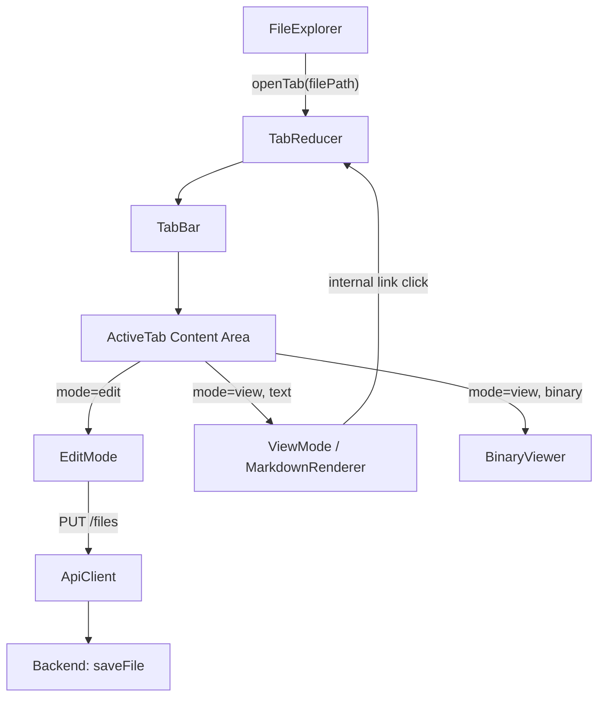
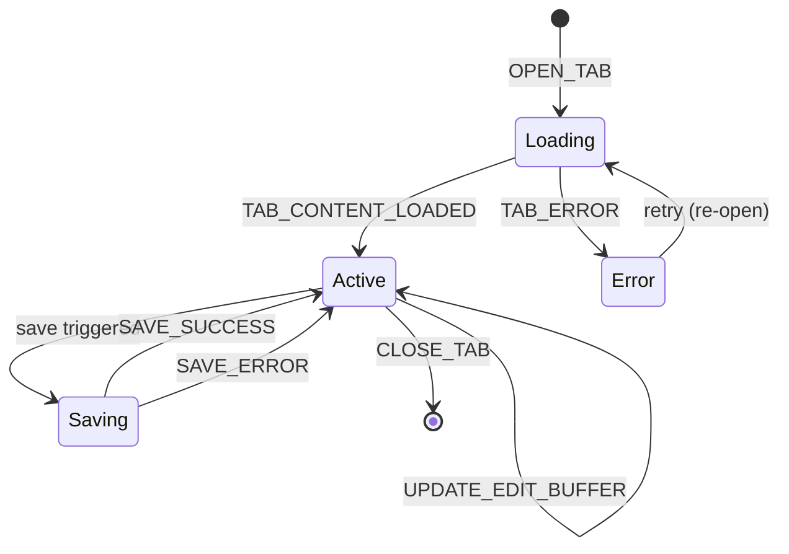
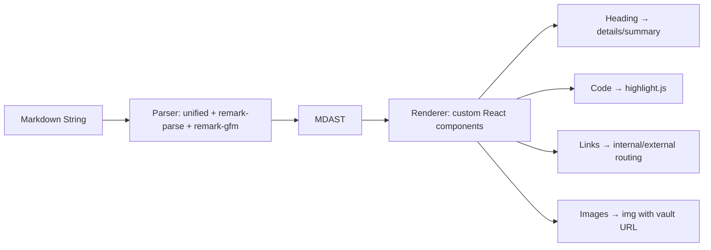

# Design Document: Tabbed Editor/Viewer

## Overview

This feature replaces the existing single-file `FileViewer` component with a tab-based system that supports multiple simultaneously open files. Each tab maintains its own mode state (edit or view) and content buffer. The system introduces:

- A **TabBar** component managing open tabs with activation, closing, and mode switching
- An **EditMode** component providing a plain-text editor with save/cancel actions
- A **ViewMode** component rendering Markdown (CommonMark + GFM) with collapsible headings, syntax highlighting, and link handling
- A **BinaryViewer** sub-component for image preview and non-displayable file notices
- A backend **PUT endpoint** for persisting file changes with path traversal protection

The existing `FileViewer` component is retired. The `FileExplorer` click handler is updated to dispatch a tab-open action instead of the current `FILE_LOADED` action.

## Architecture



### State Architecture

The tab system uses a **dedicated tab reducer** (`tabReducer`) separate from the existing `appReducer`. This keeps concerns isolated — the app reducer handles vault/tree selection, while the tab reducer manages open tabs, active tab, mode, and edit buffers.

A new `TabProvider` context wraps the content area and exposes `tabState` and `tabDispatch`. The `FileExplorer` dispatches to both contexts: `appReducer` for file loading and `tabReducer` for tab management.

### Data Flow

1. User clicks file in FileExplorer → dispatches `OPEN_TAB` with file path
2. TabReducer checks if tab already exists → activates existing or creates new
3. New tab triggers file content fetch via ApiClient → dispatches `TAB_CONTENT_LOADED`
4. Active tab renders EditMode or ViewMode based on `tab.mode`
5. EditMode save → ApiClient `PUT /vaults/:vaultId/files` → updates tab content on success
6. ViewMode internal link click → dispatches `OPEN_TAB` for linked file

## Components and Interfaces

### Frontend Components

#### TabBar

```typescript
interface TabBarProps {
  tabs: TabEntry[]
  activeTabId: string | null
  onActivate: (tabId: string) => void
  onClose: (tabId: string) => void
  onToggleMode: (tabId: string) => void
}
```

Renders the horizontal tab strip. Each tab shows the filename, a mode icon (toggle button), and a close button. The active tab is visually distinguished.

#### EditMode

```typescript
interface EditModeProps {
  content: string
  onChange: (content: string) => void
  onSave: () => void
  onCancel: () => void
  saving: boolean
  error: string | null
}
```

Renders a `<textarea>` with the file content. Provides Save and Cancel buttons. On save, calls the API client and shows success/error feedback.

#### ViewMode (MarkdownRenderer)

```typescript
interface ViewModeProps {
  content: string
  vaultId: string
  directoryTree: DirectoryTree | null
  onInternalLinkClick: (targetPath: string) => void
}
```

Parses Markdown content using a CommonMark+GFM parser and renders it as React elements. Handles:
- Collapsible headings (using `<details>`/`<summary>`)
- Syntax-highlighted code blocks
- Wikilinks and standard Markdown links
- Inline image embeds (Obsidian `![[]]` and standard `` syntax)

#### BinaryViewer

```typescript
interface BinaryViewerProps {
  fileName: string
  fileExtension: string
  vaultId: string
  filePath: string
}
```

Renders image preview for supported formats (PNG, JPEG, JPG, GIF, AVIF, WebP, SVG) or a "not displayable" notice for other binary files.

### Backend Interface Extension

#### IVaultService (new method)

```typescript
interface IVaultService {
  // ... existing methods ...
  saveFile(vaultId: string, filePath: string, content: string): Promise<FileSaveResult>
}

interface FileSaveResult {
  path: string    // relative path from vault root
  name: string    // filename
  size: number    // written file size in bytes
}
```

#### API Route

| Method | Path | Purpose |
|--------|------|---------|
| PUT | /vaults/:vaultId/files | Save file content |

Request body (JSON):
```json
{
  "path": "relative/path/to/file.md",
  "content": "file content as UTF-8 string"
}
```

Response 200:
```json
{
  "path": "relative/path/to/file.md",
  "name": "file.md",
  "size": 1234
}
```

### Frontend State Extension

#### Tab State Types

```typescript
type TabMode = 'edit' | 'view'

interface TabEntry {
  id: string              // unique tab ID (vaultId + filePath hash)
  vaultId: string
  filePath: string        // relative path from vault root
  fileName: string
  mode: TabMode
  isBinary: boolean
  content: string         // last loaded/saved content (server truth)
  editBuffer: string | null  // unsaved edits (null = no changes)
  loading: boolean
  error: string | null
}

interface TabState {
  tabs: TabEntry[]
  activeTabId: string | null
}
```

#### Tab Actions

```typescript
type TabAction =
  | { type: 'OPEN_TAB'; payload: { vaultId: string; filePath: string; fileName: string } }
  | { type: 'CLOSE_TAB'; payload: { tabId: string } }
  | { type: 'ACTIVATE_TAB'; payload: { tabId: string } }
  | { type: 'TOGGLE_MODE'; payload: { tabId: string } }
  | { type: 'TAB_CONTENT_LOADED'; payload: { tabId: string; content: string; isBinary: boolean } }
  | { type: 'TAB_LOADING'; payload: { tabId: string } }
  | { type: 'TAB_ERROR'; payload: { tabId: string; error: string } }
  | { type: 'UPDATE_EDIT_BUFFER'; payload: { tabId: string; content: string } }
  | { type: 'SAVE_SUCCESS'; payload: { tabId: string; content: string } }
  | { type: 'SAVE_ERROR'; payload: { tabId: string; error: string } }
```

### IApiClient Extension

```typescript
interface IApiClient {
  // ... existing methods ...
  saveFile(vaultId: string, filePath: string, content: string): Promise<FileSaveResult>
}
```

## Data Models

### TabEntry Lifecycle



### Tab ID Generation

Tab IDs are derived deterministically from `vaultId` and `filePath`:
```typescript
function generateTabId(vaultId: string, filePath: string): string {
  return `${vaultId}::${filePath}`
}
```

This ensures the same file always maps to the same tab ID, enabling duplicate detection.

### Close Behavior (Neighbor Activation)

When the active tab is closed:
1. Find the index of the closed tab in the `tabs` array
2. If a tab exists at `index` (right neighbor after removal) → activate it
3. Otherwise activate `index - 1` (left neighbor)
4. If no tabs remain → `activeTabId = null`

### Markdown Rendering Pipeline



**Libraries:**
- `unified` + `remark-parse` + `remark-gfm` — Markdown parsing (CommonMark + GFM)
- `highlight.js` — Syntax highlighting for code blocks
- Custom React renderer walking the MDAST to produce React elements

### Wikilink Resolution

Wikilinks (`[[target]]` or `[[target|display]]`) are resolved against the vault's `DirectoryTree`:
1. Extract target filename from wikilink
2. Search the tree recursively for a file matching the target (case-insensitive, with or without `.md` extension)
3. If found → render as internal link with the file's relative path
4. If not found → render as "broken link" (distinct styling) that creates the file on click

### Image URL Construction

For inline images in Markdown, the `src` attribute is constructed as:
```
/api/v1/vaults/{vaultId}/files?path={encodedRelativePath}
```

Since the existing `GET /files` endpoint returns JSON with content, a new approach is needed for binary image serving. The image `src` will use a dedicated raw endpoint or a blob URL created from the fetched binary content. Given the current architecture returns `FileContent` with `content: ""` for binary files, images will be served via a new query parameter `?path=...&raw=true` that returns the raw file bytes with appropriate `Content-Type`.

### Backend: File Save Logic

The `saveFile` method in `VaultService`:
1. Validate vault exists (throw `VaultNotFoundError` if not)
2. Validate file path with `validateFilePath` (throw `PathTraversalError` if traversal detected)
3. Check content size against `maxFileSize` (throw `FileTooLargeError` if exceeded)
4. Create intermediate directories with `fs.mkdir(dir, { recursive: true })`
5. Write content atomically: write to temp file, then rename (prevents corruption on failure)
6. Refresh the vault's in-memory directory tree
7. Return `{ path, name, size }`


## Correctness Properties

*A property is a characteristic or behavior that should hold true across all valid executions of a system — essentially, a formal statement about what the system should do. Properties serve as the bridge between human-readable specifications and machine-verifiable correctness guarantees.*

### Property 1: Tab open idempotence

*For any* file path and vault, opening the same file multiple times SHALL result in exactly one tab for that file in the tab list, and that tab SHALL be the active tab.

**Validates: Requirements 1.1, 1.2**

### Property 2: Tab label matches filename

*For any* file path, the tab label SHALL equal the filename portion (last segment) of the file path.

**Validates: Requirements 1.3**

### Property 3: Tab order preserves insertion order

*For any* sequence of distinct file opens, the resulting tab array SHALL be ordered by the time each tab was first opened (insertion order).

**Validates: Requirements 1.4**

### Property 4: Tab close and neighbor activation

*For any* tab state with N ≥ 1 tabs, closing a tab SHALL reduce the tab count by exactly one and remove that specific tab. If the closed tab was active: the right neighbor is activated (or left neighbor if no right neighbor exists). If the closed tab was not active: the active tab remains unchanged. If no tabs remain: activeTabId is null.

**Validates: Requirements 2.2, 2.3, 2.4, 2.5**

### Property 5: Mode toggle isolation

*For any* tab state with multiple tabs, toggling the mode of one tab SHALL flip only that tab's mode (edit↔view) and SHALL leave all other tabs' modes unchanged.

**Validates: Requirements 3.2, 3.3**

### Property 6: Initial mode depends on file type

*For any* file, when a tab is created: if the file is a text file (isBinary=false), the initial mode SHALL be 'edit'; if the file is binary (isBinary=true), the initial mode SHALL be 'view'.

**Validates: Requirements 3.4, 3.5**

### Property 7: Edit buffer preserved across mode toggle

*For any* tab with a non-null editBuffer, toggling the mode SHALL preserve the editBuffer content unchanged.

**Validates: Requirements 3.6**

### Property 8: Cancel discards edit buffer

*For any* tab in edit mode with unsaved changes, the cancel action SHALL set the mode to 'view' and set the editBuffer to null, without modifying the persisted content.

**Validates: Requirements 4.7**

### Property 9: Save round-trip

*For any* valid vault ID, valid file path, and valid UTF-8 content within size limits, saving the content and then reading the file back SHALL return the same content. The response SHALL contain the correct relative path, filename, and size matching the content byte length.

**Validates: Requirements 8.1, 8.3, 8.4**

### Property 10: Invalid save requests are rejected

*For any* file path containing path traversal sequences (e.g., `../`), the backend SHALL reject with PATH_TRAVERSAL error. *For any* non-existent vault ID, the backend SHALL reject with VAULT_NOT_FOUND error. *For any* content exceeding maxFileSize, the backend SHALL reject with a size limit error.

**Validates: Requirements 8.2, 8.5, 8.6**

### Property 11: Link resolution classifies targets correctly

*For any* internal link target and a known directory tree, the link resolver SHALL classify the link as "existing" if and only if the target file exists in the tree, and "broken" otherwise.

**Validates: Requirements 6.6**

## Error Handling

### Frontend Errors

| Error Scenario | Handling Strategy |
|---|---|
| File content fetch fails (network/server error) | Set `tab.error` with message, show error state in tab content area. User can retry by re-clicking the file. |
| Save request fails (network/server error) | Set `tab.error` with message, preserve editBuffer so no work is lost. Show inline error notification. |
| Save request fails (PATH_TRAVERSAL, VAULT_NOT_FOUND, size limit) | Display specific error message explaining the rejection reason. Preserve editBuffer. |
| Image load fails in ViewMode | Render fallback placeholder with filename and "image could not be loaded" notice. |
| Embedded image not found in vault | Render placeholder with referenced filename and "image not found" notice. |
| File creation on broken link click fails | Show error notification with filename and error reason. Maintain current view state unchanged. |
| Markdown parsing encounters invalid syntax | Render affected section as plain text. Do not crash or affect rendering of other sections. |

### Backend Errors

| Error Scenario | HTTP Status | Error Code | Behavior |
|---|---|---|---|
| Vault ID not found | 404 | VAULT_NOT_FOUND | Return error response, no side effects |
| Path traversal detected | 400 | PATH_TRAVERSAL | Return error response, no file operations performed |
| Content exceeds maxFileSize | 413 | FILE_TOO_LARGE | Return error response, no file operations performed |
| Filesystem write failure | 500 | STORAGE_ERROR | Return error response, original file content preserved (atomic write via temp file + rename) |
| Invalid request body (missing path or content) | 400 | VALIDATION_ERROR | Return error response with field-level details |

### Atomicity Guarantee

The backend uses a write-to-temp-then-rename strategy to ensure that a failed write never corrupts the existing file. The sequence is:
1. Write content to a temporary file in the same directory
2. Rename (atomic on most filesystems) the temp file to the target path
3. If rename fails, delete the temp file and return STORAGE_ERROR

### Error Propagation

- Backend domain errors (`VaultNotFoundError`, `PathTraversalError`, `FileTooLargeError`) are mapped to HTTP status codes in the API controller layer
- Frontend ApiClient converts non-2xx responses into rejected promises with structured error info
- Tab reducer stores errors per-tab in `tab.error`, allowing other tabs to remain functional
- Errors are cleared on the next successful operation for that tab

## Testing Strategy

### Unit Tests (Vitest)

**Tab Reducer (`tabReducer`)**:
- Example-based tests for each action type with concrete state transitions
- Edge cases: empty tab list, single tab, maximum tabs

**EditMode Component**:
- Renders textarea with content
- Save button triggers API call
- Cancel button dispatches mode switch
- Error display on save failure

**ViewMode / MarkdownRenderer**:
- Example-based tests for each Markdown element type (headings, lists, code blocks, tables, links)
- Collapsible heading structure (details/summary)
- Wikilink parsing and resolution
- External link attributes (target, rel)

**BinaryViewer**:
- Image preview for supported formats
- "Not displayable" notice for unsupported formats
- Image load error fallback

**Backend saveFile**:
- Successful write and response format
- Path validation (traversal rejection)
- Directory creation for nested paths
- Size limit enforcement

### Property-Based Tests (Vitest + fast-check)

The project uses **fast-check** as the property-based testing library, integrated with Vitest.

Each property test runs a minimum of **100 iterations** and is tagged with a comment referencing the design property.

| Property | Test Focus | Generator Strategy |
|---|---|---|
| Property 1: Tab open idempotence | tabReducer OPEN_TAB | Random file paths, dispatch same path twice |
| Property 2: Tab label matches filename | tabReducer OPEN_TAB | Random paths with various directory depths |
| Property 3: Tab order preserves insertion order | tabReducer OPEN_TAB sequence | Random sequences of distinct file paths |
| Property 4: Tab close and neighbor activation | tabReducer CLOSE_TAB | Random tab states (1–20 tabs), random close targets |
| Property 5: Mode toggle isolation | tabReducer TOGGLE_MODE | Random multi-tab states, random toggle targets |
| Property 6: Initial mode depends on file type | tabReducer TAB_CONTENT_LOADED | Random files with random isBinary flags |
| Property 7: Edit buffer preserved across mode toggle | tabReducer TOGGLE_MODE | Random tab states with non-null editBuffers |
| Property 8: Cancel discards edit buffer | tabReducer cancel flow | Random tab states with editBuffers |
| Property 9: Save round-trip | VaultService.saveFile | Random valid paths and UTF-8 content strings |
| Property 10: Invalid save requests rejected | VaultService.saveFile | Random traversal paths, random invalid vault IDs, oversized content |
| Property 11: Link resolution | Wikilink resolver | Random filenames against random directory trees |

**Configuration:**
```typescript
// fast-check configuration for all property tests
fc.assert(fc.property(...), { numRuns: 100 })
```

**Tag format:**
```typescript
// Feature: tabbed-editor-viewer, Property 4: Tab close and neighbor activation
```

### Integration Tests

- Full save flow: API request → VaultService → filesystem → response
- Internal link click → file creation → tab open (when target doesn't exist)
- File open → content fetch → tab content loaded → render

### E2E Tests (Playwright)

- Open multiple files, verify tab bar shows all tabs
- Switch between tabs, verify content changes
- Close tabs, verify neighbor activation
- Toggle edit/view mode, verify content display changes
- Edit and save a file, verify persistence
- Click internal link, verify new tab opens
- Open binary file, verify image preview and disabled mode toggle
