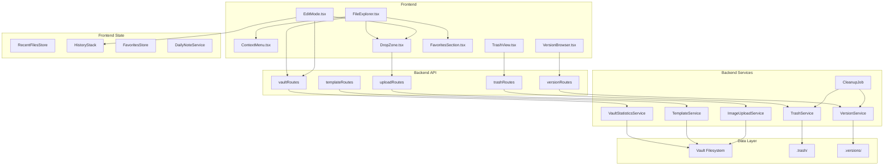
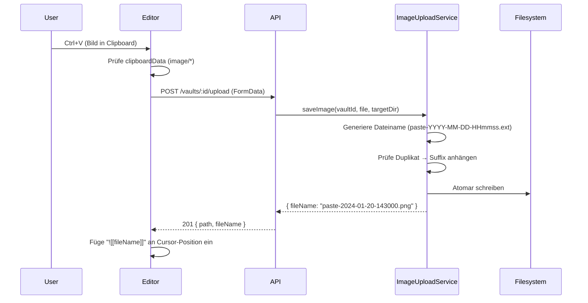

# Design Document — Tier-2 Daily Workflow

## Overview

Dieses Design beschreibt die technische Umsetzung der kombinierten Tier-2-Features für tägliche Workflow-Verbesserungen in Slatebase. Die Features sind in drei Bereiche unterteilt:

1. **Vault Explorer Enhancements** — Statistiken, Kontextmenü, Drag & Drop Upload
2. **Editor Improvements** — Zeilennummern, Undo/Redo, Recent Files, Templates, Daily Notes, Bild-Paste, Favoriten
3. **Trash & File Versioning** — Papierkorb (Soft-Delete) und Datei-Versionierung mit Cleanup

Die Architektur folgt dem bestehenden Slatebase-Muster: Interface-driven Backend-Services (Node.js/Hono/Zod), Frontend-State via useReducer + Context, Filesystem-basierte Persistenz mit atomaren Schreiboperationen.



## Architecture

### Schichtenaufteilung

Das Design folgt der bestehenden Layered Architecture:

| Schicht | Neue Module | Verantwortung |
|---------|-------------|---------------|
| Config | `trash`, `versions` Sektionen | Konfigurationswerte für Aufbewahrung und Limits |
| Business | `TrashService`, `VersionService`, `TemplateService`, `VaultStatisticsService`, `ImageUploadService` | Geschäftslogik, Validierung |
| API | `trashRoutes`, `versionRoutes`, `templateRoutes`, `statisticsRoutes` | HTTP-Endpunkte, Zod-Validierung, Error-Mapping |
| Frontend State | `RecentFilesStore`, `HistoryStack`, `FavoritesStore`, `DailyNoteService` | Client-seitige Zustandsverwaltung (localStorage) |
| Frontend Components | `ContextMenu`, `DropZone`, `VersionBrowser`, `TrashView`, `FavoritesSection`, `LineNumbers` | UI-Darstellung |

### Integration mit bestehenden Modulen

- **VaultService** (`business/index.ts`): Wird erweitert um `deleteContent` zu modifizieren (Trash statt permanenter Löschung) und `saveFile` zu hooken (Versionierung vor Überschreiben).
- **EventBus** (`realtime/event-bus.ts`): Publiziert `vault:change` Events bei Trash/Restore/Version-Operationen.
- **IConfigService**: Wird erweitert um `trash` und `versions` Konfigurationssektionen.
- **FileExplorer.tsx**: Integriert ContextMenu, DropZone, FavoritesSection, Statistik-Tooltip.
- **EditMode.tsx**: Integriert HistoryStack, LineNumbers, Bild-Paste-Handler, DropZone.

### Neue Backend-Module (Verzeichnisstruktur)

```
backend/src/
├── trash/
│   ├── index.ts          — Barrel export
│   ├── types.ts          — ITrashService, TrashEntry, TrashIndex
│   ├── errors.ts         — TrashRestoreError, TrashNotFoundError
│   └── trash-service.ts  — TrashService Implementierung
├── version/
│   ├── index.ts          — Barrel export
│   ├── types.ts          — IVersionService, VersionEntry, VersionList
│   ├── errors.ts         — VersionNotFoundError, VersionLimitError
│   └── version-service.ts — VersionService Implementierung
├── template/
│   ├── index.ts          — Barrel export
│   ├── types.ts          — ITemplateService, TemplateInfo
│   ├── errors.ts         — TemplateNotFoundError, TemplateConflictError
│   └── template-service.ts — TemplateService Implementierung
├── statistics/
│   ├── index.ts          — Barrel export
│   ├── types.ts          — IVaultStatisticsService, VaultStatistics
│   └── statistics-service.ts — VaultStatisticsService Implementierung
├── cleanup/
│   ├── index.ts          — Barrel export
│   ├── types.ts          — ICleanupJob, CleanupConfig
│   └── cleanup-job.ts    — CleanupJob Implementierung
└── api/
    ├── trashRoutes.ts    — Trash REST Endpunkte
    ├── versionRoutes.ts  — Version REST Endpunkte (Erweiterung)
    ├── templateRoutes.ts — Template REST Endpunkte
    └── statisticsRoutes.ts — Statistik REST Endpunkte
```

### Neue Frontend-Module (Verzeichnisstruktur)

```
frontend/src/
├── components/
│   ├── ContextMenu.tsx       — Positioniertes Overlay-Menü
│   ├── ContextMenu.css       — Styles
│   ├── DropZone.tsx          — Drag & Drop Overlay
│   ├── DropZone.css          — Styles
│   ├── LineNumbers.tsx       — Zeilennummern-Komponente
│   ├── LineNumbers.css       — Styles
│   ├── VersionBrowser.tsx    — Versions-Ansicht mit Diff
│   ├── VersionBrowser.css    — Styles
│   ├── TrashView.tsx         — Papierkorb-Ansicht
│   ├── TrashView.css         — Styles
│   └── FavoritesSection.tsx  — Favoriten im Explorer
├── state/
│   ├── recentFilesStore.ts   — Recent Files (localStorage)
│   ├── favoritesStore.ts     — Favoriten (localStorage)
│   └── dailyNoteService.ts   — Daily Note Logik
└── hooks/
    ├── useHistoryStack.ts    — Undo/Redo Hook
    ├── useDropZone.ts        — Drag & Drop Hook
    └── useLineNumbers.ts     — Line Numbers Sync Hook
```

## Components and Interfaces

### Backend Interfaces

#### IVaultStatisticsService

```typescript
/** Vault-Statistiken: Dateizahl, Ordnerzahl, Gesamtgröße */
export interface VaultStatistics {
  fileCount: number
  folderCount: number
  totalSizeBytes: number
}

export interface IVaultStatisticsService {
  /**
   * Berechnet rekursiv die Statistiken für einen Vault.
   * Timeout: 5 Sekunden.
   */
  getStatistics(vaultId: string): Promise<VaultStatistics>
  /** Cache invalidieren (bei vault:change Event) */
  invalidateCache(vaultId: string): void
}
```

#### ITrashService

```typescript
export interface TrashEntry {
  /** Eindeutige ID des Trash-Eintrags */
  id: string
  /** Originaler relativer Pfad innerhalb des Vaults */
  originalPath: string
  /** ISO 8601 Zeitstempel der Löschung */
  deletedAt: string
  /** true wenn es ein Ordner ist */
  isDirectory: boolean
}

export interface TrashIndex {
  entries: TrashEntry[]
}

export interface ITrashService {
  /** Verschiebt eine Datei/Ordner in den .trash/ Ordner */
  moveToTrash(vaultId: string, relativePath: string): Promise<TrashEntry>
  /** Listet alle Trash-Einträge für einen Vault */
  listTrash(vaultId: string): Promise<TrashEntry[]>
  /** Stellt eine Datei aus dem Trash wieder her */
  restore(vaultId: string, entryId: string): Promise<{ restoredPath: string }>
  /** Löscht einen Trash-Eintrag permanent */
  deletePermanently(vaultId: string, entryId: string): Promise<void>
  /** Entfernt abgelaufene Einträge (für CleanupJob) */
  purgeExpired(vaultId: string, retentionDays: number): Promise<number>
  /** Löscht sofort permanent (wenn retentionDays=0) */
  deleteImmediately(vaultId: string, relativePath: string): Promise<void>
}
```

#### IVersionService

```typescript
export interface VersionEntry {
  /** Timestamp im Format YYYYMMDDTHHmmssSSS (UTC) */
  timestamp: string
  /** Dateigröße in Bytes */
  sizeBytes: number
}

export interface IVersionService {
  /** Erstellt eine neue Version der Datei (vorherigen Inhalt sichern) */
  createVersion(vaultId: string, relativePath: string, previousContent: Buffer): Promise<void>
  /** Listet alle Versionen einer Datei */
  listVersions(vaultId: string, relativePath: string): Promise<VersionEntry[]>
  /** Liest den Inhalt einer bestimmten Version */
  getVersionContent(vaultId: string, relativePath: string, timestamp: string): Promise<Buffer>
  /** Stellt eine Version wieder her (atomar: aktuelle sichern, dann überschreiben) */
  restoreVersion(vaultId: string, relativePath: string, timestamp: string): Promise<void>
  /** Entfernt überzählige Versionen (für CleanupJob) */
  pruneVersions(vaultId: string, relativePath: string, maxVersions: number): Promise<number>
  /** Verschiebt Versionen wenn Datei umbenannt/verschoben wird */
  moveVersions(vaultId: string, oldPath: string, newPath: string): Promise<void>
  /** Löscht alle Versionen einer Datei */
  deleteVersions(vaultId: string, relativePath: string): Promise<void>
}
```

#### ITemplateService

```typescript
export interface TemplateInfo {
  /** Anzeigename (Dateiname ohne .md) */
  name: string
  /** Relativer Pfad zur Template-Datei */
  path: string
}

export interface ITemplateService {
  /** Listet verfügbare Templates (alphabetisch, max 100) */
  listTemplates(vaultId: string): Promise<TemplateInfo[]>
  /** Erstellt eine neue Datei aus einem Template */
  createFromTemplate(
    vaultId: string,
    templateName: string,
    targetDir: string,
    fileName: string
  ): Promise<{ path: string; content: string }>
}
```

#### ICleanupJob

```typescript
export interface CleanupConfig {
  trashRetentionDays: number
  maxVersionsPerFile: number
  intervalMs: number
}

export interface ICleanupJob {
  /** Startet den periodischen Cleanup */
  start(): void
  /** Stoppt den Cleanup */
  stop(): void
  /** Führt einen einzelnen Cleanup-Durchlauf aus */
  runOnce(): Promise<void>
}
```

### Frontend Interfaces

#### HistoryStack (useHistoryStack Hook)

```typescript
interface HistoryEntry {
  text: string
  selectionStart: number
  selectionEnd: number
}

interface UseHistoryStackReturn {
  /** Speichert den aktuellen Zustand vor einer Aktion */
  pushState(entry: HistoryEntry): void
  /** Stellt den vorherigen Zustand wieder her */
  undo(): HistoryEntry | null
  /** Stellt den nächsten Zustand wieder her */
  redo(): HistoryEntry | null
  /** Gibt es einen Undo-Eintrag? */
  canUndo: boolean
  /** Gibt es einen Redo-Eintrag? */
  canRedo: boolean
  /** Leert den Stack (bei Dateiwechsel) */
  clear(): void
}
```

#### RecentFilesStore

```typescript
interface RecentFileEntry {
  vaultId: string
  path: string
  timestamp: string // ISO 8601
}

interface IRecentFilesStore {
  /** Fügt eine Datei hinzu (oder aktualisiert Position) */
  add(vaultId: string, path: string): void
  /** Gibt die letzten N Einträge zurück */
  getRecent(limit?: number): RecentFileEntry[]
  /** Entfernt einen Eintrag */
  remove(vaultId: string, path: string): void
  /** Aktualisiert einen Pfad (bei Umbenennung) */
  updatePath(vaultId: string, oldPath: string, newPath: string): void
}
```

#### FavoritesStore

```typescript
interface FavoriteEntry {
  vaultId: string
  path: string
  addedAt: string // ISO 8601
}

interface IFavoritesStore {
  /** Markiert eine Datei als Favorit */
  add(vaultId: string, path: string): void
  /** Entfernt einen Favoriten */
  remove(vaultId: string, path: string): void
  /** Gibt alle Favoriten für einen Vault zurück */
  getForVault(vaultId: string): FavoriteEntry[]
  /** Prüft ob eine Datei Favorit ist */
  isFavorite(vaultId: string, path: string): boolean
  /** Aktualisiert Pfad bei Umbenennung */
  updatePath(vaultId: string, oldPath: string, newPath: string): void
  /** Entfernt Favoriten für gelöschte Datei */
  removeByPath(vaultId: string, path: string): void
}
```

### API Endpunkte (Neue Routes)

| Method | Path | Beschreibung |
|--------|------|--------------|
| GET | `/api/v1/vaults/:vaultId/statistics` | Vault-Statistiken |
| POST | `/api/v1/vaults/:vaultId/upload` | Datei-Upload (multipart) |
| GET | `/api/v1/vaults/:vaultId/templates` | Template-Liste |
| POST | `/api/v1/vaults/:vaultId/templates/create` | Datei aus Template erstellen |
| GET | `/api/v1/vaults/:vaultId/trash` | Trash-Einträge auflisten |
| POST | `/api/v1/vaults/:vaultId/trash/:entryId/restore` | Datei wiederherstellen |
| DELETE | `/api/v1/vaults/:vaultId/trash/:entryId` | Permanent löschen |
| GET | `/api/v1/vaults/:vaultId/versions/:filePath` | Versionen einer Datei |
| GET | `/api/v1/vaults/:vaultId/versions/:filePath/:timestamp` | Version-Inhalt lesen |
| POST | `/api/v1/vaults/:vaultId/versions/:filePath/:timestamp/restore` | Version wiederherstellen |

## Data Models

### Trash-Index (`.trash/_index.json`)

```json
{
  "entries": [
    {
      "id": "a1b2c3d4e5f6",
      "originalPath": "notes/meeting-2024-01-15.md",
      "deletedAt": "2024-01-20T14:30:00.000Z",
      "isDirectory": false
    }
  ]
}
```

Die eigentlichen Dateien liegen unter `.trash/<id>/<originalFilename>`, um Namenskonflikte zu vermeiden.

### Versions-Verzeichnisstruktur

```
.versions/
├── notes/
│   └── meeting.md/
│       ├── 20240120T143000123.md
│       ├── 20240120T150000456.md
│       └── 20240121T090000789.md
└── docs/
    └── readme.md/
        └── 20240119T100000000.md
```

Jede Version ist eine vollständige Kopie des Dateiinhalts zum Zeitpunkt vor dem Speichern.

### Server-Konfiguration (Erweiterung `default.json`)

```json
{
  "trash": {
    "retentionDays": 30
  },
  "versions": {
    "maxPerFile": 20
  },
  "cleanup": {
    "intervalHours": 24
  },
  "templates": {
    "directory": "_templates"
  },
  "upload": {
    "maxFileSizeBytes": 104857600,
    "maxFilesPerDrop": 50,
    "maxImagePasteSize": 10485760
  }
}
```

### localStorage-Strukturen

**Recent Files** (`slatebase:recentFiles`):
```json
[
  { "vaultId": "abc123", "path": "notes/daily.md", "timestamp": "2024-01-20T14:30:00.000Z" }
]
```

**Favorites** (`slatebase:favorites:<vaultId>`):
```json
[
  { "vaultId": "abc123", "path": "notes/important.md", "addedAt": "2024-01-15T10:00:00.000Z" }
]
```

**Line Numbers Toggle** (`slatebase:lineNumbers`):
```json
{ "enabled": false }
```

**Daily Notes Config** (`slatebase:dailyNotes:<vaultId>`):
```json
{ "directory": "" }
```

### Zod-Validierungsschemas (Backend)

```typescript
// Trash Config
const TrashConfigSchema = z.object({
  retentionDays: z.number().int().min(0).max(365).default(30),
})

// Versions Config
const VersionsConfigSchema = z.object({
  maxPerFile: z.number().int().min(0).max(100).default(20),
})

// Upload-Validierung
const UploadSchema = z.object({
  maxFileSizeBytes: z.number().int().positive().default(104857600), // 100 MB
  maxFilesPerDrop: z.number().int().min(1).max(50).default(50),
  maxImagePasteSize: z.number().int().positive().default(10485760), // 10 MB
})

// Template-Erstellen Request
const CreateFromTemplateSchema = z.object({
  templateName: z.string().min(1).max(255),
  targetDir: z.string().max(255),
  fileName: z.string().min(1).max(255),
})
```

## Detailed Component Design

### 1. VaultStatisticsService

**Algorithmus**: Rekursiver Verzeichnis-Scan mit `fs.readdir` + `fs.stat`. Filtert `.trash/` und `.versions/` Verzeichnisse sowie `_`-Prefix-Dateien heraus.

```typescript
export class VaultStatisticsService implements IVaultStatisticsService {
  private readonly cache = new Map<string, { stats: VaultStatistics; computedAt: number }>()
  private readonly TIMEOUT_MS = 5000

  constructor(
    private readonly vaultManager: IVaultManager,
    private readonly logger: ILogger
  ) {}

  async getStatistics(vaultId: string): Promise<VaultStatistics> {
    const cached = this.cache.get(vaultId)
    if (cached) return cached.stats

    const vault = this.vaultManager.getVault(vaultId)
    if (!vault) throw new VaultNotFoundError(vaultId)

    const stats = await this.computeWithTimeout(vault.absolutePath)
    this.cache.set(vaultId, { stats, computedAt: Date.now() })
    return stats
  }

  invalidateCache(vaultId: string): void {
    this.cache.delete(vaultId)
  }

  private async computeWithTimeout(rootPath: string): Promise<VaultStatistics> {
    const controller = new AbortController()
    const timeout = setTimeout(() => controller.abort(), this.TIMEOUT_MS)

    try {
      return await this.scanRecursive(rootPath, rootPath, controller.signal)
    } finally {
      clearTimeout(timeout)
    }
  }

  private async scanRecursive(
    rootPath: string, currentPath: string, signal: AbortSignal
  ): Promise<VaultStatistics> {
    if (signal.aborted) throw new Error('Statistics computation timed out')
    // ... rekursives Scannen, .trash/.versions/_-Dateien auslassen
  }
}
```

### 2. TrashService

**Algorithmus**: Beim Löschen wird die Datei unter `.trash/<uniqueId>/` verschoben und ein Eintrag in `_index.json` geschrieben. Die Index-Datei wird atomar aktualisiert (temp → rename).

```typescript
export class TrashService implements ITrashService {
  constructor(
    private readonly dataDir: string,
    private readonly logger: ILogger
  ) {}

  async moveToTrash(vaultId: string, relativePath: string): Promise<TrashEntry> {
    const vaultDataDir = path.join(this.dataDir, 'vaults', vaultId)
    const trashDir = path.join(vaultDataDir, '.trash')
    const entryId = crypto.randomBytes(6).toString('hex')

    // 1. .trash/ Verzeichnis sicherstellen
    await fs.mkdir(trashDir, { recursive: true })

    // 2. Datei in .trash/<id>/ verschieben
    const source = path.join(vaultDataDir, relativePath)
    const entryDir = path.join(trashDir, entryId)
    await fs.mkdir(entryDir)
    await fs.rename(source, path.join(entryDir, path.basename(relativePath)))

    // 3. _index.json atomar aktualisieren
    const entry: TrashEntry = {
      id: entryId,
      originalPath: relativePath,
      deletedAt: new Date().toISOString(),
      isDirectory: (await fs.stat(path.join(entryDir, path.basename(relativePath)))).isDirectory()
    }
    await this.updateIndex(vaultId, index => { index.entries.push(entry) })

    return entry
  }

  async restore(vaultId: string, entryId: string): Promise<{ restoredPath: string }> {
    // 1. Entry aus Index lesen
    // 2. Ziel-Pfad prüfen, ggf. Suffix anhängen
    // 3. Fehlende Elternverzeichnisse erstellen
    // 4. Datei zurückverschieben
    // 5. Entry aus Index entfernen (atomar)
  }

  private async updateIndex(vaultId: string, updater: (index: TrashIndex) => void): Promise<void> {
    // Atomar: lesen → updaten → temp schreiben → rename
  }
}
```

### 3. VersionService

**Algorithmus**: Bei jedem `saveFile`-Aufruf wird der vorherige Dateiinhalt unter `.versions/<pfad>/<timestamp>.<ext>` gesichert. Überzählige Versionen werden sofort entfernt.

```typescript
export class VersionService implements IVersionService {
  constructor(
    private readonly dataDir: string,
    private readonly maxVersionsPerFile: number,
    private readonly logger: ILogger
  ) {}

  async createVersion(vaultId: string, relativePath: string, previousContent: Buffer): Promise<void> {
    if (this.maxVersionsPerFile === 0) return // Deaktiviert

    const versionDir = this.getVersionDir(vaultId, relativePath)
    await fs.mkdir(versionDir, { recursive: true })

    const timestamp = this.generateTimestamp() // YYYYMMDDTHHmmssSSS UTC
    const ext = path.extname(relativePath)
    const versionFile = path.join(versionDir, `${timestamp}${ext}`)

    // Atomar schreiben
    const tmpFile = `${versionFile}.${crypto.randomBytes(8).toString('hex')}.tmp`
    await fs.writeFile(tmpFile, previousContent)
    await fs.rename(tmpFile, versionFile)

    // Überzählige Versionen entfernen
    await this.pruneVersions(vaultId, relativePath, this.maxVersionsPerFile)
  }

  async restoreVersion(vaultId: string, relativePath: string, timestamp: string): Promise<void> {
    // 1. Aktuelle Datei als neue Version sichern
    const currentContent = await fs.readFile(this.resolveFilePath(vaultId, relativePath))
    await this.createVersion(vaultId, relativePath, currentContent)

    // 2. Version-Inhalt lesen
    const versionContent = await this.getVersionContent(vaultId, relativePath, timestamp)

    // 3. Atomar überschreiben (temp → rename)
    const targetPath = this.resolveFilePath(vaultId, relativePath)
    const tmpFile = `${targetPath}.${crypto.randomBytes(8).toString('hex')}.tmp`
    await fs.writeFile(tmpFile, versionContent)
    await fs.rename(tmpFile, targetPath)
  }

  private generateTimestamp(): string {
    const now = new Date()
    return now.toISOString().replace(/[-:]/g, '').replace('.', '').slice(0, 18)
    // → "20240120T143000123"
  }

  private getVersionDir(vaultId: string, relativePath: string): string {
    return path.join(this.dataDir, 'vaults', vaultId, '.versions', relativePath)
  }
}
```

### 4. TemplateService

**Algorithmus**: Liest `.md`-Dateien (ohne `_`-Prefix) aus dem konfigurierten Template-Verzeichnis. Platzhalter-Ersetzung über einfaches String-Replace mit definierten Tokens.

```typescript
export class TemplateService implements ITemplateService {
  private readonly PLACEHOLDERS = ['date', 'time', 'title'] as const
  private readonly MAX_TEMPLATES = 100

  constructor(
    private readonly templateDir: string,
    private readonly vaultManager: IVaultManager,
    private readonly logger: ILogger
  ) {}

  async listTemplates(vaultId: string): Promise<TemplateInfo[]> {
    const vault = this.vaultManager.getVault(vaultId)
    if (!vault) throw new VaultNotFoundError(vaultId)

    const templatesPath = path.join(vault.absolutePath, this.templateDir)
    try {
      const entries = await fs.readdir(templatesPath, { withFileTypes: true })
      return entries
        .filter(e => e.isFile() && e.name.endsWith('.md') && !e.name.startsWith('_'))
        .slice(0, this.MAX_TEMPLATES)
        .map(e => ({ name: e.name.replace(/\.md$/, ''), path: e.name }))
        .sort((a, b) => a.name.localeCompare(b.name))
    } catch {
      return [] // Verzeichnis existiert nicht
    }
  }

  async createFromTemplate(
    vaultId: string, templateName: string, targetDir: string, fileName: string
  ): Promise<{ path: string; content: string }> {
    // 1. Template-Inhalt lesen
    // 2. Platzhalter ersetzen: {{date}}, {{time}}, {{title}}
    // 3. Ziel-Pfad validieren + Konflikt prüfen
    // 4. Datei atomar schreiben
  }

  private replacePlaceholders(content: string, title: string): string {
    const now = new Date()
    const date = now.toISOString().slice(0, 10) // YYYY-MM-DD
    const time = `${String(now.getHours()).padStart(2, '0')}:${String(now.getMinutes()).padStart(2, '0')}`

    return content
      .replace(/\{\{date\}\}/g, date)
      .replace(/\{\{time\}\}/g, time)
      .replace(/\{\{title\}\}/g, title)
    // Nicht erkannte Platzhalter bleiben unverändert
  }
}
```

### 5. CleanupJob

**Algorithmus**: `setInterval`-basiert. Iteriert über alle Vaults, ruft `trashService.purgeExpired()` und `versionService.pruneVersions()` auf.

```typescript
export class CleanupJob implements ICleanupJob {
  private intervalId: ReturnType<typeof setInterval> | null = null

  constructor(
    private readonly trashService: ITrashService,
    private readonly versionService: IVersionService,
    private readonly vaultManager: IVaultManager,
    private readonly config: CleanupConfig,
    private readonly logger: ILogger
  ) {}

  start(): void {
    // Sofortiger erster Durchlauf
    this.runOnce().catch(err => this.logger.error('Cleanup failed', { error: err }))
    // Periodisch wiederholen
    this.intervalId = setInterval(
      () => this.runOnce().catch(err => this.logger.error('Cleanup failed', { error: err })),
      this.config.intervalMs
    )
  }

  stop(): void {
    if (this.intervalId) {
      clearInterval(this.intervalId)
      this.intervalId = null
    }
  }

  async runOnce(): Promise<void> {
    const vaults = this.vaultManager.getAllVaults()
    for (const vault of vaults) {
      // Trash: abgelaufene Einträge entfernen
      if (this.config.trashRetentionDays > 0) {
        await this.trashService.purgeExpired(vault.id, this.config.trashRetentionDays)
      }
      // Versions: überzählige entfernen
      await this.pruneAllVersions(vault.id)
    }
  }
}
```

### 6. Frontend: ContextMenu

**Algorithmus**: Positionierung via `position: fixed` + JS-berechnetem Clamping an Viewport-Grenzen. Öffnet bei `onContextMenu`, schließt bei Click-Outside oder Escape. Keyboard-Navigation mit Pfeiltasten.

```typescript
interface ContextMenuProps {
  x: number
  y: number
  items: ContextMenuItem[]
  onClose: () => void
  onSelect: (action: string) => void
}

interface ContextMenuItem {
  id: string
  label: string
  icon?: React.ReactNode
  disabled?: boolean
  separator?: boolean
}
```

### 7. Frontend: DropZone

**Algorithmus**: Verwendet `dragenter`/`dragleave`/`dragover`/`drop` Events. Zählt Drag-Counter für korrektes Enter/Leave-Verhalten bei verschachtelten Elementen. Validiert Dateitypen und -größen vor dem Upload.

```typescript
interface UseDropZoneOptions {
  onDrop: (files: File[], targetPath: string) => Promise<void>
  maxFiles?: number
  maxFileSize?: number
  accept?: string[]
}

interface UseDropZoneReturn {
  isDragOver: boolean
  dropRef: React.RefObject<HTMLDivElement>
}
```

### 8. Frontend: useHistoryStack

**Algorithmus**: Zwei Arrays (undo/redo). Bei `pushState` wird zum Undo-Stack hinzugefügt und der Redo-Stack geleert. Max 100 Einträge mit FIFO-Eviction. Bei Dateiwechsel wird `clear()` aufgerufen.

```typescript
function useHistoryStack(maxEntries = 100): UseHistoryStackReturn {
  const [undoStack, setUndoStack] = useState<HistoryEntry[]>([])
  const [redoStack, setRedoStack] = useState<HistoryEntry[]>([])

  const pushState = useCallback((entry: HistoryEntry) => {
    setUndoStack(prev => {
      const next = [...prev, entry]
      return next.length > maxEntries ? next.slice(1) : next
    })
    setRedoStack([]) // Redo nach neuer Aktion verwerfen
  }, [maxEntries])

  // ...
}
```

### 9. Frontend: LineNumbers

**Algorithmus**: Berechnet Zeilenanzahl aus `text.split('\n').length`. Synchronisiert Scroll-Position mit dem Textarea via `onScroll`-Handler und `scrollTop`-Binding. CSS `line-height` muss identisch sein.

```typescript
interface LineNumbersProps {
  text: string
  scrollTop: number
  lineHeight: number
  visible: boolean
}
```

### 10. Image Upload Flow (Bild-Paste)

**Algorithmus**: Interceptet `paste`-Event im Editor. Prüft `clipboardData.items` auf Bild-MIME-Typen. Erstellt einen `FormData`-Upload, empfängt Dateinamen zurück, fügt Embed-Link ein.



### 11. Daily Note Service (Frontend)

**Algorithmus**: Ermittelt heutiges Datum in Browser-Zeitzone, prüft via API ob Datei existiert, erstellt sie ggf. mit Template-Inhalt, öffnet sie im Tab.

```typescript
export function createDailyNoteService(apiClient: IApiClient) {
  return {
    async openOrCreate(vaultId: string, dailyDir: string): Promise<string> {
      const today = new Date()
      const dateStr = today.toISOString().slice(0, 10) // YYYY-MM-DD
      const filePath = dailyDir ? `${dailyDir}/${dateStr}.md` : `${dateStr}.md`

      // 1. Prüfe ob Datei existiert (GET /files/:path → 200 oder 404)
      // 2. Falls 404: Template laden, Datei erstellen
      // 3. Datei im Tab öffnen
      return filePath
    }
  }
}
```

### 12. VaultService-Integration (Modifikationen)

Die bestehende `VaultService.deleteContent()` wird modifiziert um den TrashService aufzurufen:

```typescript
// In VaultService.deleteContent():
async deleteContent(vaultId: string, relativePath: string): Promise<void> {
  // Bestehende Validierung...
  
  if (this.trashConfig.retentionDays === 0) {
    // Sofort permanent löschen (altes Verhalten)
    await this.trashService.deleteImmediately(vaultId, relativePath)
  } else {
    // Soft-Delete: in Trash verschieben
    await this.trashService.moveToTrash(vaultId, relativePath)
  }

  // Versionen löschen wenn permanent gelöscht
  // vault:change Event publizieren
}
```

Die bestehende `VaultService.saveFile()` wird modifiziert um den VersionService aufzurufen:

```typescript
// In VaultService.saveFile() — VOR dem Schreiben:
async saveFile(vaultId: string, filePath: string, content: string, ifMatch?: string): Promise<FileSaveResult> {
  // Bestehende Validierung...
  
  // Version erstellen (falls Datei existiert und versions.maxPerFile > 0)
  if (fileExists && this.versionsConfig.maxPerFile > 0) {
    const previousContent = await fs.readFile(absolutePath)
    await this.versionService.createVersion(vaultId, filePath, previousContent)
  }

  // Bestehende Schreiblogik...
}
```

## Correctness Properties

*A property is a characteristic or behavior that should hold true across all valid executions of a system — essentially, a formal statement about what the system should do. Properties serve as the bridge between human-readable specifications and machine-verifiable correctness guarantees.*

### Property 1: Vault-Statistiken Korrektheit

*For any* valid vault directory tree (with arbitrary nesting, file sizes, and folder counts), the `VaultStatisticsService` SHALL compute `fileCount` equal to the total number of file nodes, `folderCount` equal to the total number of directory nodes, and `totalSizeBytes` equal to the sum of all file sizes — excluding `.trash/`, `.versions/`, and `_`-prefix entries.

**Validates: Requirements 1.1, 1.6**

### Property 2: Menschenlesbare Größenformatierung

*For any* non-negative integer representing bytes, the size formatter SHALL produce a string with the largest applicable unit (Bytes < 1024, KB ≥ 1024, MB ≥ 1048576, GB ≥ 1073741824) and at most 2 decimal places.

**Validates: Requirements 1.2**

### Property 3: Kontextmenü-Berechtigungsfilterung

*For any* node (file, folder, or vault) where the user has only read permission, the context menu items SHALL contain no write actions (Umbenennen, Löschen, Kopieren, Verschieben, Neuer Ordner, Neue Datei).

**Validates: Requirements 2.7**

### Property 4: Unique-Filename-Generator

*For any* desired filename and any set of existing filenames in the target directory, the unique filename generator SHALL produce a name that does not exist in the set, preserves the original extension, and follows the suffix pattern (`-1`, `-2`, ...) when the base name is already taken.

**Validates: Requirements 3.6, 9.3, 11.5**

### Property 5: Upload-Zielverzeichnis vom Editor-Kontext

*For any* currently open file at path `dir/file.md`, uploading or pasting a file via the Editor SHALL store it in directory `dir/`.

**Validates: Requirements 3.3, 9.4**

### Property 6: Bild-Embed-Link-Einfügung

*For any* file with an image extension (`.png`, `.jpg`, `.jpeg`, `.gif`, `.svg`, `.webp`, `.avif`, `.bmp`), dropping or pasting it into the Editor SHALL insert an embed link `![[filename]]` at the current cursor position.

**Validates: Requirements 3.4, 9.6**

### Property 7: Zeilennummern-Synchronisation

*For any* text string, the line numbers component SHALL render exactly `text.split('\n').length` line numbers, each vertically aligned with the corresponding text line.

**Validates: Requirements 4.3**

### Property 8: History-Stack Undo Round-Trip

*For any* editor state (text + cursor position) and any toolbar action, pushing the pre-action state and then calling `undo()` SHALL return the exact pre-action state (text content, selectionStart, selectionEnd).

**Validates: Requirements 5.1, 5.2**

### Property 9: History-Stack Redo Round-Trip

*For any* editor state that was undone, calling `redo()` SHALL return the exact post-action state that was previously undone.

**Validates: Requirements 5.3**

### Property 10: Redo-Invalidierung bei neuer Aktion

*For any* non-empty redo stack, performing a new toolbar action or text input SHALL clear all redo entries, making `canRedo` false.

**Validates: Requirements 5.4**

### Property 11: History-Stack Größeninvariante

*For any* sequence of `pushState` calls, the undo stack size SHALL never exceed 100 entries, with the oldest entry discarded when the limit is reached.

**Validates: Requirements 5.5**

### Property 12: Recent-Files-Listenintegrität

*For any* sequence of file-open events, the Recent Files list SHALL: (a) contain the most recently opened file at index 0, (b) contain no duplicate entries (by vaultId + path), (c) never exceed 20 entries, and (d) preserve chronological order by last-opened timestamp.

**Validates: Requirements 6.1, 6.2**

### Property 13: Template-Listing-Filterung

*For any* set of files in the template directory, `listTemplates` SHALL return only `.md` files whose name does not start with `_`, sorted alphabetically by name (without extension), capped at 100 entries.

**Validates: Requirements 7.1, 7.2**

### Property 14: Template-Platzhalter-Ersetzung

*For any* template string containing `{{date}}`, `{{time}}`, and `{{title}}` placeholders, the replacer SHALL substitute `{{date}}` with the current date (YYYY-MM-DD), `{{time}}` with current time (HH:mm), `{{title}}` with the provided title — and leave any unrecognized `{{...}}` placeholders unchanged.

**Validates: Requirements 7.5**

### Property 15: Daily-Note-Dateiname-Format

*For any* date in the browser's local timezone, the Daily Note Service SHALL generate a filename in the exact format `YYYY-MM-DD.md`.

**Validates: Requirements 8.1**

### Property 16: Bild-Paste-Dateiname-Format

*For any* paste timestamp and valid image MIME type (image/png → .png, image/jpeg → .jpg, image/gif → .gif, image/webp → .webp), the generated filename SHALL match the pattern `paste-YYYY-MM-DD-HHmmss.<ext>`.

**Validates: Requirements 9.2**

### Property 17: Nur Bild-MIME-Typen werden verarbeitet

*For any* clipboard content, the Image Upload Service SHALL only process MIME types matching `image/png`, `image/jpeg`, `image/gif`, or `image/webp`, and SHALL NOT intercept text or other clipboard content types.

**Validates: Requirements 9.9**

### Property 18: Favoriten Add/Remove Round-Trip

*For any* file (vaultId + path), adding it as favorite SHALL make `isFavorite` return true, and subsequently removing it SHALL make `isFavorite` return false.

**Validates: Requirements 10.1, 10.2**

### Property 19: Favoriten-Größeninvariante und Reihenfolge

*For any* vault, the favorites list SHALL never exceed 50 entries and SHALL be ordered by `addedAt` descending (newest first).

**Validates: Requirements 10.5, 10.6**

### Property 20: Favoriten-Pfad-Tracking

*For any* favorited file, calling `updatePath(oldPath, newPath)` SHALL update the favorite's path to `newPath`, and calling `removeByPath(path)` SHALL remove the favorite from the list.

**Validates: Requirements 10.7, 10.8**

### Property 21: Trash Soft-Delete

*For any* valid file path within a vault, `moveToTrash` SHALL move the file to `.trash/`, record an entry in `_index.json` with the original path and a valid ISO 8601 timestamp, and the file SHALL no longer exist at its original location.

**Validates: Requirements 11.1, 11.2**

### Property 22: Trash-Auflistung Sortierung

*For any* set of trash entries, `listTrash` SHALL return them sorted by `deletedAt` descending (most recently deleted first).

**Validates: Requirements 11.3**

### Property 23: Trash Restore Round-Trip

*For any* file that was moved to trash, calling `restore` SHALL place the file back at its original path with its original content intact, and remove the entry from `_index.json`.

**Validates: Requirements 11.4**

### Property 24: Trash Cleanup nach Aufbewahrungsfrist

*For any* set of trash entries and a given `retentionDays` value, `purgeExpired` SHALL permanently delete only those entries whose `deletedAt` is older than `retentionDays` days from now, leaving newer entries untouched.

**Validates: Requirements 11.7, 13.5**

### Property 25: Version-Erstellung bei Speichern

*For any* existing file with content C, after `saveFile` is called with new content N (and `maxPerFile > 0`), a version entry SHALL exist containing the previous content C.

**Validates: Requirements 12.1**

### Property 26: Versions-Anzahl-Invariante

*For any* file and any sequence of save operations, the number of stored versions SHALL never exceed `maxPerFile`, with the oldest versions pruned first.

**Validates: Requirements 12.2, 12.3, 13.6**

### Property 27: Versions-Auflistung Sortierung

*For any* set of versions for a file, `listVersions` SHALL return them sorted by timestamp descending (newest first).

**Validates: Requirements 12.4**

### Property 28: Version-Restore sichert aktuelle Version

*For any* file with current content C and a selected version with content V, calling `restoreVersion` SHALL first create a new version containing C, then set the file's content to V (atomically via temp → rename).

**Validates: Requirements 12.7**

### Property 29: Versionen bei Umbenennung mitverschieben

*For any* file with stored versions, renaming or moving the file from path A to path B SHALL make all versions accessible under path B and no longer under path A.

**Validates: Requirements 12.10**

### Property 30: Versionen bei Löschung entfernen

*For any* file with stored versions, permanently deleting the file SHALL remove all associated version entries.

**Validates: Requirements 12.11**

### Property 31: Konfigurationsvalidierung mit Fallback

*For any* `trash.retentionDays` value outside [0, 365] or `versions.maxPerFile` value outside [0, 100], the system SHALL use the default value (30 bzw. 20) and log a warning.

**Validates: Requirements 13.2**

### Property 32: Sofortige permanente Löschung bei retentionDays=0

*For any* file deletion when `trash.retentionDays` is configured as 0, the file SHALL be permanently removed without being moved to `.trash/`, and SHALL not appear in the trash listing.

**Validates: Requirements 13.7**

### Property 33: Keine Versionierung bei maxPerFile=0

*For any* save operation when `versions.maxPerFile` is configured as 0, no version file SHALL be created under `.versions/`.

**Validates: Requirements 13.8**

### Property 34: Inline-Diff Korrektheit

*For any* two text strings (current version and selected version), the diff computation SHALL correctly identify all added lines (present in current but not in version) and removed lines (present in version but not in current), with no lines misclassified.

**Validates: Requirements 12.6**


## Error Handling

### Backend-Fehlerklassen

Neue Error-Klassen folgen dem bestehenden Pattern (Domain-Error → HTTP-Status-Mapping im Controller):

| Error-Klasse | HTTP Status | Beschreibung |
|-------------|-------------|--------------|
| `TrashNotFoundError` | 404 | Trash-Eintrag existiert nicht |
| `TrashRestoreError` | 500 | Wiederherstellung fehlgeschlagen (Dateisystem) |
| `VersionNotFoundError` | 404 | Angeforderte Version existiert nicht |
| `TemplateNotFoundError` | 404 | Template-Datei nicht gefunden |
| `TemplateConflictError` | 409 | Zieldatei existiert bereits |
| `UploadTooLargeError` | 413 | Datei überschreitet Größenlimit |
| `UploadLimitExceededError` | 413 | Zu viele Dateien pro Upload |
| `StatisticsTimeoutError` | 408 | Statistik-Berechnung > 5s |
| `InvalidTrashConfigError` | — (intern) | Konfigurationswert ungültig → default + warn |

### Fehlerbehandlungs-Strategien

#### Vault-Statistiken
- **Timeout (5s)**: AbortController bricht Berechnung ab. Frontend zeigt "Statistiken nicht verfügbar". Letzter Cache-Wert bleibt erhalten.
- **Berechtigungsfehler**: Weiterleitung als 403. Frontend zeigt nichts (kein Tooltip).

#### Trash-Operationen
- **moveToTrash**: Falls Dateisystem-Fehler → StorageError. Datei bleibt am Originalort.
- **restore**: Falls Zielverzeichnis nicht erstellt werden kann → TrashRestoreError. Datei bleibt in .trash/. Metadaten-Index bleibt konsistent.
- **purgeExpired**: Pro Datei isoliert — ein Fehler stoppt nicht die gesamte Bereinigung. Fehler werden geloggt.

#### Versionierung
- **createVersion**: Falls Schreiben fehlschlägt → Log-Warnung. Die eigentliche Speicher-Operation (saveFile) wird trotzdem fortgesetzt (Version ist optional).
- **restoreVersion**: Atomar (temp → rename). Falls rename fehlschlägt → temp-Datei wird bereinigt, Fehler zurückgegeben. Aktuelle Datei bleibt unverändert.

#### Upload/Bild-Paste
- **Einzelfehler bei Multi-Upload**: Erfolgreiche Dateien werden beibehalten. Fehlgeschlagene werden per Toast einzeln gemeldet.
- **Größenüberschreitung**: Sofortige Ablehnung vor dem Schreiben. Keine partielle Datei auf Disk.

#### Template-Erstellung
- **Vorlagenverzeichnis fehlt**: Hinweismeldung mit erwartetem Pfad. Kein Fehler-Status.
- **Namenskonflikt**: Erstellung abbrechen, Fehlermeldung mit Dateiname.
- **Abbruch (Escape)**: Keine Aktion, keine Nebenwirkungen.

### Frontend-Fehlerbehandlung

- **Toast-Notifications**: Für Upload-Fehler, Paste-Fehler, Restore-Fehler. Enthalten Dateiname + Grund.
- **Deaktivierte UI-Elemente**: Undo/Redo-Buttons bei leerem Stack. Context-Menu-Einträge bei fehlender Berechtigung.
- **Graceful Degradation**: localStorage nicht verfügbar → In-Memory-Fallback für Favorites, Recent Files, Line Numbers.
- **Optimistic Updates**: Favoriten werden sofort im UI aktualisiert, Server-Fehler triggert Rollback.

### Konsistenz-Garantien

- **Atomar**: Alle Dateisystem-Operationen nutzen temp → rename Pattern.
- **Index-Konsistenz**: `.trash/_index.json` wird vor der Dateiverschiebung nicht aktualisiert — erst nach erfolgreichem Move.
- **Keine Partial-State**: Versionierung + Speichern ist sequentiell — erst Version sichern, dann neuen Inhalt schreiben. Bei Version-Fehler wird trotzdem gespeichert (Datenverlust vermeiden > Version-Vollständigkeit).

## Testing Strategy

### Dual Testing Approach

Dieses Feature verwendet zwei komplementäre Testansätze:

1. **Property-Based Tests** (PBT) — Verifizieren universelle Eigenschaften über viele generierte Eingaben (min. 100 Iterationen pro Property)
2. **Unit Tests** — Verifizieren spezifische Szenarien, Edge Cases und Integrationspunkte

### Property-Based Testing Konfiguration

- **Library**: `fast-check` (bereits im Projekt verfügbar oder hinzuzufügen via `npm install --save-dev fast-check`)
- **Runner**: Vitest
- **Iterationen**: Minimum 100 pro Property
- **Tag-Format**: `Feature: tier2-daily-workflow, Property {N}: {description}`

### PBT-Testdateien

```
backend/src/
├── trash/trash-service.property.test.ts      — Properties 21–24, 32
├── version/version-service.property.test.ts  — Properties 25–30, 33, 34
├── template/template-service.property.test.ts — Properties 13, 14
├── statistics/statistics-service.property.test.ts — Properties 1, 2
└── business/unique-filename.property.test.ts  — Property 4

frontend/src/
├── hooks/useHistoryStack.property.test.ts    — Properties 8–11
├── state/recentFilesStore.property.test.ts   — Property 12
├── state/favoritesStore.property.test.ts     — Properties 18–20
└── components/LineNumbers.property.test.ts    — Property 7
```

### Unit-Test-Bereiche

| Bereich | Testfokus |
|---------|-----------|
| VaultStatisticsService | Cache-Invalidierung, Timeout-Handling, leerer Vault |
| TrashService | Restore mit Suffix, Fehler bei Restore, _index.json Konsistenz |
| VersionService | Timestamp-Generierung, moveVersions, deleteVersions |
| TemplateService | Verzeichnis nicht vorhanden, Platzhalter-Edge-Cases |
| CleanupJob | Start/Stop, Intervall, Config-Änderungen |
| ContextMenu | Positionierung, Keyboard-Nav, Berechtigung-Filter |
| DropZone | Multi-File, Typ-Validierung, Größen-Validierung |
| EditMode (Undo/Redo) | Dateiwechsel-Clear, Button-Disable-State |
| DailyNoteService | Kein aktiver Vault, Template vorhanden/nicht vorhanden |
| ImageUploadService | MIME-Typ-Filterung, Größen-Reject |
| FavoritesStore | localStorage-Fallback, Max-50-Grenze |
| RecentFilesStore | Dedup-Logik, Pfad-Update bei Rename |
| Config-Validierung | Ungültige Werte → Default, retentionDays=0, maxPerFile=0 |

### Integration-Tests

- **Trash + VaultService**: `deleteContent()` ruft `moveToTrash()` auf wenn retentionDays > 0
- **Version + VaultService**: `saveFile()` erstellt Version bevor Content überschrieben wird
- **Cleanup + Trash + Versions**: CleanupJob entfernt korrekt über alle Vaults
- **Upload-Route**: Multipart-Upload → Datei auf Disk → Tree-Refresh-Event
- **Template-Route**: Template lesen → Platzhalter ersetzen → Datei erstellen

### E2E-Tests (Playwright)

- Drag & Drop Upload in File Explorer
- Bild-Paste im Editor
- Context-Menu Öffnen/Schließen/Aktion
- Undo/Redo nach Toolbar-Aktion
- Daily Note erstellen via Shortcut (Ctrl+Alt+D)
- Papierkorb öffnen, Datei wiederherstellen
- Versions-Browser öffnen, Diff anzeigen, Version wiederherstellen

### Generatoren für PBT

Benötigte `fast-check` Arbitraries:

```typescript
// Gültige Vault-Dateipfade (keine .., kein /, kein Null-Byte)
const validFilePath = fc.stringMatching(/^[a-zA-Z0-9_\-][a-zA-Z0-9_\-\/\.]{0,200}[a-zA-Z0-9_\-\.]$/)
  .filter(p => !p.includes('..') && !p.startsWith('/'))

// Dateiinhalte (beliebiger Text)
const fileContent = fc.string({ minLength: 0, maxLength: 10000 })

// Template-Platzhalter-Strings
const templateContent = fc.string().map(s => 
  s + '{{date}} {{time}} {{title}} {{unknown}}'
)

// Trash-Einträge mit variierenden Timestamps
const trashEntry = fc.record({
  id: fc.hexaString({ minLength: 12, maxLength: 12 }),
  originalPath: validFilePath,
  deletedAt: fc.date({ min: new Date('2020-01-01'), max: new Date() }).map(d => d.toISOString()),
  isDirectory: fc.boolean()
})

// Vault-Verzeichnisbäume (rekursiv)
const directoryTree = fc.letrec(tie => ({
  file: fc.record({ name: fc.stringMatching(/^[a-z]{1,20}\.(md|txt|png)$/), size: fc.nat(1000000) }),
  folder: fc.record({ name: fc.stringMatching(/^[a-z]{1,10}$/), children: fc.array(tie('node'), { maxLength: 5 }) }),
  node: fc.oneof(tie('file'), tie('folder'))
}))
```
