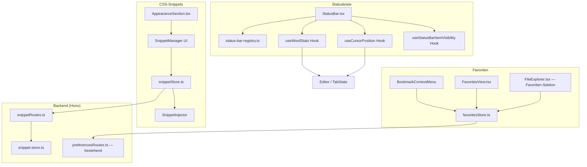

# Design Document: UI-Politur — Bookmarks, Statusleiste, CSS-Snippets

## Overview

Dieses Design erweitert drei bestehende bzw. angrenzende Frontend-Bereiche additiv:

1. **Favoriten** (`favoritesStore.ts`, `FavoritesView.tsx`, `FileExplorer.tsx`) erhalten eine manuelle Sortierreihenfolge, ein Kontextmenü und optionale Anzeigenamen.
2. **Statusleiste** (`StatusBar.tsx`, `status-bar-registry.ts`) erhält neue eingebaute Items (Wort-/Zeichenanzahl, Cursor-Position, Vault-Name), granulare Sichtbarkeit pro Item und ein Diffing-basiertes Rendering für Plugin-Items statt vollständigem Remount.
3. **CSS-Snippets** ist ein neues Feature: Frontend-Store + globaler (unscoped) Injector + Settings-UI in `AppearanceSection.tsx`, plus ein neues Backend-Modul `backend/src/snippets/` analog zu `backend/src/plugin/plugin-store.ts`.

### Design-Entscheidungen

1. **Additive Datenmodell-Erweiterung statt Migration**: `FavoriteEntry` bekommt zwei neue optionale Felder (`order`, `label`). Bestehende Einträge ohne diese Felder werden beim ersten Laden lazy migriert (Requirement 1.5) — keine Backend-Migration nötig, da die Struktur bereits als lose typisiertes JSON persistiert wird.
2. **Kein Wiederverwenden des Plugin-CSS-Injectors für Snippets**: `CssInjector` (bestehend) scoped CSS zwingend auf `[data-plugin-id]`. Snippets müssen global wirken (z. B. `body { }`, Variablen-Overrides auf `:root`). Ein neuer, bewusst *unscoped* `SnippetInjector` wird eingeführt; beide Injektoren teilen sich nur das Muster "ein `<style>`-Tag pro Einheit, Attribut-Marker zum gezielten Entfernen".
3. **Statusleisten-Items als Plugin-Pattern**: Die neuen eingebauten Items (Wortanzahl, Cursor, Vault-Name) werden intern über denselben Mechanismus wie Plugin-Items gerendert (eigene React-Komponenten statt imperativer DOM-Manipulation), da sie reaktiv auf Editor-State reagieren müssen. Nur echte Plugin-Items bleiben imperativ (Fremdcode).
4. **Diffing statt Remount**: `mountPluginItems` wird von "clear + re-append" auf ein Set-Differenz-Verfahren (hinzugefügte/entfernte `pluginId`s) umgestellt, um Requirement 7 zu erfüllen, ohne die bestehende `StatusBarItemEntry`-API zu brechen.
5. **Backend-Speicherstruktur für Snippets folgt dem Plugin-Store-Vorbild**: `data/snippets/<vaultId>/<snippetId>.css` + `_registry.json`, dieselbe Zugriffskontrolle wie Vault-Dateien, dieselbe atomare Schreibstrategie (Temp → rename).
6. **Debounce statt Sync-Rechenaufwand**: Wort-/Zeichenanzahl wird nicht bei jedem Tastendruck neu berechnet, sondern 300ms debounced (Requirement 4.2), um Tipp-Performance auf langen Dokumenten nicht zu beeinträchtigen.

## Architecture



## Components and Interfaces

### 1. Favoriten — Erweiterungen

#### `FavoriteEntry` (erweitert, `frontend/src/state/favoritesStore.ts`)

```typescript
export type BookmarkType = 'file' | 'heading' | 'block' | 'search'

export interface FavoriteEntry {
  vaultId: string
  path: string       // Bei type='search': leerer String (kein Datei-Bezug)
  addedAt: string     // ISO 8601, unverändert
  order: number        // NEU — aufsteigend, bestimmt Anzeigereihenfolge
  label?: string        // NEU — optionaler Anzeigename, überschreibt Dateinamen-Anzeige
  type?: BookmarkType   // NEU — Default 'file' wenn nicht gesetzt (Rückwärtskompatibilität)
  heading?: string       // NEU — nur bei type='heading': Überschriftentext
  blockId?: string        // NEU — nur bei type='block': Block-ID (ohne führendes ^)
  searchQuery?: string     // NEU — nur bei type='search': Suchanfrage
  searchCaseSensitive?: boolean // NEU — nur bei type='search'
  searchRegex?: boolean          // NEU — nur bei type='search'
}
```

`type` ist optional statt eines Pflichtfelds mit `'file'`-Default, damit bestehende, bereits persistierte Einträge (die kein `type`-Feld kennen) ohne Migration weiter als Datei-Bookmarks interpretiert werden — jede Stelle, die `entry.type` liest, behandelt `undefined` gleichbedeutend mit `'file'`.

#### `IFavoritesStore` (erweitert)

```typescript
export interface IFavoritesStore {
  add(vaultId: string, path: string): void
  remove(vaultId: string, path: string): void
  getForVault(vaultId: string): FavoriteEntry[]  // jetzt sortiert nach order, nicht addedAt
  isFavorite(vaultId: string, path: string): boolean
  updatePath(vaultId: string, oldPath: string, newPath: string): void
  removeByPath(vaultId: string, path: string): void
  /** NEU — verschiebt einen Eintrag an eine neue Position (0-indiziert innerhalb des Vaults) */
  reorder(vaultId: string, path: string, newIndex: number): void
  /** NEU — setzt oder löscht den Anzeigenamen eines Eintrags */
  setLabel(vaultId: string, path: string, label: string | null): void
  /** NEU — Requirement 11: Überschriften-Bookmark */
  addHeadingBookmark(vaultId: string, path: string, heading: string): void
  /** NEU — Requirement 12: Block-Bookmark */
  addBlockBookmark(vaultId: string, path: string, blockId: string): void
  /** NEU — Requirement 13: Such-Bookmark */
  addSearchBookmark(vaultId: string, query: string, caseSensitive: boolean, regex: boolean): void
}
```

`reorder()` implementiert Requirement 1.2 durch Neuberechnung der `order`-Werte aller betroffenen Einträge (einfaches Re-Indizieren der gesamten Liste nach dem Verschieben, da max. 50 Einträge pro Vault — kein Performance-Problem).

Die vier neuen `add*`-Methoden respektieren denselben 50er-Cap wie `add()` und weisen `type` sowie die typspezifischen Felder zu; alle nutzen intern dieselbe `order`-Vergabe wie `add()` (Requirement 1.4 gilt auch für Nicht-Datei-Bookmarks).

#### Verdrahtung der No-Op-Commands (`frontend/src/plugins/compat/core-commands-app.ts`)

Die vier bestehenden No-Op-Einträge (Zeilen 400–403) werden durch echte Handler ersetzt:

```typescript
{ id: 'bookmarks:bookmark-current-heading', name: 'Bookmarks: Bookmark heading under cursor...', run: (h) => h.onBookmarkCurrentHeading() },
{ id: 'bookmarks:bookmark-current-search', name: 'Bookmarks: Bookmark current search...', run: (h) => h.onBookmarkCurrentSearch() },
{ id: 'bookmarks:bookmark-current-section', name: 'Bookmarks: Bookmark block under cursor...', run: (h) => h.onBookmarkCurrentBlock() },
{ id: 'bookmarks:bookmark-all-tabs', name: 'Bookmarks: Bookmark all tabs...', run: (h) => h.onBookmarkAllTabs() },
```

Die vier neuen `on*`-Handler leben (wie die übrigen App-Kontext-Handler) in `CommandPaletteContainer.tsx`:

- `onBookmarkCurrentHeading()` — liest die zuletzt vor dem Cursor liegende Überschrift aus dem CM6-Dokument via `syntaxTree` (bestehender Wrapper aus `window.__codemirrorLanguage.syntaxTree`, siehe Live-Preview-Editor), ruft `favoritesStore.addHeadingBookmark()`
- `onBookmarkCurrentBlock()` — prüft den Absatz unter dem Cursor auf einen vorhandenen `Block_Marker` (`BLOCK_MARKER_REGEX` aus `plugins/block-ref/marker-parser.ts`); fehlt er, generiert `crypto.randomUUID().slice(0, 8)` eine neue ID, fügt `" ^<id>"` am Absatzende ein (Editor-Transaktion) und speichert den Bookmark erst nach erfolgreichem Insert
- `onBookmarkCurrentSearch()` — liest `SearchState` (`query`, `caseSensitive`, `regex`) aus dem `SearchContext`
- `onBookmarkAllTabs()` — iteriert `TabState.tabs`, filtert auf Tabs mit `filePath` (Datei-Tabs), ruft `favoritesStore.add()` je Tab bis zum 50er-Cap

#### Klick-Resolution pro Bookmark-Typ (`FavoritesView.tsx`)

```typescript
function resolveBookmarkClick(entry: FavoriteEntry, ctx: BookmarkResolveContext): void {
  switch (entry.type ?? 'file') {
    case 'file':
      ctx.onOpenFile(entry.vaultId, entry.path)
      break
    case 'heading':
      ctx.onOpenFile(entry.vaultId, entry.path, { scrollToHeading: entry.heading })
      break
    case 'block':
      ctx.onOpenFile(entry.vaultId, entry.path, { scrollToBlockId: entry.blockId })
      break
    case 'search':
      ctx.onOpenSearch({ query: entry.searchQuery!, caseSensitive: entry.searchCaseSensitive, regex: entry.searchRegex })
      break
  }
}
```

`onOpenFile`'s optionale `scrollToHeading`/`scrollToBlockId`-Parameter nutzen dieselbe Scroll-Logik, die bereits für interne Anchor-Links (`[[note#heading]]`, `[[note#^block-id]]`) existiert — keine neue Resolution-Implementierung nötig, nur ein zusätzlicher Aufrufpfad von der Favoriten_Ansicht statt vom gerenderten Link.

Migration nicht-migrierter Einträge (Requirement 1.5) erfolgt in `loadFavorites()`: fehlt bei mindestens einem Eintrag `order`, wird die gesamte Liste einmalig nach `addedAt` absteigend sortiert und mit `order = 0..n-1` versehen, bevor sie zurückgegeben wird.

#### `BookmarkContextMenu` (neu, `frontend/src/components/sidebar-panel/BookmarkContextMenu.tsx`)

Wiederverwendet das bestehende Kontextmenü-Pattern aus `FileExplorer.tsx` (`contextMenu.*`). Props: `entry: FavoriteEntry`, `fileExists: boolean`, Callbacks `onRemove`, `onRevealInExplorer`, `onRename`.

#### `FavoritesView.tsx` (erweitert)

- Drag-and-Drop via bestehende Drag-Infrastruktur, die `FileExplorer.tsx` bereits für Datei-Verschieben nutzt (HTML5 Drag Events, kein neues Paket)
- Rendert `label ?? getDisplayName(fileName)`
- Zeigt "fehlend"-Status wenn `getAbstractFileByPath`-Äquivalent die Datei nicht findet
- Rendert `BookmarkContextMenu` bei Rechtsklick / Kontextmenü-Taste

### 2. Statusleiste — Erweiterungen

#### `useWordStats` Hook (neu, `frontend/src/hooks/useWordStats.ts`)

```typescript
interface WordStats {
  words: number
  characters: number
  selectedWords: number | null      // null wenn keine Selektion
  selectedCharacters: number | null
}

function useWordStats(activeFileContent: string | null, selection: EditorSelection | null): WordStats
```

Zählt Wörter als whitespace-getrennte Tokens; Markdown-Steuerzeichen (`#*_\`[]`) werden vor der Wortzählung aus dem Vergleichsstring entfernt (nicht aus dem Original), damit Requirement 4.5 erfüllt ist. 300ms Debounce intern über `useDeferredValue`/`setTimeout`.

#### `useCursorPosition` Hook (neu, `frontend/src/hooks/useCursorPosition.ts`)

```typescript
interface CursorPosition {
  line: number       // 1-indiziert
  column: number      // 1-indiziert
  selectedLines: number | null
}

function useCursorPosition(editorView: EditorView | null): CursorPosition
```

Liest CodeMirror-Selektionsstatus (Slatebase nutzt CodeMirror 6 im Editor — bestehende Integration wird wiederverwendet, kein neuer Editor-Zugriffspfad).

#### `useStatusBarItemVisibility` Hook (neu, `frontend/src/hooks/useStatusBarItemVisibility.ts`)

Analog zu bestehendem `useStatusBar.ts` (globaler Toggle), aber parametrisiert über eine Item-ID:

```typescript
type BuiltinStatusBarItemId = 'clock' | 'wordStats' | 'cursorPosition' | 'vaultName'

function useStatusBarItemVisibility(itemId: BuiltinStatusBarItemId): { visible: boolean; toggle: () => void }
```

localStorage-Schlüssel: `slatebase:statusBarItem:<itemId>`, Default `true` (alle Items sichtbar, entspricht heutigem Verhalten für die Uhr).

#### `status-bar-registry.ts` (Diffing-Fix)

`StatusBar.tsx`'s `mountPluginItems` wird ersetzt durch eine Funktion, die nur die Differenz zwischen dem vorherigen und dem neuen `pluginId`-Set anwendet:

```typescript
function syncPluginItems(container: HTMLDivElement, prevItems: StatusBarItemEntry[], nextItems: StatusBarItemEntry[]): void {
  const prevIds = new Set(prevItems.map(i => i.element))
  const nextIds = new Set(nextItems.map(i => i.element))
  for (const item of prevItems) if (!nextIds.has(item.element)) item.element.remove()
  for (const item of nextItems) if (!prevIds.has(item.element)) container.appendChild(item.element)
  // Reihenfolge: nextItems ist bereits in Registrierungsreihenfolge (Registry pusht chronologisch)
}
```

Da Plugins ihr eigenes Element direkt mutieren (`textContent`, `innerHTML`), berührt dieser Diff die Elemente selbst nicht — Requirement 7.2 ist dadurch automatisch erfüllt, weil kein `container.innerHTML = ''` mehr aufgerufen wird.

#### `StatusBar.tsx` (erweitert)

Rendert vier neue bedingte Items links (Uhr bleibt), jeweils gated durch `useStatusBarItemVisibility`:

```
[Uhr] [Vault-Name] [Wortanzahl] [Cursor-Position]   ...   [Plugin-Items via Registry]
```

### 3. CSS-Snippets — Neues Feature

#### Datenmodell

```typescript
/** frontend/src/state/snippetStore.ts */
export interface CssSnippet {
  id: string          // = Dateiname ohne .css-Endung, z.B. "dark-accent"
  vaultId: string
  filename: string     // z.B. "dark-accent.css"
  enabled: boolean
  size: number          // Bytes
  updatedAt: string     // ISO 8601
}

export interface ISnippetStore {
  listForVault(vaultId: string): Promise<CssSnippet[]>
  upload(vaultId: string, filename: string, content: string): Promise<CssSnippet>
  createEmpty(vaultId: string, filename: string): Promise<CssSnippet>
  loadContent(vaultId: string, snippetId: string): Promise<string>
  saveContent(vaultId: string, snippetId: string, content: string): Promise<void>
  setEnabled(vaultId: string, snippetId: string, enabled: boolean): Promise<void>
  remove(vaultId: string, snippetId: string): Promise<void>
}
```

#### `SnippetInjector` (neu, `frontend/src/plugins/appearance/snippet-injector.ts`)

```typescript
export interface ISnippetInjector {
  /** Injects raw (unscoped) CSS content under a snippet-specific style tag. */
  apply(snippetId: string, css: string): void
  /** Removes the injected style tag for a snippet. */
  remove(snippetId: string): void
  /** Removes all currently-applied snippet style tags (used on vault switch). */
  removeAll(): void
}
```

Bewusst **kein** Wiederverwenden von `scopeCss()` aus `css-injector.ts` — Snippets werden roh injiziert (`style.textContent = css`, `data-snippet-id="<id>"` statt `data-plugin-id`). Größenprüfung (512 KB, Requirement 8.7 / 10.3) erfolgt vor dem Injizieren, analog zur bestehenden `MAX_CSS_SIZE_BYTES`-Konstante in `css-injector.ts` (eigene Konstante, kein Import, um die Module unabhängig zu halten).

#### `SnippetManager` UI (neu, `frontend/src/components/settings/SnippetManager.tsx`)

Eingebettet in `AppearanceSection.tsx` unterhalb des bestehenden Statusleisten-Blocks. Liste + Upload-Button + "Neu erstellen"-Button + pro Zeile: Toggle, Bearbeiten-Button (öffnet `SnippetEditorModal` mit einfachem Textarea/CodeMirror-CSS-Modus), Löschen-Button mit Bestätigungsdialog.

### 4. Backend — Snippet-Store

#### `backend/src/snippets/snippet-store.ts`

```typescript
export interface ISnippetStore {
  saveSnippet(vaultId: string, snippetId: string, content: string): Promise<void>
  loadSnippet(vaultId: string, snippetId: string): Promise<string | null>
  deleteSnippet(vaultId: string, snippetId: string): Promise<void>
  listSnippets(vaultId: string): Promise<SnippetMeta[]>
  saveRegistry(vaultId: string, registry: SnippetRegistryData): Promise<void>
  loadRegistry(vaultId: string): Promise<SnippetRegistryData | null>
  deleteAllForVault(vaultId: string): Promise<void>
}

interface SnippetMeta {
  id: string
  filename: string
  size: number
  updatedAt: string
}

interface SnippetRegistryData {
  version: 1
  snippets: Record<string, { enabled: boolean; updatedAt: string }>
}
```

#### `backend/src/api/snippetRoutes.ts`

```
GET    /api/v1/vaults/:vaultId/snippets                 — Liste
POST   /api/v1/vaults/:vaultId/snippets                 — Upload/Erstellen (Body: filename, content)
GET    /api/v1/vaults/:vaultId/snippets/:snippetId       — Inhalt laden
PUT    /api/v1/vaults/:vaultId/snippets/:snippetId       — Inhalt speichern
DELETE /api/v1/vaults/:vaultId/snippets/:snippetId       — Löschen
PUT    /api/v1/vaults/:vaultId/snippets/registry         — Aktivierungsstatus speichern
GET    /api/v1/vaults/:vaultId/snippets/registry         — Aktivierungsstatus laden
```

Zugriffskontrolle identisch zu `pluginRoutes.ts` (Vault-Besitzer + Freigabe-Berechtigte). Dateinamen-Validierung via Zod-Regex `/^[a-zA-Z0-9_-]+\.css$/` (Requirement 10.6).

### Backend-Speicherstruktur

```
data/snippets/
└── <vaultId>/
    ├── _registry.json          — { version: 1, snippets: { "<id>": { enabled, updatedAt } } }
    └── <snippetId>.css
```

## Correctness Properties

*A property is a characteristic or behavior that should hold true across all valid executions of a system.*

### Property 1: Favoriten-Sortierreihenfolge nach Reorder

*For any* Liste von N Favoriten_Einträgen und jede gültige Zielposition 0 ≤ i < N, ruft `reorder(vaultId, path, i)` dazu auf, dass `getForVault(vaultId)` den verschobenen Eintrag an Index i zurückgibt, während die relative Reihenfolge aller übrigen Einträge unverändert bleibt.

**Validates: Requirements 1.2, 1.3**

### Property 2: Lazy-Migration ist idempotent

*For any* gespeicherte Favoritenliste (mit oder ohne `order`-Feld), ergibt zweimaliges Aufrufen von `getForVault()` hintereinander dasselbe Ergebnis (stabile Migration, kein wiederholtes Neu-Zuweisen bei jedem Aufruf).

**Validates: Requirements 1.5**

### Property 3: Neue Favoriten erhalten die höchste Order

*For any* bestehende Favoritenliste mit maximaler `order` M, erhält ein neu hinzugefügter Eintrag `order` = M + 1 (oder 0, falls die Liste leer war), und erscheint damit am Ende der sortierten Liste.

**Validates: Requirements 1.4**

### Property 4: Label-Override ist reversibel

*For any* Favoriten_Eintrag, ergibt die Sequenz `setLabel(path, "X")` gefolgt von `setLabel(path, null)` denselben Anzeigenamen wie vor der ersten Operation (der ursprüngliche Dateiname).

**Validates: Requirements 3.3, 3.4**

### Property 5: Wortanzahl-Konsistenz

*For any* Textinhalt, entspricht die von `useWordStats` berechnete Wortanzahl der Anzahl nicht-leerer, durch Whitespace getrennter Tokens nach Entfernen der Zeichen `# * _ \` [ ]`, und die Zeichenanzahl entspricht exakt `content.length`.

**Validates: Requirements 4.5, 4.6**

### Property 6: Statusleisten-Item-Diffing verändert keine fremden Elemente

*For any* Sequenz von Registrierungen/Deregistrierungen von Plugin-Statusleisten-Items, entfernt `syncPluginItems` ausschließlich DOM-Elemente, deren zugehörige `pluginId` nicht mehr im aktuellen Registry-Zustand vorhanden ist, und fügt ausschließlich neu hinzugekommene Elemente ein — bestehende, weiterhin registrierte Elemente werden nie aus dem DOM entfernt (Referenzgleichheit bleibt erhalten).

**Validates: Requirements 7.1, 7.2**

### Property 7: Snippet-Aktivierung ist eine Bijektion zu injizierten Style-Tags

*For any* Menge aktivierter Snippet-IDs eines Vaults, entspricht die Menge der im Dokument-`<head>` vorhandenen `<style data-snippet-id>`-Elemente nach Anwendung genau dieser Menge — kein aktiviertes Snippet fehlt, kein deaktiviertes Snippet ist vorhanden.

**Validates: Requirements 9.1, 9.2, 9.4**

### Property 8: Vault-Wechsel entfernt alle Snippets des vorherigen Vaults

*For any* Wechsel von Vault A zu Vault B, sind nach Abschluss des Wechsels keine `<style data-snippet-id>`-Elemente mehr im DOM vorhanden, die zu einem in Vault A aktivierten (aber in Vault B nicht existierenden) Snippet gehören.

**Validates: Requirements 9.5**

### Property 9: Snippet-Dateinamen-Validierung

*For any* String, der nicht dem Muster `^[a-zA-Z0-9_-]+\.css$` entspricht, lehnt der Snippet_Store (Backend) das Speichern ab.

**Validates: Requirements 10.6**

### Property 10: Bookmark-Typ-Rückwärtskompatibilität

*For any* gespeicherter Favoriten_Eintrag ohne `type`-Feld, verhält sich jede Stelle, die `entry.type` liest (Klick-Resolution, Icon-Auswahl, Anzeige), identisch zu einem Eintrag mit `type: 'file'`.

**Validates: Requirements 11.5, 12.1, 13.1 (implizit über den Bookmark_Typ-Diskriminator)**

### Property 11: Bookmark-All-Tabs ist eine Teilmengen-Operation

*For any* Menge offener Datei-Tabs T und bereits vorhandener Favoriten F (beide für denselben Vault), ergibt `onBookmarkAllTabs()` eine neue Favoritenmenge F', für die gilt: F ⊆ F' und F' \ F ⊆ T \ F (nur bisher nicht favorisierte Tabs werden neu hinzugefügt, kein bestehender Favorit wird verändert oder entfernt), begrenzt auf maximal 50 Einträge insgesamt.

**Validates: Requirements 14.1, 14.2, 14.3, 14.4**

### Property 12: Block-Marker-Erzeugung ist eindeutig

*For any* Dateiinhalt ohne existierenden Block_Marker am Cursor-Absatz, erzeugt `onBookmarkCurrentBlock()` eine Block-ID, die nach keinem bereits im Dokument vorkommenden `^block-id`-Marker sucht und mit keinem davon kollidiert.

**Validates: Requirements 12.2**

## Error Handling

| Fehlerszenario | Handling | Auswirkung für Benutzer |
|---|---|---|
| Favorit-Reorder auf ungültigen Index (< 0 oder ≥ Länge) | Index wird auf gültigen Bereich geklemmt | Verschiebung landet am nächstgültigen Rand, kein Fehler |
| `setLabel` mit > 100 Zeichen | Eingabe wird clientseitig auf 100 Zeichen begrenzt | Eingabefeld zeigt Zeichenlimit an |
| Datei eines Favoriten existiert nicht mehr | `fileExists: false` im Kontextmenü-Check | "Fehlend"-Badge, eingeschränktes Kontextmenü (Req. 2.5) |
| CSS-Snippet-Upload > 512 KB | Backend lehnt mit 413-ähnlichem Fehler ab, Frontend zeigt Toast | Upload wird nicht gespeichert |
| Snippet-Name bereits vergeben | Backend/Frontend-Validierung vor dem Speichern | Fehlermeldung mit vorhandenem Namen |
| Ungültiges CSS in einem Snippet | Wird dennoch injiziert (Browser ignoriert kaputte Regeln), `console.warn` | Kein Blockieren, nur Konsolen-Hinweis |
| Snippet-Registry-Ladefehler (Backend nicht erreichbar) | Frontend fällt auf "alle Snippets deaktiviert" zurück, zeigt Fehler-Banner | Keine Snippets angewendet bis Reload/Retry |
| Zugriff auf Snippet-Endpoint ohne Vault-Berechtigung | 403, identisch zu bestehendem Vault-Datei-Zugriff | Kein Zugriff auf fremde Vault-Snippets |
| Word-Stats-Berechnung bei sehr großen Dateien (> 1 MB) | Debounce verhindert Blockierung; Berechnung läuft async/idle-priorisiert | Leicht verzögerte Anzeige statt UI-Freeze |

## Testing Strategy

### Dual Testing Approach

Unit-Tests für konkrete Fälle und Edge Cases, Property-Based Tests (`fast-check`) für die 9 oben definierten Properties, konsistent mit dem bestehenden Testansatz in `.kiro/specs/obsidian-plugin-compat/design.md`.

### PBT-Schwerpunkte

| Bereich | Properties | Generatoren |
|---|---|---|
| Favoriten-Reorder & Migration | 1, 2, 3 | Zufällige Favoritenlisten (mit/ohne `order`), zufällige Zielindizes |
| Favoriten-Label | 4 | Zufällige Strings, Sequenzen von set/clear |
| Wortstatistik | 5 | Zufälliger Markdown-Text mit variierender Whitespace-/Sonderzeichen-Dichte |
| Statusleisten-Diffing | 6 | Zufällige Sequenzen von addStatusBarItem/removeStatusBarItemsForPlugin |
| Snippet-Injection | 7, 8 | Zufällige Sets von Snippet-IDs, Aktivierungs-Sequenzen, Vault-Wechsel |
| Snippet-Validierung | 9 | Zufällige Dateinamen-Strings inkl. Pfadtraversal-Versuche |
| Bookmark-Typen | 10, 11, 12 | Zufällige Einträge mit/ohne `type`, zufällige Tab-/Favoriten-Mengen, zufällige Dokumente mit vorhandenen Block-Markern |

### Unit-Test-Schwerpunkte

| Bereich | Fokus |
|---|---|
| `BookmarkContextMenu` | Tastatur-Öffnen, Klick-außerhalb-Schließen, fehlende-Datei-Zustand |
| `useCursorPosition` | Zeile/Spalte bei Multi-Cursor (nur primärer Cursor wird angezeigt), Selektionszeilen-Zählung |
| `useStatusBarItemVisibility` | Default-Werte, localStorage-Persistenz, globaler vs. Item-Toggle-Interaktion |
| `SnippetManager` UI | Upload-Validierung, Lösch-Bestätigung, leerer Zustand |
| Backend `snippet-store.ts` | Atomare Writes, Registry-Konsistenz, `deleteAllForVault` |
| Backend `snippetRoutes.ts` | Zugriffskontrolle, Größenlimits, Dateinamen-Validierung |

### Ausführungsregeln

- PBT-Tests werden nur auf explizite Anforderung ausgeführt (bestehende Projektregel)
- Reguläre Tests: `npm run test`
- Test-Dateien co-located neben Source (`*.test.ts`, `*.pbt.test.ts`)
