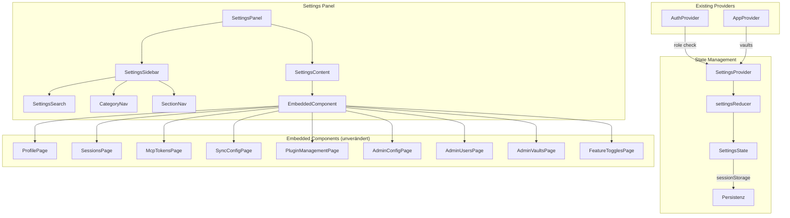

# Design Document: Unified Settings

## Overview

Das Unified Settings Feature konsolidiert alle verstreuten Einstellungsseiten in ein einzelnes, kohärentes Settings-Panel mit kategorisierter Seitenleisten-Navigation. Die Architektur folgt dem bestehenden Provider/Reducer-Pattern mit einem eigenen `SettingsProvider` für den Navigationsstand und setzt ausschließlich auf die Wiederverwendung bestehender Komponenten als Inhalte der Sektionen.

**Kern-Entscheidungen:**
- Eigener `SettingsProvider` mit `useReducer` für den Settings-Navigationsstand (Kategorie, Sektion, Vault-Auswahl)
- Keine neuen API-Endpoints — das Panel orchestriert bestehende Komponenten, die ihre eigenen API-Calls ausführen
- `sessionStorage` für Navigationsstand-Persistenz (flüchtig, pro Browser-Tab)
- CSS Custom Properties aus `index.css` für vollständige Dark-Mode-Kompatibilität
- Responsive Layout via CSS Container Query (`@container`) mit 700px Schwellenwert
- Bestehende Routen bleiben funktional (Deprecated-Marker intern)

## Architecture



**Schichtenarchitektur:**
1. **SettingsProvider** — Verwaltet Navigationsstand (Kategorie, Sektion, Vault-Auswahl, Suchbegriff)
2. **SettingsPanel** — Orchestriert Layout (Sidebar + Content), reagiert auf Container-Breite
3. **SettingsSidebar** — Navigation mit Suche, Kategorien, Sektionen
4. **SettingsContent** — Rendert die aktive eingebettete Komponente

## Components and Interfaces

### State Layer

```typescript
/** Kategorien im Settings-Panel (feste Reihenfolge). */
export type SettingsCategory = 'account' | 'vault' | 'administration'

/** Sektions-Kennungen pro Kategorie. */
export type AccountSection = 'profile' | 'password' | 'sessions' | 'mcp-tokens' | 'delete-account'
export type VaultSection = 'sync' | 'plugins'
export type AdminSection = 'server-config' | 'user-management' | 'vault-management' | 'feature-toggles'
export type SettingsSection = AccountSection | VaultSection | AdminSection

/** Navigationsstand im Settings-Panel. */
export interface SettingsNavState {
  category: SettingsCategory
  section: SettingsSection
  /** Vault-ID für vault-spezifische Sektionen (null = kein Vault gewählt). */
  selectedVaultId: string | null
  /** Suchbegriff im Suchfeld (leer = keine Suche aktiv). */
  searchQuery: string
  /** Ob das Navigationsmenü im Responsive-Modus ausgeklappt ist. */
  mobileNavOpen: boolean
}

/** Actions für den Settings-Reducer. */
export type SettingsAction =
  | { type: 'NAVIGATE'; payload: { category: SettingsCategory; section: SettingsSection } }
  | { type: 'SELECT_VAULT'; payload: { vaultId: string | null } }
  | { type: 'SET_SEARCH'; payload: { query: string } }
  | { type: 'TOGGLE_MOBILE_NAV' }
  | { type: 'CLOSE_MOBILE_NAV' }
  | { type: 'RESTORE_STATE'; payload: SettingsNavState }

/** sessionStorage-Schlüssel für Navigationsstand. */
export const SETTINGS_NAV_KEY = 'slatebase-settings-nav'
```

### ISettingsRegistry Interface

```typescript
/** Statische Definition einer Sektion für Navigation und Suche. */
export interface ISettingsSectionDef {
  id: SettingsSection
  labelKey: string         // i18n-Schlüssel für das Label
  category: SettingsCategory
  requiresAdmin: boolean
  requiresVault: boolean   // Nur interaktiv wenn Vault gewählt
}

/** Registry aller verfügbaren Sektionen. */
export interface ISettingsRegistry {
  getCategories(isAdmin: boolean): SettingsCategory[]
  getSections(category: SettingsCategory, isAdmin: boolean): ISettingsSectionDef[]
  getAllSections(isAdmin: boolean): ISettingsSectionDef[]
  findSection(id: SettingsSection): ISettingsSectionDef | undefined
}
```

### Component Interfaces

```typescript
/** Props für das Haupt-Settings-Panel. */
export interface SettingsPanelProps {
  /** Ob das Panel sichtbar ist. */
  open: boolean
  /** Callback zum Schließen des Panels. */
  onClose: () => void
  /** Optionale initiale Navigation (für Deep-Links). */
  initialNav?: { category: SettingsCategory; section: SettingsSection }
}

/** Props für die Sidebar-Komponente. */
export interface SettingsSidebarProps {
  state: SettingsNavState
  isAdmin: boolean
  vaults: Array<{ id: string; name: string }>
  dispatch: React.Dispatch<SettingsAction>
}

/** Props für den Content-Bereich. */
export interface SettingsContentProps {
  state: SettingsNavState
  apiClient: IApiClient
  isAdmin: boolean
}
```

### Komponenten-Hierarchie

```
SettingsPanel (Container, Layout-Orchestrierung)
├── SettingsSidebar (role="navigation")
│   ├── SettingsSearch (Suchfeld mit Debounce)
│   ├── VaultSelector (Vault-Dropdown, nur in Vault-Kategorie)
│   └── SettingsNavList (Kategorien + Sektionen als <ul>/<li>)
└── SettingsContent (role="main")
    └── [Aktive eingebettete Komponente]
```

### Einbettung bestehender Komponenten

Die bestehenden Seiten-Komponenten werden ohne ihre äußeren Layout-Container eingebettet. Da alle relevanten Komponenten bereits eine `apiClient`-Prop akzeptieren, ist die Integration direkt:

| Sektion | Komponente | Props |
|---------|-----------|-------|
| Profil | `ProfilePage` | `{ apiClient }` |
| Passwort ändern | `ChangePasswordPage` | `{ apiClient }` |
| Sitzungen | `SessionsPage` | `{ apiClient }` |
| MCP-Tokens | `McpTokensPage` | `{ apiClient }` |
| Konto löschen | `AccountDeletionSection` | `{ apiClient }` (neu extrahiert) |
| Synchronisation | `SyncConfigPage` | `{ vaultId }` |
| Plugins | `PluginManagementPage` | `{ apiClient, vaultId }` |
| Serverkonfiguration | `AdminConfigPage` | `{ apiClient }` |
| Benutzerverwaltung | `AdminUsersPage` | `{ apiClient }` |
| Vault-Verwaltung | `AdminVaultsPage` | `{ apiClient }` |
| Feature-Toggles | `FeatureTogglesSection` | `{ apiClient }` (extrahiert aus bestehender Admin-UI) |

## Data Models

### Persistierter Navigationsstand (sessionStorage)

```typescript
/** Format der sessionStorage-Daten. */
interface PersistedSettingsNav {
  category: SettingsCategory
  section: SettingsSection
  selectedVaultId: string | null
}
```

Validierung beim Wiederherstellen:
- Prüfung ob `category` ein gültiger Wert ist
- Prüfung ob `section` zur `category` gehört
- Prüfung ob `administration`-Kategorie bei Nicht-Admin → Fallback auf Default
- Prüfung ob `selectedVaultId` noch in der Vault-Liste existiert → null wenn nicht

### Sektions-Registry (statisch)

```typescript
const SETTINGS_SECTIONS: ISettingsSectionDef[] = [
  // Konto
  { id: 'profile', labelKey: 'settings.sections.profile', category: 'account', requiresAdmin: false, requiresVault: false },
  { id: 'password', labelKey: 'settings.sections.password', category: 'account', requiresAdmin: false, requiresVault: false },
  { id: 'sessions', labelKey: 'settings.sections.sessions', category: 'account', requiresAdmin: false, requiresVault: false },
  { id: 'mcp-tokens', labelKey: 'settings.sections.mcpTokens', category: 'account', requiresAdmin: false, requiresVault: false },
  { id: 'delete-account', labelKey: 'settings.sections.deleteAccount', category: 'account', requiresAdmin: false, requiresVault: false },
  // Vault
  { id: 'sync', labelKey: 'settings.sections.sync', category: 'vault', requiresAdmin: false, requiresVault: true },
  { id: 'plugins', labelKey: 'settings.sections.plugins', category: 'vault', requiresAdmin: false, requiresVault: true },
  // Administration
  { id: 'server-config', labelKey: 'settings.sections.serverConfig', category: 'administration', requiresAdmin: true, requiresVault: false },
  { id: 'user-management', labelKey: 'settings.sections.userManagement', category: 'administration', requiresAdmin: true, requiresVault: false },
  { id: 'vault-management', labelKey: 'settings.sections.vaultManagement', category: 'administration', requiresAdmin: true, requiresVault: false },
  { id: 'feature-toggles', labelKey: 'settings.sections.featureToggles', category: 'administration', requiresAdmin: true, requiresVault: false },
]
```

### Suchindex (abgeleitet)

Die Suche operiert auf den Labels der Sektionen (i18n-aufgelöst). Kein separater Index nötig — die Registry wird mit dem aufgelösten Label-String gefiltert.

```typescript
/** Suchergebnis-Eintrag. */
interface SettingsSearchResult {
  section: ISettingsSectionDef
  /** Aufgelöstes Label (z. B. "Profil", "Synchronisation"). */
  label: string
}
```


## Correctness Properties

*A property is a characteristic or behavior that should hold true across all valid executions of a system — essentially, a formal statement about what the system should do. Properties serve as the bridge between human-readable specifications and machine-verifiable correctness guarantees.*

### Property 1: Category visibility is role-dependent

*For any* boolean `isAdmin`, `getCategories(isAdmin)` shall always return categories beginning with `["account", "vault"]` in that order, and shall include `"administration"` as the last entry if and only if `isAdmin` is `true`.

**Validates: Requirements 1.3, 4.2**

### Property 2: Navigation guard rejects unauthorized access

*For any* settings state and *for any* `NAVIGATE` action targeting a section with `requiresAdmin: true`, when `isAdmin` is `false`, the resulting state shall be `{ category: "account", section: "profile" }` (the default fallback).

**Validates: Requirements 4.7, 4.8**

### Property 3: Navigation produces valid category-section pairs

*For any* valid `NAVIGATE` action with a `category` and `section`, if the section belongs to that category in the registry, then the resulting state shall have `state.category === category` and `state.section === section`. If the section does NOT belong to the category, the resulting state shall fall back to the first section of that category.

**Validates: Requirements 1.4, 5.5**

### Property 4: Vault section interactivity requires vault selection

*For any* settings state where `category === "vault"`, vault sections (those with `requiresVault: true`) shall be navigable/interactive if and only if `selectedVaultId !== null`.

**Validates: Requirements 3.3, 3.4**

### Property 5: Navigation state round-trip persistence

*For any* valid `SettingsNavState`, serializing it to the `sessionStorage` format and then deserializing/restoring it (with `isAdmin` matching the state) shall produce an equivalent navigation state (same `category`, `section`, `selectedVaultId`).

**Validates: Requirements 5.1, 5.2**

### Property 6: Invalid persisted state falls back to defaults

*For any* arbitrary JSON string stored in `sessionStorage` under the settings key, if the deserialized value contains an invalid `category`, an invalid `section` for that category, or an `administration` category when `isAdmin` is `false`, then the restored state shall be `{ category: "account", section: "profile" }`.

**Validates: Requirements 5.3**

### Property 7: Mobile navigation closes on section selection

*For any* settings state where `mobileNavOpen === true`, dispatching a `NAVIGATE` action shall produce a resulting state with `mobileNavOpen === false`.

**Validates: Requirements 6.3**

### Property 8: Search filter returns only matching entries

*For any* non-empty search query string `q` and *for any* set of section definitions with resolved labels, the filter function shall return only sections whose label contains `q` as a case-insensitive substring. When `q` is empty, all sections (appropriate for the user's role) shall be returned.

**Validates: Requirements 9.2, 9.4**

### Property 9: Navigation from search preserves search query

*For any* settings state with a non-empty `searchQuery` and *for any* `NAVIGATE` action, the resulting state shall retain the original `searchQuery` value unchanged.

**Validates: Requirements 9.5**

## Error Handling

### Navigation Errors

| Fehlerfall | Verhalten |
|-----------|-----------|
| Ungültige Kategorie in sessionStorage | Fallback auf "Konto" → "Profil" |
| Ungültige Sektion in sessionStorage | Fallback auf erste Sektion der Kategorie |
| Admin-Sektion ohne Admin-Rolle | Redirect auf "Konto" → "Profil" |
| Vault-Sektion ohne gewählten Vault | Sektion als deaktiviert darstellen, kein Content laden |
| sessionStorage nicht verfügbar | Graceful Degradation — kein Persistieren, kein Fehler |

### Eingebettete Komponenten

- Fehler innerhalb einer eingebetteten Komponente werden durch deren eigene Error-Darstellung behandelt
- Das Settings-Panel zeigt keinen globalen Error-State — Fehler bleiben im Inhaltsbereich der aktiven Sektion isoliert
- Kein Error Boundary um individuelle Sektionen nötig, da die Komponenten bereits eigene Fehlerbehandlung haben

### Keyboard Shortcut

- `Ctrl+,` wird als globaler Event-Listener registriert
- Wenn das Panel bereits offen ist, wird es in den Vordergrund gebracht (kein Toggle-Close über Shortcut)
- Konflikt-Vermeidung: `e.preventDefault()` um Browser-interne Shortcuts zu blockieren

## Testing Strategy

### Unit Tests (Vitest)

**settingsReducer.test.ts:**
- NAVIGATE zu gültigen Kategorien/Sektionen
- NAVIGATE zu Admin-Sektion ohne Admin-Rolle → Fallback
- SELECT_VAULT aktualisiert selectedVaultId
- SET_SEARCH aktualisiert searchQuery
- TOGGLE_MOBILE_NAV / CLOSE_MOBILE_NAV
- RESTORE_STATE mit gültigem und ungültigem Payload

**settingsRegistry.test.ts:**
- getCategories mit/ohne Admin
- getSections für jede Kategorie
- Reihenfolge-Assertions
- findSection für existierende/nicht-existierende IDs

**settingsSearch.test.ts:**
- Filterung mit verschiedenen Queries
- Case-insensitive Matching
- Leerer Query gibt alle Sektionen zurück
- Admin-Sektionen für Nicht-Admins ausgeblendet

**settingsPersistence.test.ts:**
- Serialisierung/Deserialisierung Round-Trip
- Ungültige JSON-Daten → Fallback
- sessionStorage-Fehler (QuotaExceeded) → graceful

### Property-Based Tests (fast-check)

Die folgenden Property-Tests verwenden `fast-check` mit mindestens 100 Iterationen:

- **Property 1**: Kategorie-Sichtbarkeit (`isAdmin` ∈ {true, false}, generiert)
- **Property 2**: Navigation Guard (zufällige Admin-Sektionen + `isAdmin=false`)
- **Property 3**: Navigation-Validität (zufällige Kategorie-Sektion-Paare)
- **Property 5**: Round-Trip Persistenz (zufällige gültige States)
- **Property 6**: Ungültige States → Fallback (zufällige Strings/Objekte)
- **Property 7**: Mobile Nav Close (zufällige States mit `mobileNavOpen=true`)
- **Property 8**: Suchfilter (zufällige Query-Strings × Sektions-Labels)
- **Property 9**: Search-Query-Beibehaltung (zufällige States + NAVIGATE)

Jeder Property-Test wird mit einem Kommentar annotiert:
```typescript
// Feature: unified-settings, Property 1: Category visibility is role-dependent
```

**Konfiguration:** `fc.assert(fc.property(...), { numRuns: 100 })`

### Komponenten-Tests (Vitest + Testing Library)

- SettingsPanel rendert Sidebar + Content
- Korrekte Komponente pro Sektion
- Tastaturnavigation (Tab, Pfeiltasten, Enter)
- ARIA-Attribute (role, aria-current)
- Responsive Verhalten (Container-Breite-Mock)
- Vault-Selektor-Interaktion
- Suchfeld mit Debounce

### Nicht per PBT getestet

- UI-Rendering-Checks (korrekte Komponente für Sektion) → Example-based Tests
- Dark-Mode-Darstellung → Visual/Snapshot-Tests
- CSS Custom Property-Nutzung → Static Analysis / Lint
- Tastaturshortcut-Registrierung → Example-based Tests
- Fokus-Management → Example-based DOM-Tests
