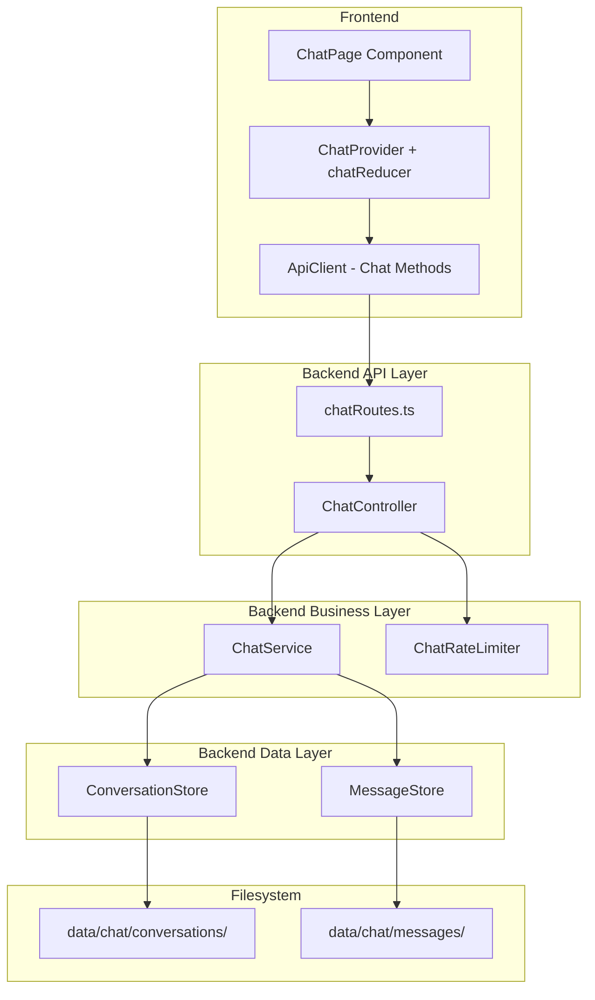

# Design Document: User Chat

## Overview

Das Chat-System erweitert Slatebase um Echtzeit-Kommunikation zwischen authentifizierten Benutzern. Es folgt den bestehenden Architekturprinzipien: Layered Architecture, Interface-First Design, Filesystem-basierte Persistenz mit atomaren Schreiboperationen und manuelle DI.

Der Kern-Scope umfasst Requirements 1–8 (Authentifizierung, Nachrichten senden/abrufen, Konversationen erstellen/auflisten, Persistenz, Rate-Limiting, Eingabevalidierung). Die optionalen Erweiterungen (Requirements 9–16) werden als Erweiterungspunkte im Design berücksichtigt, aber nicht implementiert.

### Design-Entscheidungen

1. **REST-API statt WebSocket für den Kern**: Der Kern nutzt ausschließlich REST-Endpoints. WebSocket ist als optionale Erweiterung (Req. 9) vorgesehen, aber nicht Teil des initialen Designs.
2. **Filesystem-Persistenz**: Konversationen und Nachrichten werden als JSON-Dateien gespeichert — konsistent mit dem bestehenden Persistenz-Ansatz (Sessions, Users, Shares).
3. **In-Memory-Index für schnelle Lookups**: Ähnlich wie der SessionStore wird ein In-Memory-Index für Konversations-Teilnehmer und Nachrichten-Metadaten geführt, mit dem Filesystem als Source of Truth.
4. **Separater Chat-Rate-Limiter**: Ein eigener Rate-Limiter für Nachrichten (30/60s) unabhängig vom Login-Rate-Limiter, da die Anforderungen (gleitendes Fenster, andere Schwellwerte) unterschiedlich sind.
5. **Eigener Reducer im Frontend**: `chatReducer` + `ChatProvider` als separater Context — folgt dem Prinzip "Separate Reducer für separate Concerns".

## Architecture



### Schichten-Integration

Die Chat-Komponenten integrieren sich in die bestehende Architektur:

- **Config**: Keine neuen Config-Werte nötig (Rate-Limit-Werte als Konstanten)
- **Logger**: Bestehender `ILogger` wird injiziert
- **Data Layer**: `ConversationStore` + `MessageStore` (neue Module unter `src/chat/`)
- **Business Layer**: `ChatService` orchestriert Stores, validiert Berechtigungen
- **API Layer**: `chatRoutes.ts` mit `ChatController`, geschützt durch bestehende Auth/CSRF-Middleware
- **Composition Root**: Neue Instanzen in `src/index.ts` verdrahtet (nach VaultAccessControlService, vor Controllers)

### Composition Root Einordnung

```typescript
// In src/index.ts — nach Schritt 3 (Business Layer), vor Schritt 5 (Controllers):

// 3b. Chat Data Layer
const conversationStore = new ConversationStore(serverConfig.dataDir, logger)
const messageStore = new MessageStore(serverConfig.dataDir, logger)

// 3c. Chat Business Layer
const chatRateLimiter = new ChatRateLimiter()
const chatService = new ChatService(conversationStore, messageStore, userRepository, logger)

// 5b. Chat Controller
const chatController = new ChatController(chatService, chatRateLimiter, logger)

// 6. Route Modules — ChatRouteModule hinzufügen:
const routeModules = [
  // ... bestehende Module ...
  new ChatRouteModule(chatController),
]

// Startup — nach sessionStore.loadIndex():
await conversationStore.loadIndex()
```

## Components and Interfaces

### Backend Interfaces

```typescript
// ─── Data Models ─────────────────────────────────────────────────────────────

interface Conversation {
  id: string                    // 24-char hex
  participants: string[]        // User-IDs
  createdAt: string             // ISO 8601
  createdBy: string             // User-ID des Erstellers
}

interface Message {
  id: string                    // 24-char hex
  conversationId: string        // 24-char hex
  senderId: string              // User-ID
  content: string               // 1–4000 Zeichen
  timestamp: string             // ISO 8601
}

interface ConversationListItem {
  id: string
  participants: string[]
  participantNames: string[]        // Aufgelöste Anzeigenamen (gleiche Reihenfolge wie participants)
  lastMessageTimestamp: string | null
  lastMessagePreview: string | null  // max 100 Zeichen
}

interface PaginatedMessages {
  messages: Message[]
  total: number
  page: number
  pageSize: number
  hasMore: boolean
}

interface PaginatedConversations {
  conversations: ConversationListItem[]
  total: number
  page: number
  pageSize: number
  hasMore: boolean
}
```

### IChatStore (Data Layer)

```typescript
interface IConversationStore {
  /** Create a new conversation. */
  create(conversation: Conversation): Promise<void>

  /** Find a conversation by ID. Returns null if not found. */
  findById(id: string): Promise<Conversation | null>

  /** Find all conversations where userId is a participant. */
  findByParticipant(userId: string): Promise<Conversation[]>

  /** Load all conversations from disk into memory index. */
  loadIndex(): Promise<void>
}

interface IMessageStore {
  /** Append a message to a conversation's message file. */
  append(message: Message): Promise<void>

  /** Read messages for a conversation with pagination (ascending by timestamp). */
  findByConversation(conversationId: string, page: number, pageSize: number): Promise<PaginatedMessages>

  /** Get the last message of a conversation (for list preview). */
  getLastMessage(conversationId: string): Promise<Message | null>
}
```

### IChatService (Business Layer)

```typescript
interface IChatService {
  /** Create a new conversation with the given participants. */
  createConversation(creatorId: string, participantIds: string[]): Promise<Conversation>

  /** Send a message to a conversation. */
  sendMessage(senderId: string, conversationId: string, content: string): Promise<Message>

  /** Get messages for a conversation (paginated). */
  getMessages(userId: string, conversationId: string, page?: number): Promise<PaginatedMessages>

  /** List conversations for a user (paginated, sorted by last message). */
  listConversations(userId: string, page?: number): Promise<PaginatedConversations>
}
```

### IChatRateLimiter

```typescript
interface IChatRateLimiter {
  /** Check if a user can send a message. Returns remaining seconds if blocked. */
  checkLimit(userId: string): { allowed: boolean; retryAfter?: number }

  /** Record a sent message for rate tracking. */
  recordMessage(userId: string): void
}
```

### API Routes

| Method | Path | Purpose |
|--------|------|---------|
| POST | /api/v1/chat/conversations | Konversation erstellen |
| GET | /api/v1/chat/conversations | Eigene Konversationen auflisten |
| GET | /api/v1/chat/conversations/:conversationId/messages | Nachrichten abrufen |
| POST | /api/v1/chat/conversations/:conversationId/messages | Nachricht senden |

### Frontend Components

```
src/
├── state/
│   ├── chatState.ts          — Chat reducer + types
│   └── chatContext.ts        — ChatProvider + useChatContext hook
├── components/
│   ├── ChatPage.tsx          — Hauptansicht (Konversationsliste + Nachrichtenbereich)
│   ├── ConversationList.tsx  — Liste der Konversationen
│   ├── MessageView.tsx       — Nachrichtenanzeige einer Konversation
│   ├── MessageInput.tsx      — Eingabefeld für neue Nachrichten
│   └── NewConversation.tsx   — Dialog zum Erstellen neuer Konversationen (nutzt bestehende User-Suche)
```

### IApiClient-Erweiterung (Frontend)

Das bestehende `IApiClient`-Interface in `frontend/src/api/index.ts` wird um Chat-Methoden erweitert:

```typescript
// Ergänzungen zum IApiClient-Interface:

/** Create a new conversation with the given participant user IDs. */
createConversation(participantIds: string[]): Promise<Conversation>

/** List the current user's conversations (paginated). */
listConversations(page?: number): Promise<PaginatedConversations>

/** Get messages for a conversation (paginated). */
getMessages(conversationId: string, page?: number): Promise<PaginatedMessages>

/** Send a message to a conversation. */
sendMessage(conversationId: string, content: string): Promise<Message>
```

### Wiederverwendbare UI-Komponenten

Das Chat-Frontend nutzt bestehende wiederverwendbare Komponenten:

- **`ConfirmModal`** — Bestätigungsdialog beim Verlassen einer Konversation (falls zukünftig implementiert)
- **`Toast`** — Fehler-Feedback bei Rate-Limiting (429) und Netzwerkfehlern
- **`InlineInput`** — Für schnelle Konversations-Erstellung (Teilnehmer-Eingabe)
- **User-Suche** — Bestehender `/api/v1/users/search?q=...` Endpoint + Autocomplete-Pattern aus `VaultSharing.tsx` wiederverwendbar

### i18n-Integration

Neuer Übersetzungs-Namespace `chat.*` in `frontend/src/i18n/de.ts` und `en.ts`:

```typescript
chat: {
  title: 'Chat',
  newConversation: 'Neue Konversation',
  noConversations: 'Noch keine Konversationen',
  noMessages: 'Noch keine Nachrichten',
  sendPlaceholder: 'Nachricht schreiben…',
  send: 'Senden',
  participants: 'Teilnehmer',
  addParticipant: 'Teilnehmer hinzufügen',
  rateLimited: 'Zu viele Nachrichten. Bitte {seconds} Sekunden warten.',
  messageTooLong: 'Nachricht zu lang (max. 4000 Zeichen)',
  messageEmpty: 'Nachricht darf nicht leer sein',
  conversationCreated: 'Konversation erstellt',
  errorSending: 'Nachricht konnte nicht gesendet werden',
  errorLoading: 'Konversationen konnten nicht geladen werden',
  participantNotFound: 'Benutzer nicht gefunden: {username}',
  participantSuspended: 'Benutzer ist gesperrt: {username}',
  tooManyParticipants: 'Maximal 50 Teilnehmer erlaubt',
  tooFewParticipants: 'Mindestens ein weiterer Teilnehmer nötig',
}
```

### ChatProvider-Einordnung in Provider-Hierarchie

```
AuthProvider → I18nBridge → I18nProvider → AuthGuard → AppProvider → TabProvider → ChatProvider → App
```

Der `ChatProvider` wird innerhalb der authentifizierten App eingebunden (nach `TabProvider`), da Chat nur für eingeloggte Benutzer verfügbar ist. Er ist optional — wird nur gemountet wenn der Chat-Bereich aktiv ist (Lazy Loading möglich).

## Data Models

### Filesystem-Struktur

```
data/
└── chat/
    ├── conversations/
    │   └── <conversationId>.json    — Konversations-Metadaten
    └── messages/
        └── <conversationId>.jsonl   — Nachrichten (JSONL, append-only)
```

### Konversations-Datei (`<conversationId>.json`)

```json
{
  "id": "a1b2c3d4e5f6a1b2c3d4e5f6",
  "participants": ["userId1", "userId2"],
  "createdAt": "2025-01-15T10:30:00.000Z",
  "createdBy": "userId1"
}
```

### Nachrichten-Datei (`<conversationId>.jsonl`)

Jede Zeile ist ein JSON-Objekt (JSONL-Format, append-only):

```jsonl
{"id":"msg1...","conversationId":"conv1...","senderId":"user1","content":"Hallo!","timestamp":"2025-01-15T10:31:00.000Z"}
{"id":"msg2...","conversationId":"conv1...","senderId":"user2","content":"Hi!","timestamp":"2025-01-15T10:31:30.000Z"}
```

**Begründung für JSONL**: 
- Append-only (kein Rewrite der gesamten Datei bei neuer Nachricht)
- Effizientes Lesen der letzten N Nachrichten (Datei rückwärts lesen)
- Konsistent mit dem Audit-Log-Pattern (`data/audit/YYYY-MM-DD.jsonl`)
- Korrupte einzelne Zeilen können übersprungen werden ohne die gesamte Konversation zu verlieren

### ID-Generierung

Konversations-IDs und Nachrichten-IDs: `crypto.randomBytes(12).toString('hex')` → 24 Hex-Zeichen. Konsistent mit der Validierungsanforderung (Req. 8.2).

### In-Memory-Index

Der `ConversationStore` hält beim Start einen Index:

```typescript
// Schneller Lookup: userId → Set<conversationId>
private participantIndex: Map<string, Set<string>>

// Schneller Lookup: conversationId → Conversation
private conversationCache: Map<string, Conversation>
```

Der `MessageStore` hält pro Konversation die letzte Nachricht gecacht:

```typescript
// Für Konversationsliste: conversationId → lastMessage
private lastMessageCache: Map<string, Message>
```

### Zod-Validierungsschemas

```typescript
const hexId24Schema = z.string().regex(/^[0-9a-f]{24}$/)

const sendMessageSchema = z.object({
  content: z.string().min(1).max(4000).refine(
    (s) => s.trim().length > 0,
    { message: 'Message content must not be empty or whitespace-only' }
  ),
})

const createConversationSchema = z.object({
  participants: z.array(z.string().uuid()).min(1).max(49),
})

const paginationSchema = z.object({
  page: z.coerce.number().int().min(1).default(1),
  pageSize: z.coerce.number().int().min(1).max(50).default(50),
})
```


## Correctness Properties

*A property is a characteristic or behavior that should hold true across all valid executions of a system — essentially, a formal statement about what the system should do. Properties serve as the bridge between human-readable specifications and machine-verifiable correctness guarantees.*

### Property 1: Server enforces session identity

*For any* message sent via the API, regardless of what senderId the client includes in the request body, the persisted message SHALL always have the senderId equal to the userId from the server-side session.

**Validates: Requirements 1.2, 1.4**

### Property 2: Message persistence round-trip

*For any* valid message content sent to an existing conversation by a participant, the message SHALL be retrievable from the conversation's message list with identical content, senderId, and a valid ISO-8601 timestamp.

**Validates: Requirements 2.1, 6.1**

### Property 3: Message IDs are unique

*For any* set of N messages sent (to the same or different conversations), all returned message IDs SHALL be distinct and match the 24-character hexadecimal format.

**Validates: Requirements 2.2, 8.2**

### Property 4: Participant-only access control

*For any* conversation and any user who is NOT in the conversation's participant list, both sending a message and retrieving messages SHALL be rejected with a 403 status.

**Validates: Requirements 2.5, 3.3**

### Property 5: Messages are sorted ascending by timestamp

*For any* conversation containing messages, retrieving messages SHALL return them in strictly non-decreasing order of their timestamp field.

**Validates: Requirements 3.1**

### Property 6: Pagination respects page size limits

*For any* conversation with N messages and any valid page/pageSize request (pageSize ≤ 50), the returned page SHALL contain at most pageSize messages, and the union of all pages SHALL contain exactly N messages.

**Validates: Requirements 3.2**

### Property 7: Conversation creation invariants

*For any* valid participant list, creating a conversation SHALL produce a unique 24-char hex ID, and the resulting participant list SHALL always include the creator's userId.

**Validates: Requirements 4.1, 4.2**

### Property 8: Participant deduplication

*For any* participant list containing duplicate user IDs (including the creator's own ID), the resulting conversation's participant list SHALL contain each user ID exactly once.

**Validates: Requirements 4.7, 4.8**

### Property 9: Conversation list contains only user's conversations

*For any* user, listing conversations SHALL return only conversations where the user is a participant, and the list SHALL be sorted by lastMessageTimestamp in descending order.

**Validates: Requirements 5.1**

### Property 10: Last message preview truncation

*For any* conversation with a last message longer than 100 characters, the lastMessagePreview in the conversation list SHALL be at most 100 characters long.

**Validates: Requirements 5.2**

### Property 11: Persistence survives reload

*For any* set of conversations and messages created, after reloading the store index from disk, all previously created data SHALL be retrievable with identical content.

**Validates: Requirements 6.3**

### Property 12: Rate limiter allows exactly 30 messages per window

*For any* user, the rate limiter SHALL allow the first 30 messages within a 60-second window and reject the 31st and subsequent messages with a retryAfter value between 1 and 60 seconds.

**Validates: Requirements 7.1, 7.4**

### Property 13: Rate limiter is per-user independent

*For any* two distinct users, exhausting one user's rate limit SHALL have no effect on the other user's ability to send messages.

**Validates: Requirements 7.2**

### Property 14: Rate limiter resets after window expiry

*For any* user who has been rate-limited, after the 60-second window has elapsed, the rate limiter SHALL allow new messages again (counter reset to 0).

**Validates: Requirements 7.3**

### Property 15: Content validation

*For any* string, the message content validator SHALL accept it if and only if it has length between 1 and 4000 (inclusive) and contains at least one non-whitespace character.

**Validates: Requirements 2.3, 2.4, 8.1**

### Property 16: ID format validation

*For any* string, the ID validator SHALL accept it if and only if it matches the pattern `/^[0-9a-f]{24}$/`.

**Validates: Requirements 8.2, 8.4**

## Error Handling

### Backend Error Classes

```typescript
// src/chat/errors.ts

/** Thrown when a conversation cannot be found. */
export class ConversationNotFoundError extends Error {
  constructor(public readonly conversationId: string) {
    super(`Conversation not found: ${conversationId}`)
    this.name = 'ConversationNotFoundError'
  }
}

/** Thrown when a user is not a participant of a conversation. */
export class NotParticipantError extends Error {
  constructor(public readonly userId: string, public readonly conversationId: string) {
    super(`User ${userId} is not a participant of conversation ${conversationId}`)
    this.name = 'NotParticipantError'
  }
}

/** Thrown when message content fails validation. */
export class InvalidMessageContentError extends Error {
  constructor(public readonly reason: string) {
    super(`Invalid message content: ${reason}`)
    this.name = 'InvalidMessageContentError'
  }
}

/** Thrown when conversation creation fails validation. */
export class ConversationValidationError extends Error {
  constructor(public readonly code: string, message: string) {
    super(message)
    this.name = 'ConversationValidationError'
  }
}

/** Thrown when the chat rate limit is exceeded. */
export class ChatRateLimitError extends Error {
  constructor(public readonly retryAfter: number) {
    super(`Chat rate limit exceeded. Retry after ${retryAfter} seconds`)
    this.name = 'ChatRateLimitError'
  }
}
```

### HTTP Error Mapping (Controller Layer)

| Error Class | HTTP Status | Error Code |
|-------------|-------------|------------|
| `ConversationNotFoundError` | 404 | `CONVERSATION_NOT_FOUND` |
| `NotParticipantError` | 403 | `NOT_PARTICIPANT` |
| `InvalidMessageContentError` | 400 | `INVALID_MESSAGE_CONTENT` |
| `ConversationValidationError` | 400 | (dynamic code from error) |
| `ChatRateLimitError` | 429 | `CHAT_RATE_LIMITED` |
| `AccountSuspendedError` | 403 | `ACCOUNT_SUSPENDED` |
| Zod validation error | 400 | `VALIDATION_ERROR` |

Alle Fehler folgen dem Standard-API-Format: `{ code: string, message: string, timestamp: string }`

### Graceful Degradation

- **Korrupte Konversationsdatei beim Start**: Überspringen, Fehler loggen, andere Konversationen normal laden
- **Korrupte JSONL-Zeile**: Zeile überspringen, Warnung loggen, restliche Nachrichten normal laden
- **Fehlender Chat-Datenordner**: Automatisch erstellen beim ersten Zugriff

## Frontend-Integration

### Navigation zum Chat

- Chat wird als Settings-Tab geöffnet (wie Profil, Sitzungen, Admin-Seiten)
- Toolbar-Button mit `MessageCircle`-Icon (Lucide) in der `SidebarToolbar`
- Button ist für alle authentifizierten Benutzer sichtbar (nicht nur Admins)
- Badge mit Ungelesen-Zähler ist als optionale Erweiterung (Req. 15) vorgesehen, initial ohne Badge

### Participants-Auflösung

- `ConversationListItem.participants` enthält User-IDs
- Frontend löst User-IDs zu Anzeigenamen auf via bestehenden `/api/v1/users/search` oder einen neuen Batch-Endpoint
- Alternativ: Backend liefert `participantNames: string[]` direkt mit (einfacher, aber denormalisiert)
- **Entscheidung**: Backend liefert `participantNames` mit — vermeidet N+1-Requests im Frontend und ist konsistent mit `ownerName` bei Vaults

## Testing Strategy

### Unit Tests (Vitest)

Fokus auf spezifische Beispiele und Edge Cases:

- **ChatService**: Erfolgs- und Fehlerpfade für jede Methode
- **ChatRateLimiter**: Grenzwerte (30. vs. 31. Nachricht), Fenster-Reset
- **ConversationStore**: Erstellen, Laden, korrupte Dateien
- **MessageStore**: Append, Lesen, Paginierung, leere Konversation
- **Zod-Schemas**: Gültige und ungültige Eingaben
- **Controller**: HTTP-Status-Mapping, Error-Format

### Property-Based Tests (fast-check)

Konfiguration:
- **Library**: `fast-check` (bereits als devDependency vorhanden)
- **Minimum 100 Iterationen** pro Property-Test
- **Tag-Format**: `Feature: user-chat, Property {number}: {property_text}`

Jede Correctness Property wird als einzelner Property-Based Test implementiert:

1. **Properties 1–4**: ChatService-Logik (Identität, Round-Trip, Uniqueness, Access Control)
2. **Properties 5–6**: MessageStore (Sortierung, Paginierung)
3. **Properties 7–8**: ConversationStore (Erstellung, Deduplication)
4. **Properties 9–10**: Konversationsliste (Filterung, Truncation)
5. **Property 11**: Persistence Round-Trip (Store reload)
6. **Properties 12–14**: ChatRateLimiter (Threshold, Isolation, Reset)
7. **Properties 15–16**: Validierung (Content, ID-Format)

### Integration Tests

- Echtes Filesystem mit Temp-Directories
- End-to-End: API-Request → Persistenz → Abruf
- Cleanup in `afterAll`

### Mocking-Strategie

- `createMockConversationStore()` — implementiert `IConversationStore`
- `createMockMessageStore()` — implementiert `IMessageStore`
- `createMockUserRepository()` — bestehender Mock erweitert
- `createMockChatRateLimiter()` — implementiert `IChatRateLimiter`
- Kein externes Mocking-Framework (konsistent mit Projekt-Konventionen)

### Test-Dateien

```
backend/src/chat/
├── index.ts                    — Exports (ChatService, Stores, Interfaces)
├── index.test.ts               — ChatService Unit Tests
├── conversation-store.test.ts  — ConversationStore Unit Tests
├── message-store.test.ts       — MessageStore Unit Tests
├── rate-limiter.test.ts        — ChatRateLimiter Unit Tests
├── properties.test.ts          — Property-Based Tests (alle 16 Properties)
└── validation.test.ts          — Zod Schema Tests
backend/src/api/
└── chatRoutes.test.ts          — Controller/Route Tests
```
