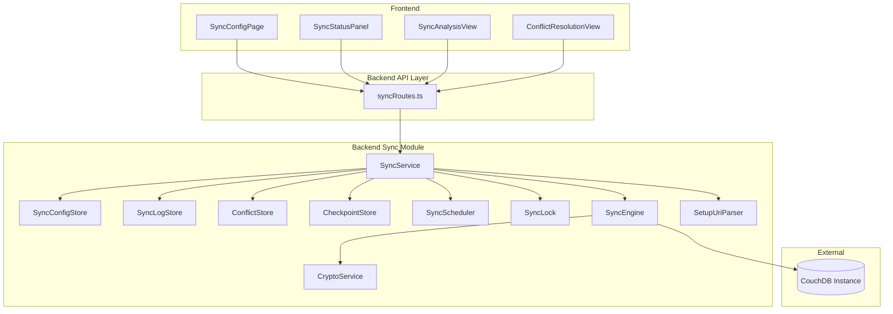

# Design Document: Vault-Sync

## Overview

Dieses Design beschreibt die CouchDB-basierte Vault-Synchronisation für Slatebase. Das System agiert als CouchDB-kompatibler Sync-Client, der Dokumente von einer CouchDB-Instanz (kompatibel mit obsidian-livesync) pullen und pushen kann. Die Synchronisation unterstützt manuelle und intervallbasierte Auslösung, bidirektionale und Read-Only-Modi, einen Analysemodus sowie eine Konflikterkennung mit benutzergesteuerter Auflösung.

### Designentscheidungen

1. **Modularer Aufbau analog zum Chat-Modul**: Das Sync-Modul folgt dem gleichen Pattern wie `backend/src/chat/` — eigene Types, Errors, Validation, Stores und ein orchestrierender Service.
2. **Filesystem-basierte Persistenz**: Sync-Konfiguration, Checkpoint, Konfliktliste und Log werden als JSON/JSONL-Dateien unter `data/sync/<vaultId>/` gespeichert — konsistent mit dem bestehenden Persistenz-Ansatz.
3. **In-Memory Interval-Scheduler**: Automatische Sync-Intervalle werden über `setInterval` verwaltet, analog zum Chat-Polling. Bei Neustart werden aktive Intervalle aus der Konfiguration wiederhergestellt.
4. **HTTP-Client statt PouchDB**: Direkter HTTP-Zugriff auf die CouchDB Changes-Feed-API via `fetch()` (Node.js 22 native). Kein PouchDB — hält die Dependency-Liste schlank und gibt volle Kontrolle über das Protokoll.
5. **Credential-Verschlüsselung mit AES-256-GCM**: Credentials werden mit einem server-seitigen Secret (aus Env-Var `SLATEBASE_SYNC_SECRET`) verschlüsselt auf dem Dateisystem gespeichert.
6. **obsidian-livesync Setup-URI Kompatibilität**: Die Setup-URI ist ein Base64-kodierter, mit einer Passphrase AES-GCM-verschlüsselter JSON-String, der alle Verbindungsparameter enthält. Das Parsing folgt dem obsidian-livesync Format.
7. **Chunk-Reassembly**: obsidian-livesync fragmentiert große Dokumente in Chunks. Der Sync-Service reassembliert diese beim Pull zu vollständigen Dateien.

## Architecture



### Schichtenarchitektur

```
API Layer (syncRoutes.ts)
    ↓
Business Layer (SyncService — orchestriert alle Operationen)
    ↓
Engine Layer (SyncEngine — CouchDB-Kommunikation, Pull/Push-Logik)
    ↓
Store Layer (SyncConfigStore, SyncLogStore, ConflictStore — Filesystem-Persistenz)
    ↓
Utility Layer (CryptoService, SetupUriParser — Verschlüsselung, URI-Parsing)
```

### Integration in bestehende Architektur

- **Composition Root** (`src/index.ts`): SyncService wird mit allen Dependencies verdrahtet
- **Auth Middleware**: Alle Sync-Endpoints nutzen die bestehende `createAuthMiddleware`
- **Vault Registry**: Owner-Prüfung über `IVaultRegistry.findById(vaultId).ownerId`
- **Logger**: Bestehender `ILogger` für strukturiertes Logging

## Components and Interfaces

### ISyncService (Business Logic Orchestrator)

```typescript
export interface ISyncService {
  /** Erstellt eine neue Sync-Konfiguration für einen Vault. */
  createConfig(vaultId: string, ownerId: string, input: CreateSyncConfigInput): Promise<SyncConfigResult>

  /** Gibt die Sync-Konfiguration eines Vaults zurück (Passwort maskiert). */
  getConfig(vaultId: string): Promise<SyncConfigResponse | null>

  /** Aktualisiert eine bestehende Sync-Konfiguration. */
  updateConfig(vaultId: string, input: UpdateSyncConfigInput): Promise<SyncConfigResult>

  /** Deaktiviert die Sync-Konfiguration. */
  disableConfig(vaultId: string): Promise<void>

  /** Reaktiviert eine deaktivierte Sync-Konfiguration. */
  enableConfig(vaultId: string): Promise<void>

  /** Entfernt die Sync-Konfiguration vollständig. */
  removeConfig(vaultId: string): Promise<void>

  /** Startet eine manuelle Synchronisation. */
  triggerSync(vaultId: string): Promise<SyncResult>

  /** Startet den Analysemodus. */
  analyze(vaultId: string): Promise<AnalysisResult>

  /** Gibt das Sync-Log paginiert zurück. */
  getLog(vaultId: string, page: number, pageSize: number): Promise<PaginatedSyncLog>

  /** Gibt die offenen Konflikte zurück. */
  getConflicts(vaultId: string): Promise<ConflictEntry[]>

  /** Löst einen Konflikt auf. */
  resolveConflict(vaultId: string, documentPath: string, resolution: ConflictResolution): Promise<void>

  /** Initialisiert Sync-Intervalle nach Server-Neustart. */
  initializeSchedulers(): Promise<void>
}
```

### ISyncEngine (CouchDB-Kommunikation)

```typescript
export interface ISyncEngine {
  /** Testet die Verbindung zur CouchDB-Instanz. */
  testConnection(config: SyncConnectionParams): Promise<ConnectionTestResult>

  /** Führt einen Pull von der CouchDB durch (Changes Feed). */
  pull(params: PullParams): Promise<PullResult>

  /** Führt einen Push lokaler Änderungen zur CouchDB durch. */
  push(params: PushParams): Promise<PushResult>

  /** Ermittelt die Unterschiede zwischen Vault und CouchDB (Analysemodus). */
  analyze(params: AnalyzeParams): Promise<AnalysisResult>
}
```

### ISyncConfigStore (Konfiguration-Persistenz)

```typescript
export interface ISyncConfigStore {
  /** Speichert eine Sync-Konfiguration. */
  save(vaultId: string, config: SyncConfig): Promise<void>

  /** Lädt eine Sync-Konfiguration. Gibt null zurück wenn nicht vorhanden. */
  load(vaultId: string): Promise<SyncConfig | null>

  /** Entfernt eine Sync-Konfiguration. */
  remove(vaultId: string): Promise<void>

  /** Lädt alle aktiven Konfigurationen (für Scheduler-Init). */
  loadAll(): Promise<Array<{ vaultId: string; config: SyncConfig }>>
}
```

### ISyncLogStore (Sync-Log-Persistenz)

```typescript
export interface ISyncLogStore {
  /** Fügt einen Log-Eintrag hinzu. Rotiert bei > 1000 Einträgen. */
  append(vaultId: string, entry: SyncLogEntry): Promise<void>

  /** Liest Log-Einträge paginiert. */
  read(vaultId: string, page: number, pageSize: number): Promise<PaginatedSyncLog>

  /** Aktualisiert den letzten Log-Eintrag (für Status-Updates). */
  updateLast(vaultId: string, update: Partial<SyncLogEntry>): Promise<void>
}
```

### IConflictStore (Konflikt-Persistenz)

```typescript
export interface IConflictStore {
  /** Speichert einen neuen Konflikt. */
  add(vaultId: string, conflict: ConflictEntry): Promise<void>

  /** Gibt alle offenen Konflikte zurück. */
  getAll(vaultId: string): Promise<ConflictEntry[]>

  /** Entfernt einen aufgelösten Konflikt. */
  remove(vaultId: string, documentPath: string): Promise<void>

  /** Prüft ob ein Konflikt für einen Dokumentpfad existiert. */
  exists(vaultId: string, documentPath: string): Promise<boolean>
}
```

### ICryptoService (Verschlüsselung)

```typescript
export interface ICryptoService {
  /** Verschlüsselt einen String mit dem Server-Secret. */
  encrypt(plaintext: string): string

  /** Entschlüsselt einen String mit dem Server-Secret. */
  decrypt(ciphertext: string): string

  /** Verschlüsselt Dokumentinhalt mit einer Passphrase (E2E, obsidian-livesync-kompatibel). */
  encryptDocument(content: Buffer, passphrase: string): Buffer

  /** Entschlüsselt Dokumentinhalt mit einer Passphrase (E2E, obsidian-livesync-kompatibel). */
  decryptDocument(encrypted: Buffer, passphrase: string): Buffer
}
```

### ISetupUriParser

```typescript
export interface ISetupUriParser {
  /** Parst eine obsidian-livesync Setup-URI und extrahiert die Verbindungsparameter. */
  parse(uri: string, passphrase: string): SetupUriParams
}
```

### ISyncScheduler

```typescript
export interface ISyncScheduler {
  /** Startet einen Intervall-Timer für einen Vault. */
  start(vaultId: string, intervalMinutes: number, callback: () => Promise<void>): void

  /** Stoppt den Intervall-Timer für einen Vault. */
  stop(vaultId: string): void

  /** Setzt den Timer zurück (nach manuellem Sync). */
  reset(vaultId: string): void

  /** Prüft ob ein Timer für einen Vault aktiv ist. */
  isActive(vaultId: string): boolean

  /** Stoppt alle Timer (für Shutdown). */
  stopAll(): void
}
```

### ISyncLock (Concurrency Control)

```typescript
export interface ISyncLock {
  /** Versucht den Lock für einen Vault zu erwerben. Gibt false zurück wenn bereits gelockt. */
  acquire(vaultId: string): boolean

  /** Gibt den Lock für einen Vault frei. */
  release(vaultId: string): void

  /** Prüft ob ein Vault aktuell gelockt ist. */
  isLocked(vaultId: string): boolean
}
```

### ICheckpointStore (Checkpoint-Persistenz)

```typescript
export interface ICheckpointStore {
  /** Speichert einen Checkpoint atomar. */
  save(vaultId: string, checkpoint: SyncCheckpoint): Promise<void>

  /** Lädt den Checkpoint. Gibt null zurück wenn nicht vorhanden oder korrupt. */
  load(vaultId: string): Promise<SyncCheckpoint | null>

  /** Entfernt den Checkpoint (bei Config-Entfernung). */
  remove(vaultId: string): Promise<void>
}
```

## Data Models

### SyncConfig (Persistiert als JSON)

```typescript
export interface SyncConfig {
  /** CouchDB Endpoint-URL (http:// oder https://). */
  endpoint: string
  /** CouchDB Datenbankname. */
  database: string
  /** Verschlüsselter Benutzername. */
  usernameEncrypted: string
  /** Verschlüsseltes Passwort. */
  passwordEncrypted: string
  /** Sync-Modus: bidirektional oder nur lesen. */
  mode: 'bidirectional' | 'readonly'
  /** Sync-Auslösung: manuell oder Intervall. */
  trigger: 'manual' | 'interval'
  /** Intervall in Minuten (nur bei trigger === 'interval'). */
  intervalMinutes?: number
  /** Status der Konfiguration. */
  status: 'active' | 'disabled'
  /** E2E-Verschlüsselung aktiviert. */
  e2eEnabled: boolean
  /** Verschlüsseltes E2E-Passphrase (nur wenn e2eEnabled). */
  e2ePassphraseEncrypted?: string
  /** ISO 8601 Zeitstempel der Erstellung. */
  createdAt: string
  /** ISO 8601 Zeitstempel der letzten Änderung. */
  updatedAt: string
}
```

### SyncCheckpoint (Persistiert als JSON)

```typescript
export interface SyncCheckpoint {
  /** CouchDB Sequence-Nummer (last_seq vom Changes Feed). */
  lastSeq: string
  /** ISO 8601 Zeitstempel des letzten erfolgreichen Syncs. */
  lastSyncAt: string
  /** Map von relativen Dateipfaden zu ihrem letzten bekannten mtime (ms seit Epoch). */
  localMtimes: Record<string, number>
}
```

### SyncLogEntry (Persistiert als JSONL)

```typescript
export interface SyncLogEntry {
  /** Eindeutige ID des Log-Eintrags. */
  id: string
  /** ISO 8601 Zeitstempel. */
  timestamp: string
  /** Auslösungstyp. */
  triggerType: 'manual' | 'interval'
  /** Sync-Modus bei dieser Operation. */
  mode: 'bidirectional' | 'readonly'
  /** Status der Operation. */
  status: 'started' | 'success' | 'partial_success' | 'failed' | 'connection_failed' | 'auth_failed'
  /** Anzahl gepullter Dokumente. */
  pulledCount?: number
  /** Anzahl gepushter Dokumente. */
  pushedCount?: number
  /** Dauer in Millisekunden. */
  durationMs?: number
  /** Fehlerdetails (maximal 100 Einträge). */
  errors?: SyncErrorDetail[]
}

export interface SyncErrorDetail {
  /** Relativer Pfad des betroffenen Dokuments. */
  documentPath: string
  /** Fehlertyp. */
  errorType: 'write_failed' | 'read_failed' | 'decryption_failed' | 'encryption_failed' | 'invalid_path' | 'permission_denied'
  /** Fehlerbeschreibung (max. 500 Zeichen). */
  description: string
}
```

### ConflictEntry (Persistiert als JSON)

```typescript
export interface ConflictEntry {
  /** Relativer Pfad des Dokuments im Vault. */
  documentPath: string
  /** Lokale Revisionsinformation. */
  local: {
    /** Änderungsdatum (ISO 8601). */
    modifiedAt: string
    /** Dateigröße in Bytes. */
    size: number
  }
  /** Remote-Revisionsinformation. */
  remote: {
    /** CouchDB Revisionsnummer. */
    revision: string
    /** Änderungsdatum (ISO 8601). */
    modifiedAt: string
    /** Dateigröße in Bytes. */
    size: number
  }
  /** ISO 8601 Zeitstempel der Konflikterkennung. */
  detectedAt: string
}

export type ConflictResolution = 'use_remote' | 'use_local' | 'skip'
```

### AnalysisResult

```typescript
export interface AnalysisResult {
  /** Zusammenfassung nach Kategorie. */
  summary: {
    remote_newer: CategorySummary
    local_newer: CategorySummary
    remote_only: CategorySummary
    local_only: CategorySummary
    conflict: CategorySummary
    identical: CategorySummary
  }
  /** Detailliste aller Dokumente. */
  details: AnalysisDetail[]
  /** Dauer der Analyse in Millisekunden. */
  durationMs: number
}

export interface CategorySummary {
  count: number
  totalBytes: number
}

export interface AnalysisDetail {
  /** Relativer Pfad. */
  path: string
  /** Kategorie. */
  category: 'remote_newer' | 'local_newer' | 'remote_only' | 'local_only' | 'conflict' | 'identical'
  /** Remote-Revisionsnummer (falls vorhanden). */
  remoteRevision?: string
  /** Lokales Änderungsdatum (ISO 8601, falls vorhanden). */
  localModifiedAt?: string
  /** Remote-Änderungsdatum (ISO 8601, falls vorhanden). */
  remoteModifiedAt?: string
  /** Lokale Dateigröße in Bytes (falls vorhanden). */
  localSize?: number
  /** Remote-Dateigröße in Bytes (falls vorhanden). */
  remoteSize?: number
}
```

### API Input/Output Types

```typescript
export interface CreateSyncConfigInput {
  /** Setup-URI (optional, alternativ zu manueller Konfiguration). */
  setupUri?: string
  /** Passphrase zum Entschlüsseln der Setup-URI. */
  setupUriPassphrase?: string
  /** Manuelle Konfiguration (alternativ zu Setup-URI). */
  endpoint?: string
  database?: string
  username?: string
  password?: string
  /** Optionale Einstellungen. */
  mode?: 'bidirectional' | 'readonly'
  trigger?: 'manual' | 'interval'
  intervalMinutes?: number
  e2eEnabled?: boolean
  e2ePassphrase?: string
}

export interface UpdateSyncConfigInput {
  endpoint?: string
  database?: string
  username?: string
  password?: string
  mode?: 'bidirectional' | 'readonly'
  trigger?: 'manual' | 'interval'
  intervalMinutes?: number
  e2eEnabled?: boolean
  e2ePassphrase?: string
}

export interface SyncConfigResponse {
  endpoint: string
  database: string
  username: string
  /** Maskiertes Passwort (alle Zeichen * außer letzte 4). */
  passwordMasked: string
  mode: 'bidirectional' | 'readonly'
  trigger: 'manual' | 'interval'
  intervalMinutes?: number
  status: 'active' | 'disabled'
  e2eEnabled: boolean
  createdAt: string
  updatedAt: string
}

export interface SyncConfigResult {
  config: SyncConfigResponse
  connectionTest: ConnectionTestResult
}

export interface ConnectionTestResult {
  reachable: boolean
  authenticated: boolean
  error?: string
}

export interface SyncResult {
  status: 'success' | 'partial_success' | 'failed' | 'connection_failed' | 'auth_failed'
  pulledCount: number
  pushedCount: number
  conflictsDetected: number
  durationMs: number
  errors: SyncErrorDetail[]
}

export interface PaginatedSyncLog {
  items: SyncLogEntry[]
  total: number
  page: number
  pageSize: number
  totalPages: number
}
```

### Filesystem-Layout

```
data/sync/
└── <vaultId>/
    ├── config.json          — Verschlüsselte Sync-Konfiguration
    ├── checkpoint.json      — Letzter Sync-Checkpoint (last_seq + lokale mtimes)
    ├── conflicts.json       — Offene Konflikte
    └── sync-log.jsonl       — Sync-Log (Append-Only, max 1000 Einträge)
```

### API-Endpoints

| Method | Path | Purpose |
|--------|------|---------|
| POST | /vaults/:vaultId/sync/config | Sync-Konfiguration erstellen |
| GET | /vaults/:vaultId/sync/config | Sync-Konfiguration abrufen |
| PUT | /vaults/:vaultId/sync/config | Sync-Konfiguration aktualisieren |
| DELETE | /vaults/:vaultId/sync/config | Sync-Konfiguration entfernen |
| PUT | /vaults/:vaultId/sync/config/disable | Sync deaktivieren |
| PUT | /vaults/:vaultId/sync/config/enable | Sync reaktivieren |
| POST | /vaults/:vaultId/sync/trigger | Manuelle Synchronisation auslösen |
| POST | /vaults/:vaultId/sync/analyze | Analysemodus starten |
| GET | /vaults/:vaultId/sync/log | Sync-Log abrufen (paginiert) |
| GET | /vaults/:vaultId/sync/conflicts | Offene Konflikte abrufen |
| POST | /vaults/:vaultId/sync/conflicts/:path/resolve | Konflikt auflösen |

## Correctness Properties

*A property is a characteristic or behavior that should hold true across all valid executions of a system — essentially, a formal statement about what the system should do. Properties serve as the bridge between human-readable specifications and machine-verifiable correctness guarantees.*

### Property 1: Setup-URI Parsing Round-Trip

*For any* valid set of connection parameters (endpoint, database, username, password, encryption settings), encoding them into the obsidian-livesync Setup-URI format and then parsing the URI back SHALL produce the same connection parameters.

**Validates: Requirements 1.1**

### Property 2: Input Validation Correctness

*For any* string input, the Zod validation schemas SHALL accept inputs that conform to the defined rules (endpoint URL with http/https protocol and max 2048 chars, database name starting with lowercase letter containing only valid CouchDB characters and max 256 chars, non-empty username max 256 chars, non-empty password max 1024 chars) and reject all inputs that violate any rule.

**Validates: Requirements 1.2, 1.8, 10.1, 10.3**

### Property 3: Access Control Enforcement

*For any* authenticated user who is not the vault owner (including users with admin role), all sync-related endpoints SHALL reject the request with HTTP 403 and error code `ACCESS_DENIED`.

**Validates: Requirements 1.5, 2.5, 9.3, 9.6, 9.7**

### Property 4: Credential Encryption in Storage

*For any* stored sync configuration containing credentials (username, password, E2E passphrase), reading the raw configuration file from disk SHALL never reveal the plaintext credential values — only their encrypted representations.

**Validates: Requirements 1.9, 8.5**

### Property 5: Password Masking in API Responses

*For any* password string, the masking function SHALL replace all characters with `*` except the last 4 characters when the password length is 4 or more, and SHALL fully mask (all `*`) when the password length is less than 4. The masked string SHALL always have the same length as the original.

**Validates: Requirements 2.1**

### Property 6: Sync Interval Validation

*For any* integer value, the sync interval validation SHALL accept values in the range [5, 1440] and reject all values outside this range (including non-integers, values < 5, and values > 1440).

**Validates: Requirements 3.2, 3.5, 10.5**

### Property 7: Readonly Mode Prevents Push

*For any* sync operation executed in `readonly` mode, regardless of local file changes present, the sync engine SHALL perform zero push operations to the CouchDB instance.

**Validates: Requirements 3.3**

### Property 8: Chunk Reassembly Integrity

*For any* valid file content that has been split into obsidian-livesync chunk format, reassembling the chunks SHALL produce content identical to the original file content (byte-for-byte).

**Validates: Requirements 4.2**

### Property 9: Local Change Detection via mtime

*For any* set of local files with modification timestamps and a checkpoint containing previously recorded timestamps, the change detection function SHALL identify exactly those files whose current mtime differs from the checkpoint mtime as "changed", and files with matching mtimes as "unchanged".

**Validates: Requirements 4.3**

### Property 10: Error Resilience — Partial Failures Continue

*For any* set of documents being synced where a subset fails to write (due to permission errors or invalid paths), the sync engine SHALL still process all remaining documents and the final pulled/pushed count SHALL equal the total minus the failed count.

**Validates: Requirements 4.8**

### Property 11: Log Error Truncation

*For any* sync operation producing error details, each error description SHALL be truncated to at most 500 characters, and the total number of error entries per sync operation SHALL be capped at 100.

**Validates: Requirements 5.3**

### Property 12: Log Pagination Consistency

*For any* sync log with N total entries queried with page P and pageSize S, the response SHALL satisfy: `totalPages = ceil(N / S)`, `items.length <= S`, `items.length = min(S, N - (P-1)*S)` for valid pages, and `total = N`.

**Validates: Requirements 5.4**

### Property 13: Log Rotation Cap

*For any* sync log, after a write operation the total number of entries SHALL never exceed 1000. If entries exceeded 1000 before the write, the oldest entries SHALL be removed to maintain the cap.

**Validates: Requirements 5.7**

### Property 14: No Credentials in Log Entries

*For any* sync log entry, the entry content SHALL never contain any credential values (username, password, tokens, passphrases) or document content — documents are referenced only by their relative path.

**Validates: Requirements 5.6**

### Property 15: Analysis is Read-Only

*For any* analysis operation, the vault filesystem and the CouchDB instance SHALL have zero write operations performed against them — the analysis only reads state from both sides.

**Validates: Requirements 6.1**

### Property 16: Analysis Categorization Correctness

*For any* pair of local file state (exists, mtime, size) and remote document state (exists, revision, mtime, size), the categorization function SHALL assign exactly one correct category: `remote_newer` (remote mtime > local mtime), `local_newer` (local mtime > remote mtime), `remote_only` (no local file), `local_only` (no remote doc), `conflict` (both modified since checkpoint), `identical` (same content/no changes).

**Validates: Requirements 6.2**

### Property 17: Analysis Summary Aggregation

*For any* analysis result, the summary counts and byte totals per category SHALL exactly match the count and sum of sizes of documents in the detail list for that category.

**Validates: Requirements 6.3**

### Property 18: Conflict Detection — No Auto-Overwrite

*For any* document that has been modified both locally (mtime changed since checkpoint) and remotely (new revision since checkpoint), the sync engine SHALL never automatically overwrite either version — the document SHALL be added to the conflict list instead.

**Validates: Requirements 7.1**

### Property 19: Conflict Recommendation Logic

*For any* conflict entry with local and remote modification dates, the recommendation SHALL be the version with the newer modification date. If both dates are identical, the recommendation SHALL be the remote version.

**Validates: Requirements 7.3**

### Property 20: Existing Conflicts Preserved Across Syncs

*For any* set of unresolved conflicts from previous syncs, a new sync operation SHALL preserve all existing conflict entries and SHALL only create new conflict entries for documents that do not already have an unresolved conflict.

**Validates: Requirements 7.9**

### Property 21: E2E Encryption Round-Trip

*For any* valid document content (arbitrary bytes) and any valid passphrase (8-256 characters), encrypting the content with the passphrase and then decrypting the result SHALL produce content identical to the original.

**Validates: Requirements 8.1, 8.2**

### Property 22: E2E Passphrase Validation

*For any* string, the passphrase validation SHALL accept strings with length in [8, 256] and reject strings shorter than 8 or longer than 256 characters.

**Validates: Requirements 8.6**

### Property 23: Auth Check Ordering

*For any* request to a sync endpoint, the error response SHALL follow the priority order: unauthenticated → 401 (before vault existence is checked), vault not found → 404 (before owner check), non-owner → 403. A request failing at a higher-priority check SHALL never reveal information about lower-priority checks.

**Validates: Requirements 9.5**

### Property 24: String Trimming for Required Fields

*For any* string input to a required field, leading and trailing whitespace SHALL be removed before validation, and strings that are empty after trimming SHALL be rejected.

**Validates: Requirements 10.6**

## Concurrency & Data Loss Prevention

### Sync-Lock (In-Memory Mutex per Vault)

```typescript
export interface ISyncLock {
  /** Versucht den Lock für einen Vault zu erwerben. Gibt false zurück wenn bereits gelockt. */
  acquire(vaultId: string): boolean

  /** Gibt den Lock für einen Vault frei. */
  release(vaultId: string): void

  /** Prüft ob ein Vault aktuell gelockt ist. */
  isLocked(vaultId: string): boolean
}
```

- **Implementierung**: `Map<string, boolean>` — einfach, da Node.js single-threaded ist
- **Scope**: Schützt gegen parallele Syncs, Analysen UND Konfliktauflösungen für denselben Vault
- **Verwendung**: `SyncService.triggerSync()`, `SyncService.analyze()`, `SyncService.resolveConflict()` erwerben den Lock vor Beginn und geben ihn im `finally`-Block frei
- **Scheduler**: Der Intervall-Callback prüft `isLocked()` — wenn gelockt, wird der Intervall-Sync übersprungen (nicht gequeued), der nächste reguläre Intervall versucht es erneut

### Race Condition: User editiert während Sync

**Problem**: Ein Pull überschreibt eine Datei, die der User gerade im Editor bearbeitet hat.

**Lösung — Pre-Write mtime Check**:
1. Vor dem Schreiben einer gepullten Datei: aktuelle `mtime` der lokalen Datei lesen
2. Vergleich mit der `mtime` aus dem Checkpoint (`localMtimes[path]`)
3. Wenn `aktuelle mtime > checkpoint mtime` → Datei wurde seit letztem Sync lokal geändert → **Konflikt erzeugen** statt überschreiben
4. Wenn Datei nicht existiert (neue Remote-Datei) → normal schreiben

```typescript
// Pseudocode im SyncEngine.pull()
for (const remoteDoc of changedDocs) {
  const localPath = resolveVaultPath(vaultId, remoteDoc.path)
  const checkpointMtime = checkpoint.localMtimes[remoteDoc.path]
  
  try {
    const stat = await fs.stat(localPath)
    if (stat.mtimeMs > checkpointMtime) {
      // Lokale Änderung seit letztem Sync — Konflikt!
      await conflictStore.add(vaultId, buildConflictEntry(remoteDoc, stat))
      continue
    }
  } catch (err) {
    // Datei existiert nicht lokal — kein Konflikt, normal schreiben
  }
  
  await atomicWrite(localPath, remoteDoc.content)
}
```

### Race Condition: Checkpoint-Update bei partiellem Fehler

**Problem**: Wenn der Checkpoint auf die neue `last_seq` gesetzt wird bevor alle Dokumente verarbeitet sind, gehen bei einem Abbruch Dokumente verloren.

**Lösung — Checkpoint erst nach vollständigem Durchlauf**:
1. Checkpoint wird **nur** aktualisiert wenn der gesamte Pull/Push-Zyklus abgeschlossen ist (Status `success` oder `partial_success`)
2. Bei `partial_success` (einzelne Dokumente fehlgeschlagen): Checkpoint wird trotzdem aktualisiert, da die fehlgeschlagenen Dokumente im Sync-Log protokolliert sind und beim nächsten Sync erneut versucht werden (CouchDB Changes Feed liefert sie erneut wenn der Checkpoint nicht aktualisiert wird — das würde zu Endlos-Schleifen führen)
3. Bei `failed` (Verbindungsabbruch, Auth-Fehler): Checkpoint bleibt unverändert → nächster Sync holt alle Änderungen erneut
4. **Wichtig**: Die `last_seq` aus dem Changes-Feed-Response wird erst am Ende in den Checkpoint geschrieben, nicht inkrementell

```typescript
// SyncService.triggerSync() — vereinfacht
const pullResult = await this.engine.pull(params)

if (pullResult.status === 'failed') {
  // Kein Checkpoint-Update — nächster Sync wiederholt alles
  return pullResult
}

// Checkpoint atomar aktualisieren (nur bei success/partial_success)
const newCheckpoint: SyncCheckpoint = {
  lastSeq: pullResult.newLastSeq,
  lastSyncAt: new Date().toISOString(),
  localMtimes: await this.buildMtimeMap(vaultId)
}
await this.checkpointStore.save(vaultId, newCheckpoint)
```

### Race Condition: Config-Änderung während Sync

**Problem**: User ändert Credentials/Modus während ein Sync läuft.

**Lösung**:
1. `updateConfig()` prüft `syncLock.isLocked(vaultId)` — wenn gelockt, wird der Request mit HTTP 409 `SYNC_IN_PROGRESS` abgelehnt
2. Der laufende Sync verwendet eine **Snapshot-Kopie** der Config die zu Beginn geladen wurde — keine Live-Referenz auf den Store
3. `disableConfig()` setzt nur den Status-Flag — ein laufender Sync läuft zu Ende (wie in Requirement 2.2 spezifiziert)

### Race Condition: Conflict-Store Concurrent Access

**Problem**: Sync schreibt neue Konflikte während User gleichzeitig einen Konflikt auflöst.

**Lösung**:
1. Der Sync-Lock schützt bereits: `resolveConflict()` erfordert den Lock, und während eines Syncs ist der Lock belegt → Konfliktauflösung wird mit `SYNC_IN_PROGRESS` abgelehnt
2. Außerhalb eines Syncs: Nur ein Request gleichzeitig kann `resolveConflict()` aufrufen (Lock wird auch dafür erworben)
3. `ConflictStore` Operationen sind atomar (read → modify → atomic write)

### Race Condition: Scheduler-Callback vs. manueller Sync

**Problem**: Intervall-Timer feuert genau dann wenn ein manueller Sync gerade startet.

**Lösung**:
1. Scheduler-Callback: `if (syncLock.isLocked(vaultId)) return` — stiller Skip
2. Manueller Sync: `if (!syncLock.acquire(vaultId)) throw new SyncInProgressError(vaultId)`
3. Da Node.js single-threaded ist, kann zwischen `isLocked()`-Check und `acquire()` kein anderer Code laufen → kein TOCTOU-Problem

### Datenverlust-Prävention: Zusammenfassung

| Szenario | Schutzmaßnahme |
|----------|----------------|
| Parallele Syncs | In-Memory Lock (single-threaded, kein TOCTOU) |
| User editiert während Pull | Pre-Write mtime-Check → Konflikt statt Überschreiben |
| Sync-Abbruch (Netzwerk) | Checkpoint nur bei Erfolg aktualisiert |
| Einzelnes Dokument fehlerhaft | Fehler loggen, restliche Dokumente fortsetzen |
| Config-Änderung während Sync | Lock verhindert Config-Update bei laufendem Sync |
| Datei-Löschung (remote) | Nur löschen wenn Datei seit Checkpoint unverändert (mtime-Check) |
| Datei-Löschung (lokal, Push) | CouchDB `_deleted: true` — reversibel über CouchDB Compaction-Fenster |
| Crash während Write | Atomic Write (Temp → rename) — nie halb-geschriebene Dateien |
| Corrupt Checkpoint | Fehlender/korrupter Checkpoint → Full Pull (sicher, kein Datenverlust) |

### Property 25: No Data Loss on Concurrent Edit

*For any* file that has been modified locally (mtime changed since checkpoint) while a sync pull is in progress, the sync engine SHALL never overwrite the local file — it SHALL create a conflict entry instead.

**Validates: Datenverlust-Prävention**

### Property 26: Checkpoint Atomicity

*For any* sync operation that fails with status `failed` (connection error, auth error), the checkpoint SHALL remain unchanged from its pre-sync state, ensuring the next sync will re-fetch all changes.

**Validates: Datenverlust-Prävention**

### Property 27: Delete Safety — mtime Guard

*For any* remote deletion received during a pull, the sync engine SHALL only delete the local file if its current mtime matches the checkpoint mtime. If the local file was modified since the checkpoint, the deletion SHALL be converted to a conflict instead.

**Validates: Datenverlust-Prävention**

## Error Handling

### Error Classes

```typescript
/** Thrown when no sync configuration exists for a vault. */
export class SyncNotConfiguredError extends Error {
  constructor(public readonly vaultId: string) {
    super(`Sync not configured for vault: ${vaultId}`)
    this.name = 'SyncNotConfiguredError'
  }
}

/** Thrown when a sync configuration already exists. */
export class SyncAlreadyConfiguredError extends Error {
  constructor(public readonly vaultId: string) {
    super(`Sync already configured for vault: ${vaultId}`)
    this.name = 'SyncAlreadyConfiguredError'
  }
}

/** Thrown when a sync or analysis is already in progress. */
export class SyncInProgressError extends Error {
  constructor(public readonly vaultId: string) {
    super(`Sync already in progress for vault: ${vaultId}`)
    this.name = 'SyncInProgressError'
  }
}

/** Thrown when the connection test to CouchDB fails. */
export class ConnectionTestFailedError extends Error {
  constructor(public readonly reason: string) {
    super(`Connection test failed: ${reason}`)
    this.name = 'ConnectionTestFailedError'
  }
}

/** Thrown when the Setup-URI cannot be parsed. */
export class InvalidSetupUriError extends Error {
  constructor(public readonly reason: string) {
    super(`Invalid setup URI: ${reason}`)
    this.name = 'InvalidSetupUriError'
  }
}

/** Thrown when the sync interval is out of range. */
export class InvalidSyncIntervalError extends Error {
  constructor(public readonly value: number) {
    super(`Invalid sync interval: ${value} (must be 5-1440 minutes)`)
    this.name = 'InvalidSyncIntervalError'
  }
}

/** Thrown when the E2E passphrase is invalid. */
export class InvalidPassphraseError extends Error {
  constructor(public readonly reason: string) {
    super(`Invalid passphrase: ${reason}`)
    this.name = 'InvalidPassphraseError'
  }
}

/** Thrown when conflict resolution fails. */
export class ConflictResolutionError extends Error {
  constructor(public readonly documentPath: string, public readonly reason: string) {
    super(`Conflict resolution failed for ${documentPath}: ${reason}`)
    this.name = 'ConflictResolutionError'
  }
}
```

### Error-to-HTTP Mapping (Controller Layer)

| Error Class | HTTP Status | Error Code |
|-------------|-------------|------------|
| `SyncNotConfiguredError` | 409 | `SYNC_NOT_CONFIGURED` |
| `SyncAlreadyConfiguredError` | 409 | `SYNC_ALREADY_CONFIGURED` |
| `SyncInProgressError` | 409 | `SYNC_IN_PROGRESS` |
| `ConnectionTestFailedError` | 422 | `CONNECTION_TEST_FAILED` |
| `InvalidSetupUriError` | 400 | `INVALID_SETUP_URI` |
| `InvalidSyncIntervalError` | 400 | `INVALID_SYNC_INTERVAL` |
| `InvalidPassphraseError` | 400 | `INVALID_PASSPHRASE` |
| `VaultNotFoundError` | 404 | `VAULT_NOT_FOUND` |
| `VaultAccessDeniedError` | 403 | `ACCESS_DENIED` |
| Zod validation error | 400 | `VALIDATION_ERROR` |
| Unhandled errors | 500 | `INTERNAL_ERROR` |

### Graceful Degradation

- **Corrupt sync-log.jsonl**: Return empty paginated response, log error via Logger
- **Missing checkpoint.json**: Treat as first sync (full pull)
- **CouchDB timeout**: Abort with `connection_failed`, log error, preserve existing state
- **Single document write failure**: Log error, continue with remaining documents
- **Encryption/decryption failure**: Log error for that document, continue sync
- **Remote deletion of locally modified file**: Convert to conflict instead of deleting (mtime guard)

## Testing Strategy

### Property-Based Tests (fast-check)

Property-based testing is highly applicable to this feature due to the many pure functions with clear input/output behavior:

- **URI parsing** (round-trip)
- **Input validation** (schema acceptance/rejection)
- **Password masking** (length preservation, character replacement)
- **Interval validation** (range checking)
- **Chunk reassembly** (round-trip)
- **Change detection** (mtime comparison)
- **Log pagination** (arithmetic consistency)
- **Log rotation** (cap enforcement)
- **Analysis categorization** (classification logic)
- **Conflict recommendation** (date comparison)
- **E2E encryption** (round-trip)
- **String trimming** (whitespace handling)

**Configuration:**
- Library: `fast-check` (already a devDependency)
- Minimum 100 iterations per property test
- Each test tagged with: `Feature: vault-sync, Property {number}: {property_text}`

### Unit Tests (Vitest)

- **SyncService**: Business logic orchestration, state transitions, error paths
- **SyncEngine**: HTTP client mocking, response parsing, timeout handling
- **SyncConfigStore**: Filesystem read/write, atomic operations
- **SyncLogStore**: JSONL append, rotation, pagination
- **ConflictStore**: Add/remove/exists operations
- **CryptoService**: Encrypt/decrypt with known test vectors
- **SetupUriParser**: Known valid/invalid URIs
- **SyncScheduler**: Timer start/stop/reset behavior

### Integration Tests

- Full sync flow with mocked CouchDB responses
- Access control chain (auth → vault → owner)
- Config lifecycle (create → update → disable → enable → remove)
- Conflict detection and resolution flow

### Frontend Tests

- **Vitest + Testing Library**: Component rendering, state management
- **Playwright**: E2E sync configuration workflow

