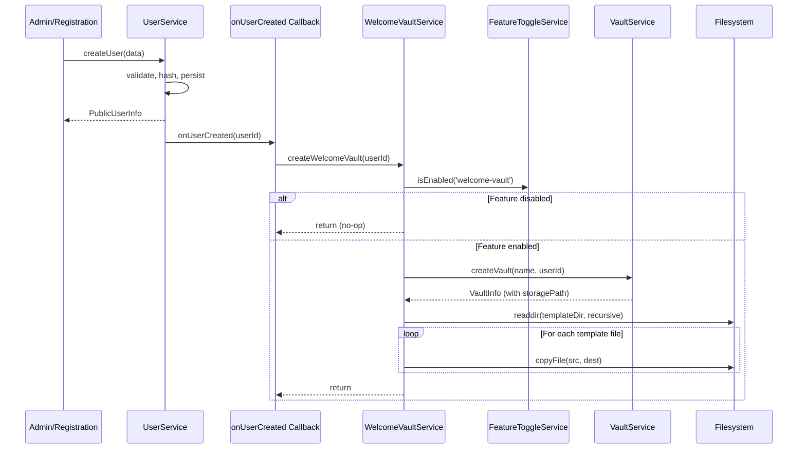

# Design Document: Welcome Vault

## Overview

Das Welcome-Vault-Feature erstellt automatisch einen vorbereiteten Vault mit Tutorial-Inhalten, wenn ein neuer Benutzer-Account angelegt wird. Der Vault dient als interaktive Einführung in Slatebase-Features (Wikilinks, Callouts, Tags, Embeds, Ordnerstruktur).

### Design-Entscheidungen

1. **Callback-basierte Integration**: Statt den UserService direkt zu modifizieren, wird ein optionaler `onUserCreated`-Callback verwendet. Dies hält die Kopplung lose und erlaubt Deaktivierung ohne Code-Änderungen.

2. **Never-Throw-Garantie**: Der WelcomeVaultService fängt ALLE Fehler intern ab und gibt sie nur als Log-Einträge weiter. Die Account-Erstellung darf niemals durch Welcome-Vault-Probleme fehlschlagen.

3. **Filesystem-basiertes Template**: Templates liegen als statische Dateien in `data/templates/welcome-vault/`. Administratoren können sie durch einfaches Ersetzen der Dateien anpassen — kein API-Endpoint nötig.

4. **Feature-Toggle (hot)**: Typ `hot` ermöglicht Aktivierung/Deaktivierung zur Laufzeit ohne Server-Neustart.

5. **Rekursive Kopie mit Isolierung**: Jede einzelne Datei-Kopie ist fehlerisoliert — ein defektes Template-File bricht nicht die gesamte Kopie ab.

## Architecture



### Wichtige Architektur-Aspekte

- Der `onUserCreated`-Callback wird NACH erfolgreichem `userRepository.save()` aufgerufen, BEVOR die Response an den Caller zurückgeht.
- Fehler im Callback werden geloggt aber nicht propagiert (try/catch um den gesamten Callback-Aufruf im UserService).
- Die Template-Kopie erfolgt direkt auf Filesystem-Ebene (nicht über VaultService.saveFile), da keine ETag-Checks, Versionierung oder Event-Emission nötig sind.

## Components and Interfaces

### WelcomeVaultConfig

Erweiterung des bestehenden Config-Schemas um Welcome-Vault-spezifische Konfiguration:

```typescript
/** Zod schema extension for welcome vault config */
const WelcomeVaultConfigSchema = z.object({
  name: z.string().min(1).max(128).default('Willkommen'),
})

/** Parsed welcome vault configuration */
export interface WelcomeVaultConfig {
  /** Vault name for the welcome vault (default: "Willkommen") */
  name: string
}
```

Integration in `ServerConfigSchema`:

```typescript
const ServerConfigSchema = z.object({
  // ... existing fields ...
  welcomeVault: WelcomeVaultConfigSchema.default({}),
})
```

### IWelcomeVaultService Interface

```typescript
/**
 * Service responsible for creating welcome vaults for new users.
 * All methods are designed to never throw — errors are logged internally.
 */
export interface IWelcomeVaultService {
  /**
   * Creates a welcome vault for the given user.
   * - Checks feature toggle first
   * - Creates vault via VaultService
   * - Copies template files from template directory
   * - Logs errors but never throws
   */
  createWelcomeVault(userId: string): Promise<void>
}
```

### WelcomeVaultService Implementation

```typescript
export class WelcomeVaultService implements IWelcomeVaultService {
  private readonly templateDir: string

  constructor(
    private readonly vaultService: IVaultService,
    private readonly featureToggleService: IFeatureToggleService,
    private readonly config: WelcomeVaultConfig,
    private readonly logger: ILogger,
    dataDir: string,
  ) {
    this.templateDir = path.join(path.resolve(dataDir), 'templates', 'welcome-vault')
  }

  async createWelcomeVault(userId: string): Promise<void> {
    try {
      // 1. Check feature toggle
      if (!this.featureToggleService.isEnabled('welcome-vault')) {
        return
      }

      // 2. Create vault
      const vault = await this.vaultService.createVault(this.config.name, userId)

      // 3. Copy template files
      await this.copyTemplateFiles(vault.path)
    } catch (error) {
      // Never throw — log and return
      this.logger.error('Failed to create welcome vault', {
        userId,
        error: error instanceof Error ? error.message : String(error),
      })
    }
  }

  private async copyTemplateFiles(vaultPath: string): Promise<void> {
    // Check if template directory exists
    try {
      await fs.access(this.templateDir)
    } catch {
      this.logger.warn('Welcome vault template directory not found', {
        templateDir: this.templateDir,
      })
      return
    }

    // Read all entries recursively
    const entries = await this.readDirRecursive(this.templateDir)

    if (entries.length === 0) {
      this.logger.warn('Welcome vault template directory is empty', {
        templateDir: this.templateDir,
      })
      return
    }

    // Copy each file individually (error-isolated)
    for (const relativePath of entries) {
      try {
        const srcPath = path.join(this.templateDir, relativePath)
        const destPath = path.join(vaultPath, relativePath)

        // Ensure destination directory exists
        await fs.mkdir(path.dirname(destPath), { recursive: true })

        // Copy file
        await fs.copyFile(srcPath, destPath)
      } catch (error) {
        // Log but continue — partial copy is better than no copy
        this.logger.warn('Failed to copy template file', {
          relativePath,
          error: error instanceof Error ? error.message : String(error),
        })
      }
    }

    this.logger.info('Welcome vault template files copied', {
      fileCount: entries.length,
    })
  }

  private async readDirRecursive(dir: string, prefix = ''): Promise<string[]> {
    const results: string[] = []
    const entries = await fs.readdir(dir, { withFileTypes: true })

    for (const entry of entries) {
      const relativePath = prefix ? `${prefix}/${entry.name}` : entry.name

      if (entry.isDirectory()) {
        const subEntries = await this.readDirRecursive(
          path.join(dir, entry.name),
          relativePath,
        )
        results.push(...subEntries)
      } else if (entry.isFile()) {
        results.push(relativePath)
      }
    }

    return results
  }
}
```

### OnUserCreatedFn Callback Type

```typescript
/**
 * Callback invoked after a new user account is successfully created.
 * Used to trigger side effects like welcome vault creation.
 * Implementations MUST NOT throw — errors should be handled internally.
 */
export type OnUserCreatedFn = (userId: string) => Promise<void>
```

### UserService Integration

Der UserService erhält einen optionalen `onUserCreated`-Callback in seinem Constructor:

```typescript
export class UserService implements IUserService {
  constructor(
    private readonly userRepository: IUserRepository,
    private readonly sessionStore: ISessionStore,
    private readonly logger: ILogger,
    private readonly checkVaultOwnership?: CheckVaultOwnershipFn,
    private readonly auditService?: IAuditService,
    private readonly onUserInvalidated?: OnUserInvalidatedFn,
    private readonly onUserCreated?: OnUserCreatedFn,  // NEU
  ) {}

  async createUser(data: CreateUserData): Promise<PublicUserInfo> {
    // ... existing validation, hashing, save logic ...

    await this.userRepository.save(user)

    // Trigger post-creation callback (never throws)
    if (this.onUserCreated) {
      try {
        await this.onUserCreated(user.userId)
      } catch (error) {
        this.logger.error('onUserCreated callback failed', {
          userId: user.userId,
          error: error instanceof Error ? error.message : String(error),
        })
      }
    }

    this.logger.info('User created', { userId: user.userId, username: user.username })
    // ... audit logging ...

    return this.toPublicInfo(user)
  }
}
```

### Feature Toggle Registration

In der Composition Root (`src/index.ts`):

```typescript
featureRegistry.register({
  name: 'welcome-vault',
  description: 'Automatischer Welcome-Vault für neue Benutzer',
  defaultEnabled: true,
  type: 'hot',
})
```

### Config Schema Extension

In `config/index.ts`:

```typescript
const WelcomeVaultConfigSchema = z.object({
  name: z.string().min(1).max(128).default('Willkommen'),
})

const ServerConfigSchema = z.object({
  // ... existing fields ...
  welcomeVault: WelcomeVaultConfigSchema.default({}),
})
```

IConfigService-Erweiterung:

```typescript
export interface IConfigService {
  // ... existing methods ...
  /** Returns the welcome vault configuration */
  getWelcomeVaultConfig(): WelcomeVaultConfig
}
```

### Composition Root Wiring

```typescript
// Welcome Vault Service
const welcomeVaultConfig = config.getWelcomeVaultConfig()
const welcomeVaultService = new WelcomeVaultService(
  vaultService,
  featureToggleService,
  welcomeVaultConfig,
  logger,
  serverConfig.dataDir,
)

// Wire onUserCreated callback
const onUserCreated = async (userId: string): Promise<void> => {
  await welcomeVaultService.createWelcomeVault(userId)
}

// Update UserService instantiation to include onUserCreated
const userService = new UserService(
  userRepository, sessionStore, logger,
  checkVaultOwnership, auditService, onUserInvalidated,
  onUserCreated,
)
```

## Data Models

### Template Directory Structure

```
data/templates/welcome-vault/
├── Start hier.md                    # Einstiegspunkt mit Wikilinks
├── Grundlagen/
│   ├── Markdown Syntax.md           # Grundlegende Markdown-Formatierung
│   ├── Wikilinks.md                 # [[Wikilink]]-Syntax-Erklärung
│   └── Tags und Metadaten.md        # #tags und YAML Frontmatter
├── Projekte/
│   ├── Beispielprojekt.md           # Projekt-Notiz mit Callouts
│   └── Aufgabenliste.md             # TODO-Beispiel
├── Referenz/
│   ├── Callouts.md                  # Tip, Warning, Info Callout-Beispiele
│   ├── Embeds.md                    # Bild- und Notiz-Embeds
│   └── Ordnerstruktur.md            # Best Practices für Organisation
└── Anhang/
    ├── Bilder/
    │   └── beispiel.png             # Beispielbild für Embed-Demo
    └── Tastenkürzel.md              # Keyboard Shortcuts Referenz
```

### Config Extension

In `config/default.json`:

```json
{
  "welcomeVault": {
    "name": "Willkommen"
  }
}
```

Env-Variable (optional): `SLATEBASE_WELCOME_VAULT_NAME`

## Correctness Properties

*A property is a characteristic or behavior that should hold true across all valid executions of a system — essentially, a formal statement about what the system should do. Properties serve as the bridge between human-readable specifications and machine-verifiable correctness guarantees.*

### Property 1: Template copy preserves directory structure

*For any* template directory containing arbitrary files and subdirectories, after `copyTemplateFiles` executes successfully, every file that existed in the template directory at relative path P shall exist in the vault directory at the same relative path P with byte-identical content.

**Validates: Requirements 1.2, 3.3**

### Property 2: Welcome vault creation never causes user creation failure

*For any* error thrown during welcome vault creation (vault service error, filesystem error, feature toggle error), the `createUser` method shall still return a valid `PublicUserInfo` and the user record shall be persisted.

**Validates: Requirements 1.4**

### Property 3: Feature toggle disables vault creation

*For any* user creation when the `welcome-vault` feature toggle is disabled, no vault shall be created for that user and no filesystem copy operations shall occur.

**Validates: Requirements 1.6, 3.2**

### Property 4: Configured vault name is used

*For any* valid vault name string in the welcome vault configuration, the created welcome vault shall have exactly that name.

**Validates: Requirements 3.4**

## Error Handling

### Never-Throw-Strategie

Der WelcomeVaultService implementiert eine strikte Never-Throw-Garantie:

| Fehlerquelle | Verhalten | Log-Level |
|---|---|---|
| Feature-Toggle-Check wirft | Catch, log, return | `error` |
| VaultService.createVault wirft | Catch, log, return | `error` |
| Template-Verzeichnis nicht vorhanden | Log, return (leerer Vault bleibt) | `warn` |
| Template-Verzeichnis leer | Log, return (leerer Vault bleibt) | `warn` |
| Einzelne Datei-Kopie fehlschlägt | Log, continue mit nächster Datei | `warn` |
| readdir auf Template fehlschlägt | Catch, log, return | `error` |

### Fehlerisolierung bei Datei-Kopie

Jede einzelne Datei wird in einem eigenen try/catch kopiert. Ein fehlerhaftes File (z.B. Permission denied, korruptes Symlink) verhindert nicht die Kopie der restlichen Dateien.

### UserService try/catch

Der `onUserCreated`-Callback im UserService ist in einen eigenen try/catch eingebettet. Selbst wenn der WelcomeVaultService wider Erwarten doch einen unbehandelten Fehler wirft, wird die Account-Erstellung nicht beeinträchtigt.

## Testing Strategy

### Unit Tests (WelcomeVaultService)

Datei: `src/welcome-vault/index.test.ts`

**Mock-Factories:**
- `createMockVaultService()` — gibt `IVaultService` mit kontrollierbarem `createVault` zurück
- `createMockFeatureToggleService()` — erlaubt Steuerung von `isEnabled()`
- `createMockLogger()` — fängt Log-Aufrufe für Assertions ab

**Testfälle:**

1. Happy Path: Toggle enabled → Vault wird erstellt, Template-Dateien werden kopiert
2. Toggle disabled: `createWelcomeVault` returnt sofort ohne Vault-Erstellung
3. Template-Verzeichnis fehlt: Vault wird erstellt (leer), Warning geloggt
4. Template-Verzeichnis leer: Vault wird erstellt (leer), Warning geloggt
5. VaultService.createVault wirft: Error geloggt, kein Throw
6. Einzelne Datei-Kopie fehlschlägt: Restliche Dateien werden trotzdem kopiert
7. Konfigurierter Name wird an createVault übergeben
8. Verschachtelte Ordnerstruktur wird korrekt kopiert

### Unit Tests (UserService onUserCreated)

Datei: `src/user/index.test.ts` (Erweiterung bestehender Tests)

1. onUserCreated-Callback wird nach erfolgreicher User-Erstellung aufgerufen
2. onUserCreated-Callback Fehler bricht User-Erstellung nicht ab
3. Ohne onUserCreated-Callback funktioniert createUser wie bisher

### Integration Test (Template Content)

Datei: `src/welcome-vault/template-content.test.ts`

1. Template-Verzeichnis existiert und enthält 5–15 .md-Dateien
2. `Start hier.md` existiert und enthält Wikilinks
3. Mindestens ein Bild existiert (`.png`, `.jpg`)
4. Mindestens 2 Unterordner existieren

### Property-Based Testing

Die Korrektheitseigenschaften werden mit Vitest und `fast-check` als Property-Based Tests umgesetzt:

- Minimum 100 Iterationen pro Property
- Tag-Format: `Feature: welcome-vault, Property N: <title>`
- Generatoren erzeugen zufällige Verzeichnisstrukturen (Dateien mit zufälligem Inhalt, verschachtelte Ordner)
- Fehlergeneratoren erzeugen verschiedene Error-Typen für die Graceful-Degradation-Properties
