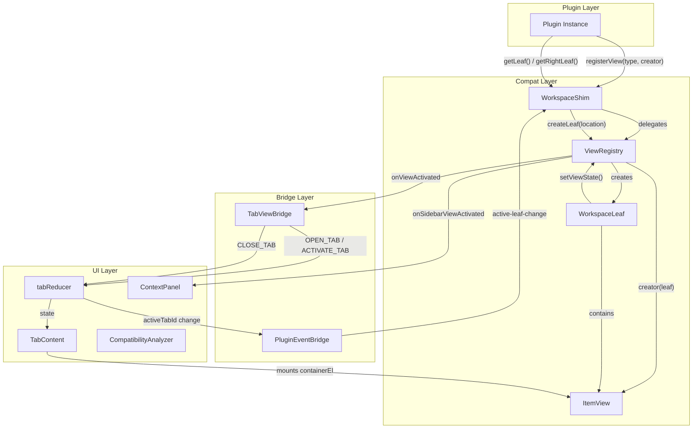

# Design Document: Workspace Leaf API-Kompatibilität

## Overview

Dieses Design beschreibt die vollständige Emulation der Obsidian Workspace Leaf API in Slatebase. Das Ziel ist es, Plugin-Views (Calendar, Kanban, Excalidraw, etc.) nahtlos in Slatebase's bestehendes Tab-System und Context Panel zu integrieren.

Die Kernidee: Ein `WorkspaceLeaf` in Obsidian ist ein "Slot" für eine View — in Slatebase wird dieser Slot entweder als Tab im Hauptbereich oder als Section im Context Panel realisiert. Die Location (`'main' | 'right-sidebar'`) wird bei Leaf-Erstellung durch die aufrufende Methode bestimmt (`getLeaf()` → main, `getRightLeaf()`/`getLeftLeaf()` → sidebar).

### Design-Entscheidungen

1. **Kein separates Left Panel**: Slatebase rendert beide Sidebar-Locations im existierenden Context Panel (vereinfacht UI, kein neues Layout nötig).
2. **Virtual Path Convention**: Plugin-View-Tabs nutzen `__view::{viewType}` als virtuellen Pfad im Tab-System — konsistent mit dem bestehenden `__graph__` Pattern.
3. **DOM-basiertes Rendering**: Plugin-Views manipulieren DOM direkt via `containerEl` — React rendert nur den Container, die View-Logik ist imperativ (Obsidian-Muster).
4. **Module-Level Bridge für Tab-Integration**: Tab-Dispatch wird über eine Bridge-Funktion bereitgestellt (wie `realtimeVaultBridge`), damit ViewRegistry/WorkspaceLeaf Tabs öffnen/schließen können ohne React-Context-Dependency.
5. **Plugin-Ownership Tracking**: ViewRegistry speichert `pluginId` pro Registration für Cleanup bei Deaktivierung.

## Architecture



### Datenfluss: Plugin-View als Tab öffnen

1. Plugin ruft `workspace.getLeaf(true)` → WorkspaceShim delegiert an ViewRegistry
2. ViewRegistry erstellt `WorkspaceLeaf` mit `location: 'main'`
3. Plugin ruft `leaf.setViewState({ type: 'calendar' })` → Leaf holt Creator aus Registry
4. Creator wird aufgerufen → erzeugt ItemView-Instanz → `onOpen()` wird aufgerufen
5. ViewRegistry benachrichtigt `TabViewBridge` → dispatcht `OPEN_TAB` mit virtualem Pfad
6. `TabContent` erkennt `__view::` Prefix → mounted `view.containerEl` in Content-Area
7. WorkspaceShim emittiert `layout-change` und `active-leaf-change`

### Datenfluss: Plugin-View in Context Panel

1. Plugin ruft `workspace.getRightLeaf()` → WorkspaceShim erstellt Leaf mit `location: 'right-sidebar'`
2. Plugin ruft `leaf.setViewState({ type: 'calendar-sidebar' })`
3. ViewRegistry benachrichtigt `onSidebarViewActivated` Callback
4. ContextPanel fügt dynamische Section hinzu mit `containerEl` als Inhalt

## Components and Interfaces

### Updated `IWorkspaceShim` Interface

```typescript
export interface IWorkspaceShim {
  // Existing
  getActiveFile(): TFile | null
  on(event: string, callback: (...args: unknown[]) => void): EventRef
  off(event: string, callback: (...args: unknown[]) => void): void
  trigger(event: string, ...args: unknown[]): void

  // New Leaf Management
  getLeaf(newLeaf?: boolean | string): WorkspaceLeaf
  getRightLeaf(split?: boolean): WorkspaceLeaf
  getLeftLeaf(split?: boolean): WorkspaceLeaf
  getActiveLeaf(): WorkspaceLeaf | null
  setActiveLeaf(leaf: WorkspaceLeaf): void
  getUnpinnedLeaf(): WorkspaceLeaf
  revealLeaf(leaf: WorkspaceLeaf): void
  createLeafBySplit(leaf: WorkspaceLeaf): WorkspaceLeaf
  splitActiveLeaf(): WorkspaceLeaf

  // New View Management
  registerView(viewType: string, creator: (leaf: WorkspaceLeaf) => unknown): void
  getLeavesOfType(viewType: string): WorkspaceLeaf[]
  detachLeavesOfType(viewType: string): void
  getActiveViewOfType<T>(viewClass: new (...args: unknown[]) => T): T | null
  iterateAllLeaves(callback: (leaf: WorkspaceLeaf) => void): void
  iterateRootLeaves(callback: (leaf: WorkspaceLeaf) => void): void

  // New Link Navigation
  openLinkText(linkText: string, sourcePath: string): Promise<void>
}
```

### Refactored `WorkspaceLeaf`

```typescript
export type LeafLocation = 'main' | 'right-sidebar'

export class WorkspaceLeaf {
  view: ItemView | null = null
  app: unknown
  readonly location: LeafLocation

  private readonly registry: ViewRegistry
  private readonly pluginId: string | null

  constructor(app: unknown, registry: ViewRegistry, location: LeafLocation, pluginId?: string)

  async setViewState(state: { type: string; active?: boolean }): Promise<void>
  getViewState(): { type: string }
  async detach(): Promise<void>
}
```

### Refactored `ViewRegistry`

```typescript
export interface ViewRegistration {
  viewType: string
  creator: (leaf: WorkspaceLeaf) => unknown
  pluginId: string
}

export type SidebarViewActivatedCallback = (
  viewType: string,
  view: ItemView,
  leaf: WorkspaceLeaf
) => void

export type SidebarViewDeactivatedCallback = (viewType: string) => void

export class ViewRegistry {
  // Registration with plugin ownership
  registerView(viewType: string, creator: (leaf: WorkspaceLeaf) => unknown, pluginId: string): void
  unregisterView(viewType: string): void
  unregisterAllForPlugin(pluginId: string): void

  // Leaf creation with location
  createLeaf(app: unknown, location: LeafLocation, pluginId?: string): WorkspaceLeaf

  // Query
  hasViewType(viewType: string): boolean
  getViewCreator(viewType: string): ((leaf: WorkspaceLeaf) => unknown) | undefined
  getRegisteredViewTypes(): string[]
  getLeavesOfType(viewType: string): WorkspaceLeaf[]
  getLeafByViewType(viewType: string): WorkspaceLeaf | undefined
  getAllLeaves(): WorkspaceLeaf[]
  getMainLeaves(): WorkspaceLeaf[]
  getSidebarLeaves(): WorkspaceLeaf[]

  // Lifecycle
  removeLeaf(leaf: WorkspaceLeaf): void
  detachLeavesOfType(viewType: string): Promise<void>
  detachAllForPlugin(pluginId: string): Promise<void>
  clear(): Promise<void>

  // Callbacks
  setOnViewActivated(callback: ViewActivatedCallback | null): void
  setOnViewDeactivated(callback: ViewDeactivatedCallback | null): void
  setOnSidebarViewActivated(callback: SidebarViewActivatedCallback | null): void
  setOnSidebarViewDeactivated(callback: SidebarViewDeactivatedCallback | null): void
}
```

### Refactored `ItemView`

```typescript
export class ItemView {
  containerEl: HTMLElement    // CSS class: 'view-content' (changed from 'plugin-view-container')
  contentEl: HTMLElement      // CSS class: 'plugin-view-content' (child of containerEl)
  app: unknown
  leaf: WorkspaceLeaf

  constructor(leaf: WorkspaceLeaf)

  getViewType(): string
  getDisplayText(): string
  getIcon(): string
  async onOpen(): Promise<void>
  async onClose(): Promise<void>
  onload(): void
  onunload(): void

  // New
  addAction(icon: string, title: string, callback: () => void): HTMLElement
}
```

### `TabViewBridge` (Module-Level Bridge)

```typescript
/**
 * Module-level bridge connecting ViewRegistry events to TabProvider dispatching.
 * Follows the same pattern as realtimeVaultBridge / realtimeChatBridge.
 */

export type OpenPluginViewTabFn = (
  vaultId: string,
  viewType: string,
  displayText: string,
  icon: string
) => void

export type ClosePluginViewTabFn = (vaultId: string, viewType: string) => void
export type ActivatePluginViewTabFn = (vaultId: string, viewType: string) => void

// Registration functions for the PluginProvider/TabProvider to wire
export function onOpenPluginViewTab(fn: OpenPluginViewTabFn): void
export function offOpenPluginViewTab(fn: OpenPluginViewTabFn): void
export function onClosePluginViewTab(fn: ClosePluginViewTabFn): void
export function offClosePluginViewTab(fn: ClosePluginViewTabFn): void
export function onActivatePluginViewTab(fn: ActivatePluginViewTabFn): void
export function offActivatePluginViewTab(fn: ActivatePluginViewTabFn): void

// Dispatch functions called by ViewRegistry
export function dispatchOpenPluginViewTab(vaultId: string, viewType: string, displayText: string, icon: string): void
export function dispatchClosePluginViewTab(vaultId: string, viewType: string): void
export function dispatchActivatePluginViewTab(vaultId: string, viewType: string): void
```

### Updated `TabContent` Integration

`TabContent` erkennt Plugin-View-Tabs am `__view::` Prefix im `filePath`:

```typescript
// In TabContent.tsx — new branch after canvas check:
if (activeTab.filePath.startsWith('__view::')) {
  const viewType = activeTab.filePath.slice('__view::'.length)
  // Get containerEl from activeViews Map (PluginContext)
  const viewInfo = activeViews.get(viewType)
  if (viewInfo) {
    return (
      <div className="tab-content tab-content--plugin-view" ref={(el) => {
        if (el && !el.contains(viewInfo.containerEl)) {
          el.appendChild(viewInfo.containerEl)
        }
      }} />
    )
  }
}
```

### Updated `ContextPanel` Integration

Context Panel erhält dynamische Plugin-Sections über den `PluginContext.sidebarViews` State:

```typescript
export interface SidebarViewInfo {
  viewType: string
  displayText: string
  icon: string
  containerEl: HTMLElement
  leaf: WorkspaceLeaf
}
```

Plugin-Sidebar-Views werden als zusätzliche Tabs im Context Panel gerendert, mit eigenem Tab-Identifier (z.B. `plugin:calendar`). Das bestehende `ContextPanelViewId` Type wird um einen dynamischen String erweitert oder die Plugin-Sections werden separat gemanagt.

### Updated `PluginEventBridge`

Der Bridge muss erweitert werden um:
1. **Plugin-View-Tab-Aktivierung** → `active-leaf-change` mit dem zugehörigen `WorkspaceLeaf`
2. **File-Tab vs. Plugin-Tab Unterscheidung** → `getActiveFile()` gibt null bei Plugin-Tabs
3. **`layout-change` Event** bei Plugin-View open/close

```typescript
// Additional tracking in usePluginEventBridge:
// - Watch for activeTabId changes to __view:: tabs
// - Emit active-leaf-change with WorkspaceLeaf (not TFile)
// - Emit layout-change when plugin view tabs open/close
```

### Compatibility Analyzer Update

```typescript
// Move from UNSUPPORTED_METHODS to SUPPORTED_METHODS:
const METHODS_TO_PROMOTE = [
  'workspace.getLeaf',
  'workspace.getLeavesOfType',
  'workspace.getActiveViewOfType',
  'workspace.revealLeaf',
  'workspace.detachLeavesOfType',
  'workspace.getActiveLeaf',
  'workspace.setActiveLeaf',
  'workspace.createLeafBySplit',
  'workspace.getRightLeaf',
  'workspace.getLeftLeaf',
  'workspace.splitActiveLeaf',
  'workspace.openLinkText',
  'workspace.getUnpinnedLeaf',
  'workspace.iterateAllLeaves',
  'workspace.iterateRootLeaves',
]
```

## Data Models

### Leaf Tracking State

```typescript
/** Internal leaf tracking within ViewRegistry */
interface LeafEntry {
  leaf: WorkspaceLeaf
  location: LeafLocation
  pluginId: string | null
  viewType: string | null  // null if no view set yet
}
```

### Plugin View Tab (Tab System)

Plugin-View-Tabs nutzen die existierende `TabEntry` Struktur mit konventionsbasierten Feldern:

```typescript
// Virtual path format: __view::{viewType}
// Tab ID: {vaultId}::__view::{viewType}
// fileName: from view.getDisplayText()
// isBinary: false
// content: '' (no file content)
// mode: 'view' (not editable)
// loading: false (instantly ready)
```

### Sidebar View State (PluginContext)

```typescript
/** Exposed via PluginContextValue */
interface PluginContextValue {
  // ... existing fields ...
  activeViews: Map<string, { viewType: string; displayText: string; containerEl: HTMLElement }>
  sidebarViews: Map<string, SidebarViewInfo>
}
```

### Active Leaf Tracking

```typescript
/** Tracks which leaf is active (for getActiveLeaf/active-leaf-change) */
interface ActiveLeafState {
  /** Active leaf in main area (tab-based) */
  mainLeaf: WorkspaceLeaf | null
  /** Active leaf overall (could be sidebar) */
  activeLeaf: WorkspaceLeaf | null
}
```

## Correctness Properties

*A property is a characteristic or behavior that should hold true across all valid executions of a system — essentially, a formal statement about what the system should do. Properties serve as the bridge between human-readable specifications and machine-verifiable correctness guarantees.*

### Property 1: Registration persistence and ownership

*For any* valid viewType string (1-128 chars, non-empty) and valid creator function, after calling `registerView(viewType, creator, pluginId)`, the registry SHALL report `hasViewType(viewType) === true` and the registration SHALL be associated with the given pluginId.

**Validates: Requirements 1.1, 1.4**

### Property 2: Invalid registration rejection

*For any* empty/whitespace-only viewType string OR non-callable creator value, calling `registerView` SHALL leave the registry unchanged (hasViewType remains false for that viewType).

**Validates: Requirements 1.5**

### Property 3: Plugin deactivation cleanup

*For any* plugin with N registered viewTypes, after calling `unregisterAllForPlugin(pluginId)`, `hasViewType` SHALL return false for all N viewTypes previously registered by that plugin.

**Validates: Requirements 1.3**

### Property 4: View activation lifecycle

*For any* registered viewType, calling `leaf.setViewState({ type: viewType })` SHALL result in `leaf.view` being non-null and `leaf.view.getViewType() === viewType`, with `onOpen()` having been called before the promise resolves.

**Validates: Requirements 2.3, 2.5**

### Property 5: View replacement lifecycle ordering

*For any* leaf with an existing view of type A, calling `setViewState({ type: B })` SHALL call `onClose()` on view A before creating view B.

**Validates: Requirements 2.6**

### Property 6: Unregistered viewType no-op

*For any* viewType string not in the registry, calling `setViewState({ type: viewType })` SHALL resolve without creating a view (leaf.view remains unchanged).

**Validates: Requirements 2.4**

### Property 7: Tab deduplication for plugin views

*For any* viewType that already has an open tab (`__view::{viewType}`), requesting to open the same viewType again SHALL activate the existing tab without creating a new one (tab count unchanged).

**Validates: Requirements 3.6**

### Property 8: Plugin view tab getActiveFile returns null

*For any* active tab with filePath matching `__view::*`, `workspace.getActiveFile()` SHALL return null.

**Validates: Requirements 3.7, 12.4**

### Property 9: getLeavesOfType correctness

*For any* set of active leaves with various viewTypes, `getLeavesOfType(X)` SHALL return exactly those leaves whose `view.getViewType() === X`, and an empty array when none match.

**Validates: Requirements 5.1, 5.2**

### Property 10: iterateAllLeaves visits all, iterateRootLeaves visits main only

*For any* set of active leaves with mixed locations, `iterateAllLeaves` SHALL invoke the callback for every leaf (main + sidebar), while `iterateRootLeaves` SHALL invoke it only for leaves with `location === 'main'`.

**Validates: Requirements 5.6, 5.7**

### Property 11: Exception isolation in iteration

*For any* iteration (iterateAllLeaves/iterateRootLeaves) where callbacks throw exceptions for some leaves, all remaining leaves SHALL still be visited.

**Validates: Requirements 5.8**

### Property 12: detachLeavesOfType removes all and calls onClose

*For any* viewType with N active leaves, after `detachLeavesOfType(viewType)`, `getLeavesOfType(viewType)` SHALL return an empty array, and `onClose()` SHALL have been called on each of the N views.

**Validates: Requirements 6.3, 6.4**

### Property 13: Compatibility analyzer set disjointness

*For any* method string, it SHALL NOT appear in both SUPPORTED_METHODS and UNSUPPORTED_METHODS simultaneously. All promoted leaf methods SHALL be in SUPPORTED_METHODS only.

**Validates: Requirements 10.1, 10.3**

### Property 14: Layout-change event on plugin view tab lifecycle

*For any* plugin-view-tab open or close event, the workspace SHALL emit `layout-change` exactly once.

**Validates: Requirements 11.2, 11.3**

### Property 15: active-leaf-change consistency

*For any* tab activation (file-tab or plugin-view-tab), the workspace SHALL emit `active-leaf-change` with the corresponding WorkspaceLeaf (or null when no tab is active).

**Validates: Requirements 11.1, 11.4**

### Property 16: Plugin deactivation full cleanup

*For any* plugin with active views (main + sidebar), deactivation SHALL detach all leaves, call `onClose()` on each view, and remove the associated tabs/sections — continuing cleanup even if individual `onClose()` calls throw.

**Validates: Requirements 13.1**

### Property 17: openLinkText resolves and opens

*For any* non-empty linkText that resolves via `resolveWikilinkTarget()` to an existing file path, `openLinkText(linkText, sourcePath)` SHALL open a tab for that resolved path.

**Validates: Requirements 8.1, 8.2**

### Property 18: ItemView DOM structure invariant

*For any* newly constructed ItemView, `containerEl` SHALL have CSS class `view-content`, `contentEl` SHALL be a child of `containerEl`, and `leaf` SHALL reference the constructing WorkspaceLeaf.

**Validates: Requirements 9.1, 9.4**

## Error Handling

### View Lifecycle Errors

| Scenario | Handling |
|----------|----------|
| `view.onOpen()` throws | Log via `console.error`, keep view in leaf (graceful degradation) |
| `view.onClose()` throws | Log via `console.error`, proceed with leaf removal and DOM cleanup |
| `view.getDisplayText()` throws | Fall back to `viewType` string as label |
| `view.getIcon()` throws | Fall back to empty string (no icon) |

### Registration Errors

| Scenario | Handling |
|----------|----------|
| Empty viewType | Ignore + `console.warn`, no state change |
| Non-callable creator | Ignore + `console.warn`, no state change |
| viewType > 128 chars | Ignore + `console.warn`, no state change |

### Navigation Errors

| Scenario | Handling |
|----------|----------|
| `openLinkText` with empty string | No-op, no warning |
| `openLinkText` unresolved link | `console.warn` + no action |
| `setActiveLeaf` with unknown leaf | `console.warn` + no state change |
| `revealLeaf` with unknown leaf | No-op (silently ignored) |

### Cleanup Resilience

- Plugin deactivation: per-leaf try/catch — a single failing `onClose()` SHALL NOT block cleanup of remaining views
- Vault switch: `ViewRegistry.clear()` wraps each leaf detach in try/catch
- DOM cleanup: always remove `containerEl` from DOM even if `onClose()` throws

## Testing Strategy

### Unit Tests (Vitest)

Focus on the core logic modules in isolation:

1. **ViewRegistry** — registration, ownership tracking, query methods, cleanup
2. **WorkspaceLeaf** — setViewState lifecycle, location tracking, detach
3. **WorkspaceShim** — getLeaf/getRightLeaf routing, event emission, iteration methods, openLinkText
4. **CompatibilityAnalyzer** — method classification after set updates
5. **TabViewBridge** — callback registration/dispatch

### Property-Based Tests (fast-check)

Property tests validate universal invariants across randomly generated inputs. Each test runs minimum 100 iterations.

**Library**: `fast-check` (already available as test utility in the frontend)

**Tag format**: `Feature: workspace-leaf-compat, Property {N}: {title}`

Tests to implement:
- Property 1: Random valid viewType strings → registration persists
- Property 2: Random invalid inputs → registration rejected
- Property 3: Random plugin with N registrations → all removed on cleanup
- Property 4: Random registered viewTypes → activation succeeds
- Property 6: Random unregistered strings → no-op
- Property 7: Tab deduplication
- Property 9: getLeavesOfType correctness with random leaf sets
- Property 10: Iteration correctness with mixed locations
- Property 11: Exception isolation with random throwing callbacks
- Property 12: detachLeavesOfType removes all
- Property 13: Set disjointness check

### Integration Tests

- **TabContent + Plugin View**: Mount plugin view tab, verify DOM structure
- **ContextPanel + Sidebar View**: Mount sidebar view, verify section added
- **PluginEventBridge + WorkspaceShim**: Tab switch → event emission
- **Full lifecycle**: registerView → getLeaf → setViewState → tab opens → close tab → cleanup

### What is NOT property-tested

- React component rendering (use snapshot/example tests)
- DOM manipulation side effects (use integration tests)
- Context panel section layout (UI test)
- Event bridge timing (integration test)
