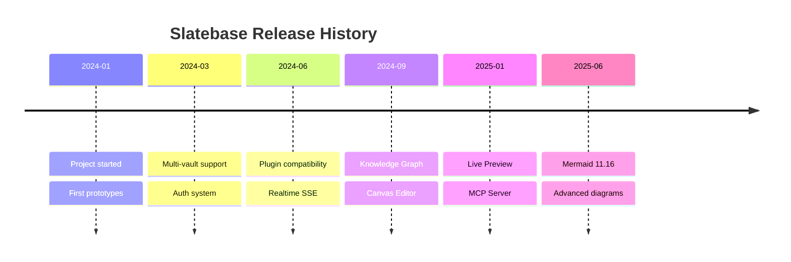
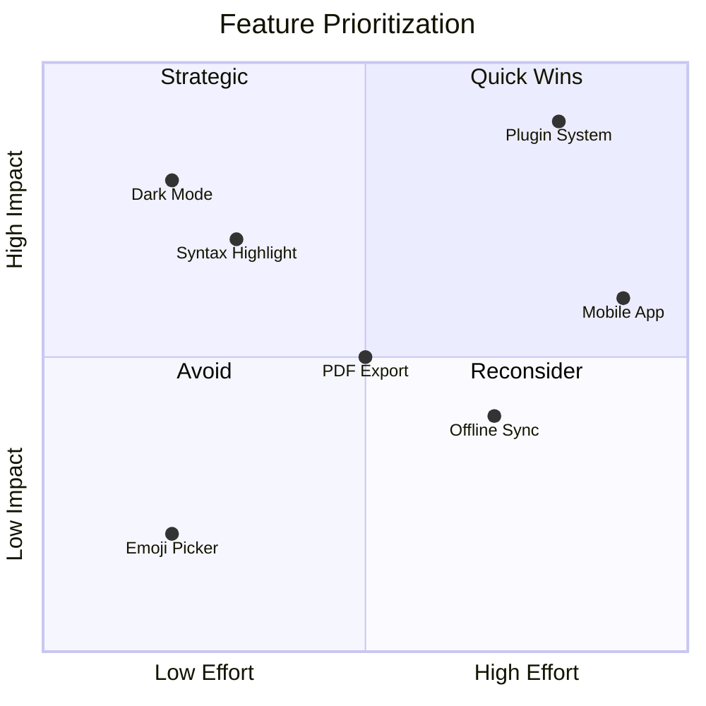
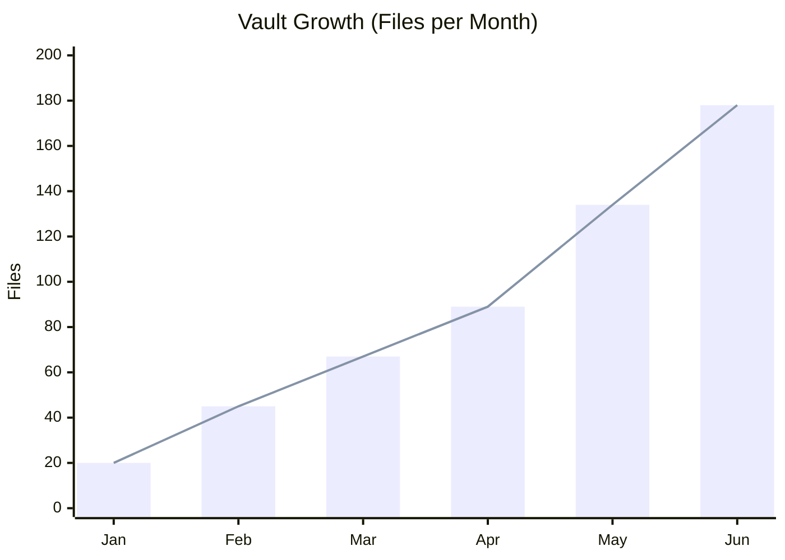
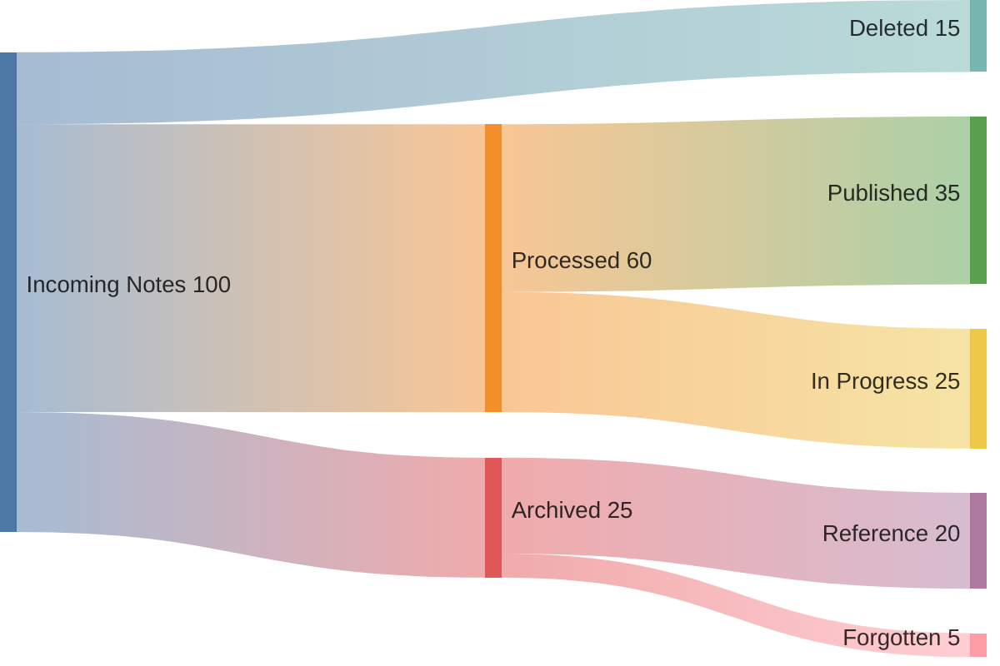
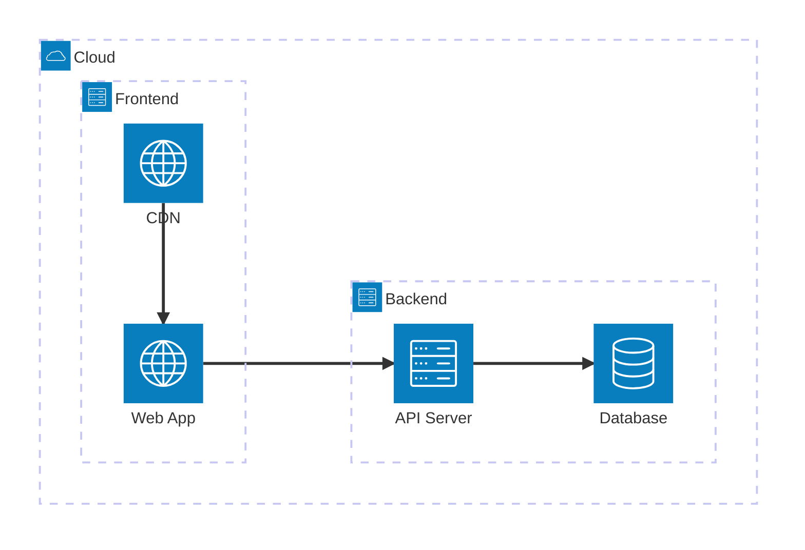
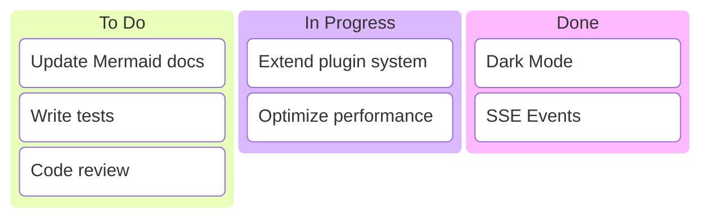
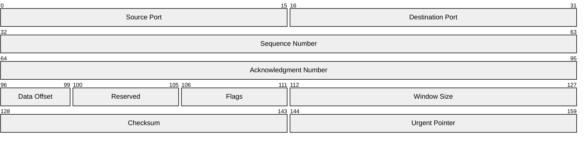
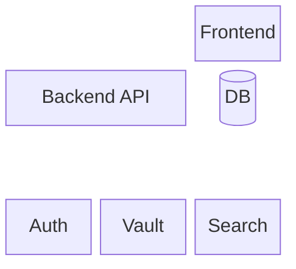

# Mermaid — Advanced Diagram Types

Beyond the core diagram types (Flowchart, Sequence, Gantt, Pie, Class, State, ER, Git, Journey, Mindmap), Mermaid offers additional specialized visualizations.

> [!info] Version
> These diagram types are available from Mermaid 11.x onwards. Some are experimental (beta).

---

## Timeline

Timeline diagrams display chronological events:

**Syntax:**
- `title` — Diagram heading
- `Date : Event` — Time point with description
- Multiple events per time point with additional `: Text` lines

---

## Quadrant Chart

Quadrant charts position items in a 2x2 grid:

**Syntax:**
- `x-axis` / `y-axis` — Axis labels with direction
- `quadrant-1` to `quadrant-4` — Quadrant labels (counter-clockwise from top-right)
- `"Label": [x, y]` — Position an item (values 0–1)

---

## XY Chart

XY charts for line and bar diagrams with numeric axes:

**Syntax:**
- `x-axis [...]` — Categories or numeric values
- `y-axis "Label" min --> max` — Value range
- `bar [...]` — Bar data
- `line [...]` — Line data

---

## Sankey Diagram

Sankey diagrams show flows and their quantities:

**Syntax:**
- Pure CSV format: `"Source","Target",Amount`
- Each line defines a flow
- Empty lines allowed for visual separation
- Band width corresponds to the amount

---

## Architecture Diagram

Architecture diagrams for system and infrastructure visualization:

**Syntax:**
- `group name(icon)[Label]` — Grouping
- `service name(icon)[Label] in group` — Service within a group
- `service:Side --> Side:service` — Connections (L/R/T/B)

---

## Kanban Board

Kanban boards for task management:

**Syntax:**
- `column["Label"]` — Define a column
- Indented `task["Label"]` — Tasks within the column

---

## Packet Diagram

Packet diagrams for network protocol structures:

**Syntax:**
- `Start-End: "Label"` — Bit range with label
- Visualizes network packet structures or binary formats

---

## Block Diagram

Block diagrams for hierarchical system structures:

**Syntax:**
- `columns N` — Set number of columns
- `Name["Label"]` — Block with custom label
- `space` — Empty cell
- `:N` — Block spanning N columns

---

## More Experimental Types

The following diagram types are available in newer Mermaid versions but may not yet be stable in all environments:

- **Radar Chart** (`radar-beta`) — Spider diagrams for multi-dimensional comparisons
- **Treemap** (`treemap`) — Hierarchical area visualization
- **Venn** (`venn`) — Set diagrams
- **Cynefin** (`cynefin-beta`) — Decision framework
- **Wardley Map** (`wardley`) — Strategic visualization

> [!info] Verify Syntax
> Test new diagram types in the [Mermaid Live Editor](https://mermaid.live/) — it always uses the latest Mermaid version.

---

## Notes on Advanced Types

> [!warning] Beta Status
> Diagrams with the `-beta` suffix (e.g. `xychart-beta`, `sankey-beta`) are experimental and may change in future versions.

> [!tip] Compatibility
> - Not all advanced types render identically in every Mermaid environment
> - Test your diagrams in Slatebase View mode
> - If issues arise: verify syntax in the [Mermaid Live Editor](https://mermaid.live/)

---

> [!todo] Exercise
> 1. Create a Timeline diagram of your project milestones
> 2. Build a Quadrant Chart for your feature prioritization
> 3. Try a Sankey diagram for your workflow

---

## Related Features

- [[Features/Mermaid Diagrams]] — Core diagram types (Flowchart, Sequence, Gantt, etc.)
- [[Features/Canvas]] — Freeform diagrams with drag & drop
- [[Basics/Markdown Syntax]] — Code blocks basics
