# Mermaid Diagrams

Mermaid lets you create diagrams directly in Markdown using a text-based syntax. Slatebase renders them automatically in View mode.

![[Screenshots/mermaid-diagramm.png]]

*A rendered Mermaid flowchart*

---

## Basic Syntax

Wrap your Mermaid code in a fenced code block with the language `mermaid`:

````markdown
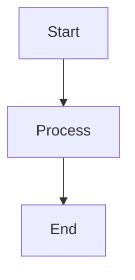
````

---

## Flowchart

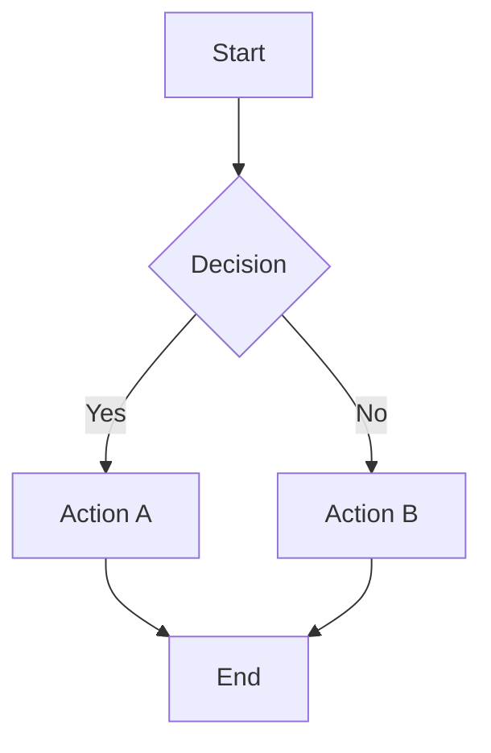

### Direction Options

| Code | Direction |
|------|-----------|
| `graph TD` | Top to bottom |
| `graph LR` | Left to right |
| `graph BT` | Bottom to top |
| `graph RL` | Right to left |

---

## Sequence Diagram

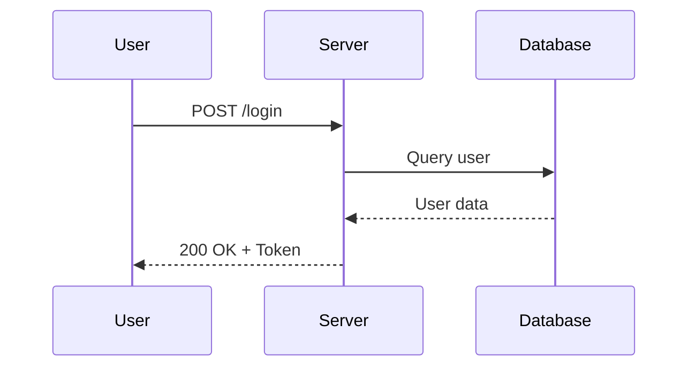

---

## Gantt Chart

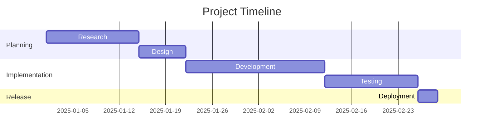

---

## Pie Chart

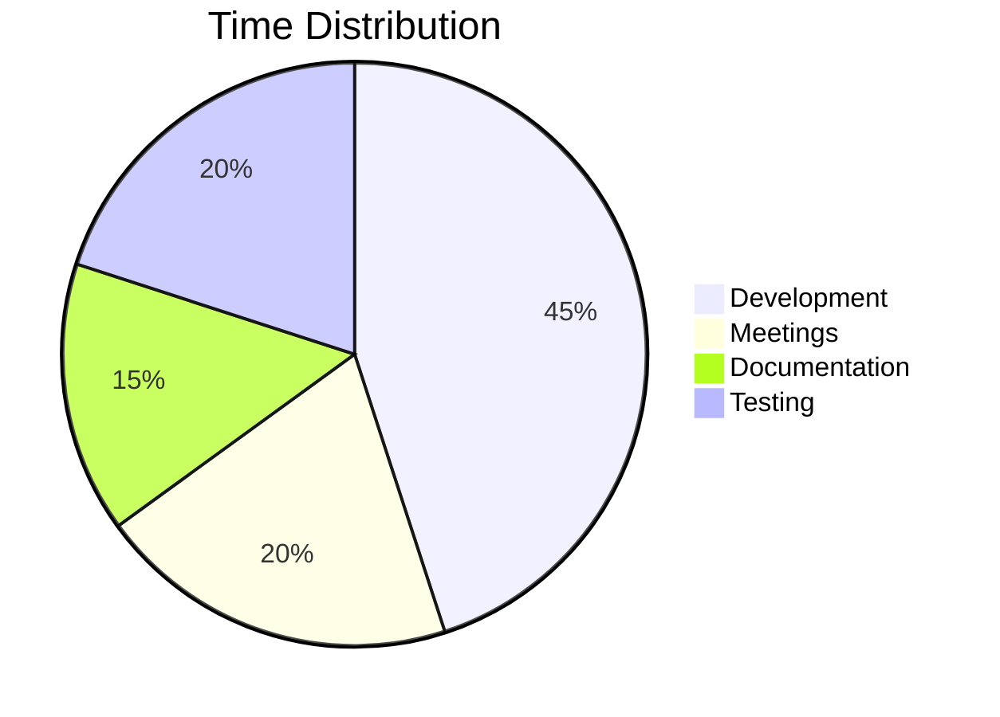

---

## Class Diagram

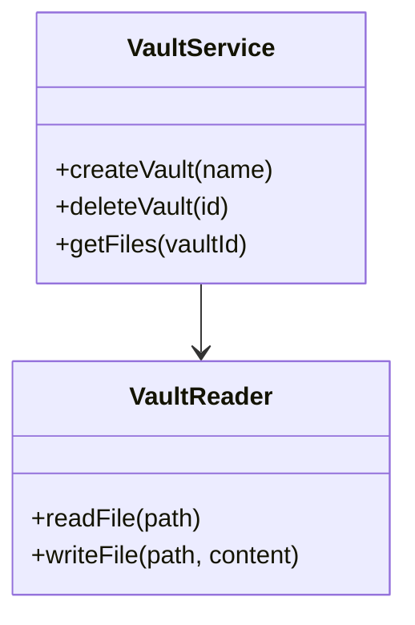

---

## State Diagram

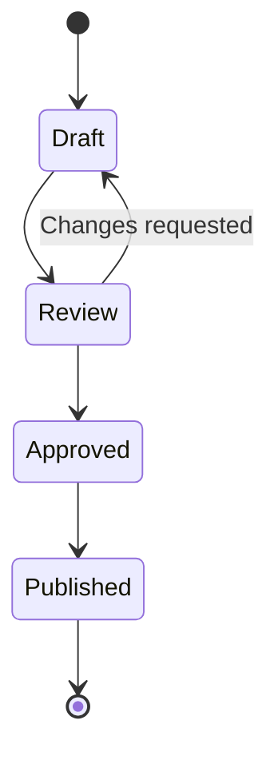

---

## Entity Relationship Diagram

ER diagrams describe database models and relationships between entities:

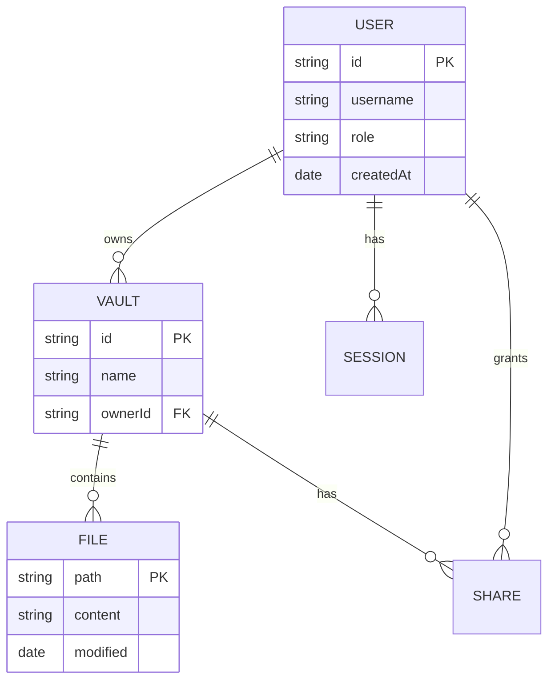

### Relationship Notation

| Syntax | Meaning |
|--------|---------|
| `\|\|--o{` | One to many |
| `\|\|--\|\|` | One to one |
| `}o--o{` | Many to many |
| `PK` / `FK` | Primary / Foreign key |

---

## Git Graph

Git graphs visualize branch and merge histories:

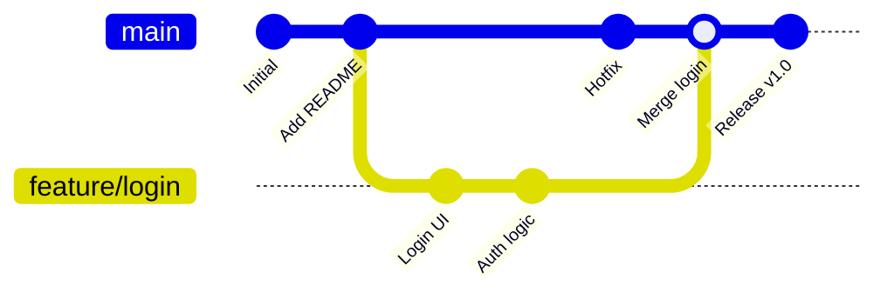

### Key Commands

- `commit` — Create a commit on the current branch
- `branch` — Create a new branch
- `checkout` — Switch branches
- `merge` — Merge a branch

---

## User Journey Diagram

User journey maps show a user's step-by-step experience:

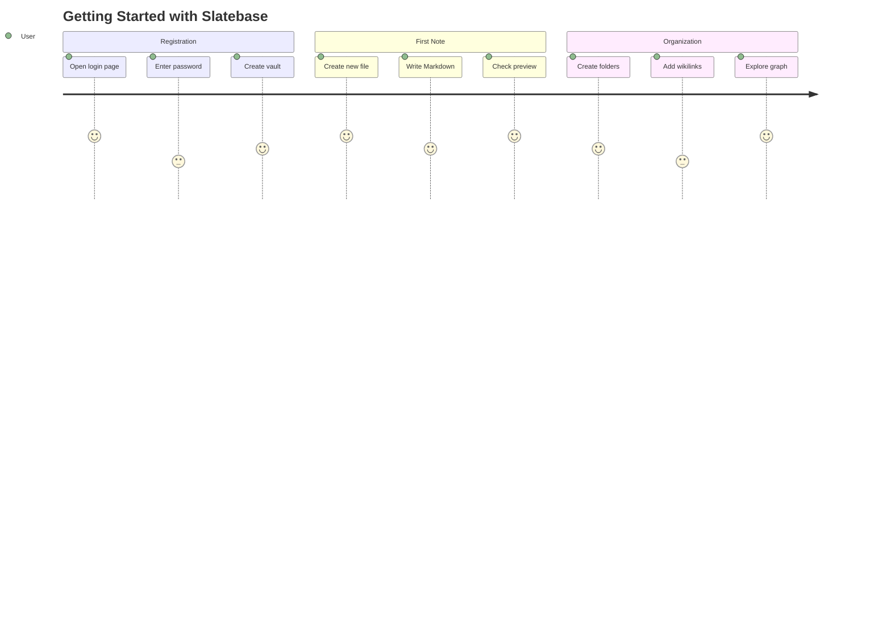

### Syntax

- `title` — Diagram heading
- `section` — Group steps into phases
- `Task: Rating: Actor` — Step with satisfaction score (1–5)

---

## Mindmap

Mindmaps for brainstorming and structuring ideas:

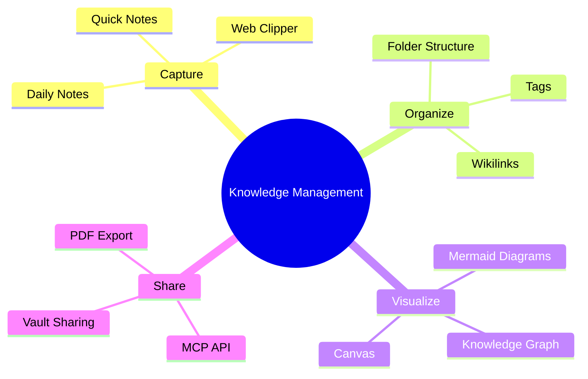

### Syntax

- `root((...))` — Central topic (circle shape)
- Indentation defines the hierarchy
- Each line is a node
- Shapes: `(...)` rounded, `[...]` square, `))...((` cloud

---

## Tips for Mermaid

> [!tip] Rendering
> - Diagrams are rendered in View mode (not visible in Edit mode)
> - A timeout of 5 seconds prevents infinite loops
> - If rendering fails, the raw code is shown as fallback
> - Diagrams adapt to the current theme (dark/light mode)

> [!warning] Limitations
> - Very large diagrams may render slowly
> - Not all Mermaid features are supported — stick to the common types listed here
> - Interactive elements (clicks, links) are not supported

---

> [!todo] Exercise
> Create a new file and add a flowchart that describes your morning routine:
> 1. Start with `graph TD`
> 2. Add at least 4 nodes
> 3. Include one decision (diamond shape `{Decision?}`)
> 4. Switch to View mode to see the rendered diagram

---

## Related Features

- [[Basics/Markdown Syntax]] — Code blocks basics
- [[Features/Canvas]] — Visual boards (alternative to diagrams)
- [[Features/Mermaid Advanced]] — More diagram types (Timeline, Sankey, XY Chart, etc.)
- [[Features/Embeds]] — Embedding content
