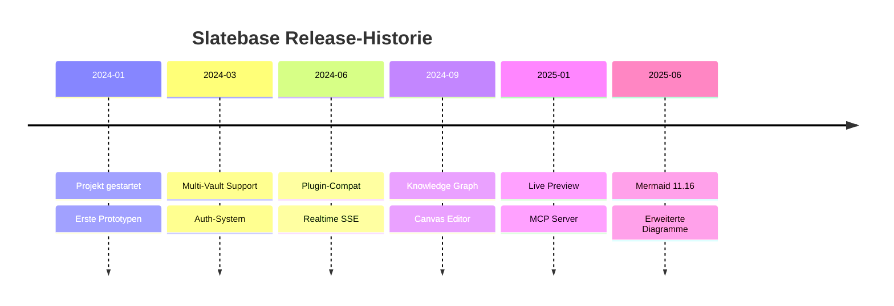
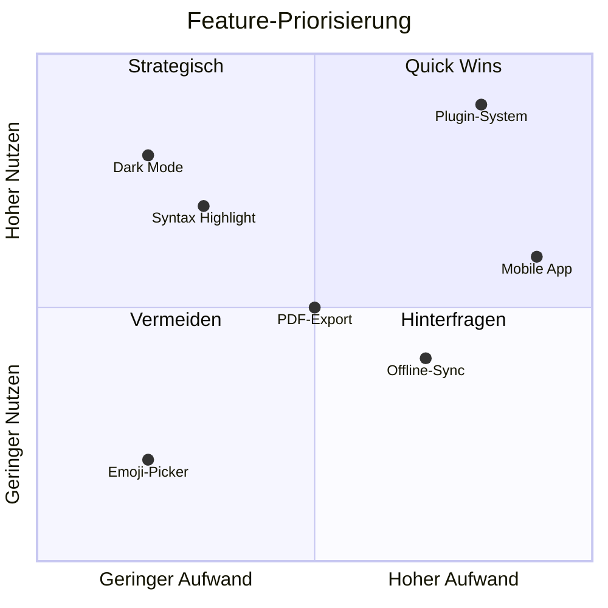
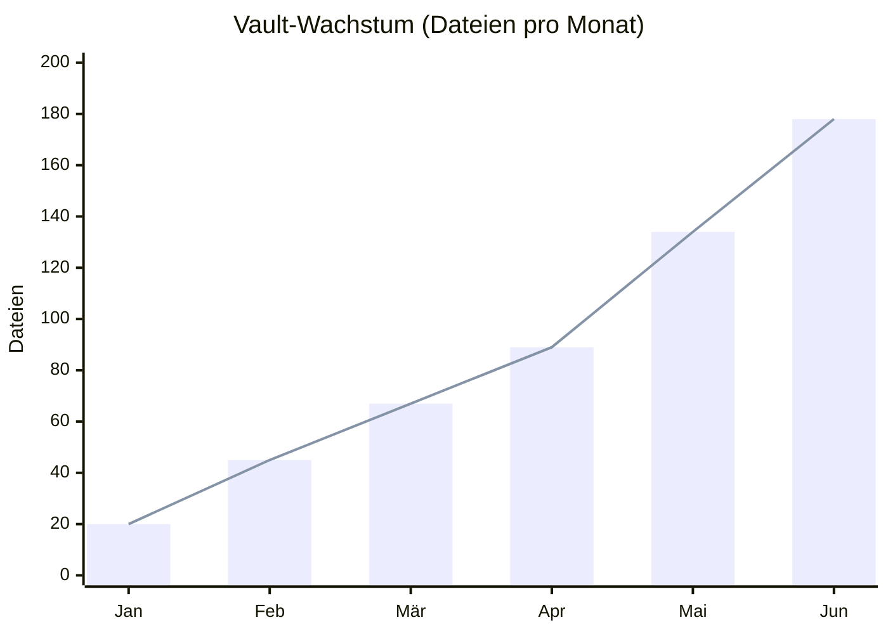
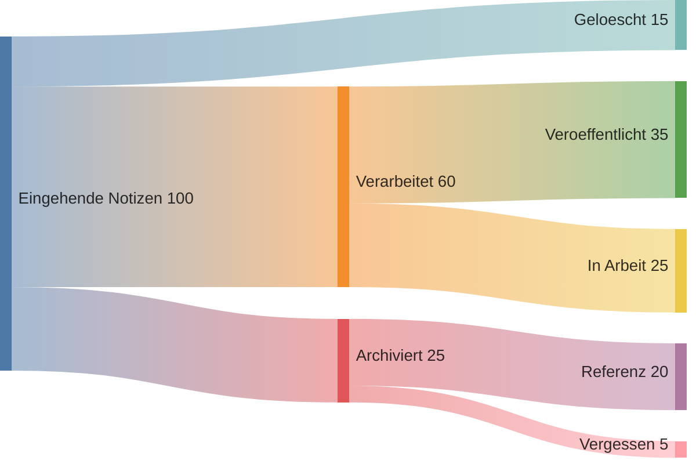
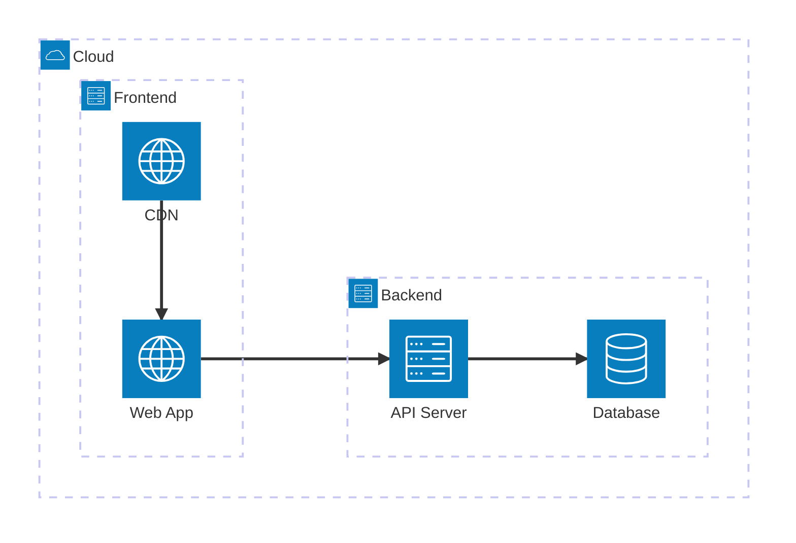
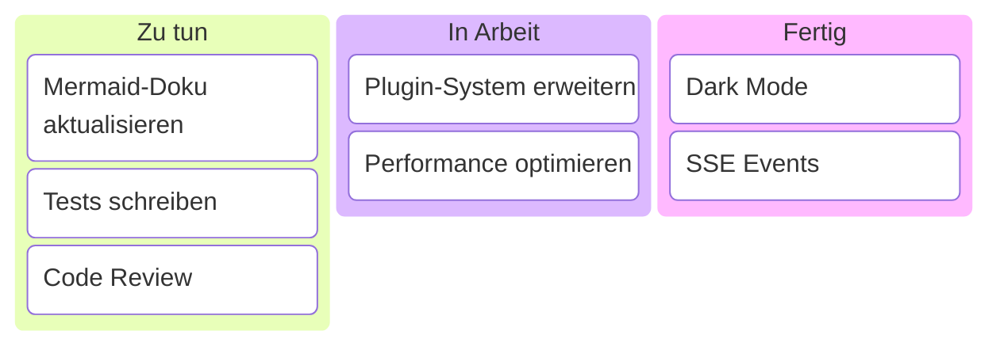
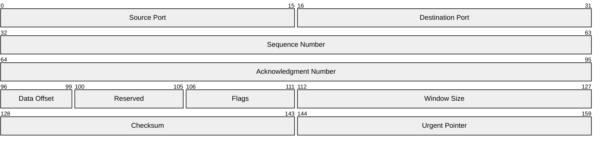
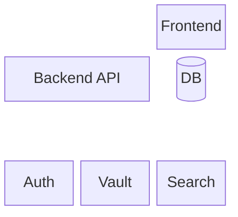

# Mermaid — Erweiterte Diagrammtypen

Neben den Kern-Diagrammtypen (Flowchart, Sequenz, Gantt, Pie, Klasse, State, ER, Git, Journey, Mindmap) bietet Mermaid weitere spezialisierte Visualisierungen.

> [!info] Version
> Diese Diagrammtypen sind ab Mermaid 11.x verfügbar. Einige sind experimentell (Beta).

---

## Timeline

Zeitachsen-Diagramme stellen chronologische Ereignisse dar:

**Syntax:**
- `title` — Überschrift
- `Datum : Ereignis` — Zeitpunkt mit Beschreibung
- Mehrere Ereignisse pro Zeitpunkt mit weiteren `: Text`-Zeilen

---

## Quadrant Chart

Quadrant-Charts positionieren Elemente in einem 2x2-Raster:

**Syntax:**
- `x-axis` / `y-axis` — Achsenbeschriftung mit Richtung
- `quadrant-1` bis `quadrant-4` — Quadranten-Labels (gegen Uhrzeigersinn ab oben-rechts)
- `"Label": [x, y]` — Element positionieren (Werte 0–1)

---

## XY Chart

XY-Charts für Linien- und Balkendiagramme mit numerischen Achsen:

**Syntax:**
- `x-axis [...]` — Kategorien oder Zahlenwerte
- `y-axis "Label" min --> max` — Wertebereich
- `bar [...]` — Balkendaten
- `line [...]` — Liniendaten

---

## Sankey-Diagramm

Sankey-Diagramme zeigen Flüsse und deren Mengen:

**Syntax:**
- Reines CSV-Format: `"Quelle","Ziel",Menge`
- Jede Zeile definiert einen Fluss
- Leerzeilen zur optischen Trennung erlaubt
- Die Breite der Bänder entspricht der Menge

---

## Architecture Diagram

Architektur-Diagramme für System- und Infrastruktur-Visualisierung:

**Syntax:**
- `group name(icon)[Label]` — Gruppierung
- `service name(icon)[Label] in group` — Dienst in einer Gruppe
- `service:Side --> Side:service` — Verbindungen (L/R/T/B)

---

## Kanban Board

Kanban-Boards für Aufgabenverwaltung:

**Syntax:**
- `column["Label"]` — Spalte definieren
- Eingerückte `task["Label"]` — Aufgaben in der Spalte

---

## Packet Diagram

Paket-Diagramme für Netzwerk-Protokoll-Strukturen:

**Syntax:**
- `Start-Ende: "Label"` — Bit-Bereich mit Beschriftung
- Zeigt die Struktur von Netzwerkpaketen oder Binärformaten

---

## Block Diagram

Block-Diagramme für hierarchische Systemstrukturen:

**Syntax:**
- `columns N` — Spaltenanzahl festlegen
- `Name["Label"]` — Block mit benutzerdefiniertem Label
- `space` — Leere Zelle
- `:N` — Block über N Spalten

---

## Weitere experimentelle Typen

Folgende Diagrammtypen sind in neueren Mermaid-Versionen verfügbar, aber möglicherweise noch nicht in allen Umgebungen stabil:

- **Radar Chart** (`radar-beta`) — Netzdiagramme für mehrdimensionale Vergleiche
- **Treemap** (`treemap`) — Hierarchische Flächenvisualisierung
- **Venn** (`venn`) — Mengendiagramme
- **Cynefin** (`cynefin-beta`) — Entscheidungs-Framework
- **Wardley Map** (`wardley`) — Strategische Visualisierung

> [!info] Syntax prüfen
> Teste neue Diagrammtypen im [Mermaid Live Editor](https://mermaid.live/) — dort wird immer die aktuellste Mermaid-Version genutzt.

---

## Hinweise zu erweiterten Typen

> [!warning] Beta-Status
> Diagramme mit dem Suffix `-beta` (z.B. `xychart-beta`, `sankey-beta`) sind experimentell und können sich in zukünftigen Versionen ändern.

> [!tip] Kompatibilität
> - Nicht alle erweiterten Typen werden in jeder Mermaid-Umgebung gleich gerendert
> - Teste deine Diagramme im Slatebase Viewer-Modus
> - Bei Problemen: Syntax im [Mermaid Live Editor](https://mermaid.live/) prüfen

---

> [!todo] Übung
> 1. Erstelle ein Timeline-Diagramm deiner Projektmeilensteine
> 2. Baue ein Quadrant-Chart für deine Feature-Priorisierung
> 3. Probiere ein Sankey-Diagramm für deinen Arbeits-Workflow

---

## Verwandte Features

- [[Features/Mermaid Diagramme]] — Kern-Diagrammtypen (Flowchart, Sequenz, Gantt, etc.)
- [[Features/Canvas]] — Freiform-Diagramme mit Drag & Drop
- [[Grundlagen/Markdown Syntax]] — Code-Blöcke allgemein
