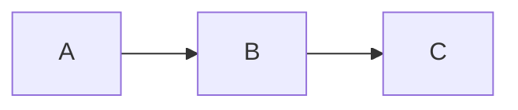
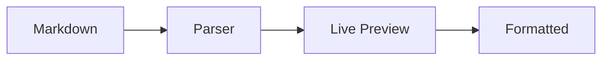

---
tags:
  - basics
---

# Markdown Syntax

Markdown is the formatting language you use to write in Slatebase. In Live Preview mode you see the formatted result directly as you type.

---

## Headings

Use `#` characters for headings (1–6 levels):

```markdown
# Heading 1
## Heading 2
### Heading 3
```

### How It Looks

The headings on this page are themselves live examples. Click on a heading in Live Preview — the `#` characters become visible.

> [!tip] Tip
> Use a maximum of 3 levels in a note. Too many levels make the structure confusing.

---

## Text Formatting

### Syntax

```markdown
**bold**
*italic*
~~strikethrough~~
==highlighted==
`inline code`
**_bold and italic_**
```

### Live Examples

Here are all formatting options rendered live:

- **Bold text** emphasizes important terms
- *Italic text* stresses individual words
- ~~Strikethrough text~~ marks something as deprecated
- ==Highlighted text== stands out with a background color
- `Inline code` for variables or commands
- **_Bold and italic_** for maximum emphasis

---

## Lists

### Unordered List

- First item
- Second item
  - Sub-item A
  - Sub-item B
- Third item

### Ordered List

1. Step one
2. Step two
   1. Sub-step
3. Step three

### Checklist

- [x] Done
- [x] Also done
- [ ] Still open
- [ ] Also open

> [!info] Checkboxes
> In Live Preview you can click checkboxes directly to toggle their state.

---

## Tables

Tables are created with pipe characters `|` and hyphens:

```markdown
| Name | Role | Status |
|------|:----:|-------:|
| Anna | Admin | Active |
| Ben  | User  | Inactive |
```

### Live Example

| Feature | Status | Priority |
|---------|:------:|---------:|
| Live Preview | Done | High |
| Mermaid | Done | Medium |
| Highlight | Done | Low |
| Canvas | Done | Medium |

> [!tip] Alignment
> `:---` = left-aligned, `:---:` = centered, `---:` = right-aligned

---

## Code Blocks

### Inline Code

Use backticks for code in running text: `variableName` or `npm install`.

### Fenced Code Block

````markdown
```javascript
function greet(name) {
  return `Hello, ${name}!`;
}
```
````

### Live Example

```javascript
function greet(name) {
  return `Hello, ${name}!`;
}
```

```css
.button {
  background: var(--accent);
  border-radius: 4px;
  padding: 8px 16px;
}
```

---

## Horizontal Rule

Three hyphens create a divider:

```markdown
---
```

You can see horizontal rules rendered live above and below on this page.

---

## Block Quotes

```markdown
> This is a quote.
> It can span multiple lines.
```

### Live Example

> This is a block quote. It works well for citations, annotations, or highlighted passages.
>
> Block quotes can also contain multiple paragraphs.

---

## Images

### Obsidian Embed Syntax

```markdown
![[image.png]]
![[Screenshots/dark-mode.png|400]]
```

### Standard Markdown Images

The classic Markdown image syntax is also supported:

```markdown


```

Both variants render the image inline in the preview. External URLs are loaded directly, vault-relative paths through the file API.

> [!info] Captions
> Use italic text directly below the image:
> ```
> ![[diagram.png]]
> *Figure 1: Architecture overview*
> ```

---

## Links

### External Links

[Slatebase on GitHub](https://github.com) — Standard Markdown syntax.

```markdown
[Link text](https://example.com)
```

### Internal Links (Wikilinks)

For linking between notes: [[Features/Wikilinks|Wikilinks]] — more in the Wikilinks guide.

```markdown
[[Filename]]
[[Folder/File|Display name]]
```

---

## Highlight

The `==highlight==` syntax marks text with a background color:

```markdown
This has ==highlighted text== in a sentence.
```

### Live Example

The highlight feature is especially useful for:
- ==Key terms== in long texts
- ==Keywords== when studying
- ==Changes== in reviews

> [!tip] Dark Mode
> The highlight color automatically adapts to Dark/Light mode.

---

## Callouts

Callouts are special block quotes with a type marker:

```markdown
> [!tip] Title
> Callout content
```

### Live Examples

> [!note] Note
> General information or annotation.

> [!warning] Warning
> Something that requires attention.

> [!tip] Tip
> A helpful suggestion.

> [!danger] Danger
> Critical information — caution required.

More: [[Features/Callouts|Callouts Guide]]

---

## Mermaid Diagrams

Diagrams directly in Markdown with the `mermaid` language marker:

````markdown

````

### Live Example



More diagram types: [[Features/Mermaid Diagrams|Mermaid Guide]]

---

> [!todo] Exercise
> Create a new file in this vault and try the following elements:
> 1. A heading with `##`
> 2. A ==highlighted== sentence
> 3. A table with 3 columns
> 4. A code block with any language
> 5. A checklist with 3 items
>
> In Live Preview mode you see the result immediately.

---

## Related Pages

- [[Basics/Editor and Viewer|Editor and Viewer]] — Edit and Preview mode
- [[Features/Callouts|Callouts]] — Special callout boxes
- [[Features/Embeds|Embeds]] — Embed images and files
- [[Features/Mermaid Diagrams|Mermaid Diagrams]] — Diagrams in Markdown
