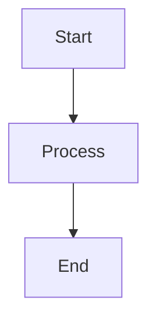
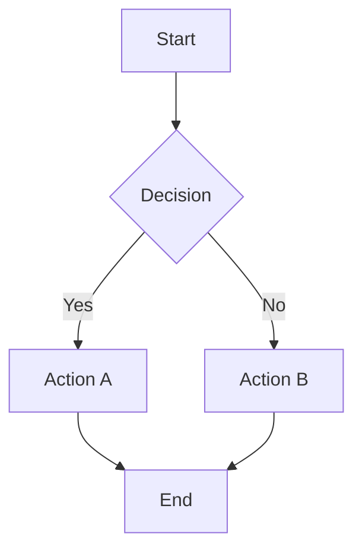
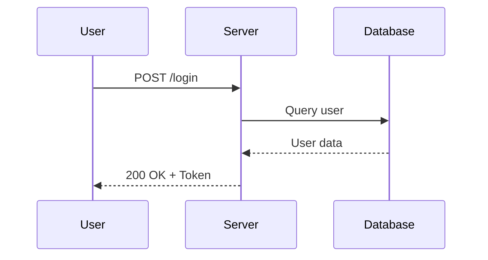
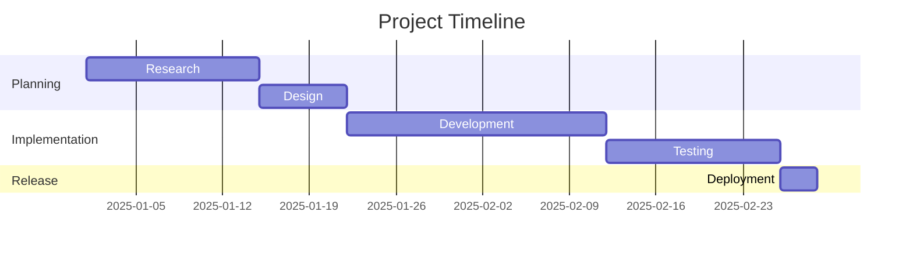
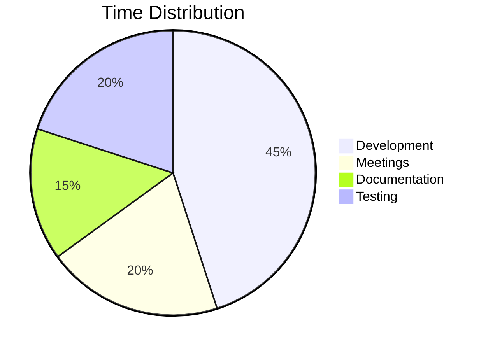
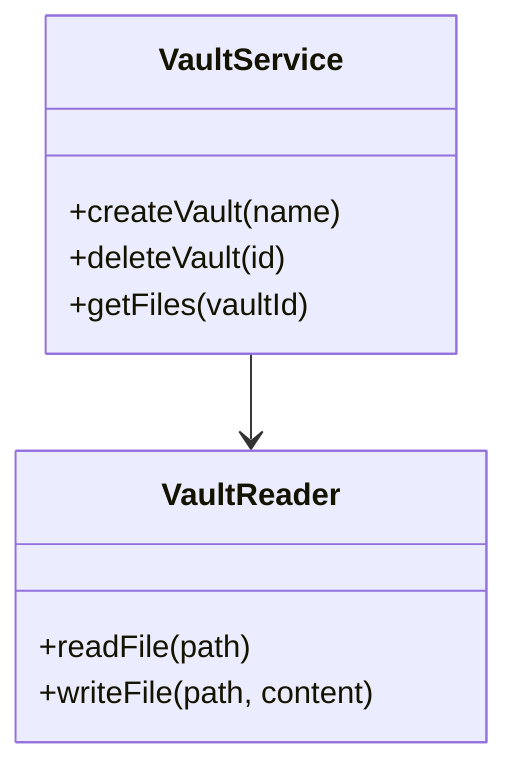
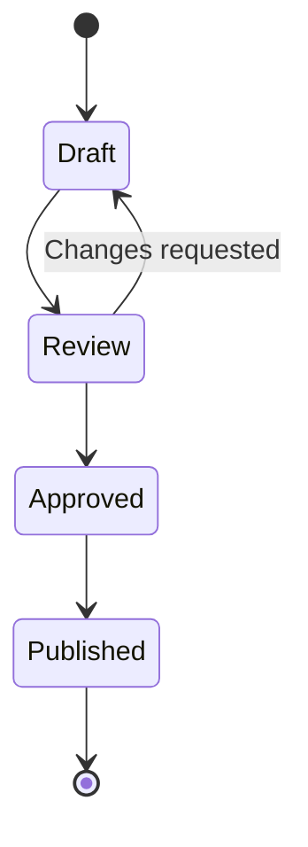

# Mermaid Diagrams

Mermaid lets you create diagrams directly in Markdown using a text-based syntax. Slatebase renders them automatically in View mode.

![[Screenshots/mermaid-diagramm.png]]

*A rendered Mermaid flowchart*

---

## Basic Syntax

Wrap your Mermaid code in a fenced code block with the language `mermaid`:

````markdown

````

---

## Flowchart



### Direction Options

| Code | Direction |
|------|-----------|
| `graph TD` | Top to bottom |
| `graph LR` | Left to right |
| `graph BT` | Bottom to top |
| `graph RL` | Right to left |

---

## Sequence Diagram



---

## Gantt Chart



---

## Pie Chart



---

## Class Diagram



---

## State Diagram



---

## Tips for Mermaid

> [!tip] Rendering
> - Diagrams are rendered in View mode (not visible in Edit mode)
> - A timeout of 5 seconds prevents infinite loops
> - If rendering fails, the raw code is shown as fallback
> - Diagrams adapt to the current theme (dark/light mode)

> [!warning] Limitations
> - Very large diagrams may render slowly
> - Not all Mermaid features are supported — stick to the common types listed here
> - Interactive elements (clicks, links) are not supported

---

> [!todo] Exercise
> Create a new file and add a flowchart that describes your morning routine:
> 1. Start with `graph TD`
> 2. Add at least 4 nodes
> 3. Include one decision (diamond shape `{Decision?}`)
> 4. Switch to View mode to see the rendered diagram

---

## Related Features

- [[Basics/Markdown Syntax]] — Code blocks basics
- [[Features/Canvas]] — Visual boards (alternative to diagrams)
- [[Features/Embeds]] — Embedding content
