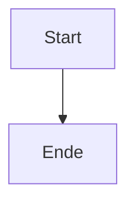
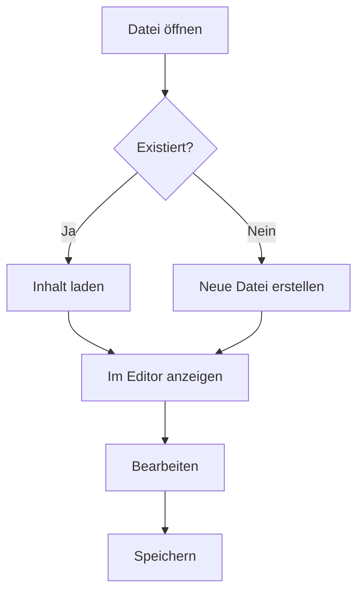
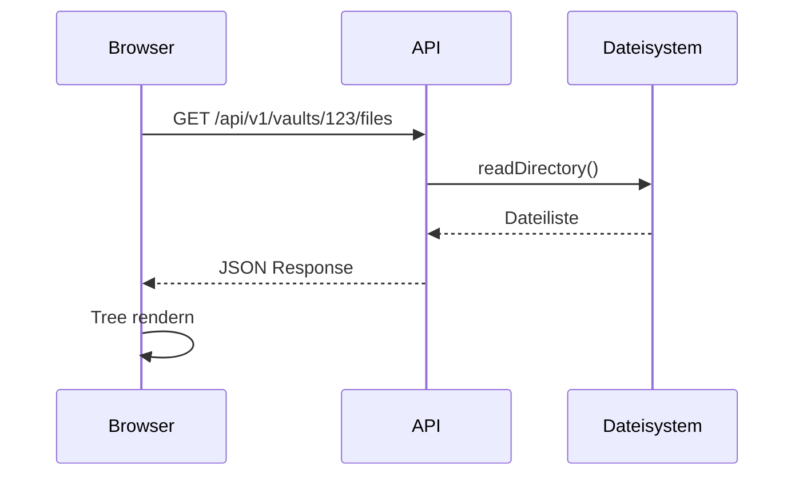
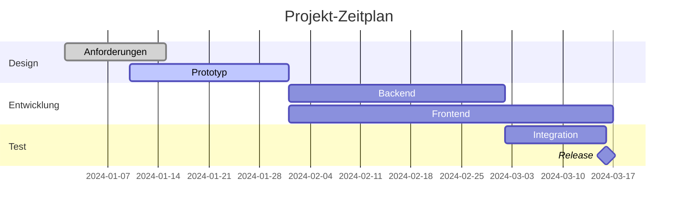
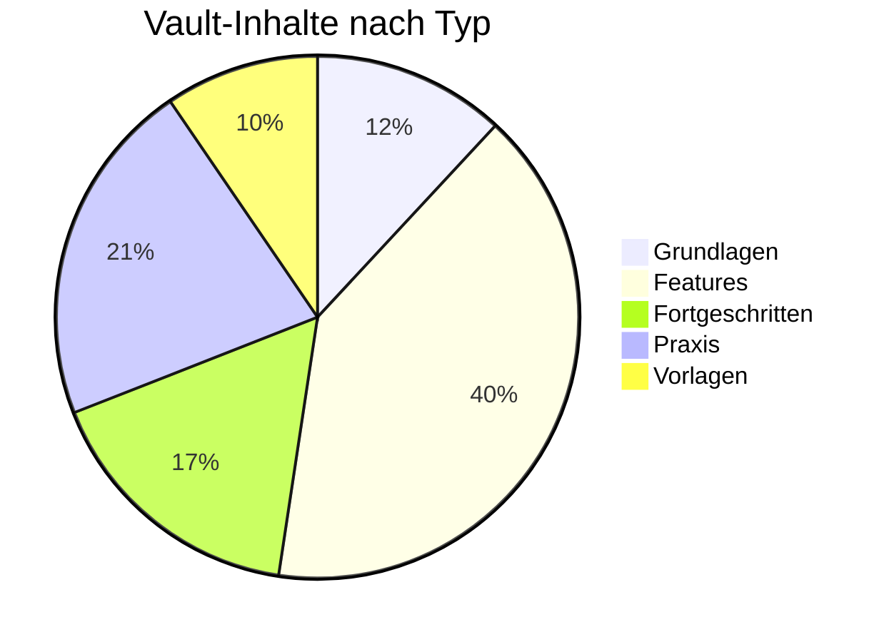
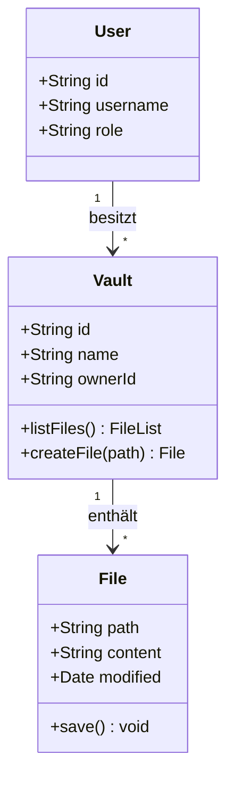
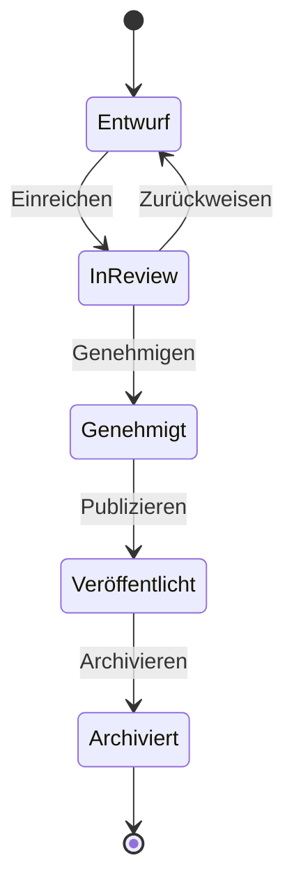
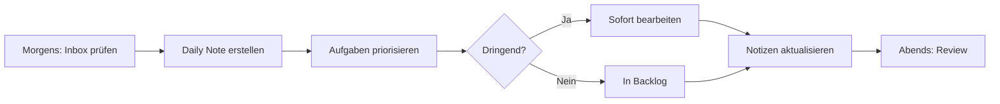

# Mermaid Diagramme

Mit Mermaid erstellst du Diagramme direkt im Markdown — ohne externe Tools oder Bild-Dateien. Slatebase rendert Mermaid-Code automatisch als interaktive SVG-Grafiken.

![[Screenshots/mermaid-diagramm.png]]

*Ein gerendertes Mermaid-Flowchart*

---

## Grundsyntax

Mermaid-Code wird in einem Fenced-Code-Block mit dem Sprach-Marker `mermaid` geschrieben:

````markdown

````

Im Viewer-Modus wird der Code als Diagramm gerendert.

---

## Flowchart (Flussdiagramm)

Flowcharts zeigen Abläufe und Entscheidungen:



**Syntax-Elemente:**
- `graph TD` — Top-Down Richtung (auch: `LR` für links-nach-rechts)
- `[Text]` — Rechteck-Knoten
- `{Text}` — Rauten-Knoten (Entscheidung)
- `-->` — Pfeil
- `-->|Label|` — Pfeil mit Beschriftung

---

## Sequenzdiagramm

Sequenzdiagramme zeigen die Kommunikation zwischen Komponenten:



**Syntax-Elemente:**
- `participant` — Beteiligte definieren
- `->>` — Nachricht (durchgezogene Linie)
- `-->>` — Antwort (gestrichelte Linie)
- `Note over A,B: Text` — Notiz über Beteiligten

---

## Gantt-Diagramm

Gantt-Charts visualisieren Zeitpläne und Projektphasen:



**Syntax-Elemente:**
- `dateFormat` — Datumsformat festlegen
- `section` — Phasen gruppieren
- `:done` / `:active` — Status-Markierung
- `after` — Abhängigkeit definieren

---

## Pie-Chart (Kreisdiagramm)

Kreisdiagramme für Anteile und Verteilungen:



**Syntax-Elemente:**
- `pie title Titel` — Überschrift
- `"Label" : Wert` — Segment mit Anteil

---

## Klassendiagramm

Klassendiagramme für Datenmodelle und Beziehungen:



**Syntax-Elemente:**
- `class Name { }` — Klasse mit Attributen
- `+` / `-` / `#` — public/private/protected
- `-->` — Beziehung mit Kardinalität

---

## State-Diagramm (Zustandsautomat)

Zustandsdiagramme für Lebenszyklen und Status-Übergänge:



**Syntax-Elemente:**
- `[*]` — Start-/Endpunkt
- `-->` — Übergang
- `: Label` — Auslöser des Übergangs

---

## Rendering-Hinweise

- **Theme:** Mermaid passt sich automatisch an Dark/Light Mode an
- **Timeout:** Komplexe Diagramme haben ein 5-Sekunden-Timeout
- **Fehler:** Bei Syntaxfehlern wird eine Fehlermeldung statt des Diagramms angezeigt
- **Lazy Loading:** Mermaid wird erst geladen, wenn ein Diagramm im Viewport sichtbar ist

> [!warning] Komplexität
> Sehr große Diagramme (50+ Knoten) können langsam rendern. Teile sie in mehrere kleinere Diagramme auf.

---

## Praktisches Beispiel

Erstelle eine Datei `Mein Workflow.md` mit einem Flowchart deines täglichen Arbeitsablaufs:

````markdown
# Mein täglicher Workflow


````

Wechsle in den Viewer-Modus — das Diagramm wird als SVG gerendert.

---

> [!tip] Mermaid Live Editor
> Für komplexe Diagramme lohnt sich der [Mermaid Live Editor](https://mermaid.live/) zum Entwickeln. Den fertigen Code kopierst du dann in deine Notiz.

> [!todo] Übung
> 1. Erstelle eine neue Datei und füge einen Mermaid-Flowchart ein
> 2. Wechsle in den Viewer-Modus — wird das Diagramm gerendert?
> 3. Probiere einen anderen Diagramm-Typ (Sequenz oder Pie)
> 4. Erzeuge absichtlich einen Syntaxfehler und beobachte die Fehlermeldung

---

## Verwandte Features

- [[Features/Callouts]] — Weitere visuelle Markdown-Elemente
- [[Features/Embeds]] — Bilder und Dateien einbetten
- [[Grundlagen/Markdown Syntax]] — Fenced Code Blocks allgemein
- [[Features/Canvas]] — Freiform-Diagramme mit Nodes und Edges
