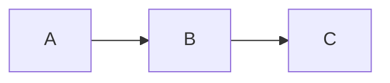
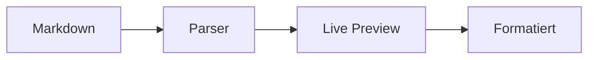

---
tags:
  - grundlagen
---

# Markdown Syntax

Markdown ist die Formatierungssprache, mit der du in Slatebase schreibst. Im Live-Preview-Modus siehst du das formatierte Ergebnis direkt beim Tippen.

---

## Überschriften

Verwende `#`-Zeichen für Überschriften (1–6 Ebenen):

```markdown
# Überschrift 1
## Überschrift 2
### Überschrift 3
```

### So sieht es aus

Die Überschriften dieser Seite sind selbst Live-Beispiele. Klicke auf eine Überschrift im Live-Preview — die `#`-Zeichen werden sichtbar.

> [!tip] Tipp
> Verwende maximal 3 Ebenen in einer Notiz. Zu viele Ebenen machen die Struktur unübersichtlich.

---

## Textformatierung

### Syntax

```markdown
**fett**
*kursiv*
~~durchgestrichen~~
==hervorgehoben==
`Inline-Code`
**_fett und kursiv_**
```

### Live-Beispiele

Hier sind alle Formatierungen live gerendert:

- **Fetter Text** hebt wichtige Begriffe hervor
- *Kursiver Text* betont einzelne Wörter
- ~~Durchgestrichener Text~~ markiert Veraltetes
- ==Hervorgehobener Text== sticht farblich heraus
- `Inline-Code` für Variablen oder Befehle
- **_Fett und kursiv_** für maximale Betonung

---

## Listen

### Ungeordnete Liste

- Erster Punkt
- Zweiter Punkt
  - Unterpunkt A
  - Unterpunkt B
- Dritter Punkt

### Geordnete Liste

1. Schritt eins
2. Schritt zwei
   1. Unter-Schritt
3. Schritt drei

### Checkliste

- [x] Erledigt
- [x] Auch erledigt
- [ ] Noch offen
- [ ] Ebenfalls offen

> [!info] Checkboxen
> Im Live-Preview kannst du Checkboxen direkt anklicken, um den Status zu wechseln.

---

## Tabellen

Tabellen werden mit Pipe-Zeichen `|` und Bindestrichen erstellt:

```markdown
| Name | Rolle | Status |
|------|:-----:|-------:|
| Anna | Admin | Aktiv |
| Ben  | User  | Inaktiv |
```

### Live-Beispiel

| Feature | Status | Priorität |
|---------|:------:|----------:|
| Live Preview | Fertig | Hoch |
| Mermaid | Fertig | Mittel |
| Highlight | Fertig | Niedrig |
| Canvas | Fertig | Mittel |

> [!tip] Ausrichtung
> `:---` = linksbündig, `:---:` = zentriert, `---:` = rechtsbündig

---

## Code-Blöcke

### Inline-Code

Verwende Backticks für Code im Fließtext: `variableName` oder `npm install`.

### Fenced Code-Block

````markdown
```javascript
function greet(name) {
  return `Hallo, ${name}!`;
}
```
````

### Live-Beispiel

```javascript
function greet(name) {
  return `Hallo, ${name}!`;
}
```

```css
.button {
  background: var(--accent);
  border-radius: 4px;
  padding: 8px 16px;
}
```

---

## Horizontale Linie

Drei Bindestriche erzeugen eine Trennlinie:

```markdown
---
```

Oben und unten auf dieser Seite siehst du horizontale Linien live gerendert.

---

## Blockzitate

```markdown
> Dies ist ein Zitat.
> Es kann mehrere Zeilen umfassen.
```

### Live-Beispiel

> Dies ist ein Blockzitat. Es eignet sich für Zitate, Anmerkungen oder hervorgehobene Abschnitte.
> 
> Blockzitate können auch mehrere Absätze enthalten.

---

## Bilder

### Obsidian-Embed-Syntax

```markdown
![[bild.png]]
![[Screenshots/dark-mode.png|400]]
```

### Standard Markdown-Bilder

Auch die klassische Markdown-Bild-Syntax wird unterstützt:

```markdown


```

Beide Varianten rendern das Bild inline in der Vorschau. Externe URLs werden direkt geladen, vault-relative Pfade über die Datei-API.

> [!info] Bildunterschriften
> Verwende kursiven Text direkt unter dem Bild:
> ```
> ![[diagramm.png]]
> *Abbildung 1: Architektur-Übersicht*
> ```

---

## Links

### Externe Links

[Slatebase auf GitHub](https://github.com) — Standard Markdown-Syntax.

```markdown
[Linktext](https://example.com)
```

### Interne Links (Wikilinks)

Für Verlinkungen zwischen Notizen: [[Features/Wikilinks|Wikilinks]] — mehr dazu im Wikilinks-Guide.

```markdown
[[Dateiname]]
[[Ordner/Datei|Anzeigename]]
```

---

## Hervorhebung (Highlight)

Die `==Highlight==`-Syntax markiert Text mit einer Hintergrundfarbe:

```markdown
Das ist ==hervorgehobener Text== in einem Satz.
```

### Live-Beispiel

Das Highlight-Feature ist besonders nützlich für:
- ==Wichtige Begriffe== in langen Texten
- ==Schlüsselwörter== beim Lernen
- ==Änderungen== in Reviews markieren

> [!tip] Dark Mode
> Die Highlight-Farbe passt sich automatisch an Dark/Light Mode an.

---

## Callouts

Callouts sind spezielle Blockzitate mit Typ-Markierung:

```markdown
> [!tip] Überschrift
> Inhalt des Callouts
```

### Live-Beispiele

> [!note] Hinweis
> Allgemeine Information oder Anmerkung.

> [!warning] Warnung
> Etwas, das Aufmerksamkeit erfordert.

> [!tip] Tipp
> Ein hilfreicher Vorschlag.

> [!danger] Gefahr
> Kritische Information — Vorsicht geboten.

Mehr dazu: [[Features/Callouts|Callouts-Guide]]

---

## Mermaid-Diagramme

Diagramme direkt im Markdown mit dem `mermaid`-Sprach-Marker:

````markdown

````

### Live-Beispiel



Mehr Diagramm-Typen: [[Features/Mermaid Diagramme|Mermaid-Guide]]

---

> [!todo] Übung
> Erstelle eine neue Datei in diesem Vault und probiere folgende Elemente aus:
> 1. Eine Überschrift mit `##`
> 2. Einen ==hervorgehobenen== Satz
> 3. Eine Tabelle mit 3 Spalten
> 4. Einen Code-Block mit einer beliebigen Sprache
> 5. Eine Checkliste mit 3 Punkten
>
> Im Live-Preview-Modus siehst du das Ergebnis sofort.

---

## Verwandte Seiten

- [[Grundlagen/Editor und Viewer|Editor und Viewer]] — Edit- und Preview-Modus
- [[Features/Callouts|Callouts]] — Spezielle Hinweisboxen
- [[Features/Embeds|Embeds]] — Bilder und Dateien einbetten
- [[Features/Mermaid Diagramme|Mermaid-Diagramme]] — Diagramme in Markdown
